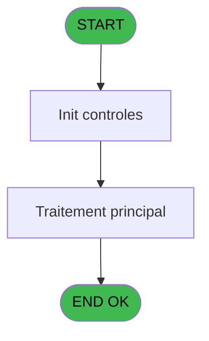
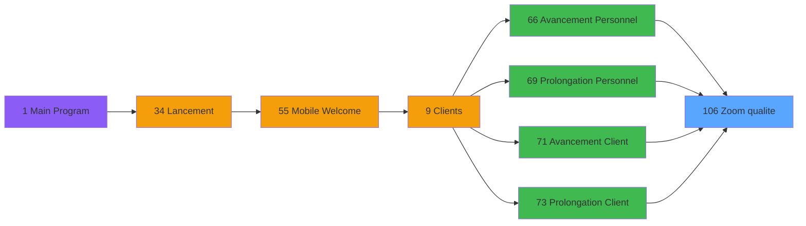

# WEL IDE 106 - Zoom qualite

> **Analyse**: Phases 1-4 2026-02-03 21:48 -> 21:48 (17s) | Assemblage 21:48
> **Pipeline**: V7.2 Enrichi
> **Structure**: 4 onglets (Resume | Ecrans | Donnees | Connexions)

<!-- TAB:Resume -->

## 1. FICHE D'IDENTITE

| Attribut | Valeur |
|----------|--------|
| Projet | WEL |
| IDE Position | 106 |
| Nom Programme | Zoom qualite |
| Fichier source | `Prg_106.xml` |
| Dossier IDE | Zoom |
| Taches | 1 (1 ecrans visibles) |
| Tables modifiees | 0 |
| Programmes appeles | 1 |

## 2. DESCRIPTION FONCTIONNELLE

**Zoom qualite** assure la gestion complete de ce processus, accessible depuis [  Avancement Personnel (IDE 66)](WEL-IDE-66.md), [  Prolongation Personnel (IDE 69)](WEL-IDE-69.md), [   Avancement Client (IDE 71)](WEL-IDE-71.md), [   Prolongation Client (IDE 73)](WEL-IDE-73.md).

Le flux de traitement s'organise en **1 blocs fonctionnels** :

- **Consultation** (1 tache) : ecrans de recherche, selection et consultation

**Logique metier** : 1 regles identifiees couvrant conditions metier.

## 3. BLOCS FONCTIONNELS

### 3.1 Consultation (1 tache)

Ecrans de recherche et consultation.

---

#### 106 - Zoom qualite [[ECRAN]](#ecran-t1)

**Role** : Selection par l'operateur : Zoom qualite.
**Ecran** : 1313 x 744 DLU | [Voir mockup](#ecran-t1)
**Variables liees** : B (P.Qualite), C (P.Complement qualite)

## 5. REGLES METIER

1 regles identifiees:

### Autres (1 regles)

#### [RM-001] Si [I] vaut 'P' alors 'P', sinon 'C'

| Element | Detail |
|---------|--------|
| **Condition** | `[I]='P'` |
| **Si vrai** | 'P' |
| **Si faux** | 'C') |
| **Expression source** | Expression 13 : `IF([I]='P','P','C')` |
| **Exemple** | Si [I]='P' → 'P'. Sinon → 'C') |

## 6. CONTEXTE

- **Appele par**: [  Avancement Personnel (IDE 66)](WEL-IDE-66.md), [  Prolongation Personnel (IDE 69)](WEL-IDE-69.md), [   Avancement Client (IDE 71)](WEL-IDE-71.md), [   Prolongation Client (IDE 73)](WEL-IDE-73.md)
- **Appelle**: 1 programmes | **Tables**: 1 (W:0 R:1 L:0) | **Taches**: 1 | **Expressions**: 13

<!-- TAB:Ecrans -->

## 8. ECRANS

### 8.1 Forms visibles (1 / 1)

| # | Position | Tache | Nom | Type | Largeur | Hauteur | Bloc |
|---|----------|-------|-----|------|---------|---------|------|
| 1 | 106 | 106 | Zoom qualite | Type0 | 1313 | 744 | Consultation |

### 8.2 Mockups Ecrans

---

#### 106 - Zoom qualite
**Tache** : [106](#t1) | **Type** : Type0 | **Dimensions** : 1313 x 744 DLU
**Bloc** : Consultation | **Titre IDE** : Zoom qualite

<!-- FORM-DATA:
{
    "width":  1313,
    "vFactor":  100,
    "type":  "Type0",
    "hFactor":  100,
    "controls":  [
                     {
                         "x":  182,
                         "type":  "label",
                         "var":  "",
                         "y":  0,
                         "w":  1130,
                         "fmt":  "",
                         "name":  "",
                         "h":  66,
                         "color":  "212",
                         "text":  "QUALITY",
                         "parent":  null
                     },
                     {
                         "x":  508,
                         "type":  "label",
                         "var":  "",
                         "y":  98,
                         "w":  243,
                         "fmt":  "",
                         "name":  "",
                         "h":  44,
                         "color":  "",
                         "text":  "QUALITY",
                         "parent":  null
                     },
                     {
                         "x":  580,
                         "type":  "label",
                         "var":  "",
                         "y":  636,
                         "w":  173,
                         "fmt":  "",
                         "name":  "SELECT",
                         "h":  88,
                         "color":  "",
                         "text":  "SELECT",
                         "parent":  null
                     },
                     {
                         "x":  508,
                         "type":  "table",
                         "var":  "",
                         "name":  "",
                         "titleH":  12,
                         "color":  "",
                         "w":  243,
                         "y":  139,
                         "fmt":  "",
                         "parent":  null,
                         "text":  "",
                         "rowH":  44,
                         "h":  443,
                         "cols":  [
                                      {
                                          "title":  "vol_code_vol",
                                          "layer":  1,
                                          "w":  235
                                      }
                                  ],
                         "rows":  1
                     },
                     {
                         "x":  0,
                         "type":  "image",
                         "var":  "",
                         "y":  0,
                         "w":  173,
                         "fmt":  "",
                         "name":  "RETOUR",
                         "h":  66,
                         "color":  "226",
                         "text":  "",
                         "parent":  null
                     },
                     {
                         "x":  749,
                         "type":  "button",
                         "var":  "",
                         "y":  97,
                         "w":  56,
                         "fmt":  "",
                         "name":  "",
                         "h":  243,
                         "color":  "",
                         "text":  "",
                         "parent":  null
                     },
                     {
                         "x":  511,
                         "type":  "edit",
                         "var":  "",
                         "y":  144,
                         "w":  112,
                         "fmt":  "U6",
                         "name":  "qua_code_qualite",
                         "h":  36,
                         "color":  "",
                         "text":  "",
                         "parent":  6
                     },
                     {
                         "x":  629,
                         "type":  "edit",
                         "var":  "",
                         "y":  144,
                         "w":  112,
                         "fmt":  "",
                         "name":  "clo_libelle",
                         "h":  36,
                         "color":  "",
                         "text":  "",
                         "parent":  6
                     },
                     {
                         "x":  749,
                         "type":  "button",
                         "var":  "",
                         "y":  339,
                         "w":  56,
                         "fmt":  "",
                         "name":  "",
                         "h":  243,
                         "color":  "",
                         "text":  "",
                         "parent":  null
                     }
                 ],
    "taskId":  "106",
    "height":  744
}
-->

<strong>Champs : 2 champs</strong>

| Pos (x,y) | Nom | Variable | Type |
|-----------|-----|----------|------|
| 511,144 | qua_code_qualite | - | edit |
| 629,144 | clo_libelle | - | edit |

<strong>Boutons : 2 boutons</strong>

| Bouton | Pos (x,y) | Action |
|--------|-----------|--------|
| (sans nom) | 749,97 | Action declenchee |
| (sans nom) | 749,339 | Action declenchee |

## 9. NAVIGATION

Ecran unique: **Zoom qualite**

### 9.3 Structure hierarchique (1 tache)

| Position | Tache | Type | Dimensions | Bloc |
|----------|-------|------|------------|------|
| **106.1** | [**Zoom qualite** (106)](#t1) [mockup](#ecran-t1) | - | 1313x744 | Consultation |

### 9.4 Algorigramme

> **Legende**: Vert = START/END OK | Rouge = END KO | Bleu = Decisions
> *Algorigramme auto-genere. Utiliser `/algorigramme` pour une synthese metier detaillee.*

<!-- TAB:Donnees -->

## 10. TABLES

### Tables utilisees (1)

| ID | Nom | Description | Type | R | W | L | Usages |
|----|-----|-------------|------|---|---|---|--------|
| 120 | tables_qualites__qua |  | DB | R |   |   | 1 |

### Colonnes par table (1 / 1 tables avec colonnes identifiees)

Table 120 - tables_qualites__qua (R) - 1 usages

| Lettre | Variable | Acces | Type |
|--------|----------|-------|------|
| A | P.Accord suite | R | Alpha |
| B | P.Qualite | R | Alpha |
| C | P.Complement qualite | R | Alpha |
| D | P.Type Qualités (C/P) | R | Alpha |

## 11. VARIABLES

### 11.1 Parametres entrants (4)

Variables recues du programme appelant ([  Avancement Personnel (IDE 66)](WEL-IDE-66.md)).

| Lettre | Nom | Type | Usage dans |
|--------|-----|------|-----------|
| A | P.Accord suite | Alpha | - |
| B | P.Qualite | Alpha | 2x parametre entrant |
| C | P.Complement qualite | Alpha | [106](#t1) |
| D | P.Type Qualités (C/P) | Alpha | - |

## 12. EXPRESSIONS

**13 / 13 expressions decodees (100%)**

### 12.1 Repartition par type

| Type | Expressions | Regles |
|------|-------------|--------|
| CALCULATION | 1 | 0 |
| CONDITION | 2 | 5 |
| CONSTANTE | 5 | 0 |
| REFERENCE_VG | 1 | 0 |
| OTHER | 2 | 0 |
| NEGATION | 1 | 0 |
| CONCATENATION | 1 | 0 |

### 12.2 Expressions cles par type

#### CALCULATION (1 expressions)

| Type | IDE | Expression | Regle |
|------|-----|------------|-------|
| CALCULATION | 4 | `MlsTrans('Call - Quality list')` | - |

#### CONDITION (2 expressions)

| Type | IDE | Expression | Regle |
|------|-----|------------|-------|
| CONDITION | 13 | `IF([I]='P','P','C')` | [RM-001](#rm-RM-001) |
| CONDITION | 12 | `P.Qualite [B]<>'' AND P.Complement qualite [C]<>''` | - |

#### CONSTANTE (5 expressions)

| Type | IDE | Expression | Regle |
|------|-----|------------|-------|
| CONSTANTE | 7 | `'O'` | - |
| CONSTANTE | 10 | `''` | - |
| CONSTANTE | 6 | `'N'` | - |
| CONSTANTE | 2 | `'ZOOM_QUAL'` | - |
| CONSTANTE | 3 | `'SEL_QUAL'` | - |

#### REFERENCE_VG (1 expressions)

| Type | IDE | Expression | Regle |
|------|-----|------------|-------|
| REFERENCE_VG | 1 | `VG5` | - |

#### OTHER (2 expressions)

| Type | IDE | Expression | Regle |
|------|-----|------------|-------|
| OTHER | 11 | `[G]` | - |
| OTHER | 8 | `[F]` | - |

#### NEGATION (1 expressions)

| Type | IDE | Expression | Regle |
|------|-----|------------|-------|
| NEGATION | 9 | `NOT EmptyDataview(0)` | - |

#### CONCATENATION (1 expressions)

| Type | IDE | Expression | Regle |
|------|-----|------------|-------|
| CONCATENATION | 5 | `MlsTrans('Select quality :')&' '&Trim(P.Qualite [B])` | - |

<!-- TAB:Connexions -->

## 13. GRAPHE D'APPELS

### 13.1 Chaine depuis Main (Callers)

Main -> ... -> [  Avancement Personnel (IDE 66)](WEL-IDE-66.md) -> **Zoom qualite (IDE 106)**

Main -> ... -> [  Prolongation Personnel (IDE 69)](WEL-IDE-69.md) -> **Zoom qualite (IDE 106)**

Main -> ... -> [   Avancement Client (IDE 71)](WEL-IDE-71.md) -> **Zoom qualite (IDE 106)**

Main -> ... -> [   Prolongation Client (IDE 73)](WEL-IDE-73.md) -> **Zoom qualite (IDE 106)**

### 13.2 Callers

| IDE | Nom Programme | Nb Appels |
|-----|---------------|-----------|
| [66](WEL-IDE-66.md) |   Avancement Personnel | 1 |
| [69](WEL-IDE-69.md) |   Prolongation Personnel | 1 |
| [71](WEL-IDE-71.md) |    Avancement Client | 1 |
| [73](WEL-IDE-73.md) |    Prolongation Client | 1 |

### 13.3 Callees (programmes appeles)

### 13.4 Detail Callees avec contexte

| IDE | Nom Programme | Appels | Contexte |
|-----|---------------|--------|----------|
| [81](WEL-IDE-81.md) | Create logbook | 2 | Sous-programme |

## 14. RECOMMANDATIONS MIGRATION

### 14.1 Profil du programme

| Metrique | Valeur | Impact migration |
|----------|--------|-----------------|
| Lignes de logique | 20 | Programme compact |
| Expressions | 13 | Peu de logique |
| Tables WRITE | 0 | Impact faible |
| Sous-programmes | 1 | Peu de dependances |
| Ecrans visibles | 1 | Ecran unique ou traitement batch |
| Code desactive | 0% (0 / 20) | Code sain |
| Regles metier | 1 | Quelques regles a preserver |

### 14.2 Plan de migration par bloc

#### Consultation (1 tache: 1 ecran, 0 traitement)

- **Strategie** : Composants de recherche/selection en modales.
- 1 ecran : Zoom qualite

### 14.3 Dependances critiques

| Dependance | Type | Appels | Impact |
|------------|------|--------|--------|
| [Create logbook (IDE 81)](WEL-IDE-81.md) | Sous-programme | 2x | Haute - Sous-programme |

---
*Spec DETAILED generee par Pipeline V7.2 - 2026-02-03 21:48*
