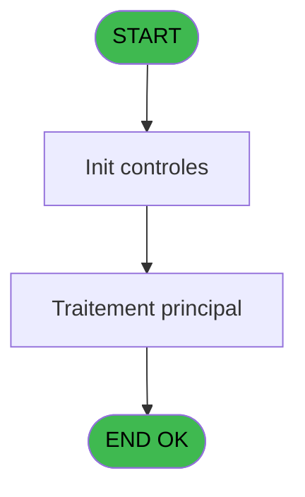

# WEL IDE 109 - Zoom Pays Nationalité

> **Analyse**: Phases 1-4 2026-02-03 21:49 -> 21:49 (17s) | Assemblage 21:49
> **Pipeline**: V7.2 Enrichi
> **Structure**: 4 onglets (Resume | Ecrans | Donnees | Connexions)

<!-- TAB:Resume -->

## 1. FICHE D'IDENTITE

| Attribut | Valeur |
|----------|--------|
| Projet | WEL |
| IDE Position | 109 |
| Nom Programme | Zoom Pays Nationalité |
| Fichier source | `Prg_109.xml` |
| Dossier IDE | Zoom |
| Taches | 1 (1 ecrans visibles) |
| Tables modifiees | 0 |
| Programmes appeles | 1 |

## 2. DESCRIPTION FONCTIONNELLE

**Zoom Pays Nationalité** assure la gestion complete de ce processus, accessible depuis [Identité client (IDE 8)](WEL-IDE-8.md).

Le flux de traitement s'organise en **1 blocs fonctionnels** :

- **Consultation** (1 tache) : ecrans de recherche, selection et consultation

## 3. BLOCS FONCTIONNELS

### 3.1 Consultation (1 tache)

Ecrans de recherche et consultation.

---

#### 109 - Zoom Pays Nationalité [[ECRAN]](#ecran-t1)

**Role** : Selection par l'operateur : Zoom Pays Nationalité.
**Ecran** : 1313 x 744 DLU | [Voir mockup](#ecran-t1)
**Variables liees** : A (P.Code Nationalité), B (P.Code Pays)

## 5. REGLES METIER

*(Aucune regle metier identifiee)*

## 6. CONTEXTE

- **Appele par**: [Identité client (IDE 8)](WEL-IDE-8.md)
- **Appelle**: 1 programmes | **Tables**: 1 (W:0 R:1 L:0) | **Taches**: 1 | **Expressions**: 15

<!-- TAB:Ecrans -->

## 8. ECRANS

### 8.1 Forms visibles (1 / 1)

| # | Position | Tache | Nom | Type | Largeur | Hauteur | Bloc |
|---|----------|-------|-----|------|---------|---------|------|
| 1 | 109 | 109 | Zoom Pays Nationalité | Type0 | 1313 | 744 | Consultation |

### 8.2 Mockups Ecrans

---

#### 109 - Zoom Pays Nationalité
**Tache** : [109](#t1) | **Type** : Type0 | **Dimensions** : 1313 x 744 DLU
**Bloc** : Consultation | **Titre IDE** : Zoom Pays Nationalité

<!-- FORM-DATA:
{
    "width":  1313,
    "vFactor":  100,
    "type":  "Type0",
    "hFactor":  100,
    "controls":  [
                     {
                         "x":  182,
                         "type":  "label",
                         "var":  "",
                         "y":  0,
                         "w":  1130,
                         "fmt":  "",
                         "name":  "",
                         "h":  66,
                         "color":  "212",
                         "text":  "COUNTRY / NATIONALITY",
                         "parent":  null
                     },
                     {
                         "x":  460,
                         "type":  "label",
                         "var":  "",
                         "y":  98,
                         "w":  338,
                         "fmt":  "",
                         "name":  "",
                         "h":  44,
                         "color":  "",
                         "text":  "COUNTRY / NATIONALITY",
                         "parent":  null
                     },
                     {
                         "x":  577,
                         "type":  "label",
                         "var":  "",
                         "y":  633,
                         "w":  173,
                         "fmt":  "",
                         "name":  "SELECT",
                         "h":  88,
                         "color":  "",
                         "text":  "SELECT",
                         "parent":  null
                     },
                     {
                         "x":  461,
                         "type":  "table",
                         "var":  "",
                         "name":  "",
                         "titleH":  12,
                         "color":  "",
                         "w":  335,
                         "y":  139,
                         "fmt":  "",
                         "parent":  null,
                         "text":  "",
                         "rowH":  44,
                         "h":  440,
                         "cols":  [
                                      {
                                          "title":  "libelle_trente",
                                          "layer":  1,
                                          "w":  328
                                      }
                                  ],
                         "rows":  1
                     },
                     {
                         "x":  0,
                         "type":  "image",
                         "var":  "",
                         "y":  0,
                         "w":  173,
                         "fmt":  "",
                         "name":  "RETOUR",
                         "h":  66,
                         "color":  "226",
                         "text":  "",
                         "parent":  null
                     },
                     {
                         "x":  796,
                         "type":  "button",
                         "var":  "",
                         "y":  97,
                         "w":  56,
                         "fmt":  "",
                         "name":  "",
                         "h":  243,
                         "color":  "",
                         "text":  "",
                         "parent":  null
                     },
                     {
                         "x":  467,
                         "type":  "edit",
                         "var":  "",
                         "y":  144,
                         "w":  327,
                         "fmt":  "",
                         "name":  "nom_import",
                         "h":  36,
                         "color":  "",
                         "text":  "",
                         "parent":  6
                     },
                     {
                         "x":  796,
                         "type":  "button",
                         "var":  "",
                         "y":  337,
                         "w":  56,
                         "fmt":  "",
                         "name":  "",
                         "h":  243,
                         "color":  "",
                         "text":  "",
                         "parent":  null
                     }
                 ],
    "taskId":  "109",
    "height":  744
}
-->

<strong>Champs : 1 champs</strong>

| Pos (x,y) | Nom | Variable | Type |
|-----------|-----|----------|------|
| 467,144 | nom_import | - | edit |

<strong>Boutons : 2 boutons</strong>

| Bouton | Pos (x,y) | Action |
|--------|-----------|--------|
| (sans nom) | 796,97 | Action declenchee |
| (sans nom) | 796,337 | Action declenchee |

## 9. NAVIGATION

Ecran unique: **Zoom Pays Nationalité**

### 9.3 Structure hierarchique (1 tache)

| Position | Tache | Type | Dimensions | Bloc |
|----------|-------|------|------------|------|
| **109.1** | [**Zoom Pays Nationalité** (109)](#t1) [mockup](#ecran-t1) | - | 1313x744 | Consultation |

### 9.4 Algorigramme

> **Legende**: Vert = START/END OK | Rouge = END KO | Bleu = Decisions
> *Algorigramme auto-genere. Utiliser `/algorigramme` pour une synthese metier detaillee.*

<!-- TAB:Donnees -->

## 10. TABLES

### Tables utilisees (1)

| ID | Nom | Description | Type | R | W | L | Usages |
|----|-----|-------------|------|---|---|---|--------|
| 121 | tables_pays_ventes | Donnees de ventes | DB | R |   |   | 1 |

### Colonnes par table (1 / 1 tables avec colonnes identifiees)

Table 121 - tables_pays_ventes (R) - 1 usages

| Lettre | Variable | Acces | Type |
|--------|----------|-------|------|
| A | P.Code Nationalité | R | Alpha |
| B | P.Code Pays | R | Alpha |
| C | P.NumVente | R | Alpha |

## 11. VARIABLES

### 11.1 Parametres entrants (3)

Variables recues du programme appelant ([Identité client (IDE 8)](WEL-IDE-8.md)).

| Lettre | Nom | Type | Usage dans |
|--------|-----|------|-----------|
| A | P.Code Nationalité | Alpha | [109](#t1) |
| B | P.Code Pays | Alpha | [109](#t1) |
| C | P.NumVente | Alpha | 1x parametre entrant |

## 12. EXPRESSIONS

**15 / 15 expressions decodees (100%)**

### 12.1 Repartition par type

| Type | Expressions | Regles |
|------|-------------|--------|
| CALCULATION | 3 | 0 |
| CONSTANTE | 2 | 0 |
| OTHER | 3 | 0 |
| NEGATION | 1 | 0 |
| CONCATENATION | 3 | 0 |
| CONDITION | 3 | 0 |

### 12.2 Expressions cles par type

#### CALCULATION (3 expressions)

| Type | IDE | Expression | Regle |
|------|-----|------------|-------|
| CALCULATION | 5 | `MlsTrans('Call - Residence Country list')` | - |
| CALCULATION | 4 | `MlsTrans('Call - Country list')` | - |
| CALCULATION | 3 | `MlsTrans('Call - Nationality list')` | - |

#### CONSTANTE (2 expressions)

| Type | IDE | Expression | Regle |
|------|-----|------------|-------|
| CONSTANTE | 2 | `'ZOOM_PAY'` | - |
| CONSTANTE | 1 | `'ZOOM_NAT'` | - |

#### OTHER (3 expressions)

| Type | IDE | Expression | Regle |
|------|-----|------------|-------|
| OTHER | 11 | `[E]` | - |
| OTHER | 10 | `[H]` | - |
| OTHER | 9 | `[F]` | - |

#### NEGATION (1 expressions)

| Type | IDE | Expression | Regle |
|------|-----|------------|-------|
| NEGATION | 12 | `NOT EmptyDataview(0)` | - |

#### CONCATENATION (3 expressions)

| Type | IDE | Expression | Regle |
|------|-----|------------|-------|
| CONCATENATION | 8 | `MlsTrans('Select Residence Country list: ')&' '&Trim([I])` | - |
| CONCATENATION | 7 | `MlsTrans('Select Country list: ')&' '&Trim([I])` | - |
| CONCATENATION | 6 | `MlsTrans('Select Nationality list: ')&' '&Trim([I])` | - |

#### CONDITION (3 expressions)

| Type | IDE | Expression | Regle |
|------|-----|------------|-------|
| CONDITION | 15 | `Trim(P.NumVente [C])<>''` | - |
| CONDITION | 14 | `Trim(P.Code Pays [B])<>''` | - |
| CONDITION | 13 | `Trim(P.Code Nationalité [A])<>''` | - |

<!-- TAB:Connexions -->

## 13. GRAPHE D'APPELS

### 13.1 Chaine depuis Main (Callers)

Main -> ... -> [Identité client (IDE 8)](WEL-IDE-8.md) -> **Zoom Pays Nationalité (IDE 109)**

### 13.2 Callers

| IDE | Nom Programme | Nb Appels |
|-----|---------------|-----------|
| [8](WEL-IDE-8.md) | Identité client | 4 |

### 13.3 Callees (programmes appeles)

### 13.4 Detail Callees avec contexte

| IDE | Nom Programme | Appels | Contexte |
|-----|---------------|--------|----------|
| [81](WEL-IDE-81.md) | Create logbook | 6 | Sous-programme |

## 14. RECOMMANDATIONS MIGRATION

### 14.1 Profil du programme

| Metrique | Valeur | Impact migration |
|----------|--------|-----------------|
| Lignes de logique | 21 | Programme compact |
| Expressions | 15 | Peu de logique |
| Tables WRITE | 0 | Impact faible |
| Sous-programmes | 1 | Peu de dependances |
| Ecrans visibles | 1 | Ecran unique ou traitement batch |
| Code desactive | 0% (0 / 21) | Code sain |
| Regles metier | 0 | Pas de regle identifiee |

### 14.2 Plan de migration par bloc

#### Consultation (1 tache: 1 ecran, 0 traitement)

- **Strategie** : Composants de recherche/selection en modales.
- 1 ecran : Zoom Pays Nationalité

### 14.3 Dependances critiques

| Dependance | Type | Appels | Impact |
|------------|------|--------|--------|
| [Create logbook (IDE 81)](WEL-IDE-81.md) | Sous-programme | 6x | **CRITIQUE** - Sous-programme |

---
*Spec DETAILED generee par Pipeline V7.2 - 2026-02-03 21:49*
