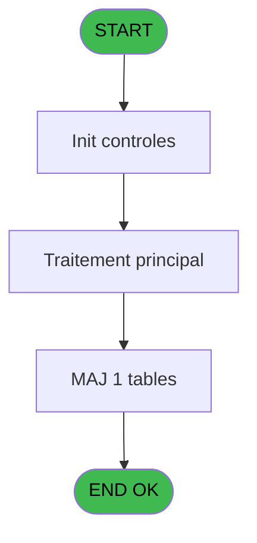

# WEL IDE 11 - Categorie client intialisation

> **Analyse**: Phases 1-4 2026-02-03 21:14 -> 21:14 (17s) | Assemblage 21:14
> **Pipeline**: V7.2 Enrichi
> **Structure**: 4 onglets (Resume | Ecrans | Donnees | Connexions)

<!-- TAB:Resume -->

## 1. FICHE D'IDENTITE

| Attribut | Valeur |
|----------|--------|
| Projet | WEL |
| IDE Position | 11 |
| Nom Programme | Categorie client intialisation |
| Fichier source | `Prg_11.xml` |
| Dossier IDE | Clients |
| Taches | 3 (0 ecrans visibles) |
| Tables modifiees | 1 |
| Programmes appeles | 0 |

## 2. DESCRIPTION FONCTIONNELLE

**Categorie client intialisation** assure la gestion complete de ce processus, accessible depuis [Clients (IDE 9)](WEL-IDE-9.md), [Account (IDE 23)](WEL-IDE-23.md).

Le flux de traitement s'organise en **2 blocs fonctionnels** :

- **Traitement** (2 taches) : traitements metier divers
- **Consultation** (1 tache) : ecrans de recherche, selection et consultation

**Donnees modifiees** : 1 tables en ecriture (web_api_logs).

**Logique metier** : 1 regles identifiees couvrant conditions metier.

Detail : phases du traitement

#### Phase 1 : Traitement (2 taches)

- **11** - Categorie client intialisation
- **11.1** - Seminaire

#### Phase 2 : Consultation (1 tache)

- **11.2** - Recherche upgrade

#### Tables impactees

| Table | Operations | Role metier |
|-------|-----------|-------------|
| web_api_logs | **W** (1 usages) |  |

## 3. BLOCS FONCTIONNELS

### 3.1 Traitement (2 taches)

Traitements internes.

---

#### 11 - Categorie client intialisation

**Role** : Traitement : Categorie client intialisation.

---

#### 11.1 - Seminaire

**Role** : Traitement : Seminaire.

### 3.2 Consultation (1 tache)

Ecrans de recherche et consultation.

---

#### 11.2 - Recherche upgrade

**Role** : Traitement : Recherche upgrade.
**Variables liees** : A (V0.Upgrade ?)

## 5. REGLES METIER

1 regles identifiees:

### Autres (1 regles)

#### [RM-001] Si [AK] alors Trim([BD]) sinon '')&IF([AQ],Trim([BF]),'')&IF([AW],Trim([BH]),'')

| Element | Detail |
|---------|--------|
| **Condition** | `[AK]` |
| **Si vrai** | Trim([BD]) |
| **Si faux** | '')&IF([AQ],Trim([BF]),'')&IF([AW],Trim([BH]),'') |
| **Expression source** | Expression 17 : `IF([AK],Trim([BD]),'')&IF([AQ],Trim([BF]),'')&IF([AW],Trim([` |
| **Exemple** | Si [AK] → Trim([BD]). Sinon → '')&IF([AQ],Trim([BF]),'')&IF([AW],Trim([BH]),'') |

## 6. CONTEXTE

- **Appele par**: [Clients (IDE 9)](WEL-IDE-9.md), [Account (IDE 23)](WEL-IDE-23.md)
- **Appelle**: 0 programmes | **Tables**: 12 (W:1 R:2 L:9) | **Taches**: 3 | **Expressions**: 25

<!-- TAB:Ecrans -->

## 8. ECRANS

*(Programme sans ecran visible)*

## 9. NAVIGATION

### 9.3 Structure hierarchique (3 taches)

| Position | Tache | Type | Dimensions | Bloc |
|----------|-------|------|------------|------|
| **11.1** | [**Categorie client intialisation** (11)](#t1) | - | - | Traitement |
| 11.1.1 | [Seminaire (11.1)](#t2) | - | - | |
| **11.2** | [**Recherche upgrade** (11.2)](#t3) | - | - | Consultation |

### 9.4 Algorigramme

> **Legende**: Vert = START/END OK | Rouge = END KO | Bleu = Decisions
> *Algorigramme auto-genere. Utiliser `/algorigramme` pour une synthese metier detaillee.*

<!-- TAB:Donnees -->

## 10. TABLES

### Tables utilisees (12)

| ID | Nom | Description | Type | R | W | L | Usages |
|----|-----|-------------|------|---|---|---|--------|
| 31 | gm-complet_______gmc |  | DB | R |   |   | 1 |
| 33 | prestations______pre | Prestations/services vendus | DB |   |   | L | 1 |
| 34 | hebergement______heb | Hebergement (chambres) | DB | R |   |   | 1 |
| 36 | client_gm |  | DB |   |   | L | 1 |
| 39 | depot_garantie___dga | Depots et garanties | DB |   |   | L | 1 |
| 168 | heb_circuit______hci | Hebergement (chambres) | DB |   |   | L | 1 |
| 356 | gm_millesia |  | DB |   |   | L | 1 |
| 768 | motif_no_enreg_na |  | DB |   |   | L | 1 |
| 800 | moyen_paiement_complement |  | DB |   |   | L | 1 |
| 833 | log_initialisation_tpe |  | DB |   |   | L | 1 |
| 916 | web_api_cashup_details |  | DB |   |   | L | 1 |
| 917 | web_api_logs |  | DB |   | **W** |   | 1 |

### Colonnes par table (3 / 3 tables avec colonnes identifiees)

Table 31 - gm-complet_______gmc (R) - 1 usages

| Lettre | Variable | Acces | Type |
|--------|----------|-------|------|
| A | V0.Upgrade ? | R | Logical |
| B | V0.Prestations ? | R | Logical |
| C | V0.Circuit ? | R | Logical |
| D | V.Existe quest 60 ? | R | Logical |
| E | V.Existe quest 61 ? | R | Logical |
| F | V.Existe quest 62 ? | R | Logical |
| G | V0.Easy check in | R | Alpha |

Table 34 - hebergement______heb (R) - 1 usages

*Table utilisee uniquement en Link ou aucune colonne Real identifiee dans le DataView.*

Table 917 - web_api_logs (**W**) - 1 usages

*Table utilisee uniquement en Link ou aucune colonne Real identifiee dans le DataView.*

## 11. VARIABLES

### 11.1 Variables de session (3)

Variables persistantes pendant toute la session.

| Lettre | Nom | Type | Usage dans |
|--------|-----|------|-----------|
| D | V.Existe quest 60 ? | Logical | - |
| E | V.Existe quest 61 ? | Logical | - |
| F | V.Existe quest 62 ? | Logical | - |

### 11.2 Autres (4)

Variables diverses.

| Lettre | Nom | Type | Usage dans |
|--------|-----|------|-----------|
| A | V0.Upgrade ? | Logical | - |
| B | V0.Prestations ? | Logical | 11x refs |
| C | V0.Circuit ? | Logical | - |
| G | V0.Easy check in | Alpha | - |

## 12. EXPRESSIONS

**25 / 25 expressions decodees (100%)**

### 12.1 Repartition par type

| Type | Expressions | Regles |
|------|-------------|--------|
| CONDITION | 12 | 5 |
| CONSTANTE | 6 | 0 |
| REFERENCE_VG | 4 | 0 |
| OTHER | 2 | 0 |
| STRING | 1 | 0 |

### 12.2 Expressions cles par type

#### CONDITION (12 expressions)

| Type | IDE | Expression | Regle |
|------|-----|------------|-------|
| CONDITION | 17 | `IF([AK],Trim([BD]),'')&IF([AQ],Trim([BF]),'')&IF([AW],Trim([BH]),'')` | [RM-001](#rm-RM-001) |
| CONDITION | 4 | `V0.Prestations ? [B]='SEMINAR' AND Trim([H])<>''` | - |
| CONDITION | 23 | `V0.Prestations ? [B]='AMBASSADOR' AND [N]='O'` | - |
| CONDITION | 7 | `V0.Prestations ? [B]='FIDEL' AND Trim([L])<>''` | - |
| CONDITION | 13 | `V0.Prestations ? [B]='HONEY' AND Trim([AJ])<>'N'  AND Trim([AJ])<>''` | - |
| ... | | *+7 autres* | |

#### CONSTANTE (6 expressions)

| Type | IDE | Expression | Regle |
|------|-----|------------|-------|
| CONSTANTE | 18 | `'LOCATION'` | - |
| CONSTANTE | 19 | `'COURS'` | - |
| CONSTANTE | 20 | `'ENFANT'` | - |
| CONSTANTE | 14 | `60` | - |
| CONSTANTE | 15 | `61` | - |
| ... | | *+1 autres* | |

#### REFERENCE_VG (4 expressions)

| Type | IDE | Expression | Regle |
|------|-----|------------|-------|
| REFERENCE_VG | 3 | `VG10` | - |
| REFERENCE_VG | 5 | `VG6` | - |
| REFERENCE_VG | 1 | `VG5` | - |
| REFERENCE_VG | 2 | `VG9` | - |

#### OTHER (2 expressions)

| Type | IDE | Expression | Regle |
|------|-----|------------|-------|
| OTHER | 25 | `DbDel('{917,4}'DSOURCE,'')` | - |
| OTHER | 6 | `[L]` | - |

#### STRING (1 expressions)

| Type | IDE | Expression | Regle |
|------|-----|------------|-------|
| STRING | 24 | `MlsTrans('EA')&Trim([BI])` | - |

### 12.3 Toutes les expressions (25)

Voir les 25 expressions

#### CONDITION (12)

| IDE | Expression Decodee |
|-----|-------------------|
| 17 | `IF([AK],Trim([BD]),'')&IF([AQ],Trim([BF]),'')&IF([AW],Trim([BH]),'')` |
| 8 | `V0.Prestations ? [B]='UPGRADE' AND [T]` |
| 9 | `V0.Prestations ? [B]='PBS' AND [U]` |
| 10 | `V0.Prestations ? [B]='TOUR' AND [AA]` |
| 11 | `V0.Prestations ? [B]='VILSWITCH' AND [P]='O'` |
| 21 | `V0.Prestations ? [B]='BIGSPENDER' AND [O]='O'` |
| 22 | `V0.Prestations ? [B]='CONTRIB' AND [M]='O'` |
| 23 | `V0.Prestations ? [B]='AMBASSADOR' AND [N]='O'` |
| 4 | `V0.Prestations ? [B]='SEMINAR' AND Trim([H])<>''` |
| 7 | `V0.Prestations ? [B]='FIDEL' AND Trim([L])<>''` |
| 12 | `Trim(V0.Prestations ? [B])='EASYARR' AND ([BM] OR Trim([BI])<>'' OR Trim([BL])<>'')` |
| 13 | `V0.Prestations ? [B]='HONEY' AND Trim([AJ])<>'N'  AND Trim([AJ])<>''` |

#### CONSTANTE (6)

| IDE | Expression Decodee |
|-----|-------------------|
| 14 | `60` |
| 15 | `61` |
| 16 | `62` |
| 18 | `'LOCATION'` |
| 19 | `'COURS'` |
| 20 | `'ENFANT'` |

#### REFERENCE_VG (4)

| IDE | Expression Decodee |
|-----|-------------------|
| 1 | `VG5` |
| 2 | `VG9` |
| 3 | `VG10` |
| 5 | `VG6` |

#### OTHER (2)

| IDE | Expression Decodee |
|-----|-------------------|
| 6 | `[L]` |
| 25 | `DbDel('{917,4}'DSOURCE,'')` |

#### STRING (1)

| IDE | Expression Decodee |
|-----|-------------------|
| 24 | `MlsTrans('EA')&Trim([BI])` |

<!-- TAB:Connexions -->

## 13. GRAPHE D'APPELS

### 13.1 Chaine depuis Main (Callers)

Main -> ... -> [Clients (IDE 9)](WEL-IDE-9.md) -> **Categorie client intialisation (IDE 11)**

Main -> ... -> [Account (IDE 23)](WEL-IDE-23.md) -> **Categorie client intialisation (IDE 11)**

### 13.2 Callers

| IDE | Nom Programme | Nb Appels |
|-----|---------------|-----------|
| [9](WEL-IDE-9.md) | Clients | 1 |
| [23](WEL-IDE-23.md) | Account | 1 |

### 13.3 Callees (programmes appeles)

### 13.4 Detail Callees avec contexte

| IDE | Nom Programme | Appels | Contexte |
|-----|---------------|--------|----------|
| - | (aucun) | - | - |

## 14. RECOMMANDATIONS MIGRATION

### 14.1 Profil du programme

| Metrique | Valeur | Impact migration |
|----------|--------|-----------------|
| Lignes de logique | 119 | Programme compact |
| Expressions | 25 | Peu de logique |
| Tables WRITE | 1 | Impact faible |
| Sous-programmes | 0 | Peu de dependances |
| Ecrans visibles | 0 | Ecran unique ou traitement batch |
| Code desactive | 0% (0 / 119) | Code sain |
| Regles metier | 1 | Quelques regles a preserver |

### 14.2 Plan de migration par bloc

#### Traitement (2 taches: 0 ecran, 2 traitements)

- **Strategie** : 2 service(s) backend injectable(s) (Domain Services).
- Decomposer les taches en services unitaires testables.

#### Consultation (1 tache: 0 ecran, 1 traitement)

- **Strategie** : Composants de recherche/selection en modales.

### 14.3 Dependances critiques

| Dependance | Type | Appels | Impact |
|------------|------|--------|--------|
| web_api_logs | Table WRITE (Database) | 1x | Schema + repository |

---
*Spec DETAILED generee par Pipeline V7.2 - 2026-02-03 21:14*
