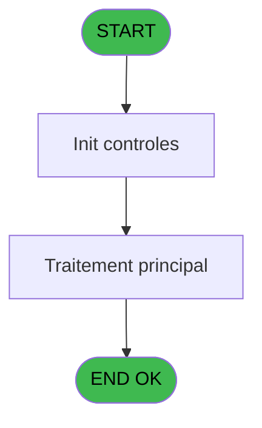
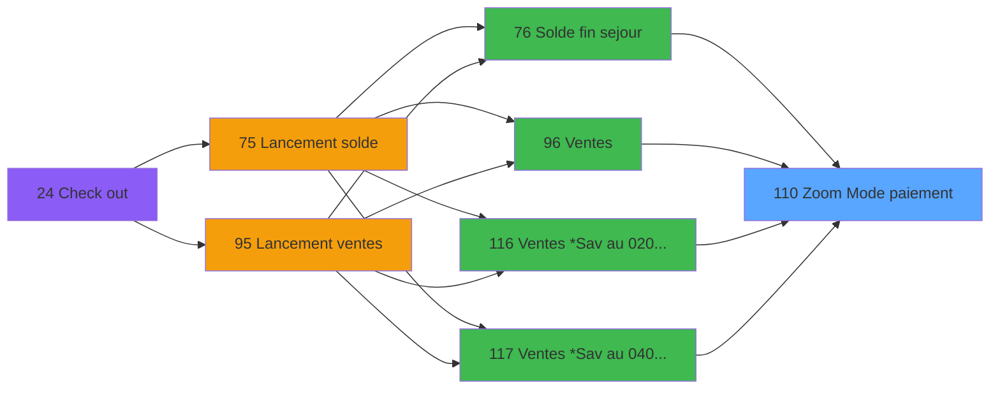
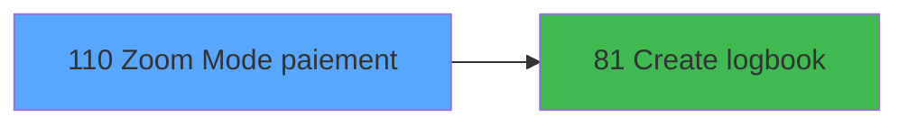

# WEL IDE 110 - Zoom Mode paiement

> **Analyse**: Phases 1-4 2026-02-03 21:49 -> 21:49 (18s) | Assemblage 21:49
> **Pipeline**: V7.2 Enrichi
> **Structure**: 4 onglets (Resume | Ecrans | Donnees | Connexions)

<!-- TAB:Resume -->

## 1. FICHE D'IDENTITE

| Attribut | Valeur |
|----------|--------|
| Projet | WEL |
| IDE Position | 110 |
| Nom Programme | Zoom Mode paiement |
| Fichier source | `Prg_110.xml` |
| Dossier IDE | Zoom |
| Taches | 1 (1 ecrans visibles) |
| Tables modifiees | 0 |
| Programmes appeles | 1 |

## 2. DESCRIPTION FONCTIONNELLE

**Zoom Mode paiement** assure la gestion complete de ce processus, accessible depuis [Solde fin sejour (IDE 76)](WEL-IDE-76.md), [Ventes (IDE 96)](WEL-IDE-96.md), [Ventes *Sav au 02/07/2018 (IDE 116)](WEL-IDE-116.md), [Ventes *Sav au 04/07/2018 (IDE 117)](WEL-IDE-117.md).

Le flux de traitement s'organise en **1 blocs fonctionnels** :

- **Reglement** (1 tache) : gestion des moyens de paiement et reglements

## 3. BLOCS FONCTIONNELS

### 3.1 Reglement (1 tache)

Gestion des moyens de paiement : 1 tache de reglement.

---

#### 110 - Zoom Mode paiement [[ECRAN]](#ecran-t1)

**Role** : Gestion du reglement : Zoom Mode paiement.
**Ecran** : 1313 x 744 DLU | [Voir mockup](#ecran-t1)
**Variables liees** : D (P.Mode paiement), E (P.Zoom vente et od)

## 5. REGLES METIER

*(Aucune regle metier identifiee)*

## 6. CONTEXTE

- **Appele par**: [Solde fin sejour (IDE 76)](WEL-IDE-76.md), [Ventes (IDE 96)](WEL-IDE-96.md), [Ventes *Sav au 02/07/2018 (IDE 116)](WEL-IDE-116.md), [Ventes *Sav au 04/07/2018 (IDE 117)](WEL-IDE-117.md)
- **Appelle**: 1 programmes | **Tables**: 2 (W:0 R:1 L:1) | **Taches**: 1 | **Expressions**: 12

<!-- TAB:Ecrans -->

## 8. ECRANS

### 8.1 Forms visibles (1 / 1)

| # | Position | Tache | Nom | Type | Largeur | Hauteur | Bloc |
|---|----------|-------|-----|------|---------|---------|------|
| 1 | 110 | 110 | Zoom Mode paiement | Type0 | 1313 | 744 | Reglement |

### 8.2 Mockups Ecrans

---

#### 110 - Zoom Mode paiement
**Tache** : [110](#t1) | **Type** : Type0 | **Dimensions** : 1313 x 744 DLU
**Bloc** : Reglement | **Titre IDE** : Zoom Mode paiement

<!-- FORM-DATA:
{
    "width":  1313,
    "vFactor":  100,
    "type":  "Type0",
    "hFactor":  100,
    "controls":  [
                     {
                         "x":  182,
                         "type":  "label",
                         "var":  "",
                         "y":  0,
                         "w":  1130,
                         "fmt":  "",
                         "name":  "",
                         "h":  66,
                         "color":  "212",
                         "text":  "SELECT PAYMENT METHOD",
                         "parent":  null
                     },
                     {
                         "x":  499,
                         "type":  "label",
                         "var":  "",
                         "y":  89,
                         "w":  259,
                         "fmt":  "",
                         "name":  "",
                         "h":  44,
                         "color":  "",
                         "text":  "PAYMENT METHOD",
                         "parent":  null
                     },
                     {
                         "x":  577,
                         "type":  "label",
                         "var":  "",
                         "y":  633,
                         "w":  173,
                         "fmt":  "",
                         "name":  "SELECT",
                         "h":  88,
                         "color":  "",
                         "text":  "SELECT",
                         "parent":  null
                     },
                     {
                         "x":  500,
                         "type":  "table",
                         "var":  "",
                         "name":  "",
                         "titleH":  12,
                         "color":  "",
                         "w":  257,
                         "y":  131,
                         "fmt":  "",
                         "parent":  null,
                         "text":  "",
                         "rowH":  44,
                         "h":  441,
                         "cols":  [
                                      {
                                          "title":  "NAME",
                                          "layer":  1,
                                          "w":  253
                                      }
                                  ],
                         "rows":  1
                     },
                     {
                         "x":  0,
                         "type":  "image",
                         "var":  "",
                         "y":  0,
                         "w":  173,
                         "fmt":  "",
                         "name":  "RETOUR",
                         "h":  66,
                         "color":  "226",
                         "text":  "",
                         "parent":  null
                     },
                     {
                         "x":  757,
                         "type":  "button",
                         "var":  "",
                         "y":  89,
                         "w":  56,
                         "fmt":  "",
                         "name":  "",
                         "h":  243,
                         "color":  "",
                         "text":  "",
                         "parent":  null
                     },
                     {
                         "x":  505,
                         "type":  "edit",
                         "var":  "",
                         "y":  136,
                         "w":  245,
                         "fmt":  "",
                         "name":  "mor_mop",
                         "h":  36,
                         "color":  "220",
                         "text":  "",
                         "parent":  6
                     },
                     {
                         "x":  757,
                         "type":  "button",
                         "var":  "",
                         "y":  330,
                         "w":  56,
                         "fmt":  "",
                         "name":  "",
                         "h":  243,
                         "color":  "",
                         "text":  "",
                         "parent":  null
                     }
                 ],
    "taskId":  "110",
    "height":  744
}
-->

<strong>Champs : 1 champs</strong>

| Pos (x,y) | Nom | Variable | Type |
|-----------|-----|----------|------|
| 505,136 | mor_mop | - | edit |

<strong>Boutons : 2 boutons</strong>

| Bouton | Pos (x,y) | Action |
|--------|-----------|--------|
| (sans nom) | 757,89 | Action declenchee |
| (sans nom) | 757,330 | Action declenchee |

## 9. NAVIGATION

Ecran unique: **Zoom Mode paiement**

### 9.3 Structure hierarchique (1 tache)

| Position | Tache | Type | Dimensions | Bloc |
|----------|-------|------|------------|------|
| **110.1** | [**Zoom Mode paiement** (110)](#t1) [mockup](#ecran-t1) | - | 1313x744 | Reglement |

### 9.4 Algorigramme

> **Legende**: Vert = START/END OK | Rouge = END KO | Bleu = Decisions
> *Algorigramme auto-genere. Utiliser `/algorigramme` pour une synthese metier detaillee.*

<!-- TAB:Donnees -->

## 10. TABLES

### Tables utilisees (2)

| ID | Nom | Description | Type | R | W | L | Usages |
|----|-----|-------------|------|---|---|---|--------|
| 50 | moyens_reglement_mor | Reglements / paiements | DB | R |   |   | 1 |
| 89 | moyen_paiement___mop |  | DB |   |   | L | 1 |

### Colonnes par table (2 / 1 tables avec colonnes identifiees)

Table 50 - moyens_reglement_mor (R) - 1 usages

| Lettre | Variable | Acces | Type |
|--------|----------|-------|------|
| A | P.Societe | R | Alpha |
| B | P.Devise | R | Alpha |
| C | P.Type operation | R | Alpha |
| D | P.Mode paiement | R | Alpha |
| E | P.Zoom vente et od | R | Alpha |
| F | P.Compte garanti | R | Logical |
| G | P.Solde compte | R | Numeric |
| H | P.Article derniere minute | R | Logical |

## 11. VARIABLES

### 11.1 Parametres entrants (8)

Variables recues du programme appelant ([Solde fin sejour (IDE 76)](WEL-IDE-76.md)).

| Lettre | Nom | Type | Usage dans |
|--------|-----|------|-----------|
| A | P.Societe | Alpha | 1x parametre entrant |
| B | P.Devise | Alpha | 1x parametre entrant |
| C | P.Type operation | Alpha | 1x parametre entrant |
| D | P.Mode paiement | Alpha | - |
| E | P.Zoom vente et od | Alpha | - |
| F | P.Compte garanti | Logical | - |
| G | P.Solde compte | Numeric | - |
| H | P.Article derniere minute | Logical | - |

## 12. EXPRESSIONS

**12 / 12 expressions decodees (100%)**

### 12.1 Repartition par type

| Type | Expressions | Regles |
|------|-------------|--------|
| CALCULATION | 1 | 0 |
| CONSTANTE | 3 | 0 |
| OTHER | 6 | 0 |
| CONDITION | 1 | 0 |
| CONCATENATION | 1 | 0 |

### 12.2 Expressions cles par type

#### CALCULATION (1 expressions)

| Type | IDE | Expression | Regle |
|------|-----|------------|-------|
| CALCULATION | 4 | `MlsTrans('Call - payment method list')` | - |

#### CONSTANTE (3 expressions)

| Type | IDE | Expression | Regle |
|------|-----|------------|-------|
| CONSTANTE | 8 | `'O'` | - |
| CONSTANTE | 3 | `'SEL_PAYM'` | - |
| CONSTANTE | 2 | `'ZOOM_PAYM'` | - |

#### OTHER (6 expressions)

| Type | IDE | Expression | Regle |
|------|-----|------------|-------|
| OTHER | 9 | `[M]` | - |
| OTHER | 11 | `[I]` | - |
| OTHER | 12 | `[M]` | - |
| OTHER | 1 | `P.Societe [A]` | - |
| OTHER | 6 | `P.Devise [B]` | - |
| ... | | *+1 autres* | |

#### CONDITION (1 expressions)

| Type | IDE | Expression | Regle |
|------|-----|------------|-------|
| CONDITION | 10 | `[P]='$CARD' OR [P]='OD'` | - |

#### CONCATENATION (1 expressions)

| Type | IDE | Expression | Regle |
|------|-----|------------|-------|
| CONCATENATION | 5 | `MlsTrans('Select payment method')&' '&Trim([K])` | - |

<!-- TAB:Connexions -->

## 13. GRAPHE D'APPELS

### 13.1 Chaine depuis Main (Callers)

Main -> ... -> [Solde fin sejour (IDE 76)](WEL-IDE-76.md) -> **Zoom Mode paiement (IDE 110)**

Main -> ... -> [Ventes (IDE 96)](WEL-IDE-96.md) -> **Zoom Mode paiement (IDE 110)**

Main -> ... -> [Ventes *Sav au 02/07/2018 (IDE 116)](WEL-IDE-116.md) -> **Zoom Mode paiement (IDE 110)**

Main -> ... -> [Ventes *Sav au 04/07/2018 (IDE 117)](WEL-IDE-117.md) -> **Zoom Mode paiement (IDE 110)**

### 13.2 Callers

| IDE | Nom Programme | Nb Appels |
|-----|---------------|-----------|
| [76](WEL-IDE-76.md) | Solde fin sejour | 1 |
| [96](WEL-IDE-96.md) | Ventes | 1 |
| [116](WEL-IDE-116.md) | Ventes *Sav au 02/07/2018 | 1 |
| [117](WEL-IDE-117.md) | Ventes *Sav au 04/07/2018 | 1 |

### 13.3 Callees (programmes appeles)

### 13.4 Detail Callees avec contexte

| IDE | Nom Programme | Appels | Contexte |
|-----|---------------|--------|----------|
| [81](WEL-IDE-81.md) | Create logbook | 2 | Sous-programme |

## 14. RECOMMANDATIONS MIGRATION

### 14.1 Profil du programme

| Metrique | Valeur | Impact migration |
|----------|--------|-----------------|
| Lignes de logique | 24 | Programme compact |
| Expressions | 12 | Peu de logique |
| Tables WRITE | 0 | Impact faible |
| Sous-programmes | 1 | Peu de dependances |
| Ecrans visibles | 1 | Ecran unique ou traitement batch |
| Code desactive | 0% (0 / 24) | Code sain |
| Regles metier | 0 | Pas de regle identifiee |

### 14.2 Plan de migration par bloc

#### Reglement (1 tache: 1 ecran, 0 traitement)

- **Strategie** : Service `IReglementService` avec pattern Strategy par mode de paiement.
- Integration TPE si applicable

### 14.3 Dependances critiques

| Dependance | Type | Appels | Impact |
|------------|------|--------|--------|
| [Create logbook (IDE 81)](WEL-IDE-81.md) | Sous-programme | 2x | Haute - Sous-programme |

---
*Spec DETAILED generee par Pipeline V7.2 - 2026-02-03 21:49*
