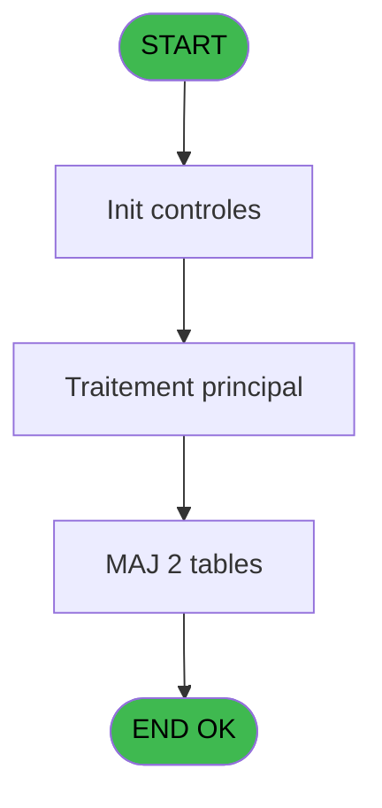

# WEL IDE 113 - Print extrait compte /Cum

> **Analyse**: Phases 1-4 2026-02-03 21:50 -> 21:51 (19s) | Assemblage 21:51
> **Pipeline**: V7.2 Enrichi
> **Structure**: 4 onglets (Resume | Ecrans | Donnees | Connexions)

<!-- TAB:Resume -->

## 1. FICHE D'IDENTITE

| Attribut | Valeur |
|----------|--------|
| Projet | WEL |
| IDE Position | 113 |
| Nom Programme | Print extrait compte /Cum |
| Fichier source | `Prg_113.xml` |
| Dossier IDE | A |
| Taches | 9 (1 ecrans visibles) |
| Tables modifiees | 2 |
| Programmes appeles | 1 |
| :warning: Statut | **ORPHELIN_POTENTIEL** |

## 2. DESCRIPTION FONCTIONNELLE

**Print extrait compte /Cum** assure la gestion complete de ce processus.

Le flux de traitement s'organise en **2 blocs fonctionnels** :

- **Impression** (5 taches) : generation de tickets et documents
- **Traitement** (4 taches) : traitements metier divers

**Donnees modifiees** : 2 tables en ecriture (comptable________cte, Ventilation_Lg_Vente).

Detail : phases du traitement

#### Phase 1 : Impression (5 taches)

- **113** - Print Extrait
- **113.3** - Printer 4 **[[ECRAN]](#ecran-t4)**
- **113.3.1.1** - Edition du pied
- **113.3.1.2** - Edition recap Free Etra
- **113.3.2.1** - Edition recap Free Etra

#### Phase 2 : Traitement (4 taches)

- **113.1** - recup nom adherent
- **113.2** - Balance
- **113.3.1** - Veuillez patienter... **[[ECRAN]](#ecran-t5)**
- **113.3.2** - Veuillez patienter... **[[ECRAN]](#ecran-t8)**

#### Tables impactees

| Table | Operations | Role metier |
|-------|-----------|-------------|
| comptable________cte | **W**/L (5 usages) |  |
| Ventilation_Lg_Vente | **W** (1 usages) | Donnees de ventes |

## 3. BLOCS FONCTIONNELS

### 3.1 Impression (5 taches)

Generation des documents et tickets.

---

#### 113 - Print Extrait

**Role** : Generation du document : Print Extrait.

4 sous-taches directes

| Tache | Nom | Bloc |
|-------|-----|------|
| [113.3](#t4) | Printer 4 **[[ECRAN]](#ecran-t4)** | Impression |
| [113.3.1.1](#t6) | Edition du pied | Impression |
| [113.3.1.2](#t7) | Edition recap Free Etra | Impression |
| [113.3.2.1](#t9) | Edition recap Free Etra | Impression |

**Variables liees** : G (P0.Print_Email)

---

#### 113.3 - Printer 4 [[ECRAN]](#ecran-t4)

**Role** : Generation du document : Printer 4.
**Ecran** : 422 x 56 DLU (MDI) | [Voir mockup](#ecran-t4)

---

#### 113.3.1.1 - Edition du pied

**Role** : Generation du document : Edition du pied.

---

#### 113.3.1.2 - Edition recap Free Etra

**Role** : Generation du document : Edition recap Free Etra.

---

#### 113.3.2.1 - Edition recap Free Etra

**Role** : Generation du document : Edition recap Free Etra.

### 3.2 Traitement (4 taches)

Traitements internes.

---

#### 113.1 - recup nom adherent

**Role** : Consultation/chargement : recup nom adherent.
**Variables liees** : K (W0 nom adherent), L (W0 prenom adherent), M (W0 n° adherent)

---

#### 113.2 - Balance

**Role** : Traitement : Balance.
**Variables liees** : P (W0 balance)

---

#### 113.3.1 - Veuillez patienter... [[ECRAN]](#ecran-t5)

**Role** : Traitement : Veuillez patienter....
**Ecran** : 422 x 56 DLU (MDI) | [Voir mockup](#ecran-t5)

---

#### 113.3.2 - Veuillez patienter... [[ECRAN]](#ecran-t8)

**Role** : Traitement : Veuillez patienter....
**Ecran** : 422 x 56 DLU (MDI) | [Voir mockup](#ecran-t8)

## 5. REGLES METIER

*(Aucune regle metier identifiee)*

## 6. CONTEXTE

- **Appele par**: (aucun)
- **Appelle**: 1 programmes | **Tables**: 6 (W:2 R:3 L:3) | **Taches**: 9 | **Expressions**: 10

<!-- TAB:Ecrans -->

## 8. ECRANS

### 8.1 Forms visibles (1 / 9)

| # | Position | Tache | Nom | Type | Largeur | Hauteur | Bloc |
|---|----------|-------|-----|------|---------|---------|------|
| 1 | 113.3.1 | 113.3.1 | Veuillez patienter... | MDI | 422 | 56 | Traitement |

### 8.2 Mockups Ecrans

---

#### 113.3.1 - Veuillez patienter...
**Tache** : [113.3.1](#t5) | **Type** : MDI | **Dimensions** : 422 x 56 DLU
**Bloc** : Traitement | **Titre IDE** : Veuillez patienter...

<!-- FORM-DATA:
{
    "width":  422,
    "vFactor":  8,
    "type":  "MDI",
    "hFactor":  8,
    "controls":  [
                     {
                         "x":  0,
                         "type":  "label",
                         "var":  "",
                         "y":  0,
                         "w":  423,
                         "fmt":  "",
                         "name":  "",
                         "h":  29,
                         "color":  "",
                         "text":  "",
                         "parent":  null
                     },
                     {
                         "x":  120,
                         "type":  "label",
                         "var":  "",
                         "y":  10,
                         "w":  221,
                         "fmt":  "",
                         "name":  "",
                         "h":  8,
                         "color":  "7",
                         "text":  "Impression en cours ...",
                         "parent":  null
                     },
                     {
                         "x":  0,
                         "type":  "label",
                         "var":  "",
                         "y":  29,
                         "w":  423,
                         "fmt":  "",
                         "name":  "",
                         "h":  27,
                         "color":  "",
                         "text":  "",
                         "parent":  null
                     },
                     {
                         "x":  34,
                         "type":  "label",
                         "var":  "",
                         "y":  38,
                         "w":  355,
                         "fmt":  "",
                         "name":  "",
                         "h":  8,
                         "color":  "",
                         "text":  "Edition de l\u0027extrait de compte cumule",
                         "parent":  null
                     },
                     {
                         "x":  4,
                         "type":  "image",
                         "var":  "",
                         "y":  2,
                         "w":  72,
                         "fmt":  "",
                         "name":  "",
                         "h":  25,
                         "color":  "",
                         "text":  "",
                         "parent":  null
                     }
                 ],
    "taskId":  "113.3.1",
    "height":  56
}
-->

## 9. NAVIGATION

Ecran unique: **Veuillez patienter...**

### 9.3 Structure hierarchique (9 taches)

| Position | Tache | Type | Dimensions | Bloc |
|----------|-------|------|------------|------|
| **113.1** | [**Print Extrait** (113)](#t1) | MDI | - | Impression |
| 113.1.1 | [Printer 4 (113.3)](#t4) [mockup](#ecran-t4) | MDI | 422x56 | |
| 113.1.2 | [Edition du pied (113.3.1.1)](#t6) | - | - | |
| 113.1.3 | [Edition recap Free Etra (113.3.1.2)](#t7) | - | - | |
| 113.1.4 | [Edition recap Free Etra (113.3.2.1)](#t9) | - | - | |
| **113.2** | [**recup nom adherent** (113.1)](#t2) | MDI | - | Traitement |
| 113.2.1 | [Balance (113.2)](#t3) | MDI | - | |
| 113.2.2 | [Veuillez patienter... (113.3.1)](#t5) [mockup](#ecran-t5) | MDI | 422x56 | |
| 113.2.3 | [Veuillez patienter... (113.3.2)](#t8) [mockup](#ecran-t8) | MDI | 422x56 | |

### 9.4 Algorigramme

> **Legende**: Vert = START/END OK | Rouge = END KO | Bleu = Decisions
> *Algorigramme auto-genere. Utiliser `/algorigramme` pour une synthese metier detaillee.*

<!-- TAB:Donnees -->

## 10. TABLES

### Tables utilisees (6)

| ID | Nom | Description | Type | R | W | L | Usages |
|----|-----|-------------|------|---|---|---|--------|
| 30 | gm-recherche_____gmr | Index de recherche | DB | R |   | L | 3 |
| 31 | gm-complet_______gmc |  | DB | R |   |   | 3 |
| 34 | hebergement______heb | Hebergement (chambres) | DB |   |   | L | 1 |
| 40 | comptable________cte |  | DB |   | **W** | L | 5 |
| 368 | pms_village |  | DB | R |   |   | 1 |
| 821 | Ventilation_Lg_Vente | Donnees de ventes | DB |   | **W** |   | 1 |

### Colonnes par table (1 / 5 tables avec colonnes identifiees)

Table 30 - gm-recherche_____gmr (R/L) - 3 usages

*Table utilisee uniquement en Link ou aucune colonne Real identifiee dans le DataView.*

Table 31 - gm-complet_______gmc (R) - 3 usages

*Table utilisee uniquement en Link ou aucune colonne Real identifiee dans le DataView.*

Table 40 - comptable________cte (**W**/L) - 5 usages

| Lettre | Variable | Acces | Type |
|--------|----------|-------|------|
| D | P0 date comptable | W | Date |

Table 368 - pms_village (R) - 1 usages

*Table utilisee uniquement en Link ou aucune colonne Real identifiee dans le DataView.*

Table 821 - Ventilation_Lg_Vente (**W**) - 1 usages

*Table utilisee uniquement en Link ou aucune colonne Real identifiee dans le DataView.*

## 11. VARIABLES

### 11.1 Parametres entrants (8)

Variables recues en parametre.

| Lettre | Nom | Type | Usage dans |
|--------|-----|------|-----------|
| A | P0 societe | Alpha | - |
| B | P0 n° compte | Numeric | 1x parametre entrant |
| C | P0 filiation | Numeric | 1x parametre entrant |
| D | P0 date comptable | Date | - |
| E | P0 edtion tva 2 | Logical | - |
| F | P0 date cumul | Date | 1x parametre entrant |
| G | P0.Print_Email | Unicode | 1x parametre entrant |
| H | P0.NomFichier | Alpha | 1x parametre entrant |

### 11.2 Variables de travail (11)

Variables internes au programme.

| Lettre | Nom | Type | Usage dans |
|--------|-----|------|-----------|
| I | W0 imprimante | Numeric | - |
| J | W0 titre | Alpha | - |
| K | W0 nom adherent | Alpha | - |
| L | W0 prenom adherent | Alpha | - |
| M | W0 n° adherent | Numeric | - |
| N | W0 lettre contrôle | Alpha | - |
| O | W0 filiation | Numeric | - |
| P | W0 balance | Numeric | - |
| Q | W0 langue parlee | Alpha | - |
| R | W0 chambre | Alpha | - |
| S | W0 devise locale | Alpha | - |

### 11.3 Autres (1)

Variables diverses.

| Lettre | Nom | Type | Usage dans |
|--------|-----|------|-----------|
| T | v0.Chemin | Alpha | 1x refs |

Toutes les 20 variables (liste complete)

| Cat | Lettre | Nom Variable | Type |
|-----|--------|--------------|------|
| P0 | **A** | P0 societe | Alpha |
| P0 | **B** | P0 n° compte | Numeric |
| P0 | **C** | P0 filiation | Numeric |
| P0 | **D** | P0 date comptable | Date |
| P0 | **E** | P0 edtion tva 2 | Logical |
| P0 | **F** | P0 date cumul | Date |
| P0 | **G** | P0.Print_Email | Unicode |
| P0 | **H** | P0.NomFichier | Alpha |
| W0 | **I** | W0 imprimante | Numeric |
| W0 | **J** | W0 titre | Alpha |
| W0 | **K** | W0 nom adherent | Alpha |
| W0 | **L** | W0 prenom adherent | Alpha |
| W0 | **M** | W0 n° adherent | Numeric |
| W0 | **N** | W0 lettre contrôle | Alpha |
| W0 | **O** | W0 filiation | Numeric |
| W0 | **P** | W0 balance | Numeric |
| W0 | **Q** | W0 langue parlee | Alpha |
| W0 | **R** | W0 chambre | Alpha |
| W0 | **S** | W0 devise locale | Alpha |
| Autre | **T** | v0.Chemin | Alpha |

## 12. EXPRESSIONS

**10 / 10 expressions decodees (100%)**

### 12.1 Repartition par type

| Type | Expressions | Regles |
|------|-------------|--------|
| CONDITION | 2 | 0 |
| FORMAT | 1 | 0 |
| REFERENCE_VG | 1 | 0 |
| OTHER | 4 | 0 |
| STRING | 1 | 0 |
| CONCATENATION | 1 | 0 |

### 12.2 Expressions cles par type

#### CONDITION (2 expressions)

| Type | IDE | Expression | Regle |
|------|-----|------------|-------|
| CONDITION | 6 | `P0.Print_Email [G]='P'` | - |
| CONDITION | 2 | `P0 date cumul [F]<>'00/00/0000'DATE` | - |

#### FORMAT (1 expressions)

| Type | IDE | Expression | Regle |
|------|-----|------------|-------|
| FORMAT | 9 | `'EXTRAIT_CUMUL_'&Trim(Str(P0 n° compte [B],'8P0'))&'_'&Trim(Str(P0 filiation [C],'##'))&'_'&Trim(VG15)&'_'&DStr(Date(),'YYMMDD')&TStr(Time(),'HHMMSS')&'.pdf'` | - |

#### REFERENCE_VG (1 expressions)

| Type | IDE | Expression | Regle |
|------|-----|------------|-------|
| REFERENCE_VG | 1 | `VG54` | - |

#### OTHER (4 expressions)

| Type | IDE | Expression | Regle |
|------|-----|------------|-------|
| OTHER | 5 | `DbDel ('{821,4}'DSOURCE,'')` | - |
| OTHER | 7 | `Translate('%club_exportdata%')&'WELCOME\'` | - |
| OTHER | 3 | `SetCrsr (1)` | - |
| OTHER | 4 | `SetCrsr (2)` | - |

#### STRING (1 expressions)

| Type | IDE | Expression | Regle |
|------|-----|------------|-------|
| STRING | 8 | `Trim(VG67)` | - |

#### CONCATENATION (1 expressions)

| Type | IDE | Expression | Regle |
|------|-----|------------|-------|
| CONCATENATION | 10 | `Trim(v0.Chemin [T])&Trim(P0.NomFichier [H])` | - |

<!-- TAB:Connexions -->

## 13. GRAPHE D'APPELS

### 13.1 Chaine depuis Main (Callers)

**Chemin**: (pas de callers directs)

### 13.2 Callers

| IDE | Nom Programme | Nb Appels |
|-----|---------------|-----------|
| - | (aucun) | - |

### 13.3 Callees (programmes appeles)

### 13.4 Detail Callees avec contexte

| IDE | Nom Programme | Appels | Contexte |
|-----|---------------|--------|----------|
| [25](WEL-IDE-25.md) | Creation Pied Facture | 1 | Sous-programme |

## 14. RECOMMANDATIONS MIGRATION

### 14.1 Profil du programme

| Metrique | Valeur | Impact migration |
|----------|--------|-----------------|
| Lignes de logique | 270 | Taille moyenne |
| Expressions | 10 | Peu de logique |
| Tables WRITE | 2 | Impact faible |
| Sous-programmes | 1 | Peu de dependances |
| Ecrans visibles | 1 | Ecran unique ou traitement batch |
| Code desactive | 0.7% (2 / 270) | Code sain |
| Regles metier | 0 | Pas de regle identifiee |

### 14.2 Plan de migration par bloc

#### Impression (5 taches: 1 ecran, 4 traitements)

- **Strategie** : Templates HTML -> PDF via wkhtmltopdf ou Puppeteer.
- `PrintService` injectable avec choix imprimante

#### Traitement (4 taches: 2 ecrans, 2 traitements)

- **Strategie** : Orchestrateur avec 2 ecrans (Razor/React) et 2 traitements backend (services).
- Les ecrans deviennent des composants UI, les traitements invisibles deviennent des services injectables.
- 1 sous-programme(s) a migrer ou a reutiliser depuis les services existants.
- Decomposer les taches en services unitaires testables.

### 14.3 Dependances critiques

| Dependance | Type | Appels | Impact |
|------------|------|--------|--------|
| comptable________cte | Table WRITE (Database) | 1x | Schema + repository |
| Ventilation_Lg_Vente | Table WRITE (Database) | 1x | Schema + repository |
| [Creation Pied Facture (IDE 25)](WEL-IDE-25.md) | Sous-programme | 1x | Normale - Sous-programme |

---
*Spec DETAILED generee par Pipeline V7.2 - 2026-02-03 21:51*
