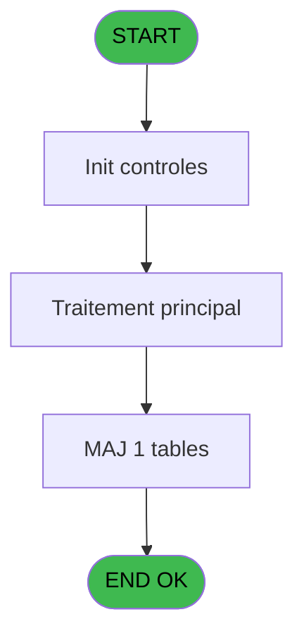

# WEL IDE 115 - Print extrait compte /Nom

> **Analyse**: Phases 1-4 2026-02-03 21:51 -> 21:52 (20s) | Assemblage 21:52
> **Pipeline**: V7.2 Enrichi
> **Structure**: 4 onglets (Resume | Ecrans | Donnees | Connexions)

<!-- TAB:Resume -->

## 1. FICHE D'IDENTITE

| Attribut | Valeur |
|----------|--------|
| Projet | WEL |
| IDE Position | 115 |
| Nom Programme | Print extrait compte /Nom |
| Fichier source | `Prg_115.xml` |
| Dossier IDE | A |
| Taches | 9 (1 ecrans visibles) |
| Tables modifiees | 1 |
| Programmes appeles | 1 |
| :warning: Statut | **ORPHELIN_POTENTIEL** |

## 2. DESCRIPTION FONCTIONNELLE

**Print extrait compte /Nom** assure la gestion complete de ce processus.

Le flux de traitement s'organise en **2 blocs fonctionnels** :

- **Impression** (7 taches) : generation de tickets et documents
- **Traitement** (2 taches) : traitements metier divers

**Donnees modifiees** : 1 tables en ecriture (Ventilation_Lg_Vente).

Detail : phases du traitement

#### Phase 1 : Traitement (2 taches)

- **115** - Veuillez patienter... **[[ECRAN]](#ecran-t1)**
- **115.1** - recup nom adherent

#### Phase 2 : Impression (7 taches)

- **115.2** - Printer 1 **[[ECRAN]](#ecran-t3)**
- **115.2.1** - edition extrait compte **[[ECRAN]](#ecran-t4)**
- **115.2.1.1** - Edition du pied
- **115.2.1.2** - Edition recap Free Etra
- **115.2.2** - edition extrait compte **[[ECRAN]](#ecran-t7)**
- **115.2.2.1** - Edition du pied
- **115.2.2.2** - Edition recap Free Etra

#### Tables impactees

| Table | Operations | Role metier |
|-------|-----------|-------------|
| Ventilation_Lg_Vente | **W** (2 usages) | Donnees de ventes |

## 3. BLOCS FONCTIONNELS

### 3.1 Traitement (2 taches)

Traitements internes.

---

#### 115 - Veuillez patienter... [[ECRAN]](#ecran-t1)

**Role** : Traitement : Veuillez patienter....
**Ecran** : 422 x 56 DLU (MDI) | [Voir mockup](#ecran-t1)

---

#### 115.1 - recup nom adherent

**Role** : Consultation/chargement : recup nom adherent.
**Variables liees** : B (P0 code adherent), J (W0 n° adherent)

### 3.2 Impression (7 taches)

Generation des documents et tickets.

---

#### 115.2 - Printer 1 [[ECRAN]](#ecran-t3)

**Role** : Generation du document : Printer 1.
**Ecran** : 1058 x 791 DLU (MDI) | [Voir mockup](#ecran-t3)

---

#### 115.2.1 - edition extrait compte [[ECRAN]](#ecran-t4)

**Role** : Generation du document : edition extrait compte.
**Ecran** : 1058 x 791 DLU (MDI) | [Voir mockup](#ecran-t4)

---

#### 115.2.1.1 - Edition du pied

**Role** : Generation du document : Edition du pied.

---

#### 115.2.1.2 - Edition recap Free Etra

**Role** : Generation du document : Edition recap Free Etra.

---

#### 115.2.2 - edition extrait compte [[ECRAN]](#ecran-t7)

**Role** : Generation du document : edition extrait compte.
**Ecran** : 1058 x 791 DLU (MDI) | [Voir mockup](#ecran-t7)

---

#### 115.2.2.1 - Edition du pied

**Role** : Generation du document : Edition du pied.

---

#### 115.2.2.2 - Edition recap Free Etra

**Role** : Generation du document : Edition recap Free Etra.

## 5. REGLES METIER

*(Aucune regle metier identifiee)*

## 6. CONTEXTE

- **Appele par**: (aucun)
- **Appelle**: 1 programmes | **Tables**: 7 (W:1 R:3 L:4) | **Taches**: 9 | **Expressions**: 9

<!-- TAB:Ecrans -->

## 8. ECRANS

### 8.1 Forms visibles (1 / 9)

| # | Position | Tache | Nom | Type | Largeur | Hauteur | Bloc |
|---|----------|-------|-----|------|---------|---------|------|
| 1 | 115 | 115 | Veuillez patienter... | MDI | 422 | 56 | Traitement |

### 8.2 Mockups Ecrans

---

#### 115 - Veuillez patienter...
**Tache** : [115](#t1) | **Type** : MDI | **Dimensions** : 422 x 56 DLU
**Bloc** : Traitement | **Titre IDE** : Veuillez patienter...

<!-- FORM-DATA:
{
    "width":  422,
    "vFactor":  8,
    "type":  "MDI",
    "hFactor":  8,
    "controls":  [
                     {
                         "x":  0,
                         "type":  "label",
                         "var":  "",
                         "y":  0,
                         "w":  423,
                         "fmt":  "",
                         "name":  "",
                         "h":  29,
                         "color":  "",
                         "text":  "",
                         "parent":  null
                     },
                     {
                         "x":  120,
                         "type":  "label",
                         "var":  "",
                         "y":  10,
                         "w":  221,
                         "fmt":  "",
                         "name":  "",
                         "h":  8,
                         "color":  "7",
                         "text":  "Impression en cours ...",
                         "parent":  null
                     },
                     {
                         "x":  0,
                         "type":  "label",
                         "var":  "",
                         "y":  29,
                         "w":  423,
                         "fmt":  "",
                         "name":  "",
                         "h":  27,
                         "color":  "",
                         "text":  "",
                         "parent":  null
                     },
                     {
                         "x":  69,
                         "type":  "label",
                         "var":  "",
                         "y":  38,
                         "w":  285,
                         "fmt":  "",
                         "name":  "",
                         "h":  8,
                         "color":  "",
                         "text":  "Edition de l\u0027extrait de compte",
                         "parent":  null
                     },
                     {
                         "x":  4,
                         "type":  "image",
                         "var":  "",
                         "y":  2,
                         "w":  72,
                         "fmt":  "",
                         "name":  "",
                         "h":  25,
                         "color":  "",
                         "text":  "",
                         "parent":  null
                     }
                 ],
    "taskId":  "115",
    "height":  56
}
-->

## 9. NAVIGATION

Ecran unique: **Veuillez patienter...**

### 9.3 Structure hierarchique (9 taches)

| Position | Tache | Type | Dimensions | Bloc |
|----------|-------|------|------------|------|
| **115.1** | [**Veuillez patienter...** (115)](#t1) [mockup](#ecran-t1) | MDI | 422x56 | Traitement |
| 115.1.1 | [recup nom adherent (115.1)](#t2) | MDI | - | |
| **115.2** | [**Printer 1** (115.2)](#t3) [mockup](#ecran-t3) | MDI | 1058x791 | Impression |
| 115.2.1 | [edition extrait compte (115.2.1)](#t4) [mockup](#ecran-t4) | MDI | 1058x791 | |
| 115.2.2 | [Edition du pied (115.2.1.1)](#t5) | - | - | |
| 115.2.3 | [Edition recap Free Etra (115.2.1.2)](#t6) | - | - | |
| 115.2.4 | [edition extrait compte (115.2.2)](#t7) [mockup](#ecran-t7) | MDI | 1058x791 | |
| 115.2.5 | [Edition du pied (115.2.2.1)](#t8) | - | - | |
| 115.2.6 | [Edition recap Free Etra (115.2.2.2)](#t9) | - | - | |

### 9.4 Algorigramme

> **Legende**: Vert = START/END OK | Rouge = END KO | Bleu = Decisions
> *Algorigramme auto-genere. Utiliser `/algorigramme` pour une synthese metier detaillee.*

<!-- TAB:Donnees -->

## 10. TABLES

### Tables utilisees (7)

| ID | Nom | Description | Type | R | W | L | Usages |
|----|-----|-------------|------|---|---|---|--------|
| 30 | gm-recherche_____gmr | Index de recherche | DB | R |   |   | 3 |
| 31 | gm-complet_______gmc |  | DB | R |   | L | 5 |
| 34 | hebergement______heb | Hebergement (chambres) | DB |   |   | L | 1 |
| 40 | comptable________cte |  | DB |   |   | L | 4 |
| 368 | pms_village |  | DB | R |   |   | 1 |
| 821 | Ventilation_Lg_Vente | Donnees de ventes | DB |   | **W** |   | 2 |
| 870 | Rayons_Boutique |  | DB |   |   | L | 1 |

### Colonnes par table (2 / 4 tables avec colonnes identifiees)

Table 30 - gm-recherche_____gmr (R) - 3 usages

| Lettre | Variable | Acces | Type |
|--------|----------|-------|------|
| A | W1 control_fin | R | Alpha |
| B | W1 solde compte | R | Numeric |
| C | W1 ss_total compte | R | Numeric |
| D | v.retour offre | R | Logical |

Table 31 - gm-complet_______gmc (R/L) - 5 usages

*Table utilisee uniquement en Link ou aucune colonne Real identifiee dans le DataView.*

Table 368 - pms_village (R) - 1 usages

*Table utilisee uniquement en Link ou aucune colonne Real identifiee dans le DataView.*

Table 821 - Ventilation_Lg_Vente (**W**) - 2 usages

*Table utilisee uniquement en Link ou aucune colonne Real identifiee dans le DataView.*

## 11. VARIABLES

### 11.1 Parametres entrants (7)

Variables recues en parametre.

| Lettre | Nom | Type | Usage dans |
|--------|-----|------|-----------|
| A | P0 societe | Alpha | - |
| B | P0 code adherent | Numeric | [115.1](#t2) |
| C | P0 filiation | Numeric | 1x parametre entrant |
| D | P0 date comptable | Date | - |
| E | P0 Affichage Tva ? | Logical | - |
| F | P0.Print_Email | Unicode | 1x parametre entrant |
| G | P0.NomFichier | Alpha | 1x parametre entrant |

### 11.2 Variables de travail (9)

Variables internes au programme.

| Lettre | Nom | Type | Usage dans |
|--------|-----|------|-----------|
| H | W0 nom | Alpha | - |
| I | W0 prenom | Alpha | - |
| J | W0 n° adherent | Numeric | - |
| K | W0 titre | Alpha | - |
| L | W0 lettre contrôle | Alpha | - |
| M | W0 filiation | Numeric | - |
| N | W0 langue parlee | Alpha | - |
| O | W0 chambre | Alpha | - |
| P | W0 devise locale | Alpha | - |

### 11.3 Autres (1)

Variables diverses.

| Lettre | Nom | Type | Usage dans |
|--------|-----|------|-----------|
| Q | v0.Chemin | Alpha | 1x refs |

Toutes les 17 variables (liste complete)

| Cat | Lettre | Nom Variable | Type |
|-----|--------|--------------|------|
| P0 | **A** | P0 societe | Alpha |
| P0 | **B** | P0 code adherent | Numeric |
| P0 | **C** | P0 filiation | Numeric |
| P0 | **D** | P0 date comptable | Date |
| P0 | **E** | P0 Affichage Tva ? | Logical |
| P0 | **F** | P0.Print_Email | Unicode |
| P0 | **G** | P0.NomFichier | Alpha |
| W0 | **H** | W0 nom | Alpha |
| W0 | **I** | W0 prenom | Alpha |
| W0 | **J** | W0 n° adherent | Numeric |
| W0 | **K** | W0 titre | Alpha |
| W0 | **L** | W0 lettre contrôle | Alpha |
| W0 | **M** | W0 filiation | Numeric |
| W0 | **N** | W0 langue parlee | Alpha |
| W0 | **O** | W0 chambre | Alpha |
| W0 | **P** | W0 devise locale | Alpha |
| Autre | **Q** | v0.Chemin | Alpha |

## 12. EXPRESSIONS

**9 / 9 expressions decodees (100%)**

### 12.1 Repartition par type

| Type | Expressions | Regles |
|------|-------------|--------|
| FORMAT | 1 | 0 |
| OTHER | 4 | 0 |
| REFERENCE_VG | 1 | 0 |
| CONDITION | 1 | 0 |
| CONCATENATION | 1 | 0 |
| STRING | 1 | 0 |

### 12.2 Expressions cles par type

#### FORMAT (1 expressions)

| Type | IDE | Expression | Regle |
|------|-----|------------|-------|
| FORMAT | 9 | `'EXTRAIT_NOM_'&Trim(Str(P0 code adherent [B],'8P0'))&'_'&Trim(Str(P0 filiation [C],'##'))&'_'&Trim(VG15)&'_'&DStr(Date(),'YYMMDD')&TStr(Time(),'HHMMSS')&'.pdf'` | - |

#### OTHER (4 expressions)

| Type | IDE | Expression | Regle |
|------|-----|------------|-------|
| OTHER | 3 | `DbDel ('{821,4}'DSOURCE,'')` | - |
| OTHER | 7 | `Translate('%club_exportdata%')&'WELCOME\'` | - |
| OTHER | 1 | `SetCrsr (1)` | - |
| OTHER | 2 | `SetCrsr (2)` | - |

#### REFERENCE_VG (1 expressions)

| Type | IDE | Expression | Regle |
|------|-----|------------|-------|
| REFERENCE_VG | 4 | `VG54` | - |

#### CONDITION (1 expressions)

| Type | IDE | Expression | Regle |
|------|-----|------------|-------|
| CONDITION | 6 | `P0.Print_Email [F]='P'` | - |

#### CONCATENATION (1 expressions)

| Type | IDE | Expression | Regle |
|------|-----|------------|-------|
| CONCATENATION | 5 | `Trim(v0.Chemin [Q])&Trim(P0.NomFichier [G])` | - |

#### STRING (1 expressions)

| Type | IDE | Expression | Regle |
|------|-----|------------|-------|
| STRING | 8 | `Trim(VG67)` | - |

<!-- TAB:Connexions -->

## 13. GRAPHE D'APPELS

### 13.1 Chaine depuis Main (Callers)

**Chemin**: (pas de callers directs)

### 13.2 Callers

| IDE | Nom Programme | Nb Appels |
|-----|---------------|-----------|
| - | (aucun) | - |

### 13.3 Callees (programmes appeles)

### 13.4 Detail Callees avec contexte

| IDE | Nom Programme | Appels | Contexte |
|-----|---------------|--------|----------|
| [25](WEL-IDE-25.md) | Creation Pied Facture | 2 | Sous-programme |

## 14. RECOMMANDATIONS MIGRATION

### 14.1 Profil du programme

| Metrique | Valeur | Impact migration |
|----------|--------|-----------------|
| Lignes de logique | 309 | Taille moyenne |
| Expressions | 9 | Peu de logique |
| Tables WRITE | 1 | Impact faible |
| Sous-programmes | 1 | Peu de dependances |
| Ecrans visibles | 1 | Ecran unique ou traitement batch |
| Code desactive | 0.6% (2 / 309) | Code sain |
| Regles metier | 0 | Pas de regle identifiee |

### 14.2 Plan de migration par bloc

#### Traitement (2 taches: 1 ecran, 1 traitement)

- **Strategie** : Orchestrateur avec 1 ecrans (Razor/React) et 1 traitements backend (services).
- Les ecrans deviennent des composants UI, les traitements invisibles deviennent des services injectables.
- 1 sous-programme(s) a migrer ou a reutiliser depuis les services existants.
- Decomposer les taches en services unitaires testables.

#### Impression (7 taches: 3 ecrans, 4 traitements)

- **Strategie** : Templates HTML -> PDF via wkhtmltopdf ou Puppeteer.
- `PrintService` injectable avec choix imprimante

### 14.3 Dependances critiques

| Dependance | Type | Appels | Impact |
|------------|------|--------|--------|
| Ventilation_Lg_Vente | Table WRITE (Database) | 2x | Schema + repository |
| [Creation Pied Facture (IDE 25)](WEL-IDE-25.md) | Sous-programme | 2x | Haute - Sous-programme |

---
*Spec DETAILED generee par Pipeline V7.2 - 2026-02-03 21:52*
