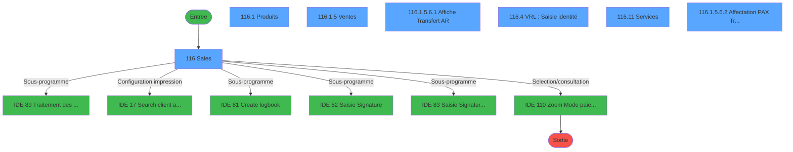
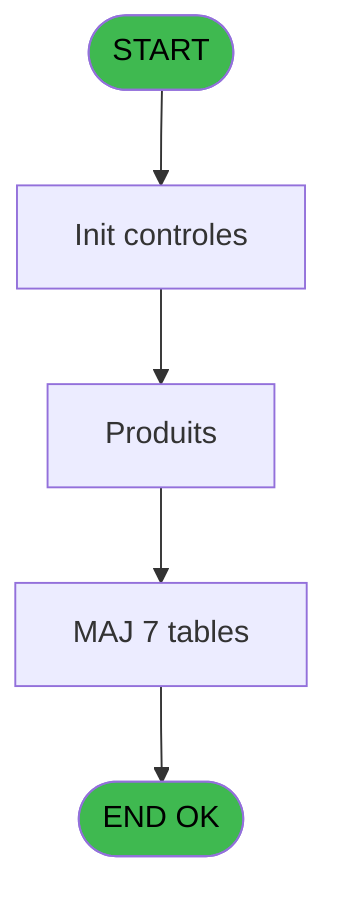
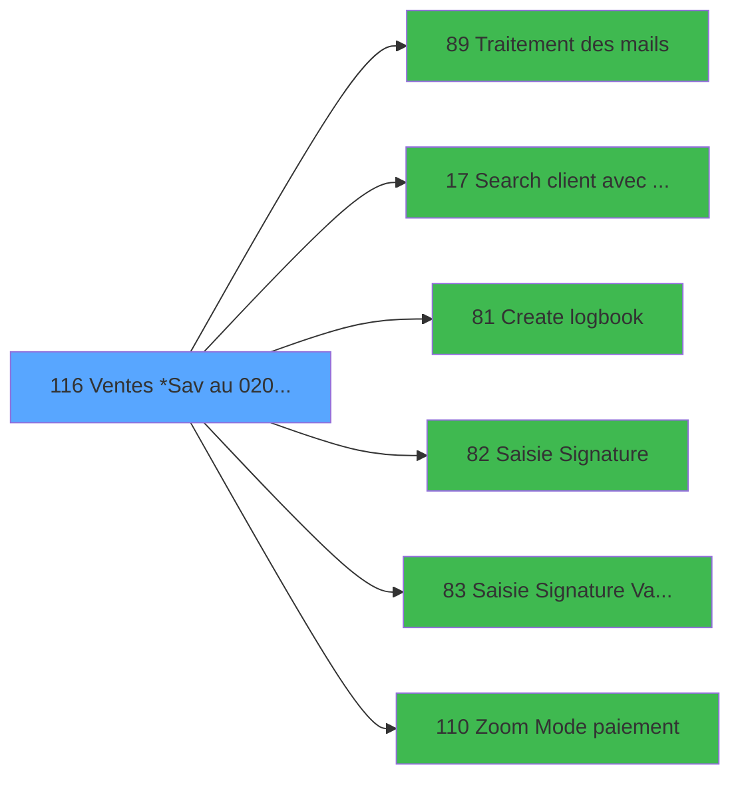

# WEL IDE 116 - Ventes *Sav au 02/07/2018

> **Analyse**: Phases 1-4 2026-02-03 21:52 -> 21:52 (20s) | Assemblage 21:52
> **Pipeline**: V7.2 Enrichi
> **Structure**: 4 onglets (Resume | Ecrans | Donnees | Connexions)

<!-- TAB:Resume -->

## 1. FICHE D'IDENTITE

| Attribut | Valeur |
|----------|--------|
| Projet | WEL |
| IDE Position | 116 |
| Nom Programme | Ventes *Sav au 02/07/2018 |
| Fichier source | `Prg_116.xml` |
| Dossier IDE | A |
| Taches | 39 (7 ecrans visibles) |
| Tables modifiees | 7 |
| Programmes appeles | 6 |
| :warning: Statut | **ORPHELIN_POTENTIEL** |

## 2. DESCRIPTION FONCTIONNELLE

**Ventes *Sav au 02/07/2018** assure la gestion complete de ce processus.

Le flux de traitement s'organise en **9 blocs fonctionnels** :

- **Traitement** (18 taches) : traitements metier divers
- **Creation** (4 taches) : insertion d'enregistrements en base (mouvements, prestations)
- **Transfert** (4 taches) : transferts de donnees entre modules ou deversements
- **Initialisation** (4 taches) : reinitialisation d'etats et de variables de travail
- **Calcul** (3 taches) : calculs de montants, stocks ou compteurs
- **Saisie** (2 taches) : ecrans de saisie utilisateur (formulaires, champs, donnees)
- **Reglement** (2 taches) : gestion des moyens de paiement et reglements
- **Impression** (1 tache) : generation de tickets et documents
- **Consultation** (1 tache) : ecrans de recherche, selection et consultation

**Donnees modifiees** : 7 tables en ecriture (reseau_cloture___rec, compte_gm________cgm, compteurs________cpt, trf_transfert_new, saisie_od_taiforfait, type_prestation, total_jour_forfait_ski).

**Logique metier** : 3 regles identifiees couvrant conditions metier.

Detail : phases du traitement

#### Phase 1 : Traitement (18 taches)

- **116** - Sales **[[ECRAN]](#ecran-t1)**
- **116.1** - Produits **[[ECRAN]](#ecran-t2)**
- **116.1.1** - Affectation Auto
- **116.1.3** - Gratuite ?
- **116.1.5.3** - Affectation **[[ECRAN]](#ecran-t12)**
- **116.1.5.4** - Test reseau
- **116.1.5.7** - VRL
- **116.1.5.8** - ourcentage
- **116.2** - Dé-Affecition
- **116.5** - Test si cloture en cours
- **116.5.1** - Blocage cloture
- **116.6** - Deblocage cloture
- **116.7** - garantie?
- **116.10** - Affectation Auto
- **116.11** - Services **[[ECRAN]](#ecran-t33)**
- **116.12** - Suppression ligne a 0
- **116.1.5.6.2.1** - Supprime enregs non affectés
- **116.14** - Solde gift pass

Delegue a : [Traitement des mails (IDE 89)](WEL-IDE-89.md), [Search client avec liste (IDE 17)](WEL-IDE-17.md)

#### Phase 2 : Initialisation (4 taches)

- **116.1.2** - RAZ 269
- **116.1.5.1** - RAZ 269
- **116.3** - RAZ 269
- **116.8** - RAZ 269

#### Phase 3 : Consultation (1 tache)

- **116.1.3.1** - Recherche imputation/ssimput

Delegue a : [Zoom Mode paiement (IDE 110)](WEL-IDE-110.md)

#### Phase 4 : Creation (4 taches)

- **116.1.4** - Creation Tempo
- **116.1.5.2.1** - Creation
- **116.1.5.3.1** - Creation Enregistrement Transf **[[ECRAN]](#ecran-t13)**
- **116.1.5.10** - Creation Tempo

Delegue a : [Create logbook (IDE 81)](WEL-IDE-81.md)

#### Phase 5 : Saisie (2 taches)

- **116.1.5** - Ventes **[[ECRAN]](#ecran-t8)**
- **116.4** - VRL : Saisie identité **[[ECRAN]](#ecran-t25)**

Delegue a : [Saisie Signature (IDE 82)](WEL-IDE-82.md), [Saisie Signature Validation (IDE 83)](WEL-IDE-83.md)

#### Phase 6 : Reglement (2 taches)

- **116.1.5.2** - Creation reglement
- **116.13** - Maj reglement

Delegue a : [Zoom Mode paiement (IDE 110)](WEL-IDE-110.md)

#### Phase 7 : Impression (1 tache)

- **116.1.5.5** - Increment Num. Ticket(VRL/VSL)

Delegue a : [Search client avec liste (IDE 17)](WEL-IDE-17.md)

#### Phase 8 : Transfert (4 taches)

- **116.1.5.6** - Type transfert
- **116.1.5.6.1** - Affiche Transfert A/R **[[ECRAN]](#ecran-t17)**
- **116.9** - Raz Affectation Transfert
- **116.1.5.6.2** - Affectation PAX / Transfert **[[ECRAN]](#ecran-t45)**

#### Phase 9 : Calcul (3 taches)

- **116.1.5.9** - Compte Enregs affectés
- **116.1.5.11** - Debloque compte
- **116.1.5.6.2.2** - Compte Enregs affectés

#### Tables impactees

| Table | Operations | Role metier |
|-------|-----------|-------------|
| total_jour_forfait_ski | R/**W**/L (9 usages) |  |
| type_prestation | **W**/L (7 usages) | Prestations/services vendus |
| saisie_od_taiforfait | **W**/L (6 usages) |  |
| reseau_cloture___rec | R/**W** (3 usages) | Donnees reseau/cloture |
| compte_gm________cgm | **W** (2 usages) | Comptes GM (generaux) |
| trf_transfert_new | **W** (1 usages) |  |
| compteurs________cpt | **W** (1 usages) | Comptes GM (generaux) |

## 3. BLOCS FONCTIONNELS

### 3.1 Traitement (18 taches)

Traitements internes.

---

#### 116 - Sales [[ECRAN]](#ecran-t1)

**Role** : Tache d'orchestration : point d'entree du programme (18 sous-taches). Coordonne l'enchainement des traitements.
**Ecran** : 1313 x 744 DLU | [Voir mockup](#ecran-t1)

17 sous-taches directes

| Tache | Nom | Bloc |
|-------|-----|------|
| [116.1](#t2) | Produits **[[ECRAN]](#ecran-t2)** | Traitement |
| [116.1.1](#t3) | Affectation Auto | Traitement |
| [116.1.3](#t5) | Gratuite ? | Traitement |
| [116.1.5.3](#t12) | Affectation **[[ECRAN]](#ecran-t12)** | Traitement |
| [116.1.5.4](#t14) | Test reseau | Traitement |
| [116.1.5.7](#t18) | VRL | Traitement |
| [116.1.5.8](#t19) | ourcentage | Traitement |
| [116.2](#t23) | Dé-Affecition | Traitement |
| [116.5](#t26) | Test si cloture en cours | Traitement |
| [116.5.1](#t27) | Blocage cloture | Traitement |
| [116.6](#t28) | Deblocage cloture | Traitement |
| [116.7](#t29) | garantie? | Traitement |
| [116.10](#t32) | Affectation Auto | Traitement |
| [116.11](#t33) | Services **[[ECRAN]](#ecran-t33)** | Traitement |
| [116.12](#t34) | Suppression ligne a 0 | Traitement |
| [116.1.5.6.2.1](#t46) | Supprime enregs non affectés | Traitement |
| [116.14](#t49) | Solde gift pass | Traitement |

---

#### 116.1 - Produits [[ECRAN]](#ecran-t2)

**Role** : Traitement : Produits.
**Ecran** : 901 x 598 DLU (Modal) | [Voir mockup](#ecran-t2)

---

#### 116.1.1 - Affectation Auto

**Role** : Traitement : Affectation Auto.

---

#### 116.1.3 - Gratuite ?

**Role** : Traitement : Gratuite ?.
**Variables liees** : DM (W0 gratuite ?)

---

#### 116.1.5.3 - Affectation [[ECRAN]](#ecran-t12)

**Role** : Traitement : Affectation.
**Ecran** : 584 x 253 DLU | [Voir mockup](#ecran-t12)

---

#### 116.1.5.4 - Test reseau

**Role** : Verification : Test reseau.
**Variables liees** : DE (W0 reseau)

---

#### 116.1.5.7 - VRL

**Role** : Traitement interne.

---

#### 116.1.5.8 - ourcentage

**Role** : Traitement : ourcentage.
**Variables liees** : CE (W0 Pourcentage reduction)

---

#### 116.2 - Dé-Affecition

**Role** : Traitement : Dé-Affecition.

---

#### 116.5 - Test si cloture en cours

**Role** : Verification : Test si cloture en cours.
**Variables liees** : T (W0 Cloture en cours)

---

#### 116.5.1 - Blocage cloture

**Role** : Traitement : Blocage cloture.
**Variables liees** : T (W0 Cloture en cours)

---

#### 116.6 - Deblocage cloture

**Role** : Traitement : Deblocage cloture.
**Variables liees** : T (W0 Cloture en cours)

---

#### 116.7 - garantie?

**Role** : Traitement : garantie?.

---

#### 116.10 - Affectation Auto

**Role** : Traitement : Affectation Auto.

---

#### 116.11 - Services [[ECRAN]](#ecran-t33)

**Role** : Traitement : Services.
**Ecran** : 157 x 600 DLU (Modal) | [Voir mockup](#ecran-t33)

---

#### 116.12 - Suppression ligne a 0

**Role** : Traitement : Suppression ligne a 0.
**Variables liees** : ER (V Nbre de Ligne Saisies), ES (v Nbre ligne de reglement Saisi), ET (V.Num ligne vente), EU (V.Total reglement ligne), EV (V.Multi reglement ligne)

---

#### 116.1.5.6.2.1 - Supprime enregs non affectés

**Role** : Traitement : Supprime enregs non affectés.

---

#### 116.14 - Solde gift pass

**Role** : Consultation/chargement : Solde gift pass.
**Variables liees** : D (P0 solde compte), I (P0 date solde), FP (V0.montant - Gift pass), FQ (V0.Solde gift pass)

### 3.2 Initialisation (4 taches)

Reinitialisation d'etats et variables de travail.

---

#### 116.1.2 - RAZ 269

**Role** : Reinitialisation : RAZ 269.

---

#### 116.1.5.1 - RAZ 269

**Role** : Reinitialisation : RAZ 269.

---

#### 116.3 - RAZ 269

**Role** : Reinitialisation : RAZ 269.

---

#### 116.8 - RAZ 269

**Role** : Reinitialisation : RAZ 269.

### 3.3 Consultation (1 tache)

Ecrans de recherche et consultation.

---

#### 116.1.3.1 - Recherche imputation/ssimput

**Role** : Traitement : Recherche imputation/ssimput.

### 3.4 Creation (4 taches)

Insertion de nouveaux enregistrements en base.

---

#### 116.1.4 - Creation Tempo

**Role** : Creation d'enregistrement : Creation Tempo.
**Delegue a** : [Create logbook (IDE 81)](WEL-IDE-81.md)

---

#### 116.1.5.2.1 - Creation

**Role** : Creation d'enregistrement : Creation.
**Delegue a** : [Create logbook (IDE 81)](WEL-IDE-81.md)

---

#### 116.1.5.3.1 - Creation Enregistrement Transf [[ECRAN]](#ecran-t13)

**Role** : Creation d'enregistrement : Creation Enregistrement Transf.
**Ecran** : 672 x 58 DLU | [Voir mockup](#ecran-t13)
**Variables liees** : BK (W0 Sens du transfert Aller), BL (W0 Date du transfert Aller), BM (W0 Heure du transfert Aller), BN (W0 b.Date du transfert), BT (W0 Sens du transfert Retour)
**Delegue a** : [Create logbook (IDE 81)](WEL-IDE-81.md)

---

#### 116.1.5.10 - Creation Tempo

**Role** : Creation d'enregistrement : Creation Tempo.
**Delegue a** : [Create logbook (IDE 81)](WEL-IDE-81.md)

### 3.5 Saisie (2 taches)

L'operateur saisit les donnees de la transaction via 2 ecrans (Ventes, VRL : Saisie identité).

---

#### 116.1.5 - Ventes [[ECRAN]](#ecran-t8)

**Role** : Saisie des donnees : Ventes.
**Ecran** : 618 x 586 DLU (Modal) | [Voir mockup](#ecran-t8)
**Delegue a** : [Saisie Signature (IDE 82)](WEL-IDE-82.md), [Saisie Signature Validation (IDE 83)](WEL-IDE-83.md)

---

#### 116.4 - VRL : Saisie identité [[ECRAN]](#ecran-t25)

**Role** : Saisie des donnees : VRL : Saisie identité.
**Ecran** : 1313 x 744 DLU | [Voir mockup](#ecran-t25)
**Variables liees** : R (W0 FIN SAISIE OD date), CA (W0 b.Saisie PAX), ER (V Nbre de Ligne Saisies), S (Bouton FIN SAISIE OD)
**Delegue a** : [Saisie Signature (IDE 82)](WEL-IDE-82.md), [Saisie Signature Validation (IDE 83)](WEL-IDE-83.md)

### 3.6 Reglement (2 taches)

Gestion des moyens de paiement : 2 taches de reglement.

---

#### 116.1.5.2 - Creation reglement

**Role** : Gestion du reglement : Creation reglement.
**Variables liees** : EK (V.Reglement premier article), ES (v Nbre ligne de reglement Saisi), EU (V.Total reglement ligne), EV (V.Multi reglement ligne)
**Delegue a** : [Zoom Mode paiement (IDE 110)](WEL-IDE-110.md)

---

#### 116.13 - Maj reglement

**Role** : Gestion du reglement : Maj reglement.
**Variables liees** : EK (V.Reglement premier article), ES (v Nbre ligne de reglement Saisi), EU (V.Total reglement ligne), EV (V.Multi reglement ligne)
**Delegue a** : [Zoom Mode paiement (IDE 110)](WEL-IDE-110.md)

### 3.7 Impression (1 tache)

Generation des documents et tickets.

---

#### 116.1.5.5 - Increment Num. Ticket(VRL/VSL)

**Role** : Generation du document : Increment Num. Ticket(VRL/VSL).
**Variables liees** : EO (v.IncrémentTicket(VRL/VSL) OK), EP (v.NumeroTicket(VRL/VSL))

### 3.8 Transfert (4 taches)

Transfert de donnees entre modules.

---

#### 116.1.5.6 - Type transfert

**Role** : Transfert de donnees : Type transfert.
**Variables liees** : X (W0.Type article), BK (W0 Sens du transfert Aller), BL (W0 Date du transfert Aller), BM (W0 Heure du transfert Aller), BN (W0 b.Date du transfert)

---

#### 116.1.5.6.1 - Affiche Transfert A/R [[ECRAN]](#ecran-t17)

**Role** : Reinitialisation : Affiche Transfert A/R.
**Ecran** : 1127 x 450 DLU (MDI) | [Voir mockup](#ecran-t17)
**Variables liees** : BK (W0 Sens du transfert Aller), BL (W0 Date du transfert Aller), BM (W0 Heure du transfert Aller), BN (W0 b.Date du transfert), BT (W0 Sens du transfert Retour)

---

#### 116.9 - Raz Affectation Transfert

**Role** : Reinitialisation : Raz Affectation Transfert.
**Variables liees** : BK (W0 Sens du transfert Aller), BL (W0 Date du transfert Aller), BM (W0 Heure du transfert Aller), BN (W0 b.Date du transfert), BT (W0 Sens du transfert Retour)

---

#### 116.1.5.6.2 - Affectation PAX / Transfert [[ECRAN]](#ecran-t45)

**Role** : Transfert de donnees : Affectation PAX / Transfert.
**Ecran** : 1313 x 744 DLU | [Voir mockup](#ecran-t45)
**Variables liees** : BK (W0 Sens du transfert Aller), BL (W0 Date du transfert Aller), BM (W0 Heure du transfert Aller), BN (W0 b.Date du transfert), BT (W0 Sens du transfert Retour)

### 3.9 Calcul (3 taches)

Calculs metier : montants, stocks, compteurs.

---

#### 116.1.5.9 - Compte Enregs affectés

**Role** : Traitement : Compte Enregs affectés.
**Variables liees** : D (P0 solde compte), H (P0 etat compte), DY (W0 Compte garanti)

---

#### 116.1.5.11 - Debloque compte

**Role** : Traitement : Debloque compte.
**Variables liees** : D (P0 solde compte), H (P0 etat compte), DY (W0 Compte garanti)

---

#### 116.1.5.6.2.2 - Compte Enregs affectés

**Role** : Traitement : Compte Enregs affectés.
**Variables liees** : D (P0 solde compte), H (P0 etat compte), DY (W0 Compte garanti)

## 5. REGLES METIER

3 regles identifiees:

### Saisie (2 regles)

#### [RM-001] Si V0.Decline Email receipt [FN] est nul, choix conditionnel selon [AC] (valeur 'VSL')

| Element | Detail |
|---------|--------|
| **Condition** | `V0.Decline Email receipt [FN]=0` |
| **Si vrai** | IF([AC]='VSL' |
| **Si faux** | P0.Date debut sejour [M],Date()),W0 Motif annulation [CK]) |
| **Variables** | M (P0.Date debut sejour), CK (W0 Motif annulation), FN (V0.Decline Email receipt) |
| **Expression source** | Expression 1 : `IF(V0.Decline Email receipt [FN]=0,IF([AC]='VSL',P0.Date deb` |
| **Exemple** | Si V0.Decline Email receipt [FN]=0 → IF([AC]='VSL'. Sinon → P0.Date debut sejour [M],Date()),W0 Motif annulation [CK]) |
| **Impact** | Bloc Saisie |

#### [RM-002] Traitement si W0 Commune [CQ] est renseigne

| Element | Detail |
|---------|--------|
| **Condition** | `W0 Commune [CQ]<>''` |
| **Si vrai** | RTrim (W0 Nom de la rue [CP])&Fill (' ' |
| **Si faux** | Len (RTrim (W0 Nom de la rue [CP]))-1)&RTrim (W0 Commune [CQ])&' '&W0 CP [CR],Trim(P0 Nom & prenom [K])) |
| **Variables** | K (P0 Nom & prenom), CM (W0 Nom), CP (W0 Nom de la rue), CQ (W0 Commune), CR (W0 CP) |
| **Expression source** | Expression 42 : `IF(W0 Commune [CQ]<>'',RTrim (W0 Nom de la rue [CP])&Fill ('` |
| **Exemple** | Si W0 Commune [CQ]<>'' → RTrim (W0 Nom de la rue [CP])&Fill (' ' |
| **Impact** | Bloc Saisie |

### Reglement (1 regles)

#### [RM-003] Si v Nbre ligne de reglem... [ES] alors V.Multi reglement ligne [EV] sinon VG43)

| Element | Detail |
|---------|--------|
| **Condition** | `v Nbre ligne de reglem... [ES]` |
| **Si vrai** | V.Multi reglement ligne [EV] |
| **Si faux** | VG43) |
| **Variables** | EV (V.Multi reglement ligne) |
| **Expression source** | Expression 44 : `IF(v Nbre ligne de reglem... [ES],V.Multi reglement ligne [E` |
| **Exemple** | Si v Nbre ligne de reglem... [ES] → V.Multi reglement ligne [EV]. Sinon → VG43) |
| **Impact** | Bloc Reglement |

## 6. CONTEXTE

- **Appele par**: (aucun)
- **Appelle**: 6 programmes | **Tables**: 26 (W:7 R:11 L:16) | **Taches**: 39 | **Expressions**: 110

<!-- TAB:Ecrans -->

## 8. ECRANS

### 8.1 Forms visibles (7 / 39)

| # | Position | Tache | Nom | Type | Largeur | Hauteur | Bloc |
|---|----------|-------|-----|------|---------|---------|------|
| 1 | 116 | 116 | Sales | Type0 | 1313 | 744 | Traitement |
| 2 | 116.1 | 116.1 | Produits | Modal | 901 | 598 | Traitement |
| 3 | 116.1.5 | 116.1.5 | Ventes | Modal | 618 | 586 | Saisie |
| 4 | 116.1.5.6.2 | 116.1.5.6.1 | Affiche Transfert A/R | MDI | 1127 | 450 | Transfert |
| 5 | 116.4 | 116.4 | VRL : Saisie identité | Type0 | 1313 | 744 | Saisie |
| 6 | 116.11 | 116.11 | Services | Modal | 157 | 600 | Traitement |
| 7 | 116.1.5.6.1 | 116.1.5.6.2 | Affectation PAX / Transfert | Type0 | 1313 | 744 | Transfert |

### 8.2 Mockups Ecrans

---

#### 116 - Sales
**Tache** : [116](#t1) | **Type** : Type0 | **Dimensions** : 1313 x 744 DLU
**Bloc** : Traitement | **Titre IDE** : Sales

<!-- FORM-DATA:
{
    "width":  1313,
    "vFactor":  100,
    "type":  "Type0",
    "hFactor":  100,
    "controls":  [
                     {
                         "x":  183,
                         "type":  "label",
                         "var":  "",
                         "y":  0,
                         "w":  1130,
                         "fmt":  "",
                         "name":  "",
                         "h":  66,
                         "color":  "212",
                         "text":  "SALES",
                         "parent":  null
                     },
                     {
                         "x":  1138,
                         "type":  "label",
                         "var":  "",
                         "y":  68,
                         "w":  175,
                         "fmt":  "",
                         "name":  "",
                         "h":  675,
                         "color":  "212",
                         "text":  "",
                         "parent":  null
                     },
                     {
                         "x":  11,
                         "type":  "label",
                         "var":  "",
                         "y":  85,
                         "w":  53,
                         "fmt":  "",
                         "name":  "",
                         "h":  43,
                         "color":  "",
                         "text":  "QTY",
                         "parent":  null
                     },
                     {
                         "x":  12,
                         "type":  "label",
                         "var":  "",
                         "y":  171,
                         "w":  51,
                         "fmt":  "",
                         "name":  "0",
                         "h":  41,
                         "color":  "219",
                         "text":  "0",
                         "parent":  null
                     },
                     {
                         "x":  12,
                         "type":  "label",
                         "var":  "",
                         "y":  217,
                         "w":  51,
                         "fmt":  "",
                         "name":  "1",
                         "h":  41,
                         "color":  "219",
                         "text":  "1",
                         "parent":  null
                     },
                     {
                         "x":  12,
                         "type":  "label",
                         "var":  "",
                         "y":  263,
                         "w":  51,
                         "fmt":  "",
                         "name":  "2",
                         "h":  41,
                         "color":  "219",
                         "text":  "2",
                         "parent":  null
                     },
                     {
                         "x":  12,
                         "type":  "label",
                         "var":  "",
                         "y":  309,
                         "w":  51,
                         "fmt":  "",
                         "name":  "3",
                         "h":  41,
                         "color":  "219",
                         "text":  "3",
                         "parent":  null
                     },
                     {
                         "x":  12,
                         "type":  "label",
                         "var":  "",
                         "y":  355,
                         "w":  51,
                         "fmt":  "",
                         "name":  "4",
                         "h":  41,
                         "color":  "219",
                         "text":  "4",
                         "parent":  null
                     },
                     {
                         "x":  12,
                         "type":  "label",
                         "var":  "",
                         "y":  401,
                         "w":  51,
                         "fmt":  "",
                         "name":  "5",
                         "h":  41,
                         "color":  "219",
                         "text":  "5",
                         "parent":  null
                     },
                     {
                         "x":  12,
                         "type":  "label",
                         "var":  "",
                         "y":  447,
                         "w":  51,
                         "fmt":  "",
                         "name":  "6",
                         "h":  41,
                         "color":  "219",
                         "text":  "6",
                         "parent":  null
                     },
                     {
                         "x":  12,
                         "type":  "label",
                         "var":  "",
                         "y":  493,
                         "w":  51,
                         "fmt":  "",
                         "name":  "7",
                         "h":  41,
                         "color":  "219",
                         "text":  "7",
                         "parent":  null
                     },
                     {
                         "x":  12,
                         "type":  "label",
                         "var":  "",
                         "y":  539,
                         "w":  51,
                         "fmt":  "",
                         "name":  "8",
                         "h":  41,
                         "color":  "219",
                         "text":  "8",
                         "parent":  null
                     },
                     {
                         "x":  12,
                         "type":  "label",
                         "var":  "",
                         "y":  585,
                         "w":  51,
                         "fmt":  "",
                         "name":  "9",
                         "h":  41,
                         "color":  "219",
                         "text":  "9",
                         "parent":  null
                     },
                     {
                         "x":  12,
                         "type":  "label",
                         "var":  "",
                         "y":  631,
                         "w":  51,
                         "fmt":  "",
                         "name":  "CLEAR",
                         "h":  41,
                         "color":  "219",
                         "text":  "Clear",
                         "parent":  null
                     },
                     {
                         "x":  12,
                         "type":  "edit",
                         "var":  "",
                         "y":  127,
                         "w":  51,
                         "fmt":  "",
                         "name":  "QTE",
                         "h":  41,
                         "color":  "",
                         "text":  "",
                         "parent":  null
                     },
                     {
                         "x":  67,
                         "type":  "subform",
                         "var":  "",
                         "y":  84,
                         "w":  162,
                         "fmt":  "",
                         "name":  "Service/Produits",
                         "h":  608,
                         "color":  "",
                         "text":  "",
                         "parent":  null
                     },
                     {
                         "x":  1,
                         "type":  "image",
                         "var":  "",
                         "y":  0,
                         "w":  173,
                         "fmt":  "",
                         "name":  "Bouton ABANDON",
                         "h":  66,
                         "color":  "226",
                         "text":  "",
                         "parent":  null
                     },
                     {
                         "x":  1146,
                         "type":  "edit",
                         "var":  "",
                         "y":  77,
                         "w":  158,
                         "fmt":  "30",
                         "name":  "Bouton FIN SAISIE OD",
                         "h":  79,
                         "color":  "214",
                         "text":  "",
                         "parent":  null
                     },
                     {
                         "x":  1146,
                         "type":  "edit",
                         "var":  "",
                         "y":  166,
                         "w":  158,
                         "fmt":  "30",
                         "name":  "IDENTITY",
                         "h":  79,
                         "color":  "214",
                         "text":  "",
                         "parent":  null
                     },
                     {
                         "x":  231,
                         "type":  "subform",
                         "var":  "",
                         "y":  82,
                         "w":  903,
                         "fmt":  "",
                         "name":  "Produits",
                         "h":  653,
                         "color":  "",
                         "text":  "",
                         "parent":  null
                     }
                 ],
    "taskId":  "116",
    "height":  744
}
-->

<strong>Champs : 3 champs</strong>

| Pos (x,y) | Nom | Variable | Type |
|-----------|-----|----------|------|
| 12,127 | QTE | - | edit |
| 1146,77 | Bouton FIN SAISIE OD | - | edit |
| 1146,166 | IDENTITY | - | edit |

---

#### 116.1 - Produits
**Tache** : [116.1](#t2) | **Type** : Modal | **Dimensions** : 901 x 598 DLU
**Bloc** : Traitement | **Titre IDE** : Produits

<!-- FORM-DATA:
{
    "width":  901,
    "vFactor":  8,
    "type":  "Modal",
    "hFactor":  4,
    "controls":  [
                     {
                         "x":  0,
                         "type":  "label",
                         "var":  "",
                         "y":  0,
                         "w":  220,
                         "fmt":  "",
                         "name":  "",
                         "h":  43,
                         "color":  "",
                         "text":  "PRODUCTS",
                         "parent":  null
                     },
                     {
                         "x":  2,
                         "type":  "table",
                         "var":  "",
                         "name":  "",
                         "titleH":  12,
                         "color":  "",
                         "w":  217,
                         "y":  42,
                         "fmt":  "",
                         "parent":  null,
                         "text":  "",
                         "rowH":  46,
                         "h":  554,
                         "cols":  [
                                      {
                                          "title":  "",
                                          "layer":  1,
                                          "w":  210
                                      }
                                  ],
                         "rows":  1
                     },
                     {
                         "x":  219,
                         "type":  "button",
                         "var":  "",
                         "y":  0,
                         "w":  56,
                         "fmt":  "",
                         "name":  "",
                         "h":  299,
                         "color":  "",
                         "text":  "",
                         "parent":  null
                     },
                     {
                         "x":  279,
                         "type":  "subform",
                         "var":  "",
                         "y":  0,
                         "w":  620,
                         "fmt":  "",
                         "name":  "Ventes",
                         "h":  598,
                         "color":  "",
                         "text":  "",
                         "parent":  null
                     },
                     {
                         "x":  6,
                         "type":  "edit",
                         "var":  "",
                         "y":  45,
                         "w":  138,
                         "fmt":  "",
                         "name":  "BT_ARTICLE",
                         "h":  40,
                         "color":  "214",
                         "text":  "",
                         "parent":  4
                     },
                     {
                         "x":  144,
                         "type":  "edit",
                         "var":  "",
                         "y":  45,
                         "w":  73,
                         "fmt":  "## ### ### ###.###Z",
                         "name":  "BT_PRIX",
                         "h":  40,
                         "color":  "214",
                         "text":  "",
                         "parent":  4
                     },
                     {
                         "x":  219,
                         "type":  "button",
                         "var":  "",
                         "y":  298,
                         "w":  56,
                         "fmt":  "",
                         "name":  "",
                         "h":  298,
                         "color":  "",
                         "text":  "",
                         "parent":  null
                     }
                 ],
    "taskId":  "116.1",
    "height":  598
}
-->

<strong>Champs : 2 champs</strong>

| Pos (x,y) | Nom | Variable | Type |
|-----------|-----|----------|------|
| 6,45 | BT_ARTICLE | - | edit |
| 144,45 | BT_PRIX | - | edit |

<strong>Boutons : 2 boutons</strong>

| Bouton | Pos (x,y) | Action |
|--------|-----------|--------|
| (sans nom) | 219,0 | Action declenchee |
| (sans nom) | 219,298 | Action declenchee |

---

#### 116.1.5 - Ventes
**Tache** : [116.1.5](#t8) | **Type** : Modal | **Dimensions** : 618 x 586 DLU
**Bloc** : Saisie | **Titre IDE** : Ventes

<!-- FORM-DATA:
{
    "width":  618,
    "vFactor":  8,
    "type":  "Modal",
    "hFactor":  4,
    "controls":  [
                     {
                         "x":  5,
                         "type":  "label",
                         "var":  "",
                         "y":  0,
                         "w":  147,
                         "fmt":  "",
                         "name":  "",
                         "h":  43,
                         "color":  "",
                         "text":  "PRODUCTS",
                         "parent":  null
                     },
                     {
                         "x":  150,
                         "type":  "label",
                         "var":  "",
                         "y":  0,
                         "w":  52,
                         "fmt":  "",
                         "name":  "",
                         "h":  43,
                         "color":  "",
                         "text":  "QTY",
                         "parent":  null
                     },
                     {
                         "x":  201,
                         "type":  "label",
                         "var":  "",
                         "y":  0,
                         "w":  145,
                         "fmt":  "",
                         "name":  "",
                         "h":  43,
                         "color":  "",
                         "text":  "UNIT PRICE",
                         "parent":  null
                     },
                     {
                         "x":  344,
                         "type":  "label",
                         "var":  "",
                         "y":  0,
                         "w":  60,
                         "fmt":  "",
                         "name":  "",
                         "h":  43,
                         "color":  "",
                         "text":  "- %",
                         "parent":  null
                     },
                     {
                         "x":  403,
                         "type":  "label",
                         "var":  "",
                         "y":  0,
                         "w":  156,
                         "fmt":  "",
                         "name":  "",
                         "h":  43,
                         "color":  "",
                         "text":  "PRICE",
                         "parent":  null
                     },
                     {
                         "x":  285,
                         "type":  "label",
                         "var":  "",
                         "y":  325,
                         "w":  52,
                         "fmt":  "",
                         "name":  "",
                         "h":  38,
                         "color":  "",
                         "text":  "TOTAL",
                         "parent":  null
                     },
                     {
                         "x":  202,
                         "type":  "label",
                         "var":  "",
                         "y":  383,
                         "w":  135,
                         "fmt":  "",
                         "name":  "",
                         "h":  38,
                         "color":  "",
                         "text":  "Payment mode",
                         "parent":  null
                     },
                     {
                         "x":  12,
                         "type":  "line",
                         "var":  "",
                         "y":  435,
                         "w":  599,
                         "fmt":  "",
                         "name":  "",
                         "h":  0,
                         "color":  "",
                         "text":  "",
                         "parent":  null
                     },
                     {
                         "x":  79,
                         "type":  "label",
                         "var":  "",
                         "y":  456,
                         "w":  135,
                         "fmt":  "",
                         "name":  "",
                         "h":  44,
                         "color":  "",
                         "text":  "Discount reason",
                         "parent":  null
                     },
                     {
                         "x":  79,
                         "type":  "label",
                         "var":  "",
                         "y":  512,
                         "w":  135,
                         "fmt":  "",
                         "name":  "",
                         "h":  65,
                         "color":  "",
                         "text":  "Comment",
                         "parent":  null
                     },
                     {
                         "x":  6,
                         "type":  "table",
                         "var":  "",
                         "name":  "",
                         "titleH":  12,
                         "color":  "",
                         "w":  551,
                         "y":  42,
                         "fmt":  "",
                         "parent":  null,
                         "text":  "",
                         "rowH":  46,
                         "h":  278,
                         "cols":  [
                                      {
                                          "title":  "",
                                          "layer":  1,
                                          "w":  143
                                      },
                                      {
                                          "title":  "",
                                          "layer":  2,
                                          "w":  50
                                      },
                                      {
                                          "title":  "",
                                          "layer":  3,
                                          "w":  144
                                      },
                                      {
                                          "title":  "",
                                          "layer":  4,
                                          "w":  58
                                      },
                                      {
                                          "title":  "",
                                          "layer":  5,
                                          "w":  151
                                      }
                                  ],
                         "rows":  5
                     },
                     {
                         "x":  556,
                         "type":  "button",
                         "var":  "",
                         "y":  0,
                         "w":  56,
                         "fmt":  "",
                         "name":  "",
                         "h":  161,
                         "color":  "",
                         "text":  "",
                         "parent":  null
                     },
                     {
                         "x":  9,
                         "type":  "edit",
                         "var":  "",
                         "y":  45,
                         "w":  138,
                         "fmt":  "",
                         "name":  "BOUTON_ARTICLE",
                         "h":  38,
                         "color":  "220",
                         "text":  "",
                         "parent":  15
                     },
                     {
                         "x":  154,
                         "type":  "edit",
                         "var":  "",
                         "y":  46,
                         "w":  43,
                         "fmt":  "3Z",
                         "name":  "sod_quantite",
                         "h":  38,
                         "color":  "",
                         "text":  "",
                         "parent":  15
                     },
                     {
                         "x":  205,
                         "type":  "edit",
                         "var":  "",
                         "y":  46,
                         "w":  134,
                         "fmt":  "N## ### ### ###.###Z",
                         "name":  "sod_prix_unitaire",
                         "h":  38,
                         "color":  "",
                         "text":  "",
                         "parent":  15
                     },
                     {
                         "x":  350,
                         "type":  "edit",
                         "var":  "",
                         "y":  46,
                         "w":  48,
                         "fmt":  "3%",
                         "name":  "sod_pourcentage_reduction",
                         "h":  38,
                         "color":  "",
                         "text":  "",
                         "parent":  15
                     },
                     {
                         "x":  404,
                         "type":  "edit",
                         "var":  "",
                         "y":  46,
                         "w":  146,
                         "fmt":  "N## ### ### ###.###Z",
                         "name":  "sod_montant_0001",
                         "h":  38,
                         "color":  "",
                         "text":  "",
                         "parent":  15
                     },
                     {
                         "x":  556,
                         "type":  "button",
                         "var":  "",
                         "y":  159,
                         "w":  56,
                         "fmt":  "",
                         "name":  "",
                         "h":  161,
                         "color":  "",
                         "text":  "",
                         "parent":  null
                     },
                     {
                         "x":  347,
                         "type":  "edit",
                         "var":  "",
                         "y":  327,
                         "w":  209,
                         "fmt":  "N## ### ### ###.###Z",
                         "name":  "W0 montant",
                         "h":  44,
                         "color":  "",
                         "text":  "",
                         "parent":  null
                     },
                     {
                         "x":  347,
                         "type":  "edit",
                         "var":  "",
                         "y":  383,
                         "w":  209,
                         "fmt":  "",
                         "name":  "V1.Mode paiement_0001",
                         "h":  44,
                         "color":  "",
                         "text":  "",
                         "parent":  null
                     },
                     {
                         "x":  224,
                         "type":  "combobox",
                         "var":  "",
                         "y":  460,
                         "w":  388,
                         "fmt":  "",
                         "name":  "sod_code_reduction",
                         "h":  20,
                         "color":  "",
                         "text":  "SANS",
                         "parent":  null
                     },
                     {
                         "x":  224,
                         "type":  "edit",
                         "var":  "",
                         "y":  512,
                         "w":  388,
                         "fmt":  "",
                         "name":  "sod_commentaire_0001",
                         "h":  65,
                         "color":  "",
                         "text":  "",
                         "parent":  null
                     }
                 ],
    "taskId":  "116.1.5",
    "height":  586
}
-->

<strong>Champs : 9 champs</strong>

| Pos (x,y) | Nom | Variable | Type |
|-----------|-----|----------|------|
| 9,45 | BOUTON_ARTICLE | - | edit |
| 154,46 | sod_quantite | - | edit |
| 205,46 | sod_prix_unitaire | - | edit |
| 350,46 | sod_pourcentage_reduction | - | edit |
| 404,46 | sod_montant_0001 | - | edit |
| 347,327 | W0 montant | - | edit |
| 347,383 | V1.Mode paiement_0001 | - | edit |
| 224,460 | sod_code_reduction | - | combobox |
| 224,512 | sod_commentaire_0001 | - | edit |

<strong>Boutons : 2 boutons</strong>

| Bouton | Pos (x,y) | Action |
|--------|-----------|--------|
| (sans nom) | 556,0 | Action declenchee |
| (sans nom) | 556,159 | Action declenchee |

---

#### 116.1.5.6.2 - Affiche Transfert A/R
**Tache** : [116.1.5.6.1](#t17) | **Type** : MDI | **Dimensions** : 1127 x 450 DLU
**Bloc** : Transfert | **Titre IDE** : Affiche Transfert A/R

<!-- FORM-DATA:
{
    "width":  1127,
    "vFactor":  100,
    "type":  "MDI",
    "hFactor":  100,
    "controls":  [
                     {
                         "x":  4,
                         "type":  "label",
                         "var":  "",
                         "y":  16,
                         "w":  556,
                         "fmt":  "",
                         "name":  "",
                         "h":  44,
                         "color":  "",
                         "text":  "ARRIVING",
                         "parent":  null
                     },
                     {
                         "x":  568,
                         "type":  "label",
                         "var":  "",
                         "y":  16,
                         "w":  556,
                         "fmt":  "",
                         "name":  "",
                         "h":  44,
                         "color":  "",
                         "text":  "DEPARTING",
                         "parent":  null
                     },
                     {
                         "x":  569,
                         "type":  "label",
                         "var":  "",
                         "y":  57,
                         "w":  555,
                         "fmt":  "",
                         "name":  "",
                         "h":  380,
                         "color":  "220",
                         "text":  "",
                         "parent":  null
                     },
                     {
                         "x":  5,
                         "type":  "label",
                         "var":  "",
                         "y":  58,
                         "w":  555,
                         "fmt":  "",
                         "name":  "",
                         "h":  380,
                         "color":  "220",
                         "text":  "",
                         "parent":  null
                     },
                     {
                         "x":  590,
                         "type":  "label",
                         "var":  "",
                         "y":  105,
                         "w":  101,
                         "fmt":  "",
                         "name":  "",
                         "h":  44,
                         "color":  "",
                         "text":  "Transfer date",
                         "parent":  null
                     },
                     {
                         "x":  824,
                         "type":  "label",
                         "var":  "",
                         "y":  105,
                         "w":  163,
                         "fmt":  "",
                         "name":  "",
                         "h":  44,
                         "color":  "",
                         "text":  "Airport/Station Code",
                         "parent":  null
                     },
                     {
                         "x":  21,
                         "type":  "label",
                         "var":  "",
                         "y":  106,
                         "w":  101,
                         "fmt":  "",
                         "name":  "",
                         "h":  44,
                         "color":  "",
                         "text":  "Transfer date",
                         "parent":  null
                     },
                     {
                         "x":  260,
                         "type":  "label",
                         "var":  "",
                         "y":  106,
                         "w":  163,
                         "fmt":  "",
                         "name":  "",
                         "h":  44,
                         "color":  "",
                         "text":  "Airport/Station Code",
                         "parent":  null
                     },
                     {
                         "x":  590,
                         "type":  "label",
                         "var":  "",
                         "y":  187,
                         "w":  101,
                         "fmt":  "",
                         "name":  "",
                         "h":  44,
                         "color":  "",
                         "text":  "Transfer time",
                         "parent":  null
                     },
                     {
                         "x":  824,
                         "type":  "label",
                         "var":  "",
                         "y":  187,
                         "w":  163,
                         "fmt":  "",
                         "name":  "",
                         "h":  44,
                         "color":  "",
                         "text":  "Flight/Train number",
                         "parent":  null
                     },
                     {
                         "x":  21,
                         "type":  "label",
                         "var":  "",
                         "y":  188,
                         "w":  101,
                         "fmt":  "",
                         "name":  "",
                         "h":  44,
                         "color":  "",
                         "text":  "Transfer time",
                         "parent":  null
                     },
                     {
                         "x":  260,
                         "type":  "label",
                         "var":  "",
                         "y":  188,
                         "w":  163,
                         "fmt":  "",
                         "name":  "",
                         "h":  44,
                         "color":  "",
                         "text":  "Flight/Train number",
                         "parent":  null
                     },
                     {
                         "x":  590,
                         "type":  "label",
                         "var":  "",
                         "y":  269,
                         "w":  101,
                         "fmt":  "",
                         "name":  "",
                         "h":  44,
                         "color":  "",
                         "text":  "Type Endroit",
                         "parent":  null
                     },
                     {
                         "x":  824,
                         "type":  "label",
                         "var":  "",
                         "y":  269,
                         "w":  163,
                         "fmt":  "",
                         "name":  "",
                         "h":  44,
                         "color":  "",
                         "text":  "Compagnie",
                         "parent":  null
                     },
                     {
                         "x":  21,
                         "type":  "label",
                         "var":  "",
                         "y":  270,
                         "w":  101,
                         "fmt":  "",
                         "name":  "",
                         "h":  44,
                         "color":  "",
                         "text":  "Type Endroit",
                         "parent":  null
                     },
                     {
                         "x":  260,
                         "type":  "label",
                         "var":  "",
                         "y":  270,
                         "w":  163,
                         "fmt":  "",
                         "name":  "",
                         "h":  44,
                         "color":  "",
                         "text":  "Compagnie",
                         "parent":  null
                     },
                     {
                         "x":  590,
                         "type":  "label",
                         "var":  "",
                         "y":  351,
                         "w":  101,
                         "fmt":  "",
                         "name":  "",
                         "h":  44,
                         "color":  "",
                         "text":  "Comment",
                         "parent":  null
                     },
                     {
                         "x":  21,
                         "type":  "label",
                         "var":  "",
                         "y":  352,
                         "w":  101,
                         "fmt":  "",
                         "name":  "",
                         "h":  44,
                         "color":  "",
                         "text":  "Comment",
                         "parent":  null
                     },
                     {
                         "x":  700,
                         "type":  "edit",
                         "var":  "",
                         "y":  105,
                         "w":  101,
                         "fmt":  "##/##/####Z",
                         "name":  "Date_transfert_aller",
                         "h":  44,
                         "color":  "",
                         "text":  "",
                         "parent":  null
                     },
                     {
                         "x":  989,
                         "type":  "edit",
                         "var":  "",
                         "y":  105,
                         "w":  130,
                         "fmt":  "",
                         "name":  "W1 Code Aeroport/Gare Ret_0001",
                         "h":  44,
                         "color":  "",
                         "text":  "",
                         "parent":  null
                     },
                     {
                         "x":  136,
                         "type":  "edit",
                         "var":  "",
                         "y":  106,
                         "w":  101,
                         "fmt":  "##/##/####Z",
                         "name":  "Date_transfert_aller",
                         "h":  44,
                         "color":  "",
                         "text":  "",
                         "parent":  null
                     },
                     {
                         "x":  425,
                         "type":  "edit",
                         "var":  "",
                         "y":  106,
                         "w":  130,
                         "fmt":  "",
                         "name":  "Code Aeroport/Gare",
                         "h":  44,
                         "color":  "",
                         "text":  "",
                         "parent":  null
                     },
                     {
                         "x":  700,
                         "type":  "edit",
                         "var":  "",
                         "y":  187,
                         "w":  101,
                         "fmt":  "",
                         "name":  "W1 Heure transfert Retour_0001",
                         "h":  44,
                         "color":  "",
                         "text":  "",
                         "parent":  null
                     },
                     {
                         "x":  989,
                         "type":  "edit",
                         "var":  "",
                         "y":  187,
                         "w":  130,
                         "fmt":  "",
                         "name":  "W1 Num Vol/Train Retour_0001",
                         "h":  44,
                         "color":  "",
                         "text":  "",
                         "parent":  null
                     },
                     {
                         "x":  136,
                         "type":  "edit",
                         "var":  "",
                         "y":  188,
                         "w":  101,
                         "fmt":  "",
                         "name":  "Heure transfert",
                         "h":  44,
                         "color":  "",
                         "text":  "",
                         "parent":  null
                     },
                     {
                         "x":  425,
                         "type":  "edit",
                         "var":  "",
                         "y":  188,
                         "w":  130,
                         "fmt":  "",
                         "name":  "Num Vol/Train",
                         "h":  44,
                         "color":  "",
                         "text":  "",
                         "parent":  null
                     },
                     {
                         "x":  989,
                         "type":  "edit",
                         "var":  "",
                         "y":  269,
                         "w":  130,
                         "fmt":  "",
                         "name":  "W1 Compagnie Retour_0001",
                         "h":  44,
                         "color":  "",
                         "text":  "",
                         "parent":  null
                     },
                     {
                         "x":  425,
                         "type":  "edit",
                         "var":  "",
                         "y":  270,
                         "w":  130,
                         "fmt":  "",
                         "name":  "Compagnie",
                         "h":  44,
                         "color":  "",
                         "text":  "",
                         "parent":  null
                     },
                     {
                         "x":  700,
                         "type":  "combobox",
                         "var":  "",
                         "y":  272,
                         "w":  119,
                         "fmt":  "",
                         "name":  "W1 Type Endroit Retour_0001",
                         "h":  20,
                         "color":  "",
                         "text":  "TR,PL",
                         "parent":  null
                     },
                     {
                         "x":  136,
                         "type":  "combobox",
                         "var":  "",
                         "y":  273,
                         "w":  119,
                         "fmt":  "",
                         "name":  "Type Endroit Aller",
                         "h":  20,
                         "color":  "",
                         "text":  "TR,PL",
                         "parent":  null
                     },
                     {
                         "x":  700,
                         "type":  "edit",
                         "var":  "",
                         "y":  351,
                         "w":  419,
                         "fmt":  "",
                         "name":  "W1 Commentaire Retour_0001",
                         "h":  44,
                         "color":  "",
                         "text":  "",
                         "parent":  null
                     },
                     {
                         "x":  136,
                         "type":  "edit",
                         "var":  "",
                         "y":  352,
                         "w":  419,
                         "fmt":  "",
                         "name":  "Commentaire Aller",
                         "h":  44,
                         "color":  "",
                         "text":  "",
                         "parent":  null
                     }
                 ],
    "taskId":  "116.1.5.6.2",
    "height":  450
}
-->

<strong>Champs : 14 champs</strong>

| Pos (x,y) | Nom | Variable | Type |
|-----------|-----|----------|------|
| 700,105 | Date_transfert_aller | - | edit |
| 989,105 | W1 Code Aeroport/Gare Ret_0001 | - | edit |
| 136,106 | Date_transfert_aller | - | edit |
| 425,106 | Code Aeroport/Gare | - | edit |
| 700,187 | W1 Heure transfert Retour_0001 | - | edit |
| 989,187 | W1 Num Vol/Train Retour_0001 | - | edit |
| 136,188 | Heure transfert | - | edit |
| 425,188 | Num Vol/Train | - | edit |
| 989,269 | W1 Compagnie Retour_0001 | - | edit |
| 425,270 | Compagnie | - | edit |
| 700,272 | W1 Type Endroit Retour_0001 | - | combobox |
| 136,273 | Type Endroit Aller | - | combobox |
| 700,351 | W1 Commentaire Retour_0001 | - | edit |
| 136,352 | Commentaire Aller | - | edit |

---

#### 116.4 - VRL : Saisie identité
**Tache** : [116.4](#t25) | **Type** : Type0 | **Dimensions** : 1313 x 744 DLU
**Bloc** : Saisie | **Titre IDE** : VRL : Saisie identité

<!-- FORM-DATA:
{
    "width":  1313,
    "vFactor":  8,
    "type":  "Type0",
    "hFactor":  4,
    "controls":  [
                     {
                         "x":  182,
                         "type":  "label",
                         "var":  "",
                         "y":  0,
                         "w":  1130,
                         "fmt":  "",
                         "name":  "",
                         "h":  66,
                         "color":  "212",
                         "text":  "VRL : ENTER IDENTITY",
                         "parent":  null
                     },
                     {
                         "x":  1138,
                         "type":  "label",
                         "var":  "",
                         "y":  69,
                         "w":  175,
                         "fmt":  "",
                         "name":  "",
                         "h":  675,
                         "color":  "212",
                         "text":  "",
                         "parent":  null
                     },
                     {
                         "x":  381,
                         "type":  "label",
                         "var":  "",
                         "y":  201,
                         "w":  35,
                         "fmt":  "",
                         "name":  "",
                         "h":  36,
                         "color":  "",
                         "text":  "Title",
                         "parent":  null
                     },
                     {
                         "x":  285,
                         "type":  "label",
                         "var":  "",
                         "y":  252,
                         "w":  131,
                         "fmt":  "",
                         "name":  "",
                         "h":  44,
                         "color":  "",
                         "text":  "Last name",
                         "parent":  null
                     },
                     {
                         "x":  279,
                         "type":  "label",
                         "var":  "",
                         "y":  315,
                         "w":  137,
                         "fmt":  "",
                         "name":  "",
                         "h":  44,
                         "color":  "",
                         "text":  "First name",
                         "parent":  null
                     },
                     {
                         "x":  302,
                         "type":  "label",
                         "var":  "",
                         "y":  376,
                         "w":  114,
                         "fmt":  "",
                         "name":  "",
                         "h":  44,
                         "color":  "",
                         "text":  "Address",
                         "parent":  null
                     },
                     {
                         "x":  0,
                         "type":  "image",
                         "var":  "",
                         "y":  0,
                         "w":  175,
                         "fmt":  "",
                         "name":  "RETOUR",
                         "h":  66,
                         "color":  "226",
                         "text":  "",
                         "parent":  null
                     },
                     {
                         "x":  1146,
                         "type":  "edit",
                         "var":  "",
                         "y":  78,
                         "w":  158,
                         "fmt":  "30",
                         "name":  "VALIDATE",
                         "h":  79,
                         "color":  "214",
                         "text":  "",
                         "parent":  3
                     },
                     {
                         "x":  421,
                         "type":  "combobox",
                         "var":  "",
                         "y":  201,
                         "w":  140,
                         "fmt":  "",
                         "name":  "W2 Titre",
                         "h":  36,
                         "color":  "",
                         "text":  "",
                         "parent":  null
                     },
                     {
                         "x":  421,
                         "type":  "edit",
                         "var":  "",
                         "y":  254,
                         "w":  326,
                         "fmt":  "",
                         "name":  "W2 Nom",
                         "h":  44,
                         "color":  "",
                         "text":  "",
                         "parent":  null
                     },
                     {
                         "x":  421,
                         "type":  "edit",
                         "var":  "",
                         "y":  315,
                         "w":  326,
                         "fmt":  "",
                         "name":  "W2 Prenom",
                         "h":  44,
                         "color":  "",
                         "text":  "",
                         "parent":  null
                     },
                     {
                         "x":  421,
                         "type":  "edit",
                         "var":  "",
                         "y":  376,
                         "w":  117,
                         "fmt":  "",
                         "name":  "W2 Num rue",
                         "h":  44,
                         "color":  "",
                         "text":  "",
                         "parent":  null
                     },
                     {
                         "x":  544,
                         "type":  "edit",
                         "var":  "",
                         "y":  376,
                         "w":  316,
                         "fmt":  "",
                         "name":  "W2 Nom rue",
                         "h":  44,
                         "color":  "",
                         "text":  "",
                         "parent":  null
                     },
                     {
                         "x":  421,
                         "type":  "edit",
                         "var":  "",
                         "y":  437,
                         "w":  439,
                         "fmt":  "",
                         "name":  "W2 Commune",
                         "h":  44,
                         "color":  "",
                         "text":  "",
                         "parent":  null
                     },
                     {
                         "x":  421,
                         "type":  "edit",
                         "var":  "",
                         "y":  498,
                         "w":  117,
                         "fmt":  "",
                         "name":  "W2 CP",
                         "h":  44,
                         "color":  "",
                         "text":  "",
                         "parent":  null
                     },
                     {
                         "x":  544,
                         "type":  "edit",
                         "var":  "",
                         "y":  498,
                         "w":  316,
                         "fmt":  "",
                         "name":  "W2 Ville",
                         "h":  44,
                         "color":  "",
                         "text":  "",
                         "parent":  null
                     }
                 ],
    "taskId":  "116.4",
    "height":  744
}
-->

<strong>Champs : 9 champs</strong>

| Pos (x,y) | Nom | Variable | Type |
|-----------|-----|----------|------|
| 1146,78 | VALIDATE | - | edit |
| 421,201 | W2 Titre | - | combobox |
| 421,254 | W2 Nom | - | edit |
| 421,315 | W2 Prenom | - | edit |
| 421,376 | W2 Num rue | - | edit |
| 544,376 | W2 Nom rue | - | edit |
| 421,437 | W2 Commune | - | edit |
| 421,498 | W2 CP | - | edit |
| 544,498 | W2 Ville | - | edit |

---

#### 116.11 - Services
**Tache** : [116.11](#t33) | **Type** : Modal | **Dimensions** : 157 x 600 DLU
**Bloc** : Traitement | **Titre IDE** : Services

<!-- FORM-DATA:
{
    "width":  157,
    "vFactor":  8,
    "type":  "Modal",
    "hFactor":  4,
    "controls":  [
                     {
                         "x":  0,
                         "type":  "label",
                         "var":  "",
                         "y":  0,
                         "w":  97,
                         "fmt":  "",
                         "name":  "",
                         "h":  43,
                         "color":  "",
                         "text":  "SERVICES",
                         "parent":  null
                     },
                     {
                         "x":  0,
                         "type":  "table",
                         "var":  "",
                         "name":  "",
                         "titleH":  12,
                         "color":  "",
                         "w":  96,
                         "y":  42,
                         "fmt":  "",
                         "parent":  null,
                         "text":  "",
                         "rowH":  46,
                         "h":  552,
                         "cols":  [
                                      {
                                          "title":  "",
                                          "layer":  1,
                                          "w":  91
                                      }
                                  ],
                         "rows":  1
                     },
                     {
                         "x":  96,
                         "type":  "button",
                         "var":  "",
                         "y":  0,
                         "w":  56,
                         "fmt":  "",
                         "name":  "",
                         "h":  299,
                         "color":  "",
                         "text":  "",
                         "parent":  null
                     },
                     {
                         "x":  4,
                         "type":  "edit",
                         "var":  "",
                         "y":  45,
                         "w":  88,
                         "fmt":  "",
                         "name":  "tab_code_alpha5",
                         "h":  38,
                         "color":  "",
                         "text":  "",
                         "parent":  3
                     },
                     {
                         "x":  96,
                         "type":  "button",
                         "var":  "",
                         "y":  298,
                         "w":  56,
                         "fmt":  "",
                         "name":  "",
                         "h":  298,
                         "color":  "",
                         "text":  "",
                         "parent":  null
                     }
                 ],
    "taskId":  "116.11",
    "height":  600
}
-->

<strong>Champs : 1 champs</strong>

| Pos (x,y) | Nom | Variable | Type |
|-----------|-----|----------|------|
| 4,45 | tab_code_alpha5 | - | edit |

<strong>Boutons : 2 boutons</strong>

| Bouton | Pos (x,y) | Action |
|--------|-----------|--------|
| (sans nom) | 96,0 | Action declenchee |
| (sans nom) | 96,298 | Action declenchee |

---

#### 116.1.5.6.1 - Affectation PAX / Transfert
**Tache** : [116.1.5.6.2](#t45) | **Type** : Type0 | **Dimensions** : 1313 x 744 DLU
**Bloc** : Transfert | **Titre IDE** : Affectation PAX / Transfert

<!-- FORM-DATA:
{
    "width":  1313,
    "vFactor":  8,
    "type":  "Type0",
    "hFactor":  100,
    "controls":  [
                     {
                         "x":  140,
                         "type":  "table",
                         "var":  "",
                         "name":  "",
                         "titleH":  12,
                         "color":  "",
                         "w":  876,
                         "y":  155,
                         "fmt":  "",
                         "parent":  null,
                         "text":  "",
                         "rowH":  46,
                         "h":  508,
                         "cols":  [
                                      {
                                          "title":  "Choix",
                                          "layer":  1,
                                          "w":  60
                                      },
                                      {
                                          "title":  "Code GM",
                                          "layer":  2,
                                          "w":  92
                                      },
                                      {
                                          "title":  "Filiation",
                                          "layer":  3,
                                          "w":  114
                                      },
                                      {
                                          "title":  "Nom",
                                          "layer":  4,
                                          "w":  231
                                      },
                                      {
                                          "title":  "Prénom",
                                          "layer":  5,
                                          "w":  157
                                      },
                                      {
                                          "title":  "Début de séjour",
                                          "layer":  6,
                                          "w":  111
                                      },
                                      {
                                          "title":  "Fin de séjour",
                                          "layer":  7,
                                          "w":  106
                                      }
                                  ],
                         "rows":  7
                     },
                     {
                         "x":  182,
                         "type":  "label",
                         "var":  "",
                         "y":  0,
                         "w":  1130,
                         "fmt":  "",
                         "name":  "",
                         "h":  66,
                         "color":  "212",
                         "text":  "PAX ASSIGN",
                         "parent":  null
                     },
                     {
                         "x":  1137,
                         "type":  "label",
                         "var":  "",
                         "y":  69,
                         "w":  175,
                         "fmt":  "",
                         "name":  "",
                         "h":  675,
                         "color":  "212",
                         "text":  "",
                         "parent":  null
                     },
                     {
                         "x":  139,
                         "type":  "label",
                         "var":  "",
                         "y":  113,
                         "w":  63,
                         "fmt":  "",
                         "name":  "",
                         "h":  43,
                         "color":  "",
                         "text":  "CHOIX",
                         "parent":  null
                     },
                     {
                         "x":  201,
                         "type":  "label",
                         "var":  "",
                         "y":  113,
                         "w":  94,
                         "fmt":  "",
                         "name":  "",
                         "h":  43,
                         "color":  "",
                         "text":  "GM CODE",
                         "parent":  null
                     },
                     {
                         "x":  294,
                         "type":  "label",
                         "var":  "",
                         "y":  113,
                         "w":  113,
                         "fmt":  "",
                         "name":  "",
                         "h":  43,
                         "color":  "",
                         "text":  "AFFILIATION",
                         "parent":  null
                     },
                     {
                         "x":  406,
                         "type":  "label",
                         "var":  "",
                         "y":  113,
                         "w":  234,
                         "fmt":  "",
                         "name":  "",
                         "h":  43,
                         "color":  "",
                         "text":  "LAST NAME",
                         "parent":  null
                     },
                     {
                         "x":  639,
                         "type":  "label",
                         "var":  "",
                         "y":  113,
                         "w":  157,
                         "fmt":  "",
                         "name":  "",
                         "h":  43,
                         "color":  "",
                         "text":  "FIRST NAME",
                         "parent":  null
                     },
                     {
                         "x":  794,
                         "type":  "label",
                         "var":  "",
                         "y":  113,
                         "w":  114,
                         "fmt":  "",
                         "name":  "",
                         "h":  43,
                         "color":  "",
                         "text":  "ARR",
                         "parent":  null
                     },
                     {
                         "x":  907,
                         "type":  "label",
                         "var":  "",
                         "y":  113,
                         "w":  110,
                         "fmt":  "",
                         "name":  "",
                         "h":  43,
                         "color":  "",
                         "text":  "DEP",
                         "parent":  null
                     },
                     {
                         "x":  0,
                         "type":  "image",
                         "var":  "",
                         "y":  0,
                         "w":  173,
                         "fmt":  "",
                         "name":  "RETOUR",
                         "h":  66,
                         "color":  "226",
                         "text":  "",
                         "parent":  null
                     },
                     {
                         "x":  1145,
                         "type":  "edit",
                         "var":  "",
                         "y":  78,
                         "w":  158,
                         "fmt":  "30",
                         "name":  "SEARCH",
                         "h":  79,
                         "color":  "214",
                         "text":  "",
                         "parent":  null
                     },
                     {
                         "x":  144,
                         "type":  "edit",
                         "var":  "",
                         "y":  159,
                         "w":  56,
                         "fmt":  "U",
                         "name":  "CHECK",
                         "h":  38,
                         "color":  "",
                         "text":  "",
                         "parent":  6
                     },
                     {
                         "x":  204,
                         "type":  "edit",
                         "var":  "",
                         "y":  159,
                         "w":  86,
                         "fmt":  "",
                         "name":  "gmr_code_gm",
                         "h":  38,
                         "color":  "6",
                         "text":  "",
                         "parent":  6
                     },
                     {
                         "x":  297,
                         "type":  "edit",
                         "var":  "",
                         "y":  159,
                         "w":  108,
                         "fmt":  "",
                         "name":  "gmr_filiation_villag",
                         "h":  38,
                         "color":  "6",
                         "text":  "",
                         "parent":  6
                     },
                     {
                         "x":  410,
                         "type":  "edit",
                         "var":  "",
                         "y":  159,
                         "w":  223,
                         "fmt":  "",
                         "name":  "gmr_nom__30_",
                         "h":  38,
                         "color":  "6",
                         "text":  "",
                         "parent":  6
                     },
                     {
                         "x":  641,
                         "type":  "edit",
                         "var":  "",
                         "y":  159,
                         "w":  151,
                         "fmt":  "",
                         "name":  "gmr_prenom__8_",
                         "h":  38,
                         "color":  "6",
                         "text":  "",
                         "parent":  6
                     },
                     {
                         "x":  798,
                         "type":  "edit",
                         "var":  "",
                         "y":  159,
                         "w":  104,
                         "fmt":  "##/##/####",
                         "name":  "gmr_debut_sejour",
                         "h":  38,
                         "color":  "6",
                         "text":  "",
                         "parent":  6
                     },
                     {
                         "x":  908,
                         "type":  "edit",
                         "var":  "",
                         "y":  159,
                         "w":  105,
                         "fmt":  "##/##/####",
                         "name":  "gmr_fin_sejour",
                         "h":  38,
                         "color":  "6",
                         "text":  "",
                         "parent":  6
                     },
                     {
                         "x":  1145,
                         "type":  "edit",
                         "var":  "",
                         "y":  167,
                         "w":  158,
                         "fmt":  "30",
                         "name":  "VALIDATE",
                         "h":  79,
                         "color":  "214",
                         "text":  "",
                         "parent":  null
                     }
                 ],
    "taskId":  "116.1.5.6.1",
    "height":  744
}
-->

<strong>Champs : 9 champs</strong>

| Pos (x,y) | Nom | Variable | Type |
|-----------|-----|----------|------|
| 1145,78 | SEARCH | - | edit |
| 144,159 | CHECK | - | edit |
| 204,159 | gmr_code_gm | - | edit |
| 297,159 | gmr_filiation_villag | - | edit |
| 410,159 | gmr_nom__30_ | - | edit |
| 641,159 | gmr_prenom__8_ | - | edit |
| 798,159 | gmr_debut_sejour | - | edit |
| 908,159 | gmr_fin_sejour | - | edit |
| 1145,167 | VALIDATE | - | edit |

## 9. NAVIGATION

### 9.1 Enchainement des ecrans

**Detail par enchainement :**

| Depuis | Action | Vers | Retour |
|--------|--------|------|--------|
| Sales | Sous-programme | [Traitement des mails (IDE 89)](WEL-IDE-89.md) | Retour ecran |
| Sales | Configuration impression | [Search client avec liste (IDE 17)](WEL-IDE-17.md) | Retour ecran |
| Sales | Sous-programme | [Create logbook (IDE 81)](WEL-IDE-81.md) | Retour ecran |
| Sales | Sous-programme | [Saisie Signature (IDE 82)](WEL-IDE-82.md) | Retour ecran |
| Sales | Sous-programme | [Saisie Signature Validation (IDE 83)](WEL-IDE-83.md) | Retour ecran |
| Sales | Selection/consultation | [Zoom Mode paiement (IDE 110)](WEL-IDE-110.md) | Retour ecran |

### 9.3 Structure hierarchique (39 taches)

| Position | Tache | Type | Dimensions | Bloc |
|----------|-------|------|------------|------|
| **116.1** | [**Sales** (116)](#t1) [mockup](#ecran-t1) | - | 1313x744 | Traitement |
| 116.1.1 | [Produits (116.1)](#t2) [mockup](#ecran-t2) | Modal | 901x598 | |
| 116.1.2 | [Affectation Auto (116.1.1)](#t3) | - | - | |
| 116.1.3 | [Gratuite ? (116.1.3)](#t5) | MDI | - | |
| 116.1.4 | [Affectation (116.1.5.3)](#t12) [mockup](#ecran-t12) | - | 584x253 | |
| 116.1.5 | [Test reseau (116.1.5.4)](#t14) | MDI | - | |
| 116.1.6 | [VRL (116.1.5.7)](#t18) | MDI | - | |
| 116.1.7 | [ourcentage (116.1.5.8)](#t19) | MDI | - | |
| 116.1.8 | [Dé-Affecition (116.2)](#t23) | - | - | |
| 116.1.9 | [Test si cloture en cours (116.5)](#t26) | MDI | - | |
| 116.1.10 | [Blocage cloture (116.5.1)](#t27) | MDI | - | |
| 116.1.11 | [Deblocage cloture (116.6)](#t28) | MDI | - | |
| 116.1.12 | [garantie? (116.7)](#t29) | MDI | - | |
| 116.1.13 | [Affectation Auto (116.10)](#t32) | - | - | |
| 116.1.14 | [Services (116.11)](#t33) [mockup](#ecran-t33) | Modal | 157x600 | |
| 116.1.15 | [Suppression ligne a 0 (116.12)](#t34) | - | - | |
| 116.1.16 | [Supprime enregs non affectés (116.1.5.6.2.1)](#t46) | - | - | |
| 116.1.17 | [Solde gift pass (116.14)](#t49) | - | - | |
| **116.2** | [**RAZ 269** (116.1.2)](#t4) | MDI | - | Initialisation |
| 116.2.1 | [RAZ 269 (116.1.5.1)](#t9) | MDI | - | |
| 116.2.2 | [RAZ 269 (116.3)](#t24) | MDI | - | |
| 116.2.3 | [RAZ 269 (116.8)](#t30) | MDI | - | |
| **116.3** | [**Recherche imputation/ssimput** (116.1.3.1)](#t6) | MDI | - | Consultation |
| **116.4** | [**Creation Tempo** (116.1.4)](#t7) | MDI | - | Creation |
| 116.4.1 | [Creation (116.1.5.2.1)](#t11) | - | - | |
| 116.4.2 | [Creation Enregistrement Transf (116.1.5.3.1)](#t13) [mockup](#ecran-t13) | - | 672x58 | |
| 116.4.3 | [Creation Tempo (116.1.5.10)](#t21) | MDI | - | |
| **116.5** | [**Ventes** (116.1.5)](#t8) [mockup](#ecran-t8) | Modal | 618x586 | Saisie |
| 116.5.1 | [VRL : Saisie identité (116.4)](#t25) [mockup](#ecran-t25) | - | 1313x744 | |
| **116.6** | [**Creation reglement** (116.1.5.2)](#t10) | - | - | Reglement |
| 116.6.1 | [Maj reglement (116.13)](#t35) | - | - | |
| **116.7** | [**Increment Num. Ticket(VRL/VSL)** (116.1.5.5)](#t15) | - | - | Impression |
| **116.8** | [**Type transfert** (116.1.5.6)](#t16) | MDI | - | Transfert |
| 116.8.1 | [Affiche Transfert A/R (116.1.5.6.1)](#t17) [mockup](#ecran-t17) | MDI | 1127x450 | |
| 116.8.2 | [Raz Affectation Transfert (116.9)](#t31) | - | - | |
| 116.8.3 | [Affectation PAX / Transfert (116.1.5.6.2)](#t45) [mockup](#ecran-t45) | - | 1313x744 | |
| **116.9** | [**Compte Enregs affectés** (116.1.5.9)](#t20) | - | - | Calcul |
| 116.9.1 | [Debloque compte (116.1.5.11)](#t22) | - | - | |
| 116.9.2 | [Compte Enregs affectés (116.1.5.6.2.2)](#t47) | - | - | |

### 9.4 Algorigramme

> **Legende**: Vert = START/END OK | Rouge = END KO | Bleu = Decisions
> *Algorigramme auto-genere. Utiliser `/algorigramme` pour une synthese metier detaillee.*

<!-- TAB:Donnees -->

## 10. TABLES

### Tables utilisees (26)

| ID | Nom | Description | Type | R | W | L | Usages |
|----|-----|-------------|------|---|---|---|--------|
| 23 | reseau_cloture___rec | Donnees reseau/cloture | DB | R | **W** |   | 3 |
| 26 | comptes_speciaux_spc | Comptes GM (generaux) | DB |   |   | L | 1 |
| 30 | gm-recherche_____gmr | Index de recherche | DB | R |   | L | 2 |
| 34 | hebergement______heb | Hebergement (chambres) | DB |   |   | L | 1 |
| 39 | depot_garantie___dga | Depots et garanties | DB | R |   |   | 1 |
| 47 | compte_gm________cgm | Comptes GM (generaux) | DB |   | **W** |   | 2 |
| 67 | tables___________tab |  | DB | R |   | L | 3 |
| 68 | compteurs________cpt | Comptes GM (generaux) | DB |   | **W** |   | 1 |
| 70 | date_comptable___dat |  | DB |   |   | L | 1 |
| 77 | articles_________art | Articles et stock | DB | R |   | L | 3 |
| 79 | gratuites________gra |  | DB | R |   |   | 1 |
| 89 | moyen_paiement___mop |  | DB | R |   |   | 6 |
| 103 | logement_client__loc |  | DB |   |   | L | 1 |
| 109 | table_utilisateurs |  | DB | R |   |   | 1 |
| 131 | fichier_validation |  | DB | R |   |   | 1 |
| 197 | articles_en_stock | Articles et stock | DB |   |   | L | 1 |
| 268 | cc_total_par_type |  | DB | R |   |   | 1 |
| 285 | email |  | DB |   |   | L | 1 |
| 461 | trf_transfert_new |  | DB |   | **W** |   | 1 |
| 578 | saisie_od_taiforfait |  | TMP |   | **W** | L | 6 |
| 677 | parametres_caisse | Sessions de caisse | DB |   |   | L | 1 |
| 707 | parametre_generaux |  | DB |   |   | L | 1 |
| 715 | tpe_par_terminal old |  | DB |   |   | L | 1 |
| 764 | trace_modif_package |  | DB |   |   | L | 2 |
| 802 | type_prestation | Prestations/services vendus | DB |   | **W** | L | 7 |
| 849 | total_jour_forfait_ski |  | DB | R | **W** | L | 9 |

### Colonnes par table (17 / 16 tables avec colonnes identifiees)

Table 23 - reseau_cloture___rec (R/**W**) - 3 usages

| Lettre | Variable | Acces | Type |
|--------|----------|-------|------|
| A | W1 fin tache | W | Alpha |
| B | W1 cloture en cours | W | Numeric |

Table 30 - gm-recherche_____gmr (R/L) - 2 usages

*Table utilisee uniquement en Link ou aucune colonne Real identifiee dans le DataView.*

Table 39 - depot_garantie___dga (R) - 1 usages

| Lettre | Variable | Acces | Type |
|--------|----------|-------|------|
| A | V garantie trouvee | R | Logical |

Table 47 - compte_gm________cgm (**W**) - 2 usages

| Lettre | Variable | Acces | Type |
|--------|----------|-------|------|
| C | P compte | W | Numeric |
| D | P0 solde compte | W | Numeric |
| DY | W0 Compte garanti | W | Logical |
| H | P0 etat compte | W | Alpha |

Table 67 - tables___________tab (R/L) - 3 usages

| Lettre | Variable | Acces | Type |
|--------|----------|-------|------|
| A | P0 societe | R | Alpha |
| B | P0 devise locale | R | Alpha |
| C | P0 masque montant | R | Alpha |
| D | P0 solde compte | R | Numeric |
| E | P0 code GM | R | Numeric |
| F | P0 filiation | R | Numeric |
| G | P0 date fin sejour | R | Date |
| H | P0 etat compte | R | Alpha |
| I | P0 date solde | R | Date |
| J | P0 garanti O/N | R | Alpha |
| K | P0 Nom & prenom | R | Alpha |
| L | P0 UNI/BI | R | Alpha |
| M | P0.Date debut sejour | R | Date |
| N | P0.Valide ? | R | Numeric |
| O | P0.Nb decimales | R | Numeric |
| P | Bouton IDENTITE | R | Alpha |
| Q | Bouton ABANDON | R | Alpha |
| R | W0 FIN SAISIE OD date | R | Logical |
| S | Bouton FIN SAISIE OD | R | Alpha |
| T | W0 Cloture en cours | R | Logical |
| U | V0.Qte | R | Alpha |
| V | W0 nbre articles | R | Numeric |
| W | W0 code article | R | Numeric |
| X | W0.Type article | R | Alpha |
| Y | W0 imputation | R | Numeric |
| Z | W0 sous-imput. | R | Numeric |
| BA | W0 date d'achat | R | Date |
| BB | W0 annulation | R | Alpha |
| BC | W0 service village | R | Alpha |
| BD | W0 libelle article | R | Alpha |
| BE | W0 article dernière minute | R | Logical |
| BF | W0 prix unitaire | R | Numeric |
| BG | W0 Categorie de chambre | R | Alpha |
| BH | W0 Lieu sejour | R | Alpha |
| BI | W0 Code reduction | R | Alpha |
| BJ | v Sens Transfert Global | R | Alpha |
| BK | W0 Sens du transfert Aller | R | Alpha |
| BL | W0 Date du transfert Aller | R | Date |
| BM | W0 Heure du transfert Aller | R | Time |
| BN | W0 b.Date du transfert | R | Alpha |
| BO | W0 Type d'endroit Aller | R | Alpha |
| BP | W0 Code Gare/Aéroport Aller | R | Alpha |
| BQ | W0 Numéro du vol Aller | R | Alpha |
| BR | W0 Compagnie Aller | R | Alpha |
| BS | W0 Commentaire Aller | R | Alpha |
| BT | W0 Sens du transfert Retour | R | Alpha |
| BU | W0 Date du transfert Retour | R | Date |
| BV | W0 Heure du transfert Retour | R | Time |
| BW | W0 Type d'endroit Retour | R | Alpha |
| BX | W0 Code Gare/Aéroport Retour | R | Alpha |
| BY | W0 Numéro du vol Retour | R | Alpha |
| BZ | W0 Compagnie Retour | R | Alpha |
| CA | W0 b.Saisie PAX | R | Alpha |
| CB | W0 Nbre de PAX enregistré | R | Numeric |
| CC | W0 Commentaire Retour | R | Alpha |
| CD | W0 montant avant reduction | R | Numeric |
| CE | W0 Pourcentage reduction | R | Numeric |
| CF | W0 Montant reduction | R | Numeric |
| CG | W0.Date consommation | R | Date |
| CH | W0.Date fin sejour | R | Date |
| CI | W0 Motif de non enreg NA | R | Numeric |
| CJ | W0 Commentaire | R | Alpha |
| CK | W0 Motif annulation | R | Alpha |
| CL | W0 Titre | R | Alpha |
| CM | W0 Nom | R | Alpha |
| CN | W0 Prenom | R | Alpha |
| CO | W0 Num rue | R | Alpha |
| CP | W0 Nom de la rue | R | Alpha |
| CQ | W0 Commune | R | Alpha |
| CR | W0 CP | R | Alpha |
| CS | W0 Ville | R | Alpha |
| CT | W0 libelle supplem | R | Alpha |
| CU | W0 article trouve | R | Logical |
| CV | W0 Stock produit | R | Numeric |
| CW | W0 montant | R | Numeric |
| CX | W0 mode de paiement | R | Alpha |
| CY | Existe mode de paiement | R | Logical |
| CZ | W0 Libelle MOP | R | Alpha |
| DA | WO Classe MOP | R | Alpha |
| DB | V0 memo-service | R | Alpha |
| DC | V0 memo-nom GM | R | Alpha |
| DD | V0 validation | R | Logical |
| DE | W0 reseau | R | Alpha |
| DF | W0 fin tache | R | Alpha |
| DG | W0 forfait (O/N) | R | Alpha |
| DH | W0 effacement (O/N) | R | Alpha |
| DI | W0 forfait date(O/N) | R | Alpha |
| DJ | W0 code forfait | R | Alpha |
| DK | W0 date debut | R | Date |
| DL | W0 date fin | R | Date |
| DM | W0 gratuite ? | R | Alpha |
| DN | W0 ret lien special | R | Numeric |
| DO | W0 interfaces TPE | R | Alpha |
| DP | W0 Code Devise | R | Numeric |
| DQ | W0 Retour Transmission TPE | R | Logical |
| DR | W0 Forcer Transaction Manuelle | R | Logical |
| DS | W0 Message TPE | R | Alpha |
| DT | W0 Retour Lecture TPE | R | Logical |
| DU | W0 Fin Transaction TPE | R | Logical |
| DV | v. titre | R | Alpha |
| DW | W0 Total | R | Numeric |
| DX | W0 Annulation OD active | R | Logical |
| DY | W0 Compte garanti | R | Logical |
| DZ | W0 confirmation si non garanti | R | Numeric |
| EA | W0 Abandon | R | Logical |
| EB | W0 validation | R | Logical |
| EC | W0 choix personne absente | R | Numeric |
| ED | W0 choix transac manuelle | R | Numeric |
| EE | Bouton Ok | R | Alpha |
| EF | W0 Lien Logement Lieu Séjour | R | Logical |
| EG | V.VADA ? | R | Logical |
| EH | V.VADV ? | R | Logical |
| EI | V.VAD ? | R | Logical |
| EJ | V.Nbre ecriture | R | Numeric |
| EK | V.Reglement premier article | R | Alpha |
| EL | V.Type premier article | R | Alpha |
| EM | V.Premier article VSL NA ? | R | Logical |
| EN | V.Article VSL NA ? | R | Logical |
| EO | v.IncrémentTicket(VRL/VSL) OK | R | Logical |
| EP | v.NumeroTicket(VRL/VSL) | R | Numeric |
| EQ | v Réponse mode paiement | R | Numeric |
| ER | V Nbre de Ligne Saisies | R | Numeric |
| ES | v Nbre ligne de reglement Saisi | R | Numeric |
| ET | V.Num ligne vente | R | Numeric |
| EU | V.Total reglement ligne | R | Numeric |
| EV | V.Multi reglement ligne | R | Logical |
| EW | V.MOP TPE | R | Alpha |
| EX | V.Id transaction PMS | R | Alpha |
| EY | V.Id transaction AXIS | R | Alpha |
| EZ | V.Transaction TPE validee | R | Logical |
| FA | V.Message erreur transac TPE | R | Alpha |
| FB | V.Total carte | R | Numeric |
| FC | V.Transaction ok | R | Logical |
| FD | V.Nombre de carte | R | Numeric |
| FE | b.type de transfert | R | Alpha |
| FF | v is the First time | R | Numeric |
| FG | V0.refresh | R | Logical |
| FH | V0.Au moins une ligne | R | Logical |
| FI | V0.Nom fichier | R | Alpha |
| FJ | V0.Force record suffix | R | Logical |
| FK | V0.Nb strokes | R | Alpha |
| FL | V0.Filename signature | R | Alpha |
| FM | V0.Email | R | Alpha |
| FN | V0.Decline Email receipt | R | Logical |
| FO | V0.Fichier sans chemin | R | Alpha |
| FP | V0.montant - Gift pass | R | Numeric |
| FQ | V0.Solde gift pass | R | Numeric |
| FR | V0.valider? | R | Logical |
| FS | CHG_REASON_W0 nbre articles | R | Numeric |
| FT | CHG_PRV_W0 nbre articles | R | Numeric |

Table 68 - compteurs________cpt (**W**) - 1 usages

*Table utilisee uniquement en Link ou aucune colonne Real identifiee dans le DataView.*

Table 77 - articles_________art (R/L) - 3 usages

| Lettre | Variable | Acces | Type |
|--------|----------|-------|------|
| A | P.Service | R | Alpha |
| B | V2.Existe MOP ? | R | Logical |
| C | V2.OK saisie | R | Logical |
| D | V.Existe mode de paiement | R | Logical |
| E | CHG_REASON_sod_code_reduction | R | Numeric |
| F | CHG_PRV_sod_code_reduction | R | Alpha |
| G | CHG_REASON_sod_prix_unitaire | R | Numeric |
| H | CHG_PRV_sod_prix_unitaire | R | Numeric |
| I | CHG_REASON_sod_code_reduction | R | Numeric |
| J | CHG_PRV_sod_code_reduction | R | Alpha |

Table 79 - gratuites________gra (R) - 1 usages

*Table utilisee uniquement en Link ou aucune colonne Real identifiee dans le DataView.*

Table 89 - moyen_paiement___mop (R) - 6 usages

| Lettre | Variable | Acces | Type |
|--------|----------|-------|------|
| A | V1.Mode paiement | R | Alpha |
| CX | W0 mode de paiement | R | Alpha |
| CY | Existe mode de paiement | R | Logical |
| D | V.Existe mode de paiement | R | Logical |
| EQ | v Réponse mode paiement | R | Numeric |

Table 109 - table_utilisateurs (R) - 1 usages

| Lettre | Variable | Acces | Type |
|--------|----------|-------|------|
| A | W2 Titre | R | Alpha |
| B | W2 Nom | R | Alpha |
| C | W2 Prenom | R | Alpha |
| D | W2 Num rue | R | Alpha |
| E | W2 Nom rue | R | Alpha |
| F | W2 Commune | R | Alpha |
| G | W2 CP | R | Alpha |
| H | W2 Ville | R | Alpha |
| I | Bouton Ok | R | Alpha |
| J | V.Chaine OK | R | Alpha |

Table 131 - fichier_validation (R) - 1 usages

| Lettre | Variable | Acces | Type |
|--------|----------|-------|------|
| A | V4 Nom recherche | R | Alpha |
| B | V4.Prenom recherche | R | Alpha |
| C | V4 Nbre de Pax Enregistrés | R | Numeric |

Table 268 - cc_total_par_type (R) - 1 usages

| Lettre | Variable | Acces | Type |
|--------|----------|-------|------|
| A | P Type transfert Global | R | Alpha |
| BO | W0 Type d'endroit Aller | R | Alpha |
| BW | W0 Type d'endroit Retour | R | Alpha |
| C | V1.Total | R | Numeric |
| D | W1 Type Endroit Aller | R | Alpha |
| DW | W0 Total | R | Numeric |
| EL | V.Type premier article | R | Alpha |
| EU | V.Total reglement ligne | R | Numeric |
| FB | V.Total carte | R | Numeric |
| FE | b.type de transfert | R | Alpha |
| K | W1 Type Endroit Retour | R | Alpha |
| X | W0.Type article | R | Alpha |

Table 461 - trf_transfert_new (**W**) - 1 usages

| Lettre | Variable | Acces | Type |
|--------|----------|-------|------|
| A | P sens | W | Alpha |
| B | P societe | W | Alpha |
| C | P compte | W | Numeric |
| D | P filiation | W | Numeric |

Table 578 - saisie_od_taiforfait (**W**/L) - 6 usages

| Lettre | Variable | Acces | Type |
|--------|----------|-------|------|
| C | V2.OK saisie | W | Logical |
| CA | W0 b.Saisie PAX | W | Alpha |
| ER | V Nbre de Ligne Saisies | W | Numeric |
| F | v.Controle saisie 1 3 | W | Numeric |
| G | v.Controle saisie 2 | W | Numeric |
| R | W0 FIN SAISIE OD date | W | Logical |
| S | Bouton FIN SAISIE OD | W | Alpha |
| T | v.Controle saisie 2 | W | Numeric |
| U | v Erreur saisie 1 / 3 ? | W | Logical |
| V | v Erreur saisie 2 ? | W | Logical |

Table 802 - type_prestation (**W**/L) - 7 usages

| Lettre | Variable | Acces | Type |
|--------|----------|-------|------|
| A | P.Ligne | W | Numeric |
| B | V.Existe ligne reglement multi? | W | Logical |

Table 849 - total_jour_forfait_ski (R/**W**/L) - 9 usages

| Lettre | Variable | Acces | Type |
|--------|----------|-------|------|
| BH | W0 Lieu sejour | W | Alpha |
| C | V1.Total | W | Numeric |
| CH | W0.Date fin sejour | W | Date |
| DG | W0 forfait (O/N) | W | Alpha |
| DI | W0 forfait date(O/N) | W | Alpha |
| DJ | W0 code forfait | W | Alpha |
| DW | W0 Total | W | Numeric |
| EF | W0 Lien Logement Lieu Séjour | W | Logical |
| EU | V.Total reglement ligne | W | Numeric |
| FB | V.Total carte | W | Numeric |
| G | P0 date fin sejour | W | Date |
| M | P0.Date debut sejour | W | Date |

## 11. VARIABLES

### 11.1 Parametres entrants (15)

Variables recues en parametre.

| Lettre | Nom | Type | Usage dans |
|--------|-----|------|-----------|
| A | P0 societe | Alpha | 3x parametre entrant |
| B | P0 devise locale | Alpha | - |
| C | P0 masque montant | Alpha | - |
| D | P0 solde compte | Numeric | - |
| E | P0 code GM | Numeric | 12x parametre entrant |
| F | P0 filiation | Numeric | 12x parametre entrant |
| G | P0 date fin sejour | Date | 1x parametre entrant |
| H | P0 etat compte | Alpha | - |
| I | P0 date solde | Date | - |
| J | P0 garanti O/N | Alpha | - |
| K | P0 Nom & prenom | Alpha | 2x parametre entrant |
| L | P0 UNI/BI | Alpha | - |
| M | P0.Date debut sejour | Date | 1x parametre entrant |
| N | P0.Valide ? | Numeric | - |
| O | P0.Nb decimales | Numeric | - |

### 11.2 Variables de session (27)

Variables persistantes pendant toute la session.

| Lettre | Nom | Type | Usage dans |
|--------|-----|------|-----------|
| BJ | v Sens Transfert Global | Alpha | - |
| DV | v. titre | Alpha | - |
| EG | V.VADA ? | Logical | 4x session |
| EH | V.VADV ? | Logical | - |
| EI | V.VAD ? | Logical | - |
| EJ | V.Nbre ecriture | Numeric | - |
| EK | V.Reglement premier article | Alpha | - |
| EL | V.Type premier article | Alpha | - |
| EM | V.Premier article VSL NA ? | Logical | - |
| EN | V.Article VSL NA ? | Logical | - |
| EO | v.IncrémentTicket(VRL/VSL) OK | Logical | - |
| EP | v.NumeroTicket(VRL/VSL) | Numeric | - |
| EQ | v Réponse mode paiement | Numeric | 1x session |
| ER | V Nbre de Ligne Saisies | Numeric | - |
| ES | v Nbre ligne de reglement Saisi | Numeric | - |
| ET | V.Num ligne vente | Numeric | - |
| EU | V.Total reglement ligne | Numeric | - |
| EV | V.Multi reglement ligne | Logical | [116.1.5.2](#t10), [116.12](#t34), [116.13](#t35) |
| EW | V.MOP TPE | Alpha | - |
| EX | V.Id transaction PMS | Alpha | - |
| EY | V.Id transaction AXIS | Alpha | - |
| EZ | V.Transaction TPE validee | Logical | - |
| FA | V.Message erreur transac TPE | Alpha | - |
| FB | V.Total carte | Numeric | - |
| FC | V.Transaction ok | Logical | 1x session |
| FD | V.Nombre de carte | Numeric | - |
| FF | v is the First time | Numeric | - |

### 11.3 Variables de travail (83)

Variables internes au programme.

| Lettre | Nom | Type | Usage dans |
|--------|-----|------|-----------|
| R | W0 FIN SAISIE OD date | Logical | [116.4](#t25) |
| T | W0 Cloture en cours | Logical | - |
| V | W0 nbre articles | Numeric | 3x calcul interne |
| W | W0 code article | Numeric | 3x calcul interne |
| X | W0.Type article | Alpha | 2x calcul interne |
| Y | W0 imputation | Numeric | - |
| Z | W0 sous-imput. | Numeric | - |
| BA | W0 date d'achat | Date | - |
| BB | W0 annulation | Alpha | - |
| BC | W0 service village | Alpha | [116.11](#t33) |
| BD | W0 libelle article | Alpha | - |
| BE | W0 article dernière minute | Logical | - |
| BF | W0 prix unitaire | Numeric | - |
| BG | W0 Categorie de chambre | Alpha | - |
| BH | W0 Lieu sejour | Alpha | 1x calcul interne |
| BI | W0 Code reduction | Alpha | 1x calcul interne |
| BK | W0 Sens du transfert Aller | Alpha | - |
| BL | W0 Date du transfert Aller | Date | - |
| BM | W0 Heure du transfert Aller | Time | - |
| BN | W0 b.Date du transfert | Alpha | - |
| BO | W0 Type d'endroit Aller | Alpha | - |
| BP | W0 Code Gare/Aéroport Aller | Alpha | - |
| BQ | W0 Numéro du vol Aller | Alpha | - |
| BR | W0 Compagnie Aller | Alpha | - |
| BS | W0 Commentaire Aller | Alpha | - |
| BT | W0 Sens du transfert Retour | Alpha | - |
| BU | W0 Date du transfert Retour | Date | - |
| BV | W0 Heure du transfert Retour | Time | - |
| BW | W0 Type d'endroit Retour | Alpha | - |
| BX | W0 Code Gare/Aéroport Retour | Alpha | - |
| BY | W0 Numéro du vol Retour | Alpha | - |
| BZ | W0 Compagnie Retour | Alpha | - |
| CA | W0 b.Saisie PAX | Alpha | - |
| CB | W0 Nbre de PAX enregistré | Numeric | - |
| CC | W0 Commentaire Retour | Alpha | - |
| CD | W0 montant avant reduction | Numeric | - |
| CE | W0 Pourcentage reduction | Numeric | - |
| CF | W0 Montant reduction | Numeric | - |
| CG | W0.Date consommation | Date | - |
| CH | W0.Date fin sejour | Date | - |
| CI | W0 Motif de non enreg NA | Numeric | - |
| CJ | W0 Commentaire | Alpha | - |
| CK | W0 Motif annulation | Alpha | 1x calcul interne |
| CL | W0 Titre | Alpha | 1x calcul interne |
| CM | W0 Nom | Alpha | 1x calcul interne |
| CN | W0 Prenom | Alpha | - |
| CO | W0 Num rue | Alpha | - |
| CP | W0 Nom de la rue | Alpha | 1x calcul interne |
| CQ | W0 Commune | Alpha | 1x calcul interne |
| CR | W0 CP | Alpha | 1x calcul interne |
| CS | W0 Ville | Alpha | - |
| CT | W0 libelle supplem | Alpha | - |
| CU | W0 article trouve | Logical | - |
| CV | W0 Stock produit | Numeric | - |
| CW | W0 montant | Numeric | - |
| CX | W0 mode de paiement | Alpha | - |
| CZ | W0 Libelle MOP | Alpha | - |
| DE | W0 reseau | Alpha | - |
| DF | W0 fin tache | Alpha | - |
| DG | W0 forfait (O/N) | Alpha | - |
| DH | W0 effacement (O/N) | Alpha | - |
| DI | W0 forfait date(O/N) | Alpha | - |
| DJ | W0 code forfait | Alpha | - |
| DK | W0 date debut | Date | - |
| DL | W0 date fin | Date | 1x calcul interne |
| DM | W0 gratuite ? | Alpha | - |
| DN | W0 ret lien special | Numeric | - |
| DO | W0 interfaces TPE | Alpha | - |
| DP | W0 Code Devise | Numeric | - |
| DQ | W0 Retour Transmission TPE | Logical | - |
| DR | W0 Forcer Transaction Manuelle | Logical | - |
| DS | W0 Message TPE | Alpha | - |
| DT | W0 Retour Lecture TPE | Logical | 2x calcul interne |
| DU | W0 Fin Transaction TPE | Logical | - |
| DW | W0 Total | Numeric | - |
| DX | W0 Annulation OD active | Logical | - |
| DY | W0 Compte garanti | Logical | - |
| DZ | W0 confirmation si non garanti | Numeric | - |
| EA | W0 Abandon | Logical | - |
| EB | W0 validation | Logical | - |
| EC | W0 choix personne absente | Numeric | 2x calcul interne |
| ED | W0 choix transac manuelle | Numeric | 1x calcul interne |
| EF | W0 Lien Logement Lieu Séjour | Logical | - |

### 11.4 Autres (25)

Variables diverses.

| Lettre | Nom | Type | Usage dans |
|--------|-----|------|-----------|
| P | Bouton IDENTITE | Alpha | - |
| Q | Bouton ABANDON | Alpha | 1x refs |
| S | Bouton FIN SAISIE OD | Alpha | [116.4](#t25) |
| U | V0.Qte | Alpha | 12x refs |
| CY | Existe mode de paiement | Logical | - |
| DA | WO Classe MOP | Alpha | 1x refs |
| DB | V0 memo-service | Alpha | 1x refs |
| DC | V0 memo-nom GM | Alpha | - |
| DD | V0 validation | Logical | 2x refs |
| EE | Bouton Ok | Alpha | 2x refs |
| FE | b.type de transfert | Alpha | - |
| FG | V0.refresh | Logical | - |
| FH | V0.Au moins une ligne | Logical | [116.12](#t34) |
| FI | V0.Nom fichier | Alpha | - |
| FJ | V0.Force record suffix | Logical | - |
| FK | V0.Nb strokes | Alpha | - |
| FL | V0.Filename signature | Alpha | - |
| FM | V0.Email | Alpha | - |
| FN | V0.Decline Email receipt | Logical | 3x refs |
| FO | V0.Fichier sans chemin | Alpha | - |
| FP | V0.montant - Gift pass | Numeric | - |
| FQ | V0.Solde gift pass | Numeric | - |
| FR | V0.valider? | Logical | - |
| FS | CHG_REASON_W0 nbre articles | Numeric | - |
| FT | CHG_PRV_W0 nbre articles | Numeric | - |

Toutes les 150 variables (liste complete)

| Cat | Lettre | Nom Variable | Type |
|-----|--------|--------------|------|
| P0 | **A** | P0 societe | Alpha |
| P0 | **B** | P0 devise locale | Alpha |
| P0 | **C** | P0 masque montant | Alpha |
| P0 | **D** | P0 solde compte | Numeric |
| P0 | **E** | P0 code GM | Numeric |
| P0 | **F** | P0 filiation | Numeric |
| P0 | **G** | P0 date fin sejour | Date |
| P0 | **H** | P0 etat compte | Alpha |
| P0 | **I** | P0 date solde | Date |
| P0 | **J** | P0 garanti O/N | Alpha |
| P0 | **K** | P0 Nom & prenom | Alpha |
| P0 | **L** | P0 UNI/BI | Alpha |
| P0 | **M** | P0.Date debut sejour | Date |
| P0 | **N** | P0.Valide ? | Numeric |
| P0 | **O** | P0.Nb decimales | Numeric |
| W0 | **R** | W0 FIN SAISIE OD date | Logical |
| W0 | **T** | W0 Cloture en cours | Logical |
| W0 | **V** | W0 nbre articles | Numeric |
| W0 | **W** | W0 code article | Numeric |
| W0 | **X** | W0.Type article | Alpha |
| W0 | **Y** | W0 imputation | Numeric |
| W0 | **Z** | W0 sous-imput. | Numeric |
| W0 | **BA** | W0 date d'achat | Date |
| W0 | **BB** | W0 annulation | Alpha |
| W0 | **BC** | W0 service village | Alpha |
| W0 | **BD** | W0 libelle article | Alpha |
| W0 | **BE** | W0 article dernière minute | Logical |
| W0 | **BF** | W0 prix unitaire | Numeric |
| W0 | **BG** | W0 Categorie de chambre | Alpha |
| W0 | **BH** | W0 Lieu sejour | Alpha |
| W0 | **BI** | W0 Code reduction | Alpha |
| W0 | **BK** | W0 Sens du transfert Aller | Alpha |
| W0 | **BL** | W0 Date du transfert Aller | Date |
| W0 | **BM** | W0 Heure du transfert Aller | Time |
| W0 | **BN** | W0 b.Date du transfert | Alpha |
| W0 | **BO** | W0 Type d'endroit Aller | Alpha |
| W0 | **BP** | W0 Code Gare/Aéroport Aller | Alpha |
| W0 | **BQ** | W0 Numéro du vol Aller | Alpha |
| W0 | **BR** | W0 Compagnie Aller | Alpha |
| W0 | **BS** | W0 Commentaire Aller | Alpha |
| W0 | **BT** | W0 Sens du transfert Retour | Alpha |
| W0 | **BU** | W0 Date du transfert Retour | Date |
| W0 | **BV** | W0 Heure du transfert Retour | Time |
| W0 | **BW** | W0 Type d'endroit Retour | Alpha |
| W0 | **BX** | W0 Code Gare/Aéroport Retour | Alpha |
| W0 | **BY** | W0 Numéro du vol Retour | Alpha |
| W0 | **BZ** | W0 Compagnie Retour | Alpha |
| W0 | **CA** | W0 b.Saisie PAX | Alpha |
| W0 | **CB** | W0 Nbre de PAX enregistré | Numeric |
| W0 | **CC** | W0 Commentaire Retour | Alpha |
| W0 | **CD** | W0 montant avant reduction | Numeric |
| W0 | **CE** | W0 Pourcentage reduction | Numeric |
| W0 | **CF** | W0 Montant reduction | Numeric |
| W0 | **CG** | W0.Date consommation | Date |
| W0 | **CH** | W0.Date fin sejour | Date |
| W0 | **CI** | W0 Motif de non enreg NA | Numeric |
| W0 | **CJ** | W0 Commentaire | Alpha |
| W0 | **CK** | W0 Motif annulation | Alpha |
| W0 | **CL** | W0 Titre | Alpha |
| W0 | **CM** | W0 Nom | Alpha |
| W0 | **CN** | W0 Prenom | Alpha |
| W0 | **CO** | W0 Num rue | Alpha |
| W0 | **CP** | W0 Nom de la rue | Alpha |
| W0 | **CQ** | W0 Commune | Alpha |
| W0 | **CR** | W0 CP | Alpha |
| W0 | **CS** | W0 Ville | Alpha |
| W0 | **CT** | W0 libelle supplem | Alpha |
| W0 | **CU** | W0 article trouve | Logical |
| W0 | **CV** | W0 Stock produit | Numeric |
| W0 | **CW** | W0 montant | Numeric |
| W0 | **CX** | W0 mode de paiement | Alpha |
| W0 | **CZ** | W0 Libelle MOP | Alpha |
| W0 | **DE** | W0 reseau | Alpha |
| W0 | **DF** | W0 fin tache | Alpha |
| W0 | **DG** | W0 forfait (O/N) | Alpha |
| W0 | **DH** | W0 effacement (O/N) | Alpha |
| W0 | **DI** | W0 forfait date(O/N) | Alpha |
| W0 | **DJ** | W0 code forfait | Alpha |
| W0 | **DK** | W0 date debut | Date |
| W0 | **DL** | W0 date fin | Date |
| W0 | **DM** | W0 gratuite ? | Alpha |
| W0 | **DN** | W0 ret lien special | Numeric |
| W0 | **DO** | W0 interfaces TPE | Alpha |
| W0 | **DP** | W0 Code Devise | Numeric |
| W0 | **DQ** | W0 Retour Transmission TPE | Logical |
| W0 | **DR** | W0 Forcer Transaction Manuelle | Logical |
| W0 | **DS** | W0 Message TPE | Alpha |
| W0 | **DT** | W0 Retour Lecture TPE | Logical |
| W0 | **DU** | W0 Fin Transaction TPE | Logical |
| W0 | **DW** | W0 Total | Numeric |
| W0 | **DX** | W0 Annulation OD active | Logical |
| W0 | **DY** | W0 Compte garanti | Logical |
| W0 | **DZ** | W0 confirmation si non garanti | Numeric |
| W0 | **EA** | W0 Abandon | Logical |
| W0 | **EB** | W0 validation | Logical |
| W0 | **EC** | W0 choix personne absente | Numeric |
| W0 | **ED** | W0 choix transac manuelle | Numeric |
| W0 | **EF** | W0 Lien Logement Lieu Séjour | Logical |
| V. | **BJ** | v Sens Transfert Global | Alpha |
| V. | **DV** | v. titre | Alpha |
| V. | **EG** | V.VADA ? | Logical |
| V. | **EH** | V.VADV ? | Logical |
| V. | **EI** | V.VAD ? | Logical |
| V. | **EJ** | V.Nbre ecriture | Numeric |
| V. | **EK** | V.Reglement premier article | Alpha |
| V. | **EL** | V.Type premier article | Alpha |
| V. | **EM** | V.Premier article VSL NA ? | Logical |
| V. | **EN** | V.Article VSL NA ? | Logical |
| V. | **EO** | v.IncrémentTicket(VRL/VSL) OK | Logical |
| V. | **EP** | v.NumeroTicket(VRL/VSL) | Numeric |
| V. | **EQ** | v Réponse mode paiement | Numeric |
| V. | **ER** | V Nbre de Ligne Saisies | Numeric |
| V. | **ES** | v Nbre ligne de reglement Saisi | Numeric |
| V. | **ET** | V.Num ligne vente | Numeric |
| V. | **EU** | V.Total reglement ligne | Numeric |
| V. | **EV** | V.Multi reglement ligne | Logical |
| V. | **EW** | V.MOP TPE | Alpha |
| V. | **EX** | V.Id transaction PMS | Alpha |
| V. | **EY** | V.Id transaction AXIS | Alpha |
| V. | **EZ** | V.Transaction TPE validee | Logical |
| V. | **FA** | V.Message erreur transac TPE | Alpha |
| V. | **FB** | V.Total carte | Numeric |
| V. | **FC** | V.Transaction ok | Logical |
| V. | **FD** | V.Nombre de carte | Numeric |
| V. | **FF** | v is the First time | Numeric |
| Autre | **P** | Bouton IDENTITE | Alpha |
| Autre | **Q** | Bouton ABANDON | Alpha |
| Autre | **S** | Bouton FIN SAISIE OD | Alpha |
| Autre | **U** | V0.Qte | Alpha |
| Autre | **CY** | Existe mode de paiement | Logical |
| Autre | **DA** | WO Classe MOP | Alpha |
| Autre | **DB** | V0 memo-service | Alpha |
| Autre | **DC** | V0 memo-nom GM | Alpha |
| Autre | **DD** | V0 validation | Logical |
| Autre | **EE** | Bouton Ok | Alpha |
| Autre | **FE** | b.type de transfert | Alpha |
| Autre | **FG** | V0.refresh | Logical |
| Autre | **FH** | V0.Au moins une ligne | Logical |
| Autre | **FI** | V0.Nom fichier | Alpha |
| Autre | **FJ** | V0.Force record suffix | Logical |
| Autre | **FK** | V0.Nb strokes | Alpha |
| Autre | **FL** | V0.Filename signature | Alpha |
| Autre | **FM** | V0.Email | Alpha |
| Autre | **FN** | V0.Decline Email receipt | Logical |
| Autre | **FO** | V0.Fichier sans chemin | Alpha |
| Autre | **FP** | V0.montant - Gift pass | Numeric |
| Autre | **FQ** | V0.Solde gift pass | Numeric |
| Autre | **FR** | V0.valider? | Logical |
| Autre | **FS** | CHG_REASON_W0 nbre articles | Numeric |
| Autre | **FT** | CHG_PRV_W0 nbre articles | Numeric |

## 12. EXPRESSIONS

**110 / 110 expressions decodees (100%)**

### 12.1 Repartition par type

| Type | Expressions | Regles |
|------|-------------|--------|
| CONCATENATION | 11 | 0 |
| CONDITION | 23 | 3 |
| CONSTANTE | 23 | 0 |
| DATE | 2 | 0 |
| FORMAT | 11 | 0 |
| OTHER | 31 | 0 |
| CAST_LOGIQUE | 3 | 0 |
| NEGATION | 3 | 0 |
| REFERENCE_VG | 1 | 0 |
| STRING | 2 | 0 |

### 12.2 Expressions cles par type

#### CONCATENATION (11 expressions)

| Type | IDE | Expression | Regle |
|------|-----|------------|-------|
| CONCATENATION | 73 | `Trim(V0.Qte [U])&'6'` | - |
| CONCATENATION | 72 | `Trim(V0.Qte [U])&'5'` | - |
| CONCATENATION | 74 | `Trim(V0.Qte [U])&'7'` | - |
| CONCATENATION | 76 | `Trim(V0.Qte [U])&'9'` | - |
| CONCATENATION | 75 | `Trim(V0.Qte [U])&'8'` | - |
| ... | | *+6 autres* | |

#### CONDITION (23 expressions)

| Type | IDE | Expression | Regle |
|------|-----|------------|-------|
| CONDITION | 42 | `IF(W0 Commune [CQ]<>'',RTrim (W0 Nom de la rue [CP])&Fill (' ',Len (RTrim (W0 Nom de la rue [CP]))-1)&RTrim (W0 Commune [CQ])&' '&W0 CP [CR],Trim(P0 Nom & prenom [K]))` | [RM-002](#rm-RM-002) |
| CONDITION | 44 | `IF(v Nbre ligne de reglem... [ES],V.Multi reglement ligne [EV],VG43)` | [RM-003](#rm-RM-003) |
| CONDITION | 1 | `IF(V0.Decline Email receipt [FN]=0,IF([AC]='VSL',P0.Date debut sejour [M],Date()),W0 Motif annulation [CK])` | [RM-001](#rm-RM-001) |
| CONDITION | 81 | `DbRecs('{578,4}'DSOURCE,'')>0` | - |
| CONDITION | 85 | `LastClicked()<>'Bouton FIN SAISIE OD'` | - |
| ... | | *+18 autres* | |

#### CONSTANTE (23 expressions)

| Type | IDE | Expression | Regle |
|------|-----|------------|-------|
| CONSTANTE | 55 | `'VADV'` | - |
| CONSTANTE | 65 | `''` | - |
| CONSTANTE | 54 | `'VADA'` | - |
| CONSTANTE | 50 | `'H'` | - |
| CONSTANTE | 52 | `'PL'` | - |
| ... | | *+18 autres* | |

#### DATE (2 expressions)

| Type | IDE | Expression | Regle |
|------|-----|------------|-------|
| DATE | 27 | `Date ()` | - |
| DATE | 6 | `Date ()` | - |

#### FORMAT (11 expressions)

| Type | IDE | Expression | Regle |
|------|-----|------------|-------|
| FORMAT | 108 | `Trim(VG67) &'TICKET_OD_'&Trim(Str(P0 code GM [E],'8P0'))&'_'&Trim(Str(P0 filiation [F],'###'))&'_'&Trim(VG15)&'_'&DStr(Date(),'YYMMDD')&TStr(Time(),'HHMMSS')&'.pdf'` | - |
| FORMAT | 107 | `Translate('%club_exportdata%')&'WELCOME\'&'TICKET_OD_'&Trim(Str(P0 code GM [E],'8P0'))&'_'&Trim(Str(P0 filiation [F],'###'))&'_'&Trim(VG15)&'_'&DStr(Date(),'YYMMDD')&TStr(Time(),'HHMMSS')&'.pdf'` | - |
| FORMAT | 109 | `'TICKET_OTHER_PAYMENT_'&Trim(Str(P0 code GM [E],'8P0'))&'_'&Trim(Str(P0 filiation [F],'###'))&'_'&Trim(VG15)&'_'&DStr(Date(),'YYMMDD')&TStr(Time(),'HHMMSS')&'.pdf'` | - |
| FORMAT | 84 | `MlsTrans('Total')&' '&Trim(Str(ABS(W0 choix personne absente [EC]),VG47))` | - |
| FORMAT | 83 | `MlsTrans('Validate transaction for a total of')&Trim(Str(ABS(W0 choix personne absente [EC]),VG47))` | - |
| ... | | *+6 autres* | |

#### OTHER (31 expressions)

| Type | IDE | Expression | Regle |
|------|-----|------------|-------|
| OTHER | 53 | `W0 Code reduction [BI]` | - |
| OTHER | 56 | `V.Transaction ok [FC] OR V0.Au moins une ligne [FH]` | - |
| OTHER | 60 | `ASCIIChr(13)&MlsTrans('CONTINUE')` | - |
| OTHER | 51 | `W0 Lieu sejour [BH]` | - |
| OTHER | 40 | `GetParam('CODELANGUE')` | - |
| ... | | *+26 autres* | |

#### CAST_LOGIQUE (3 expressions)

| Type | IDE | Expression | Regle |
|------|-----|------------|-------|
| CAST_LOGIQUE | 86 | `'TRUE'LOG` | - |
| CAST_LOGIQUE | 36 | `'FALSE'LOG` | - |
| CAST_LOGIQUE | 20 | `'TRUE'LOG` | - |

#### NEGATION (3 expressions)

| Type | IDE | Expression | Regle |
|------|-----|------------|-------|
| NEGATION | 92 | `NOT ExpCalc('90'EXP)` | - |
| NEGATION | 35 | `NOT ExpCalc('34'EXP)` | - |
| NEGATION | 22 | `NOT (Bouton Ok [EE])` | - |

#### REFERENCE_VG (1 expressions)

| Type | IDE | Expression | Regle |
|------|-----|------------|-------|
| REFERENCE_VG | 30 | `VG38` | - |

#### STRING (2 expressions)

| Type | IDE | Expression | Regle |
|------|-----|------------|-------|
| STRING | 88 | `Trim([GM])` | - |
| STRING | 78 | `Val(Trim(V0.Qte [U]),'3')` | - |

### 12.3 Toutes les expressions (110)

Voir les 110 expressions

#### CONCATENATION (11)

| IDE | Expression Decodee |
|-----|-------------------|
| 59 | `MlsTrans('SALES')&' - '&Trim(P0 Nom & prenom [K])` |
| 67 | `Trim(V0.Qte [U])&'0'` |
| 68 | `Trim(V0.Qte [U])&'1'` |
| 69 | `Trim(V0.Qte [U])&'2'` |
| 70 | `Trim(V0.Qte [U])&'3'` |
| 71 | `Trim(V0.Qte [U])&'4'` |
| 72 | `Trim(V0.Qte [U])&'5'` |
| 73 | `Trim(V0.Qte [U])&'6'` |
| 74 | `Trim(V0.Qte [U])&'7'` |
| 75 | `Trim(V0.Qte [U])&'8'` |
| 76 | `Trim(V0.Qte [U])&'9'` |

#### CONDITION (23)

| IDE | Expression Decodee |
|-----|-------------------|
| 1 | `IF(V0.Decline Email receipt [FN]=0,IF([AC]='VSL',P0.Date debut sejour [M],Date()),W0 Motif annulation [CK])` |
| 39 | `IF(V0.Decline Email receipt [FN]=0,IF([AC]='VSL',P0 date fin sejour [G],W0 Titre [CL]),W0 Titre [CL])` |
| 42 | `IF(W0 Commune [CQ]<>'',RTrim (W0 Nom de la rue [CP])&Fill (' ',Len (RTrim (W0 Nom de la rue [CP]))-1)&RTrim (W0 Commune [CQ])&' '&W0 CP [CR],Trim(P0 Nom & prenom [K]))` |
| 44 | `IF(v Nbre ligne de reglem... [ES],V.Multi reglement ligne [EV],VG43)` |
| 11 | `W0 nbre articles [V]=0 AND NOT V.VADA ? [EG]` |
| 13 | `W0 nbre articles [V]>V0 memo-service [DB] AND NOT (V.VADA ? [EG])` |
| 19 | `DbRecs ('{578,4}'DSOURCE,'')>0 AND W0 FIN SAISIE OD date [R]` |
| 21 | `LastClicked()<>'Bouton ABANDON' AND NOT (V.VADA ? [EG]) AND DbRecs ('{578,4}'DSOURCE,'')=0` |
| 33 | `V0 validation [DD]=''` |
| 45 | `VG31>1` |
| 57 | `[GX]>1 AND W0 nbre articles [V]=1` |
| 58 | `[AC]='TRF' AND VG41` |
| 62 | `W0.Type article [X]='VRL' AND W0 Retour Lecture TPE [DT]=0` |
| 63 | `W0.Type article [X]='VRL' AND W0 Retour Lecture TPE [DT]=0 AND V0.Decline Email receipt [FN]=0` |
| 64 | `W0 Lien Logement Lieu ... [EF]<>6` |
| 80 | `W0 date fin [DL]='F' OR V.VADA ? [EG]` |
| 81 | `DbRecs('{578,4}'DSOURCE,'')>0` |
| 85 | `LastClicked()<>'Bouton FIN SAISIE OD'` |
| 15 | `Trim (INIGet ('[MAGIC_LOGICAL_NAMES]club_editod'))='O' AND Trim (INIGet ('[MAGIC_LOGICAL_NAMES]club_formation'))<>'O'` |
| 77 | `Len(Trim(V0.Qte [U]))<3` |
| 91 | `Trim(V0 validation [DD])='OD'` |
| 99 | `Trim([GO])<>'0'` |
| 100 | `Trim([GO])<>'0' AND NOT [GV]` |

#### CONSTANTE (23)

| IDE | Expression Decodee |
|-----|-------------------|
| 5 | `'F'` |
| 7 | `'N'` |
| 8 | `0` |
| 9 | `'CAISSE'` |
| 17 | `'A&bandonner'` |
| 23 | `30` |
| 28 | `'H'` |
| 31 | `'VISA'` |
| 41 | `''` |
| 43 | `'SANS'` |
| 47 | `'...'` |
| 48 | `'2'` |
| 50 | `'H'` |
| 52 | `'PL'` |
| 54 | `'VADA'` |
| 55 | `'VADV'` |
| 65 | `''` |
| 66 | `0` |
| 79 | `''` |
| 82 | `'VALSALES'` |
| 93 | `'VSERV'` |
| 94 | `'O'` |
| 105 | `'WELSALES'` |

#### DATE (2)

| IDE | Expression Decodee |
|-----|-------------------|
| 6 | `Date ()` |
| 27 | `Date ()` |

#### FORMAT (11)

| IDE | Expression Decodee |
|-----|-------------------|
| 87 | `Translate('%club_exportdata%')&'WELCOME\'&'TICKET_OD_'&Trim(Str(P0 code GM [E],'8P0'))&'_'&Trim(Str(P0 filiation [F],'###'))&'_'&Trim(VG15)&'_'&DStr(Date(),'YYMMDD')&TStr(Time(),'HHMMSS')&'.pdf'` |
| 89 | `Translate('%club_exportdata%')&'WELCOME\'&'TICKET_OTHER_PAYMENT_'&Trim(Str(P0 code GM [E],'8P0'))&'_'&Trim(Str(P0 filiation [F],'###'))&'_'&Trim(VG15)&'_'&DStr(Date(),'YYMMDD')&TStr(Time(),'HHMMSS')&'.pdf'` |
| 90 | `Trim(VG67) &'TICKET_OTHER_PAYMENT_'&Trim(Str(P0 code GM [E],'8P0'))&'_'&Trim(Str(P0 filiation [F],'###'))&'_'&Trim(VG15)&'_'&DStr(Date(),'YYMMDD')&TStr(Time(),'HHMMSS')&'.pdf'` |
| 101 | `Translate('%club_exportdata%')&'WELCOME\'&'SIGN_'&Trim(Str(P0 code GM [E],'8P0'))&'_'&Trim(Str(P0 filiation [F],'###'))&'_'&Trim(VG15)&'_'&DStr(Date(),'YYMMDD')&TStr(Time(),'HHMMSS')&'.gif'` |
| 102 | `Trim(VG68) &'SIGN_'&Trim(Str(P0 code GM [E],'8P0'))&'_'&Trim(Str(P0 filiation [F],'###'))&'_'&Trim(VG15)&'_'&DStr(Date(),'YYMMDD')&TStr(Time(),'HHMMSS')&'.gif'` |
| 106 | `'TICKET_OD_'&Trim(Str(P0 code GM [E],'8P0'))&'_'&Trim(Str(P0 filiation [F],'###'))&'_'&Trim(VG15)&'_'&DStr(Date(),'YYMMDD')&TStr(Time(),'HHMMSS')&'.pdf'` |
| 107 | `Translate('%club_exportdata%')&'WELCOME\'&'TICKET_OD_'&Trim(Str(P0 code GM [E],'8P0'))&'_'&Trim(Str(P0 filiation [F],'###'))&'_'&Trim(VG15)&'_'&DStr(Date(),'YYMMDD')&TStr(Time(),'HHMMSS')&'.pdf'` |
| 108 | `Trim(VG67) &'TICKET_OD_'&Trim(Str(P0 code GM [E],'8P0'))&'_'&Trim(Str(P0 filiation [F],'###'))&'_'&Trim(VG15)&'_'&DStr(Date(),'YYMMDD')&TStr(Time(),'HHMMSS')&'.pdf'` |
| 109 | `'TICKET_OTHER_PAYMENT_'&Trim(Str(P0 code GM [E],'8P0'))&'_'&Trim(Str(P0 filiation [F],'###'))&'_'&Trim(VG15)&'_'&DStr(Date(),'YYMMDD')&TStr(Time(),'HHMMSS')&'.pdf'` |
| 83 | `MlsTrans('Validate transaction for a total of')&Trim(Str(ABS(W0 choix personne absente [EC]),VG47))` |
| 84 | `MlsTrans('Total')&' '&Trim(Str(ABS(W0 choix personne absente [EC]),VG47))` |

#### OTHER (31)

| IDE | Expression Decodee |
|-----|-------------------|
| 2 | `P0 societe [A]` |
| 3 | `P0 code GM [E]` |
| 4 | `P0 filiation [F]` |
| 10 | `W0 code article [W]` |
| 12 | `WO Classe MOP [DA]` |
| 14 | `W0 choix transac manuelle [ED]` |
| 16 | `MlsTrans('Identité')` |
| 18 | `MlsTrans ('&Fin Transaction')` |
| 24 | `P0 societe [A]` |
| 25 | `P0 code GM [E]` |
| 26 | `P0 filiation [F]` |
| 29 | `ASCIIChr (33)` |
| 32 | `W0 code article [W]` |
| 34 | `Bouton Ok [EE]` |
| 37 | `W0 service village [BC]` |
| 38 | `W0 code article [W]` |
| 40 | `GetParam('CODELANGUE')` |
| 46 | `[GG]` |
| 49 | `v Réponse mode paiement [EQ]` |
| 51 | `W0 Lieu sejour [BH]` |
| 53 | `W0 Code reduction [BI]` |
| 56 | `V.Transaction ok [FC] OR V0.Au moins une ligne [FH]` |
| 60 | `ASCIIChr(13)&MlsTrans('CONTINUE')` |
| 61 | `ASCIIChr(13)&MlsTrans('IDENTITY')` |
| 95 | `[GT]` |
| 96 | `P0 societe [A]` |
| 97 | `P0 code GM [E]` |
| 98 | `P0 filiation [F]` |
| 103 | `FileDelete([GP])` |
| 104 | `FileExist([GP])` |
| 110 | `[HB]` |

#### CAST_LOGIQUE (3)

| IDE | Expression Decodee |
|-----|-------------------|
| 20 | `'TRUE'LOG` |
| 36 | `'FALSE'LOG` |
| 86 | `'TRUE'LOG` |

#### NEGATION (3)

| IDE | Expression Decodee |
|-----|-------------------|
| 22 | `NOT (Bouton Ok [EE])` |
| 35 | `NOT ExpCalc('34'EXP)` |
| 92 | `NOT ExpCalc('90'EXP)` |

#### REFERENCE_VG (1)

| IDE | Expression Decodee |
|-----|-------------------|
| 30 | `VG38` |

#### STRING (2)

| IDE | Expression Decodee |
|-----|-------------------|
| 78 | `Val(Trim(V0.Qte [U]),'3')` |
| 88 | `Trim([GM])` |

<!-- TAB:Connexions -->

## 13. GRAPHE D'APPELS

### 13.1 Chaine depuis Main (Callers)

**Chemin**: (pas de callers directs)

### 13.2 Callers

| IDE | Nom Programme | Nb Appels |
|-----|---------------|-----------|
| - | (aucun) | - |

### 13.3 Callees (programmes appeles)

### 13.4 Detail Callees avec contexte

| IDE | Nom Programme | Appels | Contexte |
|-----|---------------|--------|----------|
| [89](WEL-IDE-89.md) | Traitement des mails | 2 | Sous-programme |
| [17](WEL-IDE-17.md) | Search client avec liste | 1 | Configuration impression |
| [81](WEL-IDE-81.md) | Create logbook | 1 | Sous-programme |
| [82](WEL-IDE-82.md) | Saisie Signature | 1 | Sous-programme |
| [83](WEL-IDE-83.md) | Saisie Signature Validation | 1 | Sous-programme |
| [110](WEL-IDE-110.md) | Zoom Mode paiement | 1 | Selection/consultation |

## 14. RECOMMANDATIONS MIGRATION

### 14.1 Profil du programme

| Metrique | Valeur | Impact migration |
|----------|--------|-----------------|
| Lignes de logique | 1370 | Programme volumineux |
| Expressions | 110 | Logique moderee |
| Tables WRITE | 7 | Fort impact donnees |
| Sous-programmes | 6 | Dependances moderees |
| Ecrans visibles | 7 | Interface complexe multi-ecrans |
| Code desactive | 0.7% (9 / 1370) | Code sain |
| Regles metier | 3 | Quelques regles a preserver |

### 14.2 Plan de migration par bloc

#### Traitement (18 taches: 4 ecrans, 14 traitements)

- **Strategie** : Orchestrateur avec 4 ecrans (Razor/React) et 14 traitements backend (services).
- Les ecrans deviennent des composants UI, les traitements invisibles deviennent des services injectables.
- 6 sous-programme(s) a migrer ou a reutiliser depuis les services existants.
- Decomposer les taches en services unitaires testables.

#### Initialisation (4 taches: 0 ecran, 4 traitements)

- **Strategie** : Constructeur/methode `InitAsync()` dans l'orchestrateur.

#### Consultation (1 tache: 0 ecran, 1 traitement)

- **Strategie** : Composants de recherche/selection en modales.

#### Creation (4 taches: 1 ecran, 3 traitements)

- **Strategie** : Repository pattern avec Entity Framework Core.
- Insertion via `IRepository<T>.CreateAsync()`

#### Saisie (2 taches: 2 ecrans, 0 traitement)

- **Strategie** : Formulaire React/Blazor avec validation Zod/FluentValidation.
- Reproduire 2 ecrans : Ventes, VRL : Saisie identité
- Validation temps reel cote client + serveur

#### Reglement (2 taches: 0 ecran, 2 traitements)

- **Strategie** : Service `IReglementService` avec pattern Strategy par mode de paiement.
- Integration TPE si applicable

#### Impression (1 tache: 0 ecran, 1 traitement)

- **Strategie** : Templates HTML -> PDF via wkhtmltopdf ou Puppeteer.
- `PrintService` injectable avec choix imprimante

#### Transfert (4 taches: 2 ecrans, 2 traitements)

- **Strategie** : Service `ITransfertService` avec logique de deversement.

#### Calcul (3 taches: 0 ecran, 3 traitements)

- **Strategie** : Services de calcul purs (Domain Services).
- Migrer la logique de calcul (stock, compteurs, montants)

### 14.3 Dependances critiques

| Dependance | Type | Appels | Impact |
|------------|------|--------|--------|
| reseau_cloture___rec | Table WRITE (Database) | 2x | Schema + repository |
| compte_gm________cgm | Table WRITE (Database) | 2x | Schema + repository |
| compteurs________cpt | Table WRITE (Database) | 1x | Schema + repository |
| trf_transfert_new | Table WRITE (Database) | 1x | Schema + repository |
| saisie_od_taiforfait | Table WRITE (Temp) | 3x | Schema + repository |
| type_prestation | Table WRITE (Database) | 1x | Schema + repository |
| total_jour_forfait_ski | Table WRITE (Database) | 6x | Schema + repository |
| [Traitement des mails (IDE 89)](WEL-IDE-89.md) | Sous-programme | 2x | Haute - Sous-programme |
| [Saisie Signature Validation (IDE 83)](WEL-IDE-83.md) | Sous-programme | 1x | Normale - Sous-programme |
| [Zoom Mode paiement (IDE 110)](WEL-IDE-110.md) | Sous-programme | 1x | Normale - Selection/consultation |
| [Saisie Signature (IDE 82)](WEL-IDE-82.md) | Sous-programme | 1x | Normale - Sous-programme |
| [Search client avec liste (IDE 17)](WEL-IDE-17.md) | Sous-programme | 1x | Normale - Configuration impression |
| [Create logbook (IDE 81)](WEL-IDE-81.md) | Sous-programme | 1x | Normale - Sous-programme |

---
*Spec DETAILED generee par Pipeline V7.2 - 2026-02-03 21:52*
