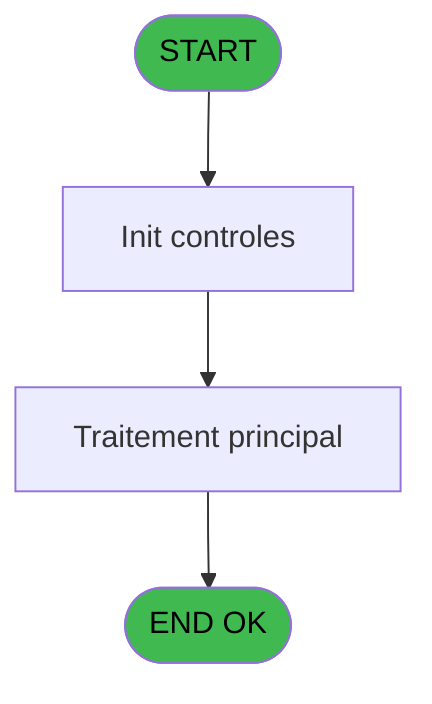

# WEL IDE 13 - Prestations

> **Analyse**: Phases 1-4 2026-02-03 21:15 -> 21:15 (18s) | Assemblage 21:15
> **Pipeline**: V7.2 Enrichi
> **Structure**: 4 onglets (Resume | Ecrans | Donnees | Connexions)

<!-- TAB:Resume -->

## 1. FICHE D'IDENTITE

| Attribut | Valeur |
|----------|--------|
| Projet | WEL |
| IDE Position | 13 |
| Nom Programme | Prestations |
| Fichier source | `Prg_13.xml` |
| Dossier IDE | Clients |
| Taches | 1 (1 ecrans visibles) |
| Tables modifiees | 0 |
| Programmes appeles | 1 |
| :warning: Statut | **ORPHELIN_POTENTIEL** |

## 2. DESCRIPTION FONCTIONNELLE

**Prestations** assure la gestion complete de ce processus.

Le flux de traitement s'organise en **1 blocs fonctionnels** :

- **Traitement** (1 tache) : traitements metier divers

## 3. BLOCS FONCTIONNELS

### 3.1 Traitement (1 tache)

Traitements internes.

---

#### 13 - Prestations [[ECRAN]](#ecran-t1)

**Role** : Traitement : Prestations.
**Ecran** : 1313 x 744 DLU | [Voir mockup](#ecran-t1)

## 5. REGLES METIER

*(Aucune regle metier identifiee)*

## 6. CONTEXTE

- **Appele par**: (aucun)
- **Appelle**: 1 programmes | **Tables**: 3 (W:0 R:1 L:2) | **Taches**: 1 | **Expressions**: 11

<!-- TAB:Ecrans -->

## 8. ECRANS

### 8.1 Forms visibles (1 / 1)

| # | Position | Tache | Nom | Type | Largeur | Hauteur | Bloc |
|---|----------|-------|-----|------|---------|---------|------|
| 1 | 13 | 13 | Prestations | Type0 | 1313 | 744 | Traitement |

### 8.2 Mockups Ecrans

---

#### 13 - Prestations
**Tache** : [13](#t1) | **Type** : Type0 | **Dimensions** : 1313 x 744 DLU
**Bloc** : Traitement | **Titre IDE** : Prestations

<!-- FORM-DATA:
{
    "width":  1313,
    "vFactor":  100,
    "type":  "Type0",
    "hFactor":  100,
    "controls":  [
                     {
                         "x":  182,
                         "type":  "label",
                         "var":  "",
                         "y":  0,
                         "w":  1130,
                         "fmt":  "",
                         "name":  "",
                         "h":  66,
                         "color":  "212",
                         "text":  "PRE BOOKED SERVICES",
                         "parent":  null
                     },
                     {
                         "x":  287,
                         "type":  "label",
                         "var":  "",
                         "y":  132,
                         "w":  167,
                         "fmt":  "",
                         "name":  "",
                         "h":  44,
                         "color":  "",
                         "text":  "CODE PRESTATION",
                         "parent":  null
                     },
                     {
                         "x":  452,
                         "type":  "label",
                         "var":  "",
                         "y":  132,
                         "w":  296,
                         "fmt":  "",
                         "name":  "",
                         "h":  44,
                         "color":  "",
                         "text":  "NAME",
                         "parent":  null
                     },
                     {
                         "x":  747,
                         "type":  "label",
                         "var":  "",
                         "y":  132,
                         "w":  111,
                         "fmt":  "",
                         "name":  "",
                         "h":  44,
                         "color":  "",
                         "text":  "START DATE",
                         "parent":  null
                     },
                     {
                         "x":  856,
                         "type":  "label",
                         "var":  "",
                         "y":  132,
                         "w":  117,
                         "fmt":  "",
                         "name":  "",
                         "h":  44,
                         "color":  "",
                         "text":  "END DATE",
                         "parent":  null
                     },
                     {
                         "x":  288,
                         "type":  "table",
                         "var":  "",
                         "name":  "",
                         "titleH":  12,
                         "color":  "",
                         "w":  683,
                         "y":  175,
                         "fmt":  "",
                         "parent":  null,
                         "text":  "",
                         "rowH":  44,
                         "h":  484,
                         "cols":  [
                                      {
                                          "title":  "NAME",
                                          "layer":  1,
                                          "w":  163
                                      },
                                      {
                                          "title":  "NAME",
                                          "layer":  2,
                                          "w":  295
                                      },
                                      {
                                          "title":  "",
                                          "layer":  3,
                                          "w":  110
                                      },
                                      {
                                          "title":  "",
                                          "layer":  4,
                                          "w":  110
                                      }
                                  ],
                         "rows":  4
                     },
                     {
                         "x":  0,
                         "type":  "image",
                         "var":  "",
                         "y":  0,
                         "w":  173,
                         "fmt":  "",
                         "name":  "RETOUR",
                         "h":  66,
                         "color":  "226",
                         "text":  "",
                         "parent":  null
                     },
                     {
                         "x":  971,
                         "type":  "button",
                         "var":  "",
                         "y":  132,
                         "w":  56,
                         "fmt":  "",
                         "name":  "",
                         "h":  265,
                         "color":  "",
                         "text":  "",
                         "parent":  null
                     },
                     {
                         "x":  293,
                         "type":  "edit",
                         "var":  "",
                         "y":  180,
                         "w":  153,
                         "fmt":  "",
                         "name":  "pre_code_circuit",
                         "h":  36,
                         "color":  "220",
                         "text":  "",
                         "parent":  8
                     },
                     {
                         "x":  454,
                         "type":  "edit",
                         "var":  "",
                         "y":  180,
                         "w":  289,
                         "fmt":  "",
                         "name":  "Prenom",
                         "h":  36,
                         "color":  "220",
                         "text":  "",
                         "parent":  8
                     },
                     {
                         "x":  753,
                         "type":  "edit",
                         "var":  "",
                         "y":  180,
                         "w":  102,
                         "fmt":  "##/##/####Z",
                         "name":  "pre_date_debut",
                         "h":  36,
                         "color":  "220",
                         "text":  "",
                         "parent":  8
                     },
                     {
                         "x":  862,
                         "type":  "edit",
                         "var":  "",
                         "y":  180,
                         "w":  105,
                         "fmt":  "##/##/####Z",
                         "name":  "pre_date_fin",
                         "h":  36,
                         "color":  "220",
                         "text":  "",
                         "parent":  8
                     },
                     {
                         "x":  971,
                         "type":  "button",
                         "var":  "",
                         "y":  397,
                         "w":  56,
                         "fmt":  "",
                         "name":  "",
                         "h":  264,
                         "color":  "",
                         "text":  "",
                         "parent":  null
                     }
                 ],
    "taskId":  "13",
    "height":  744
}
-->

<strong>Champs : 4 champs</strong>

| Pos (x,y) | Nom | Variable | Type |
|-----------|-----|----------|------|
| 293,180 | pre_code_circuit | - | edit |
| 454,180 | Prenom | - | edit |
| 753,180 | pre_date_debut | - | edit |
| 862,180 | pre_date_fin | - | edit |

<strong>Boutons : 2 boutons</strong>

| Bouton | Pos (x,y) | Action |
|--------|-----------|--------|
| (sans nom) | 971,132 | Action declenchee |
| (sans nom) | 971,397 | Action declenchee |

## 9. NAVIGATION

Ecran unique: **Prestations**

### 9.3 Structure hierarchique (1 tache)

| Position | Tache | Type | Dimensions | Bloc |
|----------|-------|------|------------|------|
| **13.1** | [**Prestations** (13)](#t1) [mockup](#ecran-t1) | - | 1313x744 | Traitement |

### 9.4 Algorigramme

> **Legende**: Vert = START/END OK | Rouge = END KO | Bleu = Decisions
> *Algorigramme auto-genere. Utiliser `/algorigramme` pour une synthese metier detaillee.*

<!-- TAB:Donnees -->

## 10. TABLES

### Tables utilisees (3)

| ID | Nom | Description | Type | R | W | L | Usages |
|----|-----|-------------|------|---|---|---|--------|
| 33 | prestations______pre | Prestations/services vendus | DB | R |   |   | 1 |
| 131 | fichier_validation |  | DB |   |   | L | 1 |
| 135 | libelle_prestation | Prestations/services vendus | DB |   |   | L | 1 |

### Colonnes par table (0 / 1 tables avec colonnes identifiees)

Table 33 - prestations______pre (R) - 1 usages

*Table utilisee uniquement en Link ou aucune colonne Real identifiee dans le DataView.*

## 11. VARIABLES

*(Programme sans variables locales mappees)*

## 12. EXPRESSIONS

**11 / 11 expressions decodees (100%)**

### 12.1 Repartition par type

| Type | Expressions | Regles |
|------|-------------|--------|
| CONCATENATION | 1 | 0 |
| CONSTANTE | 1 | 0 |
| REFERENCE_VG | 3 | 0 |
| OTHER | 6 | 0 |

### 12.2 Expressions cles par type

#### CONCATENATION (1 expressions)

| Type | IDE | Expression | Regle |
|------|-----|------------|-------|
| CONCATENATION | 1 | `'PRE BOOKED SERVICES - '&Trim([K])&' '&Trim([L])` | - |

#### CONSTANTE (1 expressions)

| Type | IDE | Expression | Regle |
|------|-----|------------|-------|
| CONSTANTE | 3 | `'PBS'` | - |

#### REFERENCE_VG (3 expressions)

| Type | IDE | Expression | Regle |
|------|-----|------------|-------|
| REFERENCE_VG | 6 | `VG10` | - |
| REFERENCE_VG | 5 | `VG9` | - |
| REFERENCE_VG | 2 | `VG5` | - |

#### OTHER (6 expressions)

| Type | IDE | Expression | Regle |
|------|-----|------------|-------|
| OTHER | 9 | `[A]` | - |
| OTHER | 10 | `[B]` | - |
| OTHER | 11 | `[C]` | - |
| OTHER | 4 | `MlsTrans('Call Pre booked services')` | - |
| OTHER | 7 | `[A]` | - |
| ... | | *+1 autres* | |

<!-- TAB:Connexions -->

## 13. GRAPHE D'APPELS

### 13.1 Chaine depuis Main (Callers)

**Chemin**: (pas de callers directs)

### 13.2 Callers

| IDE | Nom Programme | Nb Appels |
|-----|---------------|-----------|
| - | (aucun) | - |

### 13.3 Callees (programmes appeles)

### 13.4 Detail Callees avec contexte

| IDE | Nom Programme | Appels | Contexte |
|-----|---------------|--------|----------|
| [81](WEL-IDE-81.md) | Create logbook | 1 | Sous-programme |

## 14. RECOMMANDATIONS MIGRATION

### 14.1 Profil du programme

| Metrique | Valeur | Impact migration |
|----------|--------|-----------------|
| Lignes de logique | 23 | Programme compact |
| Expressions | 11 | Peu de logique |
| Tables WRITE | 0 | Impact faible |
| Sous-programmes | 1 | Peu de dependances |
| Ecrans visibles | 1 | Ecran unique ou traitement batch |
| Code desactive | 0% (0 / 23) | Code sain |
| Regles metier | 0 | Pas de regle identifiee |

### 14.2 Plan de migration par bloc

#### Traitement (1 tache: 1 ecran, 0 traitement)

- **Strategie** : 1 composant(s) UI (Razor/React) avec formulaires et validation.
- 1 sous-programme(s) a migrer ou a reutiliser depuis les services existants.
- Decomposer les taches en services unitaires testables.

### 14.3 Dependances critiques

| Dependance | Type | Appels | Impact |
|------------|------|--------|--------|
| [Create logbook (IDE 81)](WEL-IDE-81.md) | Sous-programme | 1x | Normale - Sous-programme |

---
*Spec DETAILED generee par Pipeline V7.2 - 2026-02-03 21:15*
