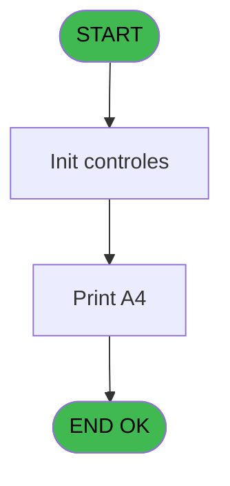

# WEL IDE 15 - Print List Client

> **Analyse**: Phases 1-4 2026-02-03 21:15 -> 21:16 (18s) | Assemblage 21:16
> **Pipeline**: V7.2 Enrichi
> **Structure**: 4 onglets (Resume | Ecrans | Donnees | Connexions)

<!-- TAB:Resume -->

## 1. FICHE D'IDENTITE

| Attribut | Valeur |
|----------|--------|
| Projet | WEL |
| IDE Position | 15 |
| Nom Programme | Print List Client |
| Fichier source | `Prg_15.xml` |
| Dossier IDE | Clients |
| Taches | 2 (1 ecrans visibles) |
| Tables modifiees | 0 |
| Programmes appeles | 0 |
| :warning: Statut | **ORPHELIN_POTENTIEL** |

## 2. DESCRIPTION FONCTIONNELLE

**Print List Client** assure la gestion complete de ce processus.

Le flux de traitement s'organise en **1 blocs fonctionnels** :

- **Traitement** (2 taches) : traitements metier divers

**Logique metier** : 1 regles identifiees couvrant conditions metier.

## 3. BLOCS FONCTIONNELS

### 3.1 Traitement (2 taches)

Traitements internes.

---

#### 15 - Veuillez patienter... [[ECRAN]](#ecran-t1)

**Role** : Traitement : Veuillez patienter....
**Ecran** : 424 x 57 DLU (MDI) | [Voir mockup](#ecran-t1)

---

#### 15.1 - Veuillez patienter... [[ECRAN]](#ecran-t2)

**Role** : Traitement : Veuillez patienter....
**Ecran** : 422 x 57 DLU (MDI) | [Voir mockup](#ecran-t2)

## 5. REGLES METIER

1 regles identifiees:

### Autres (1 regles)

#### [RM-001] Si ISNULL(v.nom complet [CC]) AND Trim(v.nom complet [CC])<>'' est FAUX, branche alternative

| Element | Detail |
|---------|--------|
| **Condition** | `NOT ISNULL(v.nom complet [CC]) AND Trim(v.nom complet [CC])<>''` |
| **Si vrai** | v.nom complet [CC] |
| **Si faux** | IF(Date()<fut.heb_type_hebergement [BO],Trim([CL]),IF(Date()>logf.loc_code_menage [BQ],Trim([CU]),''))) |
| **Variables** | CC (v.nom complet), E (age), BO (fut.heb_type_hebergement), BQ (logf.loc_code_menage) |
| **Expression source** | Expression 24 : `IF(NOT ISNULL(v.nom complet [CC]) AND Trim(v.nom complet [CC` |
| **Exemple** | Si NOT ISNULL(v.nom complet [CC]) AND Trim(v.nom complet [CC])<>'' → v.nom complet [CC] |

## 6. CONTEXTE

- **Appele par**: (aucun)
- **Appelle**: 0 programmes | **Tables**: 1 (W:0 R:1 L:0) | **Taches**: 2 | **Expressions**: 31

<!-- TAB:Ecrans -->

## 8. ECRANS

### 8.1 Forms visibles (1 / 2)

| # | Position | Tache | Nom | Type | Largeur | Hauteur | Bloc |
|---|----------|-------|-----|------|---------|---------|------|
| 1 | 15.1 | 15.1 | Veuillez patienter... | MDI | 422 | 57 | Traitement |

### 8.2 Mockups Ecrans

---

#### 15.1 - Veuillez patienter...
**Tache** : [15.1](#t2) | **Type** : MDI | **Dimensions** : 422 x 57 DLU
**Bloc** : Traitement | **Titre IDE** : Veuillez patienter...

<!-- FORM-DATA:
{
    "width":  422,
    "vFactor":  8,
    "type":  "MDI",
    "hFactor":  8,
    "controls":  [
                     {
                         "x":  0,
                         "type":  "label",
                         "var":  "",
                         "y":  0,
                         "w":  423,
                         "fmt":  "",
                         "name":  "",
                         "h":  29,
                         "color":  "",
                         "text":  "",
                         "parent":  null
                     },
                     {
                         "x":  119,
                         "type":  "label",
                         "var":  "",
                         "y":  10,
                         "w":  221,
                         "fmt":  "",
                         "name":  "",
                         "h":  8,
                         "color":  "7",
                         "text":  "Impression en cours ...",
                         "parent":  null
                     },
                     {
                         "x":  0,
                         "type":  "label",
                         "var":  "",
                         "y":  29,
                         "w":  423,
                         "fmt":  "",
                         "name":  "",
                         "h":  27,
                         "color":  "",
                         "text":  "",
                         "parent":  null
                     },
                     {
                         "x":  51,
                         "type":  "label",
                         "var":  "",
                         "y":  38,
                         "w":  318,
                         "fmt":  "",
                         "name":  "",
                         "h":  8,
                         "color":  "",
                         "text":  "Impression de la Liste Client",
                         "parent":  null
                     },
                     {
                         "x":  3,
                         "type":  "image",
                         "var":  "",
                         "y":  2,
                         "w":  72,
                         "fmt":  "",
                         "name":  "",
                         "h":  25,
                         "color":  "",
                         "text":  "",
                         "parent":  null
                     }
                 ],
    "taskId":  "15.1",
    "height":  57
}
-->

## 9. NAVIGATION

Ecran unique: **Veuillez patienter...**

### 9.3 Structure hierarchique (2 taches)

| Position | Tache | Type | Dimensions | Bloc |
|----------|-------|------|------------|------|
| **15.1** | [**Veuillez patienter...** (15)](#t1) [mockup](#ecran-t1) | MDI | 424x57 | Traitement |
| 15.1.1 | [Veuillez patienter... (15.1)](#t2) [mockup](#ecran-t2) | MDI | 422x57 | |

### 9.4 Algorigramme

> **Legende**: Vert = START/END OK | Rouge = END KO | Bleu = Decisions
> *Algorigramme auto-genere. Utiliser `/algorigramme` pour une synthese metier detaillee.*

<!-- TAB:Donnees -->

## 10. TABLES

### Tables utilisees (1)

| ID | Nom | Description | Type | R | W | L | Usages |
|----|-----|-------------|------|---|---|---|--------|
| 368 | pms_village |  | DB | R |   |   | 1 |

### Colonnes par table (1 / 1 tables avec colonnes identifiees)

Table 368 - pms_village (R) - 1 usages

| Lettre | Variable | Acces | Type |
|--------|----------|-------|------|
| A | v.Chemin | R | Alpha |
| B | v.NomFichier | R | Alpha |

## 11. VARIABLES

### 11.1 Variables de session (12)

Variables persistantes pendant toute la session.

| Lettre | Nom | Type | Usage dans |
|--------|-----|------|-----------|
| A | v.Chemin | Alpha | 1x session |
| B | v.NomFichier | Alpha | 1x session |
| H | V.Date debut | Date | - |
| J | V.Date fin | Date | - |
| BW | v.nom_logement | Unicode | - |
| BX | v.type hebergement | Unicode | - |
| BY | v.complement type | Unicode | - |
| BZ | v.Date menage | Date | - |
| CA | v.code logement | Unicode | - |
| CB | v.occupation standard | Numeric | - |
| CC | v.nom complet | Unicode | 8x session |
| CD | v.libelle logement | Unicode | 1x session |

### 11.2 Autres (44)

Variables diverses.

| Lettre | Nom | Type | Usage dans |
|--------|-----|------|-----------|
| C | nom_personne | Unicode | - |
| D | prenom_personne | Unicode | - |
| E | age | Numeric | 10x refs |
| F | gmr_sexe | Unicode | - |
| G | date_debut | Alpha | - |
| I | date_fin | Alpha | - |
| K | cgm_garanti | Unicode | - |
| L | seminaire | Unicode | - |
| M | gmr_qualite | Unicode | - |
| N | arr.heb_heure_arr | Unicode | - |
| O | arr.heb_nom_logement_arr | Unicode | - |
| P | dep.heb_heure_dep | Unicode | - |
| Q | dep.heb_nom_logement_dep | Unicode | - |
| R | libelle fidelisation | Unicode | - |
| S | couleur fidelisation | Numeric | - |
| T | ema_telephone_portable | Unicode | - |
| U | ema_email | Unicode | - |
| V | heb.heb_nom_logement | Unicode | - |
| W | heb.heb_type_hebergement | Unicode | - |
| X | heb.heb_complement_type | Unicode | - |
| Y | logl.loc_code_menage | Unicode | - |
| Z | logl.date menage | Date | - |
| BA | logl.loc_code_logement | Unicode | - |
| BB | logl.loc_occupation_std | Numeric | - |
| BC | logl.loc_nom_complet | Unicode | - |
| BD | clo.clo_libelle | Unicode | - |
| BE | past.heb_nom_logement | Unicode | - |
| BF | past.heb_type_hebergement | Unicode | - |
| BG | past.heb_complement_type | Unicode | - |
| BH | logp.loc_code_menage | Alpha | - |
| BI | logp.date menage | Date | - |
| BJ | logp.loc_code_logement | Unicode | - |
| BK | logp.loc_occupation_std | Numeric | - |
| BL | logp.loc_nom_complet | Unicode | - |
| BM | clop.clo_libelle | Unicode | - |
| BN | fut.heb_nom_logement | Unicode | 1x refs |
| BO | fut.heb_type_hebergement | Unicode | 8x refs |
| BP | fut.heb_complement_type | Unicode | 1x refs |
| BQ | logf.loc_code_menage | Alpha | 8x refs |
| BR | logf.date menage | Date | - |
| BS | logf.loc_code_logement | Unicode | - |
| BT | logf.loc_occupation_std | Numeric | - |
| BU | logf.loc_nom_complet | Unicode | - |
| BV | clof.clo_libelle | Unicode | - |

Toutes les 56 variables (liste complete)

| Cat | Lettre | Nom Variable | Type |
|-----|--------|--------------|------|
| V. | **A** | v.Chemin | Alpha |
| V. | **B** | v.NomFichier | Alpha |
| V. | **H** | V.Date debut | Date |
| V. | **J** | V.Date fin | Date |
| V. | **BW** | v.nom_logement | Unicode |
| V. | **BX** | v.type hebergement | Unicode |
| V. | **BY** | v.complement type | Unicode |
| V. | **BZ** | v.Date menage | Date |
| V. | **CA** | v.code logement | Unicode |
| V. | **CB** | v.occupation standard | Numeric |
| V. | **CC** | v.nom complet | Unicode |
| V. | **CD** | v.libelle logement | Unicode |
| Autre | **C** | nom_personne | Unicode |
| Autre | **D** | prenom_personne | Unicode |
| Autre | **E** | age | Numeric |
| Autre | **F** | gmr_sexe | Unicode |
| Autre | **G** | date_debut | Alpha |
| Autre | **I** | date_fin | Alpha |
| Autre | **K** | cgm_garanti | Unicode |
| Autre | **L** | seminaire | Unicode |
| Autre | **M** | gmr_qualite | Unicode |
| Autre | **N** | arr.heb_heure_arr | Unicode |
| Autre | **O** | arr.heb_nom_logement_arr | Unicode |
| Autre | **P** | dep.heb_heure_dep | Unicode |
| Autre | **Q** | dep.heb_nom_logement_dep | Unicode |
| Autre | **R** | libelle fidelisation | Unicode |
| Autre | **S** | couleur fidelisation | Numeric |
| Autre | **T** | ema_telephone_portable | Unicode |
| Autre | **U** | ema_email | Unicode |
| Autre | **V** | heb.heb_nom_logement | Unicode |
| Autre | **W** | heb.heb_type_hebergement | Unicode |
| Autre | **X** | heb.heb_complement_type | Unicode |
| Autre | **Y** | logl.loc_code_menage | Unicode |
| Autre | **Z** | logl.date menage | Date |
| Autre | **BA** | logl.loc_code_logement | Unicode |
| Autre | **BB** | logl.loc_occupation_std | Numeric |
| Autre | **BC** | logl.loc_nom_complet | Unicode |
| Autre | **BD** | clo.clo_libelle | Unicode |
| Autre | **BE** | past.heb_nom_logement | Unicode |
| Autre | **BF** | past.heb_type_hebergement | Unicode |
| Autre | **BG** | past.heb_complement_type | Unicode |
| Autre | **BH** | logp.loc_code_menage | Alpha |
| Autre | **BI** | logp.date menage | Date |
| Autre | **BJ** | logp.loc_code_logement | Unicode |
| Autre | **BK** | logp.loc_occupation_std | Numeric |
| Autre | **BL** | logp.loc_nom_complet | Unicode |
| Autre | **BM** | clop.clo_libelle | Unicode |
| Autre | **BN** | fut.heb_nom_logement | Unicode |
| Autre | **BO** | fut.heb_type_hebergement | Unicode |
| Autre | **BP** | fut.heb_complement_type | Unicode |
| Autre | **BQ** | logf.loc_code_menage | Alpha |
| Autre | **BR** | logf.date menage | Date |
| Autre | **BS** | logf.loc_code_logement | Unicode |
| Autre | **BT** | logf.loc_occupation_std | Numeric |
| Autre | **BU** | logf.loc_nom_complet | Unicode |
| Autre | **BV** | clof.clo_libelle | Unicode |

## 12. EXPRESSIONS

**31 / 31 expressions decodees (100%)**

### 12.1 Repartition par type

| Type | Expressions | Regles |
|------|-------------|--------|
| CONCATENATION | 3 | 0 |
| CONDITION | 8 | 5 |
| CONSTANTE | 1 | 0 |
| FORMAT | 1 | 0 |
| DATE | 6 | 0 |
| OTHER | 5 | 0 |
| REFERENCE_VG | 1 | 0 |
| STRING | 6 | 0 |

### 12.2 Expressions cles par type

#### CONCATENATION (3 expressions)

| Type | IDE | Expression | Regle |
|------|-----|------------|-------|
| CONCATENATION | 19 | `Trim({1,1})&Trim({1,2})` | - |
| CONCATENATION | 7 | `Trim(v.Chemin [A])&Trim(v.NomFichier [B])` | - |
| CONCATENATION | 16 | `Trim([DE])&'-'&Trim([DF])` | - |

#### CONDITION (8 expressions)

| Type | IDE | Expression | Regle |
|------|-----|------------|-------|
| CONDITION | 24 | `IF(NOT ISNULL(v.nom complet [CC]) AND Trim(v.nom complet [CC])<>'',v.nom complet [CC],IF(Date()<fut.heb_type_hebergement [BO],Trim([CL]),IF(Date()>logf.loc_code_menage [BQ],Trim([CU]),'')))` | [RM-001](#rm-RM-001) |
| CONDITION | 29 | `IF(NOT ISNULL(v.nom complet [CC]) AND Trim(v.nom complet [CC])<>'',[CI],IF(Date()<fut.heb_type_hebergement [BO],[CR],IF(Date()>logf.loc_code_menage [BQ],[DA],0)))` | - |
| CONDITION | 30 | `IF(NOT ISNULL(v.nom complet [CC]) AND Trim(v.nom complet [CC])<>'',[CJ],IF(Date()<fut.heb_type_hebergement [BO],Trim([CS]),IF(Date()>logf.loc_code_menage [BQ],Trim([DB]),'')))` | - |
| CONDITION | 31 | `IF(NOT ISNULL(v.nom complet [CC]) AND Trim(v.nom complet [CC])<>'',[CK],IF(Date()<fut.heb_type_hebergement [BO],Trim([CT]),IF(Date()>logf.loc_code_menage [BQ],Trim([DC]),'')))` | - |
| CONDITION | 28 | `IF(NOT ISNULL(v.nom complet [CC]) AND Trim(v.nom complet [CC])<>'',[CH],IF(Date()<fut.heb_type_hebergement [BO],Trim([CQ]),IF(Date()>logf.loc_code_menage [BQ],Trim([CZ]),'')))` | - |
| ... | | *+3 autres* | |

#### CONSTANTE (1 expressions)

| Type | IDE | Expression | Regle |
|------|-----|------------|-------|
| CONSTANTE | 22 | `'Page :'` | - |

#### FORMAT (1 expressions)

| Type | IDE | Expression | Regle |
|------|-----|------------|-------|
| FORMAT | 6 | `'PRINT_LIST_CLIENT'&'_'&Trim(VG15)&'_'&DStr(Date(),'YYMMDD')&TStr(Time(),'HHMMSS')&'.pdf'` | - |

#### DATE (6 expressions)

| Type | IDE | Expression | Regle |
|------|-----|------------|-------|
| DATE | 14 | `DVal([CO],'YYYYMMDD')` | - |
| DATE | 15 | `DVal([CX],'YYYYMMDD')` | - |
| DATE | 20 | `Date ()` | - |
| DATE | 11 | `DVal(fut.heb_nom_logement [BN],'YYYYMMDD')` | - |
| DATE | 12 | `DVal(fut.heb_complement_type [BP],'YYYYMMDD')` | - |
| ... | | *+1 autres* | |

#### OTHER (5 expressions)

| Type | IDE | Expression | Regle |
|------|-----|------------|-------|
| OTHER | 21 | `Time ()` | - |
| OTHER | 23 | `Page (0,1)` | - |
| OTHER | 4 | `Translate('%club_exportdata%')&'WELCOME\'` | - |
| OTHER | 1 | `SetCrsr (1)` | - |
| OTHER | 2 | `SetCrsr (2)` | - |

#### REFERENCE_VG (1 expressions)

| Type | IDE | Expression | Regle |
|------|-----|------------|-------|
| REFERENCE_VG | 3 | `VG55` | - |

#### STRING (6 expressions)

| Type | IDE | Expression | Regle |
|------|-----|------------|-------|
| STRING | 10 | `Trim(VG8)` | - |
| STRING | 17 | `'Tel '&Trim({1,9})` | - |
| STRING | 18 | `'Fax '&Trim({1,10})` | - |
| STRING | 5 | `Trim(VG67)` | - |
| STRING | 8 | `Trim(VG6)` | - |
| ... | | *+1 autres* | |

### 12.3 Toutes les expressions (31)

Voir les 31 expressions

#### CONCATENATION (3)

| IDE | Expression Decodee |
|-----|-------------------|
| 16 | `Trim([DE])&'-'&Trim([DF])` |
| 7 | `Trim(v.Chemin [A])&Trim(v.NomFichier [B])` |
| 19 | `Trim({1,1})&Trim({1,2})` |

#### CONDITION (8)

| IDE | Expression Decodee |
|-----|-------------------|
| 24 | `IF(NOT ISNULL(v.nom complet [CC]) AND Trim(v.nom complet [CC])<>'',v.nom complet [CC],IF(Date()<fut.heb_type_hebergement [BO],Trim([CL]),IF(Date()>logf.loc_code_menage [BQ],Trim([CU]),'')))` |
| 25 | `IF(NOT ISNULL(v.nom complet [CC]) AND Trim(v.nom complet [CC])<>'',v.libelle logement [CD],IF(Date()<fut.heb_type_hebergement [BO],Trim([CM]),IF(Date()>logf.loc_code_menage [BQ],Trim([CV]),'')))` |
| 26 | `IF(NOT ISNULL(v.nom complet [CC]) AND Trim(v.nom complet [CC])<>'',[CE],IF(Date()<fut.heb_type_hebergement [BO],Trim([CN]),IF(Date()>logf.loc_code_menage [BQ],Trim([CV]),'')))` |
| 27 | `IF(NOT ISNULL(v.nom complet [CC]) AND Trim(v.nom complet [CC])<>'',[CG],IF(Date()<fut.heb_type_hebergement [BO],[CP],IF(Date()>logf.loc_code_menage [BQ],[CY],0)))` |
| 28 | `IF(NOT ISNULL(v.nom complet [CC]) AND Trim(v.nom complet [CC])<>'',[CH],IF(Date()<fut.heb_type_hebergement [BO],Trim([CQ]),IF(Date()>logf.loc_code_menage [BQ],Trim([CZ]),'')))` |
| 29 | `IF(NOT ISNULL(v.nom complet [CC]) AND Trim(v.nom complet [CC])<>'',[CI],IF(Date()<fut.heb_type_hebergement [BO],[CR],IF(Date()>logf.loc_code_menage [BQ],[DA],0)))` |
| 30 | `IF(NOT ISNULL(v.nom complet [CC]) AND Trim(v.nom complet [CC])<>'',[CJ],IF(Date()<fut.heb_type_hebergement [BO],Trim([CS]),IF(Date()>logf.loc_code_menage [BQ],Trim([DB]),'')))` |
| 31 | `IF(NOT ISNULL(v.nom complet [CC]) AND Trim(v.nom complet [CC])<>'',[CK],IF(Date()<fut.heb_type_hebergement [BO],Trim([CT]),IF(Date()>logf.loc_code_menage [BQ],Trim([DC]),'')))` |

#### CONSTANTE (1)

| IDE | Expression Decodee |
|-----|-------------------|
| 22 | `'Page :'` |

#### FORMAT (1)

| IDE | Expression Decodee |
|-----|-------------------|
| 6 | `'PRINT_LIST_CLIENT'&'_'&Trim(VG15)&'_'&DStr(Date(),'YYMMDD')&TStr(Time(),'HHMMSS')&'.pdf'` |

#### DATE (6)

| IDE | Expression Decodee |
|-----|-------------------|
| 11 | `DVal(fut.heb_nom_logement [BN],'YYYYMMDD')` |
| 12 | `DVal(fut.heb_complement_type [BP],'YYYYMMDD')` |
| 13 | `DVal([CF],'YYYYMMDD')` |
| 14 | `DVal([CO],'YYYYMMDD')` |
| 15 | `DVal([CX],'YYYYMMDD')` |
| 20 | `Date ()` |

#### OTHER (5)

| IDE | Expression Decodee |
|-----|-------------------|
| 1 | `SetCrsr (1)` |
| 2 | `SetCrsr (2)` |
| 4 | `Translate('%club_exportdata%')&'WELCOME\'` |
| 21 | `Time ()` |
| 23 | `Page (0,1)` |

#### REFERENCE_VG (1)

| IDE | Expression Decodee |
|-----|-------------------|
| 3 | `VG55` |

#### STRING (6)

| IDE | Expression Decodee |
|-----|-------------------|
| 5 | `Trim(VG67)` |
| 8 | `Trim(VG6)` |
| 9 | `Trim(VG7)` |
| 10 | `Trim(VG8)` |
| 17 | `'Tel '&Trim({1,9})` |
| 18 | `'Fax '&Trim({1,10})` |

<!-- TAB:Connexions -->

## 13. GRAPHE D'APPELS

### 13.1 Chaine depuis Main (Callers)

**Chemin**: (pas de callers directs)

### 13.2 Callers

| IDE | Nom Programme | Nb Appels |
|-----|---------------|-----------|
| - | (aucun) | - |

### 13.3 Callees (programmes appeles)

### 13.4 Detail Callees avec contexte

| IDE | Nom Programme | Appels | Contexte |
|-----|---------------|--------|----------|
| - | (aucun) | - | - |

## 14. RECOMMANDATIONS MIGRATION

### 14.1 Profil du programme

| Metrique | Valeur | Impact migration |
|----------|--------|-----------------|
| Lignes de logique | 82 | Programme compact |
| Expressions | 31 | Peu de logique |
| Tables WRITE | 0 | Impact faible |
| Sous-programmes | 0 | Peu de dependances |
| Ecrans visibles | 1 | Ecran unique ou traitement batch |
| Code desactive | 1.2% (1 / 82) | Code sain |
| Regles metier | 1 | Quelques regles a preserver |

### 14.2 Plan de migration par bloc

#### Traitement (2 taches: 2 ecrans, 0 traitement)

- **Strategie** : 2 composant(s) UI (Razor/React) avec formulaires et validation.
- Decomposer les taches en services unitaires testables.

### 14.3 Dependances critiques

| Dependance | Type | Appels | Impact |
|------------|------|--------|--------|

---
*Spec DETAILED generee par Pipeline V7.2 - 2026-02-03 21:16*
