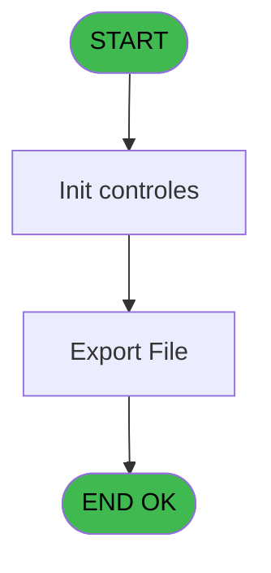

# WEL IDE 16 - Export List Client

> **Analyse**: Phases 1-4 2026-02-03 21:16 -> 21:16 (17s) | Assemblage 21:16
> **Pipeline**: V7.2 Enrichi
> **Structure**: 4 onglets (Resume | Ecrans | Donnees | Connexions)

<!-- TAB:Resume -->

## 1. FICHE D'IDENTITE

| Attribut | Valeur |
|----------|--------|
| Projet | WEL |
| IDE Position | 16 |
| Nom Programme | Export List Client |
| Fichier source | `Prg_16.xml` |
| Dossier IDE | Clients |
| Taches | 2 (1 ecrans visibles) |
| Tables modifiees | 0 |
| Programmes appeles | 0 |
| :warning: Statut | **ORPHELIN_POTENTIEL** |

## 2. DESCRIPTION FONCTIONNELLE

**Export List Client** assure la gestion complete de ce processus.

Le flux de traitement s'organise en **1 blocs fonctionnels** :

- **Traitement** (2 taches) : traitements metier divers

**Logique metier** : 14 regles identifiees couvrant conditions metier.

## 3. BLOCS FONCTIONNELS

### 3.1 Traitement (2 taches)

Traitements internes.

---

#### 16 - Veuillez patienter... [[ECRAN]](#ecran-t1)

**Role** : Traitement : Veuillez patienter....
**Ecran** : 424 x 57 DLU (MDI) | [Voir mockup](#ecran-t1)

---

#### 16.1 - Veuillez patienter... [[ECRAN]](#ecran-t5)

**Role** : Traitement : Veuillez patienter....
**Ecran** : 422 x 57 DLU (MDI) | [Voir mockup](#ecran-t5)

## 5. REGLES METIER

14 regles identifiees:

### Autres (14 regles)

#### [RM-001] Si ISNULL(clop.clo_libelle [BM]) alors '' sinon clop.clo_libelle [BM])

| Element | Detail |
|---------|--------|
| **Condition** | `ISNULL(clop.clo_libelle [BM])` |
| **Si vrai** | '' |
| **Si faux** | clop.clo_libelle [BM]) |
| **Variables** | BM (clop.clo_libelle), CS (S) |
| **Expression source** | Expression 15 : `IF(ISNULL(clop.clo_libelle [BM]),'',clop.clo_libelle [BM])` |
| **Exemple** | Si ISNULL(clop.clo_libelle [BM]) → ''. Sinon → clop.clo_libelle [BM]) |

#### [RM-002] Si ISNULL([DD]) alors '' sinon [DD])

| Element | Detail |
|---------|--------|
| **Condition** | `ISNULL([DD])` |
| **Si vrai** | '' |
| **Si faux** | [DD]) |
| **Variables** | CS (S) |
| **Expression source** | Expression 16 : `IF(ISNULL([DD]),'',[DD])` |
| **Exemple** | Si ISNULL([DD]) → ''. Sinon → [DD]) |

#### [RM-003] Si ISNULL([DK]) alors '' sinon [DK])

| Element | Detail |
|---------|--------|
| **Condition** | `ISNULL([DK])` |
| **Si vrai** | '' |
| **Si faux** | [DK]) |
| **Variables** | CS (S) |
| **Expression source** | Expression 17 : `IF(ISNULL([DK]),'',[DK])` |
| **Exemple** | Si ISNULL([DK]) → ''. Sinon → [DK]) |

#### [RM-004] Si ISNULL([DE]) alors '' sinon [DE])

| Element | Detail |
|---------|--------|
| **Condition** | `ISNULL([DE])` |
| **Si vrai** | '' |
| **Si faux** | [DE]) |
| **Variables** | CS (S) |
| **Expression source** | Expression 18 : `IF(ISNULL([DE]),'',[DE])` |
| **Exemple** | Si ISNULL([DE]) → ''. Sinon → [DE]) |

#### [RM-005] Si ISNULL([DF]) alors '' sinon [DF])

| Element | Detail |
|---------|--------|
| **Condition** | `ISNULL([DF])` |
| **Si vrai** | '' |
| **Si faux** | [DF]) |
| **Variables** | CS (S) |
| **Expression source** | Expression 19 : `IF(ISNULL([DF]),'',[DF])` |
| **Exemple** | Si ISNULL([DF]) → ''. Sinon → [DF]) |

#### [RM-006] Si ISNULL(logf.date menage [BR]) alors '' sinon logf.date menage [BR])

| Element | Detail |
|---------|--------|
| **Condition** | `ISNULL(logf.date menage [BR])` |
| **Si vrai** | '' |
| **Si faux** | logf.date menage [BR]) |
| **Variables** | E (age), BR (logf.date menage), CS (S) |
| **Expression source** | Expression 20 : `IF(ISNULL(logf.date menage [BR]),'',logf.date menage [BR])` |
| **Exemple** | Si ISNULL(logf.date menage [BR]) → ''. Sinon → logf.date menage [BR]) |

#### [RM-007] Si ISNULL(v.complement type [BY]) alors '' sinon v.complement type [BY])

| Element | Detail |
|---------|--------|
| **Condition** | `ISNULL(v.complement type [BY])` |
| **Si vrai** | '' |
| **Si faux** | v.complement type [BY]) |
| **Variables** | BY (v.complement type), CS (S) |
| **Expression source** | Expression 21 : `IF(ISNULL(v.complement type [BY]),'',v.complement type [BY])` |
| **Exemple** | Si ISNULL(v.complement type [BY]) → ''. Sinon → v.complement type [BY]) |

#### [RM-008] Si ISNULL(clof.clo_libelle [BV]) alors '' sinon clof.clo_libelle [BV])

| Element | Detail |
|---------|--------|
| **Condition** | `ISNULL(clof.clo_libelle [BV])` |
| **Si vrai** | '' |
| **Si faux** | clof.clo_libelle [BV]) |
| **Variables** | BV (clof.clo_libelle), CS (S) |
| **Expression source** | Expression 22 : `IF(ISNULL(clof.clo_libelle [BV]),'',clof.clo_libelle [BV])` |
| **Exemple** | Si ISNULL(clof.clo_libelle [BV]) → ''. Sinon → clof.clo_libelle [BV]) |

#### [RM-009] Si ISNULL(v.type hebergement [BX]) alors '' sinon v.type hebergement [BX])

| Element | Detail |
|---------|--------|
| **Condition** | `ISNULL(v.type hebergement [BX])` |
| **Si vrai** | '' |
| **Si faux** | v.type hebergement [BX]) |
| **Variables** | BX (v.type hebergement), CS (S) |
| **Expression source** | Expression 23 : `IF(ISNULL(v.type hebergement [BX]),'',v.type hebergement [BX` |
| **Exemple** | Si ISNULL(v.type hebergement [BX]) → ''. Sinon → v.type hebergement [BX]) |

#### [RM-010] Si ISNULL(v.code logement [CA]) alors '' sinon v.code logement [CA])

| Element | Detail |
|---------|--------|
| **Condition** | `ISNULL(v.code logement [CA])` |
| **Si vrai** | '' |
| **Si faux** | v.code logement [CA]) |
| **Variables** | CA (v.code logement), CS (S) |
| **Expression source** | Expression 24 : `IF(ISNULL(v.code logement [CA]),'',v.code logement [CA])` |
| **Exemple** | Si ISNULL(v.code logement [CA]) → ''. Sinon → v.code logement [CA]) |

#### [RM-011] Si ISNULL(v.occupation standard [CB]) alors '' sinon v.occupation standard [CB])

| Element | Detail |
|---------|--------|
| **Condition** | `ISNULL(v.occupation standard [CB])` |
| **Si vrai** | '' |
| **Si faux** | v.occupation standard [CB]) |
| **Variables** | CB (v.occupation standard), CS (S) |
| **Expression source** | Expression 25 : `IF(ISNULL(v.occupation standard [CB]),'',v.occupation standa` |
| **Exemple** | Si ISNULL(v.occupation standard [CB]) → ''. Sinon → v.occupation standard [CB]) |

#### [RM-012] Si ISNULL([ED]) alors '' sinon [ED])

| Element | Detail |
|---------|--------|
| **Condition** | `ISNULL([ED])` |
| **Si vrai** | '' |
| **Si faux** | [ED]) |
| **Variables** | CS (S) |
| **Expression source** | Expression 26 : `IF(ISNULL([ED]),'',[ED])` |
| **Exemple** | Si ISNULL([ED]) → ''. Sinon → [ED]) |

#### [RM-013] Si ISNULL([EI]) alors '' sinon [EI])

| Element | Detail |
|---------|--------|
| **Condition** | `ISNULL([EI])` |
| **Si vrai** | '' |
| **Si faux** | [EI]) |
| **Variables** | CS (S) |
| **Expression source** | Expression 27 : `IF(ISNULL([EI]),'',[EI])` |
| **Exemple** | Si ISNULL([EI]) → ''. Sinon → [EI]) |

#### [RM-014] Si ISNULL(v.nom complet [CC]) AND Trim(v.nom complet [CC])<>'' est FAUX, branche alternative

| Element | Detail |
|---------|--------|
| **Condition** | `NOT ISNULL(v.nom complet [CC]) AND Trim(v.nom complet [CC])<>''` |
| **Si vrai** | v.nom complet [CC] |
| **Si faux** | IF(Date()<fut.heb_type_hebergement [BO],Trim(v.logement_arr_Excel [CL]),IF(Date()>logf.loc_code_menage [BQ],Trim([CU]),''))) |
| **Variables** | CC (v.nom complet), CL (v.logement_arr_Excel), E (age), BO (fut.heb_type_hebergement), BQ (logf.loc_code_menage), CS (S) |
| **Expression source** | Expression 38 : `IF(NOT ISNULL(v.nom complet [CC]) AND Trim(v.nom complet [CC` |
| **Exemple** | Si NOT ISNULL(v.nom complet [CC]) AND Trim(v.nom complet [CC])<>'' → v.nom complet [CC] |

## 6. CONTEXTE

- **Appele par**: (aucun)
- **Appelle**: 0 programmes | **Tables**: 2 (W:0 R:1 L:1) | **Taches**: 2 | **Expressions**: 45

<!-- TAB:Ecrans -->

## 8. ECRANS

### 8.1 Forms visibles (1 / 2)

| # | Position | Tache | Nom | Type | Largeur | Hauteur | Bloc |
|---|----------|-------|-----|------|---------|---------|------|
| 1 | 16.1 | 16.1 | Veuillez patienter... | MDI | 422 | 57 | Traitement |

### 8.2 Mockups Ecrans

---

#### 16.1 - Veuillez patienter...
**Tache** : [16.1](#t5) | **Type** : MDI | **Dimensions** : 422 x 57 DLU
**Bloc** : Traitement | **Titre IDE** : Veuillez patienter...

<!-- FORM-DATA:
{
    "width":  422,
    "vFactor":  8,
    "type":  "MDI",
    "hFactor":  8,
    "controls":  [
                     {
                         "x":  0,
                         "type":  "label",
                         "var":  "",
                         "y":  0,
                         "w":  423,
                         "fmt":  "",
                         "name":  "",
                         "h":  29,
                         "color":  "",
                         "text":  "",
                         "parent":  null
                     },
                     {
                         "x":  119,
                         "type":  "label",
                         "var":  "",
                         "y":  10,
                         "w":  221,
                         "fmt":  "",
                         "name":  "",
                         "h":  8,
                         "color":  "7",
                         "text":  "Impression en cours ...",
                         "parent":  null
                     },
                     {
                         "x":  0,
                         "type":  "label",
                         "var":  "",
                         "y":  29,
                         "w":  423,
                         "fmt":  "",
                         "name":  "",
                         "h":  27,
                         "color":  "",
                         "text":  "",
                         "parent":  null
                     },
                     {
                         "x":  51,
                         "type":  "label",
                         "var":  "",
                         "y":  38,
                         "w":  318,
                         "fmt":  "",
                         "name":  "",
                         "h":  8,
                         "color":  "",
                         "text":  "Impression de la Liste Client",
                         "parent":  null
                     },
                     {
                         "x":  3,
                         "type":  "image",
                         "var":  "",
                         "y":  2,
                         "w":  72,
                         "fmt":  "",
                         "name":  "",
                         "h":  25,
                         "color":  "",
                         "text":  "",
                         "parent":  null
                     }
                 ],
    "taskId":  "16.1",
    "height":  57
}
-->

## 9. NAVIGATION

Ecran unique: **Veuillez patienter...**

### 9.3 Structure hierarchique (2 taches)

| Position | Tache | Type | Dimensions | Bloc |
|----------|-------|------|------------|------|
| **16.1** | [**Veuillez patienter...** (16)](#t1) [mockup](#ecran-t1) | MDI | 424x57 | Traitement |
| 16.1.1 | [Veuillez patienter... (16.1)](#t5) [mockup](#ecran-t5) | MDI | 422x57 | |

### 9.4 Algorigramme

> **Legende**: Vert = START/END OK | Rouge = END KO | Bleu = Decisions
> *Algorigramme auto-genere. Utiliser `/algorigramme` pour une synthese metier detaillee.*

<!-- TAB:Donnees -->

## 10. TABLES

### Tables utilisees (2)

| ID | Nom | Description | Type | R | W | L | Usages |
|----|-----|-------------|------|---|---|---|--------|
| 37 | commentaire_gm_________acc |  | DB | R |   |   | 1 |
| 171 | commentaire______com |  | DB |   |   | L | 1 |

### Colonnes par table (1 / 1 tables avec colonnes identifiees)

Table 37 - commentaire_gm_________acc (R) - 1 usages

| Lettre | Variable | Acces | Type |
|--------|----------|-------|------|
| A | numero_compte | R | Numeric |
| B | filiation_compte | R | Numeric |
| C | nom_personne | R | Unicode |
| D | prenom_personne | R | Unicode |
| E | age | R | Numeric |
| F | gmr_sexe | R | Unicode |
| G | date_debut | R | Alpha |
| H | V.Date debut | R | Date |
| I | date_fin | R | Alpha |
| J | V.Date fin | R | Date |
| K | cgm_garanti | R | Unicode |
| L | seminaire | R | Unicode |
| M | gmr_qualite | R | Unicode |
| N | arr.heb_heure_arr | R | Unicode |
| O | arr.heb_nom_logement_arr | R | Unicode |
| P | dep.heb_heure_dep | R | Unicode |
| Q | dep.heb_nom_logement_dep | R | Unicode |
| R | libelle fidelisation | R | Unicode |
| S | couleur fidelisation | R | Numeric |
| T | ema_telephone_portable | R | Unicode |
| U | ema_email | R | Unicode |
| V | heb.heb_nom_logement | R | Unicode |
| W | heb.heb_type_hebergement | R | Unicode |
| X | heb.heb_complement_type | R | Unicode |
| Y | logl.loc_code_menage | R | Unicode |
| Z | logl.date menage | R | Date |
| BA | logl.loc_Code_logement | R | Unicode |
| BB | logl.loc_occupation_std | R | Numeric |
| BC | logl.loc_nom_complet | R | Unicode |
| BD | clo.clo_libelle | R | Unicode |
| BE | past.heb_nom_logement | R | Unicode |
| BF | past.heb_type_hebergement | R | Unicode |
| BG | past.heb_complement_type | R | Unicode |
| BH | logp.loc_code_menage | R | Alpha |
| BI | logp.date menage | R | Date |
| BJ | logp.loc_code logement | R | Unicode |
| BK | logp.loc_occupation_std | R | Numeric |
| BL | logp.loc_nom_complet | R | Unicode |
| BM | clop.clo_libelle | R | Unicode |
| BN | fut.heb_nom_logement | R | Unicode |
| BO | fut.heb_type_hebergement | R | Unicode |
| BP | fut.heb_complement_type | R | Unicode |
| BQ | logf.loc_code_menage | R | Alpha |
| BR | logf.date menage | R | Date |
| BS | logf.loc_code logement | R | Unicode |
| BT | logf.loc_occupation_std | R | Numeric |
| BU | logf.loc_nom_complet | R | Unicode |
| BV | clof.clo_libelle | R | Unicode |
| BW | v.nom_logement | R | Unicode |
| BX | v.type hebergement | R | Unicode |
| BY | v.complement type | R | Unicode |
| BZ | v.Date menage | R | Date |
| CA | v.code logement | R | Unicode |
| CB | v.occupation standard | R | Numeric |
| CC | v.nom complet | R | Unicode |
| CD | v.libelle logement | R | Unicode |
| CE | v_sexe_Excel | R | Unicode |
| CF | v.nom_logement_Excel | R | Unicode |
| CG | v.libelle logement_Excel | R | Unicode |
| CH | v.type hebergement_Excel | R | Unicode |
| CI | v.complement type_Excel | R | Unicode |
| CJ | v.garanti_Excel | R | Unicode |
| CK | v.libelle fidelisation_Excel | R | Unicode |
| CL | v.logement_arr_Excel | R | Unicode |
| CM | v.logement_dep_Excel | R | Unicode |
| CN | v.telephone_portable_Excel | R | Unicode |
| CO | v.email_Excel | R | Unicode |
| CP | v.PMS Comment | R | Unicode |
| CQ | v.NA Comment | R | Unicode |
| CR | v.Ligne | R | Alpha |
| CS | S | R | Alpha |

## 11. VARIABLES

### 11.1 Variables de session (25)

Variables persistantes pendant toute la session.

| Lettre | Nom | Type | Usage dans |
|--------|-----|------|-----------|
| A | v.Chemin | Alpha | 1x session |
| B | v.NomFichier | Alpha | 1x session |
| H | V.Date debut | Date | - |
| J | V.Date fin | Date | - |
| BW | v.nom_logement | Unicode | 1x session |
| BX | v.type hebergement | Unicode | 2x session |
| BY | v.complement type | Unicode | 2x session |
| BZ | v.Date menage | Date | - |
| CA | v.code logement | Unicode | 1x session |
| CB | v.occupation standard | Numeric | 1x session |
| CC | v.nom complet | Unicode | 8x session |
| CD | v.libelle logement | Unicode | 2x session |
| CF | v.nom_logement_Excel | Unicode | 1x session |
| CG | v.libelle logement_Excel | Unicode | 1x session |
| CH | v.type hebergement_Excel | Unicode | 1x session |
| CI | v.complement type_Excel | Unicode | 1x session |
| CJ | v.garanti_Excel | Unicode | 1x session |
| CK | v.libelle fidelisation_Excel | Unicode | - |
| CL | v.logement_arr_Excel | Unicode | 1x session |
| CM | v.logement_dep_Excel | Unicode | 1x session |
| CN | v.telephone_portable_Excel | Unicode | - |
| CO | v.email_Excel | Unicode | 1x session |
| CP | v.PMS Comment | Unicode | 1x session |
| CQ | v.NA Comment | Unicode | 1x session |
| CR | v.Ligne | Alpha | 1x session |

### 11.2 Autres (46)

Variables diverses.

| Lettre | Nom | Type | Usage dans |
|--------|-----|------|-----------|
| C | nom_personne | Unicode | - |
| D | prenom_personne | Unicode | - |
| E | age | Numeric | 13x refs |
| F | gmr_sexe | Unicode | - |
| G | date_debut | Alpha | - |
| I | date_fin | Alpha | - |
| K | cgm_garanti | Unicode | - |
| L | seminaire | Unicode | - |
| M | gmr_qualite | Unicode | - |
| N | arr.heb_heure_arr | Unicode | - |
| O | arr.heb_nom_logement_arr | Unicode | - |
| P | dep.heb_heure_dep | Unicode | - |
| Q | dep.heb_nom_logement_dep | Unicode | - |
| R | libelle fidelisation | Unicode | 1x refs |
| S | couleur fidelisation | Numeric | - |
| T | ema_telephone_portable | Unicode | - |
| U | ema_email | Unicode | - |
| V | heb.heb_nom_logement | Unicode | - |
| W | heb.heb_type_hebergement | Unicode | - |
| X | heb.heb_complement_type | Unicode | - |
| Y | logl.loc_code_menage | Unicode | - |
| Z | logl.date menage | Date | - |
| BA | logl.loc_Code_logement | Unicode | - |
| BB | logl.loc_occupation_std | Numeric | - |
| BC | logl.loc_nom_complet | Unicode | - |
| BD | clo.clo_libelle | Unicode | - |
| BE | past.heb_nom_logement | Unicode | - |
| BF | past.heb_type_hebergement | Unicode | - |
| BG | past.heb_complement_type | Unicode | - |
| BH | logp.loc_code_menage | Alpha | 1x refs |
| BI | logp.date menage | Date | 1x refs |
| BJ | logp.loc_code logement | Unicode | 2x refs |
| BK | logp.loc_occupation_std | Numeric | 1x refs |
| BL | logp.loc_nom_complet | Unicode | 1x refs |
| BM | clop.clo_libelle | Unicode | 1x refs |
| BN | fut.heb_nom_logement | Unicode | 1x refs |
| BO | fut.heb_type_hebergement | Unicode | 9x refs |
| BP | fut.heb_complement_type | Unicode | 1x refs |
| BQ | logf.loc_code_menage | Alpha | 9x refs |
| BR | logf.date menage | Date | 1x refs |
| BS | logf.loc_code logement | Unicode | - |
| BT | logf.loc_occupation_std | Numeric | - |
| BU | logf.loc_nom_complet | Unicode | - |
| BV | clof.clo_libelle | Unicode | 1x refs |
| CE | v_sexe_Excel | Unicode | 1x refs |
| CS | S | Alpha | 29x refs |

Toutes les 71 variables (liste complete)

| Cat | Lettre | Nom Variable | Type |
|-----|--------|--------------|------|
| V. | **A** | v.Chemin | Alpha |
| V. | **B** | v.NomFichier | Alpha |
| V. | **H** | V.Date debut | Date |
| V. | **J** | V.Date fin | Date |
| V. | **BW** | v.nom_logement | Unicode |
| V. | **BX** | v.type hebergement | Unicode |
| V. | **BY** | v.complement type | Unicode |
| V. | **BZ** | v.Date menage | Date |
| V. | **CA** | v.code logement | Unicode |
| V. | **CB** | v.occupation standard | Numeric |
| V. | **CC** | v.nom complet | Unicode |
| V. | **CD** | v.libelle logement | Unicode |
| V. | **CF** | v.nom_logement_Excel | Unicode |
| V. | **CG** | v.libelle logement_Excel | Unicode |
| V. | **CH** | v.type hebergement_Excel | Unicode |
| V. | **CI** | v.complement type_Excel | Unicode |
| V. | **CJ** | v.garanti_Excel | Unicode |
| V. | **CK** | v.libelle fidelisation_Excel | Unicode |
| V. | **CL** | v.logement_arr_Excel | Unicode |
| V. | **CM** | v.logement_dep_Excel | Unicode |
| V. | **CN** | v.telephone_portable_Excel | Unicode |
| V. | **CO** | v.email_Excel | Unicode |
| V. | **CP** | v.PMS Comment | Unicode |
| V. | **CQ** | v.NA Comment | Unicode |
| V. | **CR** | v.Ligne | Alpha |
| Autre | **C** | nom_personne | Unicode |
| Autre | **D** | prenom_personne | Unicode |
| Autre | **E** | age | Numeric |
| Autre | **F** | gmr_sexe | Unicode |
| Autre | **G** | date_debut | Alpha |
| Autre | **I** | date_fin | Alpha |
| Autre | **K** | cgm_garanti | Unicode |
| Autre | **L** | seminaire | Unicode |
| Autre | **M** | gmr_qualite | Unicode |
| Autre | **N** | arr.heb_heure_arr | Unicode |
| Autre | **O** | arr.heb_nom_logement_arr | Unicode |
| Autre | **P** | dep.heb_heure_dep | Unicode |
| Autre | **Q** | dep.heb_nom_logement_dep | Unicode |
| Autre | **R** | libelle fidelisation | Unicode |
| Autre | **S** | couleur fidelisation | Numeric |
| Autre | **T** | ema_telephone_portable | Unicode |
| Autre | **U** | ema_email | Unicode |
| Autre | **V** | heb.heb_nom_logement | Unicode |
| Autre | **W** | heb.heb_type_hebergement | Unicode |
| Autre | **X** | heb.heb_complement_type | Unicode |
| Autre | **Y** | logl.loc_code_menage | Unicode |
| Autre | **Z** | logl.date menage | Date |
| Autre | **BA** | logl.loc_Code_logement | Unicode |
| Autre | **BB** | logl.loc_occupation_std | Numeric |
| Autre | **BC** | logl.loc_nom_complet | Unicode |
| Autre | **BD** | clo.clo_libelle | Unicode |
| Autre | **BE** | past.heb_nom_logement | Unicode |
| Autre | **BF** | past.heb_type_hebergement | Unicode |
| Autre | **BG** | past.heb_complement_type | Unicode |
| Autre | **BH** | logp.loc_code_menage | Alpha |
| Autre | **BI** | logp.date menage | Date |
| Autre | **BJ** | logp.loc_code logement | Unicode |
| Autre | **BK** | logp.loc_occupation_std | Numeric |
| Autre | **BL** | logp.loc_nom_complet | Unicode |
| Autre | **BM** | clop.clo_libelle | Unicode |
| Autre | **BN** | fut.heb_nom_logement | Unicode |
| Autre | **BO** | fut.heb_type_hebergement | Unicode |
| Autre | **BP** | fut.heb_complement_type | Unicode |
| Autre | **BQ** | logf.loc_code_menage | Alpha |
| Autre | **BR** | logf.date menage | Date |
| Autre | **BS** | logf.loc_code logement | Unicode |
| Autre | **BT** | logf.loc_occupation_std | Numeric |
| Autre | **BU** | logf.loc_nom_complet | Unicode |
| Autre | **BV** | clof.clo_libelle | Unicode |
| Autre | **CE** | v_sexe_Excel | Unicode |
| Autre | **CS** | S | Alpha |

## 12. EXPRESSIONS

**45 / 45 expressions decodees (100%)**

### 12.1 Repartition par type

| Type | Expressions | Regles |
|------|-------------|--------|
| CONDITION | 22 | 14 |
| CONSTANTE | 1 | 0 |
| FORMAT | 2 | 0 |
| DATE | 5 | 0 |
| OTHER | 7 | 0 |
| REFERENCE_VG | 1 | 0 |
| CONCATENATION | 3 | 0 |
| STRING | 4 | 0 |

### 12.2 Expressions cles par type

#### CONDITION (22 expressions)

| Type | IDE | Expression | Regle |
|------|-----|------------|-------|
| CONDITION | 24 | `IF(ISNULL(v.code logement [CA]),'',v.code logement [CA])` | [RM-010](#rm-RM-010) |
| CONDITION | 23 | `IF(ISNULL(v.type hebergement [BX]),'',v.type hebergement [BX])` | [RM-009](#rm-RM-009) |
| CONDITION | 22 | `IF(ISNULL(clof.clo_libelle [BV]),'',clof.clo_libelle [BV])` | [RM-008](#rm-RM-008) |
| CONDITION | 25 | `IF(ISNULL(v.occupation standard [CB]),'',v.occupation standard [CB])` | [RM-011](#rm-RM-011) |
| CONDITION | 38 | `IF(NOT ISNULL(v.nom complet [CC]) AND Trim(v.nom complet [CC])<>'',v.nom complet [CC],IF(Date()<fut.heb_type_hebergement [BO],Trim(v.logement_arr_Excel [CL]),IF(Date()>logf.loc_code_menage [BQ],Trim([CU]),'')))` | [RM-014](#rm-RM-014) |
| ... | | *+17 autres* | |

#### CONSTANTE (1 expressions)

| Type | IDE | Expression | Regle |
|------|-----|------------|-------|
| CONSTANTE | 10 | `3` | - |

#### FORMAT (2 expressions)

| Type | IDE | Expression | Regle |
|------|-----|------------|-------|
| FORMAT | 28 | `Trim(logp.loc_code logement [BJ])&[DM]&Trim(logp.loc_occupation_std [BK])&[DM]&Str(logp.loc_nom_complet [BL],'##')&[DM]&[DT]&[DM]&[DS]&[DM]&[DQ]&[DM]&Str([DI],'##')&[DM]&[DP]&[DM]&[DQ]&[DM]&[DR]&[DM]&[DV]&[DM]&[DU]&[DM]&DStr(fut.heb_type_hebergement [BO],'DD/MM/YYYY')&[DM]&[DW]&[DM]&DStr(logf.loc_code_menage [BQ],'DD/MM/YYYY')&[DM]&[DX]&[DM]&[DY]&[DM]&Trim([DZ])&[DM]&Trim([EJ])&[DM]&Trim([EK])` | - |
| FORMAT | 5 | `'EXPORT_LIST_CLIENT'&'_'&Trim(VG15)&'_'&DStr(Date(),'YYMMDD')&TStr(Time(),'HHMMSS')&'.csv'` | - |

#### DATE (5 expressions)

| Type | IDE | Expression | Regle |
|------|-----|------------|-------|
| DATE | 35 | `DVal(v.email_Excel [CO],'YYYYMMDD')` | - |
| DATE | 36 | `DVal([CX],'YYYYMMDD')` | - |
| DATE | 34 | `DVal(v.nom_logement_Excel [CF],'YYYYMMDD')` | - |
| DATE | 32 | `DVal(fut.heb_nom_logement [BN],'YYYYMMDD')` | - |
| DATE | 33 | `DVal(fut.heb_complement_type [BP],'YYYYMMDD')` | - |

#### OTHER (7 expressions)

| Type | IDE | Expression | Regle |
|------|-----|------------|-------|
| OTHER | 9 | `logp.date menage [BI]` | - |
| OTHER | 12 | `Translate ('%club_excel_separator%')` | - |
| OTHER | 14 | `IsFirstRecordCycle (0)` | - |
| OTHER | 8 | `logp.loc_code_menage [BH]` | - |
| OTHER | 1 | `SetCrsr (1)` | - |
| ... | | *+2 autres* | |

#### REFERENCE_VG (1 expressions)

| Type | IDE | Expression | Regle |
|------|-----|------------|-------|
| REFERENCE_VG | 7 | `VG5` | - |

#### CONCATENATION (3 expressions)

| Type | IDE | Expression | Regle |
|------|-----|------------|-------|
| CONCATENATION | 37 | `Trim({1,1})&Trim({1,2})` | - |
| CONCATENATION | 6 | `Trim(v.Chemin [A])&Trim(v.NomFichier [B])` | - |
| CONCATENATION | 13 | `'Name'&[DM]&'First Name'&[DM]&'Age'&[DM]&'Sex'&[DM]&'Room'&[DM]&'Code Lgt'&[DM]&'Occupation'&[DM]&'Lib_Lgt'&[DM]&'Quality'&[DM]&'Typ Cli'&[DM]&'Status'&[DM]&'$'&[DM]&'Arrival'&[DM]&'Ref Arr'&[DM]&'Departure'&[DM]&'Ref Dep'&[DM]&'Phone'&[DM]&'Email'&[DM]&'PMS Comment'&[DM]&'NA Comment'` | - |

#### STRING (4 expressions)

| Type | IDE | Expression | Regle |
|------|-----|------------|-------|
| STRING | 30 | `Trim(VG7)` | - |
| STRING | 31 | `Trim(VG8)` | - |
| STRING | 4 | `Trim(VG67)` | - |
| STRING | 29 | `Trim(VG6)` | - |

### 12.3 Toutes les expressions (45)

Voir les 45 expressions

#### CONDITION (22)

| IDE | Expression Decodee |
|-----|-------------------|
| 15 | `IF(ISNULL(clop.clo_libelle [BM]),'',clop.clo_libelle [BM])` |
| 16 | `IF(ISNULL([DD]),'',[DD])` |
| 17 | `IF(ISNULL([DK]),'',[DK])` |
| 18 | `IF(ISNULL([DE]),'',[DE])` |
| 19 | `IF(ISNULL([DF]),'',[DF])` |
| 20 | `IF(ISNULL(logf.date menage [BR]),'',logf.date menage [BR])` |
| 21 | `IF(ISNULL(v.complement type [BY]),'',v.complement type [BY])` |
| 22 | `IF(ISNULL(clof.clo_libelle [BV]),'',clof.clo_libelle [BV])` |
| 23 | `IF(ISNULL(v.type hebergement [BX]),'',v.type hebergement [BX])` |
| 24 | `IF(ISNULL(v.code logement [CA]),'',v.code logement [CA])` |
| 25 | `IF(ISNULL(v.occupation standard [CB]),'',v.occupation standard [CB])` |
| 26 | `IF(ISNULL([ED]),'',[ED])` |
| 27 | `IF(ISNULL([EI]),'',[EI])` |
| 38 | `IF(NOT ISNULL(v.nom complet [CC]) AND Trim(v.nom complet [CC])<>'',v.nom complet [CC],IF(Date()<fut.heb_type_hebergement [BO],Trim(v.logement_arr_Excel [CL]),IF(Date()>logf.loc_code_menage [BQ],Trim([CU]),'')))` |
| 39 | `IF(NOT ISNULL(v.nom complet [CC]) AND Trim(v.nom complet [CC])<>'',v.libelle logement [CD],IF(Date()<fut.heb_type_hebergement [BO],Trim(v.logement_dep_Excel [CM]),IF(Date()>logf.loc_code_menage [BQ],Trim([CV]),'')))` |
| 40 | `IF(NOT ISNULL(v.nom complet [CC]) AND Trim(v.nom complet [CC])<>'',v_sexe_Excel [CE],IF(Date()<fut.heb_type_hebergement [BO],Trim(v.telephone_portable_E... [CN]),IF(Date()>logf.loc_code_menage [BQ],Trim([CV]),'')))` |
| 41 | `IF(NOT ISNULL(v.nom complet [CC]) AND Trim(v.nom complet [CC])<>'',v.libelle logement_Excel [CG],IF(Date()<fut.heb_type_hebergement [BO],v.PMS Comment [CP],IF(Date()>logf.loc_code_menage [BQ],[CY],0)))` |
| 42 | `IF(NOT ISNULL(v.nom complet [CC]) AND Trim(v.nom complet [CC])<>'',v.type hebergement_Excel [CH],IF(Date()<fut.heb_type_hebergement [BO],Trim(v.NA Comment [CQ]),IF(Date()>logf.loc_code_menage [BQ],Trim([CZ]),'')))` |
| 43 | `IF(NOT ISNULL(v.nom complet [CC]) AND Trim(v.nom complet [CC])<>'',v.complement type_Excel [CI],IF(Date()<fut.heb_type_hebergement [BO],v.Ligne [CR],IF(Date()>logf.loc_code_menage [BQ],[DA],0)))` |
| 44 | `IF(NOT ISNULL(v.nom complet [CC]) AND Trim(v.nom complet [CC])<>'',v.garanti_Excel [CJ],IF(Date()<fut.heb_type_hebergement [BO],Trim(S [CS]),IF(Date()>logf.loc_code_menage [BQ],Trim([DB]),'')))` |
| 45 | `IF(NOT ISNULL(v.nom complet [CC]) AND Trim(v.nom complet [CC])<>'',v.libelle fidelisation... [CK],IF(Date()<fut.heb_type_hebergement [BO],Trim([CT]),IF(Date()>logf.loc_code_menage [BQ],Trim([DC]),'')))` |
| 11 | `Trim(logp.loc_code logement [BJ])<>''` |

#### CONSTANTE (1)

| IDE | Expression Decodee |
|-----|-------------------|
| 10 | `3` |

#### FORMAT (2)

| IDE | Expression Decodee |
|-----|-------------------|
| 5 | `'EXPORT_LIST_CLIENT'&'_'&Trim(VG15)&'_'&DStr(Date(),'YYMMDD')&TStr(Time(),'HHMMSS')&'.csv'` |
| 28 | `Trim(logp.loc_code logement [BJ])&[DM]&Trim(logp.loc_occupation_std [BK])&[DM]&Str(logp.loc_nom_complet [BL],'##')&[DM]&[DT]&[DM]&[DS]&[DM]&[DQ]&[DM]&Str([DI],'##')&[DM]&[DP]&[DM]&[DQ]&[DM]&[DR]&[DM]&[DV]&[DM]&[DU]&[DM]&DStr(fut.heb_type_hebergement [BO],'DD/MM/YYYY')&[DM]&[DW]&[DM]&DStr(logf.loc_code_menage [BQ],'DD/MM/YYYY')&[DM]&[DX]&[DM]&[DY]&[DM]&Trim([DZ])&[DM]&Trim([EJ])&[DM]&Trim([EK])` |

#### DATE (5)

| IDE | Expression Decodee |
|-----|-------------------|
| 32 | `DVal(fut.heb_nom_logement [BN],'YYYYMMDD')` |
| 33 | `DVal(fut.heb_complement_type [BP],'YYYYMMDD')` |
| 34 | `DVal(v.nom_logement_Excel [CF],'YYYYMMDD')` |
| 35 | `DVal(v.email_Excel [CO],'YYYYMMDD')` |
| 36 | `DVal([CX],'YYYYMMDD')` |

#### OTHER (7)

| IDE | Expression Decodee |
|-----|-------------------|
| 1 | `SetCrsr (1)` |
| 2 | `SetCrsr (2)` |
| 3 | `Translate('%club_exportdata%')&'WELCOME\'` |
| 8 | `logp.loc_code_menage [BH]` |
| 9 | `logp.date menage [BI]` |
| 12 | `Translate ('%club_excel_separator%')` |
| 14 | `IsFirstRecordCycle (0)` |

#### REFERENCE_VG (1)

| IDE | Expression Decodee |
|-----|-------------------|
| 7 | `VG5` |

#### CONCATENATION (3)

| IDE | Expression Decodee |
|-----|-------------------|
| 13 | `'Name'&[DM]&'First Name'&[DM]&'Age'&[DM]&'Sex'&[DM]&'Room'&[DM]&'Code Lgt'&[DM]&'Occupation'&[DM]&'Lib_Lgt'&[DM]&'Quality'&[DM]&'Typ Cli'&[DM]&'Status'&[DM]&'$'&[DM]&'Arrival'&[DM]&'Ref Arr'&[DM]&'Departure'&[DM]&'Ref Dep'&[DM]&'Phone'&[DM]&'Email'&[DM]&'PMS Comment'&[DM]&'NA Comment'` |
| 6 | `Trim(v.Chemin [A])&Trim(v.NomFichier [B])` |
| 37 | `Trim({1,1})&Trim({1,2})` |

#### STRING (4)

| IDE | Expression Decodee |
|-----|-------------------|
| 4 | `Trim(VG67)` |
| 29 | `Trim(VG6)` |
| 30 | `Trim(VG7)` |
| 31 | `Trim(VG8)` |

<!-- TAB:Connexions -->

## 13. GRAPHE D'APPELS

### 13.1 Chaine depuis Main (Callers)

**Chemin**: (pas de callers directs)

### 13.2 Callers

| IDE | Nom Programme | Nb Appels |
|-----|---------------|-----------|
| - | (aucun) | - |

### 13.3 Callees (programmes appeles)

### 13.4 Detail Callees avec contexte

| IDE | Nom Programme | Appels | Contexte |
|-----|---------------|--------|----------|
| - | (aucun) | - | - |

## 14. RECOMMANDATIONS MIGRATION

### 14.1 Profil du programme

| Metrique | Valeur | Impact migration |
|----------|--------|-----------------|
| Lignes de logique | 105 | Programme compact |
| Expressions | 45 | Peu de logique |
| Tables WRITE | 0 | Impact faible |
| Sous-programmes | 0 | Peu de dependances |
| Ecrans visibles | 1 | Ecran unique ou traitement batch |
| Code desactive | 1% (1 / 105) | Code sain |
| Regles metier | 14 | Logique metier riche |

### 14.2 Plan de migration par bloc

#### Traitement (2 taches: 2 ecrans, 0 traitement)

- **Strategie** : 2 composant(s) UI (Razor/React) avec formulaires et validation.
- Decomposer les taches en services unitaires testables.

### 14.3 Dependances critiques

| Dependance | Type | Appels | Impact |
|------------|------|--------|--------|

---
*Spec DETAILED generee par Pipeline V7.2 - 2026-02-03 21:16*
