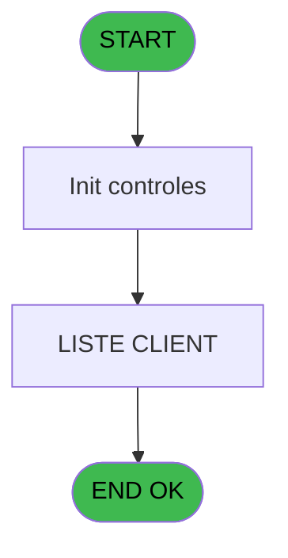
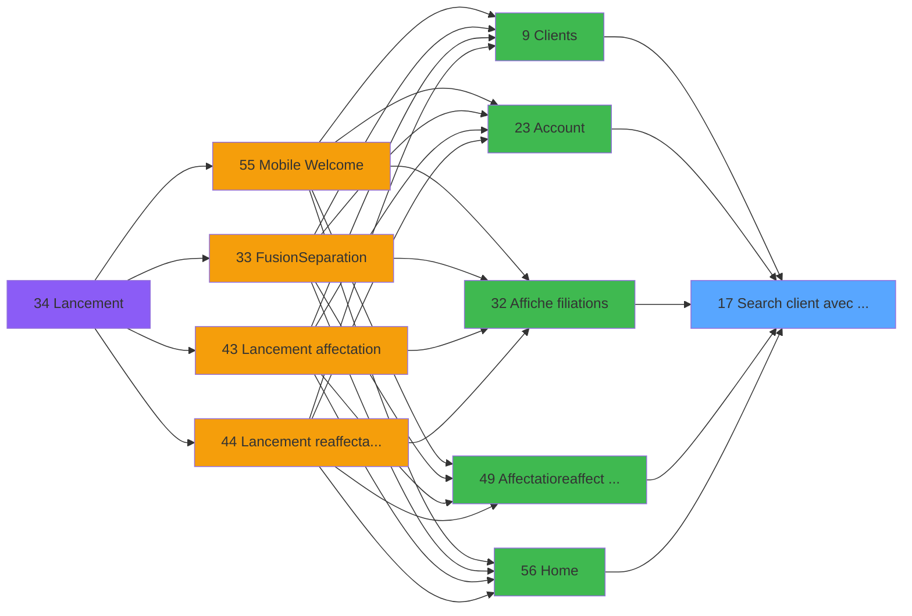
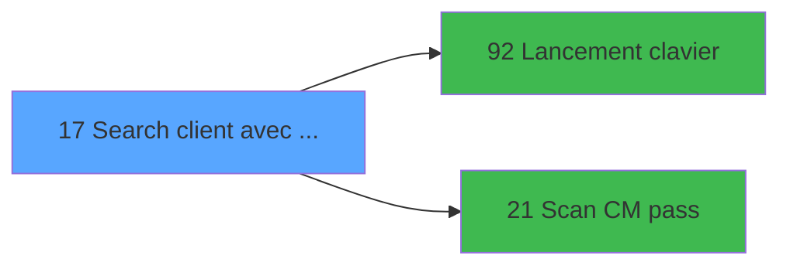

# WEL IDE 17 - Search client avec liste

> **Analyse**: Phases 1-4 2026-02-03 21:16 -> 21:17 (17s) | Assemblage 21:17
> **Pipeline**: V7.2 Enrichi
> **Structure**: 4 onglets (Resume | Ecrans | Donnees | Connexions)

<!-- TAB:Resume -->

## 1. FICHE D'IDENTITE

| Attribut | Valeur |
|----------|--------|
| Projet | WEL |
| IDE Position | 17 |
| Nom Programme | Search client avec liste |
| Fichier source | `Prg_17.xml` |
| Dossier IDE | Clients |
| Taches | 2 (1 ecrans visibles) |
| Tables modifiees | 0 |
| Programmes appeles | 2 |

## 2. DESCRIPTION FONCTIONNELLE

**Search client avec liste** assure la gestion complete de ce processus, accessible depuis [Clients (IDE 9)](WEL-IDE-9.md), [Account (IDE 23)](WEL-IDE-23.md), [Affiche filiations (IDE 32)](WEL-IDE-32.md), [Affectatio/reaffect logement (IDE 49)](WEL-IDE-49.md), [Home (IDE 56)](WEL-IDE-56.md), [Ventes (IDE 96)](WEL-IDE-96.md), [Ventes *Sav au 02/07/2018 (IDE 116)](WEL-IDE-116.md), [Ventes *Sav au 04/07/2018 (IDE 117)](WEL-IDE-117.md).

Le flux de traitement s'organise en **1 blocs fonctionnels** :

- **Traitement** (2 taches) : traitements metier divers

## 3. BLOCS FONCTIONNELS

### 3.1 Traitement (2 taches)

Traitements internes.

---

#### 17 - Search client

**Role** : Traitement : Search client.
**Delegue a** : [Lancement clavier (IDE 92)](WEL-IDE-92.md), [Scan CM pass (IDE 21)](WEL-IDE-21.md)

---

#### 17.1 - LISTE CLIENT [[ECRAN]](#ecran-t2)

**Role** : Traitement : LISTE CLIENT.
**Ecran** : 1131 x 505 DLU (Modal) | [Voir mockup](#ecran-t2)
**Delegue a** : [Lancement clavier (IDE 92)](WEL-IDE-92.md), [Scan CM pass (IDE 21)](WEL-IDE-21.md)

## 5. REGLES METIER

*(Aucune regle metier identifiee)*

## 6. CONTEXTE

- **Appele par**: [Clients (IDE 9)](WEL-IDE-9.md), [Account (IDE 23)](WEL-IDE-23.md), [Affiche filiations (IDE 32)](WEL-IDE-32.md), [Affectatio/reaffect logement (IDE 49)](WEL-IDE-49.md), [Home (IDE 56)](WEL-IDE-56.md), [Ventes (IDE 96)](WEL-IDE-96.md), [Ventes *Sav au 02/07/2018 (IDE 116)](WEL-IDE-116.md), [Ventes *Sav au 04/07/2018 (IDE 117)](WEL-IDE-117.md)
- **Appelle**: 2 programmes | **Tables**: 0 (W:0 R:0 L:0) | **Taches**: 2 | **Expressions**: 12

<!-- TAB:Ecrans -->

## 8. ECRANS

### 8.1 Forms visibles (1 / 2)

| # | Position | Tache | Nom | Type | Largeur | Hauteur | Bloc |
|---|----------|-------|-----|------|---------|---------|------|
| 1 | 17.1 | 17.1 | LISTE CLIENT | Modal | 1131 | 505 | Traitement |

### 8.2 Mockups Ecrans

---

#### 17.1 - LISTE CLIENT
**Tache** : [17.1](#t2) | **Type** : Modal | **Dimensions** : 1131 x 505 DLU
**Bloc** : Traitement | **Titre IDE** : LISTE CLIENT

<!-- FORM-DATA:
{
    "width":  1131,
    "vFactor":  100,
    "type":  "Modal",
    "hFactor":  100,
    "controls":  [
                     {
                         "x":  17,
                         "type":  "label",
                         "var":  "",
                         "y":  1,
                         "w":  300,
                         "fmt":  "",
                         "name":  "",
                         "h":  44,
                         "color":  "",
                         "text":  "NAME",
                         "parent":  null
                     },
                     {
                         "x":  316,
                         "type":  "label",
                         "var":  "",
                         "y":  1,
                         "w":  236,
                         "fmt":  "",
                         "name":  "",
                         "h":  44,
                         "color":  "",
                         "text":  "FIRST NAME",
                         "parent":  null
                     },
                     {
                         "x":  551,
                         "type":  "label",
                         "var":  "",
                         "y":  1,
                         "w":  95,
                         "fmt":  "",
                         "name":  "",
                         "h":  44,
                         "color":  "",
                         "text":  "AGE",
                         "parent":  null
                     },
                     {
                         "x":  645,
                         "type":  "label",
                         "var":  "",
                         "y":  1,
                         "w":  96,
                         "fmt":  "",
                         "name":  "",
                         "h":  44,
                         "color":  "",
                         "text":  "ROOM",
                         "parent":  null
                     },
                     {
                         "x":  740,
                         "type":  "label",
                         "var":  "",
                         "y":  1,
                         "w":  114,
                         "fmt":  "",
                         "name":  "",
                         "h":  44,
                         "color":  "",
                         "text":  "ARR",
                         "parent":  null
                     },
                     {
                         "x":  853,
                         "type":  "label",
                         "var":  "",
                         "y":  1,
                         "w":  114,
                         "fmt":  "",
                         "name":  "",
                         "h":  44,
                         "color":  "",
                         "text":  "DEP",
                         "parent":  null
                     },
                     {
                         "x":  966,
                         "type":  "label",
                         "var":  "",
                         "y":  1,
                         "w":  102,
                         "fmt":  "",
                         "name":  "",
                         "h":  44,
                         "color":  "",
                         "text":  "$",
                         "parent":  null
                     },
                     {
                         "x":  18,
                         "type":  "table",
                         "var":  "",
                         "name":  "",
                         "titleH":  12,
                         "color":  "",
                         "w":  1052,
                         "y":  45,
                         "fmt":  "",
                         "parent":  null,
                         "text":  "",
                         "rowH":  44,
                         "h":  442,
                         "cols":  [
                                      {
                                          "title":  "NAME",
                                          "layer":  1,
                                          "w":  298
                                      },
                                      {
                                          "title":  "FIRST NAME",
                                          "layer":  2,
                                          "w":  234
                                      },
                                      {
                                          "title":  "AGE",
                                          "layer":  3,
                                          "w":  94
                                      },
                                      {
                                          "title":  "ROOM",
                                          "layer":  4,
                                          "w":  94
                                      },
                                      {
                                          "title":  "ARR",
                                          "layer":  5,
                                          "w":  113
                                      },
                                      {
                                          "title":  "DEP",
                                          "layer":  6,
                                          "w":  113
                                      },
                                      {
                                          "title":  "$",
                                          "layer":  7,
                                          "w":  100
                                      }
                                  ],
                         "rows":  7
                     },
                     {
                         "x":  1068,
                         "type":  "button",
                         "var":  "",
                         "y":  0,
                         "w":  56,
                         "fmt":  "",
                         "name":  "",
                         "h":  244,
                         "color":  "",
                         "text":  "",
                         "parent":  null
                     },
                     {
                         "x":  22,
                         "type":  "button",
                         "var":  "",
                         "y":  50,
                         "w":  288,
                         "fmt":  "",
                         "name":  "Nom",
                         "h":  36,
                         "color":  "220",
                         "text":  "",
                         "parent":  9
                     },
                     {
                         "x":  321,
                         "type":  "edit",
                         "var":  "",
                         "y":  50,
                         "w":  226,
                         "fmt":  "",
                         "name":  "Prenom",
                         "h":  36,
                         "color":  "",
                         "text":  "",
                         "parent":  9
                     },
                     {
                         "x":  558,
                         "type":  "edit",
                         "var":  "",
                         "y":  50,
                         "w":  82,
                         "fmt":  "30",
                         "name":  "Age",
                         "h":  36,
                         "color":  "",
                         "text":  "",
                         "parent":  9
                     },
                     {
                         "x":  650,
                         "type":  "edit",
                         "var":  "",
                         "y":  50,
                         "w":  84,
                         "fmt":  "U6",
                         "name":  "Room",
                         "h":  36,
                         "color":  "",
                         "text":  "",
                         "parent":  9
                     },
                     {
                         "x":  746,
                         "type":  "edit",
                         "var":  "",
                         "y":  50,
                         "w":  104,
                         "fmt":  "##/##",
                         "name":  "V.Date debut",
                         "h":  36,
                         "color":  "",
                         "text":  "",
                         "parent":  9
                     },
                     {
                         "x":  855,
                         "type":  "edit",
                         "var":  "",
                         "y":  50,
                         "w":  107,
                         "fmt":  "##/##",
                         "name":  "V.Date fin",
                         "h":  36,
                         "color":  "",
                         "text":  "",
                         "parent":  9
                     },
                     {
                         "x":  996,
                         "type":  "image",
                         "var":  "",
                         "y":  50,
                         "w":  34,
                         "fmt":  "",
                         "name":  "",
                         "h":  33,
                         "color":  "226",
                         "text":  "",
                         "parent":  9
                     },
                     {
                         "x":  1068,
                         "type":  "button",
                         "var":  "",
                         "y":  245,
                         "w":  56,
                         "fmt":  "",
                         "name":  "",
                         "h":  243,
                         "color":  "",
                         "text":  "",
                         "parent":  null
                     }
                 ],
    "taskId":  "17.1",
    "height":  505
}
-->

<strong>Champs : 5 champs</strong>

| Pos (x,y) | Nom | Variable | Type |
|-----------|-----|----------|------|
| 321,50 | Prenom | - | edit |
| 558,50 | Age | - | edit |
| 650,50 | Room | - | edit |
| 746,50 | V.Date debut | - | edit |
| 855,50 | V.Date fin | - | edit |

<strong>Boutons : 3 boutons</strong>

| Bouton | Pos (x,y) | Action |
|--------|-----------|--------|
| (sans nom) | 1068,0 | Action declenchee |
| Nom | 22,50 | Identification du client |
| (sans nom) | 1068,245 | Action declenchee |

## 9. NAVIGATION

Ecran unique: **LISTE CLIENT**

### 9.3 Structure hierarchique (2 taches)

| Position | Tache | Type | Dimensions | Bloc |
|----------|-------|------|------------|------|
| **17.1** | [**Search client** (17)](#t1) | - | - | Traitement |
| 17.1.1 | [LISTE CLIENT (17.1)](#t2) [mockup](#ecran-t2) | Modal | 1131x505 | |

### 9.4 Algorigramme

> **Legende**: Vert = START/END OK | Rouge = END KO | Bleu = Decisions
> *Algorigramme auto-genere. Utiliser `/algorigramme` pour une synthese metier detaillee.*

<!-- TAB:Donnees -->

## 10. TABLES

### Tables utilisees (0)

| ID | Nom | Description | Type | R | W | L | Usages |
|----|-----|-------------|------|---|---|---|--------|

### Colonnes par table (0 / 0 tables avec colonnes identifiees)

## 11. VARIABLES

### 11.1 Parametres entrants (3)

Variables recues du programme appelant ([Clients (IDE 9)](WEL-IDE-9.md)).

| Lettre | Nom | Type | Usage dans |
|--------|-----|------|-----------|
| A | P.Sans modifier contexte | Logical | 2x parametre entrant |
| B | P.Nom recherche | Alpha | 2x parametre entrant |
| C | P.Prenom recherche | Alpha | 2x parametre entrant |

### 11.2 Variables de session (7)

Variables persistantes pendant toute la session.

| Lettre | Nom | Type | Usage dans |
|--------|-----|------|-----------|
| D | v.Last Name | Alpha | - |
| E | v.First Name | Alpha | 3x session |
| F | v.Room | Alpha | - |
| G | v.Reponse | Numeric | - |
| H | V.Clause where | Alpha | - |
| K | V.Date debut | Date | - |
| L | V.Date fin | Date | - |

### 11.3 Autres (2)

Variables diverses.

| Lettre | Nom | Type | Usage dans |
|--------|-----|------|-----------|
| I | Date fin | Alpha | - |
| J | Garanti | Unicode | - |

## 12. EXPRESSIONS

**12 / 12 expressions decodees (100%)**

### 12.1 Repartition par type

| Type | Expressions | Regles |
|------|-------------|--------|
| CONSTANTE | 2 | 0 |
| CONDITION | 4 | 0 |
| OTHER | 3 | 0 |
| CONCATENATION | 3 | 0 |

### 12.2 Expressions cles par type

#### CONSTANTE (2 expressions)

| Type | IDE | Expression | Regle |
|------|-----|------------|-------|
| CONSTANTE | 6 | `'SB_LISTE_CLIENT'` | - |
| CONSTANTE | 2 | `''` | - |

#### CONDITION (4 expressions)

| Type | IDE | Expression | Regle |
|------|-----|------------|-------|
| CONDITION | 9 | `Trim(P.Nom recherche [B])<>''` | - |
| CONDITION | 12 | `Trim(P.Prenom recherche [C])<>''` | - |
| CONDITION | 1 | `VG51='TB' AND LastClicked ()<>'RETOUR' AND LastClicked ()<>'Nom'` | - |
| CONDITION | 8 | `Trim(P.Sans modifier contexte [A])<>''` | - |

#### OTHER (3 expressions)

| Type | IDE | Expression | Regle |
|------|-----|------------|-------|
| OTHER | 5 | `ASCIIChr(13)&MlsTrans('SCAN CLUBMED PASS')` | - |
| OTHER | 4 | `ASCIIChr(13)&MlsTrans('SEARCH')` | - |
| OTHER | 3 | `CtrlGoto ('SB_LISTE_CLIENT',0,0)` | - |

#### CONCATENATION (3 expressions)

| Type | IDE | Expression | Regle |
|------|-----|------------|-------|
| CONCATENATION | 11 | `Trim(v.First Name [E])&' and heb_nom_logement ='''&Trim(P.Prenom recherche [C])&''''` | - |
| CONCATENATION | 10 | `Trim(v.First Name [E])&' and prenom_personne like ''%'&Trim(P.Nom recherche [B])&'%'''` | - |
| CONCATENATION | 7 | `Trim(v.First Name [E])&' and nom_personne like ''%'&Trim(P.Sans modifier contexte [A])&'%'''` | - |

<!-- TAB:Connexions -->

## 13. GRAPHE D'APPELS

### 13.1 Chaine depuis Main (Callers)

Main -> ... -> [Clients (IDE 9)](WEL-IDE-9.md) -> **Search client avec liste (IDE 17)**

Main -> ... -> [Account (IDE 23)](WEL-IDE-23.md) -> **Search client avec liste (IDE 17)**

Main -> ... -> [Affiche filiations (IDE 32)](WEL-IDE-32.md) -> **Search client avec liste (IDE 17)**

Main -> ... -> [Affectatio/reaffect logement (IDE 49)](WEL-IDE-49.md) -> **Search client avec liste (IDE 17)**

Main -> ... -> [Home (IDE 56)](WEL-IDE-56.md) -> **Search client avec liste (IDE 17)**

Main -> ... -> [Ventes (IDE 96)](WEL-IDE-96.md) -> **Search client avec liste (IDE 17)**

Main -> ... -> [Ventes *Sav au 02/07/2018 (IDE 116)](WEL-IDE-116.md) -> **Search client avec liste (IDE 17)**

Main -> ... -> [Ventes *Sav au 04/07/2018 (IDE 117)](WEL-IDE-117.md) -> **Search client avec liste (IDE 17)**

### 13.2 Callers

| IDE | Nom Programme | Nb Appels |
|-----|---------------|-----------|
| [9](WEL-IDE-9.md) | Clients | 1 |
| [23](WEL-IDE-23.md) | Account | 1 |
| [32](WEL-IDE-32.md) | Affiche filiations | 1 |
| [49](WEL-IDE-49.md) | Affectatio/reaffect logement | 1 |
| [56](WEL-IDE-56.md) | Home | 1 |
| [96](WEL-IDE-96.md) | Ventes | 1 |
| [116](WEL-IDE-116.md) | Ventes *Sav au 02/07/2018 | 1 |
| [117](WEL-IDE-117.md) | Ventes *Sav au 04/07/2018 | 1 |

### 13.3 Callees (programmes appeles)

### 13.4 Detail Callees avec contexte

| IDE | Nom Programme | Appels | Contexte |
|-----|---------------|--------|----------|
| [92](WEL-IDE-92.md) | Lancement clavier | 3 | Sous-programme |
| [21](WEL-IDE-21.md) | Scan CM pass | 1 | Sous-programme |

## 14. RECOMMANDATIONS MIGRATION

### 14.1 Profil du programme

| Metrique | Valeur | Impact migration |
|----------|--------|-----------------|
| Lignes de logique | 48 | Programme compact |
| Expressions | 12 | Peu de logique |
| Tables WRITE | 0 | Impact faible |
| Sous-programmes | 2 | Peu de dependances |
| Ecrans visibles | 1 | Ecran unique ou traitement batch |
| Code desactive | 0% (0 / 48) | Code sain |
| Regles metier | 0 | Pas de regle identifiee |

### 14.2 Plan de migration par bloc

#### Traitement (2 taches: 1 ecran, 1 traitement)

- **Strategie** : Orchestrateur avec 1 ecrans (Razor/React) et 1 traitements backend (services).
- Les ecrans deviennent des composants UI, les traitements invisibles deviennent des services injectables.
- 2 sous-programme(s) a migrer ou a reutiliser depuis les services existants.
- Decomposer les taches en services unitaires testables.

### 14.3 Dependances critiques

| Dependance | Type | Appels | Impact |
|------------|------|--------|--------|
| [Lancement clavier (IDE 92)](WEL-IDE-92.md) | Sous-programme | 3x | **CRITIQUE** - Sous-programme |
| [Scan CM pass (IDE 21)](WEL-IDE-21.md) | Sous-programme | 1x | Normale - Sous-programme |

---
*Spec DETAILED generee par Pipeline V7.2 - 2026-02-03 21:17*
