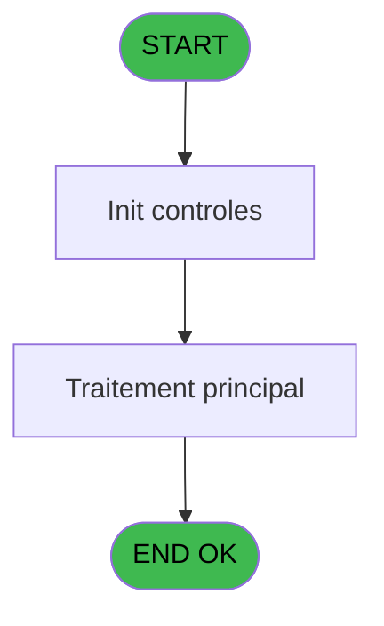
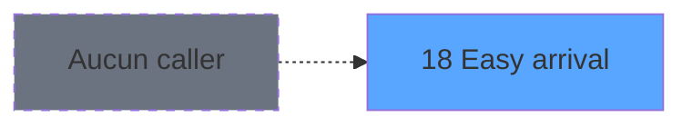
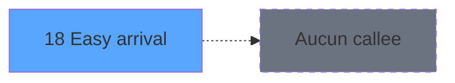

# WEL IDE 18 - Easy arrival

> **Analyse**: Phases 1-4 2026-02-03 21:17 -> 21:17 (18s) | Assemblage 21:17
> **Pipeline**: V7.2 Enrichi
> **Structure**: 4 onglets (Resume | Ecrans | Donnees | Connexions)

<!-- TAB:Resume -->

## 1. FICHE D'IDENTITE

| Attribut | Valeur |
|----------|--------|
| Projet | WEL |
| IDE Position | 18 |
| Nom Programme | Easy arrival |
| Fichier source | `Prg_18.xml` |
| Dossier IDE | Clients |
| Taches | 2 (0 ecrans visibles) |
| Tables modifiees | 0 |
| Programmes appeles | 0 |
| :warning: Statut | **ORPHELIN_POTENTIEL** |

## 2. DESCRIPTION FONCTIONNELLE

**Easy arrival** assure la gestion complete de ce processus.

Le flux de traitement s'organise en **1 blocs fonctionnels** :

- **Traitement** (2 taches) : traitements metier divers

**Logique metier** : 6 regles identifiees couvrant conditions metier.

## 3. BLOCS FONCTIONNELS

### 3.1 Traitement (2 taches)

Traitements internes.

---

#### 18 - Easy arrival

**Role** : Traitement : Easy arrival.
**Variables liees** : A (V.EasyChekIn), E (V.EasyChekOut), I (V.EasyChekIn), M (V.EasyChekOut)

---

#### 18.1 - Categorie client intialisation

**Role** : Traitement : Categorie client intialisation.

## 5. REGLES METIER

6 regles identifiees:

### Autres (6 regles)

#### [RM-001] Si V.Lesson [L] alors '√' sinon ' ')

| Element | Detail |
|---------|--------|
| **Condition** | `V.Lesson [L]` |
| **Si vrai** | '√' |
| **Si faux** | ' ') |
| **Variables** | L (V.Lesson) |
| **Expression source** | Expression 5 : `IF(V.Lesson [L],'√',' ')` |
| **Exemple** | Si V.Lesson [L] → '√'. Sinon → ' ') |

#### [RM-002] Si [Q] alors '√' sinon ' ')

| Element | Detail |
|---------|--------|
| **Condition** | `[Q]` |
| **Si vrai** | '√' |
| **Si faux** | ' ') |
| **Expression source** | Expression 6 : `IF([Q],'√',' ')` |
| **Exemple** | Si [Q] → '√'. Sinon → ' ') |

#### [RM-003] Si V.EasyChekOut [M] alors '√' sinon ' ')

| Element | Detail |
|---------|--------|
| **Condition** | `V.EasyChekOut [M]` |
| **Si vrai** | '√' |
| **Si faux** | ' ') |
| **Variables** | E (V.EasyChekOut), M (V.EasyChekOut) |
| **Expression source** | Expression 7 : `IF(V.EasyChekOut [M],'√',' ')` |
| **Exemple** | Si V.EasyChekOut [M] → '√'. Sinon → ' ') |
| **Impact** | [18 - Easy arrival](#t3) |

#### [RM-004] Si [N] alors '√' sinon ' ')

| Element | Detail |
|---------|--------|
| **Condition** | `[N]` |
| **Si vrai** | '√' |
| **Si faux** | ' ') |
| **Expression source** | Expression 8 : `IF([N],'√',' ')` |
| **Exemple** | Si [N] → '√'. Sinon → ' ') |

#### [RM-005] Si [P] alors '√' sinon ' ')

| Element | Detail |
|---------|--------|
| **Condition** | `[P]` |
| **Si vrai** | '√' |
| **Si faux** | ' ') |
| **Expression source** | Expression 9 : `IF([P],'√',' ')` |
| **Exemple** | Si [P] → '√'. Sinon → ' ') |

#### [RM-006] Traitement si Trim([BL]) est renseigne

| Element | Detail |
|---------|--------|
| **Condition** | `Trim([BL])<>''` |
| **Si vrai** | 'TRUE'LOG |
| **Si faux** | 'FALSE'LOG) |
| **Expression source** | Expression 19 : `IF(Trim([BL])<>'','TRUE'LOG,'FALSE'LOG)` |
| **Exemple** | Si Trim([BL])<>'' → 'TRUE'LOG. Sinon → 'FALSE'LOG) |

## 6. CONTEXTE

- **Appele par**: (aucun)
- **Appelle**: 0 programmes | **Tables**: 5 (W:0 R:2 L:3) | **Taches**: 2 | **Expressions**: 22

<!-- TAB:Ecrans -->

## 8. ECRANS

*(Programme sans ecran visible)*

## 9. NAVIGATION

### 9.3 Structure hierarchique (2 taches)

| Position | Tache | Type | Dimensions | Bloc |
|----------|-------|------|------------|------|
| **18.1** | [**Easy arrival** (18)](#t3) | - | - | Traitement |
| 18.1.1 | [Categorie client intialisation (18.1)](#t30) | - | - | |

### 9.4 Algorigramme

> **Legende**: Vert = START/END OK | Rouge = END KO | Bleu = Decisions
> *Algorigramme auto-genere. Utiliser `/algorigramme` pour une synthese metier detaillee.*

<!-- TAB:Donnees -->

## 10. TABLES

### Tables utilisees (5)

| ID | Nom | Description | Type | R | W | L | Usages |
|----|-----|-------------|------|---|---|---|--------|
| 31 | gm-complet_______gmc |  | DB | R |   |   | 1 |
| 39 | depot_garantie___dga | Depots et garanties | DB |   |   | L | 1 |
| 131 | fichier_validation |  | DB | R |   |   | 1 |
| 768 | motif_no_enreg_na |  | DB |   |   | L | 1 |
| 917 | web_api_logs |  | DB |   |   | L | 1 |

### Colonnes par table (2 / 2 tables avec colonnes identifiees)

Table 31 - gm-complet_______gmc (R) - 1 usages

| Lettre | Variable | Acces | Type |
|--------|----------|-------|------|
| A | P.Chk_in | R | Logical |
| B | P.Child | R | Logical |
| C | P.Ski | R | Logical |
| D | P.Lessons | R | Logical |
| E | P.Chk_Out | R | Logical |
| F | V.Existe quest 60 ? | R | Logical |
| G | V.Existe quest 61 ? | R | Logical |
| H | V.Existe quest 62 ? | R | Logical |
| I | V.EasyChekIn | R | Logical |
| J | V.Child | R | Logical |
| K | V.Ski Equipment | R | Logical |
| L | V.Lesson | R | Logical |
| M | V.EasyChekOut | R | Logical |

Table 131 - fichier_validation (R) - 1 usages

| Lettre | Variable | Acces | Type |
|--------|----------|-------|------|
| A | V.EasyChekIn | R | Logical |
| B | V.Child | R | Logical |
| C | v.SkiEquipmt | R | Logical |
| D | v.SkiLessons | R | Logical |
| E | V.EasyChekOut | R | Logical |

## 11. VARIABLES

### 11.1 Variables de session (13)

Variables persistantes pendant toute la session.

| Lettre | Nom | Type | Usage dans |
|--------|-----|------|-----------|
| A | V.EasyChekIn | Logical | - |
| B | V.Child | Logical | 1x session |
| C | v.SkiEquipmt | Logical | - |
| D | v.SkiLessons | Logical | - |
| E | V.EasyChekOut | Logical | 1x session |
| F | V.Existe quest 60 ? | Logical | - |
| G | V.Existe quest 61 ? | Logical | - |
| H | V.Existe quest 62 ? | Logical | - |
| I | V.EasyChekIn | Logical | - |
| J | V.Child | Logical | 1x session |
| K | V.Ski Equipment | Logical | 1x session |
| L | V.Lesson | Logical | 1x session |
| M | V.EasyChekOut | Logical | 1x session |

## 12. EXPRESSIONS

**22 / 22 expressions decodees (100%)**

### 12.1 Repartition par type

| Type | Expressions | Regles |
|------|-------------|--------|
| CONCATENATION | 1 | 0 |
| CONDITION | 5 | 5 |
| CAST_LOGIQUE | 1 | 5 |
| REFERENCE_VG | 6 | 0 |
| OTHER | 9 | 0 |

### 12.2 Expressions cles par type

#### CONCATENATION (1 expressions)

| Type | IDE | Expression | Regle |
|------|-----|------------|-------|
| CONCATENATION | 4 | `'EASY ARRIVAL - '&Trim(V.Child [J])&' '&Trim(V.Ski Equipment [K])` | - |

#### CONDITION (5 expressions)

| Type | IDE | Expression | Regle |
|------|-----|------------|-------|
| CONDITION | 8 | `IF([N],'√',' ')` | [RM-004](#rm-RM-004) |
| CONDITION | 9 | `IF([P],'√',' ')` | [RM-005](#rm-RM-005) |
| CONDITION | 7 | `IF(V.EasyChekOut [M],'√',' ')` | [RM-003](#rm-RM-003) |
| CONDITION | 5 | `IF(V.Lesson [L],'√',' ')` | [RM-001](#rm-RM-001) |
| CONDITION | 6 | `IF([Q],'√',' ')` | [RM-002](#rm-RM-002) |

#### CAST_LOGIQUE (1 expressions)

| Type | IDE | Expression | Regle |
|------|-----|------------|-------|
| CAST_LOGIQUE | 19 | `IF(Trim([BL])<>'','TRUE'LOG,'FALSE'LOG)` | [RM-006](#rm-RM-006) |

#### REFERENCE_VG (6 expressions)

| Type | IDE | Expression | Regle |
|------|-----|------------|-------|
| REFERENCE_VG | 15 | `VG5` | - |
| REFERENCE_VG | 16 | `VG9` | - |
| REFERENCE_VG | 17 | `VG10` | - |
| REFERENCE_VG | 1 | `VG5` | - |
| REFERENCE_VG | 2 | `VG9` | - |
| ... | | *+1 autres* | |

#### OTHER (9 expressions)

| Type | IDE | Expression | Regle |
|------|-----|------------|-------|
| OTHER | 20 | `[AW]` | - |
| OTHER | 18 | `[BM]` | - |
| OTHER | 22 | `[AQ]` | - |
| OTHER | 21 | `[AK]` | - |
| OTHER | 14 | `MlsTrans('SKI LESSONS')` | - |
| ... | | *+4 autres* | |

### 12.3 Toutes les expressions (22)

Voir les 22 expressions

#### CONCATENATION (1)

| IDE | Expression Decodee |
|-----|-------------------|
| 4 | `'EASY ARRIVAL - '&Trim(V.Child [J])&' '&Trim(V.Ski Equipment [K])` |

#### CONDITION (5)

| IDE | Expression Decodee |
|-----|-------------------|
| 5 | `IF(V.Lesson [L],'√',' ')` |
| 6 | `IF([Q],'√',' ')` |
| 7 | `IF(V.EasyChekOut [M],'√',' ')` |
| 8 | `IF([N],'√',' ')` |
| 9 | `IF([P],'√',' ')` |

#### CAST_LOGIQUE (1)

| IDE | Expression Decodee |
|-----|-------------------|
| 19 | `IF(Trim([BL])<>'','TRUE'LOG,'FALSE'LOG)` |

#### REFERENCE_VG (6)

| IDE | Expression Decodee |
|-----|-------------------|
| 1 | `VG5` |
| 2 | `VG9` |
| 3 | `VG10` |
| 15 | `VG5` |
| 16 | `VG9` |
| 17 | `VG10` |

#### OTHER (9)

| IDE | Expression Decodee |
|-----|-------------------|
| 10 | `MlsTrans('EASY CHECK IN')` |
| 11 | `MlsTrans('CHILD')` |
| 12 | `MlsTrans('EASY CHECK OUT')` |
| 13 | `MlsTrans('SKI EQUIPMENT')` |
| 14 | `MlsTrans('SKI LESSONS')` |
| 18 | `[BM]` |
| 20 | `[AW]` |
| 21 | `[AK]` |
| 22 | `[AQ]` |

<!-- TAB:Connexions -->

## 13. GRAPHE D'APPELS

### 13.1 Chaine depuis Main (Callers)

**Chemin**: (pas de callers directs)

### 13.2 Callers

| IDE | Nom Programme | Nb Appels |
|-----|---------------|-----------|
| - | (aucun) | - |

### 13.3 Callees (programmes appeles)

### 13.4 Detail Callees avec contexte

| IDE | Nom Programme | Appels | Contexte |
|-----|---------------|--------|----------|
| - | (aucun) | - | - |

## 14. RECOMMANDATIONS MIGRATION

### 14.1 Profil du programme

| Metrique | Valeur | Impact migration |
|----------|--------|-----------------|
| Lignes de logique | 72 | Programme compact |
| Expressions | 22 | Peu de logique |
| Tables WRITE | 0 | Impact faible |
| Sous-programmes | 0 | Peu de dependances |
| Ecrans visibles | 0 | Ecran unique ou traitement batch |
| Code desactive | 0% (0 / 72) | Code sain |
| Regles metier | 6 | Quelques regles a preserver |

### 14.2 Plan de migration par bloc

#### Traitement (2 taches: 0 ecran, 2 traitements)

- **Strategie** : 2 service(s) backend injectable(s) (Domain Services).
- Decomposer les taches en services unitaires testables.

### 14.3 Dependances critiques

| Dependance | Type | Appels | Impact |
|------------|------|--------|--------|

---
*Spec DETAILED generee par Pipeline V7.2 - 2026-02-03 21:17*
