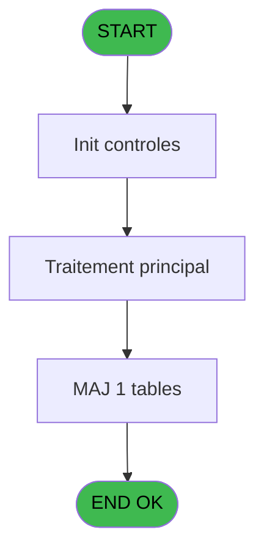

# WEL IDE 22 - Encode CM pass

> **Analyse**: Phases 1-4 2026-02-03 21:18 -> 21:18 (19s) | Assemblage 21:18
> **Pipeline**: V7.2 Enrichi
> **Structure**: 4 onglets (Resume | Ecrans | Donnees | Connexions)

<!-- TAB:Resume -->

## 1. FICHE D'IDENTITE

| Attribut | Valeur |
|----------|--------|
| Projet | WEL |
| IDE Position | 22 |
| Nom Programme | Encode CM pass |
| Fichier source | `Prg_22.xml` |
| Dossier IDE | Compte |
| Taches | 3 (0 ecrans visibles) |
| Tables modifiees | 1 |
| Programmes appeles | 1 |
| :warning: Statut | **ORPHELIN_POTENTIEL** |

## 2. DESCRIPTION FONCTIONNELLE

**Encode CM pass** assure la gestion complete de ce processus.

Le flux de traitement s'organise en **2 blocs fonctionnels** :

- **Creation** (2 taches) : insertion d'enregistrements en base (mouvements, prestations)
- **Traitement** (1 tache) : traitements metier divers

**Donnees modifiees** : 1 tables en ecriture (ez_card).

Detail : phases du traitement

#### Phase 1 : Traitement (1 tache)

- **22** - Encode CM pass

#### Phase 2 : Creation (2 taches)

- **22.1** - Creat Club Med Pass
- **22.2** - Creat Club Med Pass

Delegue a : [Create logbook (IDE 81)](WEL-IDE-81.md)

#### Tables impactees

| Table | Operations | Role metier |
|-------|-----------|-------------|
| ez_card | **W**/L (3 usages) |  |

## 3. BLOCS FONCTIONNELS

### 3.1 Traitement (1 tache)

Traitements internes.

---

#### 22 - Encode CM pass

**Role** : Traitement : Encode CM pass.
**Variables liees** : B (V0.N° club med pass)

### 3.2 Creation (2 taches)

Insertion de nouveaux enregistrements en base.

---

#### 22.1 - Creat Club Med Pass

**Role** : Traitement : Creat Club Med Pass.
**Variables liees** : B (V0.N° club med pass)
**Delegue a** : [Create logbook (IDE 81)](WEL-IDE-81.md)

---

#### 22.2 - Creat Club Med Pass

**Role** : Traitement : Creat Club Med Pass.
**Variables liees** : B (V0.N° club med pass)
**Delegue a** : [Create logbook (IDE 81)](WEL-IDE-81.md)

## 5. REGLES METIER

*(Aucune regle metier identifiee)*

## 6. CONTEXTE

- **Appele par**: (aucun)
- **Appelle**: 1 programmes | **Tables**: 6 (W:1 R:1 L:5) | **Taches**: 3 | **Expressions**: 25

<!-- TAB:Ecrans -->

## 8. ECRANS

*(Programme sans ecran visible)*

## 9. NAVIGATION

### 9.3 Structure hierarchique (3 taches)

| Position | Tache | Type | Dimensions | Bloc |
|----------|-------|------|------------|------|
| **22.1** | [**Encode CM pass** (22)](#t1) | - | - | Traitement |
| **22.2** | [**Creat Club Med Pass** (22.1)](#t2) | - | - | Creation |
| 22.2.1 | [Creat Club Med Pass (22.2)](#t3) | - | - | |

### 9.4 Algorigramme

> **Legende**: Vert = START/END OK | Rouge = END KO | Bleu = Decisions
> *Algorigramme auto-genere. Utiliser `/algorigramme` pour une synthese metier detaillee.*

<!-- TAB:Donnees -->

## 10. TABLES

### Tables utilisees (6)

| ID | Nom | Description | Type | R | W | L | Usages |
|----|-----|-------------|------|---|---|---|--------|
| 26 | comptes_speciaux_spc | Comptes GM (generaux) | DB | R |   |   | 1 |
| 30 | gm-recherche_____gmr | Index de recherche | DB |   |   | L | 1 |
| 47 | compte_gm________cgm | Comptes GM (generaux) | DB |   |   | L | 1 |
| 131 | fichier_validation |  | DB |   |   | L | 1 |
| 312 | ez_card |  | DB |   | **W** | L | 3 |
| 459 | table_generale |  | DB |   |   | L | 1 |

### Colonnes par table (2 / 2 tables avec colonnes identifiees)

Table 26 - comptes_speciaux_spc (R) - 1 usages

| Lettre | Variable | Acces | Type |
|--------|----------|-------|------|
| A | P.Refresh view ? | R | Logical |
| B | V0.N° club med pass | R | Unicode |
| C | V.Exist Card ? | R | Logical |
| D | L.RetourCoptesSpeciaux | R | Logical |
| E | V0.Erreur | R | Logical |
| F | v.Longueur | R | Numeric |
| G | v.Nbre_Card | R | Numeric |

Table 312 - ez_card (**W**/L) - 3 usages

| Lettre | Variable | Acces | Type |
|--------|----------|-------|------|
| C | V.Exist Card ? | W | Logical |
| G | v.Nbre_Card | W | Numeric |

## 11. VARIABLES

### 11.1 Parametres entrants (1)

Variables recues en parametre.

| Lettre | Nom | Type | Usage dans |
|--------|-----|------|-----------|
| A | P.Refresh view ? | Logical | 1x parametre entrant |

### 11.2 Variables de session (3)

Variables persistantes pendant toute la session.

| Lettre | Nom | Type | Usage dans |
|--------|-----|------|-----------|
| C | V.Exist Card ? | Logical | - |
| F | v.Longueur | Numeric | - |
| G | v.Nbre_Card | Numeric | - |

### 11.3 Autres (3)

Variables diverses.

| Lettre | Nom | Type | Usage dans |
|--------|-----|------|-----------|
| B | V0.N° club med pass | Unicode | [22](#t1), [22.1](#t2), [22.2](#t3) |
| D | L.RetourCoptesSpeciaux | Logical | - |
| E | V0.Erreur | Logical | - |

## 12. EXPRESSIONS

**25 / 25 expressions decodees (100%)**

### 12.1 Repartition par type

| Type | Expressions | Regles |
|------|-------------|--------|
| CALCULATION | 1 | 0 |
| CONCATENATION | 4 | 0 |
| CONSTANTE | 2 | 0 |
| CAST_LOGIQUE | 2 | 0 |
| OTHER | 6 | 0 |
| CONDITION | 3 | 0 |
| NEGATION | 2 | 0 |
| REFERENCE_VG | 3 | 0 |
| STRING | 1 | 0 |
| FORMAT | 1 | 0 |

### 12.2 Expressions cles par type

#### CALCULATION (1 expressions)

| Type | IDE | Expression | Regle |
|------|-----|------------|-------|
| CALCULATION | 4 | `MlsTrans ('Call Encode Club-Med Pass')` | - |

#### CONCATENATION (4 expressions)

| Type | IDE | Expression | Regle |
|------|-----|------------|-------|
| CONCATENATION | 10 | `MlsTrans ('the length of the code is invalid  ')&' '&Trim(V0.N° club med pass [B])` | - |
| CONCATENATION | 11 | `MlsTrans ('This Card already exists  ')&' '&Trim(V0.N° club med pass [B])` | - |
| CONCATENATION | 5 | `MlsTrans ('Validate Encode Club-Med Pass')&' '&Trim(V0.N° club med pass [B])` | - |
| CONCATENATION | 7 | `'ACTIVATE CLUBMED PASS -'&' '&Trim([AD])&' '&Trim([AE])` | - |

#### CONSTANTE (2 expressions)

| Type | IDE | Expression | Regle |
|------|-----|------------|-------|
| CONSTANTE | 22 | `'EZGUA'` | - |
| CONSTANTE | 1 | `'SCAN_PASS'` | - |

#### CAST_LOGIQUE (2 expressions)

| Type | IDE | Expression | Regle |
|------|-----|------------|-------|
| CAST_LOGIQUE | 3 | `'FALSE'LOG` | - |
| CAST_LOGIQUE | 2 | `'TRUE'LOG` | - |

#### OTHER (6 expressions)

| Type | IDE | Expression | Regle |
|------|-----|------------|-------|
| OTHER | 16 | `[AA]` | - |
| OTHER | 17 | `V0.N° club med pass [B]` | - |
| OTHER | 24 | `[H]` | - |
| OTHER | 6 | `ASCIIChr (13)&'VALIDATE'` | - |
| OTHER | 8 | `MlsTrans ('transaction not completed !')` | - |
| ... | | *+1 autres* | |

#### CONDITION (3 expressions)

| Type | IDE | Expression | Regle |
|------|-----|------------|-------|
| CONDITION | 23 | `[H] AND Trim(V0.N° club med pass [B])<>''` | - |
| CONDITION | 14 | `[AB]<>10` | - |
| CONDITION | 12 | `[O]<>'O' AND [R]='Oui' AND IF ([S],[S],[Z]='O')` | - |

#### NEGATION (2 expressions)

| Type | IDE | Expression | Regle |
|------|-----|------------|-------|
| NEGATION | 25 | `NOT P.Refresh view ? [A]` | - |
| NEGATION | 15 | `NOT [AA]` | - |

#### REFERENCE_VG (3 expressions)

| Type | IDE | Expression | Regle |
|------|-----|------------|-------|
| REFERENCE_VG | 21 | `VG10` | - |
| REFERENCE_VG | 20 | `VG9` | - |
| REFERENCE_VG | 19 | `VG5` | - |

#### STRING (1 expressions)

| Type | IDE | Expression | Regle |
|------|-----|------------|-------|
| STRING | 13 | `Len (Trim(V0.N° club med pass [B]))` | - |

#### FORMAT (1 expressions)

| Type | IDE | Expression | Regle |
|------|-----|------------|-------|
| FORMAT | 18 | `'N° of Pass encoded  '&Str([AC],'###')` | - |

### 12.3 Toutes les expressions (25)

Voir les 25 expressions

#### CALCULATION (1)

| IDE | Expression Decodee |
|-----|-------------------|
| 4 | `MlsTrans ('Call Encode Club-Med Pass')` |

#### CONCATENATION (4)

| IDE | Expression Decodee |
|-----|-------------------|
| 5 | `MlsTrans ('Validate Encode Club-Med Pass')&' '&Trim(V0.N° club med pass [B])` |
| 7 | `'ACTIVATE CLUBMED PASS -'&' '&Trim([AD])&' '&Trim([AE])` |
| 10 | `MlsTrans ('the length of the code is invalid  ')&' '&Trim(V0.N° club med pass [B])` |
| 11 | `MlsTrans ('This Card already exists  ')&' '&Trim(V0.N° club med pass [B])` |

#### CONSTANTE (2)

| IDE | Expression Decodee |
|-----|-------------------|
| 1 | `'SCAN_PASS'` |
| 22 | `'EZGUA'` |

#### CAST_LOGIQUE (2)

| IDE | Expression Decodee |
|-----|-------------------|
| 2 | `'TRUE'LOG` |
| 3 | `'FALSE'LOG` |

#### OTHER (6)

| IDE | Expression Decodee |
|-----|-------------------|
| 6 | `ASCIIChr (13)&'VALIDATE'` |
| 8 | `MlsTrans ('transaction not completed !')` |
| 9 | `MlsTrans ('No Garanty')` |
| 16 | `[AA]` |
| 17 | `V0.N° club med pass [B]` |
| 24 | `[H]` |

#### CONDITION (3)

| IDE | Expression Decodee |
|-----|-------------------|
| 12 | `[O]<>'O' AND [R]='Oui' AND IF ([S],[S],[Z]='O')` |
| 14 | `[AB]<>10` |
| 23 | `[H] AND Trim(V0.N° club med pass [B])<>''` |

#### NEGATION (2)

| IDE | Expression Decodee |
|-----|-------------------|
| 15 | `NOT [AA]` |
| 25 | `NOT P.Refresh view ? [A]` |

#### REFERENCE_VG (3)

| IDE | Expression Decodee |
|-----|-------------------|
| 19 | `VG5` |
| 20 | `VG9` |
| 21 | `VG10` |

#### STRING (1)

| IDE | Expression Decodee |
|-----|-------------------|
| 13 | `Len (Trim(V0.N° club med pass [B]))` |

#### FORMAT (1)

| IDE | Expression Decodee |
|-----|-------------------|
| 18 | `'N° of Pass encoded  '&Str([AC],'###')` |

<!-- TAB:Connexions -->

## 13. GRAPHE D'APPELS

### 13.1 Chaine depuis Main (Callers)

**Chemin**: (pas de callers directs)

### 13.2 Callers

| IDE | Nom Programme | Nb Appels |
|-----|---------------|-----------|
| - | (aucun) | - |

### 13.3 Callees (programmes appeles)

### 13.4 Detail Callees avec contexte

| IDE | Nom Programme | Appels | Contexte |
|-----|---------------|--------|----------|
| [81](WEL-IDE-81.md) | Create logbook | 2 | Sous-programme |

## 14. RECOMMANDATIONS MIGRATION

### 14.1 Profil du programme

| Metrique | Valeur | Impact migration |
|----------|--------|-----------------|
| Lignes de logique | 89 | Programme compact |
| Expressions | 25 | Peu de logique |
| Tables WRITE | 1 | Impact faible |
| Sous-programmes | 1 | Peu de dependances |
| Ecrans visibles | 0 | Ecran unique ou traitement batch |
| Code desactive | 0% (0 / 89) | Code sain |
| Regles metier | 0 | Pas de regle identifiee |

### 14.2 Plan de migration par bloc

#### Traitement (1 tache: 0 ecran, 1 traitement)

- **Strategie** : 1 service(s) backend injectable(s) (Domain Services).
- 1 sous-programme(s) a migrer ou a reutiliser depuis les services existants.
- Decomposer les taches en services unitaires testables.

#### Creation (2 taches: 0 ecran, 2 traitements)

- **Strategie** : Repository pattern avec Entity Framework Core.
- Insertion via `IRepository<T>.CreateAsync()`

### 14.3 Dependances critiques

| Dependance | Type | Appels | Impact |
|------------|------|--------|--------|
| ez_card | Table WRITE (Database) | 2x | Schema + repository |
| [Create logbook (IDE 81)](WEL-IDE-81.md) | Sous-programme | 2x | Haute - Sous-programme |

---
*Spec DETAILED generee par Pipeline V7.2 - 2026-02-03 21:18*
