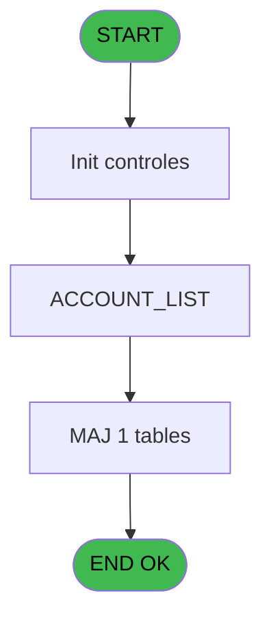
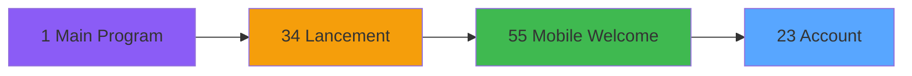
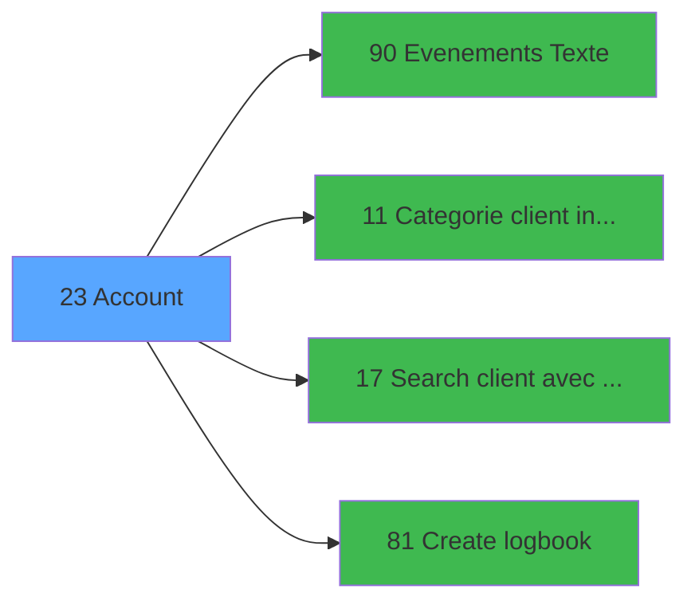

# WEL IDE 23 - Account

> **Analyse**: Phases 1-4 2026-02-03 21:18 -> 21:18 (18s) | Assemblage 21:18
> **Pipeline**: V7.2 Enrichi
> **Structure**: 4 onglets (Resume | Ecrans | Donnees | Connexions)

<!-- TAB:Resume -->

## 1. FICHE D'IDENTITE

| Attribut | Valeur |
|----------|--------|
| Projet | WEL |
| IDE Position | 23 |
| Nom Programme | Account |
| Fichier source | `Prg_23.xml` |
| Dossier IDE | Compte |
| Taches | 3 (1 ecrans visibles) |
| Tables modifiees | 1 |
| Programmes appeles | 4 |

## 2. DESCRIPTION FONCTIONNELLE

**Account** assure la gestion complete de ce processus, accessible depuis [Mobile Welcome (IDE 55)](WEL-IDE-55.md).

Le flux de traitement s'organise en **1 blocs fonctionnels** :

- **Traitement** (3 taches) : traitements metier divers

**Donnees modifiees** : 1 tables en ecriture (comptable________cte).

**Logique metier** : 2 regles identifiees couvrant conditions metier.

## 3. BLOCS FONCTIONNELS

### 3.1 Traitement (3 taches)

Traitements internes.

---

#### 23 - Account

**Role** : Traitement : Account.
**Delegue a** : [Evenements (Texte) (IDE 90)](WEL-IDE-90.md), [Categorie client intialisation (IDE 11)](WEL-IDE-11.md), [Search client avec liste (IDE 17)](WEL-IDE-17.md)

---

#### 23.1 - (sans nom) [[ECRAN]](#ecran-t2)

**Role** : Traitement interne.
**Ecran** : 739 x 440 DLU | [Voir mockup](#ecran-t2)
**Delegue a** : [Evenements (Texte) (IDE 90)](WEL-IDE-90.md), [Categorie client intialisation (IDE 11)](WEL-IDE-11.md), [Search client avec liste (IDE 17)](WEL-IDE-17.md)

---

#### 23.2 - Totalisation Account

**Role** : Traitement : Totalisation Account.
**Delegue a** : [Evenements (Texte) (IDE 90)](WEL-IDE-90.md), [Categorie client intialisation (IDE 11)](WEL-IDE-11.md), [Search client avec liste (IDE 17)](WEL-IDE-17.md)

## 5. REGLES METIER

2 regles identifiees:

### Autres (2 regles)

#### [RM-001] Si [K]='O' alors '%club_images%Deposit.png' sinon '')

| Element | Detail |
|---------|--------|
| **Condition** | `[K]='O'` |
| **Si vrai** | '%club_images%Deposit.png' |
| **Si faux** | '') |
| **Expression source** | Expression 3 : `IF([K]='O','%club_images%Deposit.png','')` |
| **Exemple** | Si [K]='O' → '%club_images%Deposit.png'. Sinon → '') |

#### [RM-002] Si [AG] alors [R] sinon IF([AM]<=Date(),[AO],''))

| Element | Detail |
|---------|--------|
| **Condition** | `[AG]` |
| **Si vrai** | [R] |
| **Si faux** | IF([AM]<=Date(),[AO],'')) |
| **Expression source** | Expression 9 : `IF([AG],[R],IF([AM]<=Date(),[AO],''))` |
| **Exemple** | Si [AG] → [R]. Sinon → IF([AM]<=Date(),[AO],'')) |

## 6. CONTEXTE

- **Appele par**: [Mobile Welcome (IDE 55)](WEL-IDE-55.md)
- **Appelle**: 4 programmes | **Tables**: 8 (W:1 R:2 L:6) | **Taches**: 3 | **Expressions**: 27

<!-- TAB:Ecrans -->

## 8. ECRANS

### 8.1 Forms visibles (1 / 3)

| # | Position | Tache | Nom | Type | Largeur | Hauteur | Bloc |
|---|----------|-------|-----|------|---------|---------|------|
| 1 | 23.1 | 23.1 | (sans nom) | Type0 | 739 | 440 | Traitement |

### 8.2 Mockups Ecrans

---

#### 23.1 - (sans nom)
**Tache** : [23.1](#t2) | **Type** : Type0 | **Dimensions** : 739 x 440 DLU
**Bloc** : Traitement | **Titre IDE** : (sans nom)

<!-- FORM-DATA:
{
    "width":  739,
    "vFactor":  100,
    "type":  "Type0",
    "hFactor":  100,
    "controls":  [
                     {
                         "x":  2,
                         "type":  "label",
                         "var":  "",
                         "y":  18,
                         "w":  97,
                         "fmt":  "",
                         "name":  "",
                         "h":  44,
                         "color":  "",
                         "text":  "DATE",
                         "parent":  null
                     },
                     {
                         "x":  98,
                         "type":  "label",
                         "var":  "",
                         "y":  18,
                         "w":  59,
                         "fmt":  "",
                         "name":  "",
                         "h":  44,
                         "color":  "",
                         "text":  "#",
                         "parent":  null
                     },
                     {
                         "x":  154,
                         "type":  "label",
                         "var":  "",
                         "y":  18,
                         "w":  104,
                         "fmt":  "",
                         "name":  "",
                         "h":  44,
                         "color":  "",
                         "text":  "SERVICE",
                         "parent":  null
                     },
                     {
                         "x":  257,
                         "type":  "label",
                         "var":  "",
                         "y":  18,
                         "w":  254,
                         "fmt":  "",
                         "name":  "",
                         "h":  44,
                         "color":  "",
                         "text":  "PRODUCT",
                         "parent":  null
                     },
                     {
                         "x":  510,
                         "type":  "label",
                         "var":  "",
                         "y":  18,
                         "w":  85,
                         "fmt":  "",
                         "name":  "",
                         "h":  44,
                         "color":  "",
                         "text":  "PRICE",
                         "parent":  null
                     },
                     {
                         "x":  594,
                         "type":  "label",
                         "var":  "",
                         "y":  18,
                         "w":  87,
                         "fmt":  "",
                         "name":  "",
                         "h":  44,
                         "color":  "",
                         "text":  "GIFT\r\nPASS",
                         "parent":  null
                     },
                     {
                         "x":  345,
                         "type":  "label",
                         "var":  "",
                         "y":  337,
                         "w":  145,
                         "fmt":  "",
                         "name":  "",
                         "h":  44,
                         "color":  "226",
                         "text":  "TOTAL EXPENSES",
                         "parent":  null
                     },
                     {
                         "x":  325,
                         "type":  "label",
                         "var":  "",
                         "y":  389,
                         "w":  165,
                         "fmt":  "",
                         "name":  "",
                         "h":  44,
                         "color":  "226",
                         "text":  "GIFT PASS BALANCE",
                         "parent":  null
                     },
                     {
                         "x":  3,
                         "type":  "table",
                         "var":  "",
                         "name":  "",
                         "titleH":  12,
                         "color":  "",
                         "w":  677,
                         "y":  61,
                         "fmt":  "",
                         "parent":  null,
                         "text":  "",
                         "rowH":  44,
                         "h":  265,
                         "cols":  [
                                      {
                                          "title":  "DATE",
                                          "layer":  1,
                                          "w":  94
                                      },
                                      {
                                          "title":  "#",
                                          "layer":  2,
                                          "w":  56
                                      },
                                      {
                                          "title":  "SERVICE",
                                          "layer":  3,
                                          "w":  103
                                      },
                                      {
                                          "title":  "PRODUCT",
                                          "layer":  4,
                                          "w":  253
                                      },
                                      {
                                          "title":  "PRICE",
                                          "layer":  5,
                                          "w":  84
                                      },
                                      {
                                          "title":  "GIFT PASS",
                                          "layer":  6,
                                          "w":  82
                                      }
                                  ],
                         "rows":  6
                     },
                     {
                         "x":  680,
                         "type":  "button",
                         "var":  "",
                         "y":  17,
                         "w":  56,
                         "fmt":  "",
                         "name":  "",
                         "h":  157,
                         "color":  "",
                         "text":  "",
                         "parent":  null
                     },
                     {
                         "x":  8,
                         "type":  "edit",
                         "var":  "",
                         "y":  67,
                         "w":  87,
                         "fmt":  "##/##/##Z",
                         "name":  "DATE_DEPENSE",
                         "h":  36,
                         "color":  "6",
                         "text":  "",
                         "parent":  12
                     },
                     {
                         "x":  100,
                         "type":  "edit",
                         "var":  "",
                         "y":  67,
                         "w":  51,
                         "fmt":  "3Z",
                         "name":  "SEQUENCE",
                         "h":  36,
                         "color":  "6",
                         "text":  "",
                         "parent":  12
                     },
                     {
                         "x":  156,
                         "type":  "edit",
                         "var":  "",
                         "y":  67,
                         "w":  99,
                         "fmt":  "",
                         "name":  "SERVICE",
                         "h":  36,
                         "color":  "6",
                         "text":  "",
                         "parent":  12
                     },
                     {
                         "x":  261,
                         "type":  "edit",
                         "var":  "",
                         "y":  67,
                         "w":  244,
                         "fmt":  "",
                         "name":  "PRODUIT",
                         "h":  36,
                         "color":  "6",
                         "text":  "",
                         "parent":  12
                     },
                     {
                         "x":  515,
                         "type":  "edit",
                         "var":  "",
                         "y":  67,
                         "w":  75,
                         "fmt":  "N5.2Z ++",
                         "name":  "PRIX",
                         "h":  36,
                         "color":  "6",
                         "text":  "",
                         "parent":  12
                     },
                     {
                         "x":  598,
                         "type":  "edit",
                         "var":  "",
                         "y":  67,
                         "w":  76,
                         "fmt":  "N5.2Z ++",
                         "name":  "GIFT_PASS",
                         "h":  36,
                         "color":  "6",
                         "text":  "",
                         "parent":  12
                     },
                     {
                         "x":  680,
                         "type":  "button",
                         "var":  "",
                         "y":  171,
                         "w":  56,
                         "fmt":  "",
                         "name":  "",
                         "h":  157,
                         "color":  "",
                         "text":  "",
                         "parent":  null
                     },
                     {
                         "x":  498,
                         "type":  "edit",
                         "var":  "",
                         "y":  337,
                         "w":  89,
                         "fmt":  "N5.2",
                         "name":  "Total Depense_0001",
                         "h":  44,
                         "color":  "6",
                         "text":  "",
                         "parent":  null
                     },
                     {
                         "x":  594,
                         "type":  "edit",
                         "var":  "",
                         "y":  338,
                         "w":  139,
                         "fmt":  "4",
                         "name":  "",
                         "h":  95,
                         "color":  "",
                         "text":  "",
                         "parent":  null
                     },
                     {
                         "x":  498,
                         "type":  "edit",
                         "var":  "",
                         "y":  389,
                         "w":  89,
                         "fmt":  "N5.2",
                         "name":  "Booking File_0001",
                         "h":  44,
                         "color":  "6",
                         "text":  "",
                         "parent":  null
                     }
                 ],
    "taskId":  "23.1",
    "height":  440
}
-->

<strong>Champs : 9 champs</strong>

| Pos (x,y) | Nom | Variable | Type |
|-----------|-----|----------|------|
| 8,67 | DATE_DEPENSE | - | edit |
| 100,67 | SEQUENCE | - | edit |
| 156,67 | SERVICE | - | edit |
| 261,67 | PRODUIT | - | edit |
| 515,67 | PRIX | - | edit |
| 598,67 | GIFT_PASS | - | edit |
| 498,337 | Total Depense_0001 | - | edit |
| 594,338 | 4 | - | edit |
| 498,389 | Booking File_0001 | - | edit |

<strong>Boutons : 2 boutons</strong>

| Bouton | Pos (x,y) | Action |
|--------|-----------|--------|
| (sans nom) | 680,17 | Action declenchee |
| (sans nom) | 680,171 | Action declenchee |

## 9. NAVIGATION

Ecran unique: ****

### 9.3 Structure hierarchique (3 taches)

| Position | Tache | Type | Dimensions | Bloc |
|----------|-------|------|------------|------|
| **23.1** | [**Account** (23)](#t1) | Modal | - | Traitement |
| 23.1.1 | [(sans nom) (23.1)](#t2) [mockup](#ecran-t2) | - | 739x440 | |
| 23.1.2 | [Totalisation Account (23.2)](#t3) | - | - | |

### 9.4 Algorigramme

> **Legende**: Vert = START/END OK | Rouge = END KO | Bleu = Decisions
> *Algorigramme auto-genere. Utiliser `/algorigramme` pour une synthese metier detaillee.*

<!-- TAB:Donnees -->

## 10. TABLES

### Tables utilisees (8)

| ID | Nom | Description | Type | R | W | L | Usages |
|----|-----|-------------|------|---|---|---|--------|
| 30 | gm-recherche_____gmr | Index de recherche | DB | R |   |   | 1 |
| 34 | hebergement______heb | Hebergement (chambres) | DB |   |   | L | 1 |
| 39 | depot_garantie___dga | Depots et garanties | DB |   |   | L | 1 |
| 40 | comptable________cte |  | DB | R | **W** |   | 2 |
| 47 | compte_gm________cgm | Comptes GM (generaux) | DB |   |   | L | 1 |
| 103 | logement_client__loc |  | DB |   |   | L | 1 |
| 131 | fichier_validation |  | DB |   |   | L | 1 |
| 268 | cc_total_par_type |  | DB |   |   | L | 1 |

### Colonnes par table (5 / 2 tables avec colonnes identifiees)

Table 30 - gm-recherche_____gmr (R) - 1 usages

| Lettre | Variable | Acces | Type |
|--------|----------|-------|------|
| A | L.RetourSejourPresent | R | Logical |
| B | L_Retour_Logement | R | Logical |
| C | V0.Refresh screen | R | Logical |
| D | v0.TotalDepense | R | Numeric |
| E | v.Room | R | Unicode |

Table 40 - comptable________cte (R/**W**) - 2 usages

| Lettre | Variable | Acces | Type |
|--------|----------|-------|------|
| A | p.Compte | W | Numeric |
| B | p.Filiation | W | Numeric |
| C | p.Refresh | W | Logical |

## 11. VARIABLES

### 11.1 Variables de session (1)

Variables persistantes pendant toute la session.

| Lettre | Nom | Type | Usage dans |
|--------|-----|------|-----------|
| E | v.Room | Unicode | 3x session |

### 11.2 Autres (4)

Variables diverses.

| Lettre | Nom | Type | Usage dans |
|--------|-----|------|-----------|
| A | L.RetourSejourPresent | Logical | 1x refs |
| B | L_Retour_Logement | Logical | 2x refs |
| C | V0.Refresh screen | Logical | 2x refs |
| D | v0.TotalDepense | Numeric | 3x refs |

## 12. EXPRESSIONS

**27 / 27 expressions decodees (100%)**

### 12.1 Repartition par type

| Type | Expressions | Regles |
|------|-------------|--------|
| CONCATENATION | 1 | 0 |
| FORMAT | 1 | 0 |
| CONDITION | 6 | 2 |
| CONSTANTE | 3 | 0 |
| DATE | 1 | 0 |
| OTHER | 14 | 0 |
| REFERENCE_VG | 1 | 0 |

### 12.2 Expressions cles par type

#### CONCATENATION (1 expressions)

| Type | IDE | Expression | Regle |
|------|-----|------------|-------|
| CONCATENATION | 2 | `'ACCOUNT'&' - '&Trim(v0.TotalDepense [D])&' '&Trim(v.Room [E])` | - |

#### FORMAT (1 expressions)

| Type | IDE | Expression | Regle |
|------|-----|------------|-------|
| FORMAT | 18 | `Trim(Str([G],'2P0'))&' - '&Trim([V])` | - |

#### CONDITION (6 expressions)

| Type | IDE | Expression | Regle |
|------|-----|------------|-------|
| CONDITION | 9 | `IF([AG],[R],IF([AM]<=Date(),[AO],''))` | [RM-002](#rm-RM-002) |
| CONDITION | 3 | `IF([K]='O','%club_images%Deposit.png','')` | [RM-001](#rm-RM-001) |
| CONDITION | 8 | `[Z] OR Trim([R])=''` | - |
| CONDITION | 22 | `CndRange(Trim(VG4)<>'',VG4)` | - |
| CONDITION | 24 | `CndRange(VG9<>0,VG9)` | - |
| ... | | *+1 autres* | |

#### CONSTANTE (3 expressions)

| Type | IDE | Expression | Regle |
|------|-----|------------|-------|
| CONSTANTE | 25 | `'CATEGORIE_CLIENT'` | - |
| CONSTANTE | 23 | `'ACCOUNT'` | - |
| CONSTANTE | 21 | `'H'` | - |

#### DATE (1 expressions)

| Type | IDE | Expression | Regle |
|------|-----|------------|-------|
| DATE | 20 | `Date()` | - |

#### OTHER (14 expressions)

| Type | IDE | Expression | Regle |
|------|-----|------------|-------|
| OTHER | 15 | `L_Retour_Logement [B]` | - |
| OTHER | 14 | `L.RetourSejourPresent [A]` | - |
| OTHER | 13 | `v.Room [E]` | - |
| OTHER | 16 | `L_Retour_Logement [B]` | - |
| OTHER | 26 | `[R]` | - |
| ... | | *+9 autres* | |

#### REFERENCE_VG (1 expressions)

| Type | IDE | Expression | Regle |
|------|-----|------------|-------|
| REFERENCE_VG | 10 | `VG5` | - |

### 12.3 Toutes les expressions (27)

Voir les 27 expressions

#### CONCATENATION (1)

| IDE | Expression Decodee |
|-----|-------------------|
| 2 | `'ACCOUNT'&' - '&Trim(v0.TotalDepense [D])&' '&Trim(v.Room [E])` |

#### FORMAT (1)

| IDE | Expression Decodee |
|-----|-------------------|
| 18 | `Trim(Str([G],'2P0'))&' - '&Trim([V])` |

#### CONDITION (6)

| IDE | Expression Decodee |
|-----|-------------------|
| 3 | `IF([K]='O','%club_images%Deposit.png','')` |
| 9 | `IF([AG],[R],IF([AM]<=Date(),[AO],''))` |
| 24 | `CndRange(VG9<>0,VG9)` |
| 27 | `CndRange(VG10<>0,VG10)` |
| 8 | `[Z] OR Trim([R])=''` |
| 22 | `CndRange(Trim(VG4)<>'',VG4)` |

#### CONSTANTE (3)

| IDE | Expression Decodee |
|-----|-------------------|
| 21 | `'H'` |
| 23 | `'ACCOUNT'` |
| 25 | `'CATEGORIE_CLIENT'` |

#### DATE (1)

| IDE | Expression Decodee |
|-----|-------------------|
| 20 | `Date()` |

#### OTHER (14)

| IDE | Expression Decodee |
|-----|-------------------|
| 1 | `MlsTrans ('Call Account Access')` |
| 4 | `LocateAdd('v0.TotalDepense [D]'VAR,VG3,VG3)` |
| 5 | `LocateAdd('v.Room [E]'VAR,VG4,VG4)` |
| 6 | `LocateReset(0)` |
| 7 | `IsFirstRecordCycle(0)` |
| 11 | `[AM]` |
| 12 | `v0.TotalDepense [D]` |
| 13 | `v.Room [E]` |
| 14 | `L.RetourSejourPresent [A]` |
| 15 | `L_Retour_Logement [B]` |
| 16 | `L_Retour_Logement [B]` |
| 17 | `V0.Refresh screen [C]` |
| 19 | `V0.Refresh screen [C]` |
| 26 | `[R]` |

#### REFERENCE_VG (1)

| IDE | Expression Decodee |
|-----|-------------------|
| 10 | `VG5` |

<!-- TAB:Connexions -->

## 13. GRAPHE D'APPELS

### 13.1 Chaine depuis Main (Callers)

Main -> ... -> [Mobile Welcome (IDE 55)](WEL-IDE-55.md) -> **Account (IDE 23)**

### 13.2 Callers

| IDE | Nom Programme | Nb Appels |
|-----|---------------|-----------|
| [55](WEL-IDE-55.md) | Mobile Welcome | 2 |

### 13.3 Callees (programmes appeles)

### 13.4 Detail Callees avec contexte

| IDE | Nom Programme | Appels | Contexte |
|-----|---------------|--------|----------|
| [90](WEL-IDE-90.md) | Evenements (Texte) | 2 | Sous-programme |
| [11](WEL-IDE-11.md) | Categorie client intialisation | 1 | Sous-programme |
| [17](WEL-IDE-17.md) | Search client avec liste | 1 | Configuration impression |
| [81](WEL-IDE-81.md) | Create logbook | 1 | Sous-programme |

## 14. RECOMMANDATIONS MIGRATION

### 14.1 Profil du programme

| Metrique | Valeur | Impact migration |
|----------|--------|-----------------|
| Lignes de logique | 106 | Programme compact |
| Expressions | 27 | Peu de logique |
| Tables WRITE | 1 | Impact faible |
| Sous-programmes | 4 | Peu de dependances |
| Ecrans visibles | 1 | Ecran unique ou traitement batch |
| Code desactive | 0% (0 / 106) | Code sain |
| Regles metier | 2 | Quelques regles a preserver |

### 14.2 Plan de migration par bloc

#### Traitement (3 taches: 1 ecran, 2 traitements)

- **Strategie** : Orchestrateur avec 1 ecrans (Razor/React) et 2 traitements backend (services).
- Les ecrans deviennent des composants UI, les traitements invisibles deviennent des services injectables.
- 4 sous-programme(s) a migrer ou a reutiliser depuis les services existants.
- Decomposer les taches en services unitaires testables.

### 14.3 Dependances critiques

| Dependance | Type | Appels | Impact |
|------------|------|--------|--------|
| comptable________cte | Table WRITE (Database) | 1x | Schema + repository |
| [Evenements (Texte) (IDE 90)](WEL-IDE-90.md) | Sous-programme | 2x | Haute - Sous-programme |
| [Create logbook (IDE 81)](WEL-IDE-81.md) | Sous-programme | 1x | Normale - Sous-programme |
| [Search client avec liste (IDE 17)](WEL-IDE-17.md) | Sous-programme | 1x | Normale - Configuration impression |
| [Categorie client intialisation (IDE 11)](WEL-IDE-11.md) | Sous-programme | 1x | Normale - Sous-programme |

---
*Spec DETAILED generee par Pipeline V7.2 - 2026-02-03 21:18*
