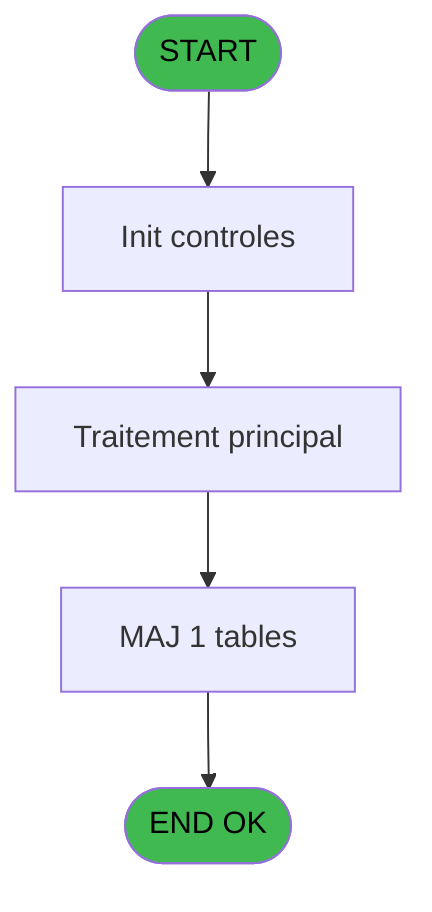
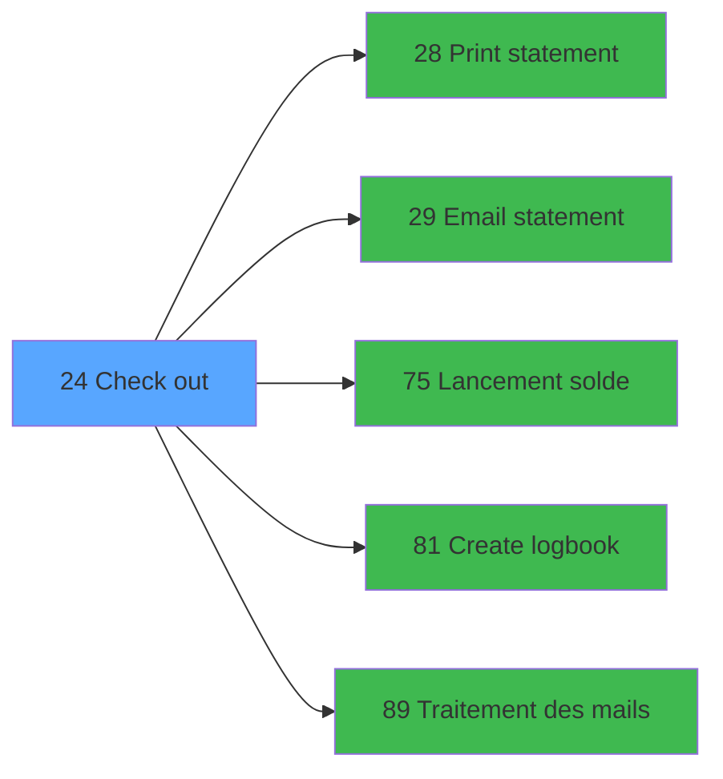

# WEL IDE 24 - Check out

> **Analyse**: Phases 1-4 2026-02-03 21:19 -> 21:19 (18s) | Assemblage 21:19
> **Pipeline**: V7.2 Enrichi
> **Structure**: 4 onglets (Resume | Ecrans | Donnees | Connexions)

<!-- TAB:Resume -->

## 1. FICHE D'IDENTITE

| Attribut | Valeur |
|----------|--------|
| Projet | WEL |
| IDE Position | 24 |
| Nom Programme | Check out |
| Fichier source | `Prg_24.xml` |
| Dossier IDE | Compte |
| Taches | 3 (0 ecrans visibles) |
| Tables modifiees | 1 |
| Programmes appeles | 5 |
| :warning: Statut | **ORPHELIN_POTENTIEL** |

## 2. DESCRIPTION FONCTIONNELLE

**Check out** assure la gestion complete de ce processus.

Le flux de traitement s'organise en **2 blocs fonctionnels** :

- **Traitement** (2 taches) : traitements metier divers
- **Validation** (1 tache) : controles et verifications de coherence

**Donnees modifiees** : 1 tables en ecriture (comptable________cte).

Detail : phases du traitement

#### Phase 1 : Traitement (2 taches)

- **24** - Check out
- **24.1** - Totalisation Account

Delegue a : [Email statement (IDE 29)](WEL-IDE-29.md), [Lancement solde (IDE 75)](WEL-IDE-75.md), [Traitement des mails (IDE 89)](WEL-IDE-89.md)

#### Phase 2 : Validation (1 tache)

- **24.2** - Verif solde

#### Tables impactees

| Table | Operations | Role metier |
|-------|-----------|-------------|
| comptable________cte | **W**/L (2 usages) |  |

## 3. BLOCS FONCTIONNELS

### 3.1 Traitement (2 taches)

Traitements internes.

---

#### 24 - Check out

**Role** : Traitement : Check out.
**Delegue a** : [Email statement (IDE 29)](WEL-IDE-29.md), [Lancement solde (IDE 75)](WEL-IDE-75.md), [Traitement des mails (IDE 89)](WEL-IDE-89.md)

---

#### 24.1 - Totalisation Account

**Role** : Traitement : Totalisation Account.
**Delegue a** : [Email statement (IDE 29)](WEL-IDE-29.md), [Lancement solde (IDE 75)](WEL-IDE-75.md), [Traitement des mails (IDE 89)](WEL-IDE-89.md)

### 3.2 Validation (1 tache)

Controles de coherence : 1 tache verifie les donnees et conditions.

---

#### 24.2 - Verif solde

**Role** : Verification : Verif solde.
**Variables liees** : H (V.Solde effectue)

## 5. REGLES METIER

*(Aucune regle metier identifiee)*

## 6. CONTEXTE

- **Appele par**: (aucun)
- **Appelle**: 5 programmes | **Tables**: 6 (W:1 R:2 L:4) | **Taches**: 3 | **Expressions**: 33

<!-- TAB:Ecrans -->

## 8. ECRANS

*(Programme sans ecran visible)*

## 9. NAVIGATION

### 9.3 Structure hierarchique (3 taches)

| Position | Tache | Type | Dimensions | Bloc |
|----------|-------|------|------------|------|
| **24.1** | [**Check out** (24)](#t1) | - | - | Traitement |
| 24.1.1 | [Totalisation Account (24.1)](#t2) | - | - | |
| **24.2** | [**Verif solde** (24.2)](#t3) | - | - | Validation |

### 9.4 Algorigramme

> **Legende**: Vert = START/END OK | Rouge = END KO | Bleu = Decisions
> *Algorigramme auto-genere. Utiliser `/algorigramme` pour une synthese metier detaillee.*

<!-- TAB:Donnees -->

## 10. TABLES

### Tables utilisees (6)

| ID | Nom | Description | Type | R | W | L | Usages |
|----|-----|-------------|------|---|---|---|--------|
| 39 | depot_garantie___dga | Depots et garanties | DB | R |   |   | 1 |
| 40 | comptable________cte |  | DB |   | **W** | L | 2 |
| 47 | compte_gm________cgm | Comptes GM (generaux) | DB | R |   |   | 1 |
| 268 | cc_total_par_type |  | DB |   |   | L | 1 |
| 285 | email |  | DB |   |   | L | 1 |
| 820 | Commentaire supprime |  | DB |   |   | L | 1 |

### Colonnes par table (3 / 3 tables avec colonnes identifiees)

Table 39 - depot_garantie___dga (R) - 1 usages

| Lettre | Variable | Acces | Type |
|--------|----------|-------|------|
| A | v0.ViewRefrech | R | Logical |
| B | v0.L_EMail | R | Logical |
| C | v.TotalVente | R | Numeric |
| D | v.TotalGistPass | R | Numeric |
| E | v.NbreLignes | R | Numeric |
| F | v.reponse | R | Numeric |
| G | v.NomPDF | R | Alpha |
| H | V.Solde effectue | R | Logical |

Table 40 - comptable________cte (**W**/L) - 2 usages

*Table utilisee uniquement en Link ou aucune colonne Real identifiee dans le DataView.*

Table 47 - compte_gm________cgm (R) - 1 usages

*Table utilisee uniquement en Link ou aucune colonne Real identifiee dans le DataView.*

## 11. VARIABLES

### 11.1 Variables de session (6)

Variables persistantes pendant toute la session.

| Lettre | Nom | Type | Usage dans |
|--------|-----|------|-----------|
| C | v.TotalVente | Numeric | - |
| D | v.TotalGistPass | Numeric | - |
| E | v.NbreLignes | Numeric | - |
| F | v.reponse | Numeric | - |
| G | v.NomPDF | Alpha | - |
| H | V.Solde effectue | Logical | - |

### 11.2 Autres (2)

Variables diverses.

| Lettre | Nom | Type | Usage dans |
|--------|-----|------|-----------|
| A | v0.ViewRefrech | Logical | 1x refs |
| B | v0.L_EMail | Logical | - |

## 12. EXPRESSIONS

**33 / 33 expressions decodees (100%)**

### 12.1 Repartition par type

| Type | Expressions | Regles |
|------|-------------|--------|
| CONCATENATION | 7 | 0 |
| CONSTANTE | 5 | 0 |
| CONDITION | 7 | 0 |
| REFERENCE_VG | 6 | 0 |
| OTHER | 5 | 0 |
| NEGATION | 2 | 0 |
| STRING | 1 | 0 |

### 12.2 Expressions cles par type

#### CONCATENATION (7 expressions)

| Type | IDE | Expression | Regle |
|------|-----|------------|-------|
| CONCATENATION | 27 | `ASCIIChr (13)&'PRINT'&ASCIIChr (13)&'INVOICE'` | - |
| CONCATENATION | 28 | `ASCIIChr (13)&'EMAIL'&ASCIIChr (13)&'INVOICE'` | - |
| CONCATENATION | 1 | `FileCopy(Translate ('%club_exportdata%')&'PDF\'&Trim([AL]),Translate ('%club_exportdata%')&'WELCOME\'&Trim([AL]))` | - |
| CONCATENATION | 26 | `ASCIIChr (13)&'CLOSE MY'&ASCIIChr (13)&'ACCOUNT'` | - |
| CONCATENATION | 11 | `MlsTrans ('CHECK OUT - '&Trim(VG3)&' '&Trim(VG4))` | - |
| ... | | *+2 autres* | |

#### CONSTANTE (5 expressions)

| Type | IDE | Expression | Regle |
|------|-----|------------|-------|
| CONSTANTE | 22 | `'ACCOUNT'` | - |
| CONSTANTE | 30 | `'%club_images%Retour.png'` | - |
| CONSTANTE | 17 | `'CHECK OUT'` | - |
| CONSTANTE | 8 | `'99'` | - |
| CONSTANTE | 10 | `'WELFACTURE'` | - |

#### CONDITION (7 expressions)

| Type | IDE | Expression | Regle |
|------|-----|------------|-------|
| CONDITION | 19 | `Trim([AG])=''` | - |
| CONDITION | 20 | `Trim([Z])<>'' AND [V] AND [AE]<>0` | - |
| CONDITION | 21 | `Trim([Z])<>'' AND [V]` | - |
| CONDITION | 18 | `Trim([Z])='' OR NOT [V]` | - |
| CONDITION | 2 | `[AJ]>0` | - |
| ... | | *+2 autres* | |

#### REFERENCE_VG (6 expressions)

| Type | IDE | Expression | Regle |
|------|-----|------------|-------|
| REFERENCE_VG | 6 | `VG29` | - |
| REFERENCE_VG | 7 | `VG30` | - |
| REFERENCE_VG | 33 | `VG5` | - |
| REFERENCE_VG | 3 | `VG5` | - |
| REFERENCE_VG | 4 | `VG9` | - |
| ... | | *+1 autres* | |

#### OTHER (5 expressions)

| Type | IDE | Expression | Regle |
|------|-----|------------|-------|
| OTHER | 16 | `MlsTrans ('Email sent')` | - |
| OTHER | 29 | `MlsTrans ('Call Open Check Out')` | - |
| OTHER | 15 | `MlsTrans ('The invoice is not yet generated !')` | - |
| OTHER | 12 | `MlsTrans ('Do you really want to close this account?')` | - |
| OTHER | 14 | `MlsTrans ('The email of this client is not known thank you to inform it to continue')` | - |

#### NEGATION (2 expressions)

| Type | IDE | Expression | Regle |
|------|-----|------------|-------|
| NEGATION | 31 | `NOT [AM]` | - |
| NEGATION | 23 | `NOT v0.ViewRefrech [A]` | - |

#### STRING (1 expressions)

| Type | IDE | Expression | Regle |
|------|-----|------------|-------|
| STRING | 32 | `Trim([P])` | - |

### 12.3 Toutes les expressions (33)

Voir les 33 expressions

#### CONCATENATION (7)

| IDE | Expression Decodee |
|-----|-------------------|
| 11 | `MlsTrans ('CHECK OUT - '&Trim(VG3)&' '&Trim(VG4))` |
| 24 | `ASCIIChr (13)&'PRINT'&ASCIIChr (13)&'STATEMENT'` |
| 25 | `ASCIIChr (13)&'EMAIL'&ASCIIChr (13)&'STATEMENT'` |
| 26 | `ASCIIChr (13)&'CLOSE MY'&ASCIIChr (13)&'ACCOUNT'` |
| 27 | `ASCIIChr (13)&'PRINT'&ASCIIChr (13)&'INVOICE'` |
| 28 | `ASCIIChr (13)&'EMAIL'&ASCIIChr (13)&'INVOICE'` |
| 1 | `FileCopy(Translate ('%club_exportdata%')&'PDF\'&Trim([AL]),Translate ('%club_exportdata%')&'WELCOME\'&Trim([AL]))` |

#### CONSTANTE (5)

| IDE | Expression Decodee |
|-----|-------------------|
| 8 | `'99'` |
| 10 | `'WELFACTURE'` |
| 17 | `'CHECK OUT'` |
| 22 | `'ACCOUNT'` |
| 30 | `'%club_images%Retour.png'` |

#### CONDITION (7)

| IDE | Expression Decodee |
|-----|-------------------|
| 2 | `[AJ]>0` |
| 13 | `[AK]=6` |
| 9 | `Trim([AL])<>''` |
| 18 | `Trim([Z])='' OR NOT [V]` |
| 19 | `Trim([AG])=''` |
| 20 | `Trim([Z])<>'' AND [V] AND [AE]<>0` |
| 21 | `Trim([Z])<>'' AND [V]` |

#### REFERENCE_VG (6)

| IDE | Expression Decodee |
|-----|-------------------|
| 3 | `VG5` |
| 4 | `VG9` |
| 5 | `VG10` |
| 6 | `VG29` |
| 7 | `VG30` |
| 33 | `VG5` |

#### OTHER (5)

| IDE | Expression Decodee |
|-----|-------------------|
| 12 | `MlsTrans ('Do you really want to close this account?')` |
| 14 | `MlsTrans ('The email of this client is not known thank you to inform it to continue')` |
| 15 | `MlsTrans ('The invoice is not yet generated !')` |
| 16 | `MlsTrans ('Email sent')` |
| 29 | `MlsTrans ('Call Open Check Out')` |

#### NEGATION (2)

| IDE | Expression Decodee |
|-----|-------------------|
| 23 | `NOT v0.ViewRefrech [A]` |
| 31 | `NOT [AM]` |

#### STRING (1)

| IDE | Expression Decodee |
|-----|-------------------|
| 32 | `Trim([P])` |

<!-- TAB:Connexions -->

## 13. GRAPHE D'APPELS

### 13.1 Chaine depuis Main (Callers)

**Chemin**: (pas de callers directs)

### 13.2 Callers

| IDE | Nom Programme | Nb Appels |
|-----|---------------|-----------|
| - | (aucun) | - |

### 13.3 Callees (programmes appeles)

### 13.4 Detail Callees avec contexte

| IDE | Nom Programme | Appels | Contexte |
|-----|---------------|--------|----------|
| [28](WEL-IDE-28.md) | Print statement | 1 | Impression ticket/document |
| [29](WEL-IDE-29.md) | Email statement | 1 | Sous-programme |
| [75](WEL-IDE-75.md) | Lancement solde | 1 | Verification solde |
| [81](WEL-IDE-81.md) | Create logbook | 1 | Sous-programme |
| [89](WEL-IDE-89.md) | Traitement des mails | 1 | Sous-programme |

## 14. RECOMMANDATIONS MIGRATION

### 14.1 Profil du programme

| Metrique | Valeur | Impact migration |
|----------|--------|-----------------|
| Lignes de logique | 94 | Programme compact |
| Expressions | 33 | Peu de logique |
| Tables WRITE | 1 | Impact faible |
| Sous-programmes | 5 | Peu de dependances |
| Ecrans visibles | 0 | Ecran unique ou traitement batch |
| Code desactive | 1.1% (1 / 94) | Code sain |
| Regles metier | 0 | Pas de regle identifiee |

### 14.2 Plan de migration par bloc

#### Traitement (2 taches: 0 ecran, 2 traitements)

- **Strategie** : 2 service(s) backend injectable(s) (Domain Services).
- 5 sous-programme(s) a migrer ou a reutiliser depuis les services existants.
- Decomposer les taches en services unitaires testables.

#### Validation (1 tache: 0 ecran, 1 traitement)

- **Strategie** : FluentValidation avec validators specifiques.
- Chaque tache de validation -> un validator injectable

### 14.3 Dependances critiques

| Dependance | Type | Appels | Impact |
|------------|------|--------|--------|
| comptable________cte | Table WRITE (Database) | 1x | Schema + repository |
| [Create logbook (IDE 81)](WEL-IDE-81.md) | Sous-programme | 1x | Normale - Sous-programme |
| [Traitement des mails (IDE 89)](WEL-IDE-89.md) | Sous-programme | 1x | Normale - Sous-programme |
| [Lancement solde (IDE 75)](WEL-IDE-75.md) | Sous-programme | 1x | Normale - Verification solde |
| [Print statement (IDE 28)](WEL-IDE-28.md) | Sous-programme | 1x | Normale - Impression ticket/document |
| [Email statement (IDE 29)](WEL-IDE-29.md) | Sous-programme | 1x | Normale - Sous-programme |

---
*Spec DETAILED generee par Pipeline V7.2 - 2026-02-03 21:19*
