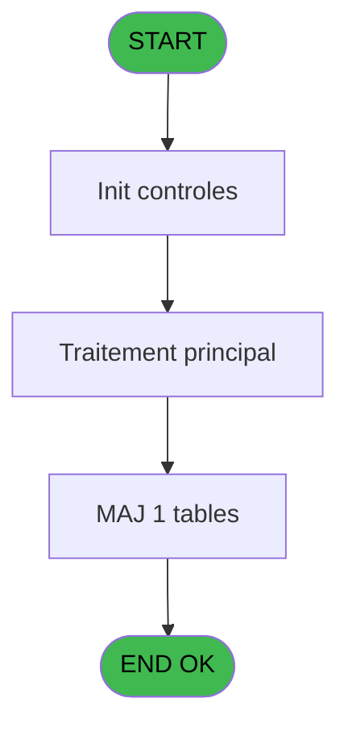
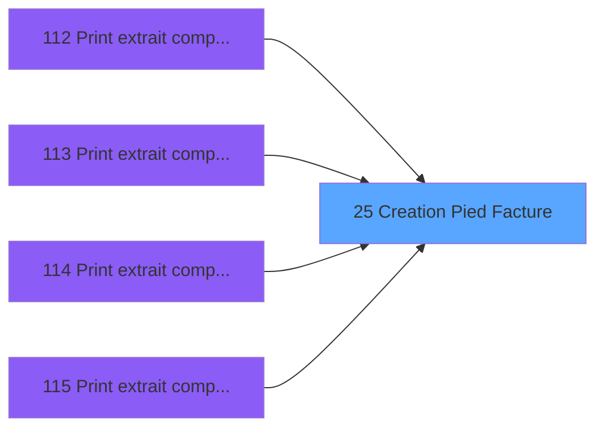

# WEL IDE 25 - Creation Pied Facture

> **Analyse**: Phases 1-4 2026-02-03 21:19 -> 21:19 (20s) | Assemblage 21:19
> **Pipeline**: V7.2 Enrichi
> **Structure**: 4 onglets (Resume | Ecrans | Donnees | Connexions)

<!-- TAB:Resume -->

## 1. FICHE D'IDENTITE

| Attribut | Valeur |
|----------|--------|
| Projet | WEL |
| IDE Position | 25 |
| Nom Programme | Creation Pied Facture |
| Fichier source | `Prg_25.xml` |
| Dossier IDE | Compte |
| Taches | 1 (0 ecrans visibles) |
| Tables modifiees | 1 |
| Programmes appeles | 0 |

## 2. DESCRIPTION FONCTIONNELLE

**Creation Pied Facture** assure la gestion complete de ce processus, accessible depuis [Print extrait compte /Imp (IDE 114)](WEL-IDE-114.md), [Print extrait compte /Nom (IDE 115)](WEL-IDE-115.md), [Print extrait compte /Date (IDE 112)](WEL-IDE-112.md), [Print extrait compte /Cum (IDE 113)](WEL-IDE-113.md).

Le flux de traitement s'organise en **1 blocs fonctionnels** :

- **Creation** (1 tache) : insertion d'enregistrements en base (mouvements, prestations)

**Donnees modifiees** : 1 tables en ecriture (Ventilation_Lg_Vente).

## 3. BLOCS FONCTIONNELS

### 3.1 Creation (1 tache)

Insertion de nouveaux enregistrements en base.

---

#### 25 - Creation Pied Facture [[ECRAN]](#ecran-t1)

**Role** : Creation d'enregistrement : Creation Pied Facture.
**Ecran** : 619 x 474 DLU | [Voir mockup](#ecran-t1)

## 5. REGLES METIER

*(Aucune regle metier identifiee)*

## 6. CONTEXTE

- **Appele par**: [Print extrait compte /Imp (IDE 114)](WEL-IDE-114.md), [Print extrait compte /Nom (IDE 115)](WEL-IDE-115.md), [Print extrait compte /Date (IDE 112)](WEL-IDE-112.md), [Print extrait compte /Cum (IDE 113)](WEL-IDE-113.md)
- **Appelle**: 0 programmes | **Tables**: 1 (W:1 R:0 L:0) | **Taches**: 1 | **Expressions**: 12

<!-- TAB:Ecrans -->

## 8. ECRANS

*(Programme sans ecran visible)*

## 9. NAVIGATION

### 9.3 Structure hierarchique (1 tache)

| Position | Tache | Type | Dimensions | Bloc |
|----------|-------|------|------------|------|
| **25.1** | [**Creation Pied Facture** (25)](#t1) [mockup](#ecran-t1) | - | 619x474 | Creation |

### 9.4 Algorigramme

> **Legende**: Vert = START/END OK | Rouge = END KO | Bleu = Decisions
> *Algorigramme auto-genere. Utiliser `/algorigramme` pour une synthese metier detaillee.*

<!-- TAB:Donnees -->

## 10. TABLES

### Tables utilisees (1)

| ID | Nom | Description | Type | R | W | L | Usages |
|----|-----|-------------|------|---|---|---|--------|
| 821 | Ventilation_Lg_Vente | Donnees de ventes | DB |   | **W** |   | 1 |

### Colonnes par table (1 / 1 tables avec colonnes identifiees)

Table 821 - Ventilation_Lg_Vente (**W**) - 1 usages

| Lettre | Variable | Acces | Type |
|--------|----------|-------|------|
| A | P.Societe | W | Alpha |
| B | P.Compte Gm | W | Numeric |
| C | P.Filiation | W | Numeric |
| D | P.Taux Tva | W | Numeric |
| E | P.Montant Ttc | W | Numeric |

## 11. VARIABLES

### 11.1 Parametres entrants (5)

Variables recues du programme appelant ([Print extrait compte /Imp (IDE 114)](WEL-IDE-114.md)).

| Lettre | Nom | Type | Usage dans |
|--------|-----|------|-----------|
| A | P.Societe | Alpha | 1x parametre entrant |
| B | P.Compte Gm | Numeric | 1x parametre entrant |
| C | P.Filiation | Numeric | 1x parametre entrant |
| D | P.Taux Tva | Numeric | 5x parametre entrant |
| E | P.Montant Ttc | Numeric | 6x parametre entrant |

## 12. EXPRESSIONS

**12 / 12 expressions decodees (100%)**

### 12.1 Repartition par type

| Type | Expressions | Regles |
|------|-------------|--------|
| CALCULATION | 4 | 0 |
| CALCUL | 2 | 0 |
| CONSTANTE | 1 | 0 |
| OTHER | 4 | 0 |
| STRING | 1 | 0 |

### 12.2 Expressions cles par type

#### CALCULATION (4 expressions)

| Type | IDE | Expression | Regle |
|------|-----|------------|-------|
| CALCULATION | 8 | `[N]+P.Montant Ttc [E]` | - |
| CALCULATION | 9 | `[W]+P.Montant Ttc [E]` | - |
| CALCULATION | 4 | `[L]+(P.Montant Ttc [E]/(1+P.Taux Tva [D]/100))` | - |
| CALCULATION | 5 | `[U]+(P.Montant Ttc [E]/(1+P.Taux Tva [D]/100))` | - |

#### CALCUL (2 expressions)

| Type | IDE | Expression | Regle |
|------|-----|------------|-------|
| CALCUL | 7 | `[V]+Round((P.Montant Ttc [E]/(1+P.Taux Tva [D]/100)*P.Taux Tva [D]/100),12,2)` | - |
| CALCUL | 6 | `[M]+Round((P.Montant Ttc [E]/(1+P.Taux Tva [D]/100)*P.Taux Tva [D]/100),12,2)` | - |

#### CONSTANTE (1 expressions)

| Type | IDE | Expression | Regle |
|------|-----|------------|-------|
| CONSTANTE | 3 | `999` | - |

#### OTHER (4 expressions)

| Type | IDE | Expression | Regle |
|------|-----|------------|-------|
| OTHER | 11 | `P.Compte Gm [B]` | - |
| OTHER | 12 | `P.Filiation [C]` | - |
| OTHER | 2 | `P.Taux Tva [D]` | - |
| OTHER | 10 | `P.Societe [A]` | - |

#### STRING (1 expressions)

| Type | IDE | Expression | Regle |
|------|-----|------------|-------|
| STRING | 1 | `Val(Fill('9',10),'10')` | - |

<!-- TAB:Connexions -->

## 13. GRAPHE D'APPELS

### 13.1 Chaine depuis Main (Callers)

Main -> ... -> [Print extrait compte /Imp (IDE 114)](WEL-IDE-114.md) -> **Creation Pied Facture (IDE 25)**

Main -> ... -> [Print extrait compte /Nom (IDE 115)](WEL-IDE-115.md) -> **Creation Pied Facture (IDE 25)**

Main -> ... -> [Print extrait compte /Date (IDE 112)](WEL-IDE-112.md) -> **Creation Pied Facture (IDE 25)**

Main -> ... -> [Print extrait compte /Cum (IDE 113)](WEL-IDE-113.md) -> **Creation Pied Facture (IDE 25)**

### 13.2 Callers

| IDE | Nom Programme | Nb Appels |
|-----|---------------|-----------|
| [114](WEL-IDE-114.md) | Print extrait compte /Imp | 2 |
| [115](WEL-IDE-115.md) | Print extrait compte /Nom | 2 |
| [112](WEL-IDE-112.md) | Print extrait compte /Date | 1 |
| [113](WEL-IDE-113.md) | Print extrait compte /Cum | 1 |

### 13.3 Callees (programmes appeles)

### 13.4 Detail Callees avec contexte

| IDE | Nom Programme | Appels | Contexte |
|-----|---------------|--------|----------|
| - | (aucun) | - | - |

## 14. RECOMMANDATIONS MIGRATION

### 14.1 Profil du programme

| Metrique | Valeur | Impact migration |
|----------|--------|-----------------|
| Lignes de logique | 39 | Programme compact |
| Expressions | 12 | Peu de logique |
| Tables WRITE | 1 | Impact faible |
| Sous-programmes | 0 | Peu de dependances |
| Ecrans visibles | 0 | Ecran unique ou traitement batch |
| Code desactive | 0% (0 / 39) | Code sain |
| Regles metier | 0 | Pas de regle identifiee |

### 14.2 Plan de migration par bloc

#### Creation (1 tache: 1 ecran, 0 traitement)

- **Strategie** : Repository pattern avec Entity Framework Core.
- Insertion via `IRepository<T>.CreateAsync()`

### 14.3 Dependances critiques

| Dependance | Type | Appels | Impact |
|------------|------|--------|--------|
| Ventilation_Lg_Vente | Table WRITE (Database) | 1x | Schema + repository |

---
*Spec DETAILED generee par Pipeline V7.2 - 2026-02-03 21:19*
