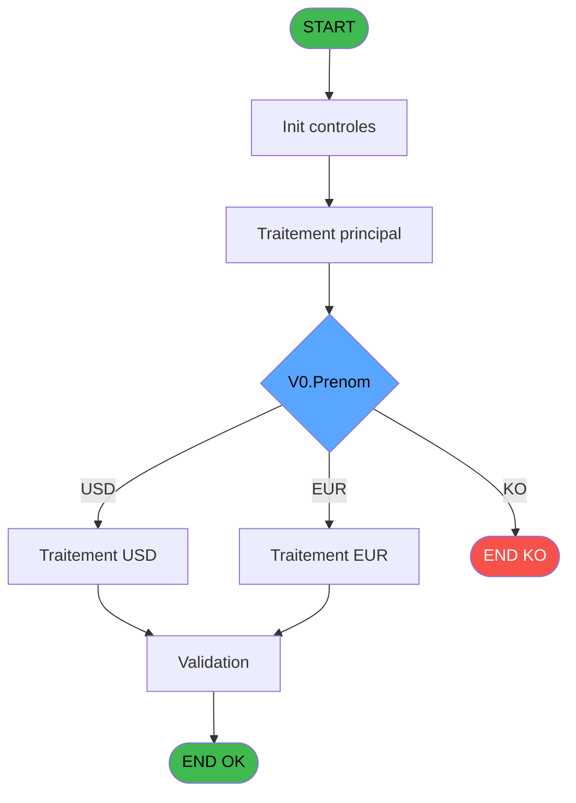
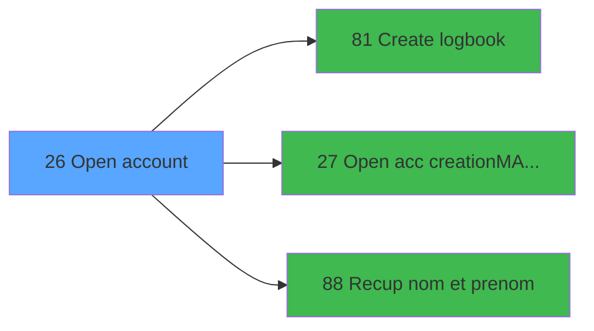

# WEL IDE 26 - Open account

> **Analyse**: Phases 1-4 2026-02-03 21:19 -> 21:20 (19s) | Assemblage 21:20
> **Pipeline**: V7.2 Enrichi
> **Structure**: 4 onglets (Resume | Ecrans | Donnees | Connexions)

<!-- TAB:Resume -->

## 1. FICHE D'IDENTITE

| Attribut | Valeur |
|----------|--------|
| Projet | WEL |
| IDE Position | 26 |
| Nom Programme | Open account |
| Fichier source | `Prg_26.xml` |
| Dossier IDE | Compte |
| Taches | 1 (0 ecrans visibles) |
| Tables modifiees | 0 |
| Programmes appeles | 3 |
| :warning: Statut | **ORPHELIN_POTENTIEL** |

## 2. DESCRIPTION FONCTIONNELLE

**Open account** assure la gestion complete de ce processus.

Le flux de traitement s'organise en **1 blocs fonctionnels** :

- **Traitement** (1 tache) : traitements metier divers

**Logique metier** : 1 regles identifiees couvrant conditions metier.

## 3. BLOCS FONCTIONNELS

### 3.1 Traitement (1 tache)

Traitements internes.

---

#### 26 - Open account

**Role** : Traitement : Open account.
**Delegue a** : [Open acc creation/MAJ garantie (IDE 27)](WEL-IDE-27.md), [Recup nom et prenom (IDE 88)](WEL-IDE-88.md)

## 5. REGLES METIER

1 regles identifiees:

### Autres (1 regles)

#### [RM-001] Si V0.Prenom [G]='USD' alors '$' sinon IF(V0.Prenom [G]='EUR','€',Trim(V0.Prenom [G])))

| Element | Detail |
|---------|--------|
| **Condition** | `V0.Prenom [G]='USD'` |
| **Si vrai** | '$' |
| **Si faux** | IF(V0.Prenom [G]='EUR','€',Trim(V0.Prenom [G]))) |
| **Variables** | G (V0.Prenom) |
| **Expression source** | Expression 7 : `IF(V0.Prenom [G]='USD','$',IF(V0.Prenom [G]='EUR','€',Trim(V` |
| **Exemple** | Si V0.Prenom [G]='USD' → '$'. Sinon → IF(V0.Prenom [G]='EUR','€',Trim(V0.Prenom [G]))) |

## 6. CONTEXTE

- **Appele par**: (aucun)
- **Appelle**: 3 programmes | **Tables**: 5 (W:0 R:1 L:4) | **Taches**: 1 | **Expressions**: 15

<!-- TAB:Ecrans -->

## 8. ECRANS

*(Programme sans ecran visible)*

## 9. NAVIGATION

### 9.3 Structure hierarchique (1 tache)

| Position | Tache | Type | Dimensions | Bloc |
|----------|-------|------|------------|------|
| **26.1** | [**Open account** (26)](#t1) | - | - | Traitement |

### 9.4 Algorigramme

> **Legende**: Vert = START/END OK | Rouge = END KO | Bleu = Decisions
> *Algorigramme auto-genere. Utiliser `/algorigramme` pour une synthese metier detaillee.*

<!-- TAB:Donnees -->

## 10. TABLES

### Tables utilisees (5)

| ID | Nom | Description | Type | R | W | L | Usages |
|----|-----|-------------|------|---|---|---|--------|
| 30 | gm-recherche_____gmr | Index de recherche | DB | R |   |   | 1 |
| 31 | gm-complet_______gmc |  | DB |   |   | L | 1 |
| 39 | depot_garantie___dga | Depots et garanties | DB |   |   | L | 1 |
| 47 | compte_gm________cgm | Comptes GM (generaux) | DB |   |   | L | 1 |
| 285 | email |  | DB |   |   | L | 1 |

### Colonnes par table (2 / 1 tables avec colonnes identifiees)

Table 30 - gm-recherche_____gmr (R) - 1 usages

| Lettre | Variable | Acces | Type |
|--------|----------|-------|------|
| A | v0.ViewRefrech | R | Logical |
| B | v.Garantie | R | Unicode |
| C | v.Montant | R | Numeric |
| D | v.Erreur | R | Logical |
| E | V0.Message erreur telephone | R | Alpha |
| F | V0.Nom | R | Alpha |
| G | V0.Prenom | R | Alpha |

## 11. VARIABLES

### 11.1 Variables de session (3)

Variables persistantes pendant toute la session.

| Lettre | Nom | Type | Usage dans |
|--------|-----|------|-----------|
| B | v.Garantie | Unicode | 1x session |
| C | v.Montant | Numeric | - |
| D | v.Erreur | Logical | - |

### 11.2 Autres (4)

Variables diverses.

| Lettre | Nom | Type | Usage dans |
|--------|-----|------|-----------|
| A | v0.ViewRefrech | Logical | 1x refs |
| E | V0.Message erreur telephone | Alpha | - |
| F | V0.Nom | Alpha | 1x refs |
| G | V0.Prenom | Alpha | 1x refs |

## 12. EXPRESSIONS

**15 / 15 expressions decodees (100%)**

### 12.1 Repartition par type

| Type | Expressions | Regles |
|------|-------------|--------|
| CONCATENATION | 1 | 0 |
| CONDITION | 1 | 5 |
| CONSTANTE | 2 | 0 |
| CAST_LOGIQUE | 1 | 0 |
| OTHER | 6 | 0 |
| NEGATION | 1 | 0 |
| REFERENCE_VG | 3 | 0 |

### 12.2 Expressions cles par type

#### CONCATENATION (1 expressions)

| Type | IDE | Expression | Regle |
|------|-----|------------|-------|
| CONCATENATION | 15 | `MlsTrans('OPEN ACCOUNT -')&' '&Trim([Z])&' '&Trim([AA])` | - |

#### CONDITION (1 expressions)

| Type | IDE | Expression | Regle |
|------|-----|------------|-------|
| CONDITION | 7 | `IF(V0.Prenom [G]='USD','$',IF(V0.Prenom [G]='EUR','€',Trim(V0.Prenom [G])))` | [RM-001](#rm-RM-001) |

#### CONSTANTE (2 expressions)

| Type | IDE | Expression | Regle |
|------|-----|------------|-------|
| CONSTANTE | 14 | `'%club_images%Retour.png'` | - |
| CONSTANTE | 11 | `'OPEN_ACC'` | - |

#### CAST_LOGIQUE (1 expressions)

| Type | IDE | Expression | Regle |
|------|-----|------------|-------|
| CAST_LOGIQUE | 1 | `'TRUE'LOG` | - |

#### OTHER (6 expressions)

| Type | IDE | Expression | Regle |
|------|-----|------------|-------|
| OTHER | 6 | `[H]` | - |
| OTHER | 12 | `MlsTrans ('Call Open Account')` | - |
| OTHER | 13 | `MlsTrans ('Validate Open Account')` | - |
| OTHER | 2 | `v.Garantie [B]` | - |
| OTHER | 4 | `ASCIIChr (13)&'VALIDATE'` | - |
| ... | | *+1 autres* | |

#### NEGATION (1 expressions)

| Type | IDE | Expression | Regle |
|------|-----|------------|-------|
| NEGATION | 3 | `NOT v0.ViewRefrech [A]` | - |

#### REFERENCE_VG (3 expressions)

| Type | IDE | Expression | Regle |
|------|-----|------------|-------|
| REFERENCE_VG | 10 | `VG10` | - |
| REFERENCE_VG | 9 | `VG9` | - |
| REFERENCE_VG | 8 | `VG5` | - |

<!-- TAB:Connexions -->

## 13. GRAPHE D'APPELS

### 13.1 Chaine depuis Main (Callers)

**Chemin**: (pas de callers directs)

### 13.2 Callers

| IDE | Nom Programme | Nb Appels |
|-----|---------------|-----------|
| - | (aucun) | - |

### 13.3 Callees (programmes appeles)

### 13.4 Detail Callees avec contexte

| IDE | Nom Programme | Appels | Contexte |
|-----|---------------|--------|----------|
| [81](WEL-IDE-81.md) | Create logbook | 2 | Sous-programme |
| [27](WEL-IDE-27.md) | Open acc creation/MAJ garantie | 1 | Mise a jour donnees |
| [88](WEL-IDE-88.md) | Recup nom et prenom | 1 | Recuperation donnees |

## 14. RECOMMANDATIONS MIGRATION

### 14.1 Profil du programme

| Metrique | Valeur | Impact migration |
|----------|--------|-----------------|
| Lignes de logique | 52 | Programme compact |
| Expressions | 15 | Peu de logique |
| Tables WRITE | 0 | Impact faible |
| Sous-programmes | 3 | Peu de dependances |
| Ecrans visibles | 0 | Ecran unique ou traitement batch |
| Code desactive | 0% (0 / 52) | Code sain |
| Regles metier | 1 | Quelques regles a preserver |

### 14.2 Plan de migration par bloc

#### Traitement (1 tache: 0 ecran, 1 traitement)

- **Strategie** : 1 service(s) backend injectable(s) (Domain Services).
- 3 sous-programme(s) a migrer ou a reutiliser depuis les services existants.
- Decomposer les taches en services unitaires testables.

### 14.3 Dependances critiques

| Dependance | Type | Appels | Impact |
|------------|------|--------|--------|
| [Create logbook (IDE 81)](WEL-IDE-81.md) | Sous-programme | 2x | Haute - Sous-programme |
| [Recup nom et prenom (IDE 88)](WEL-IDE-88.md) | Sous-programme | 1x | Normale - Recuperation donnees |
| [Open acc creation/MAJ garantie (IDE 27)](WEL-IDE-27.md) | Sous-programme | 1x | Normale - Mise a jour donnees |

---
*Spec DETAILED generee par Pipeline V7.2 - 2026-02-03 21:20*
