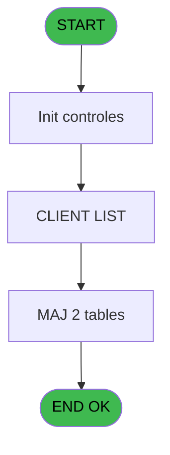
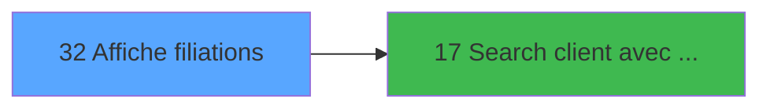

# WEL IDE 32 - Affiche filiations

> **Analyse**: Phases 1-4 2026-02-03 21:21 -> 21:22 (17s) | Assemblage 21:22
> **Pipeline**: V7.2 Enrichi
> **Structure**: 4 onglets (Resume | Ecrans | Donnees | Connexions)

<!-- TAB:Resume -->

## 1. FICHE D'IDENTITE

| Attribut | Valeur |
|----------|--------|
| Projet | WEL |
| IDE Position | 32 |
| Nom Programme | Affiche filiations |
| Fichier source | `Prg_32.xml` |
| Dossier IDE | Gestion |
| Taches | 6 (1 ecrans visibles) |
| Tables modifiees | 2 |
| Programmes appeles | 1 |

## 2. DESCRIPTION FONCTIONNELLE

**Affiche filiations** assure la gestion complete de ce processus, accessible depuis [Fusion/Separation (IDE 33)](WEL-IDE-33.md).

Le flux de traitement s'organise en **4 blocs fonctionnels** :

- **Traitement** (3 taches) : traitements metier divers
- **Calcul** (1 tache) : calculs de montants, stocks ou compteurs
- **Creation** (1 tache) : insertion d'enregistrements en base (mouvements, prestations)
- **Consultation** (1 tache) : ecrans de recherche, selection et consultation

**Donnees modifiees** : 2 tables en ecriture (compte_gm________cgm, histo_fusionseparation_saisie).

**Logique metier** : 1 regles identifiees couvrant conditions metier.

Detail : phases du traitement

#### Phase 1 : Consultation (1 tache)

- **32** - Affiche filiations

#### Phase 2 : Traitement (3 taches)

- **32.1** - supprime non pointes
- **32.3** - CLIENT LIST **[[ECRAN]](#ecran-t4)**
- **32.3.1** - Pontage pour fusion

Delegue a : [Search client avec liste (IDE 17)](WEL-IDE-17.md)

#### Phase 3 : Creation (1 tache)

- **32.2** - Creation histo

#### Phase 4 : Calcul (1 tache)

- **32.4** - Compte pointe

#### Tables impactees

| Table | Operations | Role metier |
|-------|-----------|-------------|
| histo_fusionseparation_saisie | R/**W**/L (5 usages) | Historique / journal |
| compte_gm________cgm | **W**/L (2 usages) | Comptes GM (generaux) |

## 3. BLOCS FONCTIONNELS

### 3.1 Consultation (1 tache)

Ecrans de recherche et consultation.

---

#### 32 - Affiche filiations

**Role** : Reinitialisation : Affiche filiations.

### 3.2 Traitement (3 taches)

Traitements internes.

---

#### 32.1 - supprime non pointes

**Role** : Traitement : supprime non pointes.
**Delegue a** : [Search client avec liste (IDE 17)](WEL-IDE-17.md)

---

#### 32.3 - CLIENT LIST [[ECRAN]](#ecran-t4)

**Role** : Traitement : CLIENT LIST.
**Ecran** : 641 x 591 DLU | [Voir mockup](#ecran-t4)
**Delegue a** : [Search client avec liste (IDE 17)](WEL-IDE-17.md)

---

#### 32.3.1 - Pontage pour fusion

**Role** : Traitement : Pontage pour fusion.
**Delegue a** : [Search client avec liste (IDE 17)](WEL-IDE-17.md)

### 3.3 Creation (1 tache)

Insertion de nouveaux enregistrements en base.

---

#### 32.2 - Creation histo

**Role** : Creation d'enregistrement : Creation histo.

### 3.4 Calcul (1 tache)

Calculs metier : montants, stocks, compteurs.

---

#### 32.4 - Compte pointe

**Role** : Traitement : Compte pointe.

## 5. REGLES METIER

1 regles identifiees:

### Autres (1 regles)

#### [RM-001] Si [O] alors '√' sinon ' ')

| Element | Detail |
|---------|--------|
| **Condition** | `[O]` |
| **Si vrai** | '√' |
| **Si faux** | ' ') |
| **Expression source** | Expression 6 : `IF([O],'√',' ')` |
| **Exemple** | Si [O] → '√'. Sinon → ' ') |

## 6. CONTEXTE

- **Appele par**: [Fusion/Separation (IDE 33)](WEL-IDE-33.md)
- **Appelle**: 1 programmes | **Tables**: 3 (W:2 R:2 L:2) | **Taches**: 6 | **Expressions**: 21

<!-- TAB:Ecrans -->

## 8. ECRANS

### 8.1 Forms visibles (1 / 6)

| # | Position | Tache | Nom | Type | Largeur | Hauteur | Bloc |
|---|----------|-------|-----|------|---------|---------|------|
| 1 | 32.3 | 32.3 | CLIENT LIST | Type0 | 641 | 591 | Traitement |

### 8.2 Mockups Ecrans

---

#### 32.3 - CLIENT LIST
**Tache** : [32.3](#t4) | **Type** : Type0 | **Dimensions** : 641 x 591 DLU
**Bloc** : Traitement | **Titre IDE** : CLIENT LIST

<!-- FORM-DATA:
{
    "width":  641,
    "vFactor":  8,
    "type":  "Type0",
    "hFactor":  4,
    "controls":  [
                     {
                         "x":  158,
                         "type":  "label",
                         "var":  "",
                         "y":  0,
                         "w":  202,
                         "fmt":  "",
                         "name":  "",
                         "h":  44,
                         "color":  "",
                         "text":  "LAST NAME",
                         "parent":  null
                     },
                     {
                         "x":  360,
                         "type":  "label",
                         "var":  "",
                         "y":  0,
                         "w":  205,
                         "fmt":  "",
                         "name":  "",
                         "h":  44,
                         "color":  "",
                         "text":  "FIRST NAME",
                         "parent":  null
                     },
                     {
                         "x":  9,
                         "type":  "label",
                         "var":  "",
                         "y":  57,
                         "w":  142,
                         "fmt":  "",
                         "name":  "",
                         "h":  49,
                         "color":  "",
                         "text":  "REMOVE \r\nFILIATION",
                         "parent":  null
                     },
                     {
                         "x":  23,
                         "type":  "label",
                         "var":  "",
                         "y":  126,
                         "w":  119,
                         "fmt":  "",
                         "name":  "GROUP",
                         "h":  71,
                         "color":  "214",
                         "text":  "\u003e\r\nRemove \u0026\r\nGroup",
                         "parent":  null
                     },
                     {
                         "x":  23,
                         "type":  "label",
                         "var":  "",
                         "y":  219,
                         "w":  119,
                         "fmt":  "",
                         "name":  "SPLIT",
                         "h":  71,
                         "color":  "214",
                         "text":  "\u003e\r\nRemove \u0026\r\nSplit",
                         "parent":  null
                     },
                     {
                         "x":  9,
                         "type":  "line",
                         "var":  "",
                         "y":  327,
                         "w":  142,
                         "fmt":  "",
                         "name":  "",
                         "h":  0,
                         "color":  "",
                         "text":  "",
                         "parent":  null
                     },
                     {
                         "x":  9,
                         "type":  "label",
                         "var":  "",
                         "y":  344,
                         "w":  142,
                         "fmt":  "",
                         "name":  "",
                         "h":  49,
                         "color":  "",
                         "text":  "ADD\r\nFILIATION",
                         "parent":  null
                     },
                     {
                         "x":  23,
                         "type":  "label",
                         "var":  "",
                         "y":  405,
                         "w":  119,
                         "fmt":  "",
                         "name":  "MERGE",
                         "h":  71,
                         "color":  "214",
                         "text":  "\r\n\u003c",
                         "parent":  null
                     },
                     {
                         "x":  159,
                         "type":  "table",
                         "var":  "",
                         "name":  "",
                         "titleH":  12,
                         "color":  "",
                         "w":  406,
                         "y":  44,
                         "fmt":  "",
                         "parent":  null,
                         "text":  "",
                         "rowH":  44,
                         "h":  530,
                         "cols":  [
                                      {
                                          "title":  "",
                                          "layer":  1,
                                          "w":  199
                                      },
                                      {
                                          "title":  "FIRST NAME",
                                          "layer":  2,
                                          "w":  200
                                      }
                                  ],
                         "rows":  2
                     },
                     {
                         "x":  565,
                         "type":  "button",
                         "var":  "",
                         "y":  0,
                         "w":  56,
                         "fmt":  "",
                         "name":  "",
                         "h":  288,
                         "color":  "",
                         "text":  "",
                         "parent":  null
                     },
                     {
                         "x":  163,
                         "type":  "edit",
                         "var":  "",
                         "y":  49,
                         "w":  194,
                         "fmt":  "",
                         "name":  "gmr_nom__30__0001",
                         "h":  36,
                         "color":  "",
                         "text":  "",
                         "parent":  10
                     },
                     {
                         "x":  363,
                         "type":  "edit",
                         "var":  "",
                         "y":  49,
                         "w":  197,
                         "fmt":  "",
                         "name":  "Prenom",
                         "h":  36,
                         "color":  "",
                         "text":  "",
                         "parent":  10
                     },
                     {
                         "x":  565,
                         "type":  "button",
                         "var":  "",
                         "y":  288,
                         "w":  56,
                         "fmt":  "",
                         "name":  "",
                         "h":  286,
                         "color":  "",
                         "text":  "",
                         "parent":  null
                     }
                 ],
    "taskId":  "32.3",
    "height":  591
}
-->

<strong>Champs : 2 champs</strong>

| Pos (x,y) | Nom | Variable | Type |
|-----------|-----|----------|------|
| 163,49 | gmr_nom__30__0001 | - | edit |
| 363,49 | Prenom | - | edit |

<strong>Boutons : 2 boutons</strong>

| Bouton | Pos (x,y) | Action |
|--------|-----------|--------|
| (sans nom) | 565,0 | Action declenchee |
| (sans nom) | 565,288 | Action declenchee |

## 9. NAVIGATION

Ecran unique: **CLIENT LIST**

### 9.3 Structure hierarchique (6 taches)

| Position | Tache | Type | Dimensions | Bloc |
|----------|-------|------|------------|------|
| **32.1** | [**Affiche filiations** (32)](#t1) | - | - | Consultation |
| **32.2** | [**supprime non pointes** (32.1)](#t2) | MDI | - | Traitement |
| 32.2.1 | [CLIENT LIST (32.3)](#t4) [mockup](#ecran-t4) | - | 641x591 | |
| 32.2.2 | [Pontage pour fusion (32.3.1)](#t5) | - | - | |
| **32.3** | [**Creation histo** (32.2)](#t3) | MDI | - | Creation |
| **32.4** | [**Compte pointe** (32.4)](#t6) | - | - | Calcul |

### 9.4 Algorigramme

> **Legende**: Vert = START/END OK | Rouge = END KO | Bleu = Decisions
> *Algorigramme auto-genere. Utiliser `/algorigramme` pour une synthese metier detaillee.*

<!-- TAB:Donnees -->

## 10. TABLES

### Tables utilisees (3)

| ID | Nom | Description | Type | R | W | L | Usages |
|----|-----|-------------|------|---|---|---|--------|
| 30 | gm-recherche_____gmr | Index de recherche | DB | R |   |   | 2 |
| 47 | compte_gm________cgm | Comptes GM (generaux) | DB |   | **W** | L | 2 |
| 343 | histo_fusionseparation_saisie | Historique / journal | DB | R | **W** | L | 5 |

### Colonnes par table (1 / 3 tables avec colonnes identifiees)

Table 30 - gm-recherche_____gmr (R) - 2 usages

*Table utilisee uniquement en Link ou aucune colonne Real identifiee dans le DataView.*

Table 47 - compte_gm________cgm (**W**/L) - 2 usages

*Table utilisee uniquement en Link ou aucune colonne Real identifiee dans le DataView.*

Table 343 - histo_fusionseparation_saisie (R/**W**/L) - 5 usages

| Lettre | Variable | Acces | Type |
|--------|----------|-------|------|
| A | P.Chrono | W | Numeric |
| B | P.Validation | W | Logical |
| C | P.Type E/F | W | Alpha |
| D | P.Type operation | W | Alpha |
| E | P.Type GO/GM | W | Alpha |
| F | v.Last Name | W | Alpha |
| G | v.First Name | W | Alpha |
| H | v.Room | W | Alpha |
| I | v.Reponse | W | Numeric |
| J | V0.Filtre nom | W | Alpha |
| K | V0.Filtre prenom | W | Alpha |
| L | V0.Refresh | W | Logical |
| M | V0.Nb enreg selectionne | W | Numeric |

## 11. VARIABLES

### 11.1 Parametres entrants (5)

Variables recues du programme appelant ([Fusion/Separation (IDE 33)](WEL-IDE-33.md)).

| Lettre | Nom | Type | Usage dans |
|--------|-----|------|-----------|
| A | P.Chrono | Numeric | 1x parametre entrant |
| B | P.Validation | Logical | - |
| C | P.Type E/F | Alpha | 6x parametre entrant |
| D | P.Type operation | Alpha | 1x parametre entrant |
| E | P.Type GO/GM | Alpha | - |

### 11.2 Variables de session (4)

Variables persistantes pendant toute la session.

| Lettre | Nom | Type | Usage dans |
|--------|-----|------|-----------|
| F | v.Last Name | Alpha | - |
| G | v.First Name | Alpha | - |
| H | v.Room | Alpha | - |
| I | v.Reponse | Numeric | - |

### 11.3 Autres (4)

Variables diverses.

| Lettre | Nom | Type | Usage dans |
|--------|-----|------|-----------|
| J | V0.Filtre nom | Alpha | - |
| K | V0.Filtre prenom | Alpha | - |
| L | V0.Refresh | Logical | - |
| M | V0.Nb enreg selectionne | Numeric | - |

## 12. EXPRESSIONS

**21 / 21 expressions decodees (100%)**

### 12.1 Repartition par type

| Type | Expressions | Regles |
|------|-------------|--------|
| CONCATENATION | 1 | 0 |
| CONDITION | 7 | 5 |
| CONSTANTE | 3 | 0 |
| OTHER | 4 | 0 |
| CAST_LOGIQUE | 4 | 0 |
| NEGATION | 2 | 0 |

### 12.2 Expressions cles par type

#### CONCATENATION (1 expressions)

| Type | IDE | Expression | Regle |
|------|-----|------------|-------|
| CONCATENATION | 1 | `'MANAGE FILIATIONS -'&' '&Trim(VG3)&' '&Trim(VG4)` | - |

#### CONDITION (7 expressions)

| Type | IDE | Expression | Regle |
|------|-----|------------|-------|
| CONDITION | 6 | `IF([O],'√',' ')` | [RM-001](#rm-RM-001) |
| CONDITION | 15 | `P.Type E/F [C]='F' AND [T]=0` | - |
| CONDITION | 17 | `P.Type E/F [C]<>''` | - |
| CONDITION | 18 | `P.Type E/F [C]='E' AND P.Type operation [D]='S' AND [T]=1` | - |
| CONDITION | 9 | `P.Type E/F [C]='E'` | - |
| ... | | *+2 autres* | |

#### CONSTANTE (3 expressions)

| Type | IDE | Expression | Regle |
|------|-----|------------|-------|
| CONSTANTE | 20 | `''` | - |
| CONSTANTE | 13 | `'E'` | - |
| CONSTANTE | 2 | `'%club_images%Retour.png'` | - |

#### OTHER (4 expressions)

| Type | IDE | Expression | Regle |
|------|-----|------------|-------|
| OTHER | 12 | `P.Chrono [A]` | - |
| OTHER | 16 | `ExpCalc('14'EXP) OR ExpCalc('15'EXP) OR ExpCalc('18'EXP)` | - |
| OTHER | 3 | `ASCIIChr(13)&MlsTrans('SEARCH CLIENT')` | - |
| OTHER | 4 | `ASCIIChr(13)&MlsTrans('VALIDATE')` | - |

#### CAST_LOGIQUE (4 expressions)

| Type | IDE | Expression | Regle |
|------|-----|------------|-------|
| CAST_LOGIQUE | 8 | `'FALSE'LOG` | - |
| CAST_LOGIQUE | 21 | `'TRUE'LOG` | - |
| CAST_LOGIQUE | 5 | `Rollback('FALSE'LOG,0)` | - |
| CAST_LOGIQUE | 7 | `'TRUE'LOG` | - |

#### NEGATION (2 expressions)

| Type | IDE | Expression | Regle |
|------|-----|------------|-------|
| NEGATION | 19 | `NOT [S]` | - |
| NEGATION | 11 | `NOT [O]` | - |

### 12.3 Toutes les expressions (21)

Voir les 21 expressions

#### CONCATENATION (1)

| IDE | Expression Decodee |
|-----|-------------------|
| 1 | `'MANAGE FILIATIONS -'&' '&Trim(VG3)&' '&Trim(VG4)` |

#### CONDITION (7)

| IDE | Expression Decodee |
|-----|-------------------|
| 6 | `IF([O],'√',' ')` |
| 9 | `P.Type E/F [C]='E'` |
| 10 | `P.Type E/F [C]='E' AND [Q]<>0` |
| 14 | `P.Type E/F [C]='E' AND [T]=0` |
| 15 | `P.Type E/F [C]='F' AND [T]=0` |
| 17 | `P.Type E/F [C]<>''` |
| 18 | `P.Type E/F [C]='E' AND P.Type operation [D]='S' AND [T]=1` |

#### CONSTANTE (3)

| IDE | Expression Decodee |
|-----|-------------------|
| 2 | `'%club_images%Retour.png'` |
| 13 | `'E'` |
| 20 | `''` |

#### OTHER (4)

| IDE | Expression Decodee |
|-----|-------------------|
| 3 | `ASCIIChr(13)&MlsTrans('SEARCH CLIENT')` |
| 4 | `ASCIIChr(13)&MlsTrans('VALIDATE')` |
| 12 | `P.Chrono [A]` |
| 16 | `ExpCalc('14'EXP) OR ExpCalc('15'EXP) OR ExpCalc('18'EXP)` |

#### CAST_LOGIQUE (4)

| IDE | Expression Decodee |
|-----|-------------------|
| 5 | `Rollback('FALSE'LOG,0)` |
| 7 | `'TRUE'LOG` |
| 8 | `'FALSE'LOG` |
| 21 | `'TRUE'LOG` |

#### NEGATION (2)

| IDE | Expression Decodee |
|-----|-------------------|
| 11 | `NOT [O]` |
| 19 | `NOT [S]` |

<!-- TAB:Connexions -->

## 13. GRAPHE D'APPELS

### 13.1 Chaine depuis Main (Callers)

Main -> ... -> [Fusion/Separation (IDE 33)](WEL-IDE-33.md) -> **Affiche filiations (IDE 32)**

### 13.2 Callers

| IDE | Nom Programme | Nb Appels |
|-----|---------------|-----------|
| [33](WEL-IDE-33.md) | Fusion/Separation | 1 |

### 13.3 Callees (programmes appeles)

### 13.4 Detail Callees avec contexte

| IDE | Nom Programme | Appels | Contexte |
|-----|---------------|--------|----------|
| [17](WEL-IDE-17.md) | Search client avec liste | 1 | Configuration impression |

## 14. RECOMMANDATIONS MIGRATION

### 14.1 Profil du programme

| Metrique | Valeur | Impact migration |
|----------|--------|-----------------|
| Lignes de logique | 150 | Programme compact |
| Expressions | 21 | Peu de logique |
| Tables WRITE | 2 | Impact faible |
| Sous-programmes | 1 | Peu de dependances |
| Ecrans visibles | 1 | Ecran unique ou traitement batch |
| Code desactive | 1.3% (2 / 150) | Code sain |
| Regles metier | 1 | Quelques regles a preserver |

### 14.2 Plan de migration par bloc

#### Consultation (1 tache: 0 ecran, 1 traitement)

- **Strategie** : Composants de recherche/selection en modales.

#### Traitement (3 taches: 1 ecran, 2 traitements)

- **Strategie** : Orchestrateur avec 1 ecrans (Razor/React) et 2 traitements backend (services).
- Les ecrans deviennent des composants UI, les traitements invisibles deviennent des services injectables.
- 1 sous-programme(s) a migrer ou a reutiliser depuis les services existants.
- Decomposer les taches en services unitaires testables.

#### Creation (1 tache: 0 ecran, 1 traitement)

- **Strategie** : Repository pattern avec Entity Framework Core.
- Insertion via `IRepository<T>.CreateAsync()`

#### Calcul (1 tache: 0 ecran, 1 traitement)

- **Strategie** : Services de calcul purs (Domain Services).
- Migrer la logique de calcul (stock, compteurs, montants)

### 14.3 Dependances critiques

| Dependance | Type | Appels | Impact |
|------------|------|--------|--------|
| compte_gm________cgm | Table WRITE (Database) | 1x | Schema + repository |
| histo_fusionseparation_saisie | Table WRITE (Database) | 2x | Schema + repository |
| [Search client avec liste (IDE 17)](WEL-IDE-17.md) | Sous-programme | 1x | Normale - Configuration impression |

---
*Spec DETAILED generee par Pipeline V7.2 - 2026-02-03 21:22*
