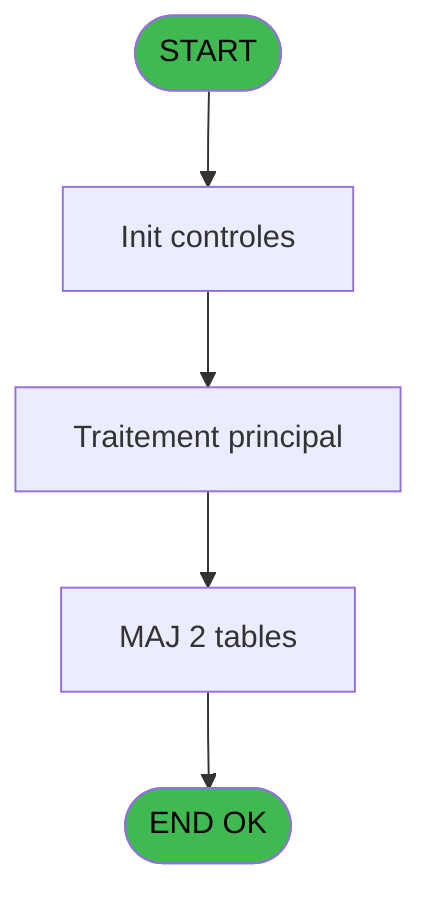
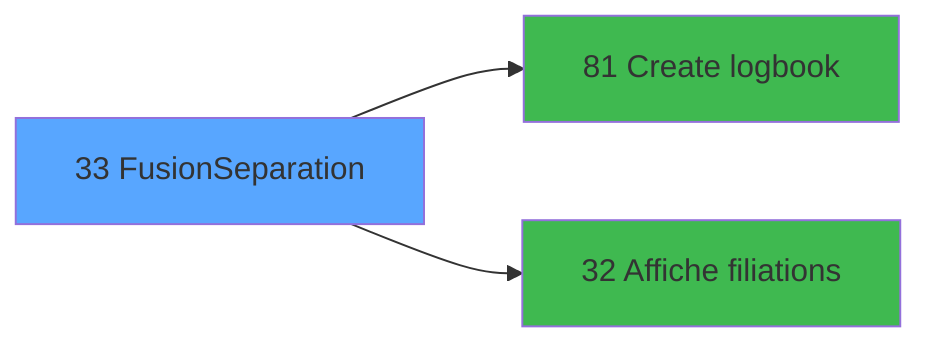

# WEL IDE 33 - Fusion/Separation

> **Analyse**: Phases 1-4 2026-02-03 21:22 -> 21:22 (18s) | Assemblage 21:22
> **Pipeline**: V7.2 Enrichi
> **Structure**: 4 onglets (Resume | Ecrans | Donnees | Connexions)

<!-- TAB:Resume -->

## 1. FICHE D'IDENTITE

| Attribut | Valeur |
|----------|--------|
| Projet | WEL |
| IDE Position | 33 |
| Nom Programme | Fusion/Separation |
| Fichier source | `Prg_33.xml` |
| Dossier IDE | Initialisations |
| Taches | 9 (0 ecrans visibles) |
| Tables modifiees | 2 |
| Programmes appeles | 2 |
| :warning: Statut | **ORPHELIN_POTENTIEL** |

## 2. DESCRIPTION FONCTIONNELLE

**Fusion/Separation** assure la gestion complete de ce processus.

Le flux de traitement s'organise en **5 blocs fonctionnels** :

- **Traitement** (4 taches) : traitements metier divers
- **Creation** (2 taches) : insertion d'enregistrements en base (mouvements, prestations)
- **Validation** (1 tache) : controles et verifications de coherence
- **Calcul** (1 tache) : calculs de montants, stocks ou compteurs
- **Consultation** (1 tache) : ecrans de recherche, selection et consultation

**Donnees modifiees** : 2 tables en ecriture (histo_fusionseparation, histo_fusionseparation_saisie).

Detail : phases du traitement

#### Phase 1 : Traitement (4 taches)

- **33** - Veuillez patienter... **[[ECRAN]](#ecran-t1)**
- **33.1** - Test si cloture en cours
- **33.2** - Test reseau
- **33.3.3** - Update entete histo

#### Phase 2 : Consultation (1 tache)

- **33.3** - Selection GM **[[ECRAN]](#ecran-t4)**

Delegue a : [Affiche filiations (IDE 32)](WEL-IDE-32.md)

#### Phase 3 : Creation (2 taches)

- **33.3.1** - creation histo v1
- **33.3.5** - creation histo v1

Delegue a : [Create logbook (IDE 81)](WEL-IDE-81.md)

#### Phase 4 : Calcul (1 tache)

- **33.3.2** - Delete compte F/E=blanc

#### Phase 5 : Validation (1 tache)

- **33.3.4** - Verify operation

#### Tables impactees

| Table | Operations | Role metier |
|-------|-----------|-------------|
| histo_fusionseparation | R/**W** (4 usages) | Historique / journal |
| histo_fusionseparation_saisie | **W** (1 usages) | Historique / journal |

## 3. BLOCS FONCTIONNELS

### 3.1 Traitement (4 taches)

Traitements internes.

---

#### 33 - Veuillez patienter... [[ECRAN]](#ecran-t1)

**Role** : Traitement : Veuillez patienter....
**Ecran** : 422 x 56 DLU (MDI) | [Voir mockup](#ecran-t1)

3 sous-taches directes

| Tache | Nom | Bloc |
|-------|-----|------|
| [33.1](#t2) | Test si cloture en cours | Traitement |
| [33.2](#t3) | Test reseau | Traitement |
| [33.3.3](#t7) | Update entete histo | Traitement |

---

#### 33.1 - Test si cloture en cours

**Role** : Verification : Test si cloture en cours.
**Variables liees** : E (V0.Cloture en cours)

---

#### 33.2 - Test reseau

**Role** : Verification : Test reseau.
**Variables liees** : B (V0 reseau)

---

#### 33.3.3 - Update entete histo

**Role** : Traitement : Update entete histo.
**Variables liees** : F (V0.Chrono histo)

### 3.2 Consultation (1 tache)

Ecrans de recherche et consultation.

---

#### 33.3 - Selection GM [[ECRAN]](#ecran-t4)

**Role** : Selection par l'operateur : Selection GM.
**Ecran** : 1035 x 272 DLU (MDI) | [Voir mockup](#ecran-t4)
**Delegue a** : [Affiche filiations (IDE 32)](WEL-IDE-32.md)

### 3.3 Creation (2 taches)

Insertion de nouveaux enregistrements en base.

---

#### 33.3.1 - creation histo v1

**Role** : Creation d'enregistrement : creation histo v1.
**Variables liees** : F (V0.Chrono histo)
**Delegue a** : [Create logbook (IDE 81)](WEL-IDE-81.md)

---

#### 33.3.5 - creation histo v1

**Role** : Creation d'enregistrement : creation histo v1.
**Variables liees** : F (V0.Chrono histo)
**Delegue a** : [Create logbook (IDE 81)](WEL-IDE-81.md)

### 3.4 Calcul (1 tache)

Calculs metier : montants, stocks, compteurs.

---

#### 33.3.2 - Delete compte F/E=blanc

**Role** : Traitement : Delete compte F/E=blanc.
**Variables liees** : D (V0 n° compteur)

### 3.5 Validation (1 tache)

Controles de coherence : 1 tache verifie les donnees et conditions.

---

#### 33.3.4 - Verify operation

**Role** : Verification : Verify operation.

## 5. REGLES METIER

*(Aucune regle metier identifiee)*

## 6. CONTEXTE

- **Appele par**: (aucun)
- **Appelle**: 2 programmes | **Tables**: 7 (W:2 R:4 L:2) | **Taches**: 9 | **Expressions**: 5

<!-- TAB:Ecrans -->

## 8. ECRANS

*(Programme sans ecran visible)*

## 9. NAVIGATION

### 9.3 Structure hierarchique (9 taches)

| Position | Tache | Type | Dimensions | Bloc |
|----------|-------|------|------------|------|
| **33.1** | [**Veuillez patienter...** (33)](#t1) [mockup](#ecran-t1) | MDI | 422x56 | Traitement |
| 33.1.1 | [Test si cloture en cours (33.1)](#t2) | MDI | - | |
| 33.1.2 | [Test reseau (33.2)](#t3) | MDI | - | |
| 33.1.3 | [Update entete histo (33.3.3)](#t7) | - | - | |
| **33.2** | [**Selection GM** (33.3)](#t4) [mockup](#ecran-t4) | MDI | 1035x272 | Consultation |
| **33.3** | [**creation histo v1** (33.3.1)](#t5) | MDI | - | Creation |
| 33.3.1 | [creation histo v1 (33.3.5)](#t11) | MDI | - | |
| **33.4** | [**Delete compte F/E=blanc** (33.3.2)](#t6) | - | - | Calcul |
| **33.5** | [**Verify operation** (33.3.4)](#t8) | - | - | Validation |

### 9.4 Algorigramme

> **Legende**: Vert = START/END OK | Rouge = END KO | Bleu = Decisions
> *Algorigramme auto-genere. Utiliser `/algorigramme` pour une synthese metier detaillee.*

<!-- TAB:Donnees -->

## 10. TABLES

### Tables utilisees (7)

| ID | Nom | Description | Type | R | W | L | Usages |
|----|-----|-------------|------|---|---|---|--------|
| 23 | reseau_cloture___rec | Donnees reseau/cloture | DB | R |   |   | 1 |
| 30 | gm-recherche_____gmr | Index de recherche | DB |   |   | L | 1 |
| 47 | compte_gm________cgm | Comptes GM (generaux) | DB | R |   |   | 2 |
| 69 | initialisation___ini |  | DB | R |   |   | 1 |
| 122 | unilateral_bilateral |  | DB |   |   | L | 1 |
| 340 | histo_fusionseparation | Historique / journal | DB | R | **W** |   | 4 |
| 343 | histo_fusionseparation_saisie | Historique / journal | DB |   | **W** |   | 1 |

### Colonnes par table (5 / 5 tables avec colonnes identifiees)

Table 23 - reseau_cloture___rec (R) - 1 usages

| Lettre | Variable | Acces | Type |
|--------|----------|-------|------|
| A | W1 fin tache | R | Alpha |
| B | W1 cloture en cours | R | Numeric |

Table 47 - compte_gm________cgm (R) - 2 usages

| Lettre | Variable | Acces | Type |
|--------|----------|-------|------|
| A | V1.Type F/E | R | Alpha |
| B | V1.Type operation | R | Alpha |
| C | V1.operation done | R | Logical |

Table 69 - initialisation___ini (R) - 1 usages

| Lettre | Variable | Acces | Type |
|--------|----------|-------|------|
| A | P.Refresh view | R | Logical |
| B | V0 reseau | R | Alpha |
| C | V0 validation | R | Logical |
| D | V0 n° compteur | R | Numeric |
| E | V0.Cloture en cours | R | Logical |
| F | V0.Chrono histo | R | Numeric |

Table 340 - histo_fusionseparation (R/**W**) - 4 usages

| Lettre | Variable | Acces | Type |
|--------|----------|-------|------|
| F | V0.Chrono histo | W | Numeric |

Table 343 - histo_fusionseparation_saisie (**W**) - 1 usages

| Lettre | Variable | Acces | Type |
|--------|----------|-------|------|
| F | V0.Chrono histo | W | Numeric |

## 11. VARIABLES

### 11.1 Parametres entrants (1)

Variables recues en parametre.

| Lettre | Nom | Type | Usage dans |
|--------|-----|------|-----------|
| A | P.Refresh view | Logical | 1x parametre entrant |

### 11.2 Autres (5)

Variables diverses.

| Lettre | Nom | Type | Usage dans |
|--------|-----|------|-----------|
| B | V0 reseau | Alpha | - |
| C | V0 validation | Logical | - |
| D | V0 n° compteur | Numeric | 1x refs |
| E | V0.Cloture en cours | Logical | - |
| F | V0.Chrono histo | Numeric | - |

## 12. EXPRESSIONS

**5 / 5 expressions decodees (100%)**

### 12.1 Repartition par type

| Type | Expressions | Regles |
|------|-------------|--------|
| CONSTANTE | 1 | 0 |
| CONDITION | 1 | 0 |
| NEGATION | 1 | 0 |
| REFERENCE_VG | 1 | 0 |
| OTHER | 1 | 0 |

### 12.2 Expressions cles par type

#### CONSTANTE (1 expressions)

| Type | IDE | Expression | Regle |
|------|-----|------------|-------|
| CONSTANTE | 4 | `'FILIATION'` | - |

#### CONDITION (1 expressions)

| Type | IDE | Expression | Regle |
|------|-----|------------|-------|
| CONDITION | 1 | `P.Refresh view [A]<>'R'` | - |

#### NEGATION (1 expressions)

| Type | IDE | Expression | Regle |
|------|-----|------------|-------|
| NEGATION | 2 | `NOT V0 n° compteur [D]` | - |

#### REFERENCE_VG (1 expressions)

| Type | IDE | Expression | Regle |
|------|-----|------------|-------|
| REFERENCE_VG | 3 | `VG5` | - |

#### OTHER (1 expressions)

| Type | IDE | Expression | Regle |
|------|-----|------------|-------|
| OTHER | 5 | `MlsTrans('Call manage filiation')` | - |

<!-- TAB:Connexions -->

## 13. GRAPHE D'APPELS

### 13.1 Chaine depuis Main (Callers)

**Chemin**: (pas de callers directs)

### 13.2 Callers

| IDE | Nom Programme | Nb Appels |
|-----|---------------|-----------|
| - | (aucun) | - |

### 13.3 Callees (programmes appeles)

### 13.4 Detail Callees avec contexte

| IDE | Nom Programme | Appels | Contexte |
|-----|---------------|--------|----------|
| [81](WEL-IDE-81.md) | Create logbook | 3 | Sous-programme |
| [32](WEL-IDE-32.md) | Affiche filiations | 1 | Affichage donnees |

## 14. RECOMMANDATIONS MIGRATION

### 14.1 Profil du programme

| Metrique | Valeur | Impact migration |
|----------|--------|-----------------|
| Lignes de logique | 132 | Programme compact |
| Expressions | 5 | Peu de logique |
| Tables WRITE | 2 | Impact faible |
| Sous-programmes | 2 | Peu de dependances |
| Ecrans visibles | 0 | Ecran unique ou traitement batch |
| Code desactive | 1.5% (2 / 132) | Code sain |
| Regles metier | 0 | Pas de regle identifiee |

### 14.2 Plan de migration par bloc

#### Traitement (4 taches: 1 ecran, 3 traitements)

- **Strategie** : Orchestrateur avec 1 ecrans (Razor/React) et 3 traitements backend (services).
- Les ecrans deviennent des composants UI, les traitements invisibles deviennent des services injectables.
- 2 sous-programme(s) a migrer ou a reutiliser depuis les services existants.
- Decomposer les taches en services unitaires testables.

#### Consultation (1 tache: 1 ecran, 0 traitement)

- **Strategie** : Composants de recherche/selection en modales.
- 1 ecran : Selection GM

#### Creation (2 taches: 0 ecran, 2 traitements)

- **Strategie** : Repository pattern avec Entity Framework Core.
- Insertion via `IRepository<T>.CreateAsync()`

#### Calcul (1 tache: 0 ecran, 1 traitement)

- **Strategie** : Services de calcul purs (Domain Services).
- Migrer la logique de calcul (stock, compteurs, montants)

#### Validation (1 tache: 0 ecran, 1 traitement)

- **Strategie** : FluentValidation avec validators specifiques.
- Chaque tache de validation -> un validator injectable

### 14.3 Dependances critiques

| Dependance | Type | Appels | Impact |
|------------|------|--------|--------|
| histo_fusionseparation | Table WRITE (Database) | 3x | Schema + repository |
| histo_fusionseparation_saisie | Table WRITE (Database) | 1x | Schema + repository |
| [Create logbook (IDE 81)](WEL-IDE-81.md) | Sous-programme | 3x | **CRITIQUE** - Sous-programme |
| [Affiche filiations (IDE 32)](WEL-IDE-32.md) | Sous-programme | 1x | Normale - Affichage donnees |

---
*Spec DETAILED generee par Pipeline V7.2 - 2026-02-03 21:22*
