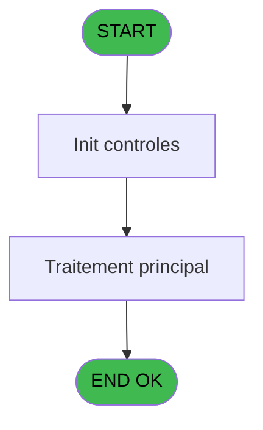
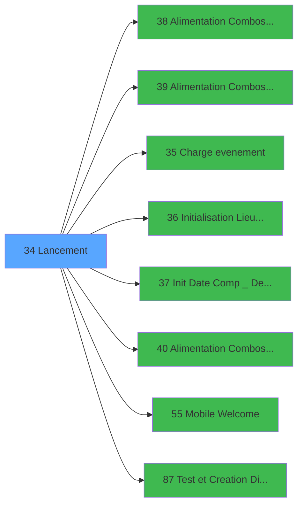

# WEL IDE 34 - Lancement

> **Analyse**: Phases 1-4 2026-02-03 21:22 -> 21:22 (17s) | Assemblage 21:22
> **Pipeline**: V7.2 Enrichi
> **Structure**: 4 onglets (Resume | Ecrans | Donnees | Connexions)

<!-- TAB:Resume -->

## 1. FICHE D'IDENTITE

| Attribut | Valeur |
|----------|--------|
| Projet | WEL |
| IDE Position | 34 |
| Nom Programme | Lancement |
| Fichier source | `Prg_34.xml` |
| Dossier IDE | Initialisations |
| Taches | 1 (0 ecrans visibles) |
| Tables modifiees | 0 |
| Programmes appeles | 8 |

## 2. DESCRIPTION FONCTIONNELLE

**Lancement** assure la gestion complete de ce processus, accessible depuis [Main Program (IDE 1)](WEL-IDE-1.md).

Le flux de traitement s'organise en **1 blocs fonctionnels** :

- **Traitement** (1 tache) : traitements metier divers

## 3. BLOCS FONCTIONNELS

### 3.1 Traitement (1 tache)

Traitements internes.

---

#### 34 - Lancement

**Role** : Traitement : Lancement.
**Delegue a** : [  Alimentation Combos VILLAGE (IDE 38)](WEL-IDE-38.md), [  Alimentation Combos PARIS 1 (IDE 39)](WEL-IDE-39.md), [Charge evenement (IDE 35)](WEL-IDE-35.md)

## 5. REGLES METIER

*(Aucune regle metier identifiee)*

## 6. CONTEXTE

- **Appele par**: [Main Program (IDE 1)](WEL-IDE-1.md)
- **Appelle**: 8 programmes | **Tables**: 4 (W:0 R:1 L:3) | **Taches**: 1 | **Expressions**: 42

<!-- TAB:Ecrans -->

## 8. ECRANS

*(Programme sans ecran visible)*

## 9. NAVIGATION

### 9.3 Structure hierarchique (1 tache)

| Position | Tache | Type | Dimensions | Bloc |
|----------|-------|------|------------|------|
| **34.1** | [**Lancement** (34)](#t1) | - | - | Traitement |

### 9.4 Algorigramme

> **Legende**: Vert = START/END OK | Rouge = END KO | Bleu = Decisions
> *Algorigramme auto-genere. Utiliser `/algorigramme` pour une synthese metier detaillee.*

<!-- TAB:Donnees -->

## 10. TABLES

### Tables utilisees (4)

| ID | Nom | Description | Type | R | W | L | Usages |
|----|-----|-------------|------|---|---|---|--------|
| 677 | parametres_caisse | Sessions de caisse | DB |   |   | L | 1 |
| 698 | droit_par_utilisateurs | Droits operateur | DB |   |   | L | 1 |
| 703 | groupe___________grp |  | DB | R |   |   | 1 |
| 718 | utilisateur______uti |  | DB |   |   | L | 1 |

### Colonnes par table (1 / 1 tables avec colonnes identifiees)

Table 703 - groupe___________grp (R) - 1 usages

| Lettre | Variable | Acces | Type |
|--------|----------|-------|------|
| A | v.Ctr | R | Numeric |
| B | V.Retour ADH ? | R | Logical |

## 11. VARIABLES

### 11.1 Variables de session (2)

Variables persistantes pendant toute la session.

| Lettre | Nom | Type | Usage dans |
|--------|-----|------|-----------|
| A | v.Ctr | Numeric | - |
| B | V.Retour ADH ? | Logical | - |

## 12. EXPRESSIONS

**42 / 42 expressions decodees (100%)**

### 12.1 Repartition par type

| Type | Expressions | Regles |
|------|-------------|--------|
| CONSTANTE | 33 | 0 |
| OTHER | 6 | 0 |
| REFERENCE_VG | 2 | 0 |
| CONDITION | 1 | 0 |

### 12.2 Expressions cles par type

#### CONSTANTE (33 expressions)

| Type | IDE | Expression | Regle |
|------|-----|------------|-------|
| CONSTANTE | 32 | `'CVVUES'` | - |
| CONSTANTE | 31 | `'VVUES'` | - |
| CONSTANTE | 34 | `'CTETAG'` | - |
| CONSTANTE | 33 | `'TETAG'` | - |
| CONSTANTE | 28 | `'CVLOGE'` | - |
| ... | | *+28 autres* | |

#### OTHER (6 expressions)

| Type | IDE | Expression | Regle |
|------|-----|------------|-------|
| OTHER | 18 | `DbDel('{915,4}'DSOURCE,'')` | - |
| OTHER | 19 | `[G]` | - |
| OTHER | 23 | `[R]` | - |
| OTHER | 10 | `[C]` | - |
| OTHER | 11 | `[D]` | - |
| ... | | *+1 autres* | |

#### REFERENCE_VG (2 expressions)

| Type | IDE | Expression | Regle |
|------|-----|------------|-------|
| REFERENCE_VG | 21 | `VG15` | - |
| REFERENCE_VG | 15 | `VG15` | - |

#### CONDITION (1 expressions)

| Type | IDE | Expression | Regle |
|------|-----|------------|-------|
| CONDITION | 20 | `Trim([M])='A'` | - |

### 12.3 Toutes les expressions (42)

Voir les 42 expressions

#### CONSTANTE (33)

| IDE | Expression Decodee |
|-----|-------------------|
| 1 | `'C'` |
| 2 | `'ANG'` |
| 3 | `'G'` |
| 4 | `'HOME'` |
| 5 | `'FEX'` |
| 6 | `'1.00'` |
| 7 | `'2.00'` |
| 8 | `'CCO'` |
| 9 | `'CAISSE'` |
| 12 | `'VRL'` |
| 13 | `'TRA'` |
| 14 | `'C'` |
| 17 | `'CHA'` |
| 22 | `'CAISSEADH'` |
| 24 | `'SUPERVISOR'` |
| 25 | `'ACCESALL'` |
| 26 | `'VLOGE'` |
| 27 | `2` |
| 28 | `'CVLOGE'` |
| 29 | `'VBATI'` |
| 30 | `'CVBATI'` |
| 31 | `'VVUES'` |
| 32 | `'CVVUES'` |
| 33 | `'TETAG'` |
| 34 | `'CTETAG'` |
| 35 | `'TORIE'` |
| 36 | `'CTORIE'` |
| 37 | `'VENSE'` |
| 38 | `3` |
| 39 | `'CVENSE'` |
| 40 | `'TCOMM'` |
| 41 | `6` |
| 42 | `'CTCOMM'` |

#### OTHER (6)

| IDE | Expression Decodee |
|-----|-------------------|
| 10 | `[C]` |
| 11 | `[D]` |
| 16 | `[G]` |
| 18 | `DbDel('{915,4}'DSOURCE,'')` |
| 19 | `[G]` |
| 23 | `[R]` |

#### REFERENCE_VG (2)

| IDE | Expression Decodee |
|-----|-------------------|
| 15 | `VG15` |
| 21 | `VG15` |

#### CONDITION (1)

| IDE | Expression Decodee |
|-----|-------------------|
| 20 | `Trim([M])='A'` |

<!-- TAB:Connexions -->

## 13. GRAPHE D'APPELS

### 13.1 Chaine depuis Main (Callers)

Main -> ... -> [Main Program (IDE 1)](WEL-IDE-1.md) -> **Lancement (IDE 34)**

### 13.2 Callers

| IDE | Nom Programme | Nb Appels |
|-----|---------------|-----------|
| [1](WEL-IDE-1.md) | Main Program | 1 |

### 13.3 Callees (programmes appeles)

### 13.4 Detail Callees avec contexte

| IDE | Nom Programme | Appels | Contexte |
|-----|---------------|--------|----------|
| [38](WEL-IDE-38.md) |   Alimentation Combos VILLAGE | 4 | Sous-programme |
| [39](WEL-IDE-39.md) |   Alimentation Combos PARIS 1 | 2 | Sous-programme |
| [35](WEL-IDE-35.md) | Charge evenement | 1 | Sous-programme |
| [36](WEL-IDE-36.md) | Initialisation Lieu Sejour | 1 | Reinitialisation |
| [37](WEL-IDE-37.md) | Init Date Comp _ Devise | 1 | Reinitialisation |
| [40](WEL-IDE-40.md) |   Alimentation Combos PARIS 2 | 1 | Sous-programme |
| [55](WEL-IDE-55.md) | Mobile Welcome | 1 | Sous-programme |
| [87](WEL-IDE-87.md) | Test et Creation Directory | 1 | Sous-programme |

## 14. RECOMMANDATIONS MIGRATION

### 14.1 Profil du programme

| Metrique | Valeur | Impact migration |
|----------|--------|-----------------|
| Lignes de logique | 63 | Programme compact |
| Expressions | 42 | Peu de logique |
| Tables WRITE | 0 | Impact faible |
| Sous-programmes | 8 | Dependances moderees |
| Ecrans visibles | 0 | Ecran unique ou traitement batch |
| Code desactive | 1.6% (1 / 63) | Code sain |
| Regles metier | 0 | Pas de regle identifiee |

### 14.2 Plan de migration par bloc

#### Traitement (1 tache: 0 ecran, 1 traitement)

- **Strategie** : 1 service(s) backend injectable(s) (Domain Services).
- 8 sous-programme(s) a migrer ou a reutiliser depuis les services existants.
- Decomposer les taches en services unitaires testables.

### 14.3 Dependances critiques

| Dependance | Type | Appels | Impact |
|------------|------|--------|--------|
| [  Alimentation Combos VILLAGE (IDE 38)](WEL-IDE-38.md) | Sous-programme | 4x | **CRITIQUE** - Sous-programme |
| [  Alimentation Combos PARIS 1 (IDE 39)](WEL-IDE-39.md) | Sous-programme | 2x | Haute - Sous-programme |
| [  Alimentation Combos PARIS 2 (IDE 40)](WEL-IDE-40.md) | Sous-programme | 1x | Normale - Sous-programme |
| [Mobile Welcome (IDE 55)](WEL-IDE-55.md) | Sous-programme | 1x | Normale - Sous-programme |
| [Test et Creation Directory (IDE 87)](WEL-IDE-87.md) | Sous-programme | 1x | Normale - Sous-programme |
| [Charge evenement (IDE 35)](WEL-IDE-35.md) | Sous-programme | 1x | Normale - Sous-programme |
| [Initialisation Lieu Sejour (IDE 36)](WEL-IDE-36.md) | Sous-programme | 1x | Normale - Reinitialisation |
| [Init Date Comp _ Devise (IDE 37)](WEL-IDE-37.md) | Sous-programme | 1x | Normale - Reinitialisation |

---
*Spec DETAILED generee par Pipeline V7.2 - 2026-02-03 21:22*
