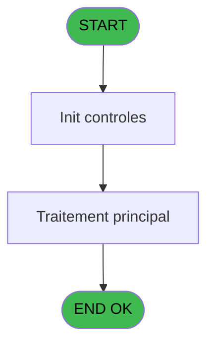

# WEL IDE 35 - Charge evenement

> **Analyse**: Phases 1-4 2026-02-03 21:23 -> 21:23 (18s) | Assemblage 21:23
> **Pipeline**: V7.2 Enrichi
> **Structure**: 4 onglets (Resume | Ecrans | Donnees | Connexions)

<!-- TAB:Resume -->

## 1. FICHE D'IDENTITE

| Attribut | Valeur |
|----------|--------|
| Projet | WEL |
| IDE Position | 35 |
| Nom Programme | Charge evenement |
| Fichier source | `Prg_35.xml` |
| Dossier IDE | Initialisations |
| Taches | 1 (0 ecrans visibles) |
| Tables modifiees | 0 |
| Programmes appeles | 1 |

## 2. DESCRIPTION FONCTIONNELLE

**Charge evenement** assure la gestion complete de ce processus, accessible depuis [Lancement (IDE 34)](WEL-IDE-34.md).

Le flux de traitement s'organise en **1 blocs fonctionnels** :

- **Traitement** (1 tache) : traitements metier divers

**Logique metier** : 1 regles identifiees couvrant conditions metier.

## 3. BLOCS FONCTIONNELS

### 3.1 Traitement (1 tache)

Traitements internes.

---

#### 35 - Import -- EVENEMEN [[ECRAN]](#ecran-t1)

**Role** : Traitement : Import -- EVENEMEN.
**Ecran** : 473 x 195 DLU | [Voir mockup](#ecran-t1)

## 5. REGLES METIER

1 regles identifiees:

### Autres (1 regles)

#### [RM-001] Si VG64 OR VG65 alors 'O' sinon 'N')

| Element | Detail |
|---------|--------|
| **Condition** | `VG64 OR VG65` |
| **Si vrai** | 'O' |
| **Si faux** | 'N') |
| **Expression source** | Expression 9 : `IF(VG64 OR VG65,'O','N')` |
| **Exemple** | Si VG64 OR VG65 → 'O'. Sinon → 'N') |

## 6. CONTEXTE

- **Appele par**: [Lancement (IDE 34)](WEL-IDE-34.md)
- **Appelle**: 1 programmes | **Tables**: 2 (W:0 R:1 L:1) | **Taches**: 1 | **Expressions**: 10

<!-- TAB:Ecrans -->

## 8. ECRANS

*(Programme sans ecran visible)*

## 9. NAVIGATION

### 9.3 Structure hierarchique (1 tache)

| Position | Tache | Type | Dimensions | Bloc |
|----------|-------|------|------------|------|
| **35.1** | [**Import -- EVENEMEN** (35)](#t1) [mockup](#ecran-t1) | - | 473x195 | Traitement |

### 9.4 Algorigramme

> **Legende**: Vert = START/END OK | Rouge = END KO | Bleu = Decisions
> *Algorigramme auto-genere. Utiliser `/algorigramme` pour une synthese metier detaillee.*

<!-- TAB:Donnees -->

## 10. TABLES

### Tables utilisees (2)

| ID | Nom | Description | Type | R | W | L | Usages |
|----|-----|-------------|------|---|---|---|--------|
| 914 | import_resort_credit | Resort Credit | DB | R |   |   | 1 |
| 915 | web_api_cashup |  | DB |   |   | L | 1 |

### Colonnes par table (0 / 1 tables avec colonnes identifiees)

Table 914 - import_resort_credit (R) - 1 usages

*Table utilisee uniquement en Link ou aucune colonne Real identifiee dans le DataView.*

## 11. VARIABLES

*(Programme sans variables locales mappees)*

## 12. EXPRESSIONS

**10 / 10 expressions decodees (100%)**

### 12.1 Repartition par type

| Type | Expressions | Regles |
|------|-------------|--------|
| CONDITION | 4 | 5 |
| CONSTANTE | 1 | 0 |
| OTHER | 5 | 0 |

### 12.2 Expressions cles par type

#### CONDITION (4 expressions)

| Type | IDE | Expression | Regle |
|------|-----|------------|-------|
| CONDITION | 9 | `IF(VG64 OR VG65,'O','N')` | [RM-001](#rm-RM-001) |
| CONDITION | 7 | `Trim([L])<>''` | - |
| CONDITION | 10 | `[L]='AD'` | - |
| CONDITION | 8 | `[L]<>'AD'` | - |

#### CONSTANTE (1 expressions)

| Type | IDE | Expression | Regle |
|------|-----|------------|-------|
| CONSTANTE | 1 | `'O'` | - |

#### OTHER (5 expressions)

| Type | IDE | Expression | Regle |
|------|-----|------------|-------|
| OTHER | 5 | `[D]` | - |
| OTHER | 6 | `[J]` | - |
| OTHER | 4 | `[C]` | - |
| OTHER | 2 | `V0.Accord suite [A]` | - |
| OTHER | 3 | `[B]` | - |

<!-- TAB:Connexions -->

## 13. GRAPHE D'APPELS

### 13.1 Chaine depuis Main (Callers)

Main -> ... -> [Lancement (IDE 34)](WEL-IDE-34.md) -> **Charge evenement (IDE 35)**

### 13.2 Callers

| IDE | Nom Programme | Nb Appels |
|-----|---------------|-----------|
| [34](WEL-IDE-34.md) | Lancement | 1 |

### 13.3 Callees (programmes appeles)

### 13.4 Detail Callees avec contexte

| IDE | Nom Programme | Appels | Contexte |
|-----|---------------|--------|----------|
| [86](WEL-IDE-86.md) | Verification Aut sans ecran | 1 | Controle/validation |

## 14. RECOMMANDATIONS MIGRATION

### 14.1 Profil du programme

| Metrique | Valeur | Impact migration |
|----------|--------|-----------------|
| Lignes de logique | 26 | Programme compact |
| Expressions | 10 | Peu de logique |
| Tables WRITE | 0 | Impact faible |
| Sous-programmes | 1 | Peu de dependances |
| Ecrans visibles | 0 | Ecran unique ou traitement batch |
| Code desactive | 0% (0 / 26) | Code sain |
| Regles metier | 1 | Quelques regles a preserver |

### 14.2 Plan de migration par bloc

#### Traitement (1 tache: 1 ecran, 0 traitement)

- **Strategie** : 1 composant(s) UI (Razor/React) avec formulaires et validation.
- 1 sous-programme(s) a migrer ou a reutiliser depuis les services existants.
- Decomposer les taches en services unitaires testables.

### 14.3 Dependances critiques

| Dependance | Type | Appels | Impact |
|------------|------|--------|--------|
| [Verification Aut sans ecran (IDE 86)](WEL-IDE-86.md) | Sous-programme | 1x | Normale - Controle/validation |

---
*Spec DETAILED generee par Pipeline V7.2 - 2026-02-03 21:23*
