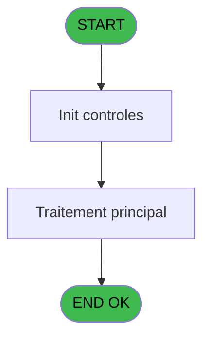

# WEL IDE 36 - Initialisation Lieu Sejour

> **Analyse**: Phases 1-4 2026-02-03 21:23 -> 21:23 (16s) | Assemblage 21:23
> **Pipeline**: V7.2 Enrichi
> **Structure**: 4 onglets (Resume | Ecrans | Donnees | Connexions)

<!-- TAB:Resume -->

## 1. FICHE D'IDENTITE

| Attribut | Valeur |
|----------|--------|
| Projet | WEL |
| IDE Position | 36 |
| Nom Programme | Initialisation Lieu Sejour |
| Fichier source | `Prg_36.xml` |
| Dossier IDE | Initialisations |
| Taches | 7 (0 ecrans visibles) |
| Tables modifiees | 0 |
| Programmes appeles | 0 |

## 2. DESCRIPTION FONCTIONNELLE

**Initialisation Lieu Sejour** assure la gestion complete de ce processus, accessible depuis [Lancement (IDE 34)](WEL-IDE-34.md).

Le flux de traitement s'organise en **2 blocs fonctionnels** :

- **Traitement** (6 taches) : traitements metier divers
- **Calcul** (1 tache) : calculs de montants, stocks ou compteurs

Detail : phases du traitement

#### Phase 1 : Traitement (6 taches)

- **36** - (sans nom)
- **36.2** - Lieu General
- **36.3** - Lieu General
- **36.4** - Alimenattion combo
- **36.4.1** - Suppression car interdits
- **36.5** - Lieu defaut

#### Phase 2 : Calcul (1 tache)

- **36.1** - Comptage Lieu Sejour **[[ECRAN]](#ecran-t2)**

## 3. BLOCS FONCTIONNELS

### 3.1 Traitement (6 taches)

Traitements internes.

---

#### 36 - (sans nom)

**Role** : Tache d'orchestration : point d'entree du programme (6 sous-taches). Coordonne l'enchainement des traitements.

5 sous-taches directes

| Tache | Nom | Bloc |
|-------|-----|------|
| [36.2](#t3) | Lieu General | Traitement |
| [36.3](#t4) | Lieu General | Traitement |
| [36.4](#t5) | Alimenattion combo | Traitement |
| [36.4.1](#t6) | Suppression car interdits | Traitement |
| [36.5](#t7) | Lieu defaut | Traitement |

---

#### 36.2 - Lieu General

**Role** : Traitement : Lieu General.
**Variables liees** : A (V0.Nombre Lieu Sejour), B (V0.Code Lieu Sejour)

---

#### 36.3 - Lieu General

**Role** : Traitement : Lieu General.
**Variables liees** : A (V0.Nombre Lieu Sejour), B (V0.Code Lieu Sejour)

---

#### 36.4 - Alimenattion combo

**Role** : Traitement : Alimenattion combo.

---

#### 36.4.1 - Suppression car interdits

**Role** : Traitement : Suppression car interdits.

---

#### 36.5 - Lieu defaut

**Role** : Traitement : Lieu defaut.
**Variables liees** : A (V0.Nombre Lieu Sejour), B (V0.Code Lieu Sejour)

### 3.2 Calcul (1 tache)

Calculs metier : montants, stocks, compteurs.

---

#### 36.1 - Comptage Lieu Sejour [[ECRAN]](#ecran-t2)

**Role** : Traitement : Comptage Lieu Sejour.
**Ecran** : 120 x 195 DLU | [Voir mockup](#ecran-t2)
**Variables liees** : A (V0.Nombre Lieu Sejour), B (V0.Code Lieu Sejour)

## 5. REGLES METIER

*(Aucune regle metier identifiee)*

## 6. CONTEXTE

- **Appele par**: [Lancement (IDE 34)](WEL-IDE-34.md)
- **Appelle**: 0 programmes | **Tables**: 2 (W:0 R:2 L:1) | **Taches**: 7 | **Expressions**: 3

<!-- TAB:Ecrans -->

## 8. ECRANS

*(Programme sans ecran visible)*

## 9. NAVIGATION

### 9.3 Structure hierarchique (7 taches)

| Position | Tache | Type | Dimensions | Bloc |
|----------|-------|------|------------|------|
| **36.1** | [**(sans nom)** (36)](#t1) | MDI | - | Traitement |
| 36.1.1 | [Lieu General (36.2)](#t3) | MDI | - | |
| 36.1.2 | [Lieu General (36.3)](#t4) | MDI | - | |
| 36.1.3 | [Alimenattion combo (36.4)](#t5) | - | - | |
| 36.1.4 | [Suppression car interdits (36.4.1)](#t6) | - | - | |
| 36.1.5 | [Lieu defaut (36.5)](#t7) | - | - | |
| **36.2** | [**Comptage Lieu Sejour** (36.1)](#t2) [mockup](#ecran-t2) | - | 120x195 | Calcul |

### 9.4 Algorigramme

> **Legende**: Vert = START/END OK | Rouge = END KO | Bleu = Decisions
> *Algorigramme auto-genere. Utiliser `/algorigramme` pour une synthese metier detaillee.*

<!-- TAB:Donnees -->

## 10. TABLES

### Tables utilisees (2)

| ID | Nom | Description | Type | R | W | L | Usages |
|----|-----|-------------|------|---|---|---|--------|
| 81 | societe__________soc |  | DB | R |   |   | 1 |
| 118 | tables_imports |  | DB | R |   | L | 4 |

### Colonnes par table (0 / 2 tables avec colonnes identifiees)

Table 81 - societe__________soc (R) - 1 usages

*Table utilisee uniquement en Link ou aucune colonne Real identifiee dans le DataView.*

Table 118 - tables_imports (R/L) - 4 usages

*Table utilisee uniquement en Link ou aucune colonne Real identifiee dans le DataView.*

## 11. VARIABLES

### 11.1 Autres (3)

Variables diverses.

| Lettre | Nom | Type | Usage dans |
|--------|-----|------|-----------|
| A | V0.Nombre Lieu Sejour | Numeric | [36.1](#t2), [36.2](#t3), [36.3](#t4) |
| B | V0.Code Lieu Sejour | Alpha | [36.1](#t2), [36.2](#t3), [36.3](#t4) |
| C | V0.Nom Import | Alpha | - |

## 12. EXPRESSIONS

**3 / 3 expressions decodees (100%)**

### 12.1 Repartition par type

| Type | Expressions | Regles |
|------|-------------|--------|
| CONDITION | 2 | 0 |
| OTHER | 1 | 0 |

### 12.2 Expressions cles par type

#### CONDITION (2 expressions)

| Type | IDE | Expression | Regle |
|------|-----|------------|-------|
| CONDITION | 2 | `V0.Nombre Lieu Sejour [A]>0` | - |
| CONDITION | 1 | `V0.Nombre Lieu Sejour [A]=0` | - |

#### OTHER (1 expressions)

| Type | IDE | Expression | Regle |
|------|-----|------------|-------|
| OTHER | 3 | `V0.Code Lieu Sejour [B]` | - |

<!-- TAB:Connexions -->

## 13. GRAPHE D'APPELS

### 13.1 Chaine depuis Main (Callers)

Main -> ... -> [Lancement (IDE 34)](WEL-IDE-34.md) -> **Initialisation Lieu Sejour (IDE 36)**

### 13.2 Callers

| IDE | Nom Programme | Nb Appels |
|-----|---------------|-----------|
| [34](WEL-IDE-34.md) | Lancement | 1 |

### 13.3 Callees (programmes appeles)

### 13.4 Detail Callees avec contexte

| IDE | Nom Programme | Appels | Contexte |
|-----|---------------|--------|----------|
| - | (aucun) | - | - |

## 14. RECOMMANDATIONS MIGRATION

### 14.1 Profil du programme

| Metrique | Valeur | Impact migration |
|----------|--------|-----------------|
| Lignes de logique | 48 | Programme compact |
| Expressions | 3 | Peu de logique |
| Tables WRITE | 0 | Impact faible |
| Sous-programmes | 0 | Peu de dependances |
| Ecrans visibles | 0 | Ecran unique ou traitement batch |
| Code desactive | 0% (0 / 48) | Code sain |
| Regles metier | 0 | Pas de regle identifiee |

### 14.2 Plan de migration par bloc

#### Traitement (6 taches: 0 ecran, 6 traitements)

- **Strategie** : 6 service(s) backend injectable(s) (Domain Services).
- Decomposer les taches en services unitaires testables.

#### Calcul (1 tache: 1 ecran, 0 traitement)

- **Strategie** : Services de calcul purs (Domain Services).
- Migrer la logique de calcul (stock, compteurs, montants)

### 14.3 Dependances critiques

| Dependance | Type | Appels | Impact |
|------------|------|--------|--------|

---
*Spec DETAILED generee par Pipeline V7.2 - 2026-02-03 21:23*
