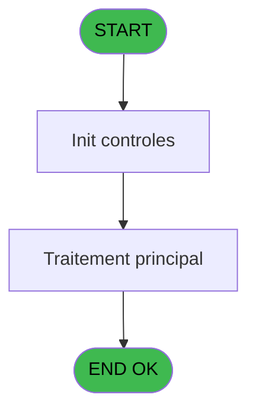

# WEL IDE 37 - Init Date Comp _ Devise

> **Analyse**: Phases 1-4 2026-02-03 21:23 -> 21:24 (17s) | Assemblage 21:24
> **Pipeline**: V7.2 Enrichi
> **Structure**: 4 onglets (Resume | Ecrans | Donnees | Connexions)

<!-- TAB:Resume -->

## 1. FICHE D'IDENTITE

| Attribut | Valeur |
|----------|--------|
| Projet | WEL |
| IDE Position | 37 |
| Nom Programme | Init Date Comp _ Devise |
| Fichier source | `Prg_37.xml` |
| Dossier IDE | Initialisations |
| Taches | 1 (0 ecrans visibles) |
| Tables modifiees | 0 |
| Programmes appeles | 0 |

## 2. DESCRIPTION FONCTIONNELLE

**Init Date Comp _ Devise** assure la gestion complete de ce processus, accessible depuis [Lancement (IDE 34)](WEL-IDE-34.md).

Le flux de traitement s'organise en **1 blocs fonctionnels** :

- **Traitement** (1 tache) : traitements metier divers

**Logique metier** : 2 regles identifiees couvrant conditions metier.

## 3. BLOCS FONCTIONNELS

### 3.1 Traitement (1 tache)

Traitements internes.

---

#### 37 - MESSAGES

**Role** : Traitement : MESSAGES.

## 5. REGLES METIER

2 regles identifiees:

### Autres (2 regles)

#### [RM-001] Si [F] alors [B] sinon '01/01/1900'DATE)

| Element | Detail |
|---------|--------|
| **Condition** | `[F]` |
| **Si vrai** | [B] |
| **Si faux** | '01/01/1900'DATE) |
| **Expression source** | Expression 5 : `IF ([F],[B],'01/01/1900'DATE)` |
| **Exemple** | Si [F] → [B]. Sinon → '01/01/1900'DATE) |

#### [RM-002] Traitement si [J] est non nul

| Element | Detail |
|---------|--------|
| **Condition** | `[J]<>0` |
| **Si vrai** | 'N11.'&Trim(Str([J] |
| **Si faux** | '#'))&'CZ','N13CZ') |
| **Expression source** | Expression 11 : `IF([J]<>0,'N11.'&Trim(Str([J],'#'))&'CZ','N13CZ')` |
| **Exemple** | Si [J]<>0 → 'N11.'&Trim(Str([J]. Sinon → '#'))&'CZ','N13CZ') |

## 6. CONTEXTE

- **Appele par**: [Lancement (IDE 34)](WEL-IDE-34.md)
- **Appelle**: 0 programmes | **Tables**: 3 (W:0 R:1 L:2) | **Taches**: 1 | **Expressions**: 13

<!-- TAB:Ecrans -->

## 8. ECRANS

*(Programme sans ecran visible)*

## 9. NAVIGATION

### 9.3 Structure hierarchique (1 tache)

| Position | Tache | Type | Dimensions | Bloc |
|----------|-------|------|------------|------|
| **37.1** | [**MESSAGES** (37)](#t1) | - | - | Traitement |

### 9.4 Algorigramme

> **Legende**: Vert = START/END OK | Rouge = END KO | Bleu = Decisions
> *Algorigramme auto-genere. Utiliser `/algorigramme` pour une synthese metier detaillee.*

<!-- TAB:Donnees -->

## 10. TABLES

### Tables utilisees (3)

| ID | Nom | Description | Type | R | W | L | Usages |
|----|-----|-------------|------|---|---|---|--------|
| 26 | comptes_speciaux_spc | Comptes GM (generaux) | DB |   |   | L | 1 |
| 69 | initialisation___ini |  | DB |   |   | L | 1 |
| 70 | date_comptable___dat |  | DB | R |   |   | 1 |

### Colonnes par table (0 / 1 tables avec colonnes identifiees)

Table 70 - date_comptable___dat (R) - 1 usages

*Table utilisee uniquement en Link ou aucune colonne Real identifiee dans le DataView.*

## 11. VARIABLES

*(Programme sans variables locales mappees)*

## 12. EXPRESSIONS

**13 / 13 expressions decodees (100%)**

### 12.1 Repartition par type

| Type | Expressions | Regles |
|------|-------------|--------|
| CONDITION | 3 | 2 |
| REFERENCE_VG | 3 | 0 |
| OTHER | 7 | 0 |

### 12.2 Expressions cles par type

#### CONDITION (3 expressions)

| Type | IDE | Expression | Regle |
|------|-----|------------|-------|
| CONDITION | 11 | `IF([J]<>0,'N11.'&Trim(Str([J],'#'))&'CZ','N13CZ')` | [RM-002](#rm-RM-002) |
| CONDITION | 5 | `IF ([F],[B],'01/01/1900'DATE)` | [RM-001](#rm-RM-001) |
| CONDITION | 6 | `IF ([F],[B],'01/01/2900'DATE)` | - |

#### REFERENCE_VG (3 expressions)

| Type | IDE | Expression | Regle |
|------|-----|------------|-------|
| REFERENCE_VG | 3 | `VG10` | - |
| REFERENCE_VG | 2 | `VG9` | - |
| REFERENCE_VG | 1 | `VG5` | - |

#### OTHER (7 expressions)

| Type | IDE | Expression | Regle |
|------|-----|------------|-------|
| OTHER | 10 | `[H]` | - |
| OTHER | 12 | `[K]` | - |
| OTHER | 13 | `[L]` | - |
| OTHER | 9 | `[G]` | - |
| OTHER | 4 | `EmptyDataview(0)` | - |
| ... | | *+2 autres* | |

<!-- TAB:Connexions -->

## 13. GRAPHE D'APPELS

### 13.1 Chaine depuis Main (Callers)

Main -> ... -> [Lancement (IDE 34)](WEL-IDE-34.md) -> **Init Date Comp _ Devise (IDE 37)**

### 13.2 Callers

| IDE | Nom Programme | Nb Appels |
|-----|---------------|-----------|
| [34](WEL-IDE-34.md) | Lancement | 1 |

### 13.3 Callees (programmes appeles)

### 13.4 Detail Callees avec contexte

| IDE | Nom Programme | Appels | Contexte |
|-----|---------------|--------|----------|
| - | (aucun) | - | - |

## 14. RECOMMANDATIONS MIGRATION

### 14.1 Profil du programme

| Metrique | Valeur | Impact migration |
|----------|--------|-----------------|
| Lignes de logique | 28 | Programme compact |
| Expressions | 13 | Peu de logique |
| Tables WRITE | 0 | Impact faible |
| Sous-programmes | 0 | Peu de dependances |
| Ecrans visibles | 0 | Ecran unique ou traitement batch |
| Code desactive | 0% (0 / 28) | Code sain |
| Regles metier | 2 | Quelques regles a preserver |

### 14.2 Plan de migration par bloc

#### Traitement (1 tache: 0 ecran, 1 traitement)

- **Strategie** : 1 service(s) backend injectable(s) (Domain Services).
- Decomposer les taches en services unitaires testables.

### 14.3 Dependances critiques

| Dependance | Type | Appels | Impact |
|------------|------|--------|--------|

---
*Spec DETAILED generee par Pipeline V7.2 - 2026-02-03 21:24*
