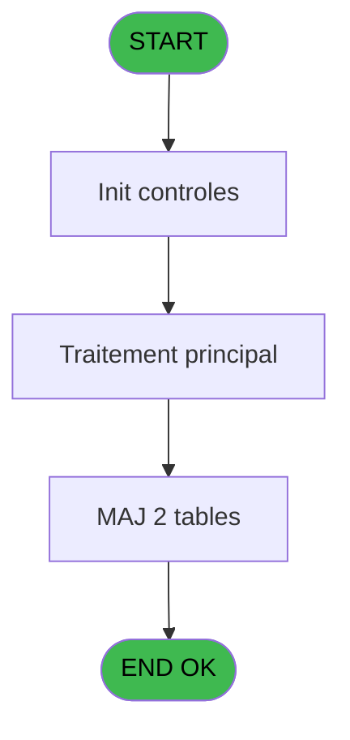
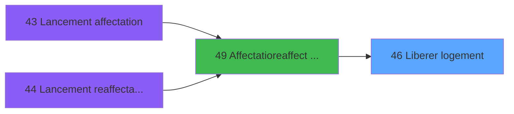
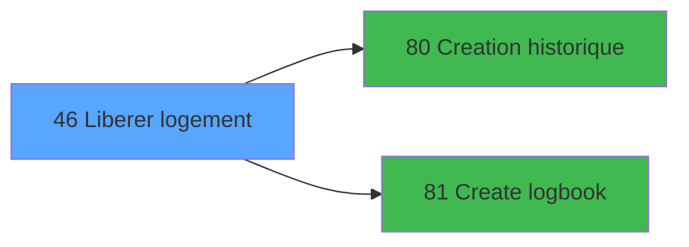

# WEL IDE 46 - Liberer logement

> **Analyse**: Phases 1-4 2026-02-03 21:27 -> 21:27 (18s) | Assemblage 21:28
> **Pipeline**: V7.2 Enrichi
> **Structure**: 4 onglets (Resume | Ecrans | Donnees | Connexions)

<!-- TAB:Resume -->

## 1. FICHE D'IDENTITE

| Attribut | Valeur |
|----------|--------|
| Projet | WEL |
| IDE Position | 46 |
| Nom Programme | Liberer logement |
| Fichier source | `Prg_46.xml` |
| Dossier IDE | Logement |
| Taches | 4 (0 ecrans visibles) |
| Tables modifiees | 2 |
| Programmes appeles | 2 |

## 2. DESCRIPTION FONCTIONNELLE

**Liberer logement** assure la gestion complete de ce processus, accessible depuis [Affectatio/reaffect logement (IDE 49)](WEL-IDE-49.md).

Le flux de traitement s'organise en **1 blocs fonctionnels** :

- **Traitement** (4 taches) : traitements metier divers

**Donnees modifiees** : 2 tables en ecriture (hebergement______heb, gm_chambres).

Detail : phases du traitement

#### Phase 1 : Traitement (4 taches)

- **46** - Liberer logement
- **46.1** - Efface blocage
- **46.2** - Efface chambre
- **46.3** - Liberation hebergement

#### Tables impactees

| Table | Operations | Role metier |
|-------|-----------|-------------|
| hebergement______heb | **W**/L (3 usages) | Hebergement (chambres) |
| gm_chambres | **W** (1 usages) |  |

## 3. BLOCS FONCTIONNELS

### 3.1 Traitement (4 taches)

Traitements internes.

---

#### 46 - Liberer logement

**Role** : Traitement : Liberer logement.

3 sous-taches directes

| Tache | Nom | Bloc |
|-------|-----|------|
| [46.1](#t2) | Efface blocage | Traitement |
| [46.2](#t3) | Efface chambre | Traitement |
| [46.3](#t4) | Liberation hebergement | Traitement |

---

#### 46.1 - Efface blocage

**Role** : Traitement : Efface blocage.

---

#### 46.2 - Efface chambre

**Role** : Traitement : Efface chambre.

---

#### 46.3 - Liberation hebergement

**Role** : Traitement : Liberation hebergement.

## 5. REGLES METIER

*(Aucune regle metier identifiee)*

## 6. CONTEXTE

- **Appele par**: [Affectatio/reaffect logement (IDE 49)](WEL-IDE-49.md)
- **Appelle**: 2 programmes | **Tables**: 3 (W:2 R:1 L:1) | **Taches**: 4 | **Expressions**: 18

<!-- TAB:Ecrans -->

## 8. ECRANS

*(Programme sans ecran visible)*

## 9. NAVIGATION

### 9.3 Structure hierarchique (4 taches)

| Position | Tache | Type | Dimensions | Bloc |
|----------|-------|------|------------|------|
| **46.1** | [**Liberer logement** (46)](#t1) | - | - | Traitement |
| 46.1.1 | [Efface blocage (46.1)](#t2) | - | - | |
| 46.1.2 | [Efface chambre (46.2)](#t3) | - | - | |
| 46.1.3 | [Liberation hebergement (46.3)](#t4) | - | - | |

### 9.4 Algorigramme

> **Legende**: Vert = START/END OK | Rouge = END KO | Bleu = Decisions
> *Algorigramme auto-genere. Utiliser `/algorigramme` pour une synthese metier detaillee.*

<!-- TAB:Donnees -->

## 10. TABLES

### Tables utilisees (3)

| ID | Nom | Description | Type | R | W | L | Usages |
|----|-----|-------------|------|---|---|---|--------|
| 31 | gm-complet_______gmc |  | DB | R |   |   | 1 |
| 34 | hebergement______heb | Hebergement (chambres) | DB |   | **W** | L | 3 |
| 446 | gm_chambres |  | DB |   | **W** |   | 1 |

### Colonnes par table (0 / 3 tables avec colonnes identifiees)

Table 31 - gm-complet_______gmc (R) - 1 usages

*Table utilisee uniquement en Link ou aucune colonne Real identifiee dans le DataView.*

Table 34 - hebergement______heb (**W**/L) - 3 usages

*Table utilisee uniquement en Link ou aucune colonne Real identifiee dans le DataView.*

Table 446 - gm_chambres (**W**) - 1 usages

*Table utilisee uniquement en Link ou aucune colonne Real identifiee dans le DataView.*

## 11. VARIABLES

*(Programme sans variables locales mappees)*

## 12. EXPRESSIONS

**18 / 18 expressions decodees (100%)**

### 12.1 Repartition par type

| Type | Expressions | Regles |
|------|-------------|--------|
| CONSTANTE | 4 | 0 |
| CONDITION | 3 | 0 |
| REFERENCE_VG | 4 | 0 |
| NEGATION | 2 | 0 |
| CONCATENATION | 1 | 0 |
| OTHER | 4 | 0 |

### 12.2 Expressions cles par type

#### CONSTANTE (4 expressions)

| Type | IDE | Expression | Regle |
|------|-----|------------|-------|
| CONSTANTE | 10 | `'DEBC'` | - |
| CONSTANTE | 17 | `'FREEROOM'` | - |
| CONSTANTE | 4 | `'H'` | - |
| CONSTANTE | 9 | `'LIBC'` | - |

#### CONDITION (3 expressions)

| Type | IDE | Expression | Regle |
|------|-----|------------|-------|
| CONDITION | 8 | `[C]=0` | - |
| CONDITION | 7 | `[C]>0` | - |
| CONDITION | 5 | `[F]='P' AND [C]>0 AND [H]>=Date ()` | - |

#### REFERENCE_VG (4 expressions)

| Type | IDE | Expression | Regle |
|------|-----|------------|-------|
| REFERENCE_VG | 3 | `VG10` | - |
| REFERENCE_VG | 12 | `VG16` | - |
| REFERENCE_VG | 1 | `VG5` | - |
| REFERENCE_VG | 2 | `VG9` | - |

#### NEGATION (2 expressions)

| Type | IDE | Expression | Regle |
|------|-----|------------|-------|
| NEGATION | 16 | `NOT P.Refresh view [A]` | - |
| NEGATION | 6 | `NOT ExpCalc('5'EXP)` | - |

#### CONCATENATION (1 expressions)

| Type | IDE | Expression | Regle |
|------|-----|------------|-------|
| CONCATENATION | 11 | `[I]&' '&VG11` | - |

#### OTHER (4 expressions)

| Type | IDE | Expression | Regle |
|------|-----|------------|-------|
| OTHER | 15 | `[D]` | - |
| OTHER | 18 | `MlsTrans('Release Room ')` | - |
| OTHER | 13 | `[B]` | - |
| OTHER | 14 | `[C]` | - |

<!-- TAB:Connexions -->

## 13. GRAPHE D'APPELS

### 13.1 Chaine depuis Main (Callers)

Main -> ... -> [Affectatio/reaffect logement (IDE 49)](WEL-IDE-49.md) -> **Liberer logement (IDE 46)**

### 13.2 Callers

| IDE | Nom Programme | Nb Appels |
|-----|---------------|-----------|
| [49](WEL-IDE-49.md) | Affectatio/reaffect logement | 1 |

### 13.3 Callees (programmes appeles)

### 13.4 Detail Callees avec contexte

| IDE | Nom Programme | Appels | Contexte |
|-----|---------------|--------|----------|
| [80](WEL-IDE-80.md) | Creation historique | 2 | Historique/consultation |
| [81](WEL-IDE-81.md) | Create logbook | 1 | Sous-programme |

## 14. RECOMMANDATIONS MIGRATION

### 14.1 Profil du programme

| Metrique | Valeur | Impact migration |
|----------|--------|-----------------|
| Lignes de logique | 52 | Programme compact |
| Expressions | 18 | Peu de logique |
| Tables WRITE | 2 | Impact faible |
| Sous-programmes | 2 | Peu de dependances |
| Ecrans visibles | 0 | Ecran unique ou traitement batch |
| Code desactive | 0% (0 / 52) | Code sain |
| Regles metier | 0 | Pas de regle identifiee |

### 14.2 Plan de migration par bloc

#### Traitement (4 taches: 0 ecran, 4 traitements)

- **Strategie** : 4 service(s) backend injectable(s) (Domain Services).
- 2 sous-programme(s) a migrer ou a reutiliser depuis les services existants.
- Decomposer les taches en services unitaires testables.

### 14.3 Dependances critiques

| Dependance | Type | Appels | Impact |
|------------|------|--------|--------|
| hebergement______heb | Table WRITE (Database) | 2x | Schema + repository |
| gm_chambres | Table WRITE (Database) | 1x | Schema + repository |
| [Creation historique (IDE 80)](WEL-IDE-80.md) | Sous-programme | 2x | Haute - Historique/consultation |
| [Create logbook (IDE 81)](WEL-IDE-81.md) | Sous-programme | 1x | Normale - Sous-programme |

---
*Spec DETAILED generee par Pipeline V7.2 - 2026-02-03 21:28*
