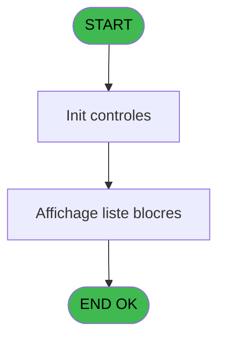
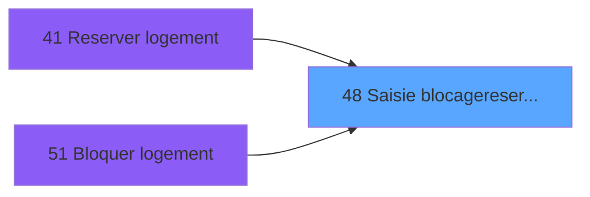
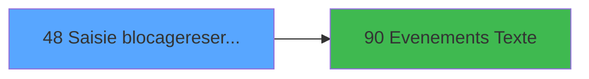

# WEL IDE 48 - Saisie blocage/reserv room

> **Analyse**: Phases 1-4 2026-02-03 21:28 -> 21:28 (18s) | Assemblage 21:28
> **Pipeline**: V7.2 Enrichi
> **Structure**: 4 onglets (Resume | Ecrans | Donnees | Connexions)

<!-- TAB:Resume -->

## 1. FICHE D'IDENTITE

| Attribut | Valeur |
|----------|--------|
| Projet | WEL |
| IDE Position | 48 |
| Nom Programme | Saisie blocage/reserv room |
| Fichier source | `Prg_48.xml` |
| Dossier IDE | Logement |
| Taches | 2 (1 ecrans visibles) |
| Tables modifiees | 0 |
| Programmes appeles | 1 |

## 2. DESCRIPTION FONCTIONNELLE

**Saisie blocage/reserv room** assure la gestion complete de ce processus, accessible depuis [Reserver logement (IDE 41)](WEL-IDE-41.md), [Bloquer logement (IDE 51)](WEL-IDE-51.md).

Le flux de traitement s'organise en **2 blocs fonctionnels** :

- **Consultation** (1 tache) : ecrans de recherche, selection et consultation
- **Saisie** (1 tache) : ecrans de saisie utilisateur (formulaires, champs, donnees)

**Logique metier** : 1 regles identifiees couvrant conditions metier.

Detail : phases du traitement

#### Phase 1 : Saisie (1 tache)

- **48** - Saisie blocage/reserv room

#### Phase 2 : Consultation (1 tache)

- **48.1** - Affichage blocage/reservation **[[ECRAN]](#ecran-t2)**

## 3. BLOCS FONCTIONNELS

### 3.1 Saisie (1 tache)

Ce bloc traite la saisie des donnees de la transaction.

---

#### 48 - Saisie blocage/reserv room

**Role** : Saisie des donnees : Saisie blocage/reserv room.
**Variables liees** : A (P.Blocage/Reservation)

### 3.2 Consultation (1 tache)

Ecrans de recherche et consultation.

---

#### 48.1 - Affichage blocage/reservation [[ECRAN]](#ecran-t2)

**Role** : Reinitialisation : Affichage blocage/reservation.
**Ecran** : 798 x 311 DLU (Modal) | [Voir mockup](#ecran-t2)
**Variables liees** : A (P.Blocage/Reservation)

## 5. REGLES METIER

1 regles identifiees:

### Autres (1 regles)

#### [RM-001] Si P.Blocage/Reservation [A]='B' alors MlsTrans('BLOCK ROOM -') sinon MlsTrans('RESERVE ROOM -'))&' '&Trim(VG11)

| Element | Detail |
|---------|--------|
| **Condition** | `P.Blocage/Reservation [A]='B'` |
| **Si vrai** | MlsTrans('BLOCK ROOM -') |
| **Si faux** | MlsTrans('RESERVE ROOM -'))&' '&Trim(VG11) |
| **Variables** | A (P.Blocage/Reservation) |
| **Expression source** | Expression 1 : `IF(P.Blocage/Reservation [A]='B',MlsTrans('BLOCK ROOM -'),Ml` |
| **Exemple** | Si P.Blocage/Reservation [A]='B' → MlsTrans('BLOCK ROOM -'). Sinon → MlsTrans('RESERVE ROOM -'))&' '&Trim(VG11) |

## 6. CONTEXTE

- **Appele par**: [Reserver logement (IDE 41)](WEL-IDE-41.md), [Bloquer logement (IDE 51)](WEL-IDE-51.md)
- **Appelle**: 1 programmes | **Tables**: 1 (W:0 R:1 L:0) | **Taches**: 2 | **Expressions**: 9

<!-- TAB:Ecrans -->

## 8. ECRANS

### 8.1 Forms visibles (1 / 2)

| # | Position | Tache | Nom | Type | Largeur | Hauteur | Bloc |
|---|----------|-------|-----|------|---------|---------|------|
| 1 | 48.1 | 48.1 | Affichage blocage/reservation | Modal | 798 | 311 | Consultation |

### 8.2 Mockups Ecrans

---

#### 48.1 - Affichage blocage/reservation
**Tache** : [48.1](#t2) | **Type** : Modal | **Dimensions** : 798 x 311 DLU
**Bloc** : Consultation | **Titre IDE** : Affichage blocage/reservation

<!-- FORM-DATA:
{
    "width":  798,
    "vFactor":  100,
    "type":  "Modal",
    "hFactor":  100,
    "controls":  [
                     {
                         "x":  0,
                         "type":  "table",
                         "var":  "",
                         "name":  "",
                         "titleH":  12,
                         "color":  "",
                         "w":  741,
                         "y":  43,
                         "fmt":  "",
                         "parent":  null,
                         "text":  "",
                         "rowH":  44,
                         "h":  266,
                         "cols":  [
                                      {
                                          "title":  "",
                                          "layer":  1,
                                          "w":  130
                                      },
                                      {
                                          "title":  "",
                                          "layer":  2,
                                          "w":  150
                                      },
                                      {
                                          "title":  "",
                                          "layer":  3,
                                          "w":  150
                                      },
                                      {
                                          "title":  "",
                                          "layer":  4,
                                          "w":  306
                                      }
                                  ],
                         "rows":  4
                     },
                     {
                         "x":  132,
                         "type":  "label",
                         "var":  "",
                         "y":  0,
                         "w":  151,
                         "fmt":  "",
                         "name":  "",
                         "h":  43,
                         "color":  "",
                         "text":  "TO",
                         "parent":  null
                     },
                     {
                         "x":  0,
                         "type":  "label",
                         "var":  "",
                         "y":  0,
                         "w":  133,
                         "fmt":  "",
                         "name":  "",
                         "h":  43,
                         "color":  "",
                         "text":  "FROM",
                         "parent":  null
                     },
                     {
                         "x":  430,
                         "type":  "label",
                         "var":  "",
                         "y":  0,
                         "w":  311,
                         "fmt":  "",
                         "name":  "",
                         "h":  43,
                         "color":  "",
                         "text":  "REASON",
                         "parent":  null
                     },
                     {
                         "x":  282,
                         "type":  "label",
                         "var":  "",
                         "y":  0,
                         "w":  150,
                         "fmt":  "",
                         "name":  "",
                         "h":  43,
                         "color":  "",
                         "text":  "WHO",
                         "parent":  null
                     },
                     {
                         "x":  740,
                         "type":  "button",
                         "var":  "",
                         "y":  0,
                         "w":  56,
                         "fmt":  "",
                         "name":  "",
                         "h":  156,
                         "color":  "",
                         "text":  "",
                         "parent":  null
                     },
                     {
                         "x":  5,
                         "type":  "edit",
                         "var":  "",
                         "y":  47,
                         "w":  122,
                         "fmt":  "DD/MM/YYYYZ",
                         "name":  "heb_date_debut",
                         "h":  36,
                         "color":  "",
                         "text":  "",
                         "parent":  1
                     },
                     {
                         "x":  136,
                         "type":  "edit",
                         "var":  "",
                         "y":  47,
                         "w":  139,
                         "fmt":  "DD/MM/YYYYZ",
                         "name":  "heb_date_fin",
                         "h":  36,
                         "color":  "",
                         "text":  "",
                         "parent":  1
                     },
                     {
                         "x":  284,
                         "type":  "edit",
                         "var":  "",
                         "y":  47,
                         "w":  143,
                         "fmt":  "30",
                         "name":  "nom maitre",
                         "h":  36,
                         "color":  "",
                         "text":  "",
                         "parent":  1
                     },
                     {
                         "x":  434,
                         "type":  "edit",
                         "var":  "",
                         "y":  47,
                         "w":  301,
                         "fmt":  "30",
                         "name":  "message",
                         "h":  36,
                         "color":  "",
                         "text":  "",
                         "parent":  1
                     },
                     {
                         "x":  740,
                         "type":  "button",
                         "var":  "",
                         "y":  156,
                         "w":  56,
                         "fmt":  "",
                         "name":  "",
                         "h":  153,
                         "color":  "",
                         "text":  "",
                         "parent":  null
                     }
                 ],
    "taskId":  "48.1",
    "height":  311
}
-->

<strong>Champs : 4 champs</strong>

| Pos (x,y) | Nom | Variable | Type |
|-----------|-----|----------|------|
| 5,47 | heb_date_debut | - | edit |
| 136,47 | heb_date_fin | - | edit |
| 284,47 | nom maitre | - | edit |
| 434,47 | message | - | edit |

<strong>Boutons : 2 boutons</strong>

| Bouton | Pos (x,y) | Action |
|--------|-----------|--------|
| (sans nom) | 740,0 | Action declenchee |
| (sans nom) | 740,156 | Action declenchee |

## 9. NAVIGATION

Ecran unique: **Affichage blocage/reservation**

### 9.3 Structure hierarchique (2 taches)

| Position | Tache | Type | Dimensions | Bloc |
|----------|-------|------|------------|------|
| **48.1** | [**Saisie blocage/reserv room** (48)](#t1) | - | - | Saisie |
| **48.2** | [**Affichage blocage/reservation** (48.1)](#t2) [mockup](#ecran-t2) | Modal | 798x311 | Consultation |

### 9.4 Algorigramme

> **Legende**: Vert = START/END OK | Rouge = END KO | Bleu = Decisions
> *Algorigramme auto-genere. Utiliser `/algorigramme` pour une synthese metier detaillee.*

<!-- TAB:Donnees -->

## 10. TABLES

### Tables utilisees (1)

| ID | Nom | Description | Type | R | W | L | Usages |
|----|-----|-------------|------|---|---|---|--------|
| 34 | hebergement______heb | Hebergement (chambres) | DB | R |   |   | 1 |

### Colonnes par table (0 / 1 tables avec colonnes identifiees)

Table 34 - hebergement______heb (R) - 1 usages

*Table utilisee uniquement en Link ou aucune colonne Real identifiee dans le DataView.*

## 11. VARIABLES

### 11.1 Parametres entrants (1)

Variables recues du programme appelant ([Reserver logement (IDE 41)](WEL-IDE-41.md)).

| Lettre | Nom | Type | Usage dans |
|--------|-----|------|-----------|
| A | P.Blocage/Reservation | Alpha | 2x parametre entrant |

### 11.2 Autres (4)

Variables diverses.

| Lettre | Nom | Type | Usage dans |
|--------|-----|------|-----------|
| B | V0.Date debut | Date | 2x refs |
| C | V0.Date fin | Date | 1x refs |
| D | V0.Reason | Alpha | 1x refs |
| E | V0.Refresh view ? | Logical | - |

## 12. EXPRESSIONS

**9 / 9 expressions decodees (100%)**

### 12.1 Repartition par type

| Type | Expressions | Regles |
|------|-------------|--------|
| CALCULATION | 1 | 0 |
| CONDITION | 2 | 5 |
| CONSTANTE | 1 | 0 |
| DATE | 1 | 0 |
| OTHER | 4 | 0 |

### 12.2 Expressions cles par type

#### CALCULATION (1 expressions)

| Type | IDE | Expression | Regle |
|------|-----|------------|-------|
| CALCULATION | 5 | `V0.Date debut [B]+7` | - |

#### CONDITION (2 expressions)

| Type | IDE | Expression | Regle |
|------|-----|------------|-------|
| CONDITION | 1 | `IF(P.Blocage/Reservation [A]='B',MlsTrans('BLOCK ROOM -'),MlsTrans('RESERVE ROOM -'))&' '&Trim(VG11)` | [RM-001](#rm-RM-001) |
| CONDITION | 3 | `IF(P.Blocage/Reservation [A]='B','BLOCK','RES')` | - |

#### CONSTANTE (1 expressions)

| Type | IDE | Expression | Regle |
|------|-----|------------|-------|
| CONSTANTE | 9 | `''` | - |

#### DATE (1 expressions)

| Type | IDE | Expression | Regle |
|------|-----|------------|-------|
| DATE | 4 | `Date()` | - |

#### OTHER (4 expressions)

| Type | IDE | Expression | Regle |
|------|-----|------------|-------|
| OTHER | 7 | `V0.Date fin [C]` | - |
| OTHER | 8 | `V0.Reason [D]` | - |
| OTHER | 2 | `IsFirstRecordCycle(0)` | - |
| OTHER | 6 | `V0.Date debut [B]` | - |

<!-- TAB:Connexions -->

## 13. GRAPHE D'APPELS

### 13.1 Chaine depuis Main (Callers)

Main -> ... -> [Reserver logement (IDE 41)](WEL-IDE-41.md) -> **Saisie blocage/reserv room (IDE 48)**

Main -> ... -> [Bloquer logement (IDE 51)](WEL-IDE-51.md) -> **Saisie blocage/reserv room (IDE 48)**

### 13.2 Callers

| IDE | Nom Programme | Nb Appels |
|-----|---------------|-----------|
| [41](WEL-IDE-41.md) | Reserver logement | 1 |
| [51](WEL-IDE-51.md) | Bloquer logement | 1 |

### 13.3 Callees (programmes appeles)

### 13.4 Detail Callees avec contexte

| IDE | Nom Programme | Appels | Contexte |
|-----|---------------|--------|----------|
| [90](WEL-IDE-90.md) | Evenements (Texte) | 2 | Sous-programme |

## 14. RECOMMANDATIONS MIGRATION

### 14.1 Profil du programme

| Metrique | Valeur | Impact migration |
|----------|--------|-----------------|
| Lignes de logique | 29 | Programme compact |
| Expressions | 9 | Peu de logique |
| Tables WRITE | 0 | Impact faible |
| Sous-programmes | 1 | Peu de dependances |
| Ecrans visibles | 1 | Ecran unique ou traitement batch |
| Code desactive | 0% (0 / 29) | Code sain |
| Regles metier | 1 | Quelques regles a preserver |

### 14.2 Plan de migration par bloc

#### Saisie (1 tache: 0 ecran, 1 traitement)

- **Strategie** : Formulaire React/Blazor avec validation Zod/FluentValidation.
- Validation temps reel cote client + serveur

#### Consultation (1 tache: 1 ecran, 0 traitement)

- **Strategie** : Composants de recherche/selection en modales.
- 1 ecran : Affichage blocage/reservation

### 14.3 Dependances critiques

| Dependance | Type | Appels | Impact |
|------------|------|--------|--------|
| [Evenements (Texte) (IDE 90)](WEL-IDE-90.md) | Sous-programme | 2x | Haute - Sous-programme |

---
*Spec DETAILED generee par Pipeline V7.2 - 2026-02-03 21:28*
