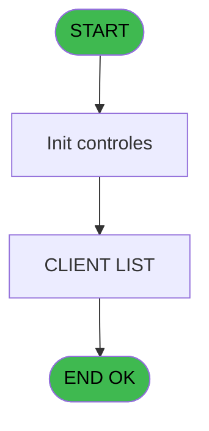
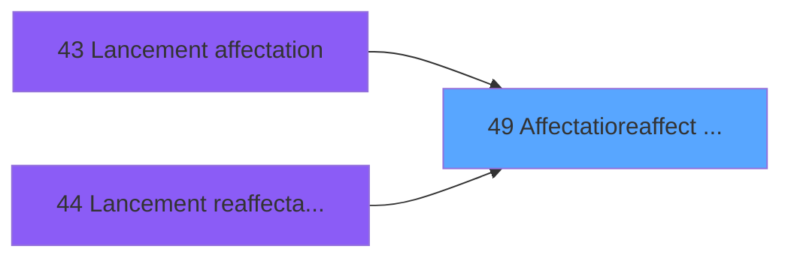
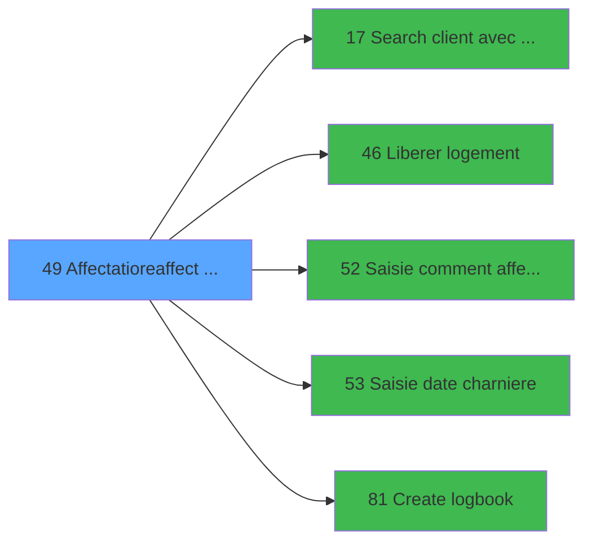

# WEL IDE 49 - Affectatio/reaffect logement

> **Analyse**: Phases 1-4 2026-02-03 21:28 -> 21:29 (12s) | Assemblage 21:29
> **Pipeline**: V7.2 Enrichi
> **Structure**: 4 onglets (Resume | Ecrans | Donnees | Connexions)

<!-- TAB:Resume -->

## 1. FICHE D'IDENTITE

| Attribut | Valeur |
|----------|--------|
| Projet | WEL |
| IDE Position | 49 |
| Nom Programme | Affectatio/reaffect logement |
| Fichier source | `Prg_49.xml` |
| Dossier IDE | Logement |
| Taches | 2 (1 ecrans visibles) |
| Tables modifiees | 0 |
| Programmes appeles | 5 |

## 2. DESCRIPTION FONCTIONNELLE

**Affectatio/reaffect logement** assure la gestion complete de ce processus, accessible depuis [Lancement affectation (IDE 43)](WEL-IDE-43.md), [Lancement reaffectation (IDE 44)](WEL-IDE-44.md).

Le flux de traitement s'organise en **1 blocs fonctionnels** :

- **Traitement** (2 taches) : traitements metier divers

**Logique metier** : 1 regles identifiees couvrant conditions metier.

## 3. BLOCS FONCTIONNELS

### 3.1 Traitement (2 taches)

Traitements internes.

---

#### 49 - Assign room

**Role** : Traitement : Assign room.
**Delegue a** : [Search client avec liste (IDE 17)](WEL-IDE-17.md), [Liberer logement (IDE 46)](WEL-IDE-46.md)

---

#### 49.1 - CLIENT LIST [[ECRAN]](#ecran-t2)

**Role** : Traitement : CLIENT LIST.
**Ecran** : 1124 x 395 DLU (Modal) | [Voir mockup](#ecran-t2)
**Delegue a** : [Search client avec liste (IDE 17)](WEL-IDE-17.md), [Liberer logement (IDE 46)](WEL-IDE-46.md)

## 5. REGLES METIER

1 regles identifiees:

### Autres (1 regles)

#### [RM-001] Si P.Affectation/Reaffect... [A]='A' alors MlsTrans('ASSIGN ROOM -')&' '&Trim(VG11) sinon MlsTrans('REASSIGN ROOM -')&' '&Trim(VG11))

| Element | Detail |
|---------|--------|
| **Condition** | `P.Affectation/Reaffect... [A]='A'` |
| **Si vrai** | MlsTrans('ASSIGN ROOM -')&' '&Trim(VG11) |
| **Si faux** | MlsTrans('REASSIGN ROOM -')&' '&Trim(VG11)) |
| **Expression source** | Expression 1 : `IF(P.Affectation/Reaffect... [A]='A',MlsTrans('ASSIGN ROOM -` |
| **Exemple** | Si P.Affectation/Reaffect... [A]='A' → MlsTrans('ASSIGN ROOM -')&' '&Trim(VG11). Sinon → MlsTrans('REASSIGN ROOM -')&' '&Trim(VG11)) |
| **Impact** | [49 - Assign room](#t1) |

## 6. CONTEXTE

- **Appele par**: [Lancement affectation (IDE 43)](WEL-IDE-43.md), [Lancement reaffectation (IDE 44)](WEL-IDE-44.md)
- **Appelle**: 5 programmes | **Tables**: 5 (W:0 R:1 L:4) | **Taches**: 2 | **Expressions**: 19

<!-- TAB:Ecrans -->

## 8. ECRANS

### 8.1 Forms visibles (1 / 2)

| # | Position | Tache | Nom | Type | Largeur | Hauteur | Bloc |
|---|----------|-------|-----|------|---------|---------|------|
| 1 | 49.1 | 49.1 | CLIENT LIST | Modal | 1124 | 395 | Traitement |

### 8.2 Mockups Ecrans

---

#### 49.1 - CLIENT LIST
**Tache** : [49.1](#t2) | **Type** : Modal | **Dimensions** : 1124 x 395 DLU
**Bloc** : Traitement | **Titre IDE** : CLIENT LIST

<!-- FORM-DATA:
{
    "width":  1124,
    "vFactor":  8,
    "type":  "Modal",
    "hFactor":  4,
    "controls":  [
                     {
                         "x":  44,
                         "type":  "label",
                         "var":  "",
                         "y":  0,
                         "w":  194,
                         "fmt":  "",
                         "name":  "",
                         "h":  30,
                         "color":  "",
                         "text":  "CLIENT LIST",
                         "parent":  null
                     },
                     {
                         "x":  28,
                         "type":  "label",
                         "var":  "",
                         "y":  36,
                         "w":  213,
                         "fmt":  "",
                         "name":  "",
                         "h":  44,
                         "color":  "",
                         "text":  "LAST NAME",
                         "parent":  null
                     },
                     {
                         "x":  238,
                         "type":  "label",
                         "var":  "",
                         "y":  36,
                         "w":  202,
                         "fmt":  "",
                         "name":  "",
                         "h":  44,
                         "color":  "",
                         "text":  "FIRST NAME",
                         "parent":  null
                     },
                     {
                         "x":  438,
                         "type":  "label",
                         "var":  "",
                         "y":  36,
                         "w":  71,
                         "fmt":  "",
                         "name":  "",
                         "h":  44,
                         "color":  "",
                         "text":  "ROOM",
                         "parent":  null
                     },
                     {
                         "x":  508,
                         "type":  "label",
                         "var":  "",
                         "y":  36,
                         "w":  73,
                         "fmt":  "",
                         "name":  "",
                         "h":  44,
                         "color":  "",
                         "text":  "AGE",
                         "parent":  null
                     },
                     {
                         "x":  579,
                         "type":  "label",
                         "var":  "",
                         "y":  36,
                         "w":  101,
                         "fmt":  "",
                         "name":  "",
                         "h":  44,
                         "color":  "",
                         "text":  "ARR",
                         "parent":  null
                     },
                     {
                         "x":  678,
                         "type":  "label",
                         "var":  "",
                         "y":  36,
                         "w":  100,
                         "fmt":  "",
                         "name":  "",
                         "h":  44,
                         "color":  "",
                         "text":  "DEP",
                         "parent":  null
                     },
                     {
                         "x":  777,
                         "type":  "label",
                         "var":  "",
                         "y":  36,
                         "w":  162,
                         "fmt":  "",
                         "name":  "",
                         "h":  44,
                         "color":  "",
                         "text":  "STATUS",
                         "parent":  null
                     },
                     {
                         "x":  937,
                         "type":  "label",
                         "var":  "",
                         "y":  36,
                         "w":  105,
                         "fmt":  "",
                         "name":  "",
                         "h":  44,
                         "color":  "",
                         "text":  "QUAL",
                         "parent":  null
                     },
                     {
                         "x":  378,
                         "type":  "label",
                         "var":  "",
                         "y":  307,
                         "w":  149,
                         "fmt":  "",
                         "name":  "",
                         "h":  25,
                         "color":  "",
                         "text":  "ADD\r\n CLIENT",
                         "parent":  null
                     },
                     {
                         "x":  567,
                         "type":  "label",
                         "var":  "",
                         "y":  307,
                         "w":  162,
                         "fmt":  "",
                         "name":  "",
                         "h":  25,
                         "color":  "",
                         "text":  "REMOVE \r\nCLIENT",
                         "parent":  null
                     },
                     {
                         "x":  544,
                         "type":  "line",
                         "var":  "",
                         "y":  319,
                         "w":  0,
                         "fmt":  "",
                         "name":  "",
                         "h":  73,
                         "color":  "",
                         "text":  "",
                         "parent":  null
                     },
                     {
                         "x":  27,
                         "type":  "table",
                         "var":  "",
                         "name":  "",
                         "titleH":  12,
                         "color":  "",
                         "w":  1015,
                         "y":  79,
                         "fmt":  "",
                         "parent":  null,
                         "text":  "",
                         "rowH":  44,
                         "h":  224,
                         "cols":  [
                                      {
                                          "title":  "",
                                          "layer":  1,
                                          "w":  210
                                      },
                                      {
                                          "title":  " ",
                                          "layer":  2,
                                          "w":  200
                                      },
                                      {
                                          "title":  "  ",
                                          "layer":  3,
                                          "w":  70
                                      },
                                      {
                                          "title":  " ",
                                          "layer":  4,
                                          "w":  70
                                      },
                                      {
                                          "title":  " ",
                                          "layer":  5,
                                          "w":  100
                                      },
                                      {
                                          "title":  " ",
                                          "layer":  6,
                                          "w":  100
                                      },
                                      {
                                          "title":  " ",
                                          "layer":  7,
                                          "w":  158
                                      },
                                      {
                                          "title":  " ",
                                          "layer":  8,
                                          "w":  101
                                      }
                                  ],
                         "rows":  8
                     },
                     {
                         "x":  1041,
                         "type":  "button",
                         "var":  "",
                         "y":  36,
                         "w":  56,
                         "fmt":  "",
                         "name":  "",
                         "h":  135,
                         "color":  "",
                         "text":  "",
                         "parent":  null
                     },
                     {
                         "x":  31,
                         "type":  "edit",
                         "var":  "",
                         "y":  83,
                         "w":  204,
                         "fmt":  "",
                         "name":  "gm_nom",
                         "h":  36,
                         "color":  "",
                         "text":  "",
                         "parent":  16
                     },
                     {
                         "x":  241,
                         "type":  "edit",
                         "var":  "",
                         "y":  84,
                         "w":  191,
                         "fmt":  "",
                         "name":  "Prenom",
                         "h":  36,
                         "color":  "",
                         "text":  "",
                         "parent":  16
                     },
                     {
                         "x":  441,
                         "type":  "edit",
                         "var":  "",
                         "y":  83,
                         "w":  64,
                         "fmt":  "",
                         "name":  "Room",
                         "h":  36,
                         "color":  "",
                         "text":  "",
                         "parent":  16
                     },
                     {
                         "x":  511,
                         "type":  "edit",
                         "var":  "",
                         "y":  83,
                         "w":  64,
                         "fmt":  "3Z",
                         "name":  "Age",
                         "h":  36,
                         "color":  "",
                         "text":  "",
                         "parent":  16
                     },
                     {
                         "x":  581,
                         "type":  "edit",
                         "var":  "",
                         "y":  83,
                         "w":  95,
                         "fmt":  "##/##/####Z",
                         "name":  "Date Arrivee",
                         "h":  36,
                         "color":  "",
                         "text":  "",
                         "parent":  16
                     },
                     {
                         "x":  681,
                         "type":  "edit",
                         "var":  "",
                         "y":  83,
                         "w":  95,
                         "fmt":  "##/##/####Z",
                         "name":  "Date Depart",
                         "h":  36,
                         "color":  "",
                         "text":  "",
                         "parent":  16
                     },
                     {
                         "x":  783,
                         "type":  "edit",
                         "var":  "",
                         "y":  83,
                         "w":  148,
                         "fmt":  "",
                         "name":  "Statut",
                         "h":  36,
                         "color":  "",
                         "text":  "",
                         "parent":  16
                     },
                     {
                         "x":  939,
                         "type":  "edit",
                         "var":  "",
                         "y":  83,
                         "w":  97,
                         "fmt":  "",
                         "name":  "Qualite",
                         "h":  36,
                         "color":  "",
                         "text":  "",
                         "parent":  16
                     },
                     {
                         "x":  1041,
                         "type":  "button",
                         "var":  "",
                         "y":  165,
                         "w":  56,
                         "fmt":  "",
                         "name":  "",
                         "h":  138,
                         "color":  "",
                         "text":  "",
                         "parent":  null
                     },
                     {
                         "x":  437,
                         "type":  "image",
                         "var":  "",
                         "y":  339,
                         "w":  41,
                         "fmt":  "",
                         "name":  "ADD_CLIENT",
                         "h":  42,
                         "color":  "",
                         "text":  "",
                         "parent":  null
                     },
                     {
                         "x":  626,
                         "type":  "image",
                         "var":  "",
                         "y":  339,
                         "w":  41,
                         "fmt":  "",
                         "name":  "REMOVE_CLIENT",
                         "h":  42,
                         "color":  "",
                         "text":  "",
                         "parent":  null
                     }
                 ],
    "taskId":  "49.1",
    "height":  395
}
-->

<strong>Champs : 8 champs</strong>

| Pos (x,y) | Nom | Variable | Type |
|-----------|-----|----------|------|
| 31,83 | gm_nom | - | edit |
| 241,84 | Prenom | - | edit |
| 441,83 | Room | - | edit |
| 511,83 | Age | - | edit |
| 581,83 | Date Arrivee | - | edit |
| 681,83 | Date Depart | - | edit |
| 783,83 | Statut | - | edit |
| 939,83 | Qualite | - | edit |

<strong>Boutons : 2 boutons</strong>

| Bouton | Pos (x,y) | Action |
|--------|-----------|--------|
| (sans nom) | 1041,36 | Action declenchee |
| (sans nom) | 1041,165 | Action declenchee |

## 9. NAVIGATION

Ecran unique: **CLIENT LIST**

### 9.3 Structure hierarchique (2 taches)

| Position | Tache | Type | Dimensions | Bloc |
|----------|-------|------|------------|------|
| **49.1** | [**Assign room** (49)](#t1) | - | - | Traitement |
| 49.1.1 | [CLIENT LIST (49.1)](#t2) [mockup](#ecran-t2) | Modal | 1124x395 | |

### 9.4 Algorigramme

> **Legende**: Vert = START/END OK | Rouge = END KO | Bleu = Decisions
> *Algorigramme auto-genere. Utiliser `/algorigramme` pour une synthese metier detaillee.*

<!-- TAB:Donnees -->

## 10. TABLES

### Tables utilisees (5)

| ID | Nom | Description | Type | R | W | L | Usages |
|----|-----|-------------|------|---|---|---|--------|
| 31 | gm-complet_______gmc |  | DB |   |   | L | 2 |
| 34 | hebergement______heb | Hebergement (chambres) | DB | R |   |   | 2 |
| 103 | logement_client__loc |  | DB |   |   | L | 2 |
| 356 | gm_millesia |  | DB |   |   | L | 1 |
| 800 | moyen_paiement_complement |  | DB |   |   | L | 1 |

### Colonnes par table (1 / 1 tables avec colonnes identifiees)

Table 34 - hebergement______heb (R) - 2 usages

| Lettre | Variable | Acces | Type |
|--------|----------|-------|------|
| A | P.Affectation/Reaffectation | R | Alpha |
| B | P.Statut sejour | R | Alpha |
| C | V0.Refresh view | R | Logical |
| D | V0.Date charnière | R | Date |
| E | V0.comment affectation auto | R | Alpha |
| F | V0.Filtre nom | R | Alpha |
| G | V0.Filtre prenom | R | Alpha |
| H | V0.Clause where | R | Alpha |

## 11. VARIABLES

### 11.1 Parametres entrants (2)

Variables recues du programme appelant ([Lancement affectation (IDE 43)](WEL-IDE-43.md)).

| Lettre | Nom | Type | Usage dans |
|--------|-----|------|-----------|
| A | P.Affectation/Reaffectation | Alpha | - |
| B | P.Statut sejour | Alpha | - |

### 11.2 Autres (6)

Variables diverses.

| Lettre | Nom | Type | Usage dans |
|--------|-----|------|-----------|
| C | V0.Refresh view | Logical | 1x refs |
| D | V0.Date charnière | Date | - |
| E | V0.comment affectation auto | Alpha | - |
| F | V0.Filtre nom | Alpha | 2x refs |
| G | V0.Filtre prenom | Alpha | 1x refs |
| H | V0.Clause where | Alpha | 1x refs |

## 12. EXPRESSIONS

**19 / 19 expressions decodees (100%)**

### 12.1 Repartition par type

| Type | Expressions | Regles |
|------|-------------|--------|
| CONDITION | 2 | 5 |
| CONSTANTE | 6 | 0 |
| REFERENCE_VG | 3 | 0 |
| OTHER | 6 | 0 |
| CAST_LOGIQUE | 2 | 0 |

### 12.2 Expressions cles par type

#### CONDITION (2 expressions)

| Type | IDE | Expression | Regle |
|------|-----|------------|-------|
| CONDITION | 1 | `IF(P.Affectation/Reaffect... [A]='A',MlsTrans('ASSIGN ROOM -')&' '&Trim(VG11),MlsTrans('REASSIGN ROOM -')&' '&Trim(VG11))` | [RM-001](#rm-RM-001) |
| CONDITION | 7 | `V0.Filtre nom [F]>0` | - |

#### CONSTANTE (6 expressions)

| Type | IDE | Expression | Regle |
|------|-----|------------|-------|
| CONSTANTE | 15 | `'SB_LIST_CLIENT'` | - |
| CONSTANTE | 17 | `2` | - |
| CONSTANTE | 19 | `'SB_LIST_CLIENT'` | - |
| CONSTANTE | 2 | `'%club_images%Retour.png'` | - |
| CONSTANTE | 3 | `'ROOMASSIGN'` | - |
| ... | | *+1 autres* | |

#### REFERENCE_VG (3 expressions)

| Type | IDE | Expression | Regle |
|------|-----|------------|-------|
| REFERENCE_VG | 16 | `VG11` | - |
| REFERENCE_VG | 6 | `VG11` | - |
| REFERENCE_VG | 4 | `VG5` | - |

#### OTHER (6 expressions)

| Type | IDE | Expression | Regle |
|------|-----|------------|-------|
| OTHER | 12 | `V0.Clause where [H]` | - |
| OTHER | 13 | `ASCIIChr(13)&MlsTrans('SEARCH CLIENT')` | - |
| OTHER | 14 | `MlsTrans('VALIDATE')` | - |
| OTHER | 8 | `V0.Refresh view [C]` | - |
| OTHER | 9 | `V0.Filtre nom [F]` | - |
| ... | | *+1 autres* | |

#### CAST_LOGIQUE (2 expressions)

| Type | IDE | Expression | Regle |
|------|-----|------------|-------|
| CAST_LOGIQUE | 18 | `'TRUE'LOG` | - |
| CAST_LOGIQUE | 11 | `Rollback('FALSE'LOG,0)` | - |

<!-- TAB:Connexions -->

## 13. GRAPHE D'APPELS

### 13.1 Chaine depuis Main (Callers)

Main -> ... -> [Lancement affectation (IDE 43)](WEL-IDE-43.md) -> **Affectatio/reaffect logement (IDE 49)**

Main -> ... -> [Lancement reaffectation (IDE 44)](WEL-IDE-44.md) -> **Affectatio/reaffect logement (IDE 49)**

### 13.2 Callers

| IDE | Nom Programme | Nb Appels |
|-----|---------------|-----------|
| [43](WEL-IDE-43.md) | Lancement affectation | 1 |
| [44](WEL-IDE-44.md) | Lancement reaffectation | 1 |

### 13.3 Callees (programmes appeles)

### 13.4 Detail Callees avec contexte

| IDE | Nom Programme | Appels | Contexte |
|-----|---------------|--------|----------|
| [17](WEL-IDE-17.md) | Search client avec liste | 1 | Configuration impression |
| [46](WEL-IDE-46.md) | Liberer logement | 1 | Sous-programme |
| [52](WEL-IDE-52.md) | Saisie comment affec auto | 1 | Sous-programme |
| [53](WEL-IDE-53.md) | Saisie date charniere | 1 | Sous-programme |
| [81](WEL-IDE-81.md) | Create logbook | 1 | Sous-programme |

## 14. RECOMMANDATIONS MIGRATION

### 14.1 Profil du programme

| Metrique | Valeur | Impact migration |
|----------|--------|-----------------|
| Lignes de logique | 107 | Programme compact |
| Expressions | 19 | Peu de logique |
| Tables WRITE | 0 | Impact faible |
| Sous-programmes | 5 | Peu de dependances |
| Ecrans visibles | 1 | Ecran unique ou traitement batch |
| Code desactive | 0% (0 / 107) | Code sain |
| Regles metier | 1 | Quelques regles a preserver |

### 14.2 Plan de migration par bloc

#### Traitement (2 taches: 1 ecran, 1 traitement)

- **Strategie** : Orchestrateur avec 1 ecrans (Razor/React) et 1 traitements backend (services).
- Les ecrans deviennent des composants UI, les traitements invisibles deviennent des services injectables.
- 5 sous-programme(s) a migrer ou a reutiliser depuis les services existants.
- Decomposer les taches en services unitaires testables.

### 14.3 Dependances critiques

| Dependance | Type | Appels | Impact |
|------------|------|--------|--------|
| [Saisie date charniere (IDE 53)](WEL-IDE-53.md) | Sous-programme | 1x | Normale - Sous-programme |
| [Create logbook (IDE 81)](WEL-IDE-81.md) | Sous-programme | 1x | Normale - Sous-programme |
| [Saisie comment affec auto (IDE 52)](WEL-IDE-52.md) | Sous-programme | 1x | Normale - Sous-programme |
| [Search client avec liste (IDE 17)](WEL-IDE-17.md) | Sous-programme | 1x | Normale - Configuration impression |
| [Liberer logement (IDE 46)](WEL-IDE-46.md) | Sous-programme | 1x | Normale - Sous-programme |

---
*Spec DETAILED generee par Pipeline V7.2 - 2026-02-03 21:29*
