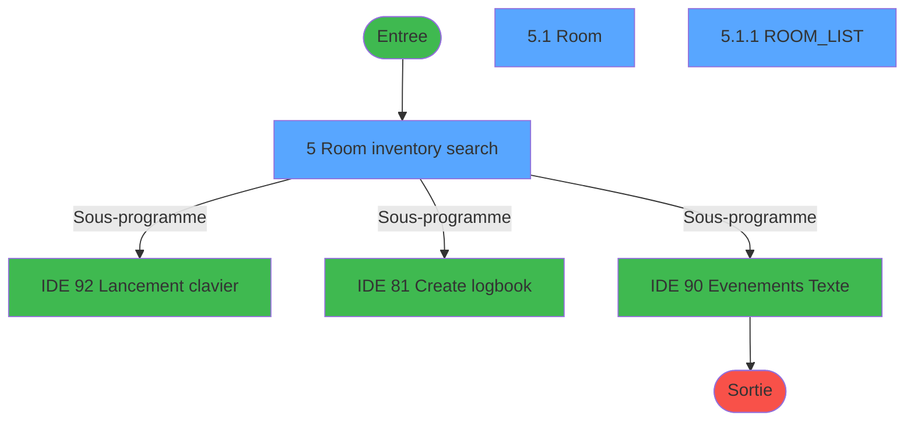
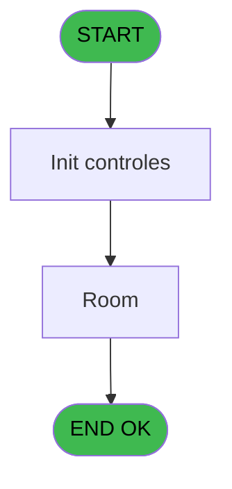
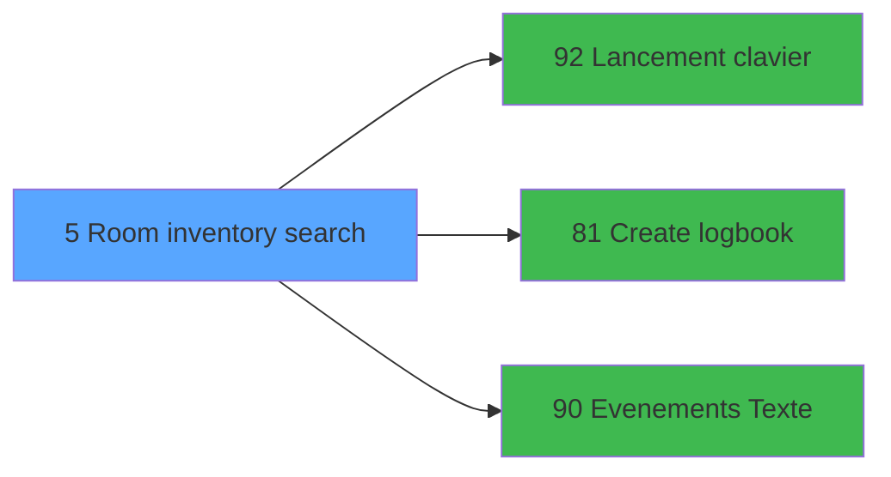

# WEL IDE 5 - Room inventory search

> **Analyse**: Phases 1-4 2026-02-03 21:11 -> 21:11 (18s) | Assemblage 21:11
> **Pipeline**: V7.2 Enrichi
> **Structure**: 4 onglets (Resume | Ecrans | Donnees | Connexions)

<!-- TAB:Resume -->

## 1. FICHE D'IDENTITE

| Attribut | Valeur |
|----------|--------|
| Projet | WEL |
| IDE Position | 5 |
| Nom Programme | Room inventory search |
| Fichier source | `Prg_5.xml` |
| Dossier IDE | Chambre |
| Taches | 3 (3 ecrans visibles) |
| Tables modifiees | 0 |
| Programmes appeles | 3 |
| :warning: Statut | **ORPHELIN_POTENTIEL** |

## 2. DESCRIPTION FONCTIONNELLE

**Room inventory search** assure la gestion complete de ce processus.

Le flux de traitement s'organise en **1 blocs fonctionnels** :

- **Traitement** (3 taches) : traitements metier divers

## 3. BLOCS FONCTIONNELS

### 3.1 Traitement (3 taches)

Traitements internes.

---

#### 5 - Room inventory search [[ECRAN]](#ecran-t1)

**Role** : Traitement : Room inventory search.
**Ecran** : 1313 x 741 DLU (MDI) | [Voir mockup](#ecran-t1)
**Variables liees** : D (v.SRH_RoomCateg), O (v.WhereSearch)
**Delegue a** : [Lancement clavier (IDE 92)](WEL-IDE-92.md), [Evenements (Texte) (IDE 90)](WEL-IDE-90.md)

---

#### 5.1 - Room [[ECRAN]](#ecran-t2)

**Role** : Traitement : Room.
**Ecran** : 984 x 359 DLU | [Voir mockup](#ecran-t2)
**Variables liees** : D (v.SRH_RoomCateg)
**Delegue a** : [Lancement clavier (IDE 92)](WEL-IDE-92.md), [Evenements (Texte) (IDE 90)](WEL-IDE-90.md)

---

#### 5.1.1 - ROOM_LIST [[ECRAN]](#ecran-t3)

**Role** : Traitement : ROOM_LIST.
**Ecran** : 797 x 353 DLU | [Voir mockup](#ecran-t3)
**Delegue a** : [Lancement clavier (IDE 92)](WEL-IDE-92.md), [Evenements (Texte) (IDE 90)](WEL-IDE-90.md)

## 5. REGLES METIER

*(Aucune regle metier identifiee)*

## 6. CONTEXTE

- **Appele par**: (aucun)
- **Appelle**: 3 programmes | **Tables**: 5 (W:0 R:2 L:3) | **Taches**: 3 | **Expressions**: 44

<!-- TAB:Ecrans -->

## 8. ECRANS

### 8.1 Forms visibles (3 / 3)

| # | Position | Tache | Nom | Type | Largeur | Hauteur | Bloc |
|---|----------|-------|-----|------|---------|---------|------|
| 1 | 5 | 5 | Room inventory search | MDI | 1313 | 741 | Traitement |
| 2 | 5.1 | 5.1 | Room | Type0 | 984 | 359 | Traitement |
| 3 | 5.1.1 | 5.1.1 | ROOM_LIST | Type0 | 797 | 353 | Traitement |

### 8.2 Mockups Ecrans

---

#### 5 - Room inventory search
**Tache** : [5](#t1) | **Type** : MDI | **Dimensions** : 1313 x 741 DLU
**Bloc** : Traitement | **Titre IDE** : Room inventory search

<!-- FORM-DATA:
{
    "width":  1313,
    "vFactor":  100,
    "type":  "MDI",
    "hFactor":  100,
    "controls":  [
                     {
                         "x":  182,
                         "type":  "label",
                         "var":  "",
                         "y":  0,
                         "w":  1130,
                         "fmt":  "",
                         "name":  "TITRE",
                         "h":  66,
                         "color":  "212",
                         "text":  "ROOM INVENTORY SEARCH",
                         "parent":  null
                     },
                     {
                         "x":  191,
                         "type":  "label",
                         "var":  "",
                         "y":  98,
                         "w":  111,
                         "fmt":  "",
                         "name":  "",
                         "h":  44,
                         "color":  "",
                         "text":  "FROM",
                         "parent":  null
                     },
                     {
                         "x":  622,
                         "type":  "label",
                         "var":  "",
                         "y":  98,
                         "w":  111,
                         "fmt":  "",
                         "name":  "",
                         "h":  44,
                         "color":  "",
                         "text":  "FLOOR",
                         "parent":  null
                     },
                     {
                         "x":  612,
                         "type":  "label",
                         "var":  "",
                         "y":  154,
                         "w":  121,
                         "fmt":  "",
                         "name":  "",
                         "h":  44,
                         "color":  "",
                         "text":  "BUILDING",
                         "parent":  null
                     },
                     {
                         "x":  145,
                         "type":  "label",
                         "var":  "",
                         "y":  154,
                         "w":  155,
                         "fmt":  "",
                         "name":  "",
                         "h":  44,
                         "color":  "",
                         "text":  "ROOM CATEGORY",
                         "parent":  null
                     },
                     {
                         "x":  189,
                         "type":  "label",
                         "var":  "",
                         "y":  210,
                         "w":  111,
                         "fmt":  "",
                         "name":  "",
                         "h":  44,
                         "color":  "",
                         "text":  "OCCUPANCY",
                         "parent":  null
                     },
                     {
                         "x":  612,
                         "type":  "label",
                         "var":  "",
                         "y":  210,
                         "w":  121,
                         "fmt":  "",
                         "name":  "",
                         "h":  44,
                         "color":  "",
                         "text":  "VIEW",
                         "parent":  null
                     },
                     {
                         "x":  612,
                         "type":  "label",
                         "var":  "",
                         "y":  266,
                         "w":  121,
                         "fmt":  "",
                         "name":  "",
                         "h":  44,
                         "color":  "",
                         "text":  "ORIENTATION",
                         "parent":  null
                     },
                     {
                         "x":  189,
                         "type":  "label",
                         "var":  "",
                         "y":  266,
                         "w":  111,
                         "fmt":  "",
                         "name":  "",
                         "h":  44,
                         "color":  "",
                         "text":  "BED TYPE",
                         "parent":  null
                     },
                     {
                         "x":  189,
                         "type":  "label",
                         "var":  "",
                         "y":  312,
                         "w":  111,
                         "fmt":  "",
                         "name":  "",
                         "h":  44,
                         "color":  "",
                         "text":  "Status",
                         "parent":  null
                     },
                     {
                         "x":  0,
                         "type":  "image",
                         "var":  "",
                         "y":  0,
                         "w":  173,
                         "fmt":  "",
                         "name":  "RETOUR",
                         "h":  66,
                         "color":  "226",
                         "text":  "",
                         "parent":  null
                     },
                     {
                         "x":  309,
                         "type":  "edit",
                         "var":  "",
                         "y":  98,
                         "w":  127,
                         "fmt":  "DD/MM/YYYYZ",
                         "name":  "Proximité1",
                         "h":  44,
                         "color":  "220",
                         "text":  "",
                         "parent":  null
                     },
                     {
                         "x":  451,
                         "type":  "edit",
                         "var":  "",
                         "y":  98,
                         "w":  127,
                         "fmt":  "DD/MM/YYYYZ",
                         "name":  "Proximité2",
                         "h":  44,
                         "color":  "220",
                         "text":  "",
                         "parent":  null
                     },
                     {
                         "x":  741,
                         "type":  "combobox",
                         "var":  "",
                         "y":  105,
                         "w":  269,
                         "fmt":  "",
                         "name":  "v.SRH_Etage",
                         "h":  20,
                         "color":  "220",
                         "text":  "Choice 1, Choice 2",
                         "parent":  null
                     },
                     {
                         "x":  309,
                         "type":  "combobox",
                         "var":  "",
                         "y":  161,
                         "w":  269,
                         "fmt":  "",
                         "name":  "v.SRH_RoomCateg",
                         "h":  20,
                         "color":  "220",
                         "text":  "Choice 1, Choice 2",
                         "parent":  null
                     },
                     {
                         "x":  741,
                         "type":  "combobox",
                         "var":  "",
                         "y":  161,
                         "w":  269,
                         "fmt":  "",
                         "name":  "v.SRH_Bulding",
                         "h":  20,
                         "color":  "220",
                         "text":  "Choice 1, Choice 2",
                         "parent":  null
                     },
                     {
                         "x":  309,
                         "type":  "combobox",
                         "var":  "",
                         "y":  218,
                         "w":  269,
                         "fmt":  "",
                         "name":  "v.SRH_Occupation",
                         "h":  20,
                         "color":  "220",
                         "text":  "Choice 1, Choice 2",
                         "parent":  null
                     },
                     {
                         "x":  741,
                         "type":  "combobox",
                         "var":  "",
                         "y":  218,
                         "w":  269,
                         "fmt":  "",
                         "name":  "v.SRH_Vue",
                         "h":  20,
                         "color":  "220",
                         "text":  "Choice 1, Choice 2",
                         "parent":  null
                     },
                     {
                         "x":  309,
                         "type":  "combobox",
                         "var":  "",
                         "y":  275,
                         "w":  269,
                         "fmt":  "",
                         "name":  "v.SRH_TypeBed",
                         "h":  20,
                         "color":  "220",
                         "text":  "Choice 1, Choice 2",
                         "parent":  null
                     },
                     {
                         "x":  741,
                         "type":  "combobox",
                         "var":  "",
                         "y":  275,
                         "w":  269,
                         "fmt":  "",
                         "name":  "v.SRH_Orientation",
                         "h":  20,
                         "color":  "220",
                         "text":  "Choice 1, Choice 2",
                         "parent":  null
                     },
                     {
                         "x":  1030,
                         "type":  "edit",
                         "var":  "",
                         "y":  292,
                         "w":  17,
                         "fmt":  "",
                         "name":  "o.Pos",
                         "h":  18,
                         "color":  "226",
                         "text":  "",
                         "parent":  null
                     },
                     {
                         "x":  309,
                         "type":  "combobox",
                         "var":  "",
                         "y":  322,
                         "w":  269,
                         "fmt":  "",
                         "name":  "v.SRH_CodeMenage",
                         "h":  20,
                         "color":  "220",
                         "text":  "0,1,2",
                         "parent":  null
                     },
                     {
                         "x":  89,
                         "type":  "subform",
                         "var":  "",
                         "y":  365,
                         "w":  985,
                         "fmt":  "",
                         "name":  "SB_ROOM_LIST",
                         "h":  359,
                         "color":  "",
                         "text":  "",
                         "parent":  null
                     }
                 ],
    "taskId":  "5",
    "height":  741
}
-->

<strong>Champs : 11 champs</strong>

| Pos (x,y) | Nom | Variable | Type |
|-----------|-----|----------|------|
| 309,98 | Proximité1 | - | edit |
| 451,98 | Proximité2 | - | edit |
| 741,105 | v.SRH_Etage | - | combobox |
| 309,161 | v.SRH_RoomCateg | - | combobox |
| 741,161 | v.SRH_Bulding | - | combobox |
| 309,218 | v.SRH_Occupation | - | combobox |
| 741,218 | v.SRH_Vue | - | combobox |
| 309,275 | v.SRH_TypeBed | - | combobox |
| 741,275 | v.SRH_Orientation | - | combobox |
| 1030,292 | o.Pos | - | edit |
| 309,322 | v.SRH_CodeMenage | - | combobox |

---

#### 5.1 - Room
**Tache** : [5.1](#t2) | **Type** : Type0 | **Dimensions** : 984 x 359 DLU
**Bloc** : Traitement | **Titre IDE** : Room

<!-- FORM-DATA:
{
    "width":  984,
    "vFactor":  8,
    "type":  "Type0",
    "hFactor":  4,
    "controls":  [
                     {
                         "x":  0,
                         "type":  "label",
                         "var":  "",
                         "y":  0,
                         "w":  127,
                         "fmt":  "",
                         "name":  "",
                         "h":  44,
                         "color":  "",
                         "text":  "ROOM",
                         "parent":  null
                     },
                     {
                         "x":  1,
                         "type":  "table",
                         "var":  "",
                         "name":  "",
                         "titleH":  12,
                         "color":  "",
                         "w":  125,
                         "y":  41,
                         "fmt":  "",
                         "parent":  null,
                         "text":  "",
                         "rowH":  44,
                         "h":  310,
                         "cols":  [
                                      {
                                          "title":  "",
                                          "layer":  1,
                                          "w":  40
                                      },
                                      {
                                          "title":  "",
                                          "layer":  2,
                                          "w":  80
                                      }
                                  ],
                         "rows":  2
                     },
                     {
                         "x":  126,
                         "type":  "button",
                         "var":  "",
                         "y":  0,
                         "w":  56,
                         "fmt":  "",
                         "name":  "",
                         "h":  180,
                         "color":  "",
                         "text":  "",
                         "parent":  null
                     },
                     {
                         "x":  183,
                         "type":  "subform",
                         "var":  "",
                         "y":  1,
                         "w":  801,
                         "fmt":  "",
                         "name":  "SF_CLIENT_LIST",
                         "h":  357,
                         "color":  "",
                         "text":  "",
                         "parent":  null
                     },
                     {
                         "x":  9,
                         "type":  "image",
                         "var":  "",
                         "y":  45,
                         "w":  34,
                         "fmt":  "",
                         "name":  "",
                         "h":  33,
                         "color":  "226",
                         "text":  "",
                         "parent":  4
                     },
                     {
                         "x":  47,
                         "type":  "button",
                         "var":  "",
                         "y":  47,
                         "w":  74,
                         "fmt":  "",
                         "name":  "ROOM",
                         "h":  34,
                         "color":  "220",
                         "text":  "",
                         "parent":  4
                     },
                     {
                         "x":  127,
                         "type":  "button",
                         "var":  "",
                         "y":  180,
                         "w":  56,
                         "fmt":  "",
                         "name":  "",
                         "h":  171,
                         "color":  "",
                         "text":  "",
                         "parent":  null
                     }
                 ],
    "taskId":  "5.1",
    "height":  359
}
-->

<strong>Boutons : 3 boutons</strong>

| Bouton | Pos (x,y) | Action |
|--------|-----------|--------|
| (sans nom) | 126,0 | Action declenchee |
| ROOM | 47,47 | Bouton fonctionnel |
| (sans nom) | 127,180 | Action declenchee |

---

#### 5.1.1 - ROOM_LIST
**Tache** : [5.1.1](#t3) | **Type** : Type0 | **Dimensions** : 797 x 353 DLU
**Bloc** : Traitement | **Titre IDE** : ROOM_LIST

<!-- FORM-DATA:
{
    "width":  797,
    "vFactor":  100,
    "type":  "Type0",
    "hFactor":  100,
    "controls":  [
                     {
                         "x":  0,
                         "type":  "label",
                         "var":  "",
                         "y":  3,
                         "w":  204,
                         "fmt":  "",
                         "name":  "",
                         "h":  44,
                         "color":  "",
                         "text":  "NAME",
                         "parent":  null
                     },
                     {
                         "x":  202,
                         "type":  "label",
                         "var":  "",
                         "y":  3,
                         "w":  131,
                         "fmt":  "",
                         "name":  "",
                         "h":  44,
                         "color":  "",
                         "text":  "FIRST NAME",
                         "parent":  null
                     },
                     {
                         "x":  331,
                         "type":  "label",
                         "var":  "",
                         "y":  3,
                         "w":  67,
                         "fmt":  "",
                         "name":  "",
                         "h":  44,
                         "color":  "",
                         "text":  "AGE",
                         "parent":  null
                     },
                     {
                         "x":  396,
                         "type":  "label",
                         "var":  "",
                         "y":  3,
                         "w":  77,
                         "fmt":  "",
                         "name":  "",
                         "h":  44,
                         "color":  "",
                         "text":  "ARR",
                         "parent":  null
                     },
                     {
                         "x":  471,
                         "type":  "label",
                         "var":  "",
                         "y":  3,
                         "w":  75,
                         "fmt":  "",
                         "name":  "",
                         "h":  44,
                         "color":  "",
                         "text":  "DEP",
                         "parent":  null
                     },
                     {
                         "x":  545,
                         "type":  "label",
                         "var":  "",
                         "y":  3,
                         "w":  114,
                         "fmt":  "",
                         "name":  "",
                         "h":  44,
                         "color":  "",
                         "text":  "STATUS",
                         "parent":  null
                     },
                     {
                         "x":  656,
                         "type":  "label",
                         "var":  "",
                         "y":  3,
                         "w":  85,
                         "fmt":  "",
                         "name":  "",
                         "h":  44,
                         "color":  "",
                         "text":  "QUAL",
                         "parent":  null
                     },
                     {
                         "x":  0,
                         "type":  "table",
                         "var":  "",
                         "name":  "",
                         "titleH":  12,
                         "color":  "",
                         "w":  741,
                         "y":  46,
                         "fmt":  "",
                         "parent":  null,
                         "text":  "",
                         "rowH":  46,
                         "h":  304,
                         "cols":  [
                                      {
                                          "title":  "NAME",
                                          "layer":  1,
                                          "w":  200
                                      },
                                      {
                                          "title":  "FIRST NAME",
                                          "layer":  2,
                                          "w":  130
                                      },
                                      {
                                          "title":  "AGE",
                                          "layer":  3,
                                          "w":  65
                                      },
                                      {
                                          "title":  "ARR",
                                          "layer":  4,
                                          "w":  75
                                      },
                                      {
                                          "title":  "DEP",
                                          "layer":  5,
                                          "w":  75
                                      },
                                      {
                                          "title":  "STATUS",
                                          "layer":  6,
                                          "w":  110
                                      },
                                      {
                                          "title":  "QUAL",
                                          "layer":  7,
                                          "w":  78
                                      }
                                  ],
                         "rows":  7
                     },
                     {
                         "x":  740,
                         "type":  "button",
                         "var":  "",
                         "y":  1,
                         "w":  56,
                         "fmt":  "",
                         "name":  "",
                         "h":  171,
                         "color":  "",
                         "text":  "",
                         "parent":  null
                     },
                     {
                         "x":  5,
                         "type":  "edit",
                         "var":  "",
                         "y":  52,
                         "w":  192,
                         "fmt":  "30",
                         "name":  "Nom",
                         "h":  36,
                         "color":  "220",
                         "text":  "",
                         "parent":  9
                     },
                     {
                         "x":  206,
                         "type":  "edit",
                         "var":  "",
                         "y":  52,
                         "w":  121,
                         "fmt":  "",
                         "name":  "Prenom",
                         "h":  36,
                         "color":  "220",
                         "text":  "",
                         "parent":  9
                     },
                     {
                         "x":  339,
                         "type":  "edit",
                         "var":  "",
                         "y":  52,
                         "w":  50,
                         "fmt":  "2Z",
                         "name":  "Age",
                         "h":  36,
                         "color":  "220",
                         "text":  "",
                         "parent":  9
                     },
                     {
                         "x":  401,
                         "type":  "edit",
                         "var":  "",
                         "y":  52,
                         "w":  69,
                         "fmt":  "##/##Z",
                         "name":  "Room",
                         "h":  36,
                         "color":  "220",
                         "text":  "",
                         "parent":  9
                     },
                     {
                         "x":  476,
                         "type":  "edit",
                         "var":  "",
                         "y":  52,
                         "w":  68,
                         "fmt":  "##/##Z",
                         "name":  "Date Depart",
                         "h":  36,
                         "color":  "220",
                         "text":  "",
                         "parent":  9
                     },
                     {
                         "x":  550,
                         "type":  "edit",
                         "var":  "",
                         "y":  52,
                         "w":  100,
                         "fmt":  "",
                         "name":  "Statut",
                         "h":  36,
                         "color":  "220",
                         "text":  "",
                         "parent":  9
                     },
                     {
                         "x":  659,
                         "type":  "edit",
                         "var":  "",
                         "y":  52,
                         "w":  71,
                         "fmt":  "30",
                         "name":  "Qualite",
                         "h":  36,
                         "color":  "220",
                         "text":  "",
                         "parent":  9
                     },
                     {
                         "x":  741,
                         "type":  "button",
                         "var":  "",
                         "y":  170,
                         "w":  56,
                         "fmt":  "",
                         "name":  "",
                         "h":  180,
                         "color":  "",
                         "text":  "",
                         "parent":  null
                     }
                 ],
    "taskId":  "5.1.1",
    "height":  353
}
-->

<strong>Champs : 7 champs</strong>

| Pos (x,y) | Nom | Variable | Type |
|-----------|-----|----------|------|
| 5,52 | Nom | - | edit |
| 206,52 | Prenom | - | edit |
| 339,52 | Age | - | edit |
| 401,52 | Room | - | edit |
| 476,52 | Date Depart | - | edit |
| 550,52 | Statut | - | edit |
| 659,52 | Qualite | - | edit |

<strong>Boutons : 2 boutons</strong>

| Bouton | Pos (x,y) | Action |
|--------|-----------|--------|
| (sans nom) | 740,1 | Action declenchee |
| (sans nom) | 741,170 | Action declenchee |

## 9. NAVIGATION

### 9.1 Enchainement des ecrans

**Detail par enchainement :**

| Depuis | Action | Vers | Retour |
|--------|--------|------|--------|
| Room inventory search | Sous-programme | [Lancement clavier (IDE 92)](WEL-IDE-92.md) | Retour ecran |
| Room inventory search | Sous-programme | [Create logbook (IDE 81)](WEL-IDE-81.md) | Retour ecran |
| Room inventory search | Sous-programme | [Evenements (Texte) (IDE 90)](WEL-IDE-90.md) | Retour ecran |

### 9.3 Structure hierarchique (3 taches)

| Position | Tache | Type | Dimensions | Bloc |
|----------|-------|------|------------|------|
| **5.1** | [**Room inventory search** (5)](#t1) [mockup](#ecran-t1) | MDI | 1313x741 | Traitement |
| 5.1.1 | [Room (5.1)](#t2) [mockup](#ecran-t2) | - | 984x359 | |
| 5.1.2 | [ROOM_LIST (5.1.1)](#t3) [mockup](#ecran-t3) | - | 797x353 | |

### 9.4 Algorigramme

> **Legende**: Vert = START/END OK | Rouge = END KO | Bleu = Decisions
> *Algorigramme auto-genere. Utiliser `/algorigramme` pour une synthese metier detaillee.*

<!-- TAB:Donnees -->

## 10. TABLES

### Tables utilisees (5)

| ID | Nom | Description | Type | R | W | L | Usages |
|----|-----|-------------|------|---|---|---|--------|
| 34 | hebergement______heb | Hebergement (chambres) | DB |   |   | L | 1 |
| 103 | logement_client__loc |  | DB | R |   |   | 1 |
| 131 | fichier_validation |  | DB | R |   |   | 1 |
| 356 | gm_millesia |  | DB |   |   | L | 1 |
| 800 | moyen_paiement_complement |  | DB |   |   | L | 1 |

### Colonnes par table (2 / 2 tables avec colonnes identifiees)

Table 103 - logement_client__loc (R) - 1 usages

| Lettre | Variable | Acces | Type |
|--------|----------|-------|------|
| A | p.WhereDate | R | Alpha |
| B | p.WhereSrh | R | Alpha |
| C | Loc.Room | R | Alpha |

Table 131 - fichier_validation (R) - 1 usages

| Lettre | Variable | Acces | Type |
|--------|----------|-------|------|
| A | p.Room | R | Unicode |
| B | v.CustomerExist? | R | Logical |
| C | v.Couleur | R | Numeric |

## 11. VARIABLES

### 11.1 Variables de session (14)

Variables persistantes pendant toute la session.

| Lettre | Nom | Type | Usage dans |
|--------|-----|------|-----------|
| A | v.V0.RefreshView | Logical | 1x session |
| B | v.SRH_DateFrom | Date | 2x session |
| C | v.SRH_DateTo | Date | 2x session |
| D | v.SRH_RoomCateg | Unicode | 2x session |
| E | v.SRH_Occupation | Numeric | 2x session |
| F | v.SRH_TypeBed | Unicode | 2x session |
| G | v.SRH_Etage | Unicode | 2x session |
| H | v.SRH_Bulding | Unicode | 2x session |
| I | v.SRH_Vue | Unicode | 2x session |
| J | v.SRH_Orientation | Unicode | 2x session |
| K | v.SRH_CodeMenage | Numeric | - |
| M | v.V0.Date/Heure | Numeric | 10x session |
| N | v.WhereDate | Alpha | - |
| O | v.WhereSearch | Alpha | - |

### 11.2 Autres (1)

Variables diverses.

| Lettre | Nom | Type | Usage dans |
|--------|-----|------|-----------|
| L | o.Pos | Alpha | 1x refs |

## 12. EXPRESSIONS

**44 / 44 expressions decodees (100%)**

### 12.1 Repartition par type

| Type | Expressions | Regles |
|------|-------------|--------|
| CONSTANTE | 5 | 0 |
| FORMAT | 2 | 0 |
| DATE | 1 | 0 |
| CONDITION | 13 | 0 |
| OTHER | 10 | 0 |
| NEGATION | 1 | 0 |
| REFERENCE_VG | 2 | 0 |
| CONCATENATION | 8 | 0 |
| STRING | 2 | 0 |

### 12.2 Expressions cles par type

#### CONSTANTE (5 expressions)

| Type | IDE | Expression | Regle |
|------|-----|------------|-------|
| CONSTANTE | 13 | `0` | - |
| CONSTANTE | 14 | `''` | - |
| CONSTANTE | 11 | `''` | - |
| CONSTANTE | 9 | `'ROOM_INV_S'` | - |
| CONSTANTE | 10 | `'ROOM'` | - |

#### FORMAT (2 expressions)

| Type | IDE | Expression | Regle |
|------|-----|------------|-------|
| FORMAT | 23 | `Trim(v.V0.Date/Heure [M])&' and[loc_occupation_std]='&''''&Trim(Str(v.SRH_Occupation [E],'###'))&''''` | - |
| FORMAT | 4 | `' and [heb_date_debut]>='&''''&DStr(v.SRH_DateFrom [B],'YYYYMMDD')&''''&' and [heb_date_fin]<='&''''&DStr(v.SRH_DateTo [C],'YYYYMMDD')&''''` | - |

#### DATE (1 expressions)

| Type | IDE | Expression | Regle |
|------|-----|------------|-------|
| DATE | 6 | `Date ()*100+Hour (Time ())` | - |

#### CONDITION (13 expressions)

| Type | IDE | Expression | Regle |
|------|-----|------------|-------|
| CONDITION | 28 | `Trim(v.SRH_Etage [G])<>''` | - |
| CONDITION | 27 | `Trim(v.SRH_Bulding [H])<>''` | - |
| CONDITION | 26 | `Trim(v.SRH_RoomCateg [D])<>''` | - |
| CONDITION | 31 | `Trim(v.SRH_TypeBed [F])<>''` | - |
| CONDITION | 30 | `Trim(v.SRH_Orientation [J])<>''` | - |
| ... | | *+8 autres* | |

#### OTHER (10 expressions)

| Type | IDE | Expression | Regle |
|------|-----|------------|-------|
| OTHER | 41 | `GetParam ('CVVUES')` | - |
| OTHER | 40 | `GetParam ('CVBATI')` | - |
| OTHER | 42 | `GetParam ('CTORIE')` | - |
| OTHER | 44 | `GetParam ('CVENSE')` | - |
| OTHER | 43 | `GetParam ('CTCOMM')` | - |
| ... | | *+5 autres* | |

#### NEGATION (1 expressions)

| Type | IDE | Expression | Regle |
|------|-----|------------|-------|
| NEGATION | 3 | `NOT v.V0.RefreshView [A]` | - |

#### REFERENCE_VG (2 expressions)

| Type | IDE | Expression | Regle |
|------|-----|------------|-------|
| REFERENCE_VG | 38 | `VG7` | - |
| REFERENCE_VG | 37 | `VG5` | - |

#### CONCATENATION (8 expressions)

| Type | IDE | Expression | Regle |
|------|-----|------------|-------|
| CONCATENATION | 22 | `Trim(v.V0.Date/Heure [M])&' and[loc_ensemble]='&''''&Trim(v.SRH_TypeBed [F])&''''` | - |
| CONCATENATION | 21 | `Trim(v.V0.Date/Heure [M])&' and[loc_orientation]='&''''&Trim(v.SRH_Orientation [J])&''''` | - |
| CONCATENATION | 25 | `Trim(v.V0.Date/Heure [M])&' and [loc_code_menage] = ''00000000'''` | - |
| CONCATENATION | 24 | `Trim(v.V0.Date/Heure [M])&' and [loc_code_menage] != ''00000000'''` | - |
| CONCATENATION | 18 | `Trim(v.V0.Date/Heure [M])&' and [loc_batiment]='&''''&Trim(v.SRH_Bulding [H])&''''` | - |
| ... | | *+3 autres* | |

#### STRING (2 expressions)

| Type | IDE | Expression | Regle |
|------|-----|------------|-------|
| STRING | 36 | `Trim(v.V0.Date/Heure [M])` | - |
| STRING | 35 | `Trim(o.Pos [L])` | - |

### 12.3 Toutes les expressions (44)

Voir les 44 expressions

#### CONSTANTE (5)

| IDE | Expression Decodee |
|-----|-------------------|
| 9 | `'ROOM_INV_S'` |
| 10 | `'ROOM'` |
| 11 | `''` |
| 13 | `0` |
| 14 | `''` |

#### FORMAT (2)

| IDE | Expression Decodee |
|-----|-------------------|
| 4 | `' and [heb_date_debut]>='&''''&DStr(v.SRH_DateFrom [B],'YYYYMMDD')&''''&' and [heb_date_fin]<='&''''&DStr(v.SRH_DateTo [C],'YYYYMMDD')&''''` |
| 23 | `Trim(v.V0.Date/Heure [M])&' and[loc_occupation_std]='&''''&Trim(Str(v.SRH_Occupation [E],'###'))&''''` |

#### DATE (1)

| IDE | Expression Decodee |
|-----|-------------------|
| 6 | `Date ()*100+Hour (Time ())` |

#### CONDITION (13)

| IDE | Expression Decodee |
|-----|-------------------|
| 1 | `VG51='TB'` |
| 7 | `LastClicked()<>'EXIT'` |
| 8 | `LastClicked()='ROOM'` |
| 12 | `v.SRH_DateFrom [B]=0 OR v.SRH_DateTo [C]=0` |
| 32 | `v.SRH_Occupation [E]<>0` |
| 33 | `[P] = 1` |
| 34 | `[P] = 2` |
| 26 | `Trim(v.SRH_RoomCateg [D])<>''` |
| 27 | `Trim(v.SRH_Bulding [H])<>''` |
| 28 | `Trim(v.SRH_Etage [G])<>''` |
| 29 | `Trim(v.SRH_Vue [I])<>''` |
| 30 | `Trim(v.SRH_Orientation [J])<>''` |
| 31 | `Trim(v.SRH_TypeBed [F])<>''` |

#### OTHER (10)

| IDE | Expression Decodee |
|-----|-------------------|
| 2 | `IsFirstRecordCycle(0)` |
| 5 | `LocateAdd('VG11'VAR,VG11,VG11)` |
| 15 | `MlsTrans('Call Room Inventory Seach')` |
| 16 | `MlsTrans('Select Room Inventory Seach')` |
| 39 | `GetParam ('CTETAG')` |
| 40 | `GetParam ('CVBATI')` |
| 41 | `GetParam ('CVVUES')` |
| 42 | `GetParam ('CTORIE')` |
| 43 | `GetParam ('CTCOMM')` |
| 44 | `GetParam ('CVENSE')` |

#### NEGATION (1)

| IDE | Expression Decodee |
|-----|-------------------|
| 3 | `NOT v.V0.RefreshView [A]` |

#### REFERENCE_VG (2)

| IDE | Expression Decodee |
|-----|-------------------|
| 37 | `VG5` |
| 38 | `VG7` |

#### CONCATENATION (8)

| IDE | Expression Decodee |
|-----|-------------------|
| 17 | `Trim(v.V0.Date/Heure [M])&' and[loc_code_logement]='&''''&Trim(v.SRH_RoomCateg [D])&''''` |
| 18 | `Trim(v.V0.Date/Heure [M])&' and [loc_batiment]='&''''&Trim(v.SRH_Bulding [H])&''''` |
| 19 | `Trim(v.V0.Date/Heure [M])&' and [loc_etage]='&''''&Trim(v.SRH_Etage [G])&''''` |
| 20 | `Trim(v.V0.Date/Heure [M])&' and[loc_vue]='&''''&Trim(v.SRH_Vue [I])&''''` |
| 21 | `Trim(v.V0.Date/Heure [M])&' and[loc_orientation]='&''''&Trim(v.SRH_Orientation [J])&''''` |
| 22 | `Trim(v.V0.Date/Heure [M])&' and[loc_ensemble]='&''''&Trim(v.SRH_TypeBed [F])&''''` |
| 24 | `Trim(v.V0.Date/Heure [M])&' and [loc_code_menage] != ''00000000'''` |
| 25 | `Trim(v.V0.Date/Heure [M])&' and [loc_code_menage] = ''00000000'''` |

#### STRING (2)

| IDE | Expression Decodee |
|-----|-------------------|
| 35 | `Trim(o.Pos [L])` |
| 36 | `Trim(v.V0.Date/Heure [M])` |

<!-- TAB:Connexions -->

## 13. GRAPHE D'APPELS

### 13.1 Chaine depuis Main (Callers)

**Chemin**: (pas de callers directs)

### 13.2 Callers

| IDE | Nom Programme | Nb Appels |
|-----|---------------|-----------|
| - | (aucun) | - |

### 13.3 Callees (programmes appeles)

### 13.4 Detail Callees avec contexte

| IDE | Nom Programme | Appels | Contexte |
|-----|---------------|--------|----------|
| [92](WEL-IDE-92.md) | Lancement clavier | 7 | Sous-programme |
| [81](WEL-IDE-81.md) | Create logbook | 2 | Sous-programme |
| [90](WEL-IDE-90.md) | Evenements (Texte) | 2 | Sous-programme |

## 14. RECOMMANDATIONS MIGRATION

### 14.1 Profil du programme

| Metrique | Valeur | Impact migration |
|----------|--------|-----------------|
| Lignes de logique | 123 | Programme compact |
| Expressions | 44 | Peu de logique |
| Tables WRITE | 0 | Impact faible |
| Sous-programmes | 3 | Peu de dependances |
| Ecrans visibles | 3 | Quelques ecrans |
| Code desactive | 0% (0 / 123) | Code sain |
| Regles metier | 0 | Pas de regle identifiee |

### 14.2 Plan de migration par bloc

#### Traitement (3 taches: 3 ecrans, 0 traitement)

- **Strategie** : 3 composant(s) UI (Razor/React) avec formulaires et validation.
- 3 sous-programme(s) a migrer ou a reutiliser depuis les services existants.
- Decomposer les taches en services unitaires testables.

### 14.3 Dependances critiques

| Dependance | Type | Appels | Impact |
|------------|------|--------|--------|
| [Lancement clavier (IDE 92)](WEL-IDE-92.md) | Sous-programme | 7x | **CRITIQUE** - Sous-programme |
| [Evenements (Texte) (IDE 90)](WEL-IDE-90.md) | Sous-programme | 2x | Haute - Sous-programme |
| [Create logbook (IDE 81)](WEL-IDE-81.md) | Sous-programme | 2x | Haute - Sous-programme |

---
*Spec DETAILED generee par Pipeline V7.2 - 2026-02-03 21:11*
