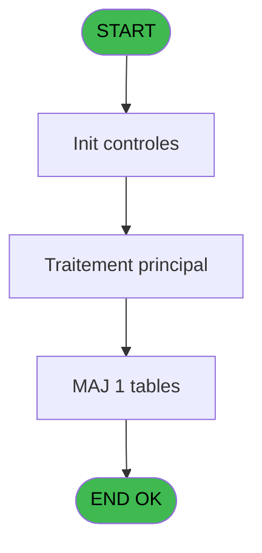
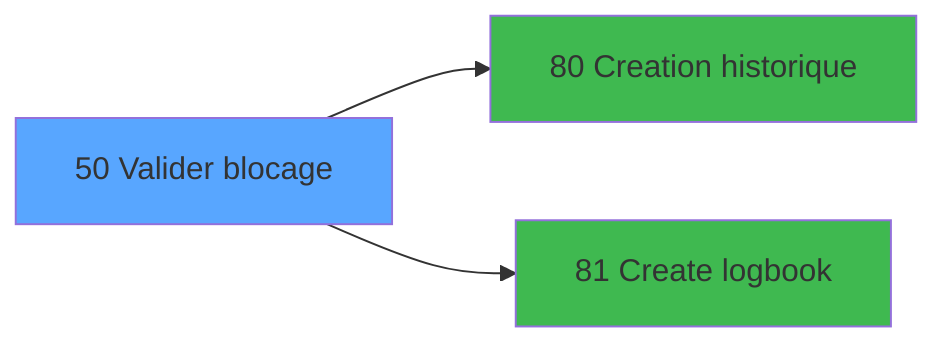

# WEL IDE 50 - Valider blocage

> **Analyse**: Phases 1-4 2026-02-03 21:29 -> 21:29 (10s) | Assemblage 21:29
> **Pipeline**: V7.2 Enrichi
> **Structure**: 4 onglets (Resume | Ecrans | Donnees | Connexions)

<!-- TAB:Resume -->

## 1. FICHE D'IDENTITE

| Attribut | Valeur |
|----------|--------|
| Projet | WEL |
| IDE Position | 50 |
| Nom Programme | Valider blocage |
| Fichier source | `Prg_50.xml` |
| Dossier IDE | Logement |
| Taches | 6 (0 ecrans visibles) |
| Tables modifiees | 1 |
| Programmes appeles | 2 |
| :warning: Statut | **ORPHELIN_POTENTIEL** |

## 2. DESCRIPTION FONCTIONNELLE

**Valider blocage** assure la gestion complete de ce processus.

Le flux de traitement s'organise en **4 blocs fonctionnels** :

- **Validation** (2 taches) : controles et verifications de coherence
- **Traitement** (2 taches) : traitements metier divers
- **Creation** (1 tache) : insertion d'enregistrements en base (mouvements, prestations)
- **Consultation** (1 tache) : ecrans de recherche, selection et consultation

**Donnees modifiees** : 1 tables en ecriture (hebergement______heb).

Detail : phases du traitement

#### Phase 1 : Traitement (2 taches)

- **50** - Bloquer logement
- **50.3** - Attribution N° blocage

#### Phase 2 : Validation (2 taches)

- **50.1** - Verification logement
- **50.2** - Verification logement

#### Phase 3 : Consultation (1 tache)

- **50.3.1** - Recherche n° blocage

#### Phase 4 : Creation (1 tache)

- **50.4** - Creation blocage

Delegue a : [Creation historique (IDE 80)](WEL-IDE-80.md), [Create logbook (IDE 81)](WEL-IDE-81.md)

#### Tables impactees

| Table | Operations | Role metier |
|-------|-----------|-------------|
| hebergement______heb | R/**W** (4 usages) | Hebergement (chambres) |

## 3. BLOCS FONCTIONNELS

### 3.1 Traitement (2 taches)

Traitements internes.

---

#### 50 - Bloquer logement

**Role** : Traitement : Bloquer logement.

---

#### 50.3 - Attribution N° blocage

**Role** : Traitement : Attribution N° blocage.
**Variables liees** : G (V0.N° blocage)

### 3.2 Validation (2 taches)

Controles de coherence : 2 taches verifient les donnees et conditions.

---

#### 50.1 - Verification logement

**Role** : Verification : Verification logement.

---

#### 50.2 - Verification logement

**Role** : Verification : Verification logement.

### 3.3 Consultation (1 tache)

Ecrans de recherche et consultation.

---

#### 50.3.1 - Recherche n° blocage

**Role** : Traitement : Recherche n° blocage.
**Variables liees** : G (V0.N° blocage)

### 3.4 Creation (1 tache)

Insertion de nouveaux enregistrements en base.

---

#### 50.4 - Creation blocage

**Role** : Creation d'enregistrement : Creation blocage.
**Variables liees** : G (V0.N° blocage)
**Delegue a** : [Creation historique (IDE 80)](WEL-IDE-80.md), [Create logbook (IDE 81)](WEL-IDE-81.md)

## 5. REGLES METIER

*(Aucune regle metier identifiee)*

## 6. CONTEXTE

- **Appele par**: (aucun)
- **Appelle**: 2 programmes | **Tables**: 1 (W:1 R:1 L:0) | **Taches**: 6 | **Expressions**: 11

<!-- TAB:Ecrans -->

## 8. ECRANS

*(Programme sans ecran visible)*

## 9. NAVIGATION

### 9.3 Structure hierarchique (6 taches)

| Position | Tache | Type | Dimensions | Bloc |
|----------|-------|------|------------|------|
| **50.1** | [**Bloquer logement** (50)](#t1) | - | - | Traitement |
| 50.1.1 | [Attribution N° blocage (50.3)](#t4) | - | - | |
| **50.2** | [**Verification logement** (50.1)](#t2) | - | - | Validation |
| 50.2.1 | [Verification logement (50.2)](#t3) | - | - | |
| **50.3** | [**Recherche n° blocage** (50.3.1)](#t5) | - | - | Consultation |
| **50.4** | [**Creation blocage** (50.4)](#t6) | - | - | Creation |

### 9.4 Algorigramme

> **Legende**: Vert = START/END OK | Rouge = END KO | Bleu = Decisions
> *Algorigramme auto-genere. Utiliser `/algorigramme` pour une synthese metier detaillee.*

<!-- TAB:Donnees -->

## 10. TABLES

### Tables utilisees (1)

| ID | Nom | Description | Type | R | W | L | Usages |
|----|-----|-------------|------|---|---|---|--------|
| 34 | hebergement______heb | Hebergement (chambres) | DB | R | **W** |   | 4 |

### Colonnes par table (1 / 1 tables avec colonnes identifiees)

Table 34 - hebergement______heb (R/**W**) - 4 usages

| Lettre | Variable | Acces | Type |
|--------|----------|-------|------|
| A | V1.Date/heure debut | W | Numeric |
| B | V1.Date/heure fin | W | Numeric |

## 11. VARIABLES

### 11.1 Parametres entrants (1)

Variables recues en parametre.

| Lettre | Nom | Type | Usage dans |
|--------|-----|------|-----------|
| A | P.Refresh view ? | Logical | 1x parametre entrant |

### 11.2 Autres (8)

Variables diverses.

| Lettre | Nom | Type | Usage dans |
|--------|-----|------|-----------|
| B | V0.Accord suite | Logical | 2x refs |
| C | V0.Operateur | Unicode | - |
| D | V0.Commentaire | Unicode | 1x refs |
| E | V0.Date debut | Date | - |
| F | V0.Date fin | Date | - |
| G | V0.N° blocage | Numeric | - |
| H | V0.User | Alpha | - |
| I | V0.Confirmation | Numeric | 1x refs |

## 12. EXPRESSIONS

**11 / 11 expressions decodees (100%)**

### 12.1 Repartition par type

| Type | Expressions | Regles |
|------|-------------|--------|
| CONSTANTE | 2 | 0 |
| OTHER | 1 | 0 |
| NEGATION | 2 | 0 |
| CONDITION | 1 | 0 |
| REFERENCE_VG | 4 | 0 |
| CONCATENATION | 1 | 0 |

### 12.2 Expressions cles par type

#### CONSTANTE (2 expressions)

| Type | IDE | Expression | Regle |
|------|-----|------------|-------|
| CONSTANTE | 8 | `'VBLOCROOM'` | - |
| CONSTANTE | 6 | `'BLOC'` | - |

#### OTHER (1 expressions)

| Type | IDE | Expression | Regle |
|------|-----|------------|-------|
| OTHER | 1 | `V0.Accord suite [B]` | - |

#### NEGATION (2 expressions)

| Type | IDE | Expression | Regle |
|------|-----|------------|-------|
| NEGATION | 4 | `NOT P.Refresh view ? [A]` | - |
| NEGATION | 2 | `NOT V0.Accord suite [B]` | - |

#### CONDITION (1 expressions)

| Type | IDE | Expression | Regle |
|------|-----|------------|-------|
| CONDITION | 3 | `V0.Confirmation [I]=6` | - |

#### REFERENCE_VG (4 expressions)

| Type | IDE | Expression | Regle |
|------|-----|------------|-------|
| REFERENCE_VG | 10 | `VG27` | - |
| REFERENCE_VG | 11 | `VG28` | - |
| REFERENCE_VG | 5 | `VG15` | - |
| REFERENCE_VG | 9 | `VG26` | - |

#### CONCATENATION (1 expressions)

| Type | IDE | Expression | Regle |
|------|-----|------------|-------|
| CONCATENATION | 7 | `MlsTrans('Blocking Room')&' '&Trim(VG11)&' '&':'&' '&Trim(V0.Commentaire [D])` | - |

<!-- TAB:Connexions -->

## 13. GRAPHE D'APPELS

### 13.1 Chaine depuis Main (Callers)

**Chemin**: (pas de callers directs)

### 13.2 Callers

| IDE | Nom Programme | Nb Appels |
|-----|---------------|-----------|
| - | (aucun) | - |

### 13.3 Callees (programmes appeles)

### 13.4 Detail Callees avec contexte

| IDE | Nom Programme | Appels | Contexte |
|-----|---------------|--------|----------|
| [80](WEL-IDE-80.md) | Creation historique | 1 | Historique/consultation |
| [81](WEL-IDE-81.md) | Create logbook | 1 | Sous-programme |

## 14. RECOMMANDATIONS MIGRATION

### 14.1 Profil du programme

| Metrique | Valeur | Impact migration |
|----------|--------|-----------------|
| Lignes de logique | 119 | Programme compact |
| Expressions | 11 | Peu de logique |
| Tables WRITE | 1 | Impact faible |
| Sous-programmes | 2 | Peu de dependances |
| Ecrans visibles | 0 | Ecran unique ou traitement batch |
| Code desactive | 0% (0 / 119) | Code sain |
| Regles metier | 0 | Pas de regle identifiee |

### 14.2 Plan de migration par bloc

#### Traitement (2 taches: 0 ecran, 2 traitements)

- **Strategie** : 2 service(s) backend injectable(s) (Domain Services).
- 2 sous-programme(s) a migrer ou a reutiliser depuis les services existants.
- Decomposer les taches en services unitaires testables.

#### Validation (2 taches: 0 ecran, 2 traitements)

- **Strategie** : FluentValidation avec validators specifiques.
- Chaque tache de validation -> un validator injectable

#### Consultation (1 tache: 0 ecran, 1 traitement)

- **Strategie** : Composants de recherche/selection en modales.

#### Creation (1 tache: 0 ecran, 1 traitement)

- **Strategie** : Repository pattern avec Entity Framework Core.
- Insertion via `IRepository<T>.CreateAsync()`

### 14.3 Dependances critiques

| Dependance | Type | Appels | Impact |
|------------|------|--------|--------|
| hebergement______heb | Table WRITE (Database) | 1x | Schema + repository |
| [Create logbook (IDE 81)](WEL-IDE-81.md) | Sous-programme | 1x | Normale - Sous-programme |
| [Creation historique (IDE 80)](WEL-IDE-80.md) | Sous-programme | 1x | Normale - Historique/consultation |

---
*Spec DETAILED generee par Pipeline V7.2 - 2026-02-03 21:29*
