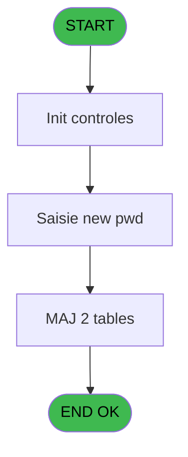

# WEL IDE 54 - Logon

> **Analyse**: Phases 1-4 2026-02-03 21:30 -> 21:30 (10s) | Assemblage 21:30
> **Pipeline**: V7.2 Enrichi
> **Structure**: 4 onglets (Resume | Ecrans | Donnees | Connexions)

<!-- TAB:Resume -->

## 1. FICHE D'IDENTITE

| Attribut | Valeur |
|----------|--------|
| Projet | WEL |
| IDE Position | 54 |
| Nom Programme | Logon |
| Fichier source | `Prg_54.xml` |
| Dossier IDE | Menu |
| Taches | 5 (0 ecrans visibles) |
| Tables modifiees | 2 |
| Programmes appeles | 1 |

## 2. DESCRIPTION FONCTIONNELLE

**Logon** assure la gestion complete de ce processus, accessible depuis [Main Program (IDE 1)](WEL-IDE-1.md).

Le flux de traitement s'organise en **1 blocs fonctionnels** :

- **Traitement** (5 taches) : traitements metier divers

**Donnees modifiees** : 2 tables en ecriture (utilisateur______uti, password_interdit).

Detail : phases du traitement

#### Phase 1 : Traitement (5 taches)

- **54** - Logon
- **54.1** - Saisir un nouveau mot de passe
- **54.1.1** - Supp pw provisoire
- **54.1.2** - Maj historique pwd
- **54.1.3** - suppr histo

Delegue a : [Lancement clavier (IDE 92)](WEL-IDE-92.md)

#### Tables impactees

| Table | Operations | Role metier |
|-------|-----------|-------------|
| password_interdit | **W**/L (4 usages) |  |
| utilisateur______uti | **W** (1 usages) |  |

## 3. BLOCS FONCTIONNELS

### 3.1 Traitement (5 taches)

Traitements internes.

---

#### 54 - Logon

**Role** : Traitement : Logon.

4 sous-taches directes

| Tache | Nom | Bloc |
|-------|-----|------|
| [54.1](#t2) | Saisir un nouveau mot de passe | Traitement |
| [54.1.1](#t3) | Supp pw provisoire | Traitement |
| [54.1.2](#t4) | Maj historique pwd | Traitement |
| [54.1.3](#t5) | suppr histo | Traitement |

**Delegue a** : [Lancement clavier (IDE 92)](WEL-IDE-92.md)

---

#### 54.1 - Saisir un nouveau mot de passe

**Role** : Creation d'enregistrement : Saisir un nouveau mot de passe.
**Delegue a** : [Lancement clavier (IDE 92)](WEL-IDE-92.md)

---

#### 54.1.1 - Supp pw provisoire

**Role** : Traitement : Supp pw provisoire.
**Variables liees** : E (L.Existe provisoire ?)
**Delegue a** : [Lancement clavier (IDE 92)](WEL-IDE-92.md)

---

#### 54.1.2 - Maj historique pwd

**Role** : Consultation/chargement : Maj historique pwd.
**Delegue a** : [Lancement clavier (IDE 92)](WEL-IDE-92.md)

---

#### 54.1.3 - suppr histo

**Role** : Traitement : suppr histo.
**Variables liees** : F (L.Existe histo ?)
**Delegue a** : [Lancement clavier (IDE 92)](WEL-IDE-92.md)

## 5. REGLES METIER

*(Aucune regle metier identifiee)*

## 6. CONTEXTE

- **Appele par**: [Main Program (IDE 1)](WEL-IDE-1.md)
- **Appelle**: 1 programmes | **Tables**: 3 (W:2 R:1 L:1) | **Taches**: 5 | **Expressions**: 32

<!-- TAB:Ecrans -->

## 8. ECRANS

*(Programme sans ecran visible)*

## 9. NAVIGATION

### 9.3 Structure hierarchique (5 taches)

| Position | Tache | Type | Dimensions | Bloc |
|----------|-------|------|------------|------|
| **54.1** | [**Logon** (54)](#t1) | - | - | Traitement |
| 54.1.1 | [Saisir un nouveau mot de passe (54.1)](#t2) | MDI | - | |
| 54.1.2 | [Supp pw provisoire (54.1.1)](#t3) | - | - | |
| 54.1.3 | [Maj historique pwd (54.1.2)](#t4) | - | - | |
| 54.1.4 | [suppr histo (54.1.3)](#t5) | - | - | |

### 9.4 Algorigramme

> **Legende**: Vert = START/END OK | Rouge = END KO | Bleu = Decisions
> *Algorigramme auto-genere. Utiliser `/algorigramme` pour une synthese metier detaillee.*

<!-- TAB:Donnees -->

## 10. TABLES

### Tables utilisees (3)

| ID | Nom | Description | Type | R | W | L | Usages |
|----|-----|-------------|------|---|---|---|--------|
| 718 | utilisateur______uti |  | DB |   | **W** |   | 1 |
| 746 | projet |  | DB | R |   |   | 1 |
| 748 | password_interdit |  | DB |   | **W** | L | 4 |

### Colonnes par table (2 / 3 tables avec colonnes identifiees)

Table 718 - utilisateur______uti (**W**) - 1 usages

*Table utilisee uniquement en Link ou aucune colonne Real identifiee dans le DataView.*

Table 746 - projet (R) - 1 usages

| Lettre | Variable | Acces | Type |
|--------|----------|-------|------|
| A | V.New PWD | R | Unicode |
| B | V.Confirme PWD | R | Unicode |
| C | V.Count histo | R | Numeric |
| D | Bt.Ok | R | Alpha |
| E | Bt.Cancel | R | Alpha |
| F | v.New MDP Crypté | R | Alpha |

Table 748 - password_interdit (**W**/L) - 4 usages

| Lettre | Variable | Acces | Type |
|--------|----------|-------|------|
| C | V.Password | W | Unicode |

## 11. VARIABLES

### 11.1 Parametres entrants (1)

Variables recues du programme appelant ([Main Program (IDE 1)](WEL-IDE-1.md)).

| Lettre | Nom | Type | Usage dans |
|--------|-----|------|-----------|
| A | P.Login ok ? | Logical | - |

### 11.2 Variables de session (7)

Variables persistantes pendant toute la session.

| Lettre | Nom | Type | Usage dans |
|--------|-----|------|-----------|
| B | V.Login | Unicode | 7x session |
| C | V.Password | Unicode | 3x session |
| L | V.Demande change MP ? | Logical | - |
| M | V.Existe resp gestion ? | Logical | - |
| N | V.Existe resp reception ? | Logical | 1x session |
| O | v.Clé Cryptage | Blob | - |
| P | v.MDP crypté | Alpha | - |

### 11.3 Autres (8)

Variables diverses.

| Lettre | Nom | Type | Usage dans |
|--------|-----|------|-----------|
| D | L.Existe user ? | Logical | 1x refs |
| E | L.Existe provisoire ? | Logical | - |
| F | L.Existe histo ? | Logical | - |
| G | L.Regles OK ? | Logical | 1x refs |
| H | Bt.Keyboard | Alpha | 1x refs |
| I | Bt.Ok | Alpha | 1x refs |
| J | Bt.Changer MP | Alpha | - |
| K | Bt.Cancel | Alpha | - |

Toutes les 16 variables (liste complete)

| Cat | Lettre | Nom Variable | Type |
|-----|--------|--------------|------|
| P0 | **A** | P.Login ok ? | Logical |
| V. | **B** | V.Login | Unicode |
| V. | **C** | V.Password | Unicode |
| V. | **L** | V.Demande change MP ? | Logical |
| V. | **M** | V.Existe resp gestion ? | Logical |
| V. | **N** | V.Existe resp reception ? | Logical |
| V. | **O** | v.Clé Cryptage | Blob |
| V. | **P** | v.MDP crypté | Alpha |
| Autre | **D** | L.Existe user ? | Logical |
| Autre | **E** | L.Existe provisoire ? | Logical |
| Autre | **F** | L.Existe histo ? | Logical |
| Autre | **G** | L.Regles OK ? | Logical |
| Autre | **H** | Bt.Keyboard | Alpha |
| Autre | **I** | Bt.Ok | Alpha |
| Autre | **J** | Bt.Changer MP | Alpha |
| Autre | **K** | Bt.Cancel | Alpha |

## 12. EXPRESSIONS

**32 / 32 expressions decodees (100%)**

### 12.1 Repartition par type

| Type | Expressions | Regles |
|------|-------------|--------|
| CONSTANTE | 7 | 0 |
| OTHER | 12 | 0 |
| NEGATION | 1 | 0 |
| CONDITION | 7 | 0 |
| CAST_LOGIQUE | 2 | 0 |
| CONCATENATION | 1 | 0 |
| REFERENCE_VG | 2 | 0 |

### 12.2 Expressions cles par type

#### CONSTANTE (7 expressions)

| Type | IDE | Expression | Regle |
|------|-----|------------|-------|
| CONSTANTE | 17 | `'RECEPTION'` | - |
| CONSTANTE | 20 | `'Supervisor'` | - |
| CONSTANTE | 27 | `'PASSWORD'` | - |
| CONSTANTE | 16 | `'O'` | - |
| CONSTANTE | 4 | `0` | - |
| ... | | *+2 autres* | |

#### OTHER (12 expressions)

| Type | IDE | Expression | Regle |
|------|-----|------------|-------|
| OTHER | 25 | `CtrlGoto('V.Login',0,0)` | - |
| OTHER | 22 | `ASCIIChr(13)&MlsTrans('OK')` | - |
| OTHER | 12 | `[S]` | - |
| OTHER | 32 | `GetPseudoTerminal ()` | - |
| OTHER | 30 | `NOT(VG69)` | - |
| ... | | *+7 autres* | |

#### NEGATION (1 expressions)

| Type | IDE | Expression | Regle |
|------|-----|------------|-------|
| NEGATION | 2 | `NOT L.Existe user ? [D] AND V.Login [B]<>'SUPERVIS'` | - |

#### CONDITION (7 expressions)

| Type | IDE | Expression | Regle |
|------|-----|------------|-------|
| CONDITION | 19 | `V.Password [C]<>'super'` | - |
| CONDITION | 23 | `VG51='TB'` | - |
| CONDITION | 24 | `Trim(V.Login [B])<>''` | - |
| CONDITION | 18 | `V.Login [B]='SUPERVIS' AND [Y] AND [AD]` | - |
| CONDITION | 3 | `[AW]<>Bt.Keyboard [H] OR V.Password [C]=''` | - |
| ... | | *+2 autres* | |

#### CAST_LOGIQUE (2 expressions)

| Type | IDE | Expression | Regle |
|------|-----|------------|-------|
| CAST_LOGIQUE | 26 | `INIPut('[MAGIC_LOGICAL_NAMES]club_user='&Trim(V.Login [B]),'FALSE'LOG)` | - |
| CAST_LOGIQUE | 5 | `'TRUE'LOG` | - |

#### CONCATENATION (1 expressions)

| Type | IDE | Expression | Regle |
|------|-----|------------|-------|
| CONCATENATION | 21 | `ASCIIChr(13)&MlsTrans('CHANGE')&ASCIIChr(13)&MlsTrans('PASSWORD')` | - |

#### REFERENCE_VG (2 expressions)

| Type | IDE | Expression | Regle |
|------|-----|------------|-------|
| REFERENCE_VG | 31 | `VG70` | - |
| REFERENCE_VG | 28 | `VG69` | - |

### 12.3 Toutes les expressions (32)

Voir les 32 expressions

#### CONSTANTE (7)

| IDE | Expression Decodee |
|-----|-------------------|
| 4 | `0` |
| 8 | `''` |
| 15 | `'GESTION'` |
| 16 | `'O'` |
| 17 | `'RECEPTION'` |
| 20 | `'Supervisor'` |
| 27 | `'PASSWORD'` |

#### OTHER (12)

| IDE | Expression Decodee |
|-----|-------------------|
| 1 | `V.Login [B]` |
| 6 | `Bt.Ok [I] OR NOT(V.Existe resp reception ? [N])` |
| 7 | `ExpCalc('6'EXP) OR NOT( [S])` |
| 9 | `NOT(ExpCalc('6'EXP))` |
| 10 | `L.Regles OK ? [G]` |
| 11 | `[S]` |
| 12 | `[S]` |
| 22 | `ASCIIChr(13)&MlsTrans('OK')` |
| 25 | `CtrlGoto('V.Login',0,0)` |
| 29 | `V.Password [C]` |
| 30 | `NOT(VG69)` |
| 32 | `GetPseudoTerminal ()` |

#### NEGATION (1)

| IDE | Expression Decodee |
|-----|-------------------|
| 2 | `NOT L.Existe user ? [D] AND V.Login [B]<>'SUPERVIS'` |

#### CONDITION (7)

| IDE | Expression Decodee |
|-----|-------------------|
| 3 | `[AW]<>Bt.Keyboard [H] OR V.Password [C]=''` |
| 13 | `LastClicked()<>'RETOUR'` |
| 14 | `V.Login [B]='SUPERVIS'` |
| 18 | `V.Login [B]='SUPERVIS' AND [Y] AND [AD]` |
| 19 | `V.Password [C]<>'super'` |
| 23 | `VG51='TB'` |
| 24 | `Trim(V.Login [B])<>''` |

#### CAST_LOGIQUE (2)

| IDE | Expression Decodee |
|-----|-------------------|
| 5 | `'TRUE'LOG` |
| 26 | `INIPut('[MAGIC_LOGICAL_NAMES]club_user='&Trim(V.Login [B]),'FALSE'LOG)` |

#### CONCATENATION (1)

| IDE | Expression Decodee |
|-----|-------------------|
| 21 | `ASCIIChr(13)&MlsTrans('CHANGE')&ASCIIChr(13)&MlsTrans('PASSWORD')` |

#### REFERENCE_VG (2)

| IDE | Expression Decodee |
|-----|-------------------|
| 28 | `VG69` |
| 31 | `VG70` |

<!-- TAB:Connexions -->

## 13. GRAPHE D'APPELS

### 13.1 Chaine depuis Main (Callers)

Main -> ... -> [Main Program (IDE 1)](WEL-IDE-1.md) -> **Logon (IDE 54)**

### 13.2 Callers

| IDE | Nom Programme | Nb Appels |
|-----|---------------|-----------|
| [1](WEL-IDE-1.md) | Main Program | 1 |

### 13.3 Callees (programmes appeles)

### 13.4 Detail Callees avec contexte

| IDE | Nom Programme | Appels | Contexte |
|-----|---------------|--------|----------|
| [92](WEL-IDE-92.md) | Lancement clavier | 4 | Sous-programme |

## 14. RECOMMANDATIONS MIGRATION

### 14.1 Profil du programme

| Metrique | Valeur | Impact migration |
|----------|--------|-----------------|
| Lignes de logique | 157 | Programme compact |
| Expressions | 32 | Peu de logique |
| Tables WRITE | 2 | Impact faible |
| Sous-programmes | 1 | Peu de dependances |
| Ecrans visibles | 0 | Ecran unique ou traitement batch |
| Code desactive | 5.7% (9 / 157) | A verifier |
| Regles metier | 0 | Pas de regle identifiee |

### 14.2 Plan de migration par bloc

#### Traitement (5 taches: 0 ecran, 5 traitements)

- **Strategie** : 5 service(s) backend injectable(s) (Domain Services).
- 1 sous-programme(s) a migrer ou a reutiliser depuis les services existants.
- Decomposer les taches en services unitaires testables.

### 14.3 Dependances critiques

| Dependance | Type | Appels | Impact |
|------------|------|--------|--------|
| utilisateur______uti | Table WRITE (Database) | 1x | Schema + repository |
| password_interdit | Table WRITE (Database) | 3x | Schema + repository |
| [Lancement clavier (IDE 92)](WEL-IDE-92.md) | Sous-programme | 4x | **CRITIQUE** - Sous-programme |

---
*Spec DETAILED generee par Pipeline V7.2 - 2026-02-03 21:30*
