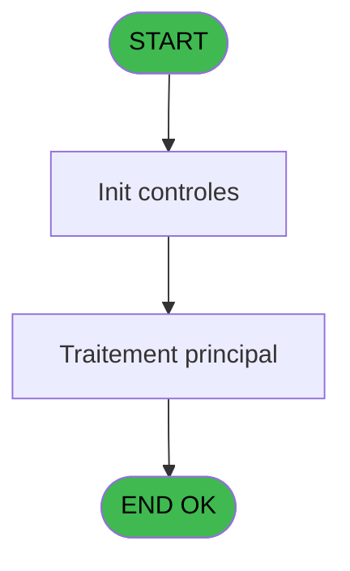
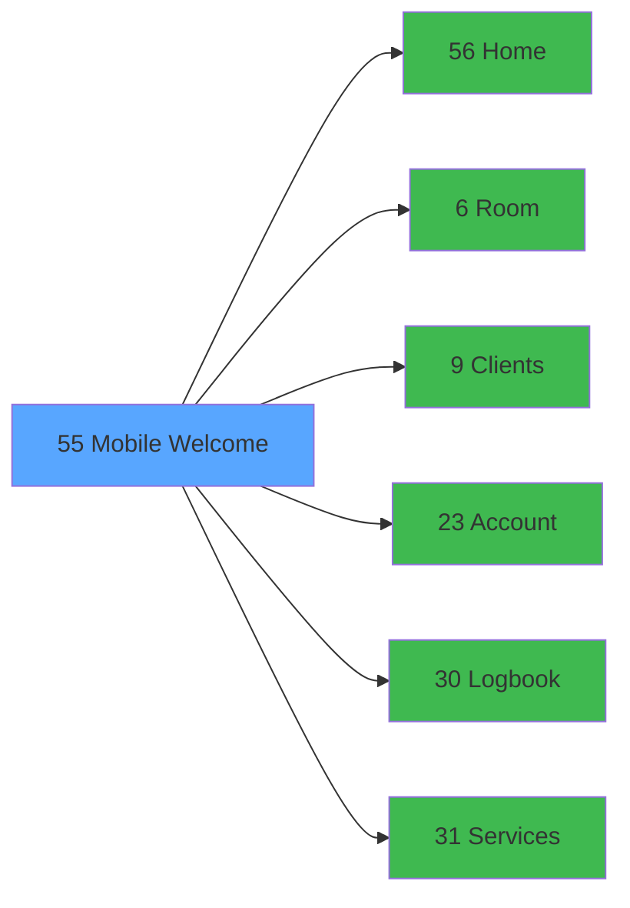

# WEL IDE 55 - Mobile Welcome

> **Analyse**: Phases 1-4 2026-02-03 21:30 -> 21:30 (11s) | Assemblage 21:30
> **Pipeline**: V7.2 Enrichi
> **Structure**: 4 onglets (Resume | Ecrans | Donnees | Connexions)

<!-- TAB:Resume -->

## 1. FICHE D'IDENTITE

| Attribut | Valeur |
|----------|--------|
| Projet | WEL |
| IDE Position | 55 |
| Nom Programme | Mobile Welcome |
| Fichier source | `Prg_55.xml` |
| Dossier IDE | Menu |
| Taches | 1 (0 ecrans visibles) |
| Tables modifiees | 0 |
| Programmes appeles | 6 |

## 2. DESCRIPTION FONCTIONNELLE

**Mobile Welcome** assure la gestion complete de ce processus, accessible depuis [Lancement (IDE 34)](WEL-IDE-34.md).

Le flux de traitement s'organise en **1 blocs fonctionnels** :

- **Traitement** (1 tache) : traitements metier divers

## 3. BLOCS FONCTIONNELS

### 3.1 Traitement (1 tache)

Traitements internes.

---

#### 55 - Mobile Welcome [[ECRAN]](#ecran-t1)

**Role** : Traitement : Mobile Welcome.
**Ecran** : 554 x 227 DLU | [Voir mockup](#ecran-t1)
**Delegue a** : [Home (IDE 56)](WEL-IDE-56.md), [Room (IDE 6)](WEL-IDE-6.md), [Clients (IDE 9)](WEL-IDE-9.md)

## 5. REGLES METIER

*(Aucune regle metier identifiee)*

## 6. CONTEXTE

- **Appele par**: [Lancement (IDE 34)](WEL-IDE-34.md)
- **Appelle**: 6 programmes | **Tables**: 0 (W:0 R:0 L:0) | **Taches**: 1 | **Expressions**: 19

<!-- TAB:Ecrans -->

## 8. ECRANS

*(Programme sans ecran visible)*

## 9. NAVIGATION

### 9.3 Structure hierarchique (1 tache)

| Position | Tache | Type | Dimensions | Bloc |
|----------|-------|------|------------|------|
| **55.1** | [**Mobile Welcome** (55)](#t1) [mockup](#ecran-t1) | - | 554x227 | Traitement |

### 9.4 Algorigramme

> **Legende**: Vert = START/END OK | Rouge = END KO | Bleu = Decisions
> *Algorigramme auto-genere. Utiliser `/algorigramme` pour une synthese metier detaillee.*

<!-- TAB:Donnees -->

## 10. TABLES

### Tables utilisees (0)

| ID | Nom | Description | Type | R | W | L | Usages |
|----|-----|-------------|------|---|---|---|--------|

### Colonnes par table (0 / 0 tables avec colonnes identifiees)

## 11. VARIABLES

### 11.1 Variables de session (2)

Variables persistantes pendant toute la session.

| Lettre | Nom | Type | Usage dans |
|--------|-----|------|-----------|
| A | v.Menu | Alpha | - |
| B | v.Fin | Logical | 1x session |

### 11.2 Autres (1)

Variables diverses.

| Lettre | Nom | Type | Usage dans |
|--------|-----|------|-----------|
| C | V0.Reponse | Numeric | 2x refs |

## 12. EXPRESSIONS

**19 / 19 expressions decodees (100%)**

### 12.1 Repartition par type

| Type | Expressions | Regles |
|------|-------------|--------|
| CAST_LOGIQUE | 1 | 0 |
| OTHER | 2 | 0 |
| CONDITION | 16 | 0 |

### 12.2 Expressions cles par type

#### CAST_LOGIQUE (1 expressions)

| Type | IDE | Expression | Regle |
|------|-----|------------|-------|
| CAST_LOGIQUE | 1 | `'TRUE'LOG` | - |

#### OTHER (2 expressions)

| Type | IDE | Expression | Regle |
|------|-----|------------|-------|
| OTHER | 18 | `LastClicked()` | - |
| OTHER | 2 | `v.Fin [B]` | - |

#### CONDITION (16 expressions)

| Type | IDE | Expression | Regle |
|------|-----|------------|-------|
| CONDITION | 13 | `VG1='CLIENT'` | - |
| CONDITION | 14 | `VG1='ROOM'` | - |
| CONDITION | 11 | `LastClicked ()='SERVICES'` | - |
| CONDITION | 12 | `VG1='HOME'` | - |
| CONDITION | 17 | `VG1='SERVICES'` | - |
| ... | | *+11 autres* | |

<!-- TAB:Connexions -->

## 13. GRAPHE D'APPELS

### 13.1 Chaine depuis Main (Callers)

Main -> ... -> [Lancement (IDE 34)](WEL-IDE-34.md) -> **Mobile Welcome (IDE 55)**

### 13.2 Callers

| IDE | Nom Programme | Nb Appels |
|-----|---------------|-----------|
| [34](WEL-IDE-34.md) | Lancement | 1 |

### 13.3 Callees (programmes appeles)

### 13.4 Detail Callees avec contexte

| IDE | Nom Programme | Appels | Contexte |
|-----|---------------|--------|----------|
| [56](WEL-IDE-56.md) | Home | 3 | Sous-programme |
| [6](WEL-IDE-6.md) | Room | 2 | Sous-programme |
| [9](WEL-IDE-9.md) | Clients | 2 | Sous-programme |
| [23](WEL-IDE-23.md) | Account | 2 | Sous-programme |
| [30](WEL-IDE-30.md) | Logbook | 2 | Sous-programme |
| [31](WEL-IDE-31.md) | Services | 2 | Sous-programme |

## 14. RECOMMANDATIONS MIGRATION

### 14.1 Profil du programme

| Metrique | Valeur | Impact migration |
|----------|--------|-----------------|
| Lignes de logique | 27 | Programme compact |
| Expressions | 19 | Peu de logique |
| Tables WRITE | 0 | Impact faible |
| Sous-programmes | 6 | Dependances moderees |
| Ecrans visibles | 0 | Ecran unique ou traitement batch |
| Code desactive | 0% (0 / 27) | Code sain |
| Regles metier | 0 | Pas de regle identifiee |

### 14.2 Plan de migration par bloc

#### Traitement (1 tache: 1 ecran, 0 traitement)

- **Strategie** : 1 composant(s) UI (Razor/React) avec formulaires et validation.
- 6 sous-programme(s) a migrer ou a reutiliser depuis les services existants.
- Decomposer les taches en services unitaires testables.

### 14.3 Dependances critiques

| Dependance | Type | Appels | Impact |
|------------|------|--------|--------|
| [Home (IDE 56)](WEL-IDE-56.md) | Sous-programme | 3x | **CRITIQUE** - Sous-programme |
| [Logbook (IDE 30)](WEL-IDE-30.md) | Sous-programme | 2x | Haute - Sous-programme |
| [Services (IDE 31)](WEL-IDE-31.md) | Sous-programme | 2x | Haute - Sous-programme |
| [Account (IDE 23)](WEL-IDE-23.md) | Sous-programme | 2x | Haute - Sous-programme |
| [Room (IDE 6)](WEL-IDE-6.md) | Sous-programme | 2x | Haute - Sous-programme |
| [Clients (IDE 9)](WEL-IDE-9.md) | Sous-programme | 2x | Haute - Sous-programme |

---
*Spec DETAILED generee par Pipeline V7.2 - 2026-02-03 21:30*
