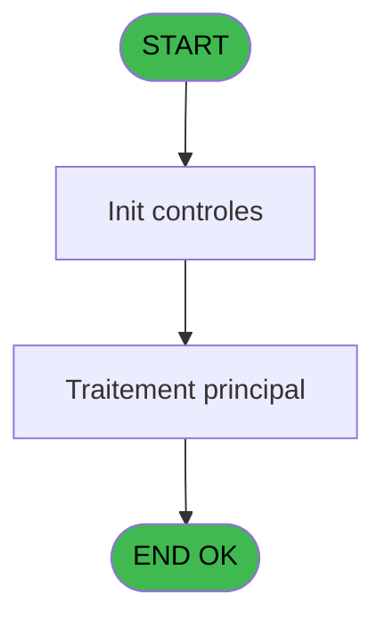
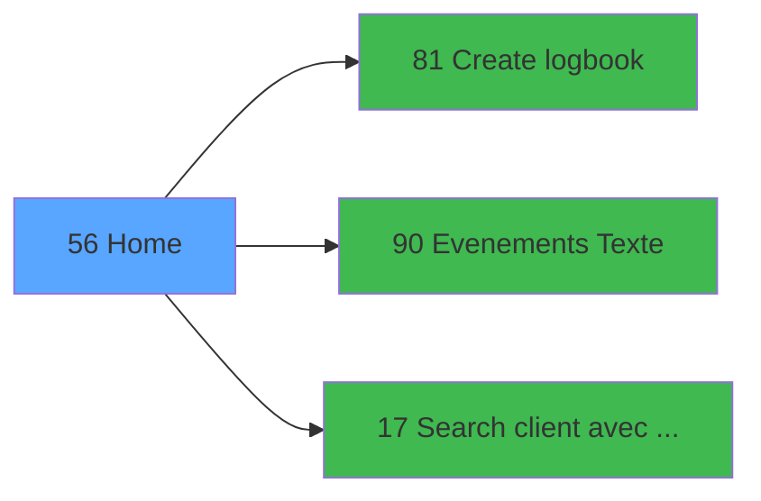

# WEL IDE 56 - Home

> **Analyse**: Phases 1-4 2026-02-03 21:30 -> 21:30 (11s) | Assemblage 21:30
> **Pipeline**: V7.2 Enrichi
> **Structure**: 4 onglets (Resume | Ecrans | Donnees | Connexions)

<!-- TAB:Resume -->

## 1. FICHE D'IDENTITE

| Attribut | Valeur |
|----------|--------|
| Projet | WEL |
| IDE Position | 56 |
| Nom Programme | Home |
| Fichier source | `Prg_56.xml` |
| Dossier IDE | Messagerie |
| Taches | 1 (0 ecrans visibles) |
| Tables modifiees | 0 |
| Programmes appeles | 3 |

## 2. DESCRIPTION FONCTIONNELLE

**Home** assure la gestion complete de ce processus, accessible depuis [Mobile Welcome (IDE 55)](WEL-IDE-55.md).

Le flux de traitement s'organise en **1 blocs fonctionnels** :

- **Traitement** (1 tache) : traitements metier divers

**Logique metier** : 8 regles identifiees couvrant conditions metier.

## 3. BLOCS FONCTIONNELS

### 3.1 Traitement (1 tache)

Traitements internes.

---

#### 56 - Home

**Role** : Traitement : Home.
**Delegue a** : [Evenements (Texte) (IDE 90)](WEL-IDE-90.md), [Search client avec liste (IDE 17)](WEL-IDE-17.md)

## 5. REGLES METIER

8 regles identifiees:

### Autres (8 regles)

#### [RM-001] Si [CM]='O' alors '%club_images%Deposit.png' sinon '')

| Element | Detail |
|---------|--------|
| **Condition** | `[CM]='O'` |
| **Si vrai** | '%club_images%Deposit.png' |
| **Si faux** | '') |
| **Variables** | E (age) |
| **Expression source** | Expression 7 : `IF([CM]='O','%club_images%Deposit.png','')` |
| **Exemple** | Si [CM]='O' → '%club_images%Deposit.png'. Sinon → '') |

#### [RM-002] Traitement si [DY] est non nul

| Element | Detail |
|---------|--------|
| **Condition** | `[DY]<>0` |
| **Si vrai** | '%club_images%Room_Vert.png' |
| **Si faux** | '%club_images%Room_Rouge.png') |
| **Variables** | E (age) |
| **Expression source** | Expression 12 : `IF([DY]<>0,'%club_images%Room_Vert.png','%club_images%Room_R` |
| **Exemple** | Si [DY]<>0 → '%club_images%Room_Vert.png'. Sinon → '%club_images%Room_Rouge.png') |

#### [RM-003] Si logf.loc_code_logement [BS] alors 213 sinon 214)

| Element | Detail |
|---------|--------|
| **Condition** | `logf.loc_code_logement [BS]` |
| **Si vrai** | 213 |
| **Si faux** | 214) |
| **Variables** | BS (logf.loc_code_logement) |
| **Expression source** | Expression 15 : `IF(logf.loc_code_logement [BS],213,214)` |
| **Exemple** | Si logf.loc_code_logement [BS] → 213. Sinon → 214) |

#### [RM-004] Si logf.loc_nom_complet [BU] alors 213 sinon 214)

| Element | Detail |
|---------|--------|
| **Condition** | `logf.loc_nom_complet [BU]` |
| **Si vrai** | 213 |
| **Si faux** | 214) |
| **Variables** | BU (logf.loc_nom_complet) |
| **Expression source** | Expression 16 : `IF(logf.loc_nom_complet [BU],213,214)` |
| **Exemple** | Si logf.loc_nom_complet [BU] → 213. Sinon → 214) |

#### [RM-005] Si logf.loc_occupation_std [BT] alors 213 sinon 214)

| Element | Detail |
|---------|--------|
| **Condition** | `logf.loc_occupation_std [BT]` |
| **Si vrai** | 213 |
| **Si faux** | 214) |
| **Variables** | BT (logf.loc_occupation_std) |
| **Expression source** | Expression 17 : `IF(logf.loc_occupation_std [BT],213,214)` |
| **Exemple** | Si logf.loc_occupation_std [BT] → 213. Sinon → 214) |

#### [RM-006] Si clof.clo_libelle [BV] alors 213 sinon 214)

| Element | Detail |
|---------|--------|
| **Condition** | `clof.clo_libelle [BV]` |
| **Si vrai** | 213 |
| **Si faux** | 214) |
| **Variables** | BV (clof.clo_libelle) |
| **Expression source** | Expression 18 : `IF(clof.clo_libelle [BV],213,214)` |
| **Exemple** | Si clof.clo_libelle [BV] → 213. Sinon → 214) |

#### [RM-007] Si v.nom_logement [BW] alors 213 sinon 214)

| Element | Detail |
|---------|--------|
| **Condition** | `v.nom_logement [BW]` |
| **Si vrai** | 213 |
| **Si faux** | 214) |
| **Variables** | BW (v.nom_logement) |
| **Expression source** | Expression 19 : `IF(v.nom_logement [BW],213,214)` |
| **Exemple** | Si v.nom_logement [BW] → 213. Sinon → 214) |

#### [RM-008] Si ISNULL([CX]) AND Trim([CX])<>'' est FAUX, branche alternative

| Element | Detail |
|---------|--------|
| **Condition** | `NOT ISNULL([CX]) AND Trim([CX])<>''` |
| **Si vrai** | [CX] |
| **Si faux** | IF(Date()<[EF],[DF],IF(Date()>[EG],[DO],''))) |
| **Expression source** | Expression 45 : `IF(NOT ISNULL([CX]) AND Trim([CX])<>'',[CX],IF(Date()<[EF],[` |
| **Exemple** | Si NOT ISNULL([CX]) AND Trim([CX])<>'' → [CX]. Sinon → IF(Date()<[EF],[DF],IF(Date()>[EG],[DO],''))) |

## 6. CONTEXTE

- **Appele par**: [Mobile Welcome (IDE 55)](WEL-IDE-55.md)
- **Appelle**: 3 programmes | **Tables**: 0 (W:0 R:0 L:0) | **Taches**: 1 | **Expressions**: 54

<!-- TAB:Ecrans -->

## 8. ECRANS

*(Programme sans ecran visible)*

## 9. NAVIGATION

### 9.3 Structure hierarchique (1 tache)

| Position | Tache | Type | Dimensions | Bloc |
|----------|-------|------|------------|------|
| **56.1** | [**Home** (56)](#t1) | Modal | - | Traitement |

### 9.4 Algorigramme

> **Legende**: Vert = START/END OK | Rouge = END KO | Bleu = Decisions
> *Algorigramme auto-genere. Utiliser `/algorigramme` pour une synthese metier detaillee.*

<!-- TAB:Donnees -->

## 10. TABLES

### Tables utilisees (0)

| ID | Nom | Description | Type | R | W | L | Usages |
|----|-----|-------------|------|---|---|---|--------|

### Colonnes par table (0 / 0 tables avec colonnes identifiees)

## 11. VARIABLES

### 11.1 Variables de session (10)

Variables persistantes pendant toute la session.

| Lettre | Nom | Type | Usage dans |
|--------|-----|------|-----------|
| H | V.Date debut | Date | - |
| J | V.Date fin | Date | - |
| BW | v.nom_logement | Unicode | 1x session |
| BX | v.type hebergement | Unicode | 1x session |
| BY | v.complement type | Alpha | - |
| BZ | v.Date menage | Date | - |
| CA | v.code logement | Unicode | - |
| CB | v.occupation standard | Numeric | - |
| CC | v.nom complet | Unicode | - |
| CD | v.libelle logement | Unicode | - |

### 11.2 Autres (53)

Variables diverses.

| Lettre | Nom | Type | Usage dans |
|--------|-----|------|-----------|
| A | numero_compte | Numeric | - |
| B | filiation_compte | Numeric | - |
| C | nom_personne | Unicode | - |
| D | prenom_personne | Unicode | - |
| E | age | Numeric | 2x refs |
| F | gmr_sexe | Unicode | - |
| G | date_debut | Alpha | 3x refs |
| I | date_fin | Alpha | 3x refs |
| K | cgm_garanti | Unicode | - |
| L | seminaire | Unicode | - |
| M | gmr_qualite | Unicode | - |
| N | arr.heb_heure_arr | Unicode | - |
| O | arr.heb_nom_logement_arr | Unicode | - |
| P | dep.heb_heure_dep | Unicode | - |
| Q | dep.heb_nom_logement_dep | Unicode | - |
| R | libelle fidelisation | Unicode | - |
| S | couleur fidelisation | Numeric | - |
| T | ema_telephone_portable | Unicode | - |
| U | ema_email | Unicode | - |
| V | heb.heb_nom_logement | Unicode | - |
| W | heb.heb_type_hebergement | Unicode | - |
| X | heb.heb_complement_type | Unicode | - |
| Y | logl.loc_code_menage | Alpha | - |
| Z | logl.date menage | Date | - |
| BA | logl.loc_code_logement | Unicode | - |
| BB | logl.loc_occupation_std | Numeric | - |
| BC | logl.loc_nom_complet | Unicode | - |
| BD | clo.clo_libelle | Unicode | - |
| BE | past.heb_nom_logement | Unicode | - |
| BF | past.heb_type_hebergement | Unicode | - |
| BG | past.heb_complement_type | Unicode | - |
| BH | logp.loc_code_menage | Alpha | - |
| BI | logp.date menage | Date | - |
| BJ | logp.loc_code_logement | Unicode | - |
| BK | logp.loc_occupation_std | Numeric | - |
| BL | logp.loc_nom_complet | Unicode | - |
| BM | clop.clo_libelle | Unicode | - |
| BN | fut.heb_nom_logement | Unicode | - |
| BO | fut.heb_type_hebergement | Unicode | - |
| BP | fut.heb_complement_type | Unicode | - |
| BQ | logf.loc_code_menage | Alpha | - |
| BR | logf.date menage | Date | - |
| BS | logf.loc_code_logement | Unicode | 1x refs |
| BT | logf.loc_occupation_std | Numeric | 1x refs |
| BU | logf.loc_nom_complet | Unicode | 1x refs |
| BV | clof.clo_libelle | Unicode | 1x refs |
| CE | V0.All | Logical | 1x refs |
| CF | V0.Arriving | Logical | 1x refs |
| CG | V0.Presents | Logical | 2x refs |
| CH | V0.Departing | Logical | 2x refs |
| CI | V0.To date | Logical | 1x refs |
| CJ | V0.Date reference | Date | 1x refs |
| CK | V0.Refresh view | Logical | 1x refs |

Toutes les 63 variables (liste complete)

| Cat | Lettre | Nom Variable | Type |
|-----|--------|--------------|------|
| V. | **H** | V.Date debut | Date |
| V. | **J** | V.Date fin | Date |
| V. | **BW** | v.nom_logement | Unicode |
| V. | **BX** | v.type hebergement | Unicode |
| V. | **BY** | v.complement type | Alpha |
| V. | **BZ** | v.Date menage | Date |
| V. | **CA** | v.code logement | Unicode |
| V. | **CB** | v.occupation standard | Numeric |
| V. | **CC** | v.nom complet | Unicode |
| V. | **CD** | v.libelle logement | Unicode |
| Autre | **A** | numero_compte | Numeric |
| Autre | **B** | filiation_compte | Numeric |
| Autre | **C** | nom_personne | Unicode |
| Autre | **D** | prenom_personne | Unicode |
| Autre | **E** | age | Numeric |
| Autre | **F** | gmr_sexe | Unicode |
| Autre | **G** | date_debut | Alpha |
| Autre | **I** | date_fin | Alpha |
| Autre | **K** | cgm_garanti | Unicode |
| Autre | **L** | seminaire | Unicode |
| Autre | **M** | gmr_qualite | Unicode |
| Autre | **N** | arr.heb_heure_arr | Unicode |
| Autre | **O** | arr.heb_nom_logement_arr | Unicode |
| Autre | **P** | dep.heb_heure_dep | Unicode |
| Autre | **Q** | dep.heb_nom_logement_dep | Unicode |
| Autre | **R** | libelle fidelisation | Unicode |
| Autre | **S** | couleur fidelisation | Numeric |
| Autre | **T** | ema_telephone_portable | Unicode |
| Autre | **U** | ema_email | Unicode |
| Autre | **V** | heb.heb_nom_logement | Unicode |
| Autre | **W** | heb.heb_type_hebergement | Unicode |
| Autre | **X** | heb.heb_complement_type | Unicode |
| Autre | **Y** | logl.loc_code_menage | Alpha |
| Autre | **Z** | logl.date menage | Date |
| Autre | **BA** | logl.loc_code_logement | Unicode |
| Autre | **BB** | logl.loc_occupation_std | Numeric |
| Autre | **BC** | logl.loc_nom_complet | Unicode |
| Autre | **BD** | clo.clo_libelle | Unicode |
| Autre | **BE** | past.heb_nom_logement | Unicode |
| Autre | **BF** | past.heb_type_hebergement | Unicode |
| Autre | **BG** | past.heb_complement_type | Unicode |
| Autre | **BH** | logp.loc_code_menage | Alpha |
| Autre | **BI** | logp.date menage | Date |
| Autre | **BJ** | logp.loc_code_logement | Unicode |
| Autre | **BK** | logp.loc_occupation_std | Numeric |
| Autre | **BL** | logp.loc_nom_complet | Unicode |
| Autre | **BM** | clop.clo_libelle | Unicode |
| Autre | **BN** | fut.heb_nom_logement | Unicode |
| Autre | **BO** | fut.heb_type_hebergement | Unicode |
| Autre | **BP** | fut.heb_complement_type | Unicode |
| Autre | **BQ** | logf.loc_code_menage | Alpha |
| Autre | **BR** | logf.date menage | Date |
| Autre | **BS** | logf.loc_code_logement | Unicode |
| Autre | **BT** | logf.loc_occupation_std | Numeric |
| Autre | **BU** | logf.loc_nom_complet | Unicode |
| Autre | **BV** | clof.clo_libelle | Unicode |
| Autre | **CE** | V0.All | Logical |
| Autre | **CF** | V0.Arriving | Logical |
| Autre | **CG** | V0.Presents | Logical |
| Autre | **CH** | V0.Departing | Logical |
| Autre | **CI** | V0.To date | Logical |
| Autre | **CJ** | V0.Date reference | Date |
| Autre | **CK** | V0.Refresh view | Logical |

## 12. EXPRESSIONS

**54 / 54 expressions decodees (100%)**

### 12.1 Repartition par type

| Type | Expressions | Regles |
|------|-------------|--------|
| CONCATENATION | 1 | 0 |
| FORMAT | 5 | 0 |
| CONDITION | 17 | 8 |
| CONSTANTE | 2 | 0 |
| DATE | 6 | 0 |
| OTHER | 17 | 0 |
| CAST_LOGIQUE | 2 | 0 |
| NEGATION | 1 | 0 |
| STRING | 3 | 0 |

### 12.2 Expressions cles par type

#### CONCATENATION (1 expressions)

| Type | IDE | Expression | Regle |
|------|-----|------------|-------|
| CONCATENATION | 11 | `Trim([DW])&'-'&Trim([DX])` | - |

#### FORMAT (5 expressions)

| Type | IDE | Expression | Regle |
|------|-----|------------|-------|
| FORMAT | 23 | `'and date_debut<='''&Trim(DStr(Date(),'YYYYMMDD'))&''' and date_fin>='''&Trim(DStr(Date(),'YYYYMMDD'))&''''` | - |
| FORMAT | 26 | `'and date_debut='''&Trim(DStr(v.type hebergement [BX],'YYYYMMDD'))&''' OR date_debut='''&Trim(DStr(v.type hebergement [BX],'YYYYMMDD'))&''' OR (date_debut<='''&Trim(DStr(v.type hebergement [BX],'YYYYMMDD'))&''' and date_fin>='''&Trim(DStr(v.type hebergement [BX],'YYYYMMDD'))&''''&')'` | - |
| FORMAT | 22 | `'and date_debut='''&Trim(DStr(Date(),'YYYYMMDD'))&''''` | - |
| FORMAT | 13 | `Trim(Str(V0.To date [CI],'2P0'))&' - '&Trim(V0.Date reference [CJ])` | - |
| FORMAT | 21 | `'and date_fin='''&Trim(DStr(Date(),'YYYYMMDD'))&''''` | - |

#### CONDITION (17 expressions)

| Type | IDE | Expression | Regle |
|------|-----|------------|-------|
| CONDITION | 18 | `IF(clof.clo_libelle [BV],213,214)` | [RM-006](#rm-RM-006) |
| CONDITION | 17 | `IF(logf.loc_occupation_std [BT],213,214)` | [RM-005](#rm-RM-005) |
| CONDITION | 45 | `IF(NOT ISNULL([CX]) AND Trim([CX])<>'',[CX],IF(Date()<[EF],[DF],IF(Date()>[EG],[DO],'')))` | [RM-008](#rm-RM-008) |
| CONDITION | 19 | `IF(v.nom_logement [BW],213,214)` | [RM-007](#rm-RM-007) |
| CONDITION | 12 | `IF([DY]<>0,'%club_images%Room_Vert.png','%club_images%Room_Rouge.png')` | [RM-002](#rm-RM-002) |
| ... | | *+12 autres* | |

#### CONSTANTE (2 expressions)

| Type | IDE | Expression | Regle |
|------|-----|------------|-------|
| CONSTANTE | 32 | `'HOME'` | - |
| CONSTANTE | 24 | `''` | - |

#### DATE (6 expressions)

| Type | IDE | Expression | Regle |
|------|-----|------------|-------|
| DATE | 39 | `DVal([DJ],'YYYYMMDD')` | - |
| DATE | 40 | `DVal([DR],'YYYYMMDD')` | - |
| DATE | 41 | `DVal([DA],'YYYYMMDD')` | - |
| DATE | 27 | `Date()` | - |
| DATE | 37 | `DVal(V0.Refresh view [CK],'YYYYMMDD')` | - |
| ... | | *+1 autres* | |

#### OTHER (17 expressions)

| Type | IDE | Expression | Regle |
|------|-----|------------|-------|
| OTHER | 30 | `[DV]` | - |
| OTHER | 31 | `[CO]` | - |
| OTHER | 28 | `[DV]` | - |
| OTHER | 29 | `IsFirstRecordCycle(0)` | - |
| OTHER | 43 | `V0.Presents [CG]` | - |
| ... | | *+12 autres* | |

#### CAST_LOGIQUE (2 expressions)

| Type | IDE | Expression | Regle |
|------|-----|------------|-------|
| CAST_LOGIQUE | 20 | `'FALSE'LOG` | - |
| CAST_LOGIQUE | 14 | `'TRUE'LOG` | - |

#### NEGATION (1 expressions)

| Type | IDE | Expression | Regle |
|------|-----|------------|-------|
| NEGATION | 25 | `NOT EmptyDataview(0)` | - |

#### STRING (3 expressions)

| Type | IDE | Expression | Regle |
|------|-----|------------|-------|
| STRING | 36 | `Trim(VG8)` | - |
| STRING | 35 | `Trim(VG7)` | - |
| STRING | 34 | `Trim(VG6)` | - |

### 12.3 Toutes les expressions (54)

Voir les 54 expressions

#### CONCATENATION (1)

| IDE | Expression Decodee |
|-----|-------------------|
| 11 | `Trim([DW])&'-'&Trim([DX])` |

#### FORMAT (5)

| IDE | Expression Decodee |
|-----|-------------------|
| 13 | `Trim(Str(V0.To date [CI],'2P0'))&' - '&Trim(V0.Date reference [CJ])` |
| 21 | `'and date_fin='''&Trim(DStr(Date(),'YYYYMMDD'))&''''` |
| 22 | `'and date_debut='''&Trim(DStr(Date(),'YYYYMMDD'))&''''` |
| 23 | `'and date_debut<='''&Trim(DStr(Date(),'YYYYMMDD'))&''' and date_fin>='''&Trim(DStr(Date(),'YYYYMMDD'))&''''` |
| 26 | `'and date_debut='''&Trim(DStr(v.type hebergement [BX],'YYYYMMDD'))&''' OR date_debut='''&Trim(DStr(v.type hebergement [BX],'YYYYMMDD'))&''' OR (date_debut<='''&Trim(DStr(v.type hebergement [BX],'YYYYMMDD'))&''' and date_fin>='''&Trim(DStr(v.type hebergement [BX],'YYYYMMDD'))&''''&')'` |

#### CONDITION (17)

| IDE | Expression Decodee |
|-----|-------------------|
| 7 | `IF([CM]='O','%club_images%Deposit.png','')` |
| 12 | `IF([DY]<>0,'%club_images%Room_Vert.png','%club_images%Room_Rouge.png')` |
| 15 | `IF(logf.loc_code_logement [BS],213,214)` |
| 16 | `IF(logf.loc_nom_complet [BU],213,214)` |
| 17 | `IF(logf.loc_occupation_std [BT],213,214)` |
| 18 | `IF(clof.clo_libelle [BV],213,214)` |
| 19 | `IF(v.nom_logement [BW],213,214)` |
| 45 | `IF(NOT ISNULL([CX]) AND Trim([CX])<>'',[CX],IF(Date()<[EF],[DF],IF(Date()>[EG],[DO],'')))` |
| 48 | `IF(NOT ISNULL([CX]) AND Trim([CX])<>'',[CY],IF(Date()<[EG],[DH],IF(Date()>[EG],[DP],'')))` |
| 49 | `IF(NOT ISNULL([CX]) AND Trim([CX])<>'',[CZ],IF(Date()<[EF],[DI],IF(Date()>[EG],[DQ],'')))` |
| 50 | `IF(NOT ISNULL([CX]) AND Trim([CX])<>'',[EK],IF(Date()<[EF],[EH],IF(Date()>[EG],[EI],0)))` |
| 51 | `IF(NOT ISNULL([CX]) AND Trim([CX])<>'',[DB],IF(Date()<[EF],[DK],IF(Date()>[EG],[DG],'')))` |
| 52 | `IF(NOT ISNULL([CX]) AND Trim([CX])<>'',[DC],IF(Date()<[EF],[DL],IF(Date()>[EG],[DS],0)))` |
| 53 | `IF(NOT ISNULL([CX]) AND Trim([CX])<>'',[DD],IF(Date()<[EF],[DM],IF(Date()>[EG],[DT],'')))` |
| 54 | `IF(NOT ISNULL([CX]) AND Trim([CX])<>'',[DE],IF(Date()<[EF],[DN],IF(Date()>[EG],[DU],'')))` |
| 46 | `CndRange(Trim(VG3)<>'',VG3)` |
| 47 | `CndRange(Trim(VG4)<>'',VG4)` |

#### CONSTANTE (2)

| IDE | Expression Decodee |
|-----|-------------------|
| 24 | `''` |
| 32 | `'HOME'` |

#### DATE (6)

| IDE | Expression Decodee |
|-----|-------------------|
| 27 | `Date()` |
| 37 | `DVal(V0.Refresh view [CK],'YYYYMMDD')` |
| 38 | `DVal([CL],'YYYYMMDD')` |
| 39 | `DVal([DJ],'YYYYMMDD')` |
| 40 | `DVal([DR],'YYYYMMDD')` |
| 41 | `DVal([DA],'YYYYMMDD')` |

#### OTHER (17)

| IDE | Expression Decodee |
|-----|-------------------|
| 1 | `MlsTrans ('Call Home')` |
| 2 | `MlsTrans ('Call Arriving')` |
| 3 | `MlsTrans ('Call Departing')` |
| 4 | `MlsTrans ('Call Presents')` |
| 5 | `MlsTrans ('Call All')` |
| 6 | `MlsTrans ('Call Date')` |
| 8 | `LocateAdd('V0.Presents [CG]'VAR,VG3,VG3)` |
| 9 | `LocateAdd('V0.Departing [CH]'VAR,VG4,VG4)` |
| 10 | `LocateReset(0)` |
| 28 | `[DV]` |
| 29 | `IsFirstRecordCycle(0)` |
| 30 | `[DV]` |
| 31 | `[CO]` |
| 33 | `V0.All [CE]` |
| 42 | `V0.Arriving [CF]` |
| 43 | `V0.Presents [CG]` |
| 44 | `V0.Departing [CH]` |

#### CAST_LOGIQUE (2)

| IDE | Expression Decodee |
|-----|-------------------|
| 14 | `'TRUE'LOG` |
| 20 | `'FALSE'LOG` |

#### NEGATION (1)

| IDE | Expression Decodee |
|-----|-------------------|
| 25 | `NOT EmptyDataview(0)` |

#### STRING (3)

| IDE | Expression Decodee |
|-----|-------------------|
| 34 | `Trim(VG6)` |
| 35 | `Trim(VG7)` |
| 36 | `Trim(VG8)` |

<!-- TAB:Connexions -->

## 13. GRAPHE D'APPELS

### 13.1 Chaine depuis Main (Callers)

Main -> ... -> [Mobile Welcome (IDE 55)](WEL-IDE-55.md) -> **Home (IDE 56)**

### 13.2 Callers

| IDE | Nom Programme | Nb Appels |
|-----|---------------|-----------|
| [55](WEL-IDE-55.md) | Mobile Welcome | 3 |

### 13.3 Callees (programmes appeles)

### 13.4 Detail Callees avec contexte

| IDE | Nom Programme | Appels | Contexte |
|-----|---------------|--------|----------|
| [81](WEL-IDE-81.md) | Create logbook | 6 | Sous-programme |
| [90](WEL-IDE-90.md) | Evenements (Texte) | 2 | Sous-programme |
| [17](WEL-IDE-17.md) | Search client avec liste | 1 | Configuration impression |

## 14. RECOMMANDATIONS MIGRATION

### 14.1 Profil du programme

| Metrique | Valeur | Impact migration |
|----------|--------|-----------------|
| Lignes de logique | 130 | Programme compact |
| Expressions | 54 | Logique moderee |
| Tables WRITE | 0 | Impact faible |
| Sous-programmes | 3 | Peu de dependances |
| Ecrans visibles | 0 | Ecran unique ou traitement batch |
| Code desactive | 0% (0 / 130) | Code sain |
| Regles metier | 8 | Quelques regles a preserver |

### 14.2 Plan de migration par bloc

#### Traitement (1 tache: 0 ecran, 1 traitement)

- **Strategie** : 1 service(s) backend injectable(s) (Domain Services).
- 3 sous-programme(s) a migrer ou a reutiliser depuis les services existants.
- Decomposer les taches en services unitaires testables.

### 14.3 Dependances critiques

| Dependance | Type | Appels | Impact |
|------------|------|--------|--------|
| [Create logbook (IDE 81)](WEL-IDE-81.md) | Sous-programme | 6x | **CRITIQUE** - Sous-programme |
| [Evenements (Texte) (IDE 90)](WEL-IDE-90.md) | Sous-programme | 2x | Haute - Sous-programme |
| [Search client avec liste (IDE 17)](WEL-IDE-17.md) | Sous-programme | 1x | Normale - Configuration impression |

---
*Spec DETAILED generee par Pipeline V7.2 - 2026-02-03 21:31*
