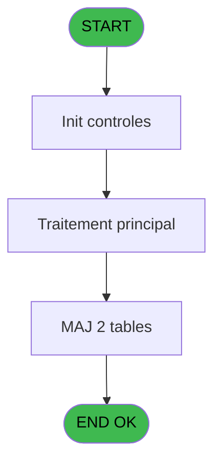
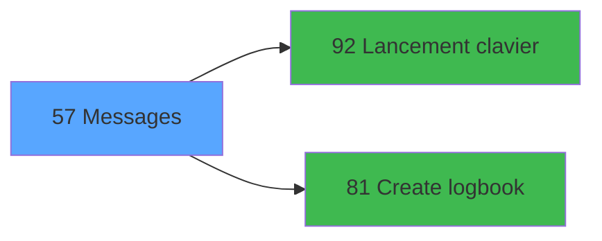

# WEL IDE 57 - Messages

> **Analyse**: Phases 1-4 2026-02-03 21:31 -> 21:31 (11s) | Assemblage 21:31
> **Pipeline**: V7.2 Enrichi
> **Structure**: 4 onglets (Resume | Ecrans | Donnees | Connexions)

<!-- TAB:Resume -->

## 1. FICHE D'IDENTITE

| Attribut | Valeur |
|----------|--------|
| Projet | WEL |
| IDE Position | 57 |
| Nom Programme | Messages |
| Fichier source | `Prg_57.xml` |
| Dossier IDE | Phone |
| Taches | 2 (0 ecrans visibles) |
| Tables modifiees | 2 |
| Programmes appeles | 2 |
| :warning: Statut | **ORPHELIN_POTENTIEL** |

## 2. DESCRIPTION FONCTIONNELLE

**Messages** assure la gestion complete de ce processus.

Le flux de traitement s'organise en **2 blocs fonctionnels** :

- **Calcul** (1 tache) : calculs de montants, stocks ou compteurs
- **Traitement** (1 tache) : traitements metier divers

**Donnees modifiees** : 2 tables en ecriture (compteurs________cpt, fichier_messagerie).

**Logique metier** : 2 regles identifiees couvrant conditions metier.

Detail : phases du traitement

#### Phase 1 : Traitement (1 tache)

- **57** - Messages

Delegue a : [Lancement clavier (IDE 92)](WEL-IDE-92.md)

#### Phase 2 : Calcul (1 tache)

- **57.1** - Compteur Message

#### Tables impactees

| Table | Operations | Role metier |
|-------|-----------|-------------|
| fichier_messagerie | **W** (1 usages) |  |
| compteurs________cpt | **W** (1 usages) | Comptes GM (generaux) |

## 3. BLOCS FONCTIONNELS

### 3.1 Traitement (1 tache)

Traitements internes.

---

#### 57 - Messages

**Role** : Traitement : Messages.
**Delegue a** : [Lancement clavier (IDE 92)](WEL-IDE-92.md)

### 3.2 Calcul (1 tache)

Calculs metier : montants, stocks, compteurs.

---

#### 57.1 - Compteur Message

**Role** : Calcul : Compteur Message.
**Variables liees** : B (v0.Compteur)

## 5. REGLES METIER

2 regles identifiees:

### Autres (2 regles)

#### [RM-001] Si [E]='N' alors 180 sinon 184)

| Element | Detail |
|---------|--------|
| **Condition** | `[E]='N'` |
| **Si vrai** | 180 |
| **Si faux** | 184) |
| **Expression source** | Expression 13 : `IF([E]='N',180, 184)` |
| **Exemple** | Si [E]='N' → 180. Sinon → 184) |

#### [RM-002] Si [E] vaut 'O' alors 'N', sinon 'O'

| Element | Detail |
|---------|--------|
| **Condition** | `[E]='O'` |
| **Si vrai** | 'N' |
| **Si faux** | 'O') |
| **Expression source** | Expression 24 : `IF([E]='O','N','O')` |
| **Exemple** | Si [E]='O' → 'N'. Sinon → 'O') |

## 6. CONTEXTE

- **Appele par**: (aucun)
- **Appelle**: 2 programmes | **Tables**: 2 (W:2 R:0 L:0) | **Taches**: 2 | **Expressions**: 24

<!-- TAB:Ecrans -->

## 8. ECRANS

*(Programme sans ecran visible)*

## 9. NAVIGATION

### 9.3 Structure hierarchique (2 taches)

| Position | Tache | Type | Dimensions | Bloc |
|----------|-------|------|------------|------|
| **57.1** | [**Messages** (57)](#t1) | - | - | Traitement |
| **57.2** | [**Compteur Message** (57.1)](#t2) | - | - | Calcul |

### 9.4 Algorigramme

> **Legende**: Vert = START/END OK | Rouge = END KO | Bleu = Decisions
> *Algorigramme auto-genere. Utiliser `/algorigramme` pour une synthese metier detaillee.*

<!-- TAB:Donnees -->

## 10. TABLES

### Tables utilisees (2)

| ID | Nom | Description | Type | R | W | L | Usages |
|----|-----|-------------|------|---|---|---|--------|
| 68 | compteurs________cpt | Comptes GM (generaux) | DB |   | **W** |   | 1 |
| 123 | fichier_messagerie |  | DB |   | **W** |   | 1 |

### Colonnes par table (1 / 2 tables avec colonnes identifiees)

Table 68 - compteurs________cpt (**W**) - 1 usages

*Table utilisee uniquement en Link ou aucune colonne Real identifiee dans le DataView.*

Table 123 - fichier_messagerie (**W**) - 1 usages

| Lettre | Variable | Acces | Type |
|--------|----------|-------|------|
| A | v.V0.RefreshView | W | Logical |
| B | v0.Compteur | W | Numeric |

## 11. VARIABLES

### 11.1 Variables de session (1)

Variables persistantes pendant toute la session.

| Lettre | Nom | Type | Usage dans |
|--------|-----|------|-----------|
| A | v.V0.RefreshView | Logical | - |

### 11.2 Autres (1)

Variables diverses.

| Lettre | Nom | Type | Usage dans |
|--------|-----|------|-----------|
| B | v0.Compteur | Numeric | - |

## 12. EXPRESSIONS

**24 / 24 expressions decodees (100%)**

### 12.1 Repartition par type

| Type | Expressions | Regles |
|------|-------------|--------|
| CONCATENATION | 1 | 0 |
| CONDITION | 4 | 2 |
| CONSTANTE | 3 | 0 |
| DATE | 1 | 0 |
| OTHER | 6 | 0 |
| NEGATION | 1 | 0 |
| REFERENCE_VG | 7 | 0 |
| STRING | 1 | 0 |

### 12.2 Expressions cles par type

#### CONCATENATION (1 expressions)

| Type | IDE | Expression | Regle |
|------|-----|------------|-------|
| CONCATENATION | 17 | `'MESSAGE -'&' '&Trim(VG3)&' '&Trim(VG4)` | - |

#### CONDITION (4 expressions)

| Type | IDE | Expression | Regle |
|------|-----|------------|-------|
| CONDITION | 24 | `IF([E]='O','N','O')` | [RM-002](#rm-RM-002) |
| CONDITION | 13 | `IF([E]='N',180, 184)` | [RM-001](#rm-RM-001) |
| CONDITION | 1 | `VG51='TB'` | - |
| CONDITION | 21 | `IF([E]='N',ASCIIChr (13)&'DEACTIVATE MESSAGE',ASCIIChr (13)&'REACTIVATE MESSAGE')` | - |

#### CONSTANTE (3 expressions)

| Type | IDE | Expression | Regle |
|------|-----|------------|-------|
| CONSTANTE | 18 | `'%club_images%Retour.png'` | - |
| CONSTANTE | 4 | `'N'` | - |
| CONSTANTE | 2 | `'MESSAGE'` | - |

#### DATE (1 expressions)

| Type | IDE | Expression | Regle |
|------|-----|------------|-------|
| DATE | 9 | `Date()` | - |

#### OTHER (6 expressions)

| Type | IDE | Expression | Regle |
|------|-----|------------|-------|
| OTHER | 20 | `ASCIIChr (13)&'CREATE MESSAGE'` | - |
| OTHER | 22 | `ASCIIChr (13)&'VALIDATE MESSAGE'` | - |
| OTHER | 23 | `[O]` | - |
| OTHER | 3 | `MlsTrans ('Call Message')` | - |
| OTHER | 5 | `Stat(0,'C'MODE)` | - |
| ... | | *+1 autres* | |

#### NEGATION (1 expressions)

| Type | IDE | Expression | Regle |
|------|-----|------------|-------|
| NEGATION | 6 | `NOT Stat(0,'C'MODE)` | - |

#### REFERENCE_VG (7 expressions)

| Type | IDE | Expression | Regle |
|------|-----|------------|-------|
| REFERENCE_VG | 14 | `VG5` | - |
| REFERENCE_VG | 15 | `VG9` | - |
| REFERENCE_VG | 16 | `VG10` | - |
| REFERENCE_VG | 12 | `VG11` | - |
| REFERENCE_VG | 7 | `VG3` | - |
| ... | | *+2 autres* | |

#### STRING (1 expressions)

| Type | IDE | Expression | Regle |
|------|-----|------------|-------|
| STRING | 19 | `Trim([N])` | - |

### 12.3 Toutes les expressions (24)

Voir les 24 expressions

#### CONCATENATION (1)

| IDE | Expression Decodee |
|-----|-------------------|
| 17 | `'MESSAGE -'&' '&Trim(VG3)&' '&Trim(VG4)` |

#### CONDITION (4)

| IDE | Expression Decodee |
|-----|-------------------|
| 13 | `IF([E]='N',180, 184)` |
| 21 | `IF([E]='N',ASCIIChr (13)&'DEACTIVATE MESSAGE',ASCIIChr (13)&'REACTIVATE MESSAGE')` |
| 24 | `IF([E]='O','N','O')` |
| 1 | `VG51='TB'` |

#### CONSTANTE (3)

| IDE | Expression Decodee |
|-----|-------------------|
| 2 | `'MESSAGE'` |
| 4 | `'N'` |
| 18 | `'%club_images%Retour.png'` |

#### DATE (1)

| IDE | Expression Decodee |
|-----|-------------------|
| 9 | `Date()` |

#### OTHER (6)

| IDE | Expression Decodee |
|-----|-------------------|
| 3 | `MlsTrans ('Call Message')` |
| 5 | `Stat(0,'C'MODE)` |
| 10 | `Time()` |
| 20 | `ASCIIChr (13)&'CREATE MESSAGE'` |
| 22 | `ASCIIChr (13)&'VALIDATE MESSAGE'` |
| 23 | `[O]` |

#### NEGATION (1)

| IDE | Expression Decodee |
|-----|-------------------|
| 6 | `NOT Stat(0,'C'MODE)` |

#### REFERENCE_VG (7)

| IDE | Expression Decodee |
|-----|-------------------|
| 7 | `VG3` |
| 8 | `VG4` |
| 11 | `VG15` |
| 12 | `VG11` |
| 14 | `VG5` |
| 15 | `VG9` |
| 16 | `VG10` |

#### STRING (1)

| IDE | Expression Decodee |
|-----|-------------------|
| 19 | `Trim([N])` |

<!-- TAB:Connexions -->

## 13. GRAPHE D'APPELS

### 13.1 Chaine depuis Main (Callers)

**Chemin**: (pas de callers directs)

### 13.2 Callers

| IDE | Nom Programme | Nb Appels |
|-----|---------------|-----------|
| - | (aucun) | - |

### 13.3 Callees (programmes appeles)

### 13.4 Detail Callees avec contexte

| IDE | Nom Programme | Appels | Contexte |
|-----|---------------|--------|----------|
| [92](WEL-IDE-92.md) | Lancement clavier | 2 | Sous-programme |
| [81](WEL-IDE-81.md) | Create logbook | 1 | Sous-programme |

## 14. RECOMMANDATIONS MIGRATION

### 14.1 Profil du programme

| Metrique | Valeur | Impact migration |
|----------|--------|-----------------|
| Lignes de logique | 36 | Programme compact |
| Expressions | 24 | Peu de logique |
| Tables WRITE | 2 | Impact faible |
| Sous-programmes | 2 | Peu de dependances |
| Ecrans visibles | 0 | Ecran unique ou traitement batch |
| Code desactive | 0% (0 / 36) | Code sain |
| Regles metier | 2 | Quelques regles a preserver |

### 14.2 Plan de migration par bloc

#### Traitement (1 tache: 0 ecran, 1 traitement)

- **Strategie** : 1 service(s) backend injectable(s) (Domain Services).
- 2 sous-programme(s) a migrer ou a reutiliser depuis les services existants.
- Decomposer les taches en services unitaires testables.

#### Calcul (1 tache: 0 ecran, 1 traitement)

- **Strategie** : Services de calcul purs (Domain Services).
- Migrer la logique de calcul (stock, compteurs, montants)

### 14.3 Dependances critiques

| Dependance | Type | Appels | Impact |
|------------|------|--------|--------|
| compteurs________cpt | Table WRITE (Database) | 1x | Schema + repository |
| fichier_messagerie | Table WRITE (Database) | 1x | Schema + repository |
| [Lancement clavier (IDE 92)](WEL-IDE-92.md) | Sous-programme | 2x | Haute - Sous-programme |
| [Create logbook (IDE 81)](WEL-IDE-81.md) | Sous-programme | 1x | Normale - Sous-programme |

---
*Spec DETAILED generee par Pipeline V7.2 - 2026-02-03 21:31*
