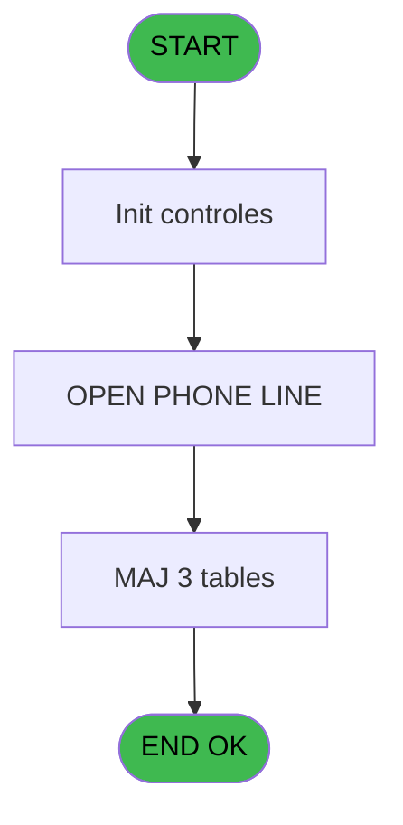
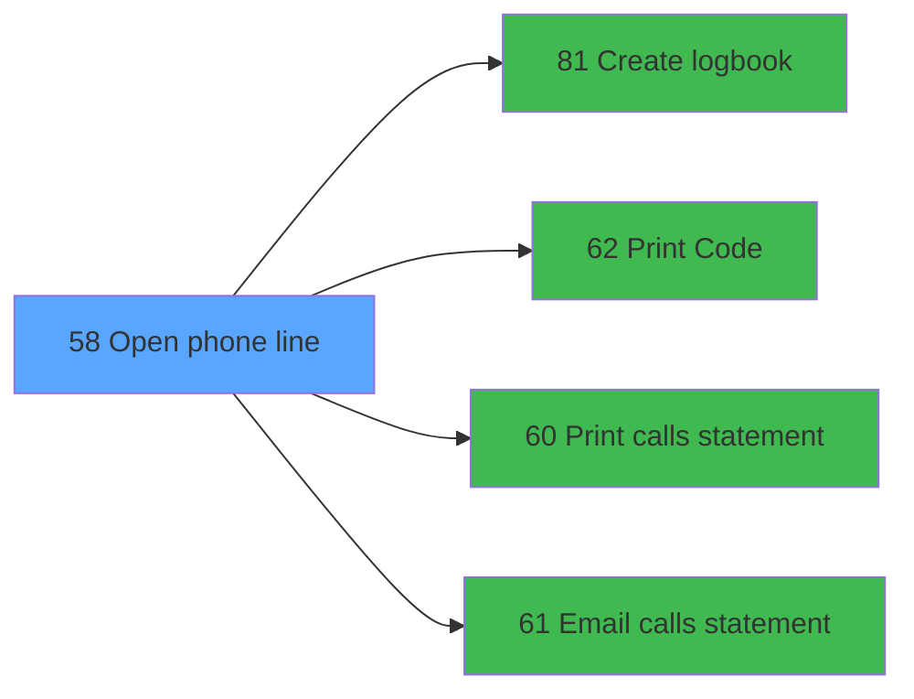

# WEL IDE 58 - Open phone line

> **Analyse**: Phases 1-4 2026-02-03 21:31 -> 21:31 (9s) | Assemblage 21:31
> **Pipeline**: V7.2 Enrichi
> **Structure**: 4 onglets (Resume | Ecrans | Donnees | Connexions)

<!-- TAB:Resume -->

## 1. FICHE D'IDENTITE

| Attribut | Valeur |
|----------|--------|
| Projet | WEL |
| IDE Position | 58 |
| Nom Programme | Open phone line |
| Fichier source | `Prg_58.xml` |
| Dossier IDE | Phone |
| Taches | 4 (0 ecrans visibles) |
| Tables modifiees | 3 |
| Programmes appeles | 4 |
| :warning: Statut | **ORPHELIN_POTENTIEL** |

## 2. DESCRIPTION FONCTIONNELLE

**Open phone line** assure la gestion complete de ce processus.

Le flux de traitement s'organise en **1 blocs fonctionnels** :

- **Traitement** (4 taches) : traitements metier divers

**Donnees modifiees** : 3 tables en ecriture (param__telephone_tel, codes_autocom____aut, historique_pabx).

**Logique metier** : 1 regles identifiees couvrant conditions metier.

Detail : phases du traitement

#### Phase 1 : Traitement (4 taches)

- **58** - Totalisation Account
- **58.1** - OPEN PHONE LINE
- **58.1.1** - Totalisation Account
- **58.1.2** - New Line

Delegue a : [Email calls statement (IDE 61)](WEL-IDE-61.md)

#### Tables impactees

| Table | Operations | Role metier |
|-------|-----------|-------------|
| codes_autocom____aut | **W**/L (2 usages) |  |
| historique_pabx | **W**/L (2 usages) | Historique / journal |
| param__telephone_tel | **W** (1 usages) |  |

## 3. BLOCS FONCTIONNELS

### 3.1 Traitement (4 taches)

Traitements internes.

---

#### 58 - Totalisation Account

**Role** : Traitement : Totalisation Account.

3 sous-taches directes

| Tache | Nom | Bloc |
|-------|-----|------|
| [58.1](#t2) | OPEN PHONE LINE | Traitement |
| [58.1.1](#t3) | Totalisation Account | Traitement |
| [58.1.2](#t4) | New Line | Traitement |

**Variables liees** : C (V.account CIA Pack?)
**Delegue a** : [Email calls statement (IDE 61)](WEL-IDE-61.md)

---

#### 58.1 - OPEN PHONE LINE

**Role** : Traitement : OPEN PHONE LINE.
**Variables liees** : D (v.NewLine)
**Delegue a** : [Email calls statement (IDE 61)](WEL-IDE-61.md)

---

#### 58.1.1 - Totalisation Account

**Role** : Traitement : Totalisation Account.
**Variables liees** : C (V.account CIA Pack?)
**Delegue a** : [Email calls statement (IDE 61)](WEL-IDE-61.md)

---

#### 58.1.2 - New Line

**Role** : Traitement : New Line.
**Variables liees** : D (v.NewLine)
**Delegue a** : [Email calls statement (IDE 61)](WEL-IDE-61.md)

## 5. REGLES METIER

1 regles identifiees:

### Autres (1 regles)

#### [RM-001] Traitement conditionnel si [M] est a zero

| Element | Detail |
|---------|--------|
| **Condition** | `[M]=0` |
| **Si vrai** | 999999 |
| **Si faux** | [M]) |
| **Expression source** | Expression 4 : `IF([M]=0,999999,[M])` |
| **Exemple** | Si [M]=0 → 999999. Sinon → [M]) |

## 6. CONTEXTE

- **Appele par**: (aucun)
- **Appelle**: 4 programmes | **Tables**: 8 (W:3 R:1 L:6) | **Taches**: 4 | **Expressions**: 6

<!-- TAB:Ecrans -->

## 8. ECRANS

*(Programme sans ecran visible)*

## 9. NAVIGATION

### 9.3 Structure hierarchique (4 taches)

| Position | Tache | Type | Dimensions | Bloc |
|----------|-------|------|------------|------|
| **58.1** | [**Totalisation Account** (58)](#t1) | - | - | Traitement |
| 58.1.1 | [OPEN PHONE LINE (58.1)](#t2) | - | - | |
| 58.1.2 | [Totalisation Account (58.1.1)](#t3) | - | - | |
| 58.1.3 | [New Line (58.1.2)](#t4) | - | - | |

### 9.4 Algorigramme

> **Legende**: Vert = START/END OK | Rouge = END KO | Bleu = Decisions
> *Algorigramme auto-genere. Utiliser `/algorigramme` pour une synthese metier detaillee.*

<!-- TAB:Donnees -->

## 10. TABLES

### Tables utilisees (8)

| ID | Nom | Description | Type | R | W | L | Usages |
|----|-----|-------------|------|---|---|---|--------|
| 34 | hebergement______heb | Hebergement (chambres) | DB |   |   | L | 1 |
| 63 | parametres___par |  | DB | R |   |   | 1 |
| 78 | param__telephone_tel |  | DB |   | **W** |   | 1 |
| 80 | codes_autocom____aut |  | DB |   | **W** | L | 2 |
| 155 | historique_pabx | Historique / journal | DB |   | **W** | L | 2 |
| 169 | salle_seminaire__sse |  | DB |   |   | L | 1 |
| 188 | correspondance_sda |  | DB |   |   | L | 1 |
| 285 | email |  | DB |   |   | L | 1 |

### Colonnes par table (1 / 4 tables avec colonnes identifiees)

Table 63 - parametres___par (R) - 1 usages

| Lettre | Variable | Acces | Type |
|--------|----------|-------|------|
| A | V0.Toatal Charges | R | Numeric |
| B | R0.Retour_Oui_Non | R | Numeric |
| C | V.account CIA Pack? | R | Logical |
| D | v.NewLine | R | Numeric |

Table 78 - param__telephone_tel (**W**) - 1 usages

*Table utilisee uniquement en Link ou aucune colonne Real identifiee dans le DataView.*

Table 80 - codes_autocom____aut (**W**/L) - 2 usages

*Table utilisee uniquement en Link ou aucune colonne Real identifiee dans le DataView.*

Table 155 - historique_pabx (**W**/L) - 2 usages

*Table utilisee uniquement en Link ou aucune colonne Real identifiee dans le DataView.*

## 11. VARIABLES

### 11.1 Variables de session (3)

Variables persistantes pendant toute la session.

| Lettre | Nom | Type | Usage dans |
|--------|-----|------|-----------|
| A | v.Selcetion | Numeric | - |
| C | V.account CIA Pack? | Logical | - |
| D | v.NewLine | Numeric | - |

### 11.2 Autres (1)

Variables diverses.

| Lettre | Nom | Type | Usage dans |
|--------|-----|------|-----------|
| B | R0.Retour_Oui_Non | Numeric | - |

## 12. EXPRESSIONS

**6 / 6 expressions decodees (100%)**

### 12.1 Repartition par type

| Type | Expressions | Regles |
|------|-------------|--------|
| CONDITION | 1 | 5 |
| CONSTANTE | 1 | 0 |
| REFERENCE_VG | 4 | 0 |

### 12.2 Expressions cles par type

#### CONDITION (1 expressions)

| Type | IDE | Expression | Regle |
|------|-----|------------|-------|
| CONDITION | 4 | `IF([M]=0,999999,[M])` | [RM-001](#rm-RM-001) |

#### CONSTANTE (1 expressions)

| Type | IDE | Expression | Regle |
|------|-----|------------|-------|
| CONSTANTE | 5 | `'H'` | - |

#### REFERENCE_VG (4 expressions)

| Type | IDE | Expression | Regle |
|------|-----|------------|-------|
| REFERENCE_VG | 3 | `VG10` | - |
| REFERENCE_VG | 6 | `VG5` | - |
| REFERENCE_VG | 1 | `VG5` | - |
| REFERENCE_VG | 2 | `VG9` | - |

<!-- TAB:Connexions -->

## 13. GRAPHE D'APPELS

### 13.1 Chaine depuis Main (Callers)

**Chemin**: (pas de callers directs)

### 13.2 Callers

| IDE | Nom Programme | Nb Appels |
|-----|---------------|-----------|
| - | (aucun) | - |

### 13.3 Callees (programmes appeles)

### 13.4 Detail Callees avec contexte

| IDE | Nom Programme | Appels | Contexte |
|-----|---------------|--------|----------|
| [81](WEL-IDE-81.md) | Create logbook | 7 | Sous-programme |
| [62](WEL-IDE-62.md) | Print Code | 2 | Impression ticket/document |
| [60](WEL-IDE-60.md) | Print calls statement | 1 | Impression ticket/document |
| [61](WEL-IDE-61.md) | Email calls statement | 1 | Sous-programme |

## 14. RECOMMANDATIONS MIGRATION

### 14.1 Profil du programme

| Metrique | Valeur | Impact migration |
|----------|--------|-----------------|
| Lignes de logique | 111 | Programme compact |
| Expressions | 6 | Peu de logique |
| Tables WRITE | 3 | Impact modere |
| Sous-programmes | 4 | Peu de dependances |
| Ecrans visibles | 0 | Ecran unique ou traitement batch |
| Code desactive | 3.6% (4 / 111) | Code sain |
| Regles metier | 1 | Quelques regles a preserver |

### 14.2 Plan de migration par bloc

#### Traitement (4 taches: 0 ecran, 4 traitements)

- **Strategie** : 4 service(s) backend injectable(s) (Domain Services).
- 4 sous-programme(s) a migrer ou a reutiliser depuis les services existants.
- Decomposer les taches en services unitaires testables.

### 14.3 Dependances critiques

| Dependance | Type | Appels | Impact |
|------------|------|--------|--------|
| param__telephone_tel | Table WRITE (Database) | 1x | Schema + repository |
| codes_autocom____aut | Table WRITE (Database) | 1x | Schema + repository |
| historique_pabx | Table WRITE (Database) | 1x | Schema + repository |
| [Create logbook (IDE 81)](WEL-IDE-81.md) | Sous-programme | 7x | **CRITIQUE** - Sous-programme |
| [Print Code (IDE 62)](WEL-IDE-62.md) | Sous-programme | 2x | Haute - Impression ticket/document |
| [Email calls statement (IDE 61)](WEL-IDE-61.md) | Sous-programme | 1x | Normale - Sous-programme |
| [Print calls statement (IDE 60)](WEL-IDE-60.md) | Sous-programme | 1x | Normale - Impression ticket/document |

---
*Spec DETAILED generee par Pipeline V7.2 - 2026-02-03 21:31*
