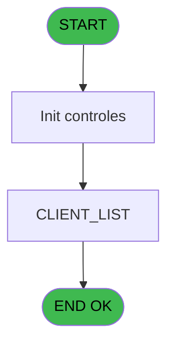
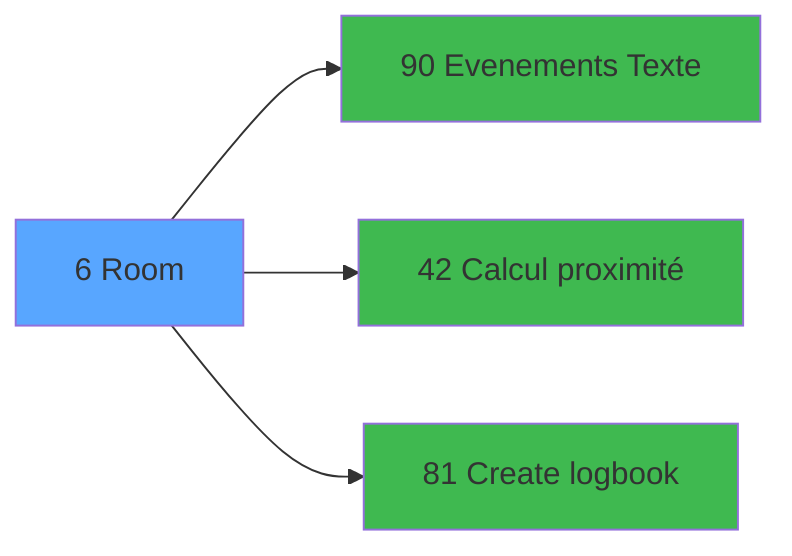

# WEL IDE 6 - Room

> **Analyse**: Phases 1-4 2026-02-03 21:12 -> 21:12 (18s) | Assemblage 21:12
> **Pipeline**: V7.2 Enrichi
> **Structure**: 4 onglets (Resume | Ecrans | Donnees | Connexions)

<!-- TAB:Resume -->

## 1. FICHE D'IDENTITE

| Attribut | Valeur |
|----------|--------|
| Projet | WEL |
| IDE Position | 6 |
| Nom Programme | Room |
| Fichier source | `Prg_6.xml` |
| Dossier IDE | Chambre |
| Taches | 2 (1 ecrans visibles) |
| Tables modifiees | 0 |
| Programmes appeles | 3 |

## 2. DESCRIPTION FONCTIONNELLE

**Room** assure la gestion complete de ce processus, accessible depuis [Mobile Welcome (IDE 55)](WEL-IDE-55.md).

Le flux de traitement s'organise en **1 blocs fonctionnels** :

- **Traitement** (2 taches) : traitements metier divers

**Logique metier** : 1 regles identifiees couvrant conditions metier.

## 3. BLOCS FONCTIONNELS

### 3.1 Traitement (2 taches)

Traitements internes.

---

#### 6 - Room

**Role** : Traitement : Room.
**Delegue a** : [Evenements (Texte) (IDE 90)](WEL-IDE-90.md)

---

#### 6.1 - ROOM_LIST [[ECRAN]](#ecran-t2)

**Role** : Traitement : ROOM_LIST.
**Ecran** : 941 x 284 DLU | [Voir mockup](#ecran-t2)
**Delegue a** : [Evenements (Texte) (IDE 90)](WEL-IDE-90.md)

## 5. REGLES METIER

1 regles identifiees:

### Autres (1 regles)

#### [RM-001] Traitement si [D] est non nul

| Element | Detail |
|---------|--------|
| **Condition** | `[D]<>0` |
| **Si vrai** | '%club_images%Room_Vert.png' |
| **Si faux** | '%club_images%Room_Rouge.png') |
| **Expression source** | Expression 3 : `IF([D]<>0,'%club_images%Room_Vert.png','%club_images%Room_Ro` |
| **Exemple** | Si [D]<>0 → '%club_images%Room_Vert.png'. Sinon → '%club_images%Room_Rouge.png') |
| **Impact** | [6 - Room](#t1) |

## 6. CONTEXTE

- **Appele par**: [Mobile Welcome (IDE 55)](WEL-IDE-55.md)
- **Appelle**: 3 programmes | **Tables**: 9 (W:0 R:2 L:7) | **Taches**: 2 | **Expressions**: 18

<!-- TAB:Ecrans -->

## 8. ECRANS

### 8.1 Forms visibles (1 / 2)

| # | Position | Tache | Nom | Type | Largeur | Hauteur | Bloc |
|---|----------|-------|-----|------|---------|---------|------|
| 1 | 6.1 | 6.1 | ROOM_LIST | Type0 | 941 | 284 | Traitement |

### 8.2 Mockups Ecrans

---

#### 6.1 - ROOM_LIST
**Tache** : [6.1](#t2) | **Type** : Type0 | **Dimensions** : 941 x 284 DLU
**Bloc** : Traitement | **Titre IDE** : ROOM_LIST

<!-- FORM-DATA:
{
    "width":  941,
    "vFactor":  100,
    "type":  "Type0",
    "hFactor":  100,
    "controls":  [
                     {
                         "x":  0,
                         "type":  "label",
                         "var":  "",
                         "y":  3,
                         "w":  237,
                         "fmt":  "",
                         "name":  "",
                         "h":  44,
                         "color":  "",
                         "text":  "NAME",
                         "parent":  null
                     },
                     {
                         "x":  236,
                         "type":  "label",
                         "var":  "",
                         "y":  3,
                         "w":  159,
                         "fmt":  "",
                         "name":  "",
                         "h":  44,
                         "color":  "",
                         "text":  "FIRST NAME",
                         "parent":  null
                     },
                     {
                         "x":  394,
                         "type":  "label",
                         "var":  "",
                         "y":  3,
                         "w":  68,
                         "fmt":  "",
                         "name":  "",
                         "h":  44,
                         "color":  "",
                         "text":  "AGE",
                         "parent":  null
                     },
                     {
                         "x":  461,
                         "type":  "label",
                         "var":  "",
                         "y":  3,
                         "w":  91,
                         "fmt":  "",
                         "name":  "",
                         "h":  44,
                         "color":  "",
                         "text":  "ARR",
                         "parent":  null
                     },
                     {
                         "x":  551,
                         "type":  "label",
                         "var":  "",
                         "y":  3,
                         "w":  91,
                         "fmt":  "",
                         "name":  "",
                         "h":  44,
                         "color":  "",
                         "text":  "DEP",
                         "parent":  null
                     },
                     {
                         "x":  641,
                         "type":  "label",
                         "var":  "",
                         "y":  3,
                         "w":  133,
                         "fmt":  "",
                         "name":  "",
                         "h":  44,
                         "color":  "",
                         "text":  "STATUS",
                         "parent":  null
                     },
                     {
                         "x":  773,
                         "type":  "label",
                         "var":  "",
                         "y":  3,
                         "w":  110,
                         "fmt":  "",
                         "name":  "",
                         "h":  44,
                         "color":  "",
                         "text":  "QUALITY",
                         "parent":  null
                     },
                     {
                         "x":  0,
                         "type":  "table",
                         "var":  "",
                         "name":  "",
                         "titleH":  12,
                         "color":  "",
                         "w":  881,
                         "y":  46,
                         "fmt":  "",
                         "parent":  null,
                         "text":  "",
                         "rowH":  46,
                         "h":  233,
                         "cols":  [
                                      {
                                          "title":  "NAME",
                                          "layer":  1,
                                          "w":  234
                                      },
                                      {
                                          "title":  "FIRST NAME",
                                          "layer":  2,
                                          "w":  160
                                      },
                                      {
                                          "title":  "AGE",
                                          "layer":  3,
                                          "w":  66
                                      },
                                      {
                                          "title":  "ARR",
                                          "layer":  4,
                                          "w":  90
                                      },
                                      {
                                          "title":  "DEP",
                                          "layer":  5,
                                          "w":  90
                                      },
                                      {
                                          "title":  "STATUS",
                                          "layer":  6,
                                          "w":  131
                                      },
                                      {
                                          "title":  "QUAL",
                                          "layer":  7,
                                          "w":  100
                                      }
                                  ],
                         "rows":  7
                     },
                     {
                         "x":  881,
                         "type":  "button",
                         "var":  "",
                         "y":  3,
                         "w":  56,
                         "fmt":  "",
                         "name":  "",
                         "h":  150,
                         "color":  "",
                         "text":  "",
                         "parent":  null
                     },
                     {
                         "x":  6,
                         "type":  "edit",
                         "var":  "",
                         "y":  52,
                         "w":  226,
                         "fmt":  "50",
                         "name":  "Nom",
                         "h":  36,
                         "color":  "220",
                         "text":  "",
                         "parent":  9
                     },
                     {
                         "x":  241,
                         "type":  "edit",
                         "var":  "",
                         "y":  52,
                         "w":  150,
                         "fmt":  "",
                         "name":  "Prenom",
                         "h":  36,
                         "color":  "220",
                         "text":  "",
                         "parent":  9
                     },
                     {
                         "x":  400,
                         "type":  "edit",
                         "var":  "",
                         "y":  52,
                         "w":  59,
                         "fmt":  "##Z",
                         "name":  "Age",
                         "h":  36,
                         "color":  "220",
                         "text":  "",
                         "parent":  9
                     },
                     {
                         "x":  466,
                         "type":  "edit",
                         "var":  "",
                         "y":  52,
                         "w":  82,
                         "fmt":  "30",
                         "name":  "Date debut",
                         "h":  36,
                         "color":  "220",
                         "text":  "",
                         "parent":  9
                     },
                     {
                         "x":  556,
                         "type":  "edit",
                         "var":  "",
                         "y":  52,
                         "w":  82,
                         "fmt":  "30",
                         "name":  "Date Depart",
                         "h":  36,
                         "color":  "220",
                         "text":  "",
                         "parent":  9
                     },
                     {
                         "x":  647,
                         "type":  "edit",
                         "var":  "",
                         "y":  52,
                         "w":  123,
                         "fmt":  "",
                         "name":  "Statut",
                         "h":  36,
                         "color":  "220",
                         "text":  "",
                         "parent":  9
                     },
                     {
                         "x":  779,
                         "type":  "edit",
                         "var":  "",
                         "y":  52,
                         "w":  94,
                         "fmt":  "30",
                         "name":  "Qualite",
                         "h":  36,
                         "color":  "220",
                         "text":  "",
                         "parent":  9
                     },
                     {
                         "x":  882,
                         "type":  "button",
                         "var":  "",
                         "y":  150,
                         "w":  56,
                         "fmt":  "",
                         "name":  "",
                         "h":  134,
                         "color":  "",
                         "text":  "",
                         "parent":  null
                     }
                 ],
    "taskId":  "6.1",
    "height":  284
}
-->

<strong>Champs : 7 champs</strong>

| Pos (x,y) | Nom | Variable | Type |
|-----------|-----|----------|------|
| 6,52 | Nom | - | edit |
| 241,52 | Prenom | - | edit |
| 400,52 | Age | - | edit |
| 466,52 | Date debut | - | edit |
| 556,52 | Date Depart | - | edit |
| 647,52 | Statut | - | edit |
| 779,52 | Qualite | - | edit |

<strong>Boutons : 2 boutons</strong>

| Bouton | Pos (x,y) | Action |
|--------|-----------|--------|
| (sans nom) | 881,3 | Action declenchee |
| (sans nom) | 882,150 | Action declenchee |

## 9. NAVIGATION

Ecran unique: **ROOM_LIST**

### 9.3 Structure hierarchique (2 taches)

| Position | Tache | Type | Dimensions | Bloc |
|----------|-------|------|------------|------|
| **6.1** | [**Room** (6)](#t1) | MDI | - | Traitement |
| 6.1.1 | [ROOM_LIST (6.1)](#t2) [mockup](#ecran-t2) | - | 941x284 | |

### 9.4 Algorigramme

> **Legende**: Vert = START/END OK | Rouge = END KO | Bleu = Decisions
> *Algorigramme auto-genere. Utiliser `/algorigramme` pour une synthese metier detaillee.*

<!-- TAB:Donnees -->

## 10. TABLES

### Tables utilisees (9)

| ID | Nom | Description | Type | R | W | L | Usages |
|----|-----|-------------|------|---|---|---|--------|
| 34 | hebergement______heb | Hebergement (chambres) | DB |   |   | L | 1 |
| 36 | client_gm |  | DB |   |   | L | 1 |
| 103 | logement_client__loc |  | DB |   |   | L | 1 |
| 104 | fichier_menage |  | DB | R |   |   | 1 |
| 105 | logement_complement |  | DB |   |   | L | 1 |
| 108 | code_logement____clo |  | DB |   |   | L | 1 |
| 131 | fichier_validation |  | DB | R |   |   | 1 |
| 356 | gm_millesia |  | DB |   |   | L | 1 |
| 800 | moyen_paiement_complement |  | DB |   |   | L | 1 |

### Colonnes par table (3 / 2 tables avec colonnes identifiees)

Table 104 - fichier_menage (R) - 1 usages

*Table utilisee uniquement en Link ou aucune colonne Real identifiee dans le DataView.*

Table 131 - fichier_validation (R) - 1 usages

| Lettre | Variable | Acces | Type |
|--------|----------|-------|------|
| A | P.Chambre | R | Alpha |
| B | P.refresh | R | Logical |
| C | V.Existe client ? | R | Logical |

## 11. VARIABLES

### 11.1 Autres (3)

Variables diverses.

| Lettre | Nom | Type | Usage dans |
|--------|-----|------|-----------|
| A | V0.Refresh view | Logical | 1x refs |
| B | V0.Vecteur chambre | Blob | 3x refs |
| C | V0.Date/Heure | Numeric | 2x refs |

## 12. EXPRESSIONS

**18 / 18 expressions decodees (100%)**

### 12.1 Repartition par type

| Type | Expressions | Regles |
|------|-------------|--------|
| CONCATENATION | 1 | 0 |
| CONDITION | 2 | 5 |
| CONSTANTE | 2 | 0 |
| DATE | 1 | 0 |
| OTHER | 9 | 0 |
| REFERENCE_VG | 2 | 0 |
| STRING | 1 | 0 |

### 12.2 Expressions cles par type

#### CONCATENATION (1 expressions)

| Type | IDE | Expression | Regle |
|------|-----|------------|-------|
| CONCATENATION | 2 | `'ROOM'&' - '&Trim(V0.Vecteur chambre [B])` | - |

#### CONDITION (2 expressions)

| Type | IDE | Expression | Regle |
|------|-----|------------|-------|
| CONDITION | 3 | `IF([D]<>0,'%club_images%Room_Vert.png','%club_images%Room_Rouge.png')` | [RM-001](#rm-RM-001) |
| CONDITION | 6 | `CndRange(Trim(VG11)<>'',VG11)` | - |

#### CONSTANTE (2 expressions)

| Type | IDE | Expression | Regle |
|------|-----|------------|-------|
| CONSTANTE | 17 | `'ROOM'` | - |
| CONSTANTE | 11 | `'C'` | - |

#### DATE (1 expressions)

| Type | IDE | Expression | Regle |
|------|-----|------------|-------|
| DATE | 15 | `Date ()*100+Hour (Time ())` | - |

#### OTHER (9 expressions)

| Type | IDE | Expression | Regle |
|------|-----|------------|-------|
| OTHER | 13 | `VecGet([Y],2)` | - |
| OTHER | 12 | `VecGet([Y],1)` | - |
| OTHER | 16 | `V0.Vecteur chambre [B]` | - |
| OTHER | 14 | `VecGet([Y],3)` | - |
| OTHER | 10 | `V0.Date/Heure [C]` | - |
| ... | | *+4 autres* | |

#### REFERENCE_VG (2 expressions)

| Type | IDE | Expression | Regle |
|------|-----|------------|-------|
| REFERENCE_VG | 7 | `VG7` | - |
| REFERENCE_VG | 5 | `VG5` | - |

#### STRING (1 expressions)

| Type | IDE | Expression | Regle |
|------|-----|------------|-------|
| STRING | 18 | `Trim(V0.Date/Heure [C])` | - |

<!-- TAB:Connexions -->

## 13. GRAPHE D'APPELS

### 13.1 Chaine depuis Main (Callers)

Main -> ... -> [Mobile Welcome (IDE 55)](WEL-IDE-55.md) -> **Room (IDE 6)**

### 13.2 Callers

| IDE | Nom Programme | Nb Appels |
|-----|---------------|-----------|
| [55](WEL-IDE-55.md) | Mobile Welcome | 2 |

### 13.3 Callees (programmes appeles)

### 13.4 Detail Callees avec contexte

| IDE | Nom Programme | Appels | Contexte |
|-----|---------------|--------|----------|
| [90](WEL-IDE-90.md) | Evenements (Texte) | 2 | Sous-programme |
| [42](WEL-IDE-42.md) | Calcul proximité | 1 | Calcul de donnees |
| [81](WEL-IDE-81.md) | Create logbook | 1 | Sous-programme |

## 14. RECOMMANDATIONS MIGRATION

### 14.1 Profil du programme

| Metrique | Valeur | Impact migration |
|----------|--------|-----------------|
| Lignes de logique | 106 | Programme compact |
| Expressions | 18 | Peu de logique |
| Tables WRITE | 0 | Impact faible |
| Sous-programmes | 3 | Peu de dependances |
| Ecrans visibles | 1 | Ecran unique ou traitement batch |
| Code desactive | 0% (0 / 106) | Code sain |
| Regles metier | 1 | Quelques regles a preserver |

### 14.2 Plan de migration par bloc

#### Traitement (2 taches: 1 ecran, 1 traitement)

- **Strategie** : Orchestrateur avec 1 ecrans (Razor/React) et 1 traitements backend (services).
- Les ecrans deviennent des composants UI, les traitements invisibles deviennent des services injectables.
- 3 sous-programme(s) a migrer ou a reutiliser depuis les services existants.
- Decomposer les taches en services unitaires testables.

### 14.3 Dependances critiques

| Dependance | Type | Appels | Impact |
|------------|------|--------|--------|
| [Evenements (Texte) (IDE 90)](WEL-IDE-90.md) | Sous-programme | 2x | Haute - Sous-programme |
| [Create logbook (IDE 81)](WEL-IDE-81.md) | Sous-programme | 1x | Normale - Sous-programme |
| [Calcul proximité (IDE 42)](WEL-IDE-42.md) | Sous-programme | 1x | Normale - Calcul de donnees |

---
*Spec DETAILED generee par Pipeline V7.2 - 2026-02-03 21:12*
