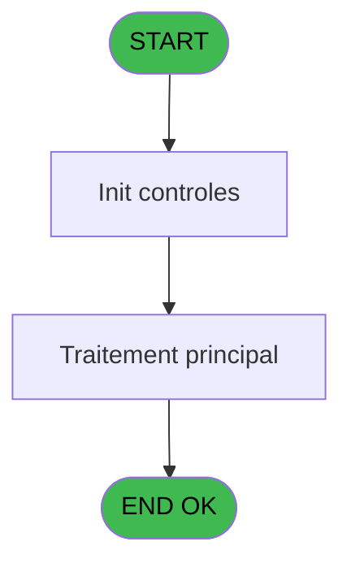

# WEL IDE 62 - Print Code

> **Analyse**: Phases 1-4 2026-02-03 21:32 -> 21:32 (10s) | Assemblage 21:32
> **Pipeline**: V7.2 Enrichi
> **Structure**: 4 onglets (Resume | Ecrans | Donnees | Connexions)

<!-- TAB:Resume -->

## 1. FICHE D'IDENTITE

| Attribut | Valeur |
|----------|--------|
| Projet | WEL |
| IDE Position | 62 |
| Nom Programme | Print Code |
| Fichier source | `Prg_62.xml` |
| Dossier IDE | Sejour |
| Taches | 5 (1 ecrans visibles) |
| Tables modifiees | 0 |
| Programmes appeles | 1 |

## 2. DESCRIPTION FONCTIONNELLE

**Print Code** assure la gestion complete de ce processus, accessible depuis [Open phone line (IDE 58)](WEL-IDE-58.md).

Le flux de traitement s'organise en **2 blocs fonctionnels** :

- **Impression** (3 taches) : generation de tickets et documents
- **Traitement** (2 taches) : traitements metier divers

**Logique metier** : 1 regles identifiees couvrant conditions metier.

Detail : phases du traitement

#### Phase 1 : Traitement (2 taches)

- **62** - Veuillez patienter... **[[ECRAN]](#ecran-t1)**
- **62.1** - recup nom adherent

Delegue a : [Traitement des mails (IDE 89)](WEL-IDE-89.md)

#### Phase 2 : Impression (3 taches)

- **62.2** - Printer
- **62.2.1** - edition extrait compte
- **62.2.2** - edition extrait compte

## 3. BLOCS FONCTIONNELS

### 3.1 Traitement (2 taches)

Traitements internes.

---

#### 62 - Veuillez patienter... [[ECRAN]](#ecran-t1)

**Role** : Traitement : Veuillez patienter....
**Ecran** : 424 x 57 DLU (MDI) | [Voir mockup](#ecran-t1)
**Delegue a** : [Traitement des mails (IDE 89)](WEL-IDE-89.md)

---

#### 62.1 - recup nom adherent

**Role** : Consultation/chargement : recup nom adherent.
**Variables liees** : J (W0 nom adherent), K (W0 prenom adherent), L (W0 n° adherent)
**Delegue a** : [Traitement des mails (IDE 89)](WEL-IDE-89.md)

### 3.2 Impression (3 taches)

Generation des documents et tickets.

---

#### 62.2 - Printer

**Role** : Generation du document : Printer.

---

#### 62.2.1 - edition extrait compte

**Role** : Generation du document : edition extrait compte.
**Variables liees** : B (P0 n° compte)

---

#### 62.2.2 - edition extrait compte

**Role** : Generation du document : edition extrait compte.
**Variables liees** : B (P0 n° compte)

## 5. REGLES METIER

1 regles identifiees:

### Autres (1 regles)

#### [RM-001] Si VG53=2 alors 'N9.2C' sinon 'N9.3C')

| Element | Detail |
|---------|--------|
| **Condition** | `VG53=2` |
| **Si vrai** | 'N9.2C' |
| **Si faux** | 'N9.3C') |
| **Expression source** | Expression 8 : `IF(VG53=2,'N9.2C','N9.3C')` |
| **Exemple** | Si VG53=2 → 'N9.2C'. Sinon → 'N9.3C') |

## 6. CONTEXTE

- **Appele par**: [Open phone line (IDE 58)](WEL-IDE-58.md)
- **Appelle**: 1 programmes | **Tables**: 5 (W:0 R:3 L:3) | **Taches**: 5 | **Expressions**: 12

<!-- TAB:Ecrans -->

## 8. ECRANS

### 8.1 Forms visibles (1 / 5)

| # | Position | Tache | Nom | Type | Largeur | Hauteur | Bloc |
|---|----------|-------|-----|------|---------|---------|------|
| 1 | 62 | 62 | Veuillez patienter... | MDI | 424 | 57 | Traitement |

### 8.2 Mockups Ecrans

---

#### 62 - Veuillez patienter...
**Tache** : [62](#t1) | **Type** : MDI | **Dimensions** : 424 x 57 DLU
**Bloc** : Traitement | **Titre IDE** : Veuillez patienter...

<!-- FORM-DATA:
{
    "width":  424,
    "vFactor":  8,
    "type":  "MDI",
    "hFactor":  8,
    "controls":  [
                     {
                         "x":  0,
                         "type":  "label",
                         "var":  "",
                         "y":  0,
                         "w":  423,
                         "fmt":  "",
                         "name":  "",
                         "h":  29,
                         "color":  "",
                         "text":  "",
                         "parent":  null
                     },
                     {
                         "x":  120,
                         "type":  "label",
                         "var":  "",
                         "y":  10,
                         "w":  221,
                         "fmt":  "",
                         "name":  "",
                         "h":  8,
                         "color":  "7",
                         "text":  "Impression en cours ...",
                         "parent":  null
                     },
                     {
                         "x":  0,
                         "type":  "label",
                         "var":  "",
                         "y":  29,
                         "w":  423,
                         "fmt":  "",
                         "name":  "",
                         "h":  27,
                         "color":  "",
                         "text":  "",
                         "parent":  null
                     },
                     {
                         "x":  52,
                         "type":  "label",
                         "var":  "",
                         "y":  38,
                         "w":  318,
                         "fmt":  "",
                         "name":  "",
                         "h":  8,
                         "color":  "",
                         "text":  "Impression de l\u0027extrait de compte",
                         "parent":  null
                     },
                     {
                         "x":  4,
                         "type":  "image",
                         "var":  "",
                         "y":  2,
                         "w":  72,
                         "fmt":  "",
                         "name":  "",
                         "h":  25,
                         "color":  "",
                         "text":  "",
                         "parent":  null
                     }
                 ],
    "taskId":  "62",
    "height":  57
}
-->

## 9. NAVIGATION

Ecran unique: **Veuillez patienter...**

### 9.3 Structure hierarchique (5 taches)

| Position | Tache | Type | Dimensions | Bloc |
|----------|-------|------|------------|------|
| **62.1** | [**Veuillez patienter...** (62)](#t1) [mockup](#ecran-t1) | MDI | 424x57 | Traitement |
| 62.1.1 | [recup nom adherent (62.1)](#t2) | MDI | - | |
| **62.2** | [**Printer** (62.2)](#t3) | MDI | - | Impression |
| 62.2.1 | [edition extrait compte (62.2.1)](#t4) | MDI | - | |
| 62.2.2 | [edition extrait compte (62.2.2)](#t5) | MDI | - | |

### 9.4 Algorigramme

> **Legende**: Vert = START/END OK | Rouge = END KO | Bleu = Decisions
> *Algorigramme auto-genere. Utiliser `/algorigramme` pour une synthese metier detaillee.*

<!-- TAB:Donnees -->

## 10. TABLES

### Tables utilisees (5)

| ID | Nom | Description | Type | R | W | L | Usages |
|----|-----|-------------|------|---|---|---|--------|
| 30 | gm-recherche_____gmr | Index de recherche | DB | R |   | L | 3 |
| 31 | gm-complet_______gmc |  | DB | R |   |   | 1 |
| 34 | hebergement______heb | Hebergement (chambres) | DB |   |   | L | 1 |
| 80 | codes_autocom____aut |  | DB |   |   | L | 2 |
| 368 | pms_village |  | DB | R |   |   | 1 |

### Colonnes par table (2 / 3 tables avec colonnes identifiees)

Table 30 - gm-recherche_____gmr (R/L) - 3 usages

*Table utilisee uniquement en Link ou aucune colonne Real identifiee dans le DataView.*

Table 31 - gm-complet_______gmc (R) - 1 usages

*Table utilisee uniquement en Link ou aucune colonne Real identifiee dans le DataView.*

Table 368 - pms_village (R) - 1 usages

| Lettre | Variable | Acces | Type |
|--------|----------|-------|------|
| A | P0 societe | R | Alpha |
| B | P0 n° compte | R | Numeric |
| C | P0 filiation | R | Numeric |
| D | P0.CodeAutocom | R | Numeric |
| E | P0 NoLigne | R | Numeric |
| F | P0 SalleSéminaire | R | Alpha |
| G | P0 TelephoneDirect | R | Alpha |
| H | P0.Print/Email | R | Alpha |
| I | P0.EmailTo | R | Alpha |
| J | W0 nom adherent | R | Alpha |
| K | W0 prenom adherent | R | Alpha |
| L | W0 n° adherent | R | Numeric |
| M | W0 chambre | R | Alpha |
| N | v.Masaque | R | Alpha |
| O | v.devise locale | R | Alpha |
| P | v.Chemin | R | Alpha |
| Q | v.NomFichier | R | Alpha |

## 11. VARIABLES

### 11.1 Parametres entrants (9)

Variables recues du programme appelant ([Open phone line (IDE 58)](WEL-IDE-58.md)).

| Lettre | Nom | Type | Usage dans |
|--------|-----|------|-----------|
| A | P0 societe | Alpha | - |
| B | P0 n° compte | Numeric | [62.2.1](#t4), [62.2.2](#t5) |
| C | P0 filiation | Numeric | 1x parametre entrant |
| D | P0.CodeAutocom | Numeric | - |
| E | P0 NoLigne | Numeric | - |
| F | P0 SalleSéminaire | Alpha | - |
| G | P0 TelephoneDirect | Alpha | - |
| H | P0.Print/Email | Alpha | 2x parametre entrant |
| I | P0.EmailTo | Alpha | - |

### 11.2 Variables de session (4)

Variables persistantes pendant toute la session.

| Lettre | Nom | Type | Usage dans |
|--------|-----|------|-----------|
| N | v.Masaque | Alpha | - |
| O | v.devise locale | Alpha | - |
| P | v.Chemin | Alpha | 1x session |
| Q | v.NomFichier | Alpha | 1x session |

### 11.3 Variables de travail (4)

Variables internes au programme.

| Lettre | Nom | Type | Usage dans |
|--------|-----|------|-----------|
| J | W0 nom adherent | Alpha | - |
| K | W0 prenom adherent | Alpha | - |
| L | W0 n° adherent | Numeric | - |
| M | W0 chambre | Alpha | - |

Toutes les 17 variables (liste complete)

| Cat | Lettre | Nom Variable | Type |
|-----|--------|--------------|------|
| P0 | **A** | P0 societe | Alpha |
| P0 | **B** | P0 n° compte | Numeric |
| P0 | **C** | P0 filiation | Numeric |
| P0 | **D** | P0.CodeAutocom | Numeric |
| P0 | **E** | P0 NoLigne | Numeric |
| P0 | **F** | P0 SalleSéminaire | Alpha |
| P0 | **G** | P0 TelephoneDirect | Alpha |
| P0 | **H** | P0.Print/Email | Alpha |
| P0 | **I** | P0.EmailTo | Alpha |
| W0 | **J** | W0 nom adherent | Alpha |
| W0 | **K** | W0 prenom adherent | Alpha |
| W0 | **L** | W0 n° adherent | Numeric |
| W0 | **M** | W0 chambre | Alpha |
| V. | **N** | v.Masaque | Alpha |
| V. | **O** | v.devise locale | Alpha |
| V. | **P** | v.Chemin | Alpha |
| V. | **Q** | v.NomFichier | Alpha |

## 12. EXPRESSIONS

**12 / 12 expressions decodees (100%)**

### 12.1 Repartition par type

| Type | Expressions | Regles |
|------|-------------|--------|
| CONDITION | 3 | 5 |
| CONSTANTE | 1 | 0 |
| FORMAT | 1 | 0 |
| OTHER | 3 | 0 |
| REFERENCE_VG | 2 | 0 |
| STRING | 1 | 0 |
| CONCATENATION | 1 | 0 |

### 12.2 Expressions cles par type

#### CONDITION (3 expressions)

| Type | IDE | Expression | Regle |
|------|-----|------------|-------|
| CONDITION | 8 | `IF(VG53=2,'N9.2C','N9.3C')` | [RM-001](#rm-RM-001) |
| CONDITION | 11 | `P0.Print/Email [H]='E'` | - |
| CONDITION | 10 | `P0.Print/Email [H]='P'` | - |

#### CONSTANTE (1 expressions)

| Type | IDE | Expression | Regle |
|------|-----|------------|-------|
| CONSTANTE | 12 | `'WELPHONE_C'` | - |

#### FORMAT (1 expressions)

| Type | IDE | Expression | Regle |
|------|-----|------------|-------|
| FORMAT | 7 | `'PRINT_CODE_'&Trim(Str(P0 n° compte [B],'8P0'))&'_'&Trim(Str(P0 filiation [C],'##'))&'_'&Trim(VG15)&'_'&DStr(Date(),'YYMMDD')&TStr(Time(),'HHMMSS')&'.pdf'` | - |

#### OTHER (3 expressions)

| Type | IDE | Expression | Regle |
|------|-----|------------|-------|
| OTHER | 5 | `Translate('%club_exportdata%')&'WELCOME\'` | - |
| OTHER | 2 | `SetCrsr (2)` | - |
| OTHER | 1 | `SetCrsr (1)` | - |

#### REFERENCE_VG (2 expressions)

| Type | IDE | Expression | Regle |
|------|-----|------------|-------|
| REFERENCE_VG | 4 | `VG55` | - |
| REFERENCE_VG | 3 | `VG54` | - |

#### STRING (1 expressions)

| Type | IDE | Expression | Regle |
|------|-----|------------|-------|
| STRING | 6 | `Trim(VG67)` | - |

#### CONCATENATION (1 expressions)

| Type | IDE | Expression | Regle |
|------|-----|------------|-------|
| CONCATENATION | 9 | `Trim(v.Chemin [P])&Trim(v.NomFichier [Q])` | - |

<!-- TAB:Connexions -->

## 13. GRAPHE D'APPELS

### 13.1 Chaine depuis Main (Callers)

Main -> ... -> [Open phone line (IDE 58)](WEL-IDE-58.md) -> **Print Code (IDE 62)**

### 13.2 Callers

| IDE | Nom Programme | Nb Appels |
|-----|---------------|-----------|
| [58](WEL-IDE-58.md) | Open phone line | 2 |

### 13.3 Callees (programmes appeles)

### 13.4 Detail Callees avec contexte

| IDE | Nom Programme | Appels | Contexte |
|-----|---------------|--------|----------|
| [89](WEL-IDE-89.md) | Traitement des mails | 1 | Sous-programme |

## 14. RECOMMANDATIONS MIGRATION

### 14.1 Profil du programme

| Metrique | Valeur | Impact migration |
|----------|--------|-----------------|
| Lignes de logique | 123 | Programme compact |
| Expressions | 12 | Peu de logique |
| Tables WRITE | 0 | Impact faible |
| Sous-programmes | 1 | Peu de dependances |
| Ecrans visibles | 1 | Ecran unique ou traitement batch |
| Code desactive | 0.8% (1 / 123) | Code sain |
| Regles metier | 1 | Quelques regles a preserver |

### 14.2 Plan de migration par bloc

#### Traitement (2 taches: 1 ecran, 1 traitement)

- **Strategie** : Orchestrateur avec 1 ecrans (Razor/React) et 1 traitements backend (services).
- Les ecrans deviennent des composants UI, les traitements invisibles deviennent des services injectables.
- 1 sous-programme(s) a migrer ou a reutiliser depuis les services existants.
- Decomposer les taches en services unitaires testables.

#### Impression (3 taches: 0 ecran, 3 traitements)

- **Strategie** : Templates HTML -> PDF via wkhtmltopdf ou Puppeteer.
- `PrintService` injectable avec choix imprimante

### 14.3 Dependances critiques

| Dependance | Type | Appels | Impact |
|------------|------|--------|--------|
| [Traitement des mails (IDE 89)](WEL-IDE-89.md) | Sous-programme | 1x | Normale - Sous-programme |

---
*Spec DETAILED generee par Pipeline V7.2 - 2026-02-03 21:32*
