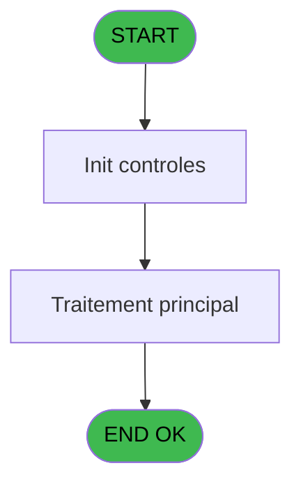
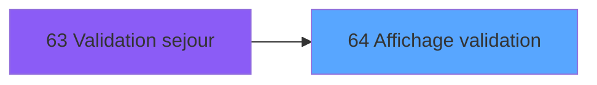
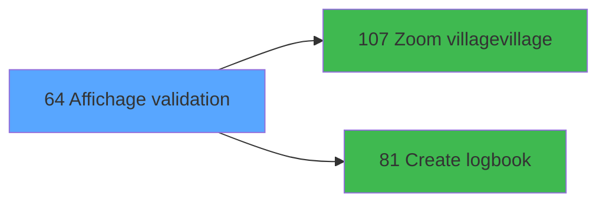

# WEL IDE 64 - Affichage validation

> **Analyse**: Phases 1-4 2026-02-03 21:32 -> 21:32 (10s) | Assemblage 21:32
> **Pipeline**: V7.2 Enrichi
> **Structure**: 4 onglets (Resume | Ecrans | Donnees | Connexions)

<!-- TAB:Resume -->

## 1. FICHE D'IDENTITE

| Attribut | Valeur |
|----------|--------|
| Projet | WEL |
| IDE Position | 64 |
| Nom Programme | Affichage validation |
| Fichier source | `Prg_64.xml` |
| Dossier IDE | Sejour |
| Taches | 4 (1 ecrans visibles) |
| Tables modifiees | 0 |
| Programmes appeles | 2 |

## 2. DESCRIPTION FONCTIONNELLE

**Affichage validation** assure la gestion complete de ce processus, accessible depuis [Validation sejour (IDE 63)](WEL-IDE-63.md).

Le flux de traitement s'organise en **1 blocs fonctionnels** :

- **Validation** (4 taches) : controles et verifications de coherence

**Logique metier** : 2 regles identifiees couvrant conditions metier.

Detail : phases du traitement

#### Phase 1 : Validation (4 taches)

- **64** - Affichage validation **[[ECRAN]](#ecran-t1)**
- **64.1** - Verify logement
- **64.2** - Verify au moins un validé
- **64.3** - Validation

## 3. BLOCS FONCTIONNELS

### 3.1 Validation (4 taches)

Controles de coherence : 4 taches verifient les donnees et conditions.

---

#### 64 - Affichage validation [[ECRAN]](#ecran-t1)

**Role** : Verification : Affichage validation.
**Ecran** : 1313 x 744 DLU | [Voir mockup](#ecran-t1)

3 sous-taches directes

| Tache | Nom | Bloc |
|-------|-----|------|
| [64.1](#t2) | Verify logement | Validation |
| [64.2](#t3) | Verify au moins un validé | Validation |
| [64.3](#t4) | Validation | Validation |

**Variables liees** : K (V0.Validation effectuee)

---

#### 64.1 - Verify logement

**Role** : Verification : Verify logement.

---

#### 64.2 - Verify au moins un validé

**Role** : Verification : Verify au moins un validé.
**Variables liees** : E (V0.Au moins un logé avec VV), F (V0.Au moins un selectionné)

---

#### 64.3 - Validation

**Role** : Verification : Validation.
**Variables liees** : K (V0.Validation effectuee)

## 5. REGLES METIER

2 regles identifiees:

### Autres (2 regles)

#### [RM-001] Si [Q] vaut 'O' alors '√', sinon ' '

| Element | Detail |
|---------|--------|
| **Condition** | `[Q]='O'` |
| **Si vrai** | '√' |
| **Si faux** | ' ') |
| **Expression source** | Expression 6 : `IF([Q]='O','√',' ')` |
| **Exemple** | Si [Q]='O' → '√'. Sinon → ' ') |

#### [RM-002] Traitement si [Z] est non nul

| Element | Detail |
|---------|--------|
| **Condition** | `[Z]<>0` |
| **Si vrai** | '%club_images%Room_Vert.png' |
| **Si faux** | '%club_images%Room_Rouge.png') |
| **Expression source** | Expression 14 : `IF([Z]<>0,'%club_images%Room_Vert.png','%club_images%Room_Ro` |
| **Exemple** | Si [Z]<>0 → '%club_images%Room_Vert.png'. Sinon → '%club_images%Room_Rouge.png') |

## 6. CONTEXTE

- **Appele par**: [Validation sejour (IDE 63)](WEL-IDE-63.md)
- **Appelle**: 2 programmes | **Tables**: 4 (W:0 R:2 L:3) | **Taches**: 4 | **Expressions**: 25

<!-- TAB:Ecrans -->

## 8. ECRANS

### 8.1 Forms visibles (1 / 4)

| # | Position | Tache | Nom | Type | Largeur | Hauteur | Bloc |
|---|----------|-------|-----|------|---------|---------|------|
| 1 | 64 | 64 | Affichage validation | Type0 | 1313 | 744 | Validation |

### 8.2 Mockups Ecrans

---

#### 64 - Affichage validation
**Tache** : [64](#t1) | **Type** : Type0 | **Dimensions** : 1313 x 744 DLU
**Bloc** : Validation | **Titre IDE** : Affichage validation

<!-- FORM-DATA:
{
    "width":  1313,
    "vFactor":  100,
    "type":  "Type0",
    "hFactor":  100,
    "controls":  [
                     {
                         "x":  182,
                         "type":  "label",
                         "var":  "",
                         "y":  0,
                         "w":  1130,
                         "fmt":  "",
                         "name":  "",
                         "h":  66,
                         "color":  "212",
                         "text":  "VALIDATE",
                         "parent":  null
                     },
                     {
                         "x":  1137,
                         "type":  "label",
                         "var":  "",
                         "y":  69,
                         "w":  175,
                         "fmt":  "",
                         "name":  "",
                         "h":  675,
                         "color":  "212",
                         "text":  "",
                         "parent":  null
                     },
                     {
                         "x":  11,
                         "type":  "label",
                         "var":  "",
                         "y":  120,
                         "w":  46,
                         "fmt":  "",
                         "name":  "",
                         "h":  44,
                         "color":  "",
                         "text":  "",
                         "parent":  null
                     },
                     {
                         "x":  56,
                         "type":  "label",
                         "var":  "",
                         "y":  120,
                         "w":  42,
                         "fmt":  "",
                         "name":  "",
                         "h":  44,
                         "color":  "",
                         "text":  "FIL.",
                         "parent":  null
                     },
                     {
                         "x":  97,
                         "type":  "label",
                         "var":  "",
                         "y":  120,
                         "w":  255,
                         "fmt":  "",
                         "name":  "",
                         "h":  44,
                         "color":  "",
                         "text":  "LAST NAME",
                         "parent":  null
                     },
                     {
                         "x":  350,
                         "type":  "label",
                         "var":  "",
                         "y":  120,
                         "w":  131,
                         "fmt":  "",
                         "name":  "",
                         "h":  44,
                         "color":  "",
                         "text":  "FIRST NAME",
                         "parent":  null
                     },
                     {
                         "x":  480,
                         "type":  "label",
                         "var":  "",
                         "y":  120,
                         "w":  47,
                         "fmt":  "",
                         "name":  "",
                         "h":  44,
                         "color":  "",
                         "text":  "AGE",
                         "parent":  null
                     },
                     {
                         "x":  525,
                         "type":  "label",
                         "var":  "",
                         "y":  120,
                         "w":  205,
                         "fmt":  "",
                         "name":  "",
                         "h":  44,
                         "color":  "",
                         "text":  "ARRIVAL",
                         "parent":  null
                     },
                     {
                         "x":  729,
                         "type":  "label",
                         "var":  "",
                         "y":  120,
                         "w":  206,
                         "fmt":  "",
                         "name":  "",
                         "h":  44,
                         "color":  "",
                         "text":  "DEPARTURE",
                         "parent":  null
                     },
                     {
                         "x":  934,
                         "type":  "label",
                         "var":  "",
                         "y":  120,
                         "w":  139,
                         "fmt":  "",
                         "name":  "",
                         "h":  44,
                         "color":  "",
                         "text":  "ROOM",
                         "parent":  null
                     },
                     {
                         "x":  12,
                         "type":  "table",
                         "var":  "",
                         "name":  "",
                         "titleH":  12,
                         "color":  "",
                         "w":  1058,
                         "y":  162,
                         "fmt":  "",
                         "parent":  null,
                         "text":  "",
                         "rowH":  44,
                         "h":  484,
                         "cols":  [
                                      {
                                          "title":  "",
                                          "layer":  1,
                                          "w":  41
                                      },
                                      {
                                          "title":  "",
                                          "layer":  2,
                                          "w":  41
                                      },
                                      {
                                          "title":  "NAME",
                                          "layer":  3,
                                          "w":  253
                                      },
                                      {
                                          "title":  "FIRST NAME",
                                          "layer":  4,
                                          "w":  130
                                      },
                                      {
                                          "title":  "AGE",
                                          "layer":  5,
                                          "w":  46
                                      },
                                      {
                                          "title":  "ARR",
                                          "layer":  6,
                                          "w":  121
                                      },
                                      {
                                          "title":  "",
                                          "layer":  7,
                                          "w":  44
                                      },
                                      {
                                          "title":  "",
                                          "layer":  8,
                                          "w":  39
                                      },
                                      {
                                          "title":  "",
                                          "layer":  9,
                                          "w":  122
                                      },
                                      {
                                          "title":  "",
                                          "layer":  10,
                                          "w":  41
                                      },
                                      {
                                          "title":  "",
                                          "layer":  11,
                                          "w":  42
                                      },
                                      {
                                          "title":  "",
                                          "layer":  12,
                                          "w":  131
                                      }
                                  ],
                         "rows":  12
                     },
                     {
                         "x":  0,
                         "type":  "image",
                         "var":  "",
                         "y":  0,
                         "w":  173,
                         "fmt":  "",
                         "name":  "RETOUR",
                         "h":  66,
                         "color":  "226",
                         "text":  "",
                         "parent":  null
                     },
                     {
                         "x":  1145,
                         "type":  "edit",
                         "var":  "",
                         "y":  75,
                         "w":  159,
                         "fmt":  "30",
                         "name":  "VALIDATE",
                         "h":  79,
                         "color":  "214",
                         "text":  "",
                         "parent":  null
                     },
                     {
                         "x":  1071,
                         "type":  "button",
                         "var":  "",
                         "y":  119,
                         "w":  56,
                         "fmt":  "",
                         "name":  "",
                         "h":  264,
                         "color":  "",
                         "text":  "",
                         "parent":  null
                     },
                     {
                         "x":  17,
                         "type":  "edit",
                         "var":  "",
                         "y":  169,
                         "w":  36,
                         "fmt":  "U",
                         "name":  "CHECK",
                         "h":  36,
                         "color":  "",
                         "text":  "",
                         "parent":  14
                     },
                     {
                         "x":  58,
                         "type":  "edit",
                         "var":  "",
                         "y":  169,
                         "w":  33,
                         "fmt":  "",
                         "name":  "filiation_compte",
                         "h":  36,
                         "color":  "",
                         "text":  "",
                         "parent":  14
                     },
                     {
                         "x":  101,
                         "type":  "edit",
                         "var":  "",
                         "y":  169,
                         "w":  245,
                         "fmt":  "",
                         "name":  "Nom",
                         "h":  36,
                         "color":  "220",
                         "text":  "",
                         "parent":  14
                     },
                     {
                         "x":  354,
                         "type":  "edit",
                         "var":  "",
                         "y":  169,
                         "w":  121,
                         "fmt":  "",
                         "name":  "Prenom",
                         "h":  36,
                         "color":  "220",
                         "text":  "",
                         "parent":  14
                     },
                     {
                         "x":  485,
                         "type":  "edit",
                         "var":  "",
                         "y":  169,
                         "w":  38,
                         "fmt":  "#2Z",
                         "name":  "Age",
                         "h":  36,
                         "color":  "220",
                         "text":  "",
                         "parent":  14
                     },
                     {
                         "x":  528,
                         "type":  "edit",
                         "var":  "",
                         "y":  169,
                         "w":  114,
                         "fmt":  "##/##/##Z",
                         "name":  "Room",
                         "h":  36,
                         "color":  "220",
                         "text":  "",
                         "parent":  14
                     },
                     {
                         "x":  649,
                         "type":  "edit",
                         "var":  "",
                         "y":  169,
                         "w":  33,
                         "fmt":  "",
                         "name":  "heb_nom_logement arr",
                         "h":  36,
                         "color":  "",
                         "text":  "",
                         "parent":  14
                     },
                     {
                         "x":  697,
                         "type":  "edit",
                         "var":  "",
                         "y":  169,
                         "w":  28,
                         "fmt":  "U2h",
                         "name":  "heb_nom_logement",
                         "h":  36,
                         "color":  "220",
                         "text":  "",
                         "parent":  14
                     },
                     {
                         "x":  732,
                         "type":  "edit",
                         "var":  "",
                         "y":  169,
                         "w":  114,
                         "fmt":  "##/##/##Z",
                         "name":  "date_fin",
                         "h":  36,
                         "color":  "",
                         "text":  "",
                         "parent":  14
                     },
                     {
                         "x":  855,
                         "type":  "edit",
                         "var":  "",
                         "y":  169,
                         "w":  28,
                         "fmt":  "",
                         "name":  "heb_nom_logement dep",
                         "h":  36,
                         "color":  "",
                         "text":  "",
                         "parent":  14
                     },
                     {
                         "x":  896,
                         "type":  "edit",
                         "var":  "",
                         "y":  169,
                         "w":  33,
                         "fmt":  "U2h",
                         "name":  "heb_heure_debut dep",
                         "h":  36,
                         "color":  "",
                         "text":  "",
                         "parent":  14
                     },
                     {
                         "x":  956,
                         "type":  "image",
                         "var":  "",
                         "y":  169,
                         "w":  29,
                         "fmt":  "",
                         "name":  "",
                         "h":  36,
                         "color":  "220",
                         "text":  "",
                         "parent":  14
                     },
                     {
                         "x":  993,
                         "type":  "edit",
                         "var":  "",
                         "y":  169,
                         "w":  70,
                         "fmt":  "",
                         "name":  "heb_nom_logement_0001",
                         "h":  36,
                         "color":  "",
                         "text":  "",
                         "parent":  14
                     },
                     {
                         "x":  1071,
                         "type":  "button",
                         "var":  "",
                         "y":  382,
                         "w":  56,
                         "fmt":  "",
                         "name":  "",
                         "h":  264,
                         "color":  "",
                         "text":  "",
                         "parent":  null
                     }
                 ],
    "taskId":  "64",
    "height":  744
}
-->

<strong>Champs : 13 champs</strong>

| Pos (x,y) | Nom | Variable | Type |
|-----------|-----|----------|------|
| 1145,75 | VALIDATE | - | edit |
| 17,169 | CHECK | - | edit |
| 58,169 | filiation_compte | - | edit |
| 101,169 | Nom | - | edit |
| 354,169 | Prenom | - | edit |
| 485,169 | Age | - | edit |
| 528,169 | Room | - | edit |
| 649,169 | heb_nom_logement arr | - | edit |
| 697,169 | heb_nom_logement | - | edit |
| 732,169 | date_fin | - | edit |
| 855,169 | heb_nom_logement dep | - | edit |
| 896,169 | heb_heure_debut dep | - | edit |
| 993,169 | heb_nom_logement_0001 | - | edit |

<strong>Boutons : 2 boutons</strong>

| Bouton | Pos (x,y) | Action |
|--------|-----------|--------|
| (sans nom) | 1071,119 | Action declenchee |
| (sans nom) | 1071,382 | Action declenchee |

## 9. NAVIGATION

Ecran unique: **Affichage validation**

### 9.3 Structure hierarchique (4 taches)

| Position | Tache | Type | Dimensions | Bloc |
|----------|-------|------|------------|------|
| **64.1** | [**Affichage validation** (64)](#t1) [mockup](#ecran-t1) | - | 1313x744 | Validation |
| 64.1.1 | [Verify logement (64.1)](#t2) | - | - | |
| 64.1.2 | [Verify au moins un validé (64.2)](#t3) | - | - | |
| 64.1.3 | [Validation (64.3)](#t4) | - | - | |

### 9.4 Algorigramme

> **Legende**: Vert = START/END OK | Rouge = END KO | Bleu = Decisions
> *Algorigramme auto-genere. Utiliser `/algorigramme` pour une synthese metier detaillee.*

<!-- TAB:Donnees -->

## 10. TABLES

### Tables utilisees (4)

| ID | Nom | Description | Type | R | W | L | Usages |
|----|-----|-------------|------|---|---|---|--------|
| 34 | hebergement______heb | Hebergement (chambres) | DB | R |   |   | 2 |
| 103 | logement_client__loc |  | DB |   |   | L | 1 |
| 131 | fichier_validation |  | DB | R |   | L | 4 |
| 920 | Table_920 |  | MEM |   |   | L | 4 |

### Colonnes par table (2 / 2 tables avec colonnes identifiees)

Table 34 - hebergement______heb (R) - 2 usages

| Lettre | Variable | Acces | Type |
|--------|----------|-------|------|
| A | P.Nom | R | Alpha |
| B | P.Prenom | R | Alpha |
| C | V.Exist temp ? | R | Logical |
| D | V0.Accord suite | R | Alpha |
| E | V0.Au moins un logé avec VV | R | Logical |
| F | V0.Au moins un selectionné | R | Logical |
| G | V0.New code vol aller | R | Alpha |
| H | V0.New heure aller | R | Alpha |
| I | V0.New code vol retour | R | Alpha |
| J | V0.New heure retour | R | Alpha |
| K | V0.Validation effectuee | R | Logical |

Table 131 - fichier_validation (R/L) - 4 usages

| Lettre | Variable | Acces | Type |
|--------|----------|-------|------|
| K | V0.Validation effectuee | R | Logical |

## 11. VARIABLES

### 11.1 Parametres entrants (2)

Variables recues du programme appelant ([Validation sejour (IDE 63)](WEL-IDE-63.md)).

| Lettre | Nom | Type | Usage dans |
|--------|-----|------|-----------|
| A | P.Nom | Alpha | 1x parametre entrant |
| B | P.Prenom | Alpha | 1x parametre entrant |

### 11.2 Variables de session (1)

Variables persistantes pendant toute la session.

| Lettre | Nom | Type | Usage dans |
|--------|-----|------|-----------|
| C | V.Exist temp ? | Logical | 1x session |

### 11.3 Autres (8)

Variables diverses.

| Lettre | Nom | Type | Usage dans |
|--------|-----|------|-----------|
| D | V0.Accord suite | Alpha | 1x refs |
| E | V0.Au moins un logé avec VV | Logical | - |
| F | V0.Au moins un selectionné | Logical | - |
| G | V0.New code vol aller | Alpha | - |
| H | V0.New heure aller | Alpha | - |
| I | V0.New code vol retour | Alpha | - |
| J | V0.New heure retour | Alpha | - |
| K | V0.Validation effectuee | Logical | 1x refs |

## 12. EXPRESSIONS

**25 / 25 expressions decodees (100%)**

### 12.1 Repartition par type

| Type | Expressions | Regles |
|------|-------------|--------|
| CONCATENATION | 1 | 0 |
| CONDITION | 4 | 2 |
| CONSTANTE | 7 | 0 |
| REFERENCE_VG | 2 | 0 |
| OTHER | 9 | 0 |
| NEGATION | 2 | 0 |

### 12.2 Expressions cles par type

#### CONCATENATION (1 expressions)

| Type | IDE | Expression | Regle |
|------|-----|------------|-------|
| CONCATENATION | 1 | `'VALIDATE - '&Trim(P.Nom [A])&' '&Trim(P.Prenom [B])` | - |

#### CONDITION (4 expressions)

| Type | IDE | Expression | Regle |
|------|-----|------------|-------|
| CONDITION | 14 | `IF([Z]<>0,'%club_images%Room_Vert.png','%club_images%Room_Rouge.png')` | [RM-002](#rm-RM-002) |
| CONDITION | 6 | `IF([Q]='O','√',' ')` | [RM-001](#rm-RM-001) |
| CONDITION | 19 | `[AO]='O'` | - |
| CONDITION | 16 | `IF([Q]='O','N','O')` | - |

#### CONSTANTE (7 expressions)

| Type | IDE | Expression | Regle |
|------|-----|------------|-------|
| CONSTANTE | 21 | `'A'` | - |
| CONSTANTE | 23 | `'R'` | - |
| CONSTANTE | 24 | `'O'` | - |
| CONSTANTE | 20 | `'N'` | - |
| CONSTANTE | 10 | `'A'` | - |
| ... | | *+2 autres* | |

#### REFERENCE_VG (2 expressions)

| Type | IDE | Expression | Regle |
|------|-----|------------|-------|
| REFERENCE_VG | 3 | `VG9` | - |
| REFERENCE_VG | 2 | `VG5` | - |

#### OTHER (9 expressions)

| Type | IDE | Expression | Regle |
|------|-----|------------|-------|
| OTHER | 12 | `[L]` | - |
| OTHER | 11 | `V0.Validation effectuee [K]` | - |
| OTHER | 25 | `[M]` | - |
| OTHER | 22 | `[AP]` | - |
| OTHER | 9 | `V0.Au moins un logé av... [E]` | - |
| ... | | *+4 autres* | |

#### NEGATION (2 expressions)

| Type | IDE | Expression | Regle |
|------|-----|------------|-------|
| NEGATION | 18 | `NOT [AQ]` | - |
| NEGATION | 17 | `NOT EmptyDataview(0)` | - |

### 12.3 Toutes les expressions (25)

Voir les 25 expressions

#### CONCATENATION (1)

| IDE | Expression Decodee |
|-----|-------------------|
| 1 | `'VALIDATE - '&Trim(P.Nom [A])&' '&Trim(P.Prenom [B])` |

#### CONDITION (4)

| IDE | Expression Decodee |
|-----|-------------------|
| 6 | `IF([Q]='O','√',' ')` |
| 14 | `IF([Z]<>0,'%club_images%Room_Vert.png','%club_images%Room_Rouge.png')` |
| 16 | `IF([Q]='O','N','O')` |
| 19 | `[AO]='O'` |

#### CONSTANTE (7)

| IDE | Expression Decodee |
|-----|-------------------|
| 10 | `'A'` |
| 13 | `'Z'` |
| 15 | `'H'` |
| 20 | `'N'` |
| 21 | `'A'` |
| 23 | `'R'` |
| 24 | `'O'` |

#### REFERENCE_VG (2)

| IDE | Expression Decodee |
|-----|-------------------|
| 2 | `VG5` |
| 3 | `VG9` |

#### OTHER (9)

| IDE | Expression Decodee |
|-----|-------------------|
| 4 | `ASCIIChr (13)&'VALIDATE'` |
| 5 | `V.Exist temp ? [C]
` |
| 7 | `V0.Accord suite [D]` |
| 8 | `[W]` |
| 9 | `V0.Au moins un logé av... [E]` |
| 11 | `V0.Validation effectuee [K]` |
| 12 | `[L]` |
| 22 | `[AP]` |
| 25 | `[M]` |

#### NEGATION (2)

| IDE | Expression Decodee |
|-----|-------------------|
| 17 | `NOT EmptyDataview(0)` |
| 18 | `NOT [AQ]` |

<!-- TAB:Connexions -->

## 13. GRAPHE D'APPELS

### 13.1 Chaine depuis Main (Callers)

Main -> ... -> [Validation sejour (IDE 63)](WEL-IDE-63.md) -> **Affichage validation (IDE 64)**

### 13.2 Callers

| IDE | Nom Programme | Nb Appels |
|-----|---------------|-----------|
| [63](WEL-IDE-63.md) | Validation sejour | 1 |

### 13.3 Callees (programmes appeles)

### 13.4 Detail Callees avec contexte

| IDE | Nom Programme | Appels | Contexte |
|-----|---------------|--------|----------|
| [107](WEL-IDE-107.md) | Zoom village/village | 2 | Selection/consultation |
| [81](WEL-IDE-81.md) | Create logbook | 1 | Sous-programme |

## 14. RECOMMANDATIONS MIGRATION

### 14.1 Profil du programme

| Metrique | Valeur | Impact migration |
|----------|--------|-----------------|
| Lignes de logique | 158 | Programme compact |
| Expressions | 25 | Peu de logique |
| Tables WRITE | 0 | Impact faible |
| Sous-programmes | 2 | Peu de dependances |
| Ecrans visibles | 1 | Ecran unique ou traitement batch |
| Code desactive | 0% (0 / 158) | Code sain |
| Regles metier | 2 | Quelques regles a preserver |

### 14.2 Plan de migration par bloc

#### Validation (4 taches: 1 ecran, 3 traitements)

- **Strategie** : FluentValidation avec validators specifiques.
- Chaque tache de validation -> un validator injectable

### 14.3 Dependances critiques

| Dependance | Type | Appels | Impact |
|------------|------|--------|--------|
| [Zoom village/village (IDE 107)](WEL-IDE-107.md) | Sous-programme | 2x | Haute - Selection/consultation |
| [Create logbook (IDE 81)](WEL-IDE-81.md) | Sous-programme | 1x | Normale - Sous-programme |

---
*Spec DETAILED generee par Pipeline V7.2 - 2026-02-03 21:32*
