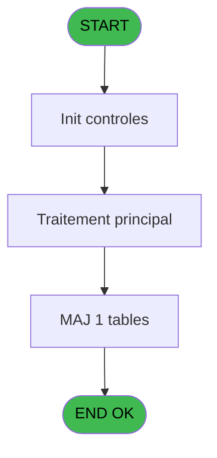
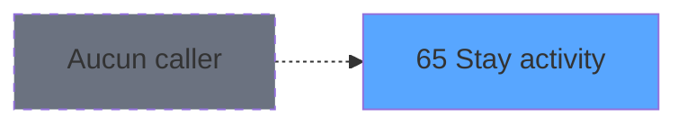

# WEL IDE 65 - Stay activity

> **Analyse**: Phases 1-4 2026-02-03 21:33 -> 21:33 (10s) | Assemblage 21:33
> **Pipeline**: V7.2 Enrichi
> **Structure**: 4 onglets (Resume | Ecrans | Donnees | Connexions)

<!-- TAB:Resume -->

## 1. FICHE D'IDENTITE

| Attribut | Valeur |
|----------|--------|
| Projet | WEL |
| IDE Position | 65 |
| Nom Programme | Stay activity |
| Fichier source | `Prg_65.xml` |
| Dossier IDE | Sejour |
| Taches | 1 (1 ecrans visibles) |
| Tables modifiees | 1 |
| Programmes appeles | 1 |
| :warning: Statut | **ORPHELIN_POTENTIEL** |

## 2. DESCRIPTION FONCTIONNELLE

**Stay activity** assure la gestion complete de ce processus.

Le flux de traitement s'organise en **1 blocs fonctionnels** :

- **Traitement** (1 tache) : traitements metier divers

**Donnees modifiees** : 1 tables en ecriture (hebergement______heb).

**Logique metier** : 2 regles identifiees couvrant conditions metier.

## 3. BLOCS FONCTIONNELS

### 3.1 Traitement (1 tache)

Traitements internes.

---

#### 65 - Stay activity [[ECRAN]](#ecran-t1)

**Role** : Traitement : Stay activity.
**Ecran** : 1313 x 744 DLU | [Voir mockup](#ecran-t1)

## 5. REGLES METIER

2 regles identifiees:

### Autres (2 regles)

#### [RM-001] Si [K]='N' alors 222 sinon IF ([I]*100+Val ([J],'##')<=[AE],220,IF ([G]*100+Val ([H],'##')>[AE],228,IF (v.V0_Date/Heure [B]=0,221,IF (v.V0_Date/Heure [B]=1,222,IF (v.V0_Date/Heure [B]=2,222,IF ([E]='GM',223,229)))))))

| Element | Detail |
|---------|--------|
| **Condition** | `[K]='N'` |
| **Si vrai** | 222 |
| **Si faux** | IF ([I]*100+Val ([J],'##')<=[AE],220,IF ([G]*100+Val ([H],'##')>[AE],228,IF (v.V0_Date/Heure [B]=0,221,IF (v.V0_Date/Heure [B]=1,222,IF (v.V0_Date/Heure [B]=2,222,IF ([E]='GM',223,229))))))) |
| **Variables** | B (v.V0_Date/Heure) |
| **Expression source** | Expression 5 : `IF ([K]='N',222,IF ([I]*100+Val ([J],'##')<=[AE],220,IF ([G]` |
| **Exemple** | Si [K]='N' → 222 |

#### [RM-002] Si [N]='#' alors 'Res' sinon IF ([N]=ASCIIChr (15),'Blo',[N]))&' '&IF ([O]='H','Mr',IF ([O]='F','Me',[O]))&' '&IF([Q],Trim([U]),Trim([P]))

| Element | Detail |
|---------|--------|
| **Condition** | `[N]='#'` |
| **Si vrai** | 'Res' |
| **Si faux** | IF ([N]=ASCIIChr (15),'Blo',[N]))&' '&IF ([O]='H','Mr',IF ([O]='F','Me',[O]))&' '&IF([Q],Trim([U]),Trim([P])) |
| **Expression source** | Expression 17 : `IF ([N]='#','Res',IF ([N]=ASCIIChr (15),'Blo',[N]))&' '&IF (` |
| **Exemple** | Si [N]='#' → 'Res' |

## 6. CONTEXTE

- **Appele par**: (aucun)
- **Appelle**: 1 programmes | **Tables**: 4 (W:1 R:0 L:3) | **Taches**: 1 | **Expressions**: 17

<!-- TAB:Ecrans -->

## 8. ECRANS

### 8.1 Forms visibles (1 / 1)

| # | Position | Tache | Nom | Type | Largeur | Hauteur | Bloc |
|---|----------|-------|-----|------|---------|---------|------|
| 1 | 65 | 65 | Stay activity | Type0 | 1313 | 744 | Traitement |

### 8.2 Mockups Ecrans

---

#### 65 - Stay activity
**Tache** : [65](#t1) | **Type** : Type0 | **Dimensions** : 1313 x 744 DLU
**Bloc** : Traitement | **Titre IDE** : Stay activity

<!-- FORM-DATA:
{
    "width":  1313,
    "vFactor":  100,
    "type":  "Type0",
    "hFactor":  100,
    "controls":  [
                     {
                         "x":  182,
                         "type":  "label",
                         "var":  "",
                         "y":  1,
                         "w":  1130,
                         "fmt":  "",
                         "name":  "",
                         "h":  66,
                         "color":  "212",
                         "text":  "STAY ACTIVITY",
                         "parent":  null
                     },
                     {
                         "x":  400,
                         "type":  "label",
                         "var":  "",
                         "y":  149,
                         "w":  131,
                         "fmt":  "",
                         "name":  "",
                         "h":  44,
                         "color":  "",
                         "text":  "FIRST NAME",
                         "parent":  null
                     },
                     {
                         "x":  529,
                         "type":  "label",
                         "var":  "",
                         "y":  149,
                         "w":  71,
                         "fmt":  "",
                         "name":  "",
                         "h":  44,
                         "color":  "",
                         "text":  "AGE",
                         "parent":  null
                     },
                     {
                         "x":  597,
                         "type":  "label",
                         "var":  "",
                         "y":  149,
                         "w":  78,
                         "fmt":  "",
                         "name":  "",
                         "h":  44,
                         "color":  "",
                         "text":  "ARR",
                         "parent":  null
                     },
                     {
                         "x":  674,
                         "type":  "label",
                         "var":  "",
                         "y":  149,
                         "w":  75,
                         "fmt":  "",
                         "name":  "",
                         "h":  44,
                         "color":  "",
                         "text":  "DEP",
                         "parent":  null
                     },
                     {
                         "x":  748,
                         "type":  "label",
                         "var":  "",
                         "y":  149,
                         "w":  114,
                         "fmt":  "",
                         "name":  "",
                         "h":  44,
                         "color":  "",
                         "text":  "STATUS",
                         "parent":  null
                     },
                     {
                         "x":  861,
                         "type":  "label",
                         "var":  "",
                         "y":  149,
                         "w":  109,
                         "fmt":  "",
                         "name":  "",
                         "h":  44,
                         "color":  "",
                         "text":  "QUAL",
                         "parent":  null
                     },
                     {
                         "x":  147,
                         "type":  "label",
                         "var":  "",
                         "y":  149,
                         "w":  254,
                         "fmt":  "",
                         "name":  "",
                         "h":  44,
                         "color":  "",
                         "text":  "NAME",
                         "parent":  null
                     },
                     {
                         "x":  969,
                         "type":  "label",
                         "var":  "",
                         "y":  149,
                         "w":  121,
                         "fmt":  "",
                         "name":  "",
                         "h":  44,
                         "color":  "",
                         "text":  "CAT",
                         "parent":  null
                     },
                     {
                         "x":  1089,
                         "type":  "label",
                         "var":  "",
                         "y":  149,
                         "w":  103,
                         "fmt":  "",
                         "name":  "",
                         "h":  44,
                         "color":  "",
                         "text":  "ROOM",
                         "parent":  null
                     },
                     {
                         "x":  147,
                         "type":  "table",
                         "var":  "",
                         "name":  "",
                         "titleH":  12,
                         "color":  "",
                         "w":  1045,
                         "y":  192,
                         "fmt":  "",
                         "parent":  null,
                         "text":  "",
                         "rowH":  46,
                         "h":  279,
                         "cols":  [
                                      {
                                          "title":  "NAME",
                                          "layer":  1,
                                          "w":  253
                                      },
                                      {
                                          "title":  "FIRST NAME",
                                          "layer":  2,
                                          "w":  130
                                      },
                                      {
                                          "title":  "AGE",
                                          "layer":  3,
                                          "w":  67
                                      },
                                      {
                                          "title":  "ARR",
                                          "layer":  4,
                                          "w":  77
                                      },
                                      {
                                          "title":  "DEP",
                                          "layer":  5,
                                          "w":  75
                                      },
                                      {
                                          "title":  "STATUS",
                                          "layer":  6,
                                          "w":  110
                                      },
                                      {
                                          "title":  "QUAL",
                                          "layer":  7,
                                          "w":  110
                                      },
                                      {
                                          "title":  "",
                                          "layer":  8,
                                          "w":  119
                                      },
                                      {
                                          "title":  "",
                                          "layer":  9,
                                          "w":  99
                                      }
                                  ],
                         "rows":  9
                     },
                     {
                         "x":  0,
                         "type":  "image",
                         "var":  "",
                         "y":  1,
                         "w":  173,
                         "fmt":  "",
                         "name":  "RETOUR",
                         "h":  66,
                         "color":  "226",
                         "text":  "",
                         "parent":  null
                     },
                     {
                         "x":  1190,
                         "type":  "button",
                         "var":  "",
                         "y":  149,
                         "w":  56,
                         "fmt":  "",
                         "name":  "",
                         "h":  161,
                         "color":  "",
                         "text":  "",
                         "parent":  null
                     },
                     {
                         "x":  152,
                         "type":  "edit",
                         "var":  "",
                         "y":  197,
                         "w":  245,
                         "fmt":  "30",
                         "name":  "Nom",
                         "h":  36,
                         "color":  "220",
                         "text":  "",
                         "parent":  13
                     },
                     {
                         "x":  406,
                         "type":  "edit",
                         "var":  "",
                         "y":  197,
                         "w":  121,
                         "fmt":  "",
                         "name":  "Prenom",
                         "h":  36,
                         "color":  "220",
                         "text":  "",
                         "parent":  13
                     },
                     {
                         "x":  538,
                         "type":  "edit",
                         "var":  "",
                         "y":  197,
                         "w":  50,
                         "fmt":  "2Z",
                         "name":  "Age",
                         "h":  36,
                         "color":  "220",
                         "text":  "",
                         "parent":  13
                     },
                     {
                         "x":  603,
                         "type":  "edit",
                         "var":  "",
                         "y":  197,
                         "w":  69,
                         "fmt":  "##/##Z",
                         "name":  "Room",
                         "h":  36,
                         "color":  "220",
                         "text":  "",
                         "parent":  13
                     },
                     {
                         "x":  680,
                         "type":  "edit",
                         "var":  "",
                         "y":  197,
                         "w":  68,
                         "fmt":  "##/##Z",
                         "name":  "Date Depart",
                         "h":  36,
                         "color":  "220",
                         "text":  "",
                         "parent":  13
                     },
                     {
                         "x":  754,
                         "type":  "edit",
                         "var":  "",
                         "y":  197,
                         "w":  100,
                         "fmt":  "",
                         "name":  "Statut",
                         "h":  36,
                         "color":  "220",
                         "text":  "",
                         "parent":  13
                     },
                     {
                         "x":  862,
                         "type":  "edit",
                         "var":  "",
                         "y":  197,
                         "w":  100,
                         "fmt":  "30",
                         "name":  "Qualite",
                         "h":  36,
                         "color":  "220",
                         "text":  "",
                         "parent":  13
                     },
                     {
                         "x":  977,
                         "type":  "edit",
                         "var":  "",
                         "y":  197,
                         "w":  100,
                         "fmt":  "",
                         "name":  "heb_type_hebergement",
                         "h":  36,
                         "color":  "220",
                         "text":  "",
                         "parent":  13
                     },
                     {
                         "x":  1113,
                         "type":  "edit",
                         "var":  "",
                         "y":  199,
                         "w":  71,
                         "fmt":  "",
                         "name":  "heb_nom_logement",
                         "h":  36,
                         "color":  "220",
                         "text":  "",
                         "parent":  13
                     },
                     {
                         "x":  1190,
                         "type":  "button",
                         "var":  "",
                         "y":  308,
                         "w":  56,
                         "fmt":  "",
                         "name":  "",
                         "h":  163,
                         "color":  "",
                         "text":  "",
                         "parent":  null
                     }
                 ],
    "taskId":  "65",
    "height":  744
}
-->

<strong>Champs : 9 champs</strong>

| Pos (x,y) | Nom | Variable | Type |
|-----------|-----|----------|------|
| 152,197 | Nom | - | edit |
| 406,197 | Prenom | - | edit |
| 538,197 | Age | - | edit |
| 603,197 | Room | - | edit |
| 680,197 | Date Depart | - | edit |
| 754,197 | Statut | - | edit |
| 862,197 | Qualite | - | edit |
| 977,197 | heb_type_hebergement | - | edit |
| 1113,199 | heb_nom_logement | - | edit |

<strong>Boutons : 2 boutons</strong>

| Bouton | Pos (x,y) | Action |
|--------|-----------|--------|
| (sans nom) | 1190,149 | Action declenchee |
| (sans nom) | 1190,308 | Action declenchee |

## 9. NAVIGATION

Ecran unique: **Stay activity**

### 9.3 Structure hierarchique (1 tache)

| Position | Tache | Type | Dimensions | Bloc |
|----------|-------|------|------------|------|
| **65.1** | [**Stay activity** (65)](#t1) [mockup](#ecran-t1) | - | 1313x744 | Traitement |

### 9.4 Algorigramme

> **Legende**: Vert = START/END OK | Rouge = END KO | Bleu = Decisions
> *Algorigramme auto-genere. Utiliser `/algorigramme` pour une synthese metier detaillee.*

<!-- TAB:Donnees -->

## 10. TABLES

### Tables utilisees (4)

| ID | Nom | Description | Type | R | W | L | Usages |
|----|-----|-------------|------|---|---|---|--------|
| 34 | hebergement______heb | Hebergement (chambres) | DB |   | **W** |   | 1 |
| 131 | fichier_validation |  | DB |   |   | L | 1 |
| 356 | gm_millesia |  | DB |   |   | L | 1 |
| 800 | moyen_paiement_complement |  | DB |   |   | L | 1 |

### Colonnes par table (1 / 1 tables avec colonnes identifiees)

Table 34 - hebergement______heb (**W**) - 1 usages

| Lettre | Variable | Acces | Type |
|--------|----------|-------|------|
| A | v.CustomerExist? | W | Logical |
| B | v.V0_Date/Heure | W | Numeric |

## 11. VARIABLES

### 11.1 Variables de session (2)

Variables persistantes pendant toute la session.

| Lettre | Nom | Type | Usage dans |
|--------|-----|------|-----------|
| A | v.CustomerExist? | Logical | 1x session |
| B | v.V0_Date/Heure | Numeric | 2x session |

## 12. EXPRESSIONS

**17 / 17 expressions decodees (100%)**

### 12.1 Repartition par type

| Type | Expressions | Regles |
|------|-------------|--------|
| CONCATENATION | 3 | 5 |
| CALCUL | 1 | 5 |
| CONSTANTE | 3 | 0 |
| DATE | 1 | 0 |
| REFERENCE_VG | 4 | 0 |
| OTHER | 5 | 0 |

### 12.2 Expressions cles par type

#### CONCATENATION (3 expressions)

| Type | IDE | Expression | Regle |
|------|-----|------------|-------|
| CONCATENATION | 17 | `IF ([N]='#','Res',IF ([N]=ASCIIChr (15),'Blo',[N]))&' '&IF ([O]='H','Mr',IF ([O]='F','Me',[O]))&' '&IF([Q],Trim([U]),Trim([P]))` | [RM-002](#rm-RM-002) |
| CONCATENATION | 4 | `Trim([L])&' '&IF ([M]<>'N' AND [M]<>'O',[M],'')` | - |
| CONCATENATION | 1 | `'STAY ACTIVITY - '&Trim([U])&' '&Trim([V])` | - |

#### CALCUL (1 expressions)

| Type | IDE | Expression | Regle |
|------|-----|------------|-------|
| CALCUL | 5 | `IF ([K]='N',222,IF ([I]*100+Val ([J],'##')<=[AE],220,IF ([G]*100+Val ([H],'##')>[AE],228,IF (v.V0_Date/Heure [B]=0,221,IF (v.V0_Date/Heure [B]=1,222,IF (v.V0_Date/Heure [B]=2,222,IF ([E]='GM',223,229)))))))` | [RM-001](#rm-RM-001) |

#### CONSTANTE (3 expressions)

| Type | IDE | Expression | Regle |
|------|-----|------------|-------|
| CONSTANTE | 9 | `'STAY_ACTIV'` | - |
| CONSTANTE | 8 | `'CLIENT'` | - |
| CONSTANTE | 3 | `'H'` | - |

#### DATE (1 expressions)

| Type | IDE | Expression | Regle |
|------|-----|------------|-------|
| DATE | 6 | `Date ()*100+Hour (Time ())` | - |

#### REFERENCE_VG (4 expressions)

| Type | IDE | Expression | Regle |
|------|-----|------------|-------|
| REFERENCE_VG | 12 | `VG9` | - |
| REFERENCE_VG | 13 | `VG10` | - |
| REFERENCE_VG | 2 | `VG5` | - |
| REFERENCE_VG | 7 | `VG6` | - |

#### OTHER (5 expressions)

| Type | IDE | Expression | Regle |
|------|-----|------------|-------|
| OTHER | 15 | `v.V0_Date/Heure [B]` | - |
| OTHER | 16 | `[C]` | - |
| OTHER | 14 | `v.CustomerExist? [A]` | - |
| OTHER | 10 | `MlsTrans('Call Stay Activity')` | - |
| OTHER | 11 | `[AA]` | - |

<!-- TAB:Connexions -->

## 13. GRAPHE D'APPELS

### 13.1 Chaine depuis Main (Callers)

**Chemin**: (pas de callers directs)

### 13.2 Callers

| IDE | Nom Programme | Nb Appels |
|-----|---------------|-----------|
| - | (aucun) | - |

### 13.3 Callees (programmes appeles)

### 13.4 Detail Callees avec contexte

| IDE | Nom Programme | Appels | Contexte |
|-----|---------------|--------|----------|
| [81](WEL-IDE-81.md) | Create logbook | 1 | Sous-programme |

## 14. RECOMMANDATIONS MIGRATION

### 14.1 Profil du programme

| Metrique | Valeur | Impact migration |
|----------|--------|-----------------|
| Lignes de logique | 42 | Programme compact |
| Expressions | 17 | Peu de logique |
| Tables WRITE | 1 | Impact faible |
| Sous-programmes | 1 | Peu de dependances |
| Ecrans visibles | 1 | Ecran unique ou traitement batch |
| Code desactive | 0% (0 / 42) | Code sain |
| Regles metier | 2 | Quelques regles a preserver |

### 14.2 Plan de migration par bloc

#### Traitement (1 tache: 1 ecran, 0 traitement)

- **Strategie** : 1 composant(s) UI (Razor/React) avec formulaires et validation.
- 1 sous-programme(s) a migrer ou a reutiliser depuis les services existants.
- Decomposer les taches en services unitaires testables.

### 14.3 Dependances critiques

| Dependance | Type | Appels | Impact |
|------------|------|--------|--------|
| hebergement______heb | Table WRITE (Database) | 1x | Schema + repository |
| [Create logbook (IDE 81)](WEL-IDE-81.md) | Sous-programme | 1x | Normale - Sous-programme |

---
*Spec DETAILED generee par Pipeline V7.2 - 2026-02-03 21:33*
