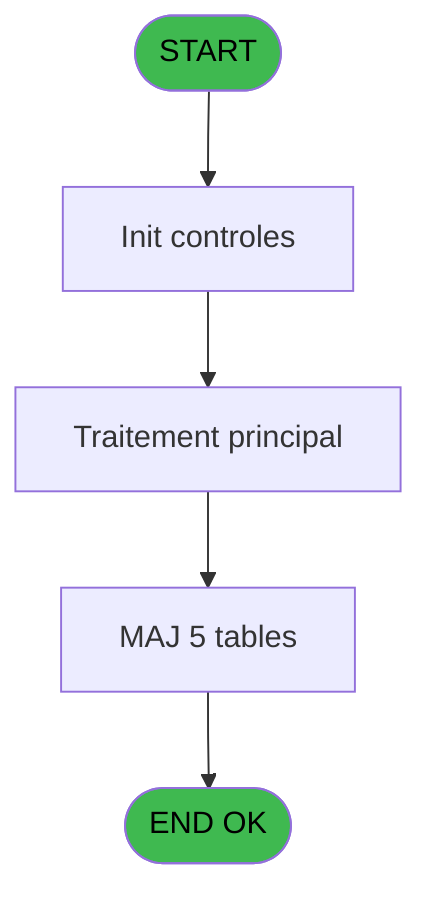
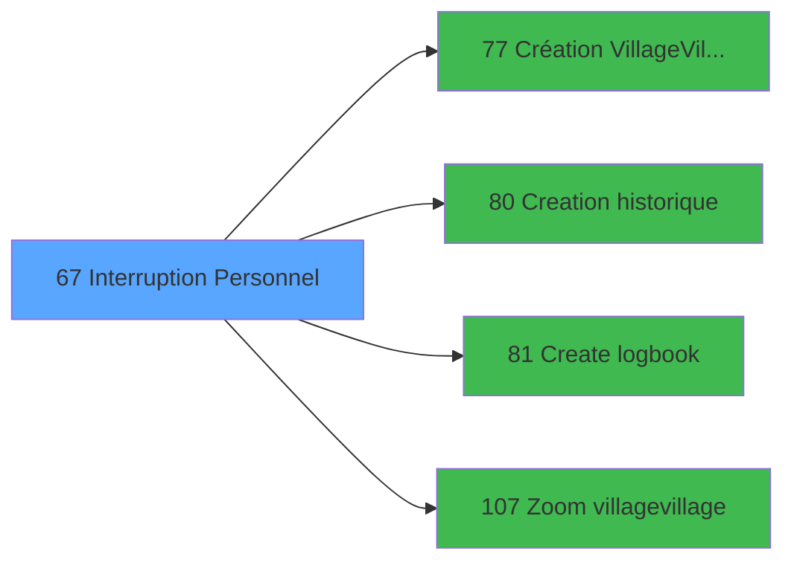

# WEL IDE 67 - Interruption Personnel

> **Analyse**: Phases 1-4 2026-02-03 21:33 -> 21:33 (10s) | Assemblage 21:33
> **Pipeline**: V7.2 Enrichi
> **Structure**: 4 onglets (Resume | Ecrans | Donnees | Connexions)

<!-- TAB:Resume -->

## 1. FICHE D'IDENTITE

| Attribut | Valeur |
|----------|--------|
| Projet | WEL |
| IDE Position | 67 |
| Nom Programme | Interruption Personnel |
| Fichier source | `Prg_67.xml` |
| Dossier IDE | Sejour |
| Taches | 12 (0 ecrans visibles) |
| Tables modifiees | 5 |
| Programmes appeles | 4 |

## 2. DESCRIPTION FONCTIONNELLE

**Interruption Personnel** assure la gestion complete de ce processus, accessible depuis [Clients (IDE 9)](WEL-IDE-9.md).

Le flux de traitement s'organise en **4 blocs fonctionnels** :

- **Traitement** (8 taches) : traitements metier divers
- **Validation** (2 taches) : controles et verifications de coherence
- **Calcul** (1 tache) : calculs de montants, stocks ou compteurs
- **Saisie** (1 tache) : ecrans de saisie utilisateur (formulaires, champs, donnees)

**Donnees modifiees** : 5 tables en ecriture (gm-recherche_____gmr, hebergement______heb, personnel_go______go, compte_gm________cgm, fichier_validation).

Detail : phases du traitement

#### Phase 1 : Traitement (8 taches)

- **67** - Interruption Personnel **[[ECRAN]](#ecran-t1)**
- **67.1** - Recuperation Periode
- **67.3** - Confirmation Interruption **[[ECRAN]](#ecran-t4)**
- **67.4** - Interruption Batch **[[ECRAN]](#ecran-t5)**
- **67.4.1** - Modification Hebergement
- **67.4.2** - Modification Package
- **67.4.3** - Modification Sejour
- **67.4.4** - Modification Sejour

Delegue a : [Création Village/Village (IDE 77)](WEL-IDE-77.md)

#### Phase 2 : Saisie (1 tache)

- **67.2** - Saisie Date Fin **[[ECRAN]](#ecran-t3)**

#### Phase 3 : Validation (2 taches)

- **67.4.5** - Verification Compte
- **67.4.7** - Modification Validation

#### Phase 4 : Calcul (1 tache)

- **67.4.6** - Modification Compte

#### Tables impactees

| Table | Operations | Role metier |
|-------|-----------|-------------|
| hebergement______heb | R/**W** (3 usages) | Hebergement (chambres) |
| gm-recherche_____gmr | R/**W** (2 usages) | Index de recherche |
| personnel_go______go | R/**W** (2 usages) |  |
| fichier_validation | **W** (1 usages) |  |
| compte_gm________cgm | **W** (1 usages) | Comptes GM (generaux) |

## 3. BLOCS FONCTIONNELS

### 3.1 Traitement (8 taches)

Traitements internes.

---

#### 67 - Interruption Personnel [[ECRAN]](#ecran-t1)

**Role** : Tache d'orchestration : point d'entree du programme (8 sous-taches). Coordonne l'enchainement des traitements.
**Ecran** : 132 x 48 DLU (MDI) | [Voir mockup](#ecran-t1)

7 sous-taches directes

| Tache | Nom | Bloc |
|-------|-----|------|
| [67.1](#t2) | Recuperation Periode | Traitement |
| [67.3](#t4) | Confirmation Interruption **[[ECRAN]](#ecran-t4)** | Traitement |
| [67.4](#t5) | Interruption Batch **[[ECRAN]](#ecran-t5)** | Traitement |
| [67.4.1](#t6) | Modification Hebergement | Traitement |
| [67.4.2](#t7) | Modification Package | Traitement |
| [67.4.3](#t8) | Modification Sejour | Traitement |
| [67.4.4](#t9) | Modification Sejour | Traitement |

**Delegue a** : [Création Village/Village (IDE 77)](WEL-IDE-77.md)

---

#### 67.1 - Recuperation Periode

**Role** : Consultation/chargement : Recuperation Periode.
**Delegue a** : [Création Village/Village (IDE 77)](WEL-IDE-77.md)

---

#### 67.3 - Confirmation Interruption [[ECRAN]](#ecran-t4)

**Role** : Traitement : Confirmation Interruption.
**Ecran** : 132 x 32 DLU (Modal) | [Voir mockup](#ecran-t4)
**Delegue a** : [Création Village/Village (IDE 77)](WEL-IDE-77.md)

---

#### 67.4 - Interruption Batch [[ECRAN]](#ecran-t5)

**Role** : Traitement : Interruption Batch.
**Ecran** : 132 x 32 DLU (Modal) | [Voir mockup](#ecran-t5)
**Delegue a** : [Création Village/Village (IDE 77)](WEL-IDE-77.md)

---

#### 67.4.1 - Modification Hebergement

**Role** : Traitement : Modification Hebergement.
**Delegue a** : [Création Village/Village (IDE 77)](WEL-IDE-77.md)

---

#### 67.4.2 - Modification Package

**Role** : Traitement : Modification Package.
**Delegue a** : [Création Village/Village (IDE 77)](WEL-IDE-77.md)

---

#### 67.4.3 - Modification Sejour

**Role** : Traitement : Modification Sejour.
**Delegue a** : [Création Village/Village (IDE 77)](WEL-IDE-77.md)

---

#### 67.4.4 - Modification Sejour

**Role** : Traitement : Modification Sejour.
**Delegue a** : [Création Village/Village (IDE 77)](WEL-IDE-77.md)

### 3.2 Saisie (1 tache)

L'operateur saisit les donnees de la transaction via 1 ecran (Saisie Date Fin).

---

#### 67.2 - Saisie Date Fin [[ECRAN]](#ecran-t3)

**Role** : Saisie des donnees : Saisie Date Fin.
**Ecran** : 413 x 87 DLU (MDI) | [Voir mockup](#ecran-t3)
**Variables liees** : A (P.Date), B (W0-Date Debut), D (W0-Date Prevue), F (W0-Date Fin)

### 3.3 Validation (2 taches)

Controles de coherence : 2 taches verifient les donnees et conditions.

---

#### 67.4.5 - Verification Compte

**Role** : Verification : Verification Compte.

---

#### 67.4.7 - Modification Validation

**Role** : Verification : Modification Validation.

### 3.4 Calcul (1 tache)

Calculs metier : montants, stocks, compteurs.

---

#### 67.4.6 - Modification Compte

**Role** : Traitement : Modification Compte.

## 5. REGLES METIER

*(Aucune regle metier identifiee)*

## 6. CONTEXTE

- **Appele par**: [Clients (IDE 9)](WEL-IDE-9.md)
- **Appelle**: 4 programmes | **Tables**: 6 (W:5 R:3 L:1) | **Taches**: 12 | **Expressions**: 7

<!-- TAB:Ecrans -->

## 8. ECRANS

*(Programme sans ecran visible)*

## 9. NAVIGATION

### 9.3 Structure hierarchique (12 taches)

| Position | Tache | Type | Dimensions | Bloc |
|----------|-------|------|------------|------|
| **67.1** | [**Interruption Personnel** (67)](#t1) [mockup](#ecran-t1) | MDI | 132x48 | Traitement |
| 67.1.1 | [Recuperation Periode (67.1)](#t2) | MDI | - | |
| 67.1.2 | [Confirmation Interruption (67.3)](#t4) [mockup](#ecran-t4) | Modal | 132x32 | |
| 67.1.3 | [Interruption Batch (67.4)](#t5) [mockup](#ecran-t5) | Modal | 132x32 | |
| 67.1.4 | [Modification Hebergement (67.4.1)](#t6) | MDI | - | |
| 67.1.5 | [Modification Package (67.4.2)](#t7) | MDI | - | |
| 67.1.6 | [Modification Sejour (67.4.3)](#t8) | MDI | - | |
| 67.1.7 | [Modification Sejour (67.4.4)](#t9) | MDI | - | |
| **67.2** | [**Saisie Date Fin** (67.2)](#t3) [mockup](#ecran-t3) | MDI | 413x87 | Saisie |
| **67.3** | [**Verification Compte** (67.4.5)](#t10) | MDI | - | Validation |
| 67.3.1 | [Modification Validation (67.4.7)](#t12) | MDI | - | |
| **67.4** | [**Modification Compte** (67.4.6)](#t11) | MDI | - | Calcul |

### 9.4 Algorigramme

> **Legende**: Vert = START/END OK | Rouge = END KO | Bleu = Decisions
> *Algorigramme auto-genere. Utiliser `/algorigramme` pour une synthese metier detaillee.*

<!-- TAB:Donnees -->

## 10. TABLES

### Tables utilisees (6)

| ID | Nom | Description | Type | R | W | L | Usages |
|----|-----|-------------|------|---|---|---|--------|
| 30 | gm-recherche_____gmr | Index de recherche | DB | R | **W** |   | 2 |
| 34 | hebergement______heb | Hebergement (chambres) | DB | R | **W** |   | 3 |
| 35 | personnel_go______go |  | DB | R | **W** |   | 2 |
| 47 | compte_gm________cgm | Comptes GM (generaux) | DB |   | **W** |   | 1 |
| 131 | fichier_validation |  | DB |   | **W** |   | 1 |
| 134 | groupe_arr_dep___vol |  | DB |   |   | L | 1 |

### Colonnes par table (2 / 5 tables avec colonnes identifiees)

Table 30 - gm-recherche_____gmr (R/**W**) - 2 usages

*Table utilisee uniquement en Link ou aucune colonne Real identifiee dans le DataView.*

Table 34 - hebergement______heb (R/**W**) - 3 usages

*Table utilisee uniquement en Link ou aucune colonne Real identifiee dans le DataView.*

Table 35 - personnel_go______go (R/**W**) - 2 usages

| Lettre | Variable | Acces | Type |
|--------|----------|-------|------|
| A | W1-Date Compte | W | Date |
| B | W1-Fin de Sejour | W | Date |
| C | V.Sejour valide | W | Alpha |

Table 47 - compte_gm________cgm (**W**) - 1 usages

| Lettre | Variable | Acces | Type |
|--------|----------|-------|------|
| A | W1-Date Compte | W | Date |

Table 131 - fichier_validation (**W**) - 1 usages

*Table utilisee uniquement en Link ou aucune colonne Real identifiee dans le DataView.*

## 11. VARIABLES

### 11.1 Parametres entrants (1)

Variables recues du programme appelant ([Clients (IDE 9)](WEL-IDE-9.md)).

| Lettre | Nom | Type | Usage dans |
|--------|-----|------|-----------|
| A | P.Date | Date | - |

### 11.2 Variables de travail (1)

Variables internes au programme.

| Lettre | Nom | Type | Usage dans |
|--------|-----|------|-----------|
| I | W0 Code VV | Alpha | - |

### 11.3 Autres (9)

Variables diverses.

| Lettre | Nom | Type | Usage dans |
|--------|-----|------|-----------|
| B | W0-Date Debut | Date | - |
| C | W0-Heure Debut | Alpha | - |
| D | W0-Date Prevue | Date | - |
| E | W0-Heure Prevue | Alpha | - |
| F | W0-Date Fin | Date | - |
| G | W0-Heure Fin | Alpha | - |
| H | W0-Existe VV | Logical | 1x refs |
| J | W0-Heure VV | Alpha | - |
| K | W0-Accord Suite | Alpha | 2x refs |

## 12. EXPRESSIONS

**7 / 7 expressions decodees (100%)**

### 12.1 Repartition par type

| Type | Expressions | Regles |
|------|-------------|--------|
| CONSTANTE | 2 | 0 |
| REFERENCE_VG | 2 | 0 |
| CONDITION | 2 | 0 |
| OTHER | 1 | 0 |

### 12.2 Expressions cles par type

#### CONSTANTE (2 expressions)

| Type | IDE | Expression | Regle |
|------|-----|------------|-------|
| CONSTANTE | 6 | `'R'` | - |
| CONSTANTE | 5 | `''` | - |

#### REFERENCE_VG (2 expressions)

| Type | IDE | Expression | Regle |
|------|-----|------------|-------|
| REFERENCE_VG | 2 | `VG5` | - |
| REFERENCE_VG | 1 | `VG9` | - |

#### CONDITION (2 expressions)

| Type | IDE | Expression | Regle |
|------|-----|------------|-------|
| CONDITION | 4 | `W0-Accord Suite [K]='E'` | - |
| CONDITION | 3 | `W0-Accord Suite [K]='O'` | - |

#### OTHER (1 expressions)

| Type | IDE | Expression | Regle |
|------|-----|------------|-------|
| OTHER | 7 | `NOT(W0-Existe VV [H])` | - |

<!-- TAB:Connexions -->

## 13. GRAPHE D'APPELS

### 13.1 Chaine depuis Main (Callers)

Main -> ... -> [Clients (IDE 9)](WEL-IDE-9.md) -> **Interruption Personnel (IDE 67)**

### 13.2 Callers

| IDE | Nom Programme | Nb Appels |
|-----|---------------|-----------|
| [9](WEL-IDE-9.md) | Clients | 1 |

### 13.3 Callees (programmes appeles)

### 13.4 Detail Callees avec contexte

| IDE | Nom Programme | Appels | Contexte |
|-----|---------------|--------|----------|
| [77](WEL-IDE-77.md) | Création Village/Village | 1 | Sous-programme |
| [80](WEL-IDE-80.md) | Creation historique | 1 | Historique/consultation |
| [81](WEL-IDE-81.md) | Create logbook | 1 | Sous-programme |
| [107](WEL-IDE-107.md) | Zoom village/village | 1 | Selection/consultation |

## 14. RECOMMANDATIONS MIGRATION

### 14.1 Profil du programme

| Metrique | Valeur | Impact migration |
|----------|--------|-----------------|
| Lignes de logique | 196 | Programme compact |
| Expressions | 7 | Peu de logique |
| Tables WRITE | 5 | Impact modere |
| Sous-programmes | 4 | Peu de dependances |
| Ecrans visibles | 0 | Ecran unique ou traitement batch |
| Code desactive | 0% (0 / 196) | Code sain |
| Regles metier | 0 | Pas de regle identifiee |

### 14.2 Plan de migration par bloc

#### Traitement (8 taches: 3 ecrans, 5 traitements)

- **Strategie** : Orchestrateur avec 3 ecrans (Razor/React) et 5 traitements backend (services).
- Les ecrans deviennent des composants UI, les traitements invisibles deviennent des services injectables.
- 4 sous-programme(s) a migrer ou a reutiliser depuis les services existants.
- Decomposer les taches en services unitaires testables.

#### Saisie (1 tache: 1 ecran, 0 traitement)

- **Strategie** : Formulaire React/Blazor avec validation Zod/FluentValidation.
- Reproduire 1 ecran : Saisie Date Fin
- Validation temps reel cote client + serveur

#### Validation (2 taches: 0 ecran, 2 traitements)

- **Strategie** : FluentValidation avec validators specifiques.
- Chaque tache de validation -> un validator injectable

#### Calcul (1 tache: 0 ecran, 1 traitement)

- **Strategie** : Services de calcul purs (Domain Services).
- Migrer la logique de calcul (stock, compteurs, montants)

### 14.3 Dependances critiques

| Dependance | Type | Appels | Impact |
|------------|------|--------|--------|
| gm-recherche_____gmr | Table WRITE (Database) | 1x | Schema + repository |
| hebergement______heb | Table WRITE (Database) | 2x | Schema + repository |
| personnel_go______go | Table WRITE (Database) | 1x | Schema + repository |
| compte_gm________cgm | Table WRITE (Database) | 1x | Schema + repository |
| fichier_validation | Table WRITE (Database) | 1x | Schema + repository |
| [Create logbook (IDE 81)](WEL-IDE-81.md) | Sous-programme | 1x | Normale - Sous-programme |
| [Zoom village/village (IDE 107)](WEL-IDE-107.md) | Sous-programme | 1x | Normale - Selection/consultation |
| [Création Village/Village (IDE 77)](WEL-IDE-77.md) | Sous-programme | 1x | Normale - Sous-programme |
| [Creation historique (IDE 80)](WEL-IDE-80.md) | Sous-programme | 1x | Normale - Historique/consultation |

---
*Spec DETAILED generee par Pipeline V7.2 - 2026-02-03 21:33*
