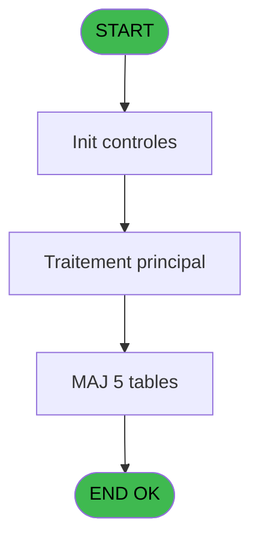
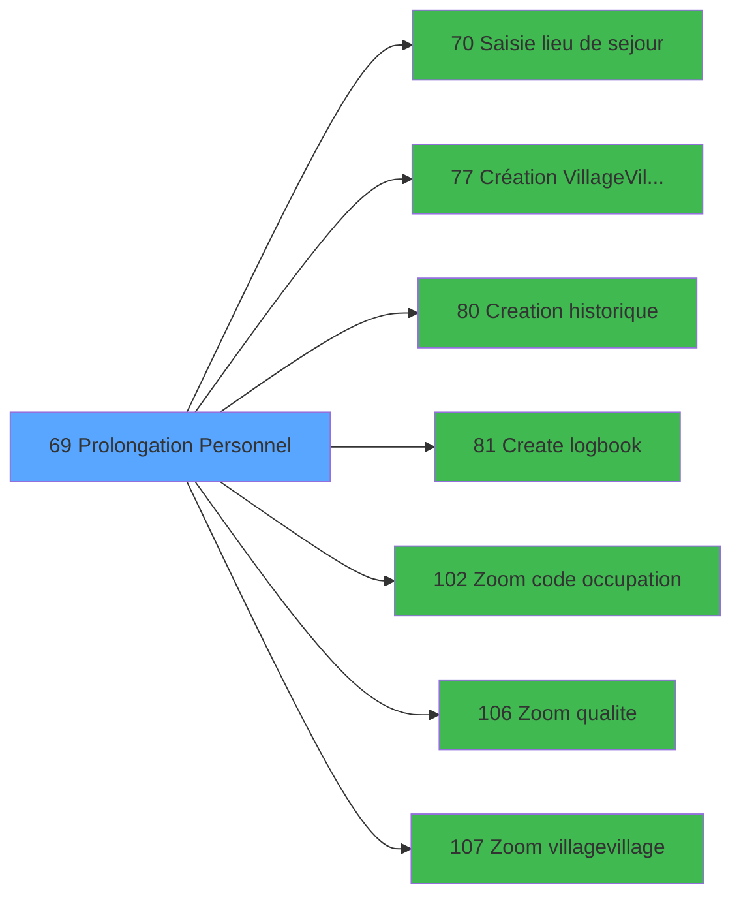

# WEL IDE 69 - Prolongation Personnel

> **Analyse**: Phases 1-4 2026-02-03 21:34 -> 21:34 (10s) | Assemblage 21:34
> **Pipeline**: V7.2 Enrichi
> **Structure**: 4 onglets (Resume | Ecrans | Donnees | Connexions)

<!-- TAB:Resume -->

## 1. FICHE D'IDENTITE

| Attribut | Valeur |
|----------|--------|
| Projet | WEL |
| IDE Position | 69 |
| Nom Programme | Prolongation Personnel |
| Fichier source | `Prg_69.xml` |
| Dossier IDE | Sejour |
| Taches | 13 (0 ecrans visibles) |
| Tables modifiees | 5 |
| Programmes appeles | 7 |

## 2. DESCRIPTION FONCTIONNELLE

**Prolongation Personnel** assure la gestion complete de ce processus, accessible depuis [Clients (IDE 9)](WEL-IDE-9.md).

Le flux de traitement s'organise en **5 blocs fonctionnels** :

- **Traitement** (9 taches) : traitements metier divers
- **Calcul** (1 tache) : calculs de montants, stocks ou compteurs
- **Validation** (1 tache) : controles et verifications de coherence
- **Saisie** (1 tache) : ecrans de saisie utilisateur (formulaires, champs, donnees)
- **Creation** (1 tache) : insertion d'enregistrements en base (mouvements, prestations)

**Donnees modifiees** : 5 tables en ecriture (gm-recherche_____gmr, hebergement______heb, personnel_go______go, compte_gm________cgm, fichier_validation).

Detail : phases du traitement

#### Phase 1 : Traitement (9 taches)

- **69** - Prolongation Personnel **[[ECRAN]](#ecran-t1)**
- **69.1** - Recuperation Periode Debut
- **69.3** - Confirmation Prolongation **[[ECRAN]](#ecran-t4)**
- **69.4** - Prolongation Batch **[[ECRAN]](#ecran-t5)**
- **69.4.1** - Recuperation Hebergement
- **69.4.3** - Modification Package
- **69.4.4** - Modification Sejour
- **69.4.5** - Modification Sejour
- **69.4.8** - Credit Bar **[[ECRAN]](#ecran-t13)**

Delegue a : [Création Village/Village (IDE 77)](WEL-IDE-77.md)

#### Phase 2 : Saisie (1 tache)

- **69.2** - Saisie Date Fin **[[ECRAN]](#ecran-t3)**

Delegue a : [Saisie lieu de sejour (IDE 70)](WEL-IDE-70.md)

#### Phase 3 : Creation (1 tache)

- **69.4.2** - Creation Hebergement

Delegue a : [Creation historique (IDE 80)](WEL-IDE-80.md), [Create logbook (IDE 81)](WEL-IDE-81.md)

#### Phase 4 : Calcul (1 tache)

- **69.4.6** - Modification Compte

#### Phase 5 : Validation (1 tache)

- **69.4.7** - Modification Validation

#### Tables impactees

| Table | Operations | Role metier |
|-------|-----------|-------------|
| hebergement______heb | R/**W** (4 usages) | Hebergement (chambres) |
| personnel_go______go | R/**W** (2 usages) |  |
| fichier_validation | **W** (1 usages) |  |
| compte_gm________cgm | **W** (1 usages) | Comptes GM (generaux) |
| gm-recherche_____gmr | **W** (1 usages) | Index de recherche |

## 3. BLOCS FONCTIONNELS

### 3.1 Traitement (9 taches)

Traitements internes.

---

#### 69 - Prolongation Personnel [[ECRAN]](#ecran-t1)

**Role** : Tache d'orchestration : point d'entree du programme (9 sous-taches). Coordonne l'enchainement des traitements.
**Ecran** : 434 x 121 DLU (MDI) | [Voir mockup](#ecran-t1)

8 sous-taches directes

| Tache | Nom | Bloc |
|-------|-----|------|
| [69.1](#t2) | Recuperation Periode Debut | Traitement |
| [69.3](#t4) | Confirmation Prolongation **[[ECRAN]](#ecran-t4)** | Traitement |
| [69.4](#t5) | Prolongation Batch **[[ECRAN]](#ecran-t5)** | Traitement |
| [69.4.1](#t6) | Recuperation Hebergement | Traitement |
| [69.4.3](#t8) | Modification Package | Traitement |
| [69.4.4](#t9) | Modification Sejour | Traitement |
| [69.4.5](#t10) | Modification Sejour | Traitement |
| [69.4.8](#t13) | Credit Bar **[[ECRAN]](#ecran-t13)** | Traitement |

**Delegue a** : [Création Village/Village (IDE 77)](WEL-IDE-77.md)

---

#### 69.1 - Recuperation Periode Debut

**Role** : Consultation/chargement : Recuperation Periode Debut.
**Variables liees** : D (W0-Date Debut), E (W0-Heure Debut)
**Delegue a** : [Création Village/Village (IDE 77)](WEL-IDE-77.md)

---

#### 69.3 - Confirmation Prolongation [[ECRAN]](#ecran-t4)

**Role** : Traitement : Confirmation Prolongation.
**Ecran** : 132 x 32 DLU (Modal) | [Voir mockup](#ecran-t4)
**Delegue a** : [Création Village/Village (IDE 77)](WEL-IDE-77.md)

---

#### 69.4 - Prolongation Batch [[ECRAN]](#ecran-t5)

**Role** : Traitement : Prolongation Batch.
**Ecran** : 392 x 154 DLU (Modal) | [Voir mockup](#ecran-t5)
**Delegue a** : [Création Village/Village (IDE 77)](WEL-IDE-77.md)

---

#### 69.4.1 - Recuperation Hebergement

**Role** : Consultation/chargement : Recuperation Hebergement.
**Delegue a** : [Création Village/Village (IDE 77)](WEL-IDE-77.md)

---

#### 69.4.3 - Modification Package

**Role** : Traitement : Modification Package.
**Delegue a** : [Création Village/Village (IDE 77)](WEL-IDE-77.md)

---

#### 69.4.4 - Modification Sejour

**Role** : Traitement : Modification Sejour.
**Variables liees** : K (W0-Lieu de sejour)
**Delegue a** : [Création Village/Village (IDE 77)](WEL-IDE-77.md)

---

#### 69.4.5 - Modification Sejour

**Role** : Traitement : Modification Sejour.
**Variables liees** : K (W0-Lieu de sejour)
**Delegue a** : [Création Village/Village (IDE 77)](WEL-IDE-77.md)

---

#### 69.4.8 - Credit Bar [[ECRAN]](#ecran-t13)

**Role** : Calcul fidelite/avantage : Credit Bar.
**Ecran** : 500 x 80 DLU (Modal) | [Voir mockup](#ecran-t13)
**Delegue a** : [Création Village/Village (IDE 77)](WEL-IDE-77.md)

### 3.2 Saisie (1 tache)

L'operateur saisit les donnees de la transaction via 1 ecran (Saisie Date Fin).

---

#### 69.2 - Saisie Date Fin [[ECRAN]](#ecran-t3)

**Role** : Saisie des donnees : Saisie Date Fin.
**Ecran** : 622 x 89 DLU (MDI) | [Voir mockup](#ecran-t3)
**Variables liees** : A (P.Date), D (W0-Date Debut), F (W0-Date Fin)
**Delegue a** : [Saisie lieu de sejour (IDE 70)](WEL-IDE-70.md)

### 3.3 Creation (1 tache)

Insertion de nouveaux enregistrements en base.

---

#### 69.4.2 - Creation Hebergement

**Role** : Creation d'enregistrement : Creation Hebergement.
**Delegue a** : [Creation historique (IDE 80)](WEL-IDE-80.md), [Create logbook (IDE 81)](WEL-IDE-81.md)

### 3.4 Calcul (1 tache)

Calculs metier : montants, stocks, compteurs.

---

#### 69.4.6 - Modification Compte

**Role** : Traitement : Modification Compte.

### 3.5 Validation (1 tache)

Controles de coherence : 1 tache verifie les donnees et conditions.

---

#### 69.4.7 - Modification Validation

**Role** : Verification : Modification Validation.

## 5. REGLES METIER

*(Aucune regle metier identifiee)*

## 6. CONTEXTE

- **Appele par**: [Clients (IDE 9)](WEL-IDE-9.md)
- **Appelle**: 7 programmes | **Tables**: 7 (W:5 R:3 L:1) | **Taches**: 13 | **Expressions**: 12

<!-- TAB:Ecrans -->

## 8. ECRANS

*(Programme sans ecran visible)*

## 9. NAVIGATION

### 9.3 Structure hierarchique (13 taches)

| Position | Tache | Type | Dimensions | Bloc |
|----------|-------|------|------------|------|
| **69.1** | [**Prolongation Personnel** (69)](#t1) [mockup](#ecran-t1) | MDI | 434x121 | Traitement |
| 69.1.1 | [Recuperation Periode Debut (69.1)](#t2) | MDI | - | |
| 69.1.2 | [Confirmation Prolongation (69.3)](#t4) [mockup](#ecran-t4) | Modal | 132x32 | |
| 69.1.3 | [Prolongation Batch (69.4)](#t5) [mockup](#ecran-t5) | Modal | 392x154 | |
| 69.1.4 | [Recuperation Hebergement (69.4.1)](#t6) | MDI | - | |
| 69.1.5 | [Modification Package (69.4.3)](#t8) | MDI | - | |
| 69.1.6 | [Modification Sejour (69.4.4)](#t9) | MDI | - | |
| 69.1.7 | [Modification Sejour (69.4.5)](#t10) | MDI | - | |
| 69.1.8 | [Credit Bar (69.4.8)](#t13) [mockup](#ecran-t13) | Modal | 500x80 | |
| **69.2** | [**Saisie Date Fin** (69.2)](#t3) [mockup](#ecran-t3) | MDI | 622x89 | Saisie |
| **69.3** | [**Creation Hebergement** (69.4.2)](#t7) | MDI | - | Creation |
| **69.4** | [**Modification Compte** (69.4.6)](#t11) | MDI | - | Calcul |
| **69.5** | [**Modification Validation** (69.4.7)](#t12) | MDI | - | Validation |

### 9.4 Algorigramme

> **Legende**: Vert = START/END OK | Rouge = END KO | Bleu = Decisions
> *Algorigramme auto-genere. Utiliser `/algorigramme` pour une synthese metier detaillee.*

<!-- TAB:Donnees -->

## 10. TABLES

### Tables utilisees (7)

| ID | Nom | Description | Type | R | W | L | Usages |
|----|-----|-------------|------|---|---|---|--------|
| 30 | gm-recherche_____gmr | Index de recherche | DB |   | **W** |   | 1 |
| 34 | hebergement______heb | Hebergement (chambres) | DB | R | **W** |   | 4 |
| 35 | personnel_go______go |  | DB | R | **W** |   | 2 |
| 47 | compte_gm________cgm | Comptes GM (generaux) | DB |   | **W** |   | 1 |
| 131 | fichier_validation |  | DB |   | **W** |   | 1 |
| 134 | groupe_arr_dep___vol |  | DB |   |   | L | 1 |
| 801 | moyens_reglement_complem | Reglements / paiements | DB | R |   |   | 1 |

### Colonnes par table (2 / 6 tables avec colonnes identifiees)

Table 30 - gm-recherche_____gmr (**W**) - 1 usages

*Table utilisee uniquement en Link ou aucune colonne Real identifiee dans le DataView.*

Table 34 - hebergement______heb (R/**W**) - 4 usages

*Table utilisee uniquement en Link ou aucune colonne Real identifiee dans le DataView.*

Table 35 - personnel_go______go (R/**W**) - 2 usages

| Lettre | Variable | Acces | Type |
|--------|----------|-------|------|
| A | W1-Code Retour | W | Numeric |
| B | W1-Statut Sejour | W | Alpha |
| C | W1-Libelle | W | Alpha |
| D | W1-Age | W | Alpha |
| E | W1-Nationalite | W | Alpha |
| F | W1-Code Sexe | W | Alpha |
| G | W1-Code Fumeur | W | Alpha |
| H | W1-Age num | W | Numeric |
| I | W1-Nb mois | W | Numeric |
| J | W1-Complément Type | W | Unicode |
| K | W1-Lieu de sejour | W | Alpha |

Table 47 - compte_gm________cgm (**W**) - 1 usages

*Table utilisee uniquement en Link ou aucune colonne Real identifiee dans le DataView.*

Table 131 - fichier_validation (**W**) - 1 usages

*Table utilisee uniquement en Link ou aucune colonne Real identifiee dans le DataView.*

Table 801 - moyens_reglement_complem (R) - 1 usages

| Lettre | Variable | Acces | Type |
|--------|----------|-------|------|
| A | v Retout Crédit Bar / Q | R | Logical |
| B | v Date de début | R | Date |
| C | v Date de fin | R | Date |
| D | v Nbre de Jour | R | Numeric |
| E | v Time (N.U) | R | Time |
| F | v Montant Calculé | R | Numeric |

## 11. VARIABLES

### 11.1 Parametres entrants (1)

Variables recues du programme appelant ([Clients (IDE 9)](WEL-IDE-9.md)).

| Lettre | Nom | Type | Usage dans |
|--------|-----|------|-----------|
| A | P.Date | Date | - |

### 11.2 Autres (13)

Variables diverses.

| Lettre | Nom | Type | Usage dans |
|--------|-----|------|-----------|
| B | W0-Qualite | Alpha | - |
| C | W0-Complement | Alpha | 1x refs |
| D | W0-Date Debut | Date | - |
| E | W0-Heure Debut | Alpha | - |
| F | W0-Date Fin | Date | - |
| G | W0-Heure Fin | Alpha | - |
| H | W0-Occupation | Alpha | - |
| I | W0-Base Occupation | Alpha | - |
| J | W0-Accord Suite | Alpha | 3x refs |
| K | W0-Lieu de sejour | Alpha | [69.4.4](#t9), [69.4.5](#t10) |
| L | W0-Existe Code VV | Logical | 1x refs |
| M | W0-Code VV | Alpha | - |
| N | W0-Heure VV | Alpha | - |

## 12. EXPRESSIONS

**12 / 12 expressions decodees (100%)**

### 12.1 Repartition par type

| Type | Expressions | Regles |
|------|-------------|--------|
| CONDITION | 3 | 0 |
| CONSTANTE | 5 | 0 |
| REFERENCE_VG | 3 | 0 |
| OTHER | 1 | 0 |

### 12.2 Expressions cles par type

#### CONDITION (3 expressions)

| Type | IDE | Expression | Regle |
|------|-----|------------|-------|
| CONDITION | 8 | `W0-Accord Suite [J]='E'` | - |
| CONDITION | 6 | `W0-Accord Suite [J]='O'` | - |
| CONDITION | 7 | `W0-Accord Suite [J]='O' AND W0-Lieu de sejour [K]='*'  AND VG31>1 AND IN(W0-Complement [C],'VILL','GE','LOC','STAG','ANS')` | - |

#### CONSTANTE (5 expressions)

| Type | IDE | Expression | Regle |
|------|-----|------------|-------|
| CONSTANTE | 10 | `'R'` | - |
| CONSTANTE | 12 | `'P'` | - |
| CONSTANTE | 9 | `''` | - |
| CONSTANTE | 4 | `'TBAOC'` | - |
| CONSTANTE | 5 | `'P'` | - |

#### REFERENCE_VG (3 expressions)

| Type | IDE | Expression | Regle |
|------|-----|------------|-------|
| REFERENCE_VG | 3 | `VG5` | - |
| REFERENCE_VG | 2 | `VG12` | - |
| REFERENCE_VG | 1 | `VG9` | - |

#### OTHER (1 expressions)

| Type | IDE | Expression | Regle |
|------|-----|------------|-------|
| OTHER | 11 | `NOT(W0-Existe Code VV [L])` | - |

<!-- TAB:Connexions -->

## 13. GRAPHE D'APPELS

### 13.1 Chaine depuis Main (Callers)

Main -> ... -> [Clients (IDE 9)](WEL-IDE-9.md) -> **Prolongation Personnel (IDE 69)**

### 13.2 Callers

| IDE | Nom Programme | Nb Appels |
|-----|---------------|-----------|
| [9](WEL-IDE-9.md) | Clients | 1 |

### 13.3 Callees (programmes appeles)

### 13.4 Detail Callees avec contexte

| IDE | Nom Programme | Appels | Contexte |
|-----|---------------|--------|----------|
| [70](WEL-IDE-70.md) | Saisie lieu de sejour | 1 | Sous-programme |
| [77](WEL-IDE-77.md) | Création Village/Village | 1 | Sous-programme |
| [80](WEL-IDE-80.md) | Creation historique | 1 | Historique/consultation |
| [81](WEL-IDE-81.md) | Create logbook | 1 | Sous-programme |
| [102](WEL-IDE-102.md) | Zoom code occupation | 1 | Selection/consultation |
| [106](WEL-IDE-106.md) | Zoom qualite | 1 | Selection/consultation |
| [107](WEL-IDE-107.md) | Zoom village/village | 1 | Selection/consultation |

## 14. RECOMMANDATIONS MIGRATION

### 14.1 Profil du programme

| Metrique | Valeur | Impact migration |
|----------|--------|-----------------|
| Lignes de logique | 276 | Taille moyenne |
| Expressions | 12 | Peu de logique |
| Tables WRITE | 5 | Impact modere |
| Sous-programmes | 7 | Dependances moderees |
| Ecrans visibles | 0 | Ecran unique ou traitement batch |
| Code desactive | 0% (0 / 276) | Code sain |
| Regles metier | 0 | Pas de regle identifiee |

### 14.2 Plan de migration par bloc

#### Traitement (9 taches: 4 ecrans, 5 traitements)

- **Strategie** : Orchestrateur avec 4 ecrans (Razor/React) et 5 traitements backend (services).
- Les ecrans deviennent des composants UI, les traitements invisibles deviennent des services injectables.
- 7 sous-programme(s) a migrer ou a reutiliser depuis les services existants.
- Decomposer les taches en services unitaires testables.

#### Saisie (1 tache: 1 ecran, 0 traitement)

- **Strategie** : Formulaire React/Blazor avec validation Zod/FluentValidation.
- Reproduire 1 ecran : Saisie Date Fin
- Validation temps reel cote client + serveur

#### Creation (1 tache: 0 ecran, 1 traitement)

- **Strategie** : Repository pattern avec Entity Framework Core.
- Insertion via `IRepository<T>.CreateAsync()`

#### Calcul (1 tache: 0 ecran, 1 traitement)

- **Strategie** : Services de calcul purs (Domain Services).
- Migrer la logique de calcul (stock, compteurs, montants)

#### Validation (1 tache: 0 ecran, 1 traitement)

- **Strategie** : FluentValidation avec validators specifiques.
- Chaque tache de validation -> un validator injectable

### 14.3 Dependances critiques

| Dependance | Type | Appels | Impact |
|------------|------|--------|--------|
| gm-recherche_____gmr | Table WRITE (Database) | 1x | Schema + repository |
| hebergement______heb | Table WRITE (Database) | 2x | Schema + repository |
| personnel_go______go | Table WRITE (Database) | 1x | Schema + repository |
| compte_gm________cgm | Table WRITE (Database) | 1x | Schema + repository |
| fichier_validation | Table WRITE (Database) | 1x | Schema + repository |
| [Zoom code occupation (IDE 102)](WEL-IDE-102.md) | Sous-programme | 1x | Normale - Selection/consultation |
| [Zoom qualite (IDE 106)](WEL-IDE-106.md) | Sous-programme | 1x | Normale - Selection/consultation |
| [Zoom village/village (IDE 107)](WEL-IDE-107.md) | Sous-programme | 1x | Normale - Selection/consultation |
| [Create logbook (IDE 81)](WEL-IDE-81.md) | Sous-programme | 1x | Normale - Sous-programme |
| [Saisie lieu de sejour (IDE 70)](WEL-IDE-70.md) | Sous-programme | 1x | Normale - Sous-programme |
| [Création Village/Village (IDE 77)](WEL-IDE-77.md) | Sous-programme | 1x | Normale - Sous-programme |
| [Creation historique (IDE 80)](WEL-IDE-80.md) | Sous-programme | 1x | Normale - Historique/consultation |

---
*Spec DETAILED generee par Pipeline V7.2 - 2026-02-03 21:34*
