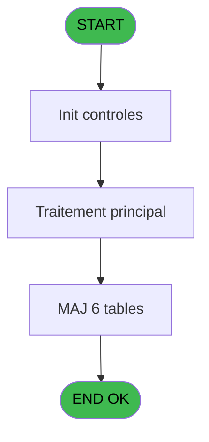
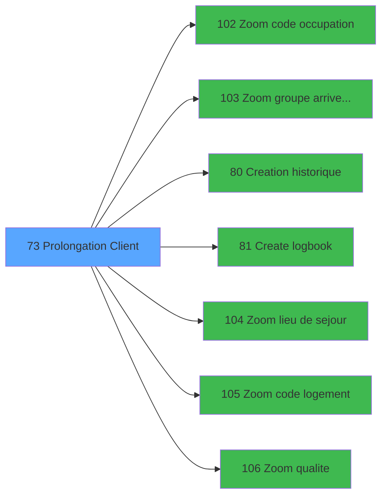

# WEL IDE 73 - Prolongation Client

> **Analyse**: Phases 1-4 2026-02-03 21:35 -> 21:35 (10s) | Assemblage 21:35
> **Pipeline**: V7.2 Enrichi
> **Structure**: 4 onglets (Resume | Ecrans | Donnees | Connexions)

<!-- TAB:Resume -->

## 1. FICHE D'IDENTITE

| Attribut | Valeur |
|----------|--------|
| Projet | WEL |
| IDE Position | 73 |
| Nom Programme | Prolongation Client |
| Fichier source | `Prg_73.xml` |
| Dossier IDE | Sejour |
| Taches | 19 (0 ecrans visibles) |
| Tables modifiees | 6 |
| Programmes appeles | 7 |

## 2. DESCRIPTION FONCTIONNELLE

**Prolongation Client** assure la gestion complete de ce processus, accessible depuis [Clients (IDE 9)](WEL-IDE-9.md).

Le flux de traitement s'organise en **6 blocs fonctionnels** :

- **Traitement** (10 taches) : traitements metier divers
- **Validation** (3 taches) : controles et verifications de coherence
- **Creation** (2 taches) : insertion d'enregistrements en base (mouvements, prestations)
- **Consultation** (2 taches) : ecrans de recherche, selection et consultation
- **Calcul** (1 tache) : calculs de montants, stocks ou compteurs
- **Saisie** (1 tache) : ecrans de saisie utilisateur (formulaires, champs, donnees)

**Donnees modifiees** : 6 tables en ecriture (gm-recherche_____gmr, hebergement______heb, client_gm, compte_gm________cgm, fichier_validation, groupe_arr_dep___vol).

Detail : phases du traitement

#### Phase 1 : Traitement (10 taches)

- **73** - Prolongation Client **[[ECRAN]](#ecran-t1)**
- **73.1.1** - Determination Periode
- **73.2** - Recuperation Periode Debut
- **73.6** - Confirmation Prolongation **[[ECRAN]](#ecran-t10)**
- **73.7** - Prolongation Batch **[[ECRAN]](#ecran-t11)**
- **73.7.2** - Modification Package
- **73.7.3** - Modification Heure Fin circuit
- **73.7.4** - Modification Package
- **73.7.5** - Modification Sejour
- **73.7.6** - Modification Sejour

#### Phase 2 : Consultation (2 taches)

- **73.1** - Selection Qualite
- **73.5** - Selection Logement

Delegue a : [Zoom code occupation (IDE 102)](WEL-IDE-102.md), [Zoom groupe arrivee depart (IDE 103)](WEL-IDE-103.md), [Zoom lieu de sejour (IDE 104)](WEL-IDE-104.md), [Zoom code logement (IDE 105)](WEL-IDE-105.md), [Zoom qualite (IDE 106)](WEL-IDE-106.md)

#### Phase 3 : Saisie (1 tache)

- **73.3** - Saisie Date Fin **[[ECRAN]](#ecran-t5)**

#### Phase 4 : Creation (2 taches)

- **73.4** - Creation groupe V/V Aller/Reto
- **73.7.1** - Creation Hebergement

Delegue a : [Creation historique (IDE 80)](WEL-IDE-80.md), [Create logbook (IDE 81)](WEL-IDE-81.md)

#### Phase 5 : Validation (3 taches)

- **73.5.1** - Verification Lieu de Sejour
- **73.5.2** - Verification Logement
- **73.7.8** - Modification Validation

#### Phase 6 : Calcul (1 tache)

- **73.7.7** - Modification Compte

#### Tables impactees

| Table | Operations | Role metier |
|-------|-----------|-------------|
| hebergement______heb | R/**W** (6 usages) | Hebergement (chambres) |
| client_gm | **W**/L (2 usages) |  |
| compte_gm________cgm | **W** (1 usages) | Comptes GM (generaux) |
| fichier_validation | **W** (1 usages) |  |
| groupe_arr_dep___vol | **W** (1 usages) |  |
| gm-recherche_____gmr | **W** (1 usages) | Index de recherche |

## 3. BLOCS FONCTIONNELS

### 3.1 Traitement (10 taches)

Traitements internes.

---

#### 73 - Prolongation Client [[ECRAN]](#ecran-t1)

**Role** : Tache d'orchestration : point d'entree du programme (10 sous-taches). Coordonne l'enchainement des traitements.
**Ecran** : 132 x 56 DLU (MDI) | [Voir mockup](#ecran-t1)

9 sous-taches directes

| Tache | Nom | Bloc |
|-------|-----|------|
| [73.1.1](#t3) | Determination Periode | Traitement |
| [73.2](#t4) | Recuperation Periode Debut | Traitement |
| [73.6](#t10) | Confirmation Prolongation **[[ECRAN]](#ecran-t10)** | Traitement |
| [73.7](#t11) | Prolongation Batch **[[ECRAN]](#ecran-t11)** | Traitement |
| [73.7.2](#t13) | Modification Package | Traitement |
| [73.7.3](#t14) | Modification Heure Fin circuit | Traitement |
| [73.7.4](#t15) | Modification Package | Traitement |
| [73.7.5](#t16) | Modification Sejour | Traitement |
| [73.7.6](#t17) | Modification Sejour | Traitement |

---

#### 73.1.1 - Determination Periode

**Role** : Traitement : Determination Periode.

---

#### 73.2 - Recuperation Periode Debut

**Role** : Consultation/chargement : Recuperation Periode Debut.
**Variables liees** : N (W0-Date Debut), O (W0-Heure Debut)

---

#### 73.6 - Confirmation Prolongation [[ECRAN]](#ecran-t10)

**Role** : Traitement : Confirmation Prolongation.
**Ecran** : 240 x 115 DLU (MDI) | [Voir mockup](#ecran-t10)

---

#### 73.7 - Prolongation Batch [[ECRAN]](#ecran-t11)

**Role** : Traitement : Prolongation Batch.
**Ecran** : 132 x 32 DLU (Modal) | [Voir mockup](#ecran-t11)

---

#### 73.7.2 - Modification Package

**Role** : Traitement : Modification Package.

---

#### 73.7.3 - Modification Heure Fin circuit

**Role** : Traitement : Modification Heure Fin circuit.
**Variables liees** : O (W0-Heure Debut), Q (W0-Heure Fin)

---

#### 73.7.4 - Modification Package

**Role** : Traitement : Modification Package.

---

#### 73.7.5 - Modification Sejour

**Role** : Traitement : Modification Sejour.
**Variables liees** : Z (W0-Lieu de Sejour)

---

#### 73.7.6 - Modification Sejour

**Role** : Traitement : Modification Sejour.
**Variables liees** : Z (W0-Lieu de Sejour)

### 3.2 Consultation (2 taches)

Ecrans de recherche et consultation.

---

#### 73.1 - Selection Qualite

**Role** : Selection par l'operateur : Selection Qualite.
**Variables liees** : L (W0-Qualite)
**Delegue a** : [Zoom code occupation (IDE 102)](WEL-IDE-102.md), [Zoom groupe arrivee depart (IDE 103)](WEL-IDE-103.md), [Zoom lieu de sejour (IDE 104)](WEL-IDE-104.md)

---

#### 73.5 - Selection Logement

**Role** : Selection par l'operateur : Selection Logement.
**Variables liees** : BA (W0-Code Logement)
**Delegue a** : [Zoom code occupation (IDE 102)](WEL-IDE-102.md), [Zoom groupe arrivee depart (IDE 103)](WEL-IDE-103.md), [Zoom lieu de sejour (IDE 104)](WEL-IDE-104.md)

### 3.3 Saisie (1 tache)

L'operateur saisit les donnees de la transaction via 1 ecran (Saisie Date Fin).

---

#### 73.3 - Saisie Date Fin [[ECRAN]](#ecran-t5)

**Role** : Saisie des donnees : Saisie Date Fin.
**Ecran** : 413 x 86 DLU (MDI) | [Voir mockup](#ecran-t5)
**Variables liees** : B (P0.Date), N (W0-Date Debut), P (W0-Date Fin)

### 3.4 Creation (2 taches)

Insertion de nouveaux enregistrements en base.

---

#### 73.4 - Creation groupe V/V Aller/Reto

**Role** : Creation d'enregistrement : Creation groupe V/V Aller/Reto.
**Variables liees** : A (P0 Groupe Depart)
**Delegue a** : [Creation historique (IDE 80)](WEL-IDE-80.md), [Create logbook (IDE 81)](WEL-IDE-81.md)

---

#### 73.7.1 - Creation Hebergement

**Role** : Creation d'enregistrement : Creation Hebergement.
**Delegue a** : [Creation historique (IDE 80)](WEL-IDE-80.md), [Create logbook (IDE 81)](WEL-IDE-81.md)

### 3.5 Validation (3 taches)

Controles de coherence : 3 taches verifient les donnees et conditions.

---

#### 73.5.1 - Verification Lieu de Sejour

**Role** : Verification : Verification Lieu de Sejour.
**Variables liees** : Z (W0-Lieu de Sejour)

---

#### 73.5.2 - Verification Logement

**Role** : Verification : Verification Logement.
**Variables liees** : BA (W0-Code Logement)

---

#### 73.7.8 - Modification Validation

**Role** : Verification : Modification Validation.

### 3.6 Calcul (1 tache)

Calculs metier : montants, stocks, compteurs.

---

#### 73.7.7 - Modification Compte

**Role** : Traitement : Modification Compte.

## 5. REGLES METIER

*(Aucune regle metier identifiee)*

## 6. CONTEXTE

- **Appele par**: [Clients (IDE 9)](WEL-IDE-9.md)
- **Appelle**: 7 programmes | **Tables**: 9 (W:6 R:4 L:1) | **Taches**: 19 | **Expressions**: 12

<!-- TAB:Ecrans -->

## 8. ECRANS

*(Programme sans ecran visible)*

## 9. NAVIGATION

### 9.3 Structure hierarchique (19 taches)

| Position | Tache | Type | Dimensions | Bloc |
|----------|-------|------|------------|------|
| **73.1** | [**Prolongation Client** (73)](#t1) [mockup](#ecran-t1) | MDI | 132x56 | Traitement |
| 73.1.1 | [Determination Periode (73.1.1)](#t3) | MDI | - | |
| 73.1.2 | [Recuperation Periode Debut (73.2)](#t4) | MDI | - | |
| 73.1.3 | [Confirmation Prolongation (73.6)](#t10) [mockup](#ecran-t10) | MDI | 240x115 | |
| 73.1.4 | [Prolongation Batch (73.7)](#t11) [mockup](#ecran-t11) | Modal | 132x32 | |
| 73.1.5 | [Modification Package (73.7.2)](#t13) | MDI | - | |
| 73.1.6 | [Modification Heure Fin circuit (73.7.3)](#t14) | MDI | - | |
| 73.1.7 | [Modification Package (73.7.4)](#t15) | MDI | - | |
| 73.1.8 | [Modification Sejour (73.7.5)](#t16) | MDI | - | |
| 73.1.9 | [Modification Sejour (73.7.6)](#t17) | MDI | - | |
| **73.2** | [**Selection Qualite** (73.1)](#t2) | MDI | - | Consultation |
| 73.2.1 | [Selection Logement (73.5)](#t7) | MDI | - | |
| **73.3** | [**Saisie Date Fin** (73.3)](#t5) [mockup](#ecran-t5) | MDI | 413x86 | Saisie |
| **73.4** | [**Creation groupe V/V Aller/Reto** (73.4)](#t6) | MDI | - | Creation |
| 73.4.1 | [Creation Hebergement (73.7.1)](#t12) | MDI | - | |
| **73.5** | [**Verification Lieu de Sejour** (73.5.1)](#t8) | MDI | - | Validation |
| 73.5.1 | [Verification Logement (73.5.2)](#t9) | MDI | - | |
| 73.5.2 | [Modification Validation (73.7.8)](#t19) | MDI | - | |
| **73.6** | [**Modification Compte** (73.7.7)](#t18) | MDI | - | Calcul |

### 9.4 Algorigramme

> **Legende**: Vert = START/END OK | Rouge = END KO | Bleu = Decisions
> *Algorigramme auto-genere. Utiliser `/algorigramme` pour une synthese metier detaillee.*

<!-- TAB:Donnees -->

## 10. TABLES

### Tables utilisees (9)

| ID | Nom | Description | Type | R | W | L | Usages |
|----|-----|-------------|------|---|---|---|--------|
| 30 | gm-recherche_____gmr | Index de recherche | DB |   | **W** |   | 1 |
| 31 | gm-complet_______gmc |  | DB | R |   |   | 1 |
| 34 | hebergement______heb | Hebergement (chambres) | DB | R | **W** |   | 6 |
| 36 | client_gm |  | DB |   | **W** | L | 2 |
| 47 | compte_gm________cgm | Comptes GM (generaux) | DB |   | **W** |   | 1 |
| 108 | code_logement____clo |  | DB | R |   |   | 1 |
| 118 | tables_imports |  | DB | R |   |   | 1 |
| 131 | fichier_validation |  | DB |   | **W** |   | 1 |
| 134 | groupe_arr_dep___vol |  | DB |   | **W** |   | 1 |

### Colonnes par table (3 / 9 tables avec colonnes identifiees)

Table 30 - gm-recherche_____gmr (**W**) - 1 usages

*Table utilisee uniquement en Link ou aucune colonne Real identifiee dans le DataView.*

Table 31 - gm-complet_______gmc (R) - 1 usages

*Table utilisee uniquement en Link ou aucune colonne Real identifiee dans le DataView.*

Table 34 - hebergement______heb (R/**W**) - 6 usages

*Table utilisee uniquement en Link ou aucune colonne Real identifiee dans le DataView.*

Table 36 - client_gm (**W**/L) - 2 usages

*Table utilisee uniquement en Link ou aucune colonne Real identifiee dans le DataView.*

Table 47 - compte_gm________cgm (**W**) - 1 usages

| Lettre | Variable | Acces | Type |
|--------|----------|-------|------|
| A | W1-Compteur Lieu | W | Numeric |

Table 108 - code_logement____clo (R) - 1 usages

| Lettre | Variable | Acces | Type |
|--------|----------|-------|------|
| A | W2-Code Retour | R | Numeric |
| BA | W0-Code Logement | R | Alpha |
| C | W0 Ancien Code Vol | R | Alpha |
| H | W0 Code Sexe | R | Alpha |
| I | W0 Code Fumeur | R | Alpha |
| R | W0 Code Vol Aller | R | Alpha |
| V | W0-Code Vol Retour | R | Alpha |

Table 118 - tables_imports (R) - 1 usages

*Table utilisee uniquement en Link ou aucune colonne Real identifiee dans le DataView.*

Table 131 - fichier_validation (**W**) - 1 usages

*Table utilisee uniquement en Link ou aucune colonne Real identifiee dans le DataView.*

Table 134 - groupe_arr_dep___vol (**W**) - 1 usages

| Lettre | Variable | Acces | Type |
|--------|----------|-------|------|
| A | v.Selection A/R | W | Alpha |
| B | v.date | W | Date |

## 11. VARIABLES

### 11.1 Parametres entrants (2)

Variables recues du programme appelant ([Clients (IDE 9)](WEL-IDE-9.md)).

| Lettre | Nom | Type | Usage dans |
|--------|-----|------|-----------|
| A | P0 Groupe Depart | Alpha | [73.4](#t6) |
| B | P0.Date | Date | - |

### 11.2 Variables de travail (14)

Variables internes au programme.

| Lettre | Nom | Type | Usage dans |
|--------|-----|------|-----------|
| C | W0 Ancien Code Vol | Alpha | - |
| D | W0 Valide ? | Alpha | - |
| E | W0 Heb Existe ? | Alpha | 1x calcul interne |
| F | W0 Age | Alpha | - |
| G | W0 Nationalite | Alpha | - |
| H | W0 Code Sexe | Alpha | - |
| I | W0 Code Fumeur | Alpha | - |
| J | W0 Age num | Numeric | - |
| K | W0 Nb mois | Numeric | - |
| R | W0 Code Vol Aller | Alpha | - |
| S | W0 Transport Aller | Alpha | - |
| T | W0 Ville Aller | Alpha | - |
| U | W0 libelle Trans Ale | Alpha | - |
| Y | W0 Libelle Trans Ret | Alpha | - |

### 11.3 Autres (14)

Variables diverses.

| Lettre | Nom | Type | Usage dans |
|--------|-----|------|-----------|
| L | W0-Qualite | Alpha | - |
| M | W0-Complement | Alpha | - |
| N | W0-Date Debut | Date | - |
| O | W0-Heure Debut | Alpha | - |
| P | W0-Date Fin | Date | - |
| Q | W0-Heure Fin | Alpha | - |
| V | W0-Code Vol Retour | Alpha | - |
| W | W0-Transport Retour | Alpha | - |
| X | W0-Ville Retour | Alpha | - |
| Z | W0-Lieu de Sejour | Alpha | - |
| BA | W0-Code Logement | Alpha | - |
| BB | W0-Occupation | Alpha | - |
| BC | W0-Base Occupation | Alpha | - |
| BD | W0-Accord Suite | Alpha | - |

Toutes les 30 variables (liste complete)

| Cat | Lettre | Nom Variable | Type |
|-----|--------|--------------|------|
| P0 | **A** | P0 Groupe Depart | Alpha |
| P0 | **B** | P0.Date | Date |
| W0 | **C** | W0 Ancien Code Vol | Alpha |
| W0 | **D** | W0 Valide ? | Alpha |
| W0 | **E** | W0 Heb Existe ? | Alpha |
| W0 | **F** | W0 Age | Alpha |
| W0 | **G** | W0 Nationalite | Alpha |
| W0 | **H** | W0 Code Sexe | Alpha |
| W0 | **I** | W0 Code Fumeur | Alpha |
| W0 | **J** | W0 Age num | Numeric |
| W0 | **K** | W0 Nb mois | Numeric |
| W0 | **R** | W0 Code Vol Aller | Alpha |
| W0 | **S** | W0 Transport Aller | Alpha |
| W0 | **T** | W0 Ville Aller | Alpha |
| W0 | **U** | W0 libelle Trans Ale | Alpha |
| W0 | **Y** | W0 Libelle Trans Ret | Alpha |
| Autre | **L** | W0-Qualite | Alpha |
| Autre | **M** | W0-Complement | Alpha |
| Autre | **N** | W0-Date Debut | Date |
| Autre | **O** | W0-Heure Debut | Alpha |
| Autre | **P** | W0-Date Fin | Date |
| Autre | **Q** | W0-Heure Fin | Alpha |
| Autre | **V** | W0-Code Vol Retour | Alpha |
| Autre | **W** | W0-Transport Retour | Alpha |
| Autre | **X** | W0-Ville Retour | Alpha |
| Autre | **Z** | W0-Lieu de Sejour | Alpha |
| Autre | **BA** | W0-Code Logement | Alpha |
| Autre | **BB** | W0-Occupation | Alpha |
| Autre | **BC** | W0-Base Occupation | Alpha |
| Autre | **BD** | W0-Accord Suite | Alpha |

## 12. EXPRESSIONS

**12 / 12 expressions decodees (100%)**

### 12.1 Repartition par type

| Type | Expressions | Regles |
|------|-------------|--------|
| CONSTANTE | 5 | 0 |
| REFERENCE_VG | 3 | 0 |
| OTHER | 1 | 0 |
| CONDITION | 3 | 0 |

### 12.2 Expressions cles par type

#### CONSTANTE (5 expressions)

| Type | IDE | Expression | Regle |
|------|-----|------------|-------|
| CONSTANTE | 7 | `'A'` | - |
| CONSTANTE | 9 | `''` | - |
| CONSTANTE | 6 | `'R'` | - |
| CONSTANTE | 4 | `'TBAOC'` | - |
| CONSTANTE | 5 | `'TUP'` | - |

#### REFERENCE_VG (3 expressions)

| Type | IDE | Expression | Regle |
|------|-----|------------|-------|
| REFERENCE_VG | 3 | `VG5` | - |
| REFERENCE_VG | 2 | `VG9` | - |
| REFERENCE_VG | 1 | `VG12` | - |

#### OTHER (1 expressions)

| Type | IDE | Expression | Regle |
|------|-----|------------|-------|
| OTHER | 8 | `P0 Groupe Depart [A]` | - |

#### CONDITION (3 expressions)

| Type | IDE | Expression | Regle |
|------|-----|------------|-------|
| CONDITION | 12 | `[AD]='E'` | - |
| CONDITION | 11 | `[AD]='O' AND W0 Heb Existe ? [E]<>'O'` | - |
| CONDITION | 10 | `[AD]='O'` | - |

<!-- TAB:Connexions -->

## 13. GRAPHE D'APPELS

### 13.1 Chaine depuis Main (Callers)

Main -> ... -> [Clients (IDE 9)](WEL-IDE-9.md) -> **Prolongation Client (IDE 73)**

### 13.2 Callers

| IDE | Nom Programme | Nb Appels |
|-----|---------------|-----------|
| [9](WEL-IDE-9.md) | Clients | 1 |

### 13.3 Callees (programmes appeles)

### 13.4 Detail Callees avec contexte

| IDE | Nom Programme | Appels | Contexte |
|-----|---------------|--------|----------|
| [102](WEL-IDE-102.md) | Zoom code occupation | 2 | Selection/consultation |
| [103](WEL-IDE-103.md) | Zoom groupe arrivee depart | 2 | Selection/consultation |
| [80](WEL-IDE-80.md) | Creation historique | 1 | Historique/consultation |
| [81](WEL-IDE-81.md) | Create logbook | 1 | Sous-programme |
| [104](WEL-IDE-104.md) | Zoom lieu de sejour | 1 | Selection/consultation |
| [105](WEL-IDE-105.md) | Zoom code logement | 1 | Selection/consultation |
| [106](WEL-IDE-106.md) | Zoom qualite | 1 | Selection/consultation |

## 14. RECOMMANDATIONS MIGRATION

### 14.1 Profil du programme

| Metrique | Valeur | Impact migration |
|----------|--------|-----------------|
| Lignes de logique | 400 | Taille moyenne |
| Expressions | 12 | Peu de logique |
| Tables WRITE | 6 | Fort impact donnees |
| Sous-programmes | 7 | Dependances moderees |
| Ecrans visibles | 0 | Ecran unique ou traitement batch |
| Code desactive | 0% (0 / 400) | Code sain |
| Regles metier | 0 | Pas de regle identifiee |

### 14.2 Plan de migration par bloc

#### Traitement (10 taches: 3 ecrans, 7 traitements)

- **Strategie** : Orchestrateur avec 3 ecrans (Razor/React) et 7 traitements backend (services).
- Les ecrans deviennent des composants UI, les traitements invisibles deviennent des services injectables.
- 7 sous-programme(s) a migrer ou a reutiliser depuis les services existants.
- Decomposer les taches en services unitaires testables.

#### Consultation (2 taches: 0 ecran, 2 traitements)

- **Strategie** : Composants de recherche/selection en modales.

#### Saisie (1 tache: 1 ecran, 0 traitement)

- **Strategie** : Formulaire React/Blazor avec validation Zod/FluentValidation.
- Reproduire 1 ecran : Saisie Date Fin
- Validation temps reel cote client + serveur

#### Creation (2 taches: 0 ecran, 2 traitements)

- **Strategie** : Repository pattern avec Entity Framework Core.
- Insertion via `IRepository<T>.CreateAsync()`

#### Validation (3 taches: 0 ecran, 3 traitements)

- **Strategie** : FluentValidation avec validators specifiques.
- Chaque tache de validation -> un validator injectable

#### Calcul (1 tache: 0 ecran, 1 traitement)

- **Strategie** : Services de calcul purs (Domain Services).
- Migrer la logique de calcul (stock, compteurs, montants)

### 14.3 Dependances critiques

| Dependance | Type | Appels | Impact |
|------------|------|--------|--------|
| gm-recherche_____gmr | Table WRITE (Database) | 1x | Schema + repository |
| hebergement______heb | Table WRITE (Database) | 4x | Schema + repository |
| client_gm | Table WRITE (Database) | 1x | Schema + repository |
| compte_gm________cgm | Table WRITE (Database) | 1x | Schema + repository |
| fichier_validation | Table WRITE (Database) | 1x | Schema + repository |
| groupe_arr_dep___vol | Table WRITE (Database) | 1x | Schema + repository |
| [Zoom groupe arrivee depart (IDE 103)](WEL-IDE-103.md) | Sous-programme | 2x | Haute - Selection/consultation |
| [Zoom code occupation (IDE 102)](WEL-IDE-102.md) | Sous-programme | 2x | Haute - Selection/consultation |
| [Zoom code logement (IDE 105)](WEL-IDE-105.md) | Sous-programme | 1x | Normale - Selection/consultation |
| [Zoom qualite (IDE 106)](WEL-IDE-106.md) | Sous-programme | 1x | Normale - Selection/consultation |
| [Zoom lieu de sejour (IDE 104)](WEL-IDE-104.md) | Sous-programme | 1x | Normale - Selection/consultation |
| [Creation historique (IDE 80)](WEL-IDE-80.md) | Sous-programme | 1x | Normale - Historique/consultation |
| [Create logbook (IDE 81)](WEL-IDE-81.md) | Sous-programme | 1x | Normale - Sous-programme |

---
*Spec DETAILED generee par Pipeline V7.2 - 2026-02-03 21:35*
