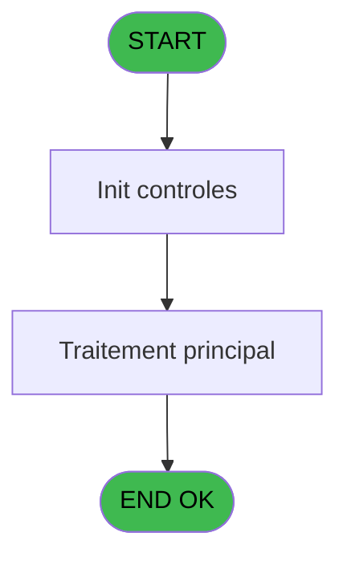
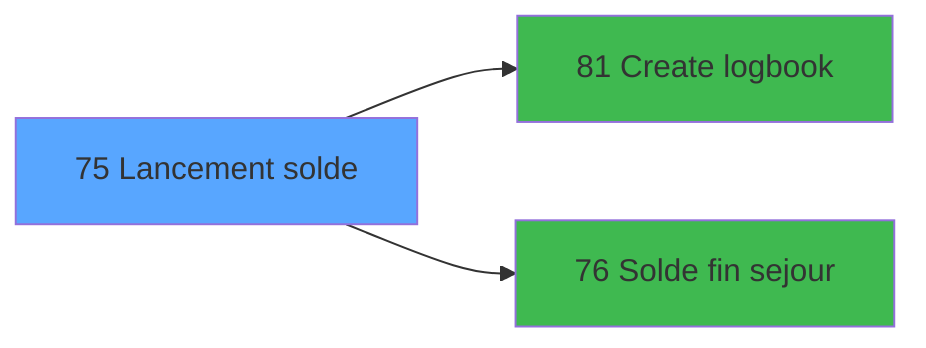

# WEL IDE 75 - Lancement solde

> **Analyse**: Phases 1-4 2026-02-03 21:35 -> 21:35 (11s) | Assemblage 21:35
> **Pipeline**: V7.2 Enrichi
> **Structure**: 4 onglets (Resume | Ecrans | Donnees | Connexions)

<!-- TAB:Resume -->

## 1. FICHE D'IDENTITE

| Attribut | Valeur |
|----------|--------|
| Projet | WEL |
| IDE Position | 75 |
| Nom Programme | Lancement solde |
| Fichier source | `Prg_75.xml` |
| Dossier IDE | Solde |
| Taches | 4 (0 ecrans visibles) |
| Tables modifiees | 0 |
| Programmes appeles | 2 |

## 2. DESCRIPTION FONCTIONNELLE

**Lancement solde** assure la gestion complete de ce processus, accessible depuis [Check out (IDE 24)](WEL-IDE-24.md).

Le flux de traitement s'organise en **2 blocs fonctionnels** :

- **Traitement** (3 taches) : traitements metier divers
- **Calcul** (1 tache) : calculs de montants, stocks ou compteurs

**Logique metier** : 1 regles identifiees couvrant conditions metier.

Detail : phases du traitement

#### Phase 1 : Traitement (3 taches)

- **75** - Lancement solde
- **75.1** - Veuillez patienter ... **[[ECRAN]](#ecran-t2)**
- **75.3** - Test si cloture en cours

Delegue a : [Solde fin sejour (IDE 76)](WEL-IDE-76.md)

#### Phase 2 : Calcul (1 tache)

- **75.2** - Lecture du compte

Delegue a : [Solde fin sejour (IDE 76)](WEL-IDE-76.md)

## 3. BLOCS FONCTIONNELS

### 3.1 Traitement (3 taches)

Traitements internes.

---

#### 75 - Lancement solde

**Role** : Consultation/chargement : Lancement solde.
**Variables liees** : H (V0.Date solde), I (V0.Heure solde), J (V0.Solde compte)
**Delegue a** : [Solde fin sejour (IDE 76)](WEL-IDE-76.md)

---

#### 75.1 - Veuillez patienter ... [[ECRAN]](#ecran-t2)

**Role** : Traitement : Veuillez patienter ....
**Ecran** : 902 x 213 DLU (MDI) | [Voir mockup](#ecran-t2)
**Delegue a** : [Solde fin sejour (IDE 76)](WEL-IDE-76.md)

---

#### 75.3 - Test si cloture en cours

**Role** : Verification : Test si cloture en cours.
**Delegue a** : [Solde fin sejour (IDE 76)](WEL-IDE-76.md)

### 3.2 Calcul (1 tache)

Calculs metier : montants, stocks, compteurs.

---

#### 75.2 - Lecture du compte

**Role** : Traitement : Lecture du compte.
**Variables liees** : J (V0.Solde compte)

## 5. REGLES METIER

1 regles identifiees:

### Autres (1 regles)

#### [RM-001] Si [O]='S' alors [S] sinon [R])

| Element | Detail |
|---------|--------|
| **Condition** | `[O]='S'` |
| **Si vrai** | [S] |
| **Si faux** | [R]) |
| **Expression source** | Expression 24 : `IF ([O]='S',[S],[R])` |
| **Exemple** | Si [O]='S' → [S]. Sinon → [R]) |

## 6. CONTEXTE

- **Appele par**: [Check out (IDE 24)](WEL-IDE-24.md)
- **Appelle**: 2 programmes | **Tables**: 8 (W:0 R:4 L:5) | **Taches**: 4 | **Expressions**: 24

<!-- TAB:Ecrans -->

## 8. ECRANS

*(Programme sans ecran visible)*

## 9. NAVIGATION

### 9.3 Structure hierarchique (4 taches)

| Position | Tache | Type | Dimensions | Bloc |
|----------|-------|------|------------|------|
| **75.1** | [**Lancement solde** (75)](#t1) | - | - | Traitement |
| 75.1.1 | [Veuillez patienter ... (75.1)](#t2) [mockup](#ecran-t2) | MDI | 902x213 | |
| 75.1.2 | [Test si cloture en cours (75.3)](#t4) | MDI | - | |
| **75.2** | [**Lecture du compte** (75.2)](#t3) | MDI | - | Calcul |

### 9.4 Algorigramme

> **Legende**: Vert = START/END OK | Rouge = END KO | Bleu = Decisions
> *Algorigramme auto-genere. Utiliser `/algorigramme` pour une synthese metier detaillee.*

<!-- TAB:Donnees -->

## 10. TABLES

### Tables utilisees (8)

| ID | Nom | Description | Type | R | W | L | Usages |
|----|-----|-------------|------|---|---|---|--------|
| 23 | reseau_cloture___rec | Donnees reseau/cloture | DB | R |   |   | 1 |
| 30 | gm-recherche_____gmr | Index de recherche | DB | R |   |   | 1 |
| 40 | comptable________cte |  | DB | R |   |   | 1 |
| 47 | compte_gm________cgm | Comptes GM (generaux) | DB | R |   | L | 2 |
| 63 | parametres___par |  | DB |   |   | L | 1 |
| 70 | date_comptable___dat |  | DB |   |   | L | 1 |
| 78 | param__telephone_tel |  | DB |   |   | L | 1 |
| 131 | fichier_validation |  | DB |   |   | L | 1 |

### Colonnes par table (5 / 4 tables avec colonnes identifiees)

Table 23 - reseau_cloture___rec (R) - 1 usages

| Lettre | Variable | Acces | Type |
|--------|----------|-------|------|
| A | W1 cloture en cours | R | Numeric |
| G | V0.Etat reseau flag | R | Alpha |

Table 30 - gm-recherche_____gmr (R) - 1 usages

| Lettre | Variable | Acces | Type |
|--------|----------|-------|------|
| A | V0.OK suite ? | R | Logical |
| B | V0.Montant carte | R | Numeric |
| C | V0.Code retour | R | Alpha |
| D | V0.Controle action | R | Alpha |
| E | V0.Message | R | Alpha |
| F | V0.Date comptable | R | Date |
| G | V0.Etat reseau flag | R | Alpha |
| H | V0.Date solde | R | Date |
| I | V0.Heure solde | R | Time |
| J | V0.Solde compte | R | Numeric |

Table 40 - comptable________cte (R) - 1 usages

| Lettre | Variable | Acces | Type |
|--------|----------|-------|------|
| F | V0.Date comptable | R | Date |

Table 47 - compte_gm________cgm (R/L) - 2 usages

| Lettre | Variable | Acces | Type |
|--------|----------|-------|------|
| J | V0.Solde compte | R | Numeric |

## 11. VARIABLES

### 11.1 Autres (10)

Variables diverses.

| Lettre | Nom | Type | Usage dans |
|--------|-----|------|-----------|
| A | V0.OK suite ? | Logical | - |
| B | V0.Montant carte | Numeric | - |
| C | V0.Code retour | Alpha | - |
| D | V0.Controle action | Alpha | - |
| E | V0.Message | Alpha | - |
| F | V0.Date comptable | Date | - |
| G | V0.Etat reseau flag | Alpha | - |
| H | V0.Date solde | Date | - |
| I | V0.Heure solde | Time | - |
| J | V0.Solde compte | Numeric | - |

## 12. EXPRESSIONS

**24 / 24 expressions decodees (100%)**

### 12.1 Repartition par type

| Type | Expressions | Regles |
|------|-------------|--------|
| CONDITION | 2 | 5 |
| CONSTANTE | 15 | 0 |
| REFERENCE_VG | 3 | 0 |
| OTHER | 2 | 0 |
| CAST_LOGIQUE | 2 | 0 |

### 12.2 Expressions cles par type

#### CONDITION (2 expressions)

| Type | IDE | Expression | Regle |
|------|-----|------------|-------|
| CONDITION | 24 | `IF ([O]='S',[S],[R])` | [RM-001](#rm-RM-001) |
| CONDITION | 21 | `[BI]='T'` | - |

#### CONSTANTE (15 expressions)

| Type | IDE | Expression | Regle |
|------|-----|------------|-------|
| CONSTANTE | 15 | `37` | - |
| CONSTANTE | 14 | `36` | - |
| CONSTANTE | 13 | `9` | - |
| CONSTANTE | 16 | `38` | - |
| CONSTANTE | 23 | `'U'` | - |
| ... | | *+10 autres* | |

#### REFERENCE_VG (3 expressions)

| Type | IDE | Expression | Regle |
|------|-----|------------|-------|
| REFERENCE_VG | 3 | `VG10` | - |
| REFERENCE_VG | 2 | `VG9` | - |
| REFERENCE_VG | 1 | `VG5` | - |

#### OTHER (2 expressions)

| Type | IDE | Expression | Regle |
|------|-----|------------|-------|
| OTHER | 19 | `[BF]` | - |
| OTHER | 6 | `MlsTrans('Validate account closing')` | - |

#### CAST_LOGIQUE (2 expressions)

| Type | IDE | Expression | Regle |
|------|-----|------------|-------|
| CAST_LOGIQUE | 20 | `'TRUE'LOG` | - |
| CAST_LOGIQUE | 18 | `'TRUE'LOG` | - |

### 12.3 Toutes les expressions (24)

Voir les 24 expressions

#### CONDITION (2)

| IDE | Expression Decodee |
|-----|-------------------|
| 24 | `IF ([O]='S',[S],[R])` |
| 21 | `[BI]='T'` |

#### CONSTANTE (15)

| IDE | Expression Decodee |
|-----|-------------------|
| 4 | `'CALLCLOSAC'` |
| 5 | `'VALCLOSAC'` |
| 7 | `10` |
| 8 | `1` |
| 9 | `2` |
| 10 | `3` |
| 11 | `5` |
| 12 | `7` |
| 13 | `9` |
| 14 | `36` |
| 15 | `37` |
| 16 | `38` |
| 17 | `39` |
| 22 | `'1'` |
| 23 | `'U'` |

#### REFERENCE_VG (3)

| IDE | Expression Decodee |
|-----|-------------------|
| 1 | `VG5` |
| 2 | `VG9` |
| 3 | `VG10` |

#### OTHER (2)

| IDE | Expression Decodee |
|-----|-------------------|
| 6 | `MlsTrans('Validate account closing')` |
| 19 | `[BF]` |

#### CAST_LOGIQUE (2)

| IDE | Expression Decodee |
|-----|-------------------|
| 18 | `'TRUE'LOG` |
| 20 | `'TRUE'LOG` |

<!-- TAB:Connexions -->

## 13. GRAPHE D'APPELS

### 13.1 Chaine depuis Main (Callers)

Main -> ... -> [Check out (IDE 24)](WEL-IDE-24.md) -> **Lancement solde (IDE 75)**

### 13.2 Callers

| IDE | Nom Programme | Nb Appels |
|-----|---------------|-----------|
| [24](WEL-IDE-24.md) | Check out | 1 |

### 13.3 Callees (programmes appeles)

### 13.4 Detail Callees avec contexte

| IDE | Nom Programme | Appels | Contexte |
|-----|---------------|--------|----------|
| [81](WEL-IDE-81.md) | Create logbook | 2 | Sous-programme |
| [76](WEL-IDE-76.md) | Solde fin sejour | 1 | Verification solde |

## 14. RECOMMANDATIONS MIGRATION

### 14.1 Profil du programme

| Metrique | Valeur | Impact migration |
|----------|--------|-----------------|
| Lignes de logique | 157 | Programme compact |
| Expressions | 24 | Peu de logique |
| Tables WRITE | 0 | Impact faible |
| Sous-programmes | 2 | Peu de dependances |
| Ecrans visibles | 0 | Ecran unique ou traitement batch |
| Code desactive | 0% (0 / 157) | Code sain |
| Regles metier | 1 | Quelques regles a preserver |

### 14.2 Plan de migration par bloc

#### Traitement (3 taches: 1 ecran, 2 traitements)

- **Strategie** : Orchestrateur avec 1 ecrans (Razor/React) et 2 traitements backend (services).
- Les ecrans deviennent des composants UI, les traitements invisibles deviennent des services injectables.
- 2 sous-programme(s) a migrer ou a reutiliser depuis les services existants.
- Decomposer les taches en services unitaires testables.

#### Calcul (1 tache: 0 ecran, 1 traitement)

- **Strategie** : Services de calcul purs (Domain Services).
- Migrer la logique de calcul (stock, compteurs, montants)

### 14.3 Dependances critiques

| Dependance | Type | Appels | Impact |
|------------|------|--------|--------|
| [Create logbook (IDE 81)](WEL-IDE-81.md) | Sous-programme | 2x | Haute - Sous-programme |
| [Solde fin sejour (IDE 76)](WEL-IDE-76.md) | Sous-programme | 1x | Normale - Verification solde |

---
*Spec DETAILED generee par Pipeline V7.2 - 2026-02-03 21:35*
