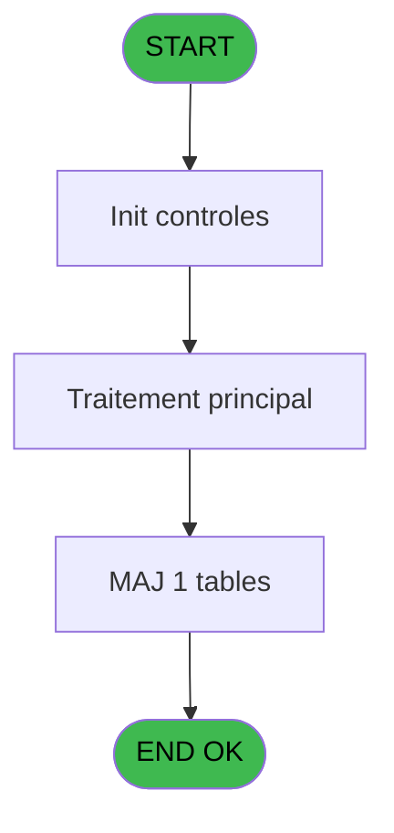
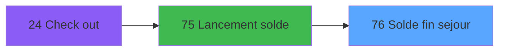
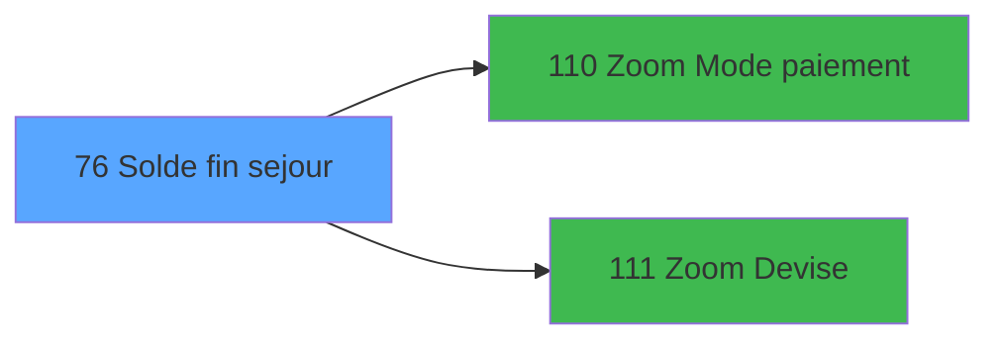

# WEL IDE 76 - Solde fin sejour

> **Analyse**: Phases 1-4 2026-02-03 21:35 -> 21:35 (11s) | Assemblage 21:35
> **Pipeline**: V7.2 Enrichi
> **Structure**: 4 onglets (Resume | Ecrans | Donnees | Connexions)

<!-- TAB:Resume -->

## 1. FICHE D'IDENTITE

| Attribut | Valeur |
|----------|--------|
| Projet | WEL |
| IDE Position | 76 |
| Nom Programme | Solde fin sejour |
| Fichier source | `Prg_76.xml` |
| Dossier IDE | Utilitaires |
| Taches | 2 (1 ecrans visibles) |
| Tables modifiees | 1 |
| Programmes appeles | 2 |

## 2. DESCRIPTION FONCTIONNELLE

**Solde fin sejour** assure la gestion complete de ce processus, accessible depuis [Lancement solde (IDE 75)](WEL-IDE-75.md).

Le flux de traitement s'organise en **2 blocs fonctionnels** :

- **Validation** (1 tache) : controles et verifications de coherence
- **Saisie** (1 tache) : ecrans de saisie utilisateur (formulaires, champs, donnees)

**Donnees modifiees** : 1 tables en ecriture (lignes_de_solde__sld).

**Logique metier** : 3 regles identifiees couvrant conditions metier.

Detail : phases du traitement

#### Phase 1 : Saisie (1 tache)

- **76** - Saisie des lignes de solde **[[ECRAN]](#ecran-t1)**

#### Phase 2 : Validation (1 tache)

- **76.1** - Validation **[[ECRAN]](#ecran-t2)**

#### Tables impactees

| Table | Operations | Role metier |
|-------|-----------|-------------|
| lignes_de_solde__sld | **W** (1 usages) |  |

## 3. BLOCS FONCTIONNELS

### 3.1 Saisie (1 tache)

L'operateur saisit les donnees de la transaction via 1 ecran (Saisie des lignes de solde).

---

#### 76 - Saisie des lignes de solde [[ECRAN]](#ecran-t1)

**Role** : Saisie des donnees : Saisie des lignes de solde.
**Ecran** : 1313 x 744 DLU (MDI) | [Voir mockup](#ecran-t1)
**Variables liees** : A (P.Date solde), B (P.Heure solde), L (P.Solde du compte), O (W1 cumul lignes)

### 3.2 Validation (1 tache)

Controles de coherence : 1 tache verifie les donnees et conditions.

---

#### 76.1 - Validation [[ECRAN]](#ecran-t2)

**Role** : Verification : Validation.
**Ecran** : 88 x 16 DLU (MDI) | [Voir mockup](#ecran-t2)
**Variables liees** : R (W1 validation)

## 5. REGLES METIER

3 regles identifiees:

### Autres (3 regles)

#### [RM-001] Si W1 Nb Cartes [U]=P.Devise locale [G] alors 'S' sinon '')

| Element | Detail |
|---------|--------|
| **Condition** | `W1 Nb Cartes [U]=P.Devise locale [G]` |
| **Si vrai** | 'S' |
| **Si faux** | '') |
| **Variables** | G (P.Devise locale), U (W1 Nb Cartes) |
| **Expression source** | Expression 3 : `IF (W1 Nb Cartes [U]=P.Devise locale [G],'S','')` |
| **Exemple** | Si W1 Nb Cartes [U]=P.Devise locale [G] → 'S'. Sinon → '') |

#### [RM-002] Traitement si [AI] est non nul

| Element | Detail |
|---------|--------|
| **Condition** | `[AI]<>0` |
| **Si vrai** | P.Devise locale [G] |
| **Si faux** | '') |
| **Variables** | G (P.Devise locale) |
| **Expression source** | Expression 17 : `IF ([AI]<>0,P.Devise locale [G],'')` |
| **Exemple** | Si [AI]<>0 → P.Devise locale [G]. Sinon → '') |

#### [RM-003] Si ABS (P.Solde du compte [L]+W1 cumul lignes [O])<0.0005 alors 228 sinon 221)

| Element | Detail |
|---------|--------|
| **Condition** | `ABS (P.Solde du compte [L]+W1 cumul lignes [O])<0.0005` |
| **Si vrai** | 228 |
| **Si faux** | 221) |
| **Variables** | L (P.Solde du compte), O (W1 cumul lignes) |
| **Expression source** | Expression 46 : `IF (ABS (P.Solde du compte [L]+W1 cumul lignes [O])<0.0005,2` |
| **Exemple** | Si ABS (P.Solde du compte [L]+W1 cumul lignes [O])<0.0005 → 228. Sinon → 221) |

## 6. CONTEXTE

- **Appele par**: [Lancement solde (IDE 75)](WEL-IDE-75.md)
- **Appelle**: 2 programmes | **Tables**: 5 (W:1 R:1 L:3) | **Taches**: 2 | **Expressions**: 46

<!-- TAB:Ecrans -->

## 8. ECRANS

### 8.1 Forms visibles (1 / 2)

| # | Position | Tache | Nom | Type | Largeur | Hauteur | Bloc |
|---|----------|-------|-----|------|---------|---------|------|
| 1 | 76 | 76 | Saisie des lignes de solde | MDI | 1313 | 744 | Saisie |

### 8.2 Mockups Ecrans

---

#### 76 - Saisie des lignes de solde
**Tache** : [76](#t1) | **Type** : MDI | **Dimensions** : 1313 x 744 DLU
**Bloc** : Saisie | **Titre IDE** : Saisie des lignes de solde

<!-- FORM-DATA:
{
    "width":  1313,
    "vFactor":  100,
    "type":  "MDI",
    "hFactor":  100,
    "controls":  [
                     {
                         "x":  182,
                         "type":  "label",
                         "var":  "",
                         "y":  0,
                         "w":  1130,
                         "fmt":  "",
                         "name":  "",
                         "h":  66,
                         "color":  "212",
                         "text":  "CLOSE MY ACCOUNT",
                         "parent":  null
                     },
                     {
                         "x":  390,
                         "type":  "label",
                         "var":  "",
                         "y":  93,
                         "w":  158,
                         "fmt":  "",
                         "name":  "",
                         "h":  57,
                         "color":  "212",
                         "text":  "Reliquat",
                         "parent":  null
                     },
                     {
                         "x":  223,
                         "type":  "label",
                         "var":  "",
                         "y":  169,
                         "w":  108,
                         "fmt":  "",
                         "name":  "",
                         "h":  43,
                         "color":  "",
                         "text":  "CURRENCY",
                         "parent":  null
                     },
                     {
                         "x":  330,
                         "type":  "label",
                         "var":  "",
                         "y":  169,
                         "w":  147,
                         "fmt":  "",
                         "name":  "",
                         "h":  43,
                         "color":  "",
                         "text":  "PAYMENT MODE",
                         "parent":  null
                     },
                     {
                         "x":  475,
                         "type":  "label",
                         "var":  "",
                         "y":  169,
                         "w":  132,
                         "fmt":  "",
                         "name":  "",
                         "h":  43,
                         "color":  "",
                         "text":  "QUANTITY",
                         "parent":  null
                     },
                     {
                         "x":  606,
                         "type":  "label",
                         "var":  "",
                         "y":  169,
                         "w":  170,
                         "fmt":  "",
                         "name":  "",
                         "h":  43,
                         "color":  "",
                         "text":  "EXCHANGE RATE",
                         "parent":  null
                     },
                     {
                         "x":  775,
                         "type":  "label",
                         "var":  "",
                         "y":  169,
                         "w":  259,
                         "fmt":  "",
                         "name":  "",
                         "h":  43,
                         "color":  "",
                         "text":  "AMOUNT",
                         "parent":  null
                     },
                     {
                         "x":  225,
                         "type":  "label",
                         "var":  "",
                         "y":  519,
                         "w":  862,
                         "fmt":  "",
                         "name":  "",
                         "h":  54,
                         "color":  "220",
                         "text":  "",
                         "parent":  null
                     },
                     {
                         "x":  494,
                         "type":  "label",
                         "var":  "",
                         "y":  527,
                         "w":  108,
                         "fmt":  "",
                         "name":  "",
                         "h":  38,
                         "color":  "226",
                         "text":  "Total",
                         "parent":  10
                     },
                     {
                         "x":  224,
                         "type":  "table",
                         "var":  "",
                         "name":  "",
                         "titleH":  12,
                         "color":  "110",
                         "w":  809,
                         "y":  211,
                         "fmt":  "",
                         "parent":  null,
                         "text":  "",
                         "rowH":  44,
                         "h":  304,
                         "cols":  [
                                      {
                                          "title":  "Devise",
                                          "layer":  1,
                                          "w":  105
                                      },
                                      {
                                          "title":  "Mode de paiement",
                                          "layer":  2,
                                          "w":  145
                                      },
                                      {
                                          "title":  "Quantité",
                                          "layer":  3,
                                          "w":  130
                                      },
                                      {
                                          "title":  "Taux de change",
                                          "layer":  4,
                                          "w":  170
                                      },
                                      {
                                          "title":  "Montant",
                                          "layer":  5,
                                          "w":  254
                                      }
                                  ],
                         "rows":  5
                     },
                     {
                         "x":  611,
                         "type":  "edit",
                         "var":  "",
                         "y":  527,
                         "w":  163,
                         "fmt":  "15",
                         "name":  "",
                         "h":  38,
                         "color":  "220",
                         "text":  "",
                         "parent":  10
                     },
                     {
                         "x":  228,
                         "type":  "edit",
                         "var":  "",
                         "y":  216,
                         "w":  98,
                         "fmt":  "U3A",
                         "name":  "SLD devise",
                         "h":  38,
                         "color":  "220",
                         "text":  "",
                         "parent":  15
                     },
                     {
                         "x":  333,
                         "type":  "edit",
                         "var":  "",
                         "y":  216,
                         "w":  98,
                         "fmt":  "U4A",
                         "name":  "SLD mode de paiement",
                         "h":  38,
                         "color":  "220",
                         "text":  "",
                         "parent":  15
                     },
                     {
                         "x":  482,
                         "type":  "edit",
                         "var":  "",
                         "y":  216,
                         "w":  120,
                         "fmt":  "15",
                         "name":  "SLD quantite",
                         "h":  38,
                         "color":  "220",
                         "text":  "",
                         "parent":  15
                     },
                     {
                         "x":  609,
                         "type":  "edit",
                         "var":  "",
                         "y":  216,
                         "w":  163,
                         "fmt":  "### ###.#####",
                         "name":  "",
                         "h":  38,
                         "color":  "220",
                         "text":  "",
                         "parent":  15
                     },
                     {
                         "x":  781,
                         "type":  "edit",
                         "var":  "",
                         "y":  216,
                         "w":  163,
                         "fmt":  "15",
                         "name":  "",
                         "h":  38,
                         "color":  "220",
                         "text":  "",
                         "parent":  15
                     },
                     {
                         "x":  547,
                         "type":  "edit",
                         "var":  "",
                         "y":  94,
                         "w":  375,
                         "fmt":  "15",
                         "name":  "",
                         "h":  55,
                         "color":  "212",
                         "text":  "",
                         "parent":  null
                     },
                     {
                         "x":  954,
                         "type":  "edit",
                         "var":  "",
                         "y":  216,
                         "w":  74,
                         "fmt":  "3",
                         "name":  "",
                         "h":  38,
                         "color":  "220",
                         "text":  "",
                         "parent":  15
                     },
                     {
                         "x":  780,
                         "type":  "edit",
                         "var":  "",
                         "y":  527,
                         "w":  38,
                         "fmt":  "3",
                         "name":  "",
                         "h":  38,
                         "color":  "",
                         "text":  "",
                         "parent":  10
                     },
                     {
                         "x":  0,
                         "type":  "image",
                         "var":  "",
                         "y":  0,
                         "w":  173,
                         "fmt":  "",
                         "name":  "RETOUR",
                         "h":  66,
                         "color":  "226",
                         "text":  "",
                         "parent":  null
                     },
                     {
                         "x":  1033,
                         "type":  "button",
                         "var":  "",
                         "y":  169,
                         "w":  56,
                         "fmt":  "",
                         "name":  "",
                         "h":  174,
                         "color":  "",
                         "text":  "",
                         "parent":  null
                     },
                     {
                         "x":  1033,
                         "type":  "button",
                         "var":  "",
                         "y":  343,
                         "w":  56,
                         "fmt":  "",
                         "name":  "",
                         "h":  174,
                         "color":  "",
                         "text":  "",
                         "parent":  null
                     }
                 ],
    "taskId":  "76",
    "height":  744
}
-->

<strong>Champs : 9 champs</strong>

| Pos (x,y) | Nom | Variable | Type |
|-----------|-----|----------|------|
| 611,527 | 15 | - | edit |
| 228,216 | SLD devise | - | edit |
| 333,216 | SLD mode de paiement | - | edit |
| 482,216 | SLD quantite | - | edit |
| 609,216 | ### ###.##### | - | edit |
| 781,216 | 15 | - | edit |
| 547,94 | 15 | - | edit |
| 954,216 | 3 | - | edit |
| 780,527 | 3 | - | edit |

<strong>Boutons : 2 boutons</strong>

| Bouton | Pos (x,y) | Action |
|--------|-----------|--------|
| (sans nom) | 1033,169 | Action declenchee |
| (sans nom) | 1033,343 | Action declenchee |

## 9. NAVIGATION

Ecran unique: **Saisie des lignes de solde**

### 9.3 Structure hierarchique (2 taches)

| Position | Tache | Type | Dimensions | Bloc |
|----------|-------|------|------------|------|
| **76.1** | [**Saisie des lignes de solde** (76)](#t1) [mockup](#ecran-t1) | MDI | 1313x744 | Saisie |
| **76.2** | [**Validation** (76.1)](#t2) [mockup](#ecran-t2) | MDI | 88x16 | Validation |

### 9.4 Algorigramme

> **Legende**: Vert = START/END OK | Rouge = END KO | Bleu = Decisions
> *Algorigramme auto-genere. Utiliser `/algorigramme` pour une synthese metier detaillee.*

<!-- TAB:Donnees -->

## 10. TABLES

### Tables utilisees (5)

| ID | Nom | Description | Type | R | W | L | Usages |
|----|-----|-------------|------|---|---|---|--------|
| 31 | gm-complet_______gmc |  | DB | R |   |   | 1 |
| 39 | depot_garantie___dga | Depots et garanties | DB |   |   | L | 1 |
| 48 | lignes_de_solde__sld |  | DB |   | **W** |   | 1 |
| 50 | moyens_reglement_mor | Reglements / paiements | DB |   |   | L | 1 |
| 89 | moyen_paiement___mop |  | DB |   |   | L | 1 |

### Colonnes par table (3 / 2 tables avec colonnes identifiees)

Table 31 - gm-complet_______gmc (R) - 1 usages

| Lettre | Variable | Acces | Type |
|--------|----------|-------|------|
| A | W2 validation | R | Numeric |
| B | W2 Validation Logique | R | Logical |
| C | W2 Message Erreur | R | Alpha |

Table 48 - lignes_de_solde__sld (**W**) - 1 usages

| Lettre | Variable | Acces | Type |
|--------|----------|-------|------|
| A | P.Date solde | W | Date |
| B | P.Heure solde | W | Time |
| C | P.Societe | W | Alpha |
| D | P.Code adherent | W | Numeric |
| E | P.Nom | W | Alpha |
| F | P.Prenom | W | Alpha |
| G | P.Devise locale | W | Alpha |
| H | P.Nombre de decimales | W | Numeric |
| I | P.Montant carte | W | Numeric |
| J | P.Code retour | W | Alpha |
| K | P.Controle action | W | Alpha |
| L | P.Solde du compte | W | Numeric |
| M | P.Garantie compte | W | Alpha |
| N | P.Message | W | Alpha |
| O | W1 cumul lignes | W | Numeric |
| P | W1 type d'operation | W | Alpha |
| Q | W1 test-lien-MOR | W | Numeric |
| R | W1 validation | W | Alpha |
| S | W1 Fin | W | Logical |
| T | v. titre ecran | W | Alpha |
| U | W1 Nb Cartes | W | Numeric |
| V | W1 MOP | W | Alpha |

## 11. VARIABLES

### 11.1 Parametres entrants (14)

Variables recues du programme appelant ([Lancement solde (IDE 75)](WEL-IDE-75.md)).

| Lettre | Nom | Type | Usage dans |
|--------|-----|------|-----------|
| A | P.Date solde | Date | [76](#t1) |
| B | P.Heure solde | Time | [76](#t1) |
| C | P.Societe | Alpha | 1x parametre entrant |
| D | P.Code adherent | Numeric | 1x parametre entrant |
| E | P.Nom | Alpha | 2x parametre entrant |
| F | P.Prenom | Alpha | 1x parametre entrant |
| G | P.Devise locale | Alpha | 9x parametre entrant |
| H | P.Nombre de decimales | Numeric | 1x parametre entrant |
| I | P.Montant carte | Numeric | - |
| J | P.Code retour | Alpha | - |
| K | P.Controle action | Alpha | - |
| L | P.Solde du compte | Numeric | 6x parametre entrant |
| M | P.Garantie compte | Alpha | 1x parametre entrant |
| N | P.Message | Alpha | - |

### 11.2 Variables de session (1)

Variables persistantes pendant toute la session.

| Lettre | Nom | Type | Usage dans |
|--------|-----|------|-----------|
| T | v. titre ecran | Alpha | - |

### 11.3 Autres (7)

Variables diverses.

| Lettre | Nom | Type | Usage dans |
|--------|-----|------|-----------|
| O | W1 cumul lignes | Numeric | [76](#t1) |
| P | W1 type d'operation | Alpha | - |
| Q | W1 test-lien-MOR | Numeric | - |
| R | W1 validation | Alpha | - |
| S | W1 Fin | Logical | - |
| U | W1 Nb Cartes | Numeric | 8x refs |
| V | W1 MOP | Alpha | 1x refs |

Toutes les 22 variables (liste complete)

| Cat | Lettre | Nom Variable | Type |
|-----|--------|--------------|------|
| P0 | **A** | P.Date solde | Date |
| P0 | **B** | P.Heure solde | Time |
| P0 | **C** | P.Societe | Alpha |
| P0 | **D** | P.Code adherent | Numeric |
| P0 | **E** | P.Nom | Alpha |
| P0 | **F** | P.Prenom | Alpha |
| P0 | **G** | P.Devise locale | Alpha |
| P0 | **H** | P.Nombre de decimales | Numeric |
| P0 | **I** | P.Montant carte | Numeric |
| P0 | **J** | P.Code retour | Alpha |
| P0 | **K** | P.Controle action | Alpha |
| P0 | **L** | P.Solde du compte | Numeric |
| P0 | **M** | P.Garantie compte | Alpha |
| P0 | **N** | P.Message | Alpha |
| V. | **T** | v. titre ecran | Alpha |
| Autre | **O** | W1 cumul lignes | Numeric |
| Autre | **P** | W1 type d'operation | Alpha |
| Autre | **Q** | W1 test-lien-MOR | Numeric |
| Autre | **R** | W1 validation | Alpha |
| Autre | **S** | W1 Fin | Logical |
| Autre | **U** | W1 Nb Cartes | Numeric |
| Autre | **V** | W1 MOP | Alpha |

## 12. EXPRESSIONS

**46 / 46 expressions decodees (100%)**

### 12.1 Repartition par type

| Type | Expressions | Regles |
|------|-------------|--------|
| CALCULATION | 4 | 0 |
| CONDITION | 14 | 3 |
| CONCATENATION | 1 | 0 |
| CONSTANTE | 9 | 0 |
| OTHER | 14 | 0 |
| REFERENCE_VG | 2 | 0 |
| NEGATION | 1 | 0 |
| STRING | 1 | 0 |

### 12.2 Expressions cles par type

#### CALCULATION (4 expressions)

| Type | IDE | Expression | Regle |
|------|-----|------------|-------|
| CALCULATION | 15 | `Round (- ((P.Solde du compte [L]+W1 cumul lignes [O])/[AC]),12,0)` | - |
| CALCULATION | 31 | `Round ([AG]*[AC],12,P.Nombre de decimales [H])` | - |
| CALCULATION | 13 | `P.Solde du compte [L]+W1 cumul lignes [O]` | - |
| CALCULATION | 14 | `- ((P.Solde du compte [L]+W1 cumul lignes [O])/[AC])` | - |

#### CONDITION (14 expressions)

| Type | IDE | Expression | Regle |
|------|-----|------------|-------|
| CONDITION | 46 | `IF (ABS (P.Solde du compte [L]+W1 cumul lignes [O])<0.0005,228,221)` | [RM-003](#rm-RM-003) |
| CONDITION | 3 | `IF (W1 Nb Cartes [U]=P.Devise locale [G],'S','')` | [RM-001](#rm-RM-001) |
| CONDITION | 17 | `IF ([AI]<>0,P.Devise locale [G],'')` | [RM-002](#rm-RM-002) |
| CONDITION | 39 | `[AF]='$CARD' OR Left([W],3)='VAD'` | - |
| CONDITION | 41 | `NOT(LastClicked()='Bt.Quitter' OR LastClicked()='Bt Free Extra')` | - |
| ... | | *+9 autres* | |

#### CONCATENATION (1 expressions)

| Type | IDE | Expression | Regle |
|------|-----|------------|-------|
| CONCATENATION | 45 | `MlsTrans('CLOSE MY ACCOUNT -')&' '&Trim(P.Nom [E])&' '&Trim(P.Prenom [F])` | - |

#### CONSTANTE (9 expressions)

| Type | IDE | Expression | Regle |
|------|-----|------------|-------|
| CONSTANTE | 36 | `1` | - |
| CONSTANTE | 35 | `24` | - |
| CONSTANTE | 38 | `0` | - |
| CONSTANTE | 37 | `0` | - |
| CONSTANTE | 34 | `25` | - |
| ... | | *+4 autres* | |

#### OTHER (14 expressions)

| Type | IDE | Expression | Regle |
|------|-----|------------|-------|
| OTHER | 20 | `'N'&Left (VG47,15)` | - |
| OTHER | 12 | `[AI]` | - |
| OTHER | 11 | `[AC]` | - |
| OTHER | 30 | `[AL]` | - |
| OTHER | 42 | `ABS(P.Solde du compte [L])` | - |
| ... | | *+9 autres* | |

#### REFERENCE_VG (2 expressions)

| Type | IDE | Expression | Regle |
|------|-----|------------|-------|
| REFERENCE_VG | 19 | `VG47` | - |
| REFERENCE_VG | 4 | `VG15` | - |

#### NEGATION (1 expressions)

| Type | IDE | Expression | Regle |
|------|-----|------------|-------|
| NEGATION | 29 | `NOT ([AJ]=0 AND [AG]<>0 AND ([AG]>0 OR W1 Nb Cartes [U]=P.Devise locale [G]))` | - |

#### STRING (1 expressions)

| Type | IDE | Expression | Regle |
|------|-----|------------|-------|
| STRING | 1 | `Trim ([AM])` | - |

### 12.3 Toutes les expressions (46)

Voir les 46 expressions

#### CALCULATION (4)

| IDE | Expression Decodee |
|-----|-------------------|
| 13 | `P.Solde du compte [L]+W1 cumul lignes [O]` |
| 14 | `- ((P.Solde du compte [L]+W1 cumul lignes [O])/[AC])` |
| 15 | `Round (- ((P.Solde du compte [L]+W1 cumul lignes [O])/[AC]),12,0)` |
| 31 | `Round ([AG]*[AC],12,P.Nombre de decimales [H])` |

#### CONDITION (14)

| IDE | Expression Decodee |
|-----|-------------------|
| 16 | `ABS (P.Solde du compte [L]+W1 cumul lignes [O])<0.0005 AND LastClicked ()<>'Bt Free Extra'` |
| 3 | `IF (W1 Nb Cartes [U]=P.Devise locale [G],'S','')` |
| 17 | `IF ([AI]<>0,P.Devise locale [G],'')` |
| 18 | `IF (W1 Nb Cartes [U]=P.Devise locale [G],VG47,'###############CZ')` |
| 46 | `IF (ABS (P.Solde du compte [L]+W1 cumul lignes [O])<0.0005,228,221)` |
| 21 | `[AG]=0 AND [AC]>0 AND W1 Nb Cartes [U]=P.Devise locale [G]` |
| 22 | `[AG]=0 AND [AC]>0 AND W1 Nb Cartes [U]<>P.Devise locale [G]` |
| 23 | `[AJ]>0 OR [W]='CHQ' AND W1 Nb Cartes [U]<>P.Devise locale [G]` |
| 25 | `[AG]<0 AND W1 Nb Cartes [U]<>P.Devise locale [G]` |
| 39 | `[AF]='$CARD' OR Left([W],3)='VAD'` |
| 41 | `NOT(LastClicked()='Bt.Quitter' OR LastClicked()='Bt Free Extra')` |
| 43 | `Left([W],3)='VAD'` |
| 44 | `Left([W],3)='VAD' AND P.Garantie compte [M]<>'O'` |
| 24 | `[AG]=0 AND Trim([W])<>''` |

#### CONCATENATION (1)

| IDE | Expression Decodee |
|-----|-------------------|
| 45 | `MlsTrans('CLOSE MY ACCOUNT -')&' '&Trim(P.Nom [E])&' '&Trim(P.Prenom [F])` |

#### CONSTANTE (9)

| IDE | Expression Decodee |
|-----|-------------------|
| 26 | `'F'` |
| 27 | `'P'` |
| 28 | `'O'` |
| 33 | `3` |
| 34 | `25` |
| 35 | `24` |
| 36 | `1` |
| 37 | `0` |
| 38 | `0` |

#### OTHER (14)

| IDE | Expression Decodee |
|-----|-------------------|
| 2 | `P.Societe [C]` |
| 5 | `P.Date solde [A]` |
| 6 | `P.Heure solde [B]` |
| 7 | `P.Code adherent [D]` |
| 8 | `W1 Nb Cartes [U]` |
| 9 | `W1 MOP [V]` |
| 10 | `[W]` |
| 11 | `[AC]` |
| 12 | `[AI]` |
| 20 | `'N'&Left (VG47,15)` |
| 30 | `[AL]` |
| 32 | `P.Devise locale [G]` |
| 40 | `[AI]` |
| 42 | `ABS(P.Solde du compte [L])` |

#### REFERENCE_VG (2)

| IDE | Expression Decodee |
|-----|-------------------|
| 4 | `VG15` |
| 19 | `VG47` |

#### NEGATION (1)

| IDE | Expression Decodee |
|-----|-------------------|
| 29 | `NOT ([AJ]=0 AND [AG]<>0 AND ([AG]>0 OR W1 Nb Cartes [U]=P.Devise locale [G]))` |

#### STRING (1)

| IDE | Expression Decodee |
|-----|-------------------|
| 1 | `Trim ([AM])` |

<!-- TAB:Connexions -->

## 13. GRAPHE D'APPELS

### 13.1 Chaine depuis Main (Callers)

Main -> ... -> [Lancement solde (IDE 75)](WEL-IDE-75.md) -> **Solde fin sejour (IDE 76)**

### 13.2 Callers

| IDE | Nom Programme | Nb Appels |
|-----|---------------|-----------|
| [75](WEL-IDE-75.md) | Lancement solde | 1 |

### 13.3 Callees (programmes appeles)

### 13.4 Detail Callees avec contexte

| IDE | Nom Programme | Appels | Contexte |
|-----|---------------|--------|----------|
| [110](WEL-IDE-110.md) | Zoom Mode paiement | 1 | Selection/consultation |
| [111](WEL-IDE-111.md) | Zoom Devise | 1 | Selection/consultation |

## 14. RECOMMANDATIONS MIGRATION

### 14.1 Profil du programme

| Metrique | Valeur | Impact migration |
|----------|--------|-----------------|
| Lignes de logique | 121 | Programme compact |
| Expressions | 46 | Peu de logique |
| Tables WRITE | 1 | Impact faible |
| Sous-programmes | 2 | Peu de dependances |
| Ecrans visibles | 1 | Ecran unique ou traitement batch |
| Code desactive | 0% (0 / 121) | Code sain |
| Regles metier | 3 | Quelques regles a preserver |

### 14.2 Plan de migration par bloc

#### Saisie (1 tache: 1 ecran, 0 traitement)

- **Strategie** : Formulaire React/Blazor avec validation Zod/FluentValidation.
- Reproduire 1 ecran : Saisie des lignes de solde
- Validation temps reel cote client + serveur

#### Validation (1 tache: 1 ecran, 0 traitement)

- **Strategie** : FluentValidation avec validators specifiques.
- Chaque tache de validation -> un validator injectable

### 14.3 Dependances critiques

| Dependance | Type | Appels | Impact |
|------------|------|--------|--------|
| lignes_de_solde__sld | Table WRITE (Database) | 1x | Schema + repository |
| [Zoom Devise (IDE 111)](WEL-IDE-111.md) | Sous-programme | 1x | Normale - Selection/consultation |
| [Zoom Mode paiement (IDE 110)](WEL-IDE-110.md) | Sous-programme | 1x | Normale - Selection/consultation |

---
*Spec DETAILED generee par Pipeline V7.2 - 2026-02-03 21:35*
