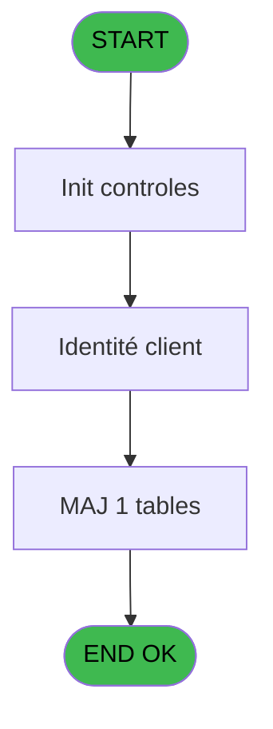
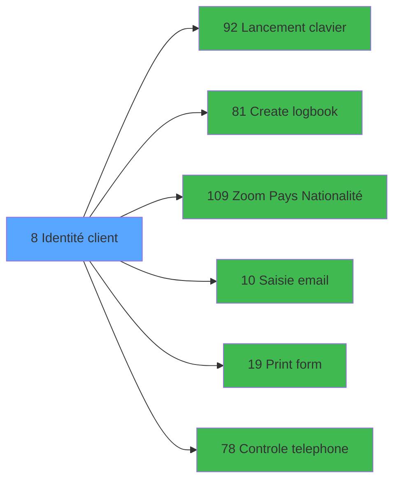

# WEL IDE 8 - Identité client

> **Analyse**: Phases 1-4 2026-02-03 21:12 -> 21:13 (18s) | Assemblage 21:13
> **Pipeline**: V7.2 Enrichi
> **Structure**: 4 onglets (Resume | Ecrans | Donnees | Connexions)

<!-- TAB:Resume -->

## 1. FICHE D'IDENTITE

| Attribut | Valeur |
|----------|--------|
| Projet | WEL |
| IDE Position | 8 |
| Nom Programme | Identité client |
| Fichier source | `Prg_8.xml` |
| Dossier IDE | Clients |
| Taches | 2 (0 ecrans visibles) |
| Tables modifiees | 1 |
| Programmes appeles | 6 |
| :warning: Statut | **ORPHELIN_POTENTIEL** |

## 2. DESCRIPTION FONCTIONNELLE

**Identité client** assure la gestion complete de ce processus.

Le flux de traitement s'organise en **1 blocs fonctionnels** :

- **Traitement** (2 taches) : traitements metier divers

**Donnees modifiees** : 1 tables en ecriture (gm-complet_______gmc).

## 3. BLOCS FONCTIONNELS

### 3.1 Traitement (2 taches)

Traitements internes.

---

#### 8 - Identité client

**Role** : Traitement : Identité client.
**Variables liees** : E (v.Type_Identité)
**Delegue a** : [Lancement clavier (IDE 92)](WEL-IDE-92.md)

---

#### 8.1 - IDENTITE CLIENT_GM

**Role** : Traitement : IDENTITE CLIENT_GM.
**Delegue a** : [Lancement clavier (IDE 92)](WEL-IDE-92.md)

## 5. REGLES METIER

*(Aucune regle metier identifiee)*

## 6. CONTEXTE

- **Appele par**: (aucun)
- **Appelle**: 6 programmes | **Tables**: 9 (W:1 R:0 L:8) | **Taches**: 2 | **Expressions**: 1

<!-- TAB:Ecrans -->

## 8. ECRANS

*(Programme sans ecran visible)*

## 9. NAVIGATION

### 9.3 Structure hierarchique (2 taches)

| Position | Tache | Type | Dimensions | Bloc |
|----------|-------|------|------------|------|
| **8.1** | [**Identité client** (8)](#t1) | - | - | Traitement |
| 8.1.1 | [IDENTITE CLIENT_GM (8.1)](#t2) | - | - | |

### 9.4 Algorigramme

> **Legende**: Vert = START/END OK | Rouge = END KO | Bleu = Decisions
> *Algorigramme auto-genere. Utiliser `/algorigramme` pour une synthese metier detaillee.*

<!-- TAB:Donnees -->

## 10. TABLES

### Tables utilisees (9)

| ID | Nom | Description | Type | R | W | L | Usages |
|----|-----|-------------|------|---|---|---|--------|
| 31 | gm-complet_______gmc |  | DB |   | **W** |   | 1 |
| 34 | hebergement______heb | Hebergement (chambres) | DB |   |   | L | 1 |
| 35 | personnel_go______go |  | DB |   |   | L | 1 |
| 36 | client_gm |  | DB |   |   | L | 1 |
| 119 | tables_pays_tel_ |  | DB |   |   | L | 1 |
| 121 | tables_pays_ventes | Donnees de ventes | DB |   |   | L | 1 |
| 131 | fichier_validation |  | DB |   |   | L | 1 |
| 285 | email |  | DB |   |   | L | 1 |
| 378 | pv_customer |  | DB |   |   | L | 1 |

### Colonnes par table (1 / 1 tables avec colonnes identifiees)

Table 31 - gm-complet_______gmc (**W**) - 1 usages

| Lettre | Variable | Acces | Type |
|--------|----------|-------|------|
| A | v.ErreurTelephone | W | Alpha |
| B | v.Male_Female_GM | W | Alpha |
| C | v.Male_Female_GO | W | Alpha |
| D | v.H_F_Viisible | W | Logical |
| E | v.Type_Identité | W | Alpha |
| F | v.Type_Id_Viisible | W | Logical |

## 11. VARIABLES

### 11.1 Variables de session (5)

Variables persistantes pendant toute la session.

| Lettre | Nom | Type | Usage dans |
|--------|-----|------|-----------|
| B | v.Male_Female_GM | Alpha | - |
| C | v.Male_Female_GO | Alpha | - |
| D | v.H_F_Viisible | Logical | - |
| E | v.Type_Identité | Alpha | - |
| F | v.Type_Id_Viisible | Logical | - |

### 11.2 Autres (1)

Variables diverses.

| Lettre | Nom | Type | Usage dans |
|--------|-----|------|-----------|
| A | v0.Refrech | Logical | - |

## 12. EXPRESSIONS

**1 / 1 expressions decodees (100%)**

### 12.1 Repartition par type

| Type | Expressions | Regles |
|------|-------------|--------|
| CONDITION | 1 | 0 |

### 12.2 Expressions cles par type

#### CONDITION (1 expressions)

| Type | IDE | Expression | Regle |
|------|-----|------------|-------|
| CONDITION | 1 | `LastClicked ()='b.PRINT'` | - |

<!-- TAB:Connexions -->

## 13. GRAPHE D'APPELS

### 13.1 Chaine depuis Main (Callers)

**Chemin**: (pas de callers directs)

### 13.2 Callers

| IDE | Nom Programme | Nb Appels |
|-----|---------------|-----------|
| - | (aucun) | - |

### 13.3 Callees (programmes appeles)

### 13.4 Detail Callees avec contexte

| IDE | Nom Programme | Appels | Contexte |
|-----|---------------|--------|----------|
| [92](WEL-IDE-92.md) | Lancement clavier | 12 | Sous-programme |
| [81](WEL-IDE-81.md) | Create logbook | 6 | Sous-programme |
| [109](WEL-IDE-109.md) | Zoom Pays Nationalité | 4 | Selection/consultation |
| [10](WEL-IDE-10.md) | Saisie email | 1 | Sous-programme |
| [19](WEL-IDE-19.md) | Print form | 1 | Impression ticket/document |
| [78](WEL-IDE-78.md) | Controle telephone | 1 | Controle/validation |

## 14. RECOMMANDATIONS MIGRATION

### 14.1 Profil du programme

| Metrique | Valeur | Impact migration |
|----------|--------|-----------------|
| Lignes de logique | 161 | Programme compact |
| Expressions | 1 | Peu de logique |
| Tables WRITE | 1 | Impact faible |
| Sous-programmes | 6 | Dependances moderees |
| Ecrans visibles | 0 | Ecran unique ou traitement batch |
| Code desactive | 0.6% (1 / 161) | Code sain |
| Regles metier | 0 | Pas de regle identifiee |

### 14.2 Plan de migration par bloc

#### Traitement (2 taches: 0 ecran, 2 traitements)

- **Strategie** : 2 service(s) backend injectable(s) (Domain Services).
- 6 sous-programme(s) a migrer ou a reutiliser depuis les services existants.
- Decomposer les taches en services unitaires testables.

### 14.3 Dependances critiques

| Dependance | Type | Appels | Impact |
|------------|------|--------|--------|
| gm-complet_______gmc | Table WRITE (Database) | 1x | Schema + repository |
| [Lancement clavier (IDE 92)](WEL-IDE-92.md) | Sous-programme | 12x | **CRITIQUE** - Sous-programme |
| [Create logbook (IDE 81)](WEL-IDE-81.md) | Sous-programme | 6x | **CRITIQUE** - Sous-programme |
| [Zoom Pays Nationalité (IDE 109)](WEL-IDE-109.md) | Sous-programme | 4x | **CRITIQUE** - Selection/consultation |
| [Controle telephone (IDE 78)](WEL-IDE-78.md) | Sous-programme | 1x | Normale - Controle/validation |
| [Print form (IDE 19)](WEL-IDE-19.md) | Sous-programme | 1x | Normale - Impression ticket/document |
| [Saisie email (IDE 10)](WEL-IDE-10.md) | Sous-programme | 1x | Normale - Sous-programme |

---
*Spec DETAILED generee par Pipeline V7.2 - 2026-02-03 21:13*
