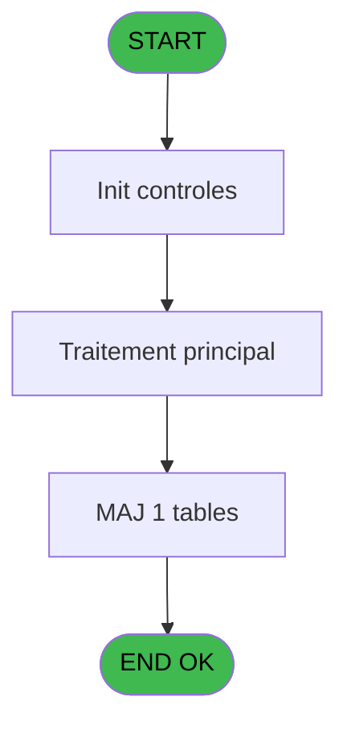
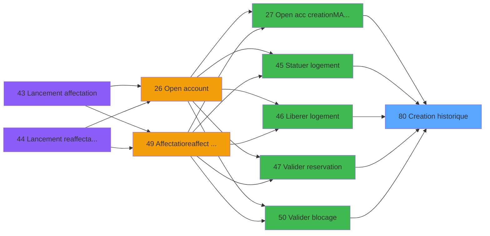

# WEL IDE 80 - Creation historique

> **Analyse**: Phases 1-4 2026-02-03 21:36 -> 21:36 (10s) | Assemblage 21:36
> **Pipeline**: V7.2 Enrichi
> **Structure**: 4 onglets (Resume | Ecrans | Donnees | Connexions)

<!-- TAB:Resume -->

## 1. FICHE D'IDENTITE

| Attribut | Valeur |
|----------|--------|
| Projet | WEL |
| IDE Position | 80 |
| Nom Programme | Creation historique |
| Fichier source | `Prg_80.xml` |
| Dossier IDE | Utilitaires |
| Taches | 1 (0 ecrans visibles) |
| Tables modifiees | 1 |
| Programmes appeles | 0 |

## 2. DESCRIPTION FONCTIONNELLE

**Creation historique** assure la gestion complete de ce processus, accessible depuis [Liberer logement (IDE 46)](WEL-IDE-46.md), [Open acc creation/MAJ garantie (IDE 27)](WEL-IDE-27.md), [Statuer logement (IDE 45)](WEL-IDE-45.md), [Valider reservation (IDE 47)](WEL-IDE-47.md), [Valider blocage (IDE 50)](WEL-IDE-50.md), [  Avancement Personnel (IDE 66)](WEL-IDE-66.md), [  Interruption Personnel (IDE 67)](WEL-IDE-67.md), [  Prolongation Personnel (IDE 69)](WEL-IDE-69.md), [   Avancement Client (IDE 71)](WEL-IDE-71.md), [   Interruption Client (IDE 72)](WEL-IDE-72.md), [   Prolongation Client (IDE 73)](WEL-IDE-73.md).

Le flux de traitement s'organise en **1 blocs fonctionnels** :

- **Creation** (1 tache) : insertion d'enregistrements en base (mouvements, prestations)

**Donnees modifiees** : 1 tables en ecriture (historik_station).

## 3. BLOCS FONCTIONNELS

### 3.1 Creation (1 tache)

Insertion de nouveaux enregistrements en base.

---

#### 80 - Creation historique

**Role** : Consultation/chargement : Creation historique.
**Variables liees** : A (P.Code historique)

## 5. REGLES METIER

*(Aucune regle metier identifiee)*

## 6. CONTEXTE

- **Appele par**: [Liberer logement (IDE 46)](WEL-IDE-46.md), [Open acc creation/MAJ garantie (IDE 27)](WEL-IDE-27.md), [Statuer logement (IDE 45)](WEL-IDE-45.md), [Valider reservation (IDE 47)](WEL-IDE-47.md), [Valider blocage (IDE 50)](WEL-IDE-50.md), [  Avancement Personnel (IDE 66)](WEL-IDE-66.md), [  Interruption Personnel (IDE 67)](WEL-IDE-67.md), [  Prolongation Personnel (IDE 69)](WEL-IDE-69.md), [   Avancement Client (IDE 71)](WEL-IDE-71.md), [   Interruption Client (IDE 72)](WEL-IDE-72.md), [   Prolongation Client (IDE 73)](WEL-IDE-73.md)
- **Appelle**: 0 programmes | **Tables**: 1 (W:1 R:0 L:0) | **Taches**: 1 | **Expressions**: 6

<!-- TAB:Ecrans -->

## 8. ECRANS

*(Programme sans ecran visible)*

## 9. NAVIGATION

### 9.3 Structure hierarchique (1 tache)

| Position | Tache | Type | Dimensions | Bloc |
|----------|-------|------|------------|------|
| **80.1** | [**Creation historique** (80)](#t1) | - | - | Creation |

### 9.4 Algorigramme

> **Legende**: Vert = START/END OK | Rouge = END KO | Bleu = Decisions
> *Algorigramme auto-genere. Utiliser `/algorigramme` pour une synthese metier detaillee.*

<!-- TAB:Donnees -->

## 10. TABLES

### Tables utilisees (1)

| ID | Nom | Description | Type | R | W | L | Usages |
|----|-----|-------------|------|---|---|---|--------|
| 88 | historik_station | Historique / journal | DB |   | **W** |   | 1 |

### Colonnes par table (1 / 1 tables avec colonnes identifiees)

Table 88 - historik_station (**W**) - 1 usages

| Lettre | Variable | Acces | Type |
|--------|----------|-------|------|
| A | P.Code historique | W | Alpha |
| B | P.Libelle | W | Alpha |

## 11. VARIABLES

### 11.1 Parametres entrants (2)

Variables recues du programme appelant ([Liberer logement (IDE 46)](WEL-IDE-46.md)).

| Lettre | Nom | Type | Usage dans |
|--------|-----|------|-----------|
| A | P.Code historique | Alpha | [80](#t1) |
| B | P.Libelle | Alpha | 1x parametre entrant |

## 12. EXPRESSIONS

**6 / 6 expressions decodees (100%)**

### 12.1 Repartition par type

| Type | Expressions | Regles |
|------|-------------|--------|
| DATE | 1 | 0 |
| REFERENCE_VG | 2 | 0 |
| OTHER | 3 | 0 |

### 12.2 Expressions cles par type

#### DATE (1 expressions)

| Type | IDE | Expression | Regle |
|------|-----|------------|-------|
| DATE | 3 | `Date()` | - |

#### REFERENCE_VG (2 expressions)

| Type | IDE | Expression | Regle |
|------|-----|------------|-------|
| REFERENCE_VG | 2 | `VG15` | - |
| REFERENCE_VG | 1 | `VG5` | - |

#### OTHER (3 expressions)

| Type | IDE | Expression | Regle |
|------|-----|------------|-------|
| OTHER | 6 | `P.Libelle [B]` | - |
| OTHER | 5 | `P.Code historique [A]` | - |
| OTHER | 4 | `Time()` | - |

<!-- TAB:Connexions -->

## 13. GRAPHE D'APPELS

### 13.1 Chaine depuis Main (Callers)

Main -> ... -> [Liberer logement (IDE 46)](WEL-IDE-46.md) -> **Creation historique (IDE 80)**

Main -> ... -> [Open acc creation/MAJ garantie (IDE 27)](WEL-IDE-27.md) -> **Creation historique (IDE 80)**

Main -> ... -> [Statuer logement (IDE 45)](WEL-IDE-45.md) -> **Creation historique (IDE 80)**

Main -> ... -> [Valider reservation (IDE 47)](WEL-IDE-47.md) -> **Creation historique (IDE 80)**

Main -> ... -> [Valider blocage (IDE 50)](WEL-IDE-50.md) -> **Creation historique (IDE 80)**

Main -> ... -> [  Avancement Personnel (IDE 66)](WEL-IDE-66.md) -> **Creation historique (IDE 80)**

Main -> ... -> [  Interruption Personnel (IDE 67)](WEL-IDE-67.md) -> **Creation historique (IDE 80)**

Main -> ... -> [  Prolongation Personnel (IDE 69)](WEL-IDE-69.md) -> **Creation historique (IDE 80)**

Main -> ... -> [   Avancement Client (IDE 71)](WEL-IDE-71.md) -> **Creation historique (IDE 80)**

Main -> ... -> [   Interruption Client (IDE 72)](WEL-IDE-72.md) -> **Creation historique (IDE 80)**

Main -> ... -> [   Prolongation Client (IDE 73)](WEL-IDE-73.md) -> **Creation historique (IDE 80)**

### 13.2 Callers

| IDE | Nom Programme | Nb Appels |
|-----|---------------|-----------|
| [46](WEL-IDE-46.md) | Liberer logement | 2 |
| [27](WEL-IDE-27.md) | Open acc creation/MAJ garantie | 1 |
| [45](WEL-IDE-45.md) | Statuer logement | 1 |
| [47](WEL-IDE-47.md) | Valider reservation | 1 |
| [50](WEL-IDE-50.md) | Valider blocage | 1 |
| [66](WEL-IDE-66.md) |   Avancement Personnel | 1 |
| [67](WEL-IDE-67.md) |   Interruption Personnel | 1 |
| [69](WEL-IDE-69.md) |   Prolongation Personnel | 1 |
| [71](WEL-IDE-71.md) |    Avancement Client | 1 |
| [72](WEL-IDE-72.md) |    Interruption Client | 1 |
| [73](WEL-IDE-73.md) |    Prolongation Client | 1 |

### 13.3 Callees (programmes appeles)

### 13.4 Detail Callees avec contexte

| IDE | Nom Programme | Appels | Contexte |
|-----|---------------|--------|----------|
| - | (aucun) | - | - |

## 14. RECOMMANDATIONS MIGRATION

### 14.1 Profil du programme

| Metrique | Valeur | Impact migration |
|----------|--------|-----------------|
| Lignes de logique | 11 | Programme compact |
| Expressions | 6 | Peu de logique |
| Tables WRITE | 1 | Impact faible |
| Sous-programmes | 0 | Peu de dependances |
| Ecrans visibles | 0 | Ecran unique ou traitement batch |
| Code desactive | 0% (0 / 11) | Code sain |
| Regles metier | 0 | Pas de regle identifiee |

### 14.2 Plan de migration par bloc

#### Creation (1 tache: 0 ecran, 1 traitement)

- **Strategie** : Repository pattern avec Entity Framework Core.
- Insertion via `IRepository<T>.CreateAsync()`

### 14.3 Dependances critiques

| Dependance | Type | Appels | Impact |
|------------|------|--------|--------|
| historik_station | Table WRITE (Database) | 1x | Schema + repository |

---
*Spec DETAILED generee par Pipeline V7.2 - 2026-02-03 21:37*
