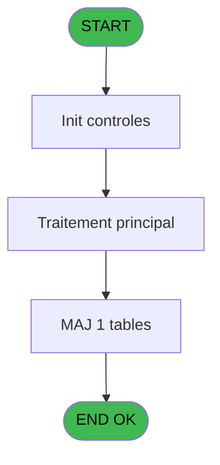
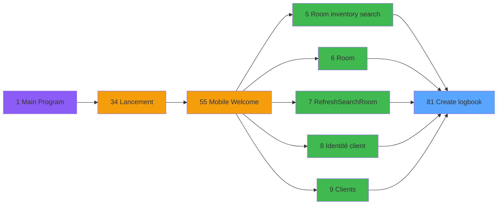

# WEL IDE 81 - Create logbook

> **Analyse**: Phases 1-4 2026-02-03 21:37 -> 21:37 (17s) | Assemblage 21:37
> **Pipeline**: V7.2 Enrichi
> **Structure**: 4 onglets (Resume | Ecrans | Donnees | Connexions)

<!-- TAB:Resume -->

## 1. FICHE D'IDENTITE

| Attribut | Valeur |
|----------|--------|
| Projet | WEL |
| IDE Position | 81 |
| Nom Programme | Create logbook |
| Fichier source | `Prg_81.xml` |
| Dossier IDE | Utilitaires |
| Taches | 1 (0 ecrans visibles) |
| Tables modifiees | 1 |
| Programmes appeles | 0 |

## 2. DESCRIPTION FONCTIONNELLE

**Create logbook** assure la gestion complete de ce processus, accessible depuis [Open phone line (IDE 58)](WEL-IDE-58.md), [Identité client (IDE 8)](WEL-IDE-8.md), [Home (IDE 56)](WEL-IDE-56.md), [Zoom Pays Nationalité (IDE 109)](WEL-IDE-109.md), [Fusion/Separation (IDE 33)](WEL-IDE-33.md), [Room inventory search (IDE 5)](WEL-IDE-5.md), [Scan CM pass (IDE 21)](WEL-IDE-21.md), [Encode CM pass (IDE 22)](WEL-IDE-22.md), [Open account (IDE 26)](WEL-IDE-26.md), [Lancement solde (IDE 75)](WEL-IDE-75.md), [Activate easy check out (IDE 101)](WEL-IDE-101.md), [Zoom code occupation (IDE 102)](WEL-IDE-102.md), [Zoom groupe arrivee depart (IDE 103)](WEL-IDE-103.md), [Zoom lieu de sejour (IDE 104)](WEL-IDE-104.md), [Zoom code logement (IDE 105)](WEL-IDE-105.md), [Zoom qualite (IDE 106)](WEL-IDE-106.md), [Zoom village/village (IDE 107)](WEL-IDE-107.md), [Zoom Mode paiement (IDE 110)](WEL-IDE-110.md), [Zoom Devise (IDE 111)](WEL-IDE-111.md), [Room (IDE 6)](WEL-IDE-6.md).

Le flux de traitement s'organise en **1 blocs fonctionnels** :

- **Creation** (1 tache) : insertion d'enregistrements en base (mouvements, prestations)

**Donnees modifiees** : 1 tables en ecriture (log_booker).

## 3. BLOCS FONCTIONNELS

### 3.1 Creation (1 tache)

Insertion de nouveaux enregistrements en base.

---

#### 81 - Create logbook

**Role** : Traitement : Create logbook.

## 5. REGLES METIER

*(Aucune regle metier identifiee)*

## 6. CONTEXTE

- **Appele par**: [Open phone line (IDE 58)](WEL-IDE-58.md), [Identité client (IDE 8)](WEL-IDE-8.md), [Home (IDE 56)](WEL-IDE-56.md), [Zoom Pays Nationalité (IDE 109)](WEL-IDE-109.md), [Fusion/Separation (IDE 33)](WEL-IDE-33.md), [Room inventory search (IDE 5)](WEL-IDE-5.md), [Scan CM pass (IDE 21)](WEL-IDE-21.md), [Encode CM pass (IDE 22)](WEL-IDE-22.md), [Open account (IDE 26)](WEL-IDE-26.md), [Lancement solde (IDE 75)](WEL-IDE-75.md), [Activate easy check out (IDE 101)](WEL-IDE-101.md), [Zoom code occupation (IDE 102)](WEL-IDE-102.md), [Zoom groupe arrivee depart (IDE 103)](WEL-IDE-103.md), [Zoom lieu de sejour (IDE 104)](WEL-IDE-104.md), [Zoom code logement (IDE 105)](WEL-IDE-105.md), [Zoom qualite (IDE 106)](WEL-IDE-106.md), [Zoom village/village (IDE 107)](WEL-IDE-107.md), [Zoom Mode paiement (IDE 110)](WEL-IDE-110.md), [Zoom Devise (IDE 111)](WEL-IDE-111.md), [Room (IDE 6)](WEL-IDE-6.md)
- **Appelle**: 0 programmes | **Tables**: 1 (W:1 R:0 L:0) | **Taches**: 1 | **Expressions**: 8

<!-- TAB:Ecrans -->

## 8. ECRANS

*(Programme sans ecran visible)*

## 9. NAVIGATION

### 9.3 Structure hierarchique (1 tache)

| Position | Tache | Type | Dimensions | Bloc |
|----------|-------|------|------------|------|
| **81.1** | [**Create logbook** (81)](#t1) | - | - | Creation |

### 9.4 Algorigramme

> **Legende**: Vert = START/END OK | Rouge = END KO | Bleu = Decisions
> *Algorigramme auto-genere. Utiliser `/algorigramme` pour une synthese metier detaillee.*

<!-- TAB:Donnees -->

## 10. TABLES

### Tables utilisees (1)

| ID | Nom | Description | Type | R | W | L | Usages |
|----|-----|-------------|------|---|---|---|--------|
| 911 | log_booker |  | DB |   | **W** |   | 1 |

### Colonnes par table (1 / 1 tables avec colonnes identifiees)

Table 911 - log_booker (**W**) - 1 usages

| Lettre | Variable | Acces | Type |
|--------|----------|-------|------|
| A | P.Compte | W | Numeric |
| B | P.Filiation | W | Numeric |
| C | P.Chambre | W | Alpha |
| D | P.Code operation | W | Alpha |
| E | P.Libelle operation | W | Alpha |

## 11. VARIABLES

### 11.1 Parametres entrants (5)

Variables recues du programme appelant ([Open phone line (IDE 58)](WEL-IDE-58.md)).

| Lettre | Nom | Type | Usage dans |
|--------|-----|------|-----------|
| A | P.Compte | Numeric | 1x parametre entrant |
| B | P.Filiation | Numeric | 1x parametre entrant |
| C | P.Chambre | Alpha | 1x parametre entrant |
| D | P.Code operation | Alpha | 1x parametre entrant |
| E | P.Libelle operation | Alpha | 1x parametre entrant |

## 12. EXPRESSIONS

**8 / 8 expressions decodees (100%)**

### 12.1 Repartition par type

| Type | Expressions | Regles |
|------|-------------|--------|
| DATE | 1 | 0 |
| REFERENCE_VG | 1 | 0 |
| OTHER | 6 | 0 |

### 12.2 Expressions cles par type

#### DATE (1 expressions)

| Type | IDE | Expression | Regle |
|------|-----|------------|-------|
| DATE | 4 | `Date()` | - |

#### REFERENCE_VG (1 expressions)

| Type | IDE | Expression | Regle |
|------|-----|------------|-------|
| REFERENCE_VG | 1 | `VG15` | - |

#### OTHER (6 expressions)

| Type | IDE | Expression | Regle |
|------|-----|------------|-------|
| OTHER | 6 | `P.Compte [A]` | - |
| OTHER | 7 | `P.Filiation [B]` | - |
| OTHER | 8 | `P.Chambre [C]` | - |
| OTHER | 2 | `P.Code operation [D]` | - |
| OTHER | 3 | `P.Libelle operation [E]` | - |
| ... | | *+1 autres* | |

<!-- TAB:Connexions -->

## 13. GRAPHE D'APPELS

### 13.1 Chaine depuis Main (Callers)

Main -> ... -> [Open phone line (IDE 58)](WEL-IDE-58.md) -> **Create logbook (IDE 81)**

Main -> ... -> [Identité client (IDE 8)](WEL-IDE-8.md) -> **Create logbook (IDE 81)**

Main -> ... -> [Home (IDE 56)](WEL-IDE-56.md) -> **Create logbook (IDE 81)**

Main -> ... -> [Zoom Pays Nationalité (IDE 109)](WEL-IDE-109.md) -> **Create logbook (IDE 81)**

Main -> ... -> [Fusion/Separation (IDE 33)](WEL-IDE-33.md) -> **Create logbook (IDE 81)**

Main -> ... -> [Room inventory search (IDE 5)](WEL-IDE-5.md) -> **Create logbook (IDE 81)**

Main -> ... -> [Scan CM pass (IDE 21)](WEL-IDE-21.md) -> **Create logbook (IDE 81)**

Main -> ... -> [Encode CM pass (IDE 22)](WEL-IDE-22.md) -> **Create logbook (IDE 81)**

Main -> ... -> [Open account (IDE 26)](WEL-IDE-26.md) -> **Create logbook (IDE 81)**

Main -> ... -> [Lancement solde (IDE 75)](WEL-IDE-75.md) -> **Create logbook (IDE 81)**

Main -> ... -> [Activate easy check out (IDE 101)](WEL-IDE-101.md) -> **Create logbook (IDE 81)**

Main -> ... -> [Zoom code occupation (IDE 102)](WEL-IDE-102.md) -> **Create logbook (IDE 81)**

Main -> ... -> [Zoom groupe arrivee depart (IDE 103)](WEL-IDE-103.md) -> **Create logbook (IDE 81)**

Main -> ... -> [Zoom lieu de sejour (IDE 104)](WEL-IDE-104.md) -> **Create logbook (IDE 81)**

Main -> ... -> [Zoom code logement (IDE 105)](WEL-IDE-105.md) -> **Create logbook (IDE 81)**

Main -> ... -> [Zoom qualite (IDE 106)](WEL-IDE-106.md) -> **Create logbook (IDE 81)**

Main -> ... -> [Zoom village/village (IDE 107)](WEL-IDE-107.md) -> **Create logbook (IDE 81)**

Main -> ... -> [Zoom Mode paiement (IDE 110)](WEL-IDE-110.md) -> **Create logbook (IDE 81)**

Main -> ... -> [Zoom Devise (IDE 111)](WEL-IDE-111.md) -> **Create logbook (IDE 81)**

Main -> ... -> [Room (IDE 6)](WEL-IDE-6.md) -> **Create logbook (IDE 81)**

### 13.2 Callers

| IDE | Nom Programme | Nb Appels |
|-----|---------------|-----------|
| [58](WEL-IDE-58.md) | Open phone line | 7 |
| [8](WEL-IDE-8.md) | Identité client | 6 |
| [56](WEL-IDE-56.md) | Home | 6 |
| [109](WEL-IDE-109.md) | Zoom Pays Nationalité | 6 |
| [33](WEL-IDE-33.md) | Fusion/Separation | 3 |
| [5](WEL-IDE-5.md) | Room inventory search | 2 |
| [21](WEL-IDE-21.md) | Scan CM pass | 2 |
| [22](WEL-IDE-22.md) | Encode CM pass | 2 |
| [26](WEL-IDE-26.md) | Open account | 2 |
| [75](WEL-IDE-75.md) | Lancement solde | 2 |
| [101](WEL-IDE-101.md) | Activate easy check out | 2 |
| [102](WEL-IDE-102.md) | Zoom code occupation | 2 |
| [103](WEL-IDE-103.md) | Zoom groupe arrivee depart | 2 |
| [104](WEL-IDE-104.md) | Zoom lieu de sejour | 2 |
| [105](WEL-IDE-105.md) | Zoom code logement | 2 |
| [106](WEL-IDE-106.md) | Zoom qualite | 2 |
| [107](WEL-IDE-107.md) | Zoom village/village | 2 |
| [110](WEL-IDE-110.md) | Zoom Mode paiement | 2 |
| [111](WEL-IDE-111.md) | Zoom Devise | 2 |
| [6](WEL-IDE-6.md) | Room | 1 |

### 13.3 Callees (programmes appeles)

### 13.4 Detail Callees avec contexte

| IDE | Nom Programme | Appels | Contexte |
|-----|---------------|--------|----------|
| - | (aucun) | - | - |

## 14. RECOMMANDATIONS MIGRATION

### 14.1 Profil du programme

| Metrique | Valeur | Impact migration |
|----------|--------|-----------------|
| Lignes de logique | 16 | Programme compact |
| Expressions | 8 | Peu de logique |
| Tables WRITE | 1 | Impact faible |
| Sous-programmes | 0 | Peu de dependances |
| Ecrans visibles | 0 | Ecran unique ou traitement batch |
| Code desactive | 0% (0 / 16) | Code sain |
| Regles metier | 0 | Pas de regle identifiee |

### 14.2 Plan de migration par bloc

#### Creation (1 tache: 0 ecran, 1 traitement)

- **Strategie** : Repository pattern avec Entity Framework Core.
- Insertion via `IRepository<T>.CreateAsync()`

### 14.3 Dependances critiques

| Dependance | Type | Appels | Impact |
|------------|------|--------|--------|
| log_booker | Table WRITE (Database) | 1x | Schema + repository |

---
*Spec DETAILED generee par Pipeline V7.2 - 2026-02-03 21:37*
