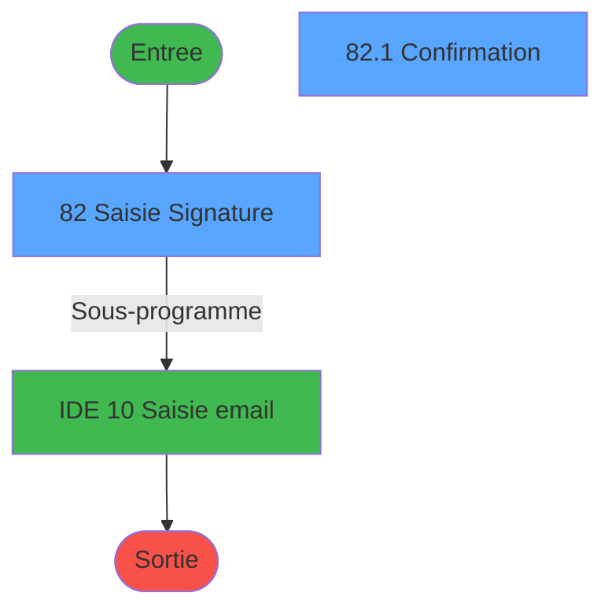
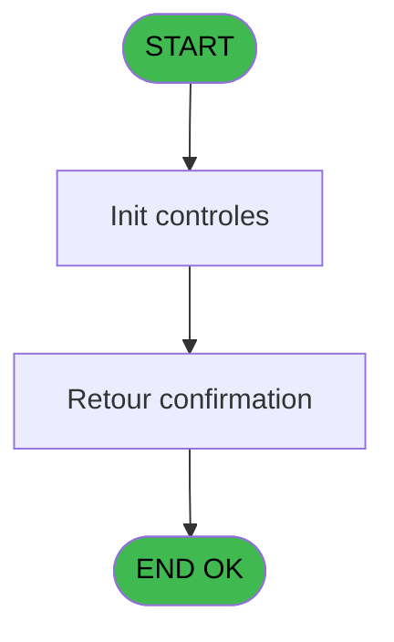
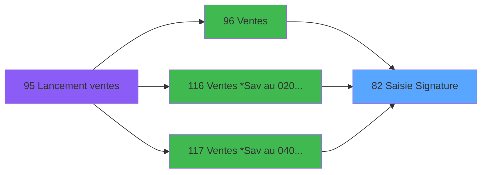

# WEL IDE 82 - Saisie Signature

> **Analyse**: Phases 1-4 2026-02-03 21:37 -> 21:37 (18s) | Assemblage 21:37
> **Pipeline**: V7.2 Enrichi
> **Structure**: 4 onglets (Resume | Ecrans | Donnees | Connexions)

<!-- TAB:Resume -->

## 1. FICHE D'IDENTITE

| Attribut | Valeur |
|----------|--------|
| Projet | WEL |
| IDE Position | 82 |
| Nom Programme | Saisie Signature |
| Fichier source | `Prg_82.xml` |
| Dossier IDE | Utilitaires |
| Taches | 2 (2 ecrans visibles) |
| Tables modifiees | 0 |
| Programmes appeles | 1 |

## 2. DESCRIPTION FONCTIONNELLE

**Saisie Signature** assure la gestion complete de ce processus, accessible depuis [Ventes (IDE 96)](WEL-IDE-96.md), [Ventes *Sav au 02/07/2018 (IDE 116)](WEL-IDE-116.md), [Ventes *Sav au 04/07/2018 (IDE 117)](WEL-IDE-117.md).

Le flux de traitement s'organise en **2 blocs fonctionnels** :

- **Traitement** (1 tache) : traitements metier divers
- **Saisie** (1 tache) : ecrans de saisie utilisateur (formulaires, champs, donnees)

**Logique metier** : 1 regles identifiees couvrant conditions metier.

Detail : phases du traitement

#### Phase 1 : Saisie (1 tache)

- **82** - Saisie Signature **[[ECRAN]](#ecran-t1)**

Delegue a : [Saisie email (IDE 10)](WEL-IDE-10.md)

#### Phase 2 : Traitement (1 tache)

- **82.1** - Confirmation **[[ECRAN]](#ecran-t9)**

## 3. BLOCS FONCTIONNELS

### 3.1 Saisie (1 tache)

L'operateur saisit les donnees de la transaction via 1 ecran (Saisie Signature).

---

#### 82 - Saisie Signature [[ECRAN]](#ecran-t1)

**Role** : Saisie des donnees : Saisie Signature.
**Ecran** : 1313 x 744 DLU (MDI) | [Voir mockup](#ecran-t1)
**Delegue a** : [Saisie email (IDE 10)](WEL-IDE-10.md)

### 3.2 Traitement (1 tache)

Traitements internes.

---

#### 82.1 - Confirmation [[ECRAN]](#ecran-t9)

**Role** : Traitement : Confirmation.
**Ecran** : 598 x 220 DLU (Type6) | [Voir mockup](#ecran-t9)
**Variables liees** : L (confirmationRetour)

## 5. REGLES METIER

1 regles identifiees:

### Autres (1 regles)

#### [RM-001] Condition toujours vraie (flag actif)

| Element | Detail |
|---------|--------|
| **Condition** | `p.Receive-Recept ? [F]='TRUE'LOG` |
| **Si vrai** | '√' |
| **Si faux** | ' ') |
| **Variables** | F (p.Receive-Recept ?) |
| **Expression source** | Expression 7 : `IF(p.Receive-Recept ? [F]='TRUE'LOG,'√',' ')` |
| **Exemple** | Si p.Receive-Recept ? [F]='TRUE'LOG → '√'. Sinon → ' ') |

## 6. CONTEXTE

- **Appele par**: [Ventes (IDE 96)](WEL-IDE-96.md), [Ventes *Sav au 02/07/2018 (IDE 116)](WEL-IDE-116.md), [Ventes *Sav au 04/07/2018 (IDE 117)](WEL-IDE-117.md)
- **Appelle**: 1 programmes | **Tables**: 0 (W:0 R:0 L:0) | **Taches**: 2 | **Expressions**: 20

<!-- TAB:Ecrans -->

## 8. ECRANS

### 8.1 Forms visibles (2 / 2)

| # | Position | Tache | Nom | Type | Largeur | Hauteur | Bloc |
|---|----------|-------|-----|------|---------|---------|------|
| 1 | 82 | 82 | Saisie Signature | MDI | 1313 | 744 | Saisie |
| 2 | 82.1 | 82.1 | Confirmation | Type6 | 598 | 220 | Traitement |

### 8.2 Mockups Ecrans

---

#### 82 - Saisie Signature
**Tache** : [82](#t1) | **Type** : MDI | **Dimensions** : 1313 x 744 DLU
**Bloc** : Saisie | **Titre IDE** : Saisie Signature

<!-- FORM-DATA:
{
    "width":  1313,
    "vFactor":  100,
    "type":  "MDI",
    "hFactor":  100,
    "controls":  [
                     {
                         "x":  182,
                         "type":  "label",
                         "var":  "",
                         "y":  0,
                         "w":  1130,
                         "fmt":  "",
                         "name":  "",
                         "h":  66,
                         "color":  "212",
                         "text":  "SIGNATURE",
                         "parent":  null
                     },
                     {
                         "x":  27,
                         "type":  "label",
                         "var":  "",
                         "y":  189,
                         "w":  1272,
                         "fmt":  "",
                         "name":  "",
                         "h":  44,
                         "color":  "220",
                         "text":  "",
                         "parent":  null
                     },
                     {
                         "x":  208,
                         "type":  "label",
                         "var":  "",
                         "y":  189,
                         "w":  181,
                         "fmt":  "",
                         "name":  "",
                         "h":  44,
                         "color":  "220",
                         "text":  "DECLINE E-Receipt",
                         "parent":  null
                     },
                     {
                         "x":  26,
                         "type":  "label",
                         "var":  "",
                         "y":  233,
                         "w":  1273,
                         "fmt":  "",
                         "name":  "",
                         "h":  32,
                         "color":  "",
                         "text":  "Signature  required  to validate purchase",
                         "parent":  null
                     },
                     {
                         "x":  26,
                         "type":  "label",
                         "var":  "",
                         "y":  189,
                         "w":  181,
                         "fmt":  "",
                         "name":  "",
                         "h":  44,
                         "color":  "220",
                         "text":  "RECEIPT SIGNATURE",
                         "parent":  4
                     },
                     {
                         "x":  433,
                         "type":  "label",
                         "var":  "",
                         "y":  111,
                         "w":  446,
                         "fmt":  "",
                         "name":  "",
                         "h":  44,
                         "color":  "227",
                         "text":  "you have to sign before entering an email !",
                         "parent":  null
                     },
                     {
                         "x":  443,
                         "type":  "combobox",
                         "var":  "",
                         "y":  194,
                         "w":  789,
                         "fmt":  "",
                         "name":  "p.Email address",
                         "h":  30,
                         "color":  "219",
                         "text":  "",
                         "parent":  null
                     },
                     {
                         "x":  0,
                         "type":  "image",
                         "var":  "",
                         "y":  0,
                         "w":  173,
                         "fmt":  "",
                         "name":  "RETOUR",
                         "h":  66,
                         "color":  "226",
                         "text":  "",
                         "parent":  null
                     },
                     {
                         "x":  394,
                         "type":  "checkbox",
                         "var":  "",
                         "y":  189,
                         "w":  46,
                         "fmt":  "",
                         "name":  "v.Receive-Recept ?",
                         "h":  44,
                         "color":  "219",
                         "text":  "",
                         "parent":  null
                     },
                     {
                         "x":  1236,
                         "type":  "edit",
                         "var":  "",
                         "y":  189,
                         "w":  46,
                         "fmt":  "+",
                         "name":  "B Change",
                         "h":  44,
                         "color":  "214",
                         "text":  "",
                         "parent":  null
                     },
                     {
                         "x":  26,
                         "type":  "edit",
                         "var":  "",
                         "y":  267,
                         "w":  1275,
                         "fmt":  "",
                         "name":  "Signature",
                         "h":  286,
                         "color":  "",
                         "text":  "",
                         "parent":  null
                     },
                     {
                         "x":  577,
                         "type":  "edit",
                         "var":  "",
                         "y":  635,
                         "w":  173,
                         "fmt":  "30",
                         "name":  "ERASE",
                         "h":  88,
                         "color":  "214",
                         "text":  "",
                         "parent":  null
                     }
                 ],
    "taskId":  "82",
    "height":  744
}
-->

<strong>Champs : 5 champs</strong>

| Pos (x,y) | Nom | Variable | Type |
|-----------|-----|----------|------|
| 443,194 | p.Email address | - | combobox |
| 394,189 | v.Receive-Recept ? | - | checkbox |
| 1236,189 | B Change | - | edit |
| 26,267 | Signature | - | edit |
| 577,635 | ERASE | - | edit |

---

#### 82.1 - Confirmation
**Tache** : [82.1](#t9) | **Type** : Type6 | **Dimensions** : 598 x 220 DLU
**Bloc** : Traitement | **Titre IDE** : Confirmation

<!-- FORM-DATA:
{
    "width":  598,
    "vFactor":  100,
    "type":  "Type6",
    "hFactor":  100,
    "controls":  [
                     {
                         "x":  78,
                         "type":  "label",
                         "var":  "",
                         "y":  45,
                         "w":  441,
                         "fmt":  "",
                         "name":  "",
                         "h":  24,
                         "color":  "181",
                         "text":  "you are leaving without signing. do you want to continue ?",
                         "parent":  null
                     },
                     {
                         "x":  310,
                         "type":  "edit",
                         "var":  "",
                         "y":  114,
                         "w":  148,
                         "fmt":  "Yes",
                         "name":  "Yes",
                         "h":  57,
                         "color":  "214",
                         "text":  "",
                         "parent":  null
                     },
                     {
                         "x":  127,
                         "type":  "edit",
                         "var":  "",
                         "y":  114,
                         "w":  148,
                         "fmt":  "No",
                         "name":  "No",
                         "h":  57,
                         "color":  "214",
                         "text":  "",
                         "parent":  null
                     }
                 ],
    "taskId":  "82.1",
    "height":  220
}
-->

<strong>Champs : 2 champs</strong>

| Pos (x,y) | Nom | Variable | Type |
|-----------|-----|----------|------|
| 310,114 | Yes | - | edit |
| 127,114 | No | - | edit |

## 9. NAVIGATION

### 9.1 Enchainement des ecrans

**Detail par enchainement :**

| Depuis | Action | Vers | Retour |
|--------|--------|------|--------|
| Saisie Signature | Sous-programme | [Saisie email (IDE 10)](WEL-IDE-10.md) | Retour ecran |

### 9.3 Structure hierarchique (2 taches)

| Position | Tache | Type | Dimensions | Bloc |
|----------|-------|------|------------|------|
| **82.1** | [**Saisie Signature** (82)](#t1) [mockup](#ecran-t1) | MDI | 1313x744 | Saisie |
| **82.2** | [**Confirmation** (82.1)](#t9) [mockup](#ecran-t9) | Type6 | 598x220 | Traitement |

### 9.4 Algorigramme

> **Legende**: Vert = START/END OK | Rouge = END KO | Bleu = Decisions
> *Algorigramme auto-genere. Utiliser `/algorigramme` pour une synthese metier detaillee.*

<!-- TAB:Donnees -->

## 10. TABLES

### Tables utilisees (0)

| ID | Nom | Description | Type | R | W | L | Usages |
|----|-----|-------------|------|---|---|---|--------|

### Colonnes par table (0 / 0 tables avec colonnes identifiees)

## 11. VARIABLES

### 11.1 Parametres entrants (7)

Variables recues du programme appelant ([Ventes (IDE 96)](WEL-IDE-96.md)).

| Lettre | Nom | Type | Usage dans |
|--------|-----|------|-----------|
| A | p.Ste | Alpha | - |
| B | p.Compte | Numeric | - |
| C | p.Filiation | Numeric | - |
| D | p.Filename | Alpha | - |
| E | p.Email address | Alpha | 1x parametre entrant |
| F | p.Receive-Recept ? | Logical | 2x parametre entrant |
| G | p.Continue | Logical | 1x parametre entrant |

### 11.2 Variables de session (4)

Variables persistantes pendant toute la session.

| Lettre | Nom | Type | Usage dans |
|--------|-----|------|-----------|
| H | v.nb strokes | Alpha | - |
| I | v.Decline Receive_Mail | Logical | - |
| J | v.InkPicture1 | Blob | 3x session |
| K | v.Envoi | Logical | - |

### 11.3 Autres (1)

Variables diverses.

| Lettre | Nom | Type | Usage dans |
|--------|-----|------|-----------|
| L | confirmationRetour | Logical | - |

## 12. EXPRESSIONS

**20 / 20 expressions decodees (100%)**

### 12.1 Repartition par type

| Type | Expressions | Regles |
|------|-------------|--------|
| CONCATENATION | 1 | 0 |
| CALCULATION | 1 | 0 |
| CAST_LOGIQUE | 3 | 5 |
| CONSTANTE | 1 | 0 |
| OTHER | 8 | 0 |
| NEGATION | 1 | 0 |
| REFERENCE_VG | 2 | 0 |
| CONDITION | 3 | 0 |

### 12.2 Expressions cles par type

#### CONCATENATION (1 expressions)

| Type | IDE | Expression | Regle |
|------|-----|------------|-------|
| CONCATENATION | 3 | `'cmd /c mkdir '&Translate ('%club_exportdata%')&'Welcome\images\'` | - |

#### CALCULATION (1 expressions)

| Type | IDE | Expression | Regle |
|------|-----|------------|-------|
| CALCULATION | 14 | `MlsTrans('+')` | - |

#### CAST_LOGIQUE (3 expressions)

| Type | IDE | Expression | Regle |
|------|-----|------------|-------|
| CAST_LOGIQUE | 7 | `IF(p.Receive-Recept ? [F]='TRUE'LOG,'√',' ')` | [RM-001](#rm-RM-001) |
| CAST_LOGIQUE | 18 | `'TRUE'LOG` | - |
| CAST_LOGIQUE | 5 | `'FALSE'LOG` | - |

#### CONSTANTE (1 expressions)

| Type | IDE | Expression | Regle |
|------|-----|------------|-------|
| CONSTANTE | 9 | `''` | - |

#### OTHER (8 expressions)

| Type | IDE | Expression | Regle |
|------|-----|------------|-------|
| OTHER | 13 | `ASCIIChr(13)&MlsTrans('ERASE SIGNATURE')` | - |
| OTHER | 10 | `v.InkPicture1 [J].Ink.Strokes.Count.ToString()` | - |
| OTHER | 17 | `[M]` | - |
| OTHER | 15 | `MlsTrans('you have to sign before entering an email !')` | - |
| OTHER | 2 | `SetCrsr(1)` | - |
| ... | | *+3 autres* | |

#### NEGATION (1 expressions)

| Type | IDE | Expression | Regle |
|------|-----|------------|-------|
| NEGATION | 8 | `NOT p.Receive-Recept ? [F]` | - |

#### REFERENCE_VG (2 expressions)

| Type | IDE | Expression | Regle |
|------|-----|------------|-------|
| REFERENCE_VG | 12 | `VG9` | - |
| REFERENCE_VG | 11 | `VG5` | - |

#### CONDITION (3 expressions)

| Type | IDE | Expression | Regle |
|------|-----|------------|-------|
| CONDITION | 20 | `Trim(p.Email address [E]) = ''` | - |
| CONDITION | 19 | `v.InkPicture1 [J].Ink.Strokes.Count > 0` | - |
| CONDITION | 16 | `v.InkPicture1 [J].Ink.Strokes.Count = 0` | - |

<!-- TAB:Connexions -->

## 13. GRAPHE D'APPELS

### 13.1 Chaine depuis Main (Callers)

Main -> ... -> [Ventes (IDE 96)](WEL-IDE-96.md) -> **Saisie Signature (IDE 82)**

Main -> ... -> [Ventes *Sav au 02/07/2018 (IDE 116)](WEL-IDE-116.md) -> **Saisie Signature (IDE 82)**

Main -> ... -> [Ventes *Sav au 04/07/2018 (IDE 117)](WEL-IDE-117.md) -> **Saisie Signature (IDE 82)**

### 13.2 Callers

| IDE | Nom Programme | Nb Appels |
|-----|---------------|-----------|
| [96](WEL-IDE-96.md) | Ventes | 1 |
| [116](WEL-IDE-116.md) | Ventes *Sav au 02/07/2018 | 1 |
| [117](WEL-IDE-117.md) | Ventes *Sav au 04/07/2018 | 1 |

### 13.3 Callees (programmes appeles)

### 13.4 Detail Callees avec contexte

| IDE | Nom Programme | Appels | Contexte |
|-----|---------------|--------|----------|
| [10](WEL-IDE-10.md) | Saisie email | 1 | Sous-programme |

## 14. RECOMMANDATIONS MIGRATION

### 14.1 Profil du programme

| Metrique | Valeur | Impact migration |
|----------|--------|-----------------|
| Lignes de logique | 46 | Programme compact |
| Expressions | 20 | Peu de logique |
| Tables WRITE | 0 | Impact faible |
| Sous-programmes | 1 | Peu de dependances |
| Ecrans visibles | 2 | Quelques ecrans |
| Code desactive | 2.2% (1 / 46) | Code sain |
| Regles metier | 1 | Quelques regles a preserver |

### 14.2 Plan de migration par bloc

#### Saisie (1 tache: 1 ecran, 0 traitement)

- **Strategie** : Formulaire React/Blazor avec validation Zod/FluentValidation.
- Reproduire 1 ecran : Saisie Signature
- Validation temps reel cote client + serveur

#### Traitement (1 tache: 1 ecran, 0 traitement)

- **Strategie** : 1 composant(s) UI (Razor/React) avec formulaires et validation.
- 1 sous-programme(s) a migrer ou a reutiliser depuis les services existants.
- Decomposer les taches en services unitaires testables.

### 14.3 Dependances critiques

| Dependance | Type | Appels | Impact |
|------------|------|--------|--------|
| [Saisie email (IDE 10)](WEL-IDE-10.md) | Sous-programme | 1x | Normale - Sous-programme |

---
*Spec DETAILED generee par Pipeline V7.2 - 2026-02-03 21:37*
