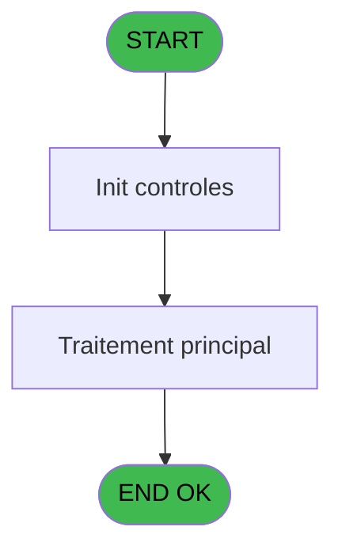
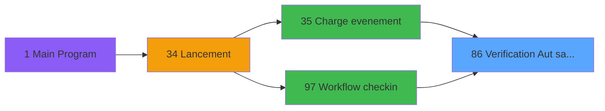

# WEL IDE 86 - Verification Aut sans ecran

> **Analyse**: Phases 1-4 2026-02-03 21:39 -> 21:39 (19s) | Assemblage 21:39
> **Pipeline**: V7.2 Enrichi
> **Structure**: 4 onglets (Resume | Ecrans | Donnees | Connexions)

<!-- TAB:Resume -->

## 1. FICHE D'IDENTITE

| Attribut | Valeur |
|----------|--------|
| Projet | WEL |
| IDE Position | 86 |
| Nom Programme | Verification Aut sans ecran |
| Fichier source | `Prg_86.xml` |
| Dossier IDE | Utilitaires |
| Taches | 20 (0 ecrans visibles) |
| Tables modifiees | 0 |
| Programmes appeles | 0 |

## 2. DESCRIPTION FONCTIONNELLE

**Verification Aut sans ecran** assure la gestion complete de ce processus, accessible depuis [Workflow checkin (IDE 97)](WEL-IDE-97.md), [Charge evenement (IDE 35)](WEL-IDE-35.md).

Le flux de traitement s'organise en **3 blocs fonctionnels** :

- **Traitement** (16 taches) : traitements metier divers
- **Validation** (3 taches) : controles et verifications de coherence
- **Creation** (1 tache) : insertion d'enregistrements en base (mouvements, prestations)

Detail : phases du traitement

#### Phase 1 : Validation (3 taches)

- **86** - Verification Autorisation
- **86.13** - Aut.Validation
- **86.14** - Aut.Devalidation

#### Phase 2 : Traitement (16 taches)

- **86.1** - Aut.Statut
- **86.3** - Aut.Modification
- **86.4** - Aut.Modification
- **86.5** - Aut.Affectation
- **86.6** - Aut.Affectation
- **86.7** - Aut.Prolongation
- **86.8** - Aut.Interruption
- **86.9** - Aut.Avancement
- **86.10** - Aut.Recodification
- **86.11** - Aut.Annulation
- **86.12** - Aut.Messagerie
- **86.15** - Aut.Immigration
- **86.16** - Aut.Liberation
- **86.17** - Aut.Blocage
- **86.18** - Aut.Statut
- **86.19** - Aut.Statut

#### Phase 3 : Creation (1 tache)

- **86.2** - Aut.Creation

## 3. BLOCS FONCTIONNELS

### 3.1 Validation (3 taches)

Controles de coherence : 3 taches verifient les donnees et conditions.

---

#### 86 - Verification Autorisation

**Role** : Verification : Verification Autorisation.
**Variables liees** : B (P0-Autorisation)

---

#### 86.13 - Aut.Validation

**Role** : Verification : Aut.Validation.

---

#### 86.14 - Aut.Devalidation

**Role** : Verification : Aut.Devalidation.

### 3.2 Traitement (16 taches)

Traitements internes.

---

#### 86.1 - Aut.Statut

**Role** : Traitement : Aut.Statut.

---

#### 86.3 - Aut.Modification

**Role** : Traitement : Aut.Modification.

---

#### 86.4 - Aut.Modification

**Role** : Traitement : Aut.Modification.

---

#### 86.5 - Aut.Affectation

**Role** : Traitement : Aut.Affectation.

---

#### 86.6 - Aut.Affectation

**Role** : Traitement : Aut.Affectation.

---

#### 86.7 - Aut.Prolongation

**Role** : Traitement : Aut.Prolongation.

---

#### 86.8 - Aut.Interruption

**Role** : Traitement : Aut.Interruption.

---

#### 86.9 - Aut.Avancement

**Role** : Traitement : Aut.Avancement.

---

#### 86.10 - Aut.Recodification

**Role** : Traitement : Aut.Recodification.

---

#### 86.11 - Aut.Annulation

**Role** : Traitement : Aut.Annulation.

---

#### 86.12 - Aut.Messagerie

**Role** : Traitement : Aut.Messagerie.

---

#### 86.15 - Aut.Immigration

**Role** : Traitement : Aut.Immigration.

---

#### 86.16 - Aut.Liberation

**Role** : Traitement : Aut.Liberation.

---

#### 86.17 - Aut.Blocage

**Role** : Traitement : Aut.Blocage.

---

#### 86.18 - Aut.Statut

**Role** : Traitement : Aut.Statut.

---

#### 86.19 - Aut.Statut

**Role** : Traitement : Aut.Statut.

### 3.3 Creation (1 tache)

Insertion de nouveaux enregistrements en base.

---

#### 86.2 - Aut.Creation

**Role** : Creation d'enregistrement : Aut.Creation.

## 5. REGLES METIER

*(Aucune regle metier identifiee)*

## 6. CONTEXTE

- **Appele par**: [Workflow checkin (IDE 97)](WEL-IDE-97.md), [Charge evenement (IDE 35)](WEL-IDE-35.md)
- **Appelle**: 0 programmes | **Tables**: 1 (W:0 R:1 L:0) | **Taches**: 20 | **Expressions**: 22

<!-- TAB:Ecrans -->

## 8. ECRANS

*(Programme sans ecran visible)*

## 9. NAVIGATION

### 9.3 Structure hierarchique (20 taches)

| Position | Tache | Type | Dimensions | Bloc |
|----------|-------|------|------------|------|
| **86.1** | [**Verification Autorisation** (86)](#t1) | MDI | - | Validation |
| 86.1.1 | [Aut.Validation (86.13)](#t14) | MDI | - | |
| 86.1.2 | [Aut.Devalidation (86.14)](#t15) | MDI | - | |
| **86.2** | [**Aut.Statut** (86.1)](#t2) | MDI | - | Traitement |
| 86.2.1 | [Aut.Modification (86.3)](#t4) | MDI | - | |
| 86.2.2 | [Aut.Modification (86.4)](#t5) | MDI | - | |
| 86.2.3 | [Aut.Affectation (86.5)](#t6) | MDI | - | |
| 86.2.4 | [Aut.Affectation (86.6)](#t7) | MDI | - | |
| 86.2.5 | [Aut.Prolongation (86.7)](#t8) | MDI | - | |
| 86.2.6 | [Aut.Interruption (86.8)](#t9) | MDI | - | |
| 86.2.7 | [Aut.Avancement (86.9)](#t10) | MDI | - | |
| 86.2.8 | [Aut.Recodification (86.10)](#t11) | MDI | - | |
| 86.2.9 | [Aut.Annulation (86.11)](#t12) | MDI | - | |
| 86.2.10 | [Aut.Messagerie (86.12)](#t13) | MDI | - | |
| 86.2.11 | [Aut.Immigration (86.15)](#t16) | MDI | - | |
| 86.2.12 | [Aut.Liberation (86.16)](#t17) | MDI | - | |
| 86.2.13 | [Aut.Blocage (86.17)](#t18) | MDI | - | |
| 86.2.14 | [Aut.Statut (86.18)](#t19) | MDI | - | |
| 86.2.15 | [Aut.Statut (86.19)](#t20) | MDI | - | |
| **86.3** | [**Aut.Creation** (86.2)](#t3) | MDI | - | Creation |

### 9.4 Algorigramme

> **Legende**: Vert = START/END OK | Rouge = END KO | Bleu = Decisions
> *Algorigramme auto-genere. Utiliser `/algorigramme` pour une synthese metier detaillee.*

<!-- TAB:Donnees -->

## 10. TABLES

### Tables utilisees (1)

| ID | Nom | Description | Type | R | W | L | Usages |
|----|-----|-------------|------|---|---|---|--------|
| 116 | tables_operateurs |  | DB | R |   |   | 19 |

### Colonnes par table (0 / 1 tables avec colonnes identifiees)

Table 116 - tables_operateurs (R) - 19 usages

*Table utilisee uniquement en Link ou aucune colonne Real identifiee dans le DataView.*

## 11. VARIABLES

### 11.1 Autres (4)

Variables diverses.

| Lettre | Nom | Type | Usage dans |
|--------|-----|------|-----------|
| A | P0-Societe | Alpha | - |
| B | P0-Autorisation | Alpha | 19x refs |
| C | P0-Accord Suite | Alpha | - |
| D | W0-Code F008 | Alpha | - |

## 12. EXPRESSIONS

**22 / 22 expressions decodees (100%)**

### 12.1 Repartition par type

| Type | Expressions | Regles |
|------|-------------|--------|
| CONSTANTE | 2 | 0 |
| CONDITION | 19 | 0 |
| REFERENCE_VG | 1 | 0 |

### 12.2 Expressions cles par type

#### CONSTANTE (2 expressions)

| Type | IDE | Expression | Regle |
|------|-----|------------|-------|
| CONSTANTE | 2 | `'F008'` | - |
| CONSTANTE | 1 | `'N'` | - |

#### CONDITION (19 expressions)

| Type | IDE | Expression | Regle |
|------|-----|------------|-------|
| CONDITION | 15 | `P0-Autorisation [B]='21'` | - |
| CONDITION | 16 | `P0-Autorisation [B]='22'` | - |
| CONDITION | 13 | `P0-Autorisation [B]='19'` | - |
| CONDITION | 14 | `P0-Autorisation [B]='20'` | - |
| CONDITION | 17 | `P0-Autorisation [B]='23'` | - |
| ... | | *+14 autres* | |

#### REFERENCE_VG (1 expressions)

| Type | IDE | Expression | Regle |
|------|-----|------------|-------|
| REFERENCE_VG | 22 | `VG63` | - |

### 12.3 Toutes les expressions (22)

Voir les 22 expressions

#### CONSTANTE (2)

| IDE | Expression Decodee |
|-----|-------------------|
| 1 | `'N'` |
| 2 | `'F008'` |

#### CONDITION (19)

| IDE | Expression Decodee |
|-----|-------------------|
| 3 | `P0-Autorisation [B]='09'` |
| 4 | `P0-Autorisation [B]='10'` |
| 5 | `P0-Autorisation [B]='11'` |
| 6 | `P0-Autorisation [B]='12'` |
| 7 | `P0-Autorisation [B]='13'` |
| 8 | `P0-Autorisation [B]='14'` |
| 9 | `P0-Autorisation [B]='15'` |
| 10 | `P0-Autorisation [B]='16'` |
| 11 | `P0-Autorisation [B]='17'` |
| 12 | `P0-Autorisation [B]='18'` |
| 13 | `P0-Autorisation [B]='19'` |
| 14 | `P0-Autorisation [B]='20'` |
| 15 | `P0-Autorisation [B]='21'` |
| 16 | `P0-Autorisation [B]='22'` |
| 17 | `P0-Autorisation [B]='23'` |
| 18 | `P0-Autorisation [B]='24'` |
| 19 | `P0-Autorisation [B]='25'` |
| 20 | `P0-Autorisation [B]='26'` |
| 21 | `P0-Autorisation [B]='27'` |

#### REFERENCE_VG (1)

| IDE | Expression Decodee |
|-----|-------------------|
| 22 | `VG63` |

<!-- TAB:Connexions -->

## 13. GRAPHE D'APPELS

### 13.1 Chaine depuis Main (Callers)

Main -> ... -> [Workflow checkin (IDE 97)](WEL-IDE-97.md) -> **Verification Aut sans ecran (IDE 86)**

Main -> ... -> [Charge evenement (IDE 35)](WEL-IDE-35.md) -> **Verification Aut sans ecran (IDE 86)**

### 13.2 Callers

| IDE | Nom Programme | Nb Appels |
|-----|---------------|-----------|
| [97](WEL-IDE-97.md) | Workflow checkin | 2 |
| [35](WEL-IDE-35.md) | Charge evenement | 1 |

### 13.3 Callees (programmes appeles)

### 13.4 Detail Callees avec contexte

| IDE | Nom Programme | Appels | Contexte |
|-----|---------------|--------|----------|
| - | (aucun) | - | - |

## 14. RECOMMANDATIONS MIGRATION

### 14.1 Profil du programme

| Metrique | Valeur | Impact migration |
|----------|--------|-----------------|
| Lignes de logique | 197 | Programme compact |
| Expressions | 22 | Peu de logique |
| Tables WRITE | 0 | Impact faible |
| Sous-programmes | 0 | Peu de dependances |
| Ecrans visibles | 0 | Ecran unique ou traitement batch |
| Code desactive | 0% (0 / 197) | Code sain |
| Regles metier | 0 | Pas de regle identifiee |

### 14.2 Plan de migration par bloc

#### Validation (3 taches: 0 ecran, 3 traitements)

- **Strategie** : FluentValidation avec validators specifiques.
- Chaque tache de validation -> un validator injectable

#### Traitement (16 taches: 0 ecran, 16 traitements)

- **Strategie** : 16 service(s) backend injectable(s) (Domain Services).
- Decomposer les taches en services unitaires testables.

#### Creation (1 tache: 0 ecran, 1 traitement)

- **Strategie** : Repository pattern avec Entity Framework Core.
- Insertion via `IRepository<T>.CreateAsync()`

### 14.3 Dependances critiques

| Dependance | Type | Appels | Impact |
|------------|------|--------|--------|

---
*Spec DETAILED generee par Pipeline V7.2 - 2026-02-03 21:39*
