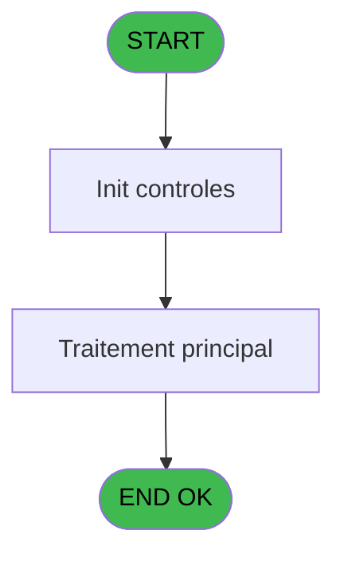
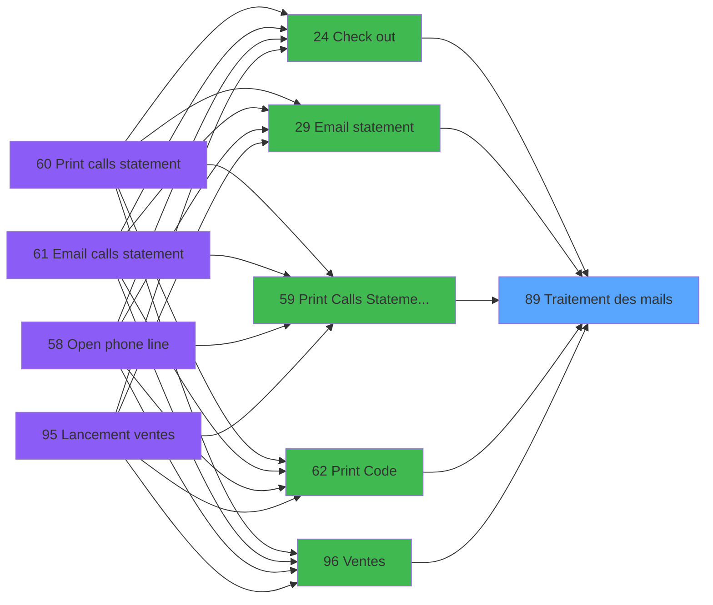

# WEL IDE 89 - Traitement des mails

> **Analyse**: Phases 1-4 2026-02-03 21:40 -> 21:40 (17s) | Assemblage 21:40
> **Pipeline**: V7.2 Enrichi
> **Structure**: 4 onglets (Resume | Ecrans | Donnees | Connexions)

<!-- TAB:Resume -->

## 1. FICHE D'IDENTITE

| Attribut | Valeur |
|----------|--------|
| Projet | WEL |
| IDE Position | 89 |
| Nom Programme | Traitement des mails |
| Fichier source | `Prg_89.xml` |
| Dossier IDE | Utilitaires |
| Taches | 1 (0 ecrans visibles) |
| Tables modifiees | 0 |
| Programmes appeles | 0 |

## 2. DESCRIPTION FONCTIONNELLE

**Traitement des mails** assure la gestion complete de ce processus, accessible depuis [Ventes (IDE 96)](WEL-IDE-96.md), [Ventes *Sav au 02/07/2018 (IDE 116)](WEL-IDE-116.md), [Ventes *Sav au 04/07/2018 (IDE 117)](WEL-IDE-117.md), [Check out (IDE 24)](WEL-IDE-24.md), [Email statement (IDE 29)](WEL-IDE-29.md), [Print Calls Statement Normal (IDE 59)](WEL-IDE-59.md), [Print Code (IDE 62)](WEL-IDE-62.md).

Le flux de traitement s'organise en **1 blocs fonctionnels** :

- **Traitement** (1 tache) : traitements metier divers

**Logique metier** : 1 regles identifiees couvrant conditions metier.

## 3. BLOCS FONCTIONNELS

### 3.1 Traitement (1 tache)

Traitements internes.

---

#### 89 - Traitement des mails

**Role** : Traitement : Traitement des mails.
**Variables liees** : A (P0.CodeTraitementMail)

## 5. REGLES METIER

1 regles identifiees:

### Autres (1 regles)

#### [RM-001] Si Trim([S]) vaut '3' alors 'FRA', sinon 'ENG'

| Element | Detail |
|---------|--------|
| **Condition** | `Trim([S])='3'` |
| **Si vrai** | 'FRA' |
| **Si faux** | 'ENG') |
| **Expression source** | Expression 11 : `IF(Trim([S])='3','FRA','ENG')` |
| **Exemple** | Si Trim([S])='3' → 'FRA'. Sinon → 'ENG') |

## 6. CONTEXTE

- **Appele par**: [Ventes (IDE 96)](WEL-IDE-96.md), [Ventes *Sav au 02/07/2018 (IDE 116)](WEL-IDE-116.md), [Ventes *Sav au 04/07/2018 (IDE 117)](WEL-IDE-117.md), [Check out (IDE 24)](WEL-IDE-24.md), [Email statement (IDE 29)](WEL-IDE-29.md), [Print Calls Statement Normal (IDE 59)](WEL-IDE-59.md), [Print Code (IDE 62)](WEL-IDE-62.md)
- **Appelle**: 0 programmes | **Tables**: 2 (W:0 R:1 L:1) | **Taches**: 1 | **Expressions**: 11

<!-- TAB:Ecrans -->

## 8. ECRANS

*(Programme sans ecran visible)*

## 9. NAVIGATION

### 9.3 Structure hierarchique (1 tache)

| Position | Tache | Type | Dimensions | Bloc |
|----------|-------|------|------------|------|
| **89.1** | [**Traitement des mails** (89)](#t1) | - | - | Traitement |

### 9.4 Algorigramme

> **Legende**: Vert = START/END OK | Rouge = END KO | Bleu = Decisions
> *Algorigramme auto-genere. Utiliser `/algorigramme` pour une synthese metier detaillee.*

<!-- TAB:Donnees -->

## 10. TABLES

### Tables utilisees (2)

| ID | Nom | Description | Type | R | W | L | Usages |
|----|-----|-------------|------|---|---|---|--------|
| 30 | gm-recherche_____gmr | Index de recherche | DB | R |   |   | 1 |
| 860 | resolution_ecran | Table temporaire ecran | DB |   |   | L | 1 |

### Colonnes par table (1 / 1 tables avec colonnes identifiees)

Table 30 - gm-recherche_____gmr (R) - 1 usages

| Lettre | Variable | Acces | Type |
|--------|----------|-------|------|
| A | P0.CodeTraitementMail | R | Alpha |
| B | P0.Mail_Adress | R | Alpha |
| C | P0.File_Mail | R | Alpha |

## 11. VARIABLES

### 11.1 Parametres entrants (3)

Variables recues du programme appelant ([Ventes (IDE 96)](WEL-IDE-96.md)).

| Lettre | Nom | Type | Usage dans |
|--------|-----|------|-----------|
| A | P0.CodeTraitementMail | Alpha | 1x parametre entrant |
| B | P0.Mail_Adress | Alpha | 1x parametre entrant |
| C | P0.File_Mail | Alpha | 1x parametre entrant |

## 12. EXPRESSIONS

**11 / 11 expressions decodees (100%)**

### 12.1 Repartition par type

| Type | Expressions | Regles |
|------|-------------|--------|
| CONDITION | 1 | 5 |
| CONSTANTE | 1 | 0 |
| DATE | 1 | 0 |
| REFERENCE_VG | 3 | 0 |
| OTHER | 2 | 0 |
| CAST_LOGIQUE | 1 | 0 |
| STRING | 2 | 0 |

### 12.2 Expressions cles par type

#### CONDITION (1 expressions)

| Type | IDE | Expression | Regle |
|------|-----|------------|-------|
| CONDITION | 11 | `IF(Trim([S])='3','FRA','ENG')` | [RM-001](#rm-RM-001) |

#### CONSTANTE (1 expressions)

| Type | IDE | Expression | Regle |
|------|-----|------------|-------|
| CONSTANTE | 10 | `'syspms@clubmed.com'` | - |

#### DATE (1 expressions)

| Type | IDE | Expression | Regle |
|------|-----|------------|-------|
| DATE | 8 | `Date()` | - |

#### REFERENCE_VG (3 expressions)

| Type | IDE | Expression | Regle |
|------|-----|------------|-------|
| REFERENCE_VG | 3 | `VG10` | - |
| REFERENCE_VG | 2 | `VG9` | - |
| REFERENCE_VG | 1 | `VG5` | - |

#### OTHER (2 expressions)

| Type | IDE | Expression | Regle |
|------|-----|------------|-------|
| OTHER | 9 | `Time()` | - |
| OTHER | 4 | `P0.CodeTraitementMail [A]` | - |

#### CAST_LOGIQUE (1 expressions)

| Type | IDE | Expression | Regle |
|------|-----|------------|-------|
| CAST_LOGIQUE | 5 | `'FALSE'LOG` | - |

#### STRING (2 expressions)

| Type | IDE | Expression | Regle |
|------|-----|------------|-------|
| STRING | 7 | `Trim(P0.Mail_Adress [B])` | - |
| STRING | 6 | `Trim(P0.File_Mail [C])` | - |

<!-- TAB:Connexions -->

## 13. GRAPHE D'APPELS

### 13.1 Chaine depuis Main (Callers)

Main -> ... -> [Ventes (IDE 96)](WEL-IDE-96.md) -> **Traitement des mails (IDE 89)**

Main -> ... -> [Ventes *Sav au 02/07/2018 (IDE 116)](WEL-IDE-116.md) -> **Traitement des mails (IDE 89)**

Main -> ... -> [Ventes *Sav au 04/07/2018 (IDE 117)](WEL-IDE-117.md) -> **Traitement des mails (IDE 89)**

Main -> ... -> [Check out (IDE 24)](WEL-IDE-24.md) -> **Traitement des mails (IDE 89)**

Main -> ... -> [Email statement (IDE 29)](WEL-IDE-29.md) -> **Traitement des mails (IDE 89)**

Main -> ... -> [Print Calls Statement Normal (IDE 59)](WEL-IDE-59.md) -> **Traitement des mails (IDE 89)**

Main -> ... -> [Print Code (IDE 62)](WEL-IDE-62.md) -> **Traitement des mails (IDE 89)**

### 13.2 Callers

| IDE | Nom Programme | Nb Appels |
|-----|---------------|-----------|
| [96](WEL-IDE-96.md) | Ventes | 2 |
| [116](WEL-IDE-116.md) | Ventes *Sav au 02/07/2018 | 2 |
| [117](WEL-IDE-117.md) | Ventes *Sav au 04/07/2018 | 2 |
| [24](WEL-IDE-24.md) | Check out | 1 |
| [29](WEL-IDE-29.md) | Email statement | 1 |
| [59](WEL-IDE-59.md) | Print Calls Statement Normal | 1 |
| [62](WEL-IDE-62.md) | Print Code | 1 |

### 13.3 Callees (programmes appeles)

### 13.4 Detail Callees avec contexte

| IDE | Nom Programme | Appels | Contexte |
|-----|---------------|--------|----------|
| - | (aucun) | - | - |

## 14. RECOMMANDATIONS MIGRATION

### 14.1 Profil du programme

| Metrique | Valeur | Impact migration |
|----------|--------|-----------------|
| Lignes de logique | 30 | Programme compact |
| Expressions | 11 | Peu de logique |
| Tables WRITE | 0 | Impact faible |
| Sous-programmes | 0 | Peu de dependances |
| Ecrans visibles | 0 | Ecran unique ou traitement batch |
| Code desactive | 0% (0 / 30) | Code sain |
| Regles metier | 1 | Quelques regles a preserver |

### 14.2 Plan de migration par bloc

#### Traitement (1 tache: 0 ecran, 1 traitement)

- **Strategie** : 1 service(s) backend injectable(s) (Domain Services).
- Decomposer les taches en services unitaires testables.

### 14.3 Dependances critiques

| Dependance | Type | Appels | Impact |
|------------|------|--------|--------|

---
*Spec DETAILED generee par Pipeline V7.2 - 2026-02-03 21:41*
