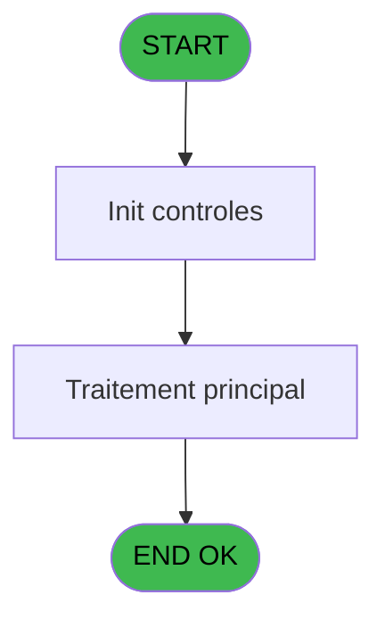
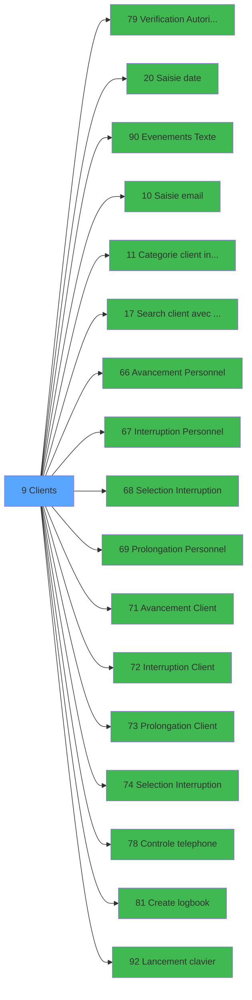

# WEL IDE 9 - Clients

> **Analyse**: Phases 1-4 2026-02-03 21:13 -> 21:13 (20s) | Assemblage 21:13
> **Pipeline**: V7.2 Enrichi
> **Structure**: 4 onglets (Resume | Ecrans | Donnees | Connexions)

<!-- TAB:Resume -->

## 1. FICHE D'IDENTITE

| Attribut | Valeur |
|----------|--------|
| Projet | WEL |
| IDE Position | 9 |
| Nom Programme | Clients |
| Fichier source | `Prg_9.xml` |
| Dossier IDE | Clients |
| Taches | 1 (0 ecrans visibles) |
| Tables modifiees | 0 |
| Programmes appeles | 17 |

## 2. DESCRIPTION FONCTIONNELLE

**Clients** assure la gestion complete de ce processus, accessible depuis [Mobile Welcome (IDE 55)](WEL-IDE-55.md).

Le flux de traitement s'organise en **1 blocs fonctionnels** :

- **Traitement** (1 tache) : traitements metier divers

**Logique metier** : 4 regles identifiees couvrant conditions metier.

## 3. BLOCS FONCTIONNELS

### 3.1 Traitement (1 tache)

Traitements internes.

---

#### 9 - Clients

**Role** : Traitement : Clients.
**Delegue a** : [Evenements (Texte) (IDE 90)](WEL-IDE-90.md), [Categorie client intialisation (IDE 11)](WEL-IDE-11.md), [Search client avec liste (IDE 17)](WEL-IDE-17.md)

## 5. REGLES METIER

4 regles identifiees:

### Autres (4 regles)

#### [RM-001] Si [BT]='O' alors '%club_images%Deposit.png' sinon '')

| Element | Detail |
|---------|--------|
| **Condition** | `[BT]='O'` |
| **Si vrai** | '%club_images%Deposit.png' |
| **Si faux** | '') |
| **Expression source** | Expression 6 : `IF([BT]='O','%club_images%Deposit.png','')` |
| **Exemple** | Si [BT]='O' → '%club_images%Deposit.png'. Sinon → '') |

#### [RM-002] Traitement si [AG] est non nul

| Element | Detail |
|---------|--------|
| **Condition** | `[AG]<>0` |
| **Si vrai** | '%club_images%Room_Vert.png' |
| **Si faux** | '%club_images%Room_Rouge.png') |
| **Expression source** | Expression 7 : `IF([AG]<>0,'%club_images%Room_Vert.png','%club_images%Room_R` |
| **Exemple** | Si [AG]<>0 → '%club_images%Room_Vert.png'. Sinon → '%club_images%Room_Rouge.png') |

#### [RM-003] Si [CP] alors [X] sinon IF(V0.Lieu sejour [G]<=Date(),[CW],''))

| Element | Detail |
|---------|--------|
| **Condition** | `[CP]` |
| **Si vrai** | [X] |
| **Si faux** | IF(V0.Lieu sejour [G]<=Date(),[CW],'')) |
| **Variables** | G (V0.Lieu sejour) |
| **Expression source** | Expression 22 : `IF([CP],[X],IF(V0.Lieu sejour [G]<=Date(),[CW],''))` |
| **Exemple** | Si [CP] → [X]. Sinon → IF(V0.Lieu sejour [G]<=Date(),[CW],'')) |

#### [RM-004] Si [CF] alors 'O' sinon 'N')

| Element | Detail |
|---------|--------|
| **Condition** | `[CF]` |
| **Si vrai** | 'O' |
| **Si faux** | 'N') |
| **Expression source** | Expression 51 : `IF([CF],'O','N')` |
| **Exemple** | Si [CF] → 'O'. Sinon → 'N') |

## 6. CONTEXTE

- **Appele par**: [Mobile Welcome (IDE 55)](WEL-IDE-55.md)
- **Appelle**: 17 programmes | **Tables**: 11 (W:0 R:1 L:10) | **Taches**: 1 | **Expressions**: 63

<!-- TAB:Ecrans -->

## 8. ECRANS

*(Programme sans ecran visible)*

## 9. NAVIGATION

### 9.3 Structure hierarchique (1 tache)

| Position | Tache | Type | Dimensions | Bloc |
|----------|-------|------|------------|------|
| **9.1** | [**Clients** (9)](#t1) | - | - | Traitement |

### 9.4 Algorigramme

> **Legende**: Vert = START/END OK | Rouge = END KO | Bleu = Decisions
> *Algorigramme auto-genere. Utiliser `/algorigramme` pour une synthese metier detaillee.*

<!-- TAB:Donnees -->

## 10. TABLES

### Tables utilisees (11)

| ID | Nom | Description | Type | R | W | L | Usages |
|----|-----|-------------|------|---|---|---|--------|
| 30 | gm-recherche_____gmr | Index de recherche | DB | R |   |   | 1 |
| 31 | gm-complet_______gmc |  | DB |   |   | L | 1 |
| 34 | hebergement______heb | Hebergement (chambres) | DB |   |   | L | 1 |
| 47 | compte_gm________cgm | Comptes GM (generaux) | DB |   |   | L | 1 |
| 103 | logement_client__loc |  | DB |   |   | L | 1 |
| 108 | code_logement____clo |  | DB |   |   | L | 1 |
| 119 | tables_pays_tel_ |  | DB |   |   | L | 1 |
| 121 | tables_pays_ventes | Donnees de ventes | DB |   |   | L | 1 |
| 130 | fichier_langue |  | DB |   |   | L | 1 |
| 131 | fichier_validation |  | DB |   |   | L | 1 |
| 285 | email |  | DB |   |   | L | 1 |

### Colonnes par table (3 / 1 tables avec colonnes identifiees)

Table 30 - gm-recherche_____gmr (R) - 1 usages

| Lettre | Variable | Acces | Type |
|--------|----------|-------|------|
| A | L_RetourPeriodeSejour | R | Logical |
| B | L.Retour_Logement | R | Logical |
| C | V0.Refresh view | R | Logical |
| D | V0.Date debut saisie | R | Date |
| E | V0.Date fin saisie | R | Date |
| F | V0.Autorisation avancement | R | Alpha |
| G | V0.Lieu sejour | R | Alpha |
| H | V0.Accord suite | R | Alpha |
| I | V0.Confirmation L | R | Logical |
| J | V0.Autorisation prolongement | R | Alpha |
| K | V0.autorisation interruption | R | Alpha |
| L | V0.Periode | R | Alpha |
| M | V0.Prolongation/Interruption | R | Alpha |
| N | V0.Message erreur telephone | R | Alpha |
| O | v0.Room | R | Alpha |

## 11. VARIABLES

### 11.1 Autres (15)

Variables diverses.

| Lettre | Nom | Type | Usage dans |
|--------|-----|------|-----------|
| A | L_RetourPeriodeSejour | Logical | 1x refs |
| B | L.Retour_Logement | Logical | 2x refs |
| C | V0.Refresh view | Logical | 2x refs |
| D | V0.Date debut saisie | Date | 3x refs |
| E | V0.Date fin saisie | Date | 3x refs |
| F | V0.Autorisation avancement | Alpha | - |
| G | V0.Lieu sejour | Alpha | 3x refs |
| H | V0.Accord suite | Alpha | - |
| I | V0.Confirmation L | Logical | 1x refs |
| J | V0.Autorisation prolongement | Alpha | - |
| K | V0.autorisation interruption | Alpha | - |
| L | V0.Periode | Alpha | - |
| M | V0.Prolongation/Interruption | Alpha | - |
| N | V0.Message erreur telephone | Alpha | - |
| O | v0.Room | Alpha | - |

## 12. EXPRESSIONS

**63 / 63 expressions decodees (100%)**

### 12.1 Repartition par type

| Type | Expressions | Regles |
|------|-------------|--------|
| CONCATENATION | 2 | 0 |
| FORMAT | 1 | 0 |
| CONDITION | 20 | 4 |
| CONSTANTE | 11 | 0 |
| DATE | 1 | 0 |
| NEGATION | 1 | 0 |
| OTHER | 24 | 0 |
| REFERENCE_VG | 3 | 0 |

### 12.2 Expressions cles par type

#### CONCATENATION (2 expressions)

| Type | IDE | Expression | Regle |
|------|-----|------------|-------|
| CONCATENATION | 9 | `'CLIENT'&' - '&Trim(V0.Date debut saisie [D])&' '&Trim(V0.Date fin saisie [E])` | - |
| CONCATENATION | 8 | `Trim([CN])&'-'&Trim([Z])` | - |

#### FORMAT (1 expressions)

| Type | IDE | Expression | Regle |
|------|-----|------------|-------|
| FORMAT | 13 | `Trim(Str(V0.Confirmation L [I],'2P0'))&' - '&Trim([P])` | - |

#### CONDITION (20 expressions)

| Type | IDE | Expression | Regle |
|------|-----|------------|-------|
| CONDITION | 22 | `IF([CP],[X],IF(V0.Lieu sejour [G]<=Date(),[CW],''))` | [RM-003](#rm-RM-003) |
| CONDITION | 51 | `IF([CF],'O','N')` | [RM-004](#rm-RM-004) |
| CONDITION | 6 | `IF([BT]='O','%club_images%Deposit.png','')` | [RM-001](#rm-RM-001) |
| CONDITION | 7 | `IF([AG]<>0,'%club_images%Room_Vert.png','%club_images%Room_Rouge.png')` | [RM-002](#rm-RM-002) |
| CONDITION | 55 | `[CI]='Z'` | - |
| ... | | *+15 autres* | |

#### CONSTANTE (11 expressions)

| Type | IDE | Expression | Regle |
|------|-----|------------|-------|
| CONSTANTE | 44 | `'14'` | - |
| CONSTANTE | 43 | `'16'` | - |
| CONSTANTE | 45 | `'15'` | - |
| CONSTANTE | 61 | `'CATEGORIE_CLIENT'` | - |
| CONSTANTE | 57 | `'O'` | - |
| ... | | *+6 autres* | |

#### DATE (1 expressions)

| Type | IDE | Expression | Regle |
|------|-----|------------|-------|
| DATE | 3 | `Date()` | - |

#### NEGATION (1 expressions)

| Type | IDE | Expression | Regle |
|------|-----|------------|-------|
| NEGATION | 2 | `NOT [CP]` | - |

#### OTHER (24 expressions)

| Type | IDE | Expression | Regle |
|------|-----|------------|-------|
| OTHER | 31 | `V0.Refresh view [C]` | - |
| OTHER | 34 | `L_RetourPeriodeSejour [A]` | - |
| OTHER | 35 | `L.Retour_Logement [B]` | - |
| OTHER | 28 | `[AP]` | - |
| OTHER | 29 | `IsFirstRecordCycle(0)` | - |
| ... | | *+19 autres* | |

#### REFERENCE_VG (3 expressions)

| Type | IDE | Expression | Regle |
|------|-----|------------|-------|
| REFERENCE_VG | 37 | `VG5` | - |
| REFERENCE_VG | 26 | `VG12` | - |
| REFERENCE_VG | 23 | `VG7` | - |

### 12.3 Toutes les expressions (63)

Voir les 63 expressions

#### CONCATENATION (2)

| IDE | Expression Decodee |
|-----|-------------------|
| 8 | `Trim([CN])&'-'&Trim([Z])` |
| 9 | `'CLIENT'&' - '&Trim(V0.Date debut saisie [D])&' '&Trim(V0.Date fin saisie [E])` |

#### FORMAT (1)

| IDE | Expression Decodee |
|-----|-------------------|
| 13 | `Trim(Str(V0.Confirmation L [I],'2P0'))&' - '&Trim([P])` |

#### CONDITION (20)

| IDE | Expression Decodee |
|-----|-------------------|
| 6 | `IF([BT]='O','%club_images%Deposit.png','')` |
| 7 | `IF([AG]<>0,'%club_images%Room_Vert.png','%club_images%Room_Rouge.png')` |
| 22 | `IF([CP],[X],IF(V0.Lieu sejour [G]<=Date(),[CW],''))` |
| 51 | `IF([CF],'O','N')` |
| 4 | `VG51='TB'` |
| 38 | `CndRange(VG9<>0,VG9)` |
| 46 | `[CC]='O'` |
| 47 | `[CG]='O' OR [CH]='O'` |
| 48 | `[CE]='O'` |
| 49 | `[R]='GM'` |
| 50 | `[R]='GO'` |
| 52 | `[CJ]='I'` |
| 53 | `[CJ]='P'` |
| 54 | `[CI]='N'` |
| 55 | `[CI]='Z'` |
| 56 | `[CI]='O'` |
| 63 | `CndRange(VG10<>0,VG10)` |
| 1 | `Trim([DB])<>''` |
| 33 | `CndRange(Trim(VG4)<>'',VG4)` |
| 59 | `Trim([CK])<>''` |

#### CONSTANTE (11)

| IDE | Expression Decodee |
|-----|-------------------|
| 16 | `'H'` |
| 17 | `'A'` |
| 18 | `'Z'` |
| 32 | `'CLIENT'` |
| 39 | `'B'` |
| 42 | `'E'` |
| 43 | `'16'` |
| 44 | `'14'` |
| 45 | `'15'` |
| 57 | `'O'` |
| 61 | `'CATEGORIE_CLIENT'` |

#### DATE (1)

| IDE | Expression Decodee |
|-----|-------------------|
| 3 | `Date()` |

#### NEGATION (1)

| IDE | Expression Decodee |
|-----|-------------------|
| 2 | `NOT [CP]` |

#### OTHER (24)

| IDE | Expression Decodee |
|-----|-------------------|
| 5 | `MlsTrans ('Call Client')` |
| 10 | `LocateAdd('V0.Date debut saisie [D]'VAR,VG3,VG3)` |
| 11 | `LocateAdd('V0.Date fin saisie [E]'VAR,VG4,VG4)` |
| 12 | `LocateReset(0)` |
| 14 | `[R]` |
| 15 | `V0.Autorisation avance... [F]` |
| 19 | `V0.Date debut saisie [D]` |
| 20 | `V0.Date fin saisie [E]` |
| 21 | `V0.Lieu sejour [G]` |
| 24 | `[CL]` |
| 25 | `[Q]` |
| 27 | `[AL]` |
| 28 | `[AP]` |
| 29 | `IsFirstRecordCycle(0)` |
| 30 | `L.Retour_Logement [B]` |
| 31 | `V0.Refresh view [C]` |
| 34 | `L_RetourPeriodeSejour [A]` |
| 35 | `L.Retour_Logement [B]` |
| 36 | `V0.Refresh view [C]` |
| 40 | `V0.Autorisation avance... [F]` |
| 41 | `V0.Lieu sejour [G]` |
| 58 | `[CK]` |
| 60 | `DbDel('{917,4}'DSOURCE,'')` |
| 62 | `[DB]` |

#### REFERENCE_VG (3)

| IDE | Expression Decodee |
|-----|-------------------|
| 23 | `VG7` |
| 26 | `VG12` |
| 37 | `VG5` |

<!-- TAB:Connexions -->

## 13. GRAPHE D'APPELS

### 13.1 Chaine depuis Main (Callers)

Main -> ... -> [Mobile Welcome (IDE 55)](WEL-IDE-55.md) -> **Clients (IDE 9)**

### 13.2 Callers

| IDE | Nom Programme | Nb Appels |
|-----|---------------|-----------|
| [55](WEL-IDE-55.md) | Mobile Welcome | 2 |

### 13.3 Callees (programmes appeles)

### 13.4 Detail Callees avec contexte

| IDE | Nom Programme | Appels | Contexte |
|-----|---------------|--------|----------|
| [79](WEL-IDE-79.md) | Verification Autorisation | 3 | Controle/validation |
| [20](WEL-IDE-20.md) | Saisie date | 2 | Sous-programme |
| [90](WEL-IDE-90.md) | Evenements (Texte) | 2 | Sous-programme |
| [10](WEL-IDE-10.md) | Saisie email | 1 | Sous-programme |
| [11](WEL-IDE-11.md) | Categorie client intialisation | 1 | Sous-programme |
| [17](WEL-IDE-17.md) | Search client avec liste | 1 | Configuration impression |
| [66](WEL-IDE-66.md) |   Avancement Personnel | 1 | Sous-programme |
| [67](WEL-IDE-67.md) |   Interruption Personnel | 1 | Sous-programme |
| [68](WEL-IDE-68.md) |   Selection Interruption | 1 | Selection/consultation |
| [69](WEL-IDE-69.md) |   Prolongation Personnel | 1 | Sous-programme |
| [71](WEL-IDE-71.md) |    Avancement Client | 1 | Sous-programme |
| [72](WEL-IDE-72.md) |    Interruption Client | 1 | Sous-programme |
| [73](WEL-IDE-73.md) |    Prolongation Client | 1 | Sous-programme |
| [74](WEL-IDE-74.md) |    Selection Interruption | 1 | Selection/consultation |
| [78](WEL-IDE-78.md) | Controle telephone | 1 | Controle/validation |
| [81](WEL-IDE-81.md) | Create logbook | 1 | Sous-programme |
| [92](WEL-IDE-92.md) | Lancement clavier | 1 | Sous-programme |

## 14. RECOMMANDATIONS MIGRATION

### 14.1 Profil du programme

| Metrique | Valeur | Impact migration |
|----------|--------|-----------------|
| Lignes de logique | 220 | Taille moyenne |
| Expressions | 63 | Logique moderee |
| Tables WRITE | 0 | Impact faible |
| Sous-programmes | 17 | Forte dependance |
| Ecrans visibles | 0 | Ecran unique ou traitement batch |
| Code desactive | 0.9% (2 / 220) | Code sain |
| Regles metier | 4 | Quelques regles a preserver |

### 14.2 Plan de migration par bloc

#### Traitement (1 tache: 0 ecran, 1 traitement)

- **Strategie** : 1 service(s) backend injectable(s) (Domain Services).
- 17 sous-programme(s) a migrer ou a reutiliser depuis les services existants.
- Decomposer les taches en services unitaires testables.

### 14.3 Dependances critiques

| Dependance | Type | Appels | Impact |
|------------|------|--------|--------|
| [Verification Autorisation (IDE 79)](WEL-IDE-79.md) | Sous-programme | 3x | **CRITIQUE** - Controle/validation |
| [Evenements (Texte) (IDE 90)](WEL-IDE-90.md) | Sous-programme | 2x | Haute - Sous-programme |
| [Saisie date (IDE 20)](WEL-IDE-20.md) | Sous-programme | 2x | Haute - Sous-programme |
| [   Prolongation Client (IDE 73)](WEL-IDE-73.md) | Sous-programme | 1x | Normale - Sous-programme |
| [   Interruption Client (IDE 72)](WEL-IDE-72.md) | Sous-programme | 1x | Normale - Sous-programme |
| [   Avancement Client (IDE 71)](WEL-IDE-71.md) | Sous-programme | 1x | Normale - Sous-programme |
| [   Selection Interruption (IDE 74)](WEL-IDE-74.md) | Sous-programme | 1x | Normale - Selection/consultation |
| [Lancement clavier (IDE 92)](WEL-IDE-92.md) | Sous-programme | 1x | Normale - Sous-programme |
| [Create logbook (IDE 81)](WEL-IDE-81.md) | Sous-programme | 1x | Normale - Sous-programme |
| [Controle telephone (IDE 78)](WEL-IDE-78.md) | Sous-programme | 1x | Normale - Controle/validation |

---
*Spec DETAILED generee par Pipeline V7.2 - 2026-02-03 21:13*
