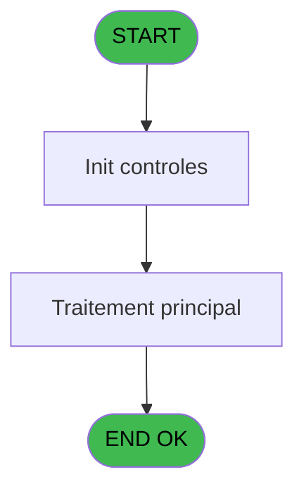
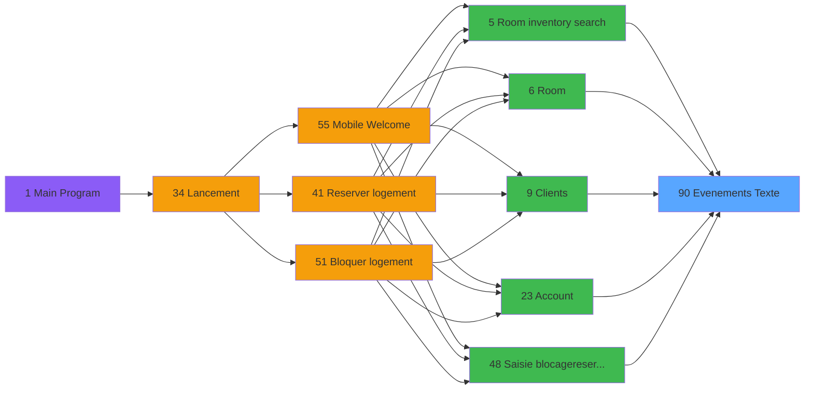

# WEL IDE 90 - Evenements (Texte)

> **Analyse**: Phases 1-4 2026-02-03 21:41 -> 21:41 (17s) | Assemblage 21:41
> **Pipeline**: V7.2 Enrichi
> **Structure**: 4 onglets (Resume | Ecrans | Donnees | Connexions)

<!-- TAB:Resume -->

## 1. FICHE D'IDENTITE

| Attribut | Valeur |
|----------|--------|
| Projet | WEL |
| IDE Position | 90 |
| Nom Programme | Evenements (Texte) |
| Fichier source | `Prg_90.xml` |
| Dossier IDE | Utilitaires |
| Taches | 1 (1 ecrans visibles) |
| Tables modifiees | 0 |
| Programmes appeles | 0 |

## 2. DESCRIPTION FONCTIONNELLE

**Evenements (Texte)** assure la gestion complete de ce processus, accessible depuis [Room inventory search (IDE 5)](WEL-IDE-5.md), [Room (IDE 6)](WEL-IDE-6.md), [Clients (IDE 9)](WEL-IDE-9.md), [Account (IDE 23)](WEL-IDE-23.md), [Saisie blocage/reserv room (IDE 48)](WEL-IDE-48.md), [Home (IDE 56)](WEL-IDE-56.md).

Le flux de traitement s'organise en **1 blocs fonctionnels** :

- **Traitement** (1 tache) : traitements metier divers

**Logique metier** : 1 regles identifiees couvrant conditions metier.

## 3. BLOCS FONCTIONNELS

### 3.1 Traitement (1 tache)

Traitements internes.

---

#### 90 - EVENEMENTS_V2 [[ECRAN]](#ecran-t1)

**Role** : Traitement : EVENEMENTS_V2.
**Ecran** : 175 x 673 DLU (Modal) | [Voir mockup](#ecran-t1)

## 5. REGLES METIER

1 regles identifiees:

### Autres (1 regles)

#### [RM-001] Si Trim([D])='EASY CHECKOUT' alors 216 sinon 214)

| Element | Detail |
|---------|--------|
| **Condition** | `Trim([D])='EASY CHECKOUT'` |
| **Si vrai** | 216 |
| **Si faux** | 214) |
| **Expression source** | Expression 3 : `IF(Trim([D])='EASY CHECKOUT',216,214)` |
| **Exemple** | Si Trim([D])='EASY CHECKOUT' → 216. Sinon → 214) |

## 6. CONTEXTE

- **Appele par**: [Room inventory search (IDE 5)](WEL-IDE-5.md), [Room (IDE 6)](WEL-IDE-6.md), [Clients (IDE 9)](WEL-IDE-9.md), [Account (IDE 23)](WEL-IDE-23.md), [Saisie blocage/reserv room (IDE 48)](WEL-IDE-48.md), [Home (IDE 56)](WEL-IDE-56.md)
- **Appelle**: 0 programmes | **Tables**: 1 (W:0 R:1 L:0) | **Taches**: 1 | **Expressions**: 6

<!-- TAB:Ecrans -->

## 8. ECRANS

### 8.1 Forms visibles (1 / 1)

| # | Position | Tache | Nom | Type | Largeur | Hauteur | Bloc |
|---|----------|-------|-----|------|---------|---------|------|
| 1 | 90 | 90 | EVENEMENTS_V2 | Modal | 175 | 673 | Traitement |

### 8.2 Mockups Ecrans

---

#### 90 - EVENEMENTS_V2
**Tache** : [90](#t1) | **Type** : Modal | **Dimensions** : 175 x 673 DLU
**Bloc** : Traitement | **Titre IDE** : EVENEMENTS_V2

<!-- FORM-DATA:
{
    "width":  175,
    "vFactor":  100,
    "type":  "Modal",
    "hFactor":  100,
    "controls":  [
                     {
                         "x":  0,
                         "type":  "table",
                         "var":  "",
                         "name":  "",
                         "titleH":  12,
                         "color":  "212",
                         "w":  175,
                         "y":  3,
                         "fmt":  "",
                         "parent":  null,
                         "text":  "",
                         "rowH":  88,
                         "h":  667,
                         "cols":  [
                                      {
                                          "title":  "Nom Bouton",
                                          "layer":  1,
                                          "w":  169
                                      }
                                  ],
                         "rows":  1
                     },
                     {
                         "x":  7,
                         "type":  "edit",
                         "var":  "",
                         "y":  11,
                         "w":  159,
                         "fmt":  "30",
                         "name":  "BOUTON",
                         "h":  79,
                         "color":  "214",
                         "text":  "",
                         "parent":  1
                     }
                 ],
    "taskId":  "90",
    "height":  673
}
-->

<strong>Champs : 1 champs</strong>

| Pos (x,y) | Nom | Variable | Type |
|-----------|-----|----------|------|
| 7,11 | BOUTON | - | edit |

## 9. NAVIGATION

Ecran unique: **EVENEMENTS_V2**

### 9.3 Structure hierarchique (1 tache)

| Position | Tache | Type | Dimensions | Bloc |
|----------|-------|------|------------|------|
| **90.1** | [**EVENEMENTS_V2** (90)](#t1) [mockup](#ecran-t1) | Modal | 175x673 | Traitement |

### 9.4 Algorigramme

> **Legende**: Vert = START/END OK | Rouge = END KO | Bleu = Decisions
> *Algorigramme auto-genere. Utiliser `/algorigramme` pour une synthese metier detaillee.*

<!-- TAB:Donnees -->

## 10. TABLES

### Tables utilisees (1)

| ID | Nom | Description | Type | R | W | L | Usages |
|----|-----|-------------|------|---|---|---|--------|
| 915 | web_api_cashup |  | DB | R |   |   | 1 |

### Colonnes par table (0 / 1 tables avec colonnes identifiees)

Table 915 - web_api_cashup (R) - 1 usages

*Table utilisee uniquement en Link ou aucune colonne Real identifiee dans le DataView.*

## 11. VARIABLES

*(Programme sans variables locales mappees)*

## 12. EXPRESSIONS

**6 / 6 expressions decodees (100%)**

### 12.1 Repartition par type

| Type | Expressions | Regles |
|------|-------------|--------|
| CONDITION | 2 | 5 |
| CONSTANTE | 1 | 0 |
| REFERENCE_VG | 1 | 0 |
| CAST_LOGIQUE | 1 | 0 |
| STRING | 1 | 0 |

### 12.2 Expressions cles par type

#### CONDITION (2 expressions)

| Type | IDE | Expression | Regle |
|------|-----|------------|-------|
| CONDITION | 3 | `IF(Trim([D])='EASY CHECKOUT',216,214)` | [RM-001](#rm-RM-001) |
| CONDITION | 6 | `Level(1)='RP'` | - |

#### CONSTANTE (1 expressions)

| Type | IDE | Expression | Regle |
|------|-----|------------|-------|
| CONSTANTE | 1 | `'O'` | - |

#### REFERENCE_VG (1 expressions)

| Type | IDE | Expression | Regle |
|------|-----|------------|-------|
| REFERENCE_VG | 4 | `VG1` | - |

#### CAST_LOGIQUE (1 expressions)

| Type | IDE | Expression | Regle |
|------|-----|------------|-------|
| CAST_LOGIQUE | 5 | `ProgIdx([E],'TRUE'LOG)` | - |

#### STRING (1 expressions)

| Type | IDE | Expression | Regle |
|------|-----|------------|-------|
| STRING | 2 | `ASCIIChr (13)&Trim([D])` | - |

<!-- TAB:Connexions -->

## 13. GRAPHE D'APPELS

### 13.1 Chaine depuis Main (Callers)

Main -> ... -> [Room inventory search (IDE 5)](WEL-IDE-5.md) -> **Evenements (Texte) (IDE 90)**

Main -> ... -> [Room (IDE 6)](WEL-IDE-6.md) -> **Evenements (Texte) (IDE 90)**

Main -> ... -> [Clients (IDE 9)](WEL-IDE-9.md) -> **Evenements (Texte) (IDE 90)**

Main -> ... -> [Account (IDE 23)](WEL-IDE-23.md) -> **Evenements (Texte) (IDE 90)**

Main -> ... -> [Saisie blocage/reserv room (IDE 48)](WEL-IDE-48.md) -> **Evenements (Texte) (IDE 90)**

Main -> ... -> [Home (IDE 56)](WEL-IDE-56.md) -> **Evenements (Texte) (IDE 90)**

### 13.2 Callers

| IDE | Nom Programme | Nb Appels |
|-----|---------------|-----------|
| [5](WEL-IDE-5.md) | Room inventory search | 2 |
| [6](WEL-IDE-6.md) | Room | 2 |
| [9](WEL-IDE-9.md) | Clients | 2 |
| [23](WEL-IDE-23.md) | Account | 2 |
| [48](WEL-IDE-48.md) | Saisie blocage/reserv room | 2 |
| [56](WEL-IDE-56.md) | Home | 2 |

### 13.3 Callees (programmes appeles)

### 13.4 Detail Callees avec contexte

| IDE | Nom Programme | Appels | Contexte |
|-----|---------------|--------|----------|
| - | (aucun) | - | - |

## 14. RECOMMANDATIONS MIGRATION

### 14.1 Profil du programme

| Metrique | Valeur | Impact migration |
|----------|--------|-----------------|
| Lignes de logique | 9 | Programme compact |
| Expressions | 6 | Peu de logique |
| Tables WRITE | 0 | Impact faible |
| Sous-programmes | 0 | Peu de dependances |
| Ecrans visibles | 1 | Ecran unique ou traitement batch |
| Code desactive | 0% (0 / 9) | Code sain |
| Regles metier | 1 | Quelques regles a preserver |

### 14.2 Plan de migration par bloc

#### Traitement (1 tache: 1 ecran, 0 traitement)

- **Strategie** : 1 composant(s) UI (Razor/React) avec formulaires et validation.
- Decomposer les taches en services unitaires testables.

### 14.3 Dependances critiques

| Dependance | Type | Appels | Impact |
|------------|------|--------|--------|

---
*Spec DETAILED generee par Pipeline V7.2 - 2026-02-03 21:41*
